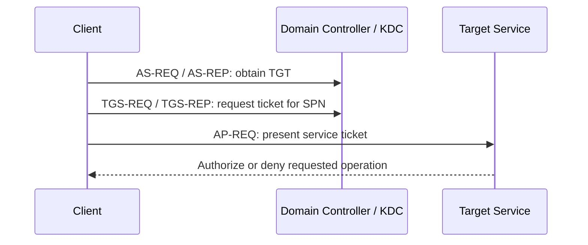

Kerberos lets a domain principal authenticate to services using tickets issued by a Key Distribution Center (KDC). In Active Directory, domain controllers provide the KDC role. Tickets establish identity between a client and a service; the service still makes its own authorization decision.

## Know the pieces

| Term | Meaning |
| --- | --- |
| KDC | The domain controller service that issues and validates Kerberos tickets. |
| TGT | A ticket used to request service tickets from the KDC. It is protected with the domain's `krbtgt` key. |
| TGS / service ticket | A ticket for one service principal name (SPN), such as `cifs/fs-01.northwind.example`. |
| SPN | The directory name that maps a service instance to its account. Common forms include `HTTP/host`, `cifs/host`, and `MSSQLSvc/host:port`. |
| PAC | Windows authorization data carried with a ticket, including identity and group information used by the service. |
| LUID | A local logon-session identifier. A user's ticket cache belongs to a particular logon session. |

## Follow a normal authentication flow

1. A client authenticates to the KDC and receives a TGT (AS exchange).
2. The client presents the TGT to request a ticket for a named SPN (TGS exchange).
3. The client presents that service ticket to the target service (AP exchange).
4. The service validates the ticket, then checks its own permissions for the requested action.



A successful ticket request means the KDC issued a ticket for that SPN. It does not mean the account can read a share, administer a server, or access a database. Keep authentication and authorization evidence separate in a report.

## Inspect the current logon session

On a Windows test endpoint, `klist` shows Kerberos tickets available to the current session. Run it as the named test user and do not elevate merely to inspect other users' caches.

```cmd
klist
```

Example output:

```text
Current LogonId is 0:0x2f5a21

Cached Tickets: (2)

#0> Client: analyst02 @ NORTHWIND.EXAMPLE
    Server: krbtgt/NORTHWIND.EXAMPLE @ NORTHWIND.EXAMPLE
    KerbTicket Encryption Type: AES-256-CTS-HMAC-SHA1-96
    Start Time: 9/25/2026 9:10:00 AM (local)
    End Time:   9/25/2026 7:10:00 PM (local)

#1> Client: analyst02 @ NORTHWIND.EXAMPLE
    Server: cifs/fs-01.northwind.example @ NORTHWIND.EXAMPLE
    KerbTicket Encryption Type: AES-256-CTS-HMAC-SHA1-96
    Start Time: 9/25/2026 9:12:00 AM (local)
    End Time:   9/25/2026 7:10:00 PM (local)
```

Compare client, service, session, and expiry with the operation log. Do not export ticket material to prove a cache entry exists.

## Resolve an SPN to its directory owner

Use the native `setspn` query against one in-scope SPN:

```cmd
setspn.exe -Q cifs/fs-01.northwind.example
```

Example output:

```text
Checking domain DC=northwind,DC=example
CN=File Services,OU=Service Accounts,DC=northwind,DC=example
        cifs/fs-01.northwind.example
Existing SPN found!
```

Record the exact SPN, owning account, service owner, and business purpose. Duplicate SPNs and aliases require investigation; do not infer the owner from the hostname alone.

## Rubeus ticket-cache triage

If the reviewed Rubeus binary is explicitly approved, `triage` lists ticket metadata in the current logon context. Verify the binary hash, run without elevation, and do not use `dump`, `monitor`, or `harvest` for an inventory question.

```powershell
Get-FileHash 'C:\Assessment\Tools\Rubeus.exe' -Algorithm SHA256
& 'C:\Assessment\Tools\Rubeus.exe' triage
```

Example output:

```text
[*] Action: Triage Kerberos Tickets (Current User)
[*] Current LUID    : 0x2f5a21
-----------------------------------------------------------------------------------------
| LUID      | UserName                       | Service                       | EndTime              |
-----------------------------------------------------------------------------------------
| 0x2f5a21  | analyst02 @ NORTHWIND.EXAMPLE  | krbtgt/NORTHWIND.EXAMPLE      | 9/25/2026 7:10:00 PM |
| 0x2f5a21  | analyst02 @ NORTHWIND.EXAMPLE  | cifs/fs-01.northwind.example  | 9/25/2026 7:10:00 PM |
-----------------------------------------------------------------------------------------
```

`LUID` identifies the session, `UserName` its owner, `Service` the ticket target, and `EndTime` the expiry. Output spacing and banner text vary by Rubeus release. Elevated use can display other users' sessions; stay in the test user's own context. Compare the metadata with `klist` and preserve only what the finding needs.

## Further reading

- [RFC 4120: The Kerberos Network Authentication Service](https://www.rfc-editor.org/rfc/rfc4120)
- [Microsoft Open Specifications: S4U overview](https://learn.microsoft.com/en-us/openspecs/windows_protocols/ms-sfu/36d103d2-61a6-42d5-a725-74de3205cdaf)
- [Microsoft Learn: UserAccountControl flags](https://learn.microsoft.com/en-us/troubleshoot/windows-server/active-directory/useraccountcontrol-manipulate-account-properties)
- [GhostPack Rubeus: triage command](https://github.com/GhostPack/Rubeus#triage)
