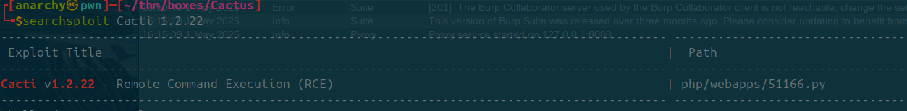
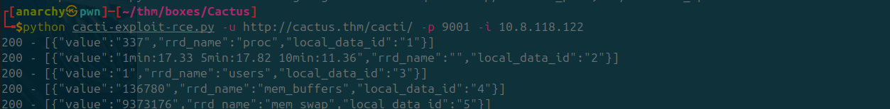
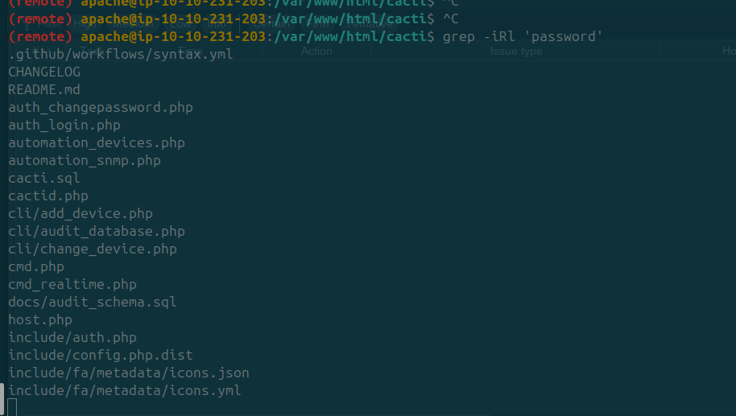

<div class="callout callout-warning">

**🚧 Work in Progress**: This writeup is marked **partial** in my notes: the attack chain below may stop short of a full root/completion.

</div>

<div class="callout callout-info">

**Box Info**

**Platform:** TryHackMe, **OS:** Linux (CentOS), **Difficulty:** Easy, **IP:** 10.10.231.203

</div>

<div class="callout callout-warning">

**Partial**

Recorded to the Cacti RCE + credential discovery; privesc not written up.

</div>

<div class="callout callout-abstract">

**Attack Path**

1. Wide surface, nginx (80), MariaDB (3306), **Kibana** (5601), X11 (6001), a **WebSockify/noVNC** service (17777), and **Apache + Cacti** (18888).
2. `feroxbuster` on `:18888` finds a directory hosting a **vulnerable Cacti** version → public exploit → **RCE** as the web user.
3. Loot `include/config.php` / `config.php.dist` → DB credentials.
4. (privesc) `.bash_history` of the `user` account shows heavy **Suricata** rule editing → likely `sudo` on `suricata`/a rule-reload script, or the noVNC/X11 path.

</div>

---

## Full Walkthrough

### Nmap scan

```bash
Not shown: 65528 closed tcp ports (conn-refused)
PORT      STATE SERVICE   REASON  VERSION
22/tcp    open  ssh       syn-ack OpenSSH 7.4 (protocol 2.0)
| ssh-hostkey: 
|   2048 b0:90:65:06:bb:59:ea:04:2f:29:e0:6d:2b:6c:59:cd (RSA)
| ssh-rsa AAAAB3NzaC1yc2EAAAADAQABAAABAQDGuVyB151zB5DMR+5DA62HH8R9h5buhUdVXZmqV9LrTwe36enlSerQgZkznwGYkTDnVXwSm7+S/37kyibmW1ZJVdP7ws29lofo3euRiGvA456uBIQxUnjOA92i/f6dD5SNZAUsB7k2tU6Ey3YFJQ4N2lLGZ5hXCXD+jRx7T0A5nyEeafy8Oyywoc/Houi5wbG2VmkPQ08p4O1MCp3XAnlGBhm/kNjQ0uuMvrNFm1ucdmFoShDKnr9zLoTQdCT5FdEnQYqygF+HNLjFDspAY8WbnINkFSYxqHuEkHMyOOCB9D8Pr2R0PfTeCYhGGS6hLEMDiqkGAbJFGbg5n619pfFf
|   256 d6:5b:04:b4:dd:15:41:d1:75:90:ae:36:25:c1:9e:68 (ECDSA)
| ecdsa-sha2-nistp256 AAAAE2VjZHNhLXNoYTItbmlzdHAyNTYAAAAIbmlzdHAyNTYAAABBBAL0Y4JdFHWfRCOaTpdLDHyfOWZalamCUDMgSNzgTfzy7C+6ZJLewymWw/yiEfP52/ECK91+dFEUwpMrZtVadRI=
|   256 cb:05:5c:e6:44:87:90:8f:92:13:71:06:e5:7d:7a:4b (ED25519)
|_ssh-ed25519 AAAAC3NzaC1lZDI1NTE5AAAAIJNFHTokH4Zqu7AO+0CjoODg5bw1Zx8nFvl9+jUREY+J
80/tcp    open  http      syn-ack nginx 1.20.1
|_http-server-header: nginx/1.20.1
|_http-title: Site doesn't have a title (text/html; charset=UTF-8).
| http-methods: 
|_  Supported Methods: GET HEAD POST OPTIONS
3306/tcp  open  mysql     syn-ack MariaDB (unauthorized)
5601/tcp  open  esmagent? syn-ack
| fingerprint-strings: 
|   GetRequest: 
|     HTTP/1.1 302 Found
|     location: /spaces/enter
|     x-content-type-options: nosniff
|     referrer-policy: no-referrer-when-downgrade
|     content-security-policy: script-src 'unsafe-eval' 'self'; worker-src blob: 'self'; style-src 'unsafe-inline' 'self'
|     kbn-name: ip-10-10-231-203
|     kbn-license-sig: e5e9cc9dacbe58ab9641e48e0392a6bd9f198a5181d5e37f30d96193fc6809c9
|     cache-control: private, no-cache, no-store, must-revalidate
|     content-length: 0
|     Date: Thu, 01 May 2025 20:26:52 GMT
|     Connection: close
|   HTTPOptions: 
|     HTTP/1.1 404 Not Found
|     X-Content-Type-Options: nosniff
|     Referrer-Policy: no-referrer-when-downgrade
|     Content-Security-Policy: script-src 'unsafe-eval' 'self'; worker-src blob: 'self'; style-src 'unsafe-inline' 'self'
|     kbn-name: ip-10-10-231-203
|     kbn-license-sig: e5e9cc9dacbe58ab9641e48e0392a6bd9f198a5181d5e37f30d96193fc6809c9
|     content-type: application/json; charset=utf-8
|     cache-control: private, no-cache, no-store, must-revalidate
|     content-length: 60
|     Date: Thu, 01 May 2025 20:26:52 GMT
|     Connection: close
|     {"statusCode":404,"error":"Not Found","message":"Not Found"}
|   RTSPRequest: 
|     HTTP/1.1 404 Not Found
|     X-Content-Type-Options: nosniff
|     Referrer-Policy: no-referrer-when-downgrade
|     Content-Security-Policy: script-src 'unsafe-eval' 'self'; worker-src blob: 'self'; style-src 'unsafe-inline' 'self'
|     kbn-name: ip-10-10-231-203
|     kbn-license-sig: e5e9cc9dacbe58ab9641e48e0392a6bd9f198a5181d5e37f30d96193fc6809c9
|     content-type: application/json; charset=utf-8
|     cache-control: private, no-cache, no-store, must-revalidate
|     content-length: 60
|     Date: Thu, 01 May 2025 20:26:53 GMT
|     Connection: close
|_    {"statusCode":404,"error":"Not Found","message":"Not Found"}
6001/tcp  open  X11       syn-ack (access denied)
17777/tcp open  sw-orion? syn-ack
| fingerprint-strings: 
|   GetRequest: 
|     HTTP/1.1 405 Method Not Allowed
|     Server: WebSockify Python/3.6.8
|     Date: Thu, 01 May 2025 20:26:45 GMT
|     Connection: close
|     Content-Type: text/html;charset=utf-8
|     Content-Length: 472
|     <!DOCTYPE HTML PUBLIC "-//W3C//DTD HTML 4.01//EN"
|     "http://www.w3.org/TR/html4/strict.dtd">
|     <html>
|     <head>
|     <meta http-equiv="Content-Type" content="text/html;charset=utf-8">
|     <title>Error response</title>
|     </head>
|     <body>
|     <h1>Error response</h1>
|     Error code: 405
|     Message: Method Not Allowed.
|     Error code explanation: 405 - Specified method is invalid for this resource.
|     </body>
|     </html>
|   HTTPOptions: 
|     HTTP/1.1 501 Unsupported method ('OPTIONS')
|     Server: WebSockify Python/3.6.8
|     Date: Thu, 01 May 2025 20:26:46 GMT
|     Connection: close
|     Content-Type: text/html;charset=utf-8
|     Content-Length: 500
|     <!DOCTYPE HTML PUBLIC "-//W3C//DTD HTML 4.01//EN"
|     "http://www.w3.org/TR/html4/strict.dtd">
|     <html>
|     <head>
|     <meta http-equiv="Content-Type" content="text/html;charset=utf-8">
|     <title>Error response</title>
|     </head>
|     <body>
|     <h1>Error response</h1>
|     Error code: 501
|     Message: Unsupported method ('OPTIONS').
|     Error code explanation: HTTPStatus.NOT_IMPLEMENTED - Server does not support this operation.
|     </body>
|_    </html>
18888/tcp open  http      syn-ack Apache httpd 2.4.6 ((CentOS) PHP/7.3.33)
| http-methods: 
|_  Supported Methods: GET HEAD POST OPTIONS
|_http-server-header: Apache/2.4.6 (CentOS) PHP/7.3.33
|_http-title: Site doesn't have a title (text/html; charset=UTF-8).
2 services unrecognized despite returning data. If you know the service/version, please submit the following fingerprints at https://nmap.org/cgi-bin/submit.cgi?new-service :
==============NEXT SERVICE FINGERPRINT (SUBMIT INDIVIDUALLY)==============
SF-Port5601-TCP:V=7.94SVN%I=7%D=5/1%Time=6813D90C%P=x86_64-pc-linux-gnu%r(
SF:GetRequest,1E9,"HTTP/1\.1\x20302\x20Found\r\nlocation:\x20/spaces/enter
SF:\r\nx-content-type-options:\x20nosniff\r\nreferrer-policy:\x20no-referr
SF:er-when-downgrade\r\ncontent-security-policy:\x20script-src\x20'unsafe-
SF:eval'\x20'self';\x20worker-src\x20blob:\x20'self';\x20style-src\x20'uns
SF:afe-inline'\x20'self'\r\nkbn-name:\x20ip-10-10-231-203\r\nkbn-license-s
SF:ig:\x20e5e9cc9dacbe58ab9641e48e0392a6bd9f198a5181d5e37f30d96193fc6809c9
SF:\r\ncache-control:\x20private,\x20no-cache,\x20no-store,\x20must-revali
SF:date\r\ncontent-length:\x200\r\nDate:\x20Thu,\x2001\x20May\x202025\x202
SF:0:26:52\x20GMT\r\nConnection:\x20close\r\n\r\n")%r(HTTPOptions,240,"HTT
SF:P/1\.1\x20404\x20Not\x20Found\r\nX-Content-Type-Options:\x20nosniff\r\n
SF:Referrer-Policy:\x20no-referrer-when-downgrade\r\nContent-Security-Poli
SF:cy:\x20script-src\x20'unsafe-eval'\x20'self';\x20worker-src\x20blob:\x2
SF:0'self';\x20style-src\x20'unsafe-inline'\x20'self'\r\nkbn-name:\x20ip-1
SF:0-10-231-203\r\nkbn-license-sig:\x20e5e9cc9dacbe58ab9641e48e0392a6bd9f1
SF:98a5181d5e37f30d96193fc6809c9\r\ncontent-type:\x20application/json;\x20
SF:charset=utf-8\r\ncache-control:\x20private,\x20no-cache,\x20no-store,\x
SF:20must-revalidate\r\ncontent-length:\x2060\r\nDate:\x20Thu,\x2001\x20Ma
SF:y\x202025\x2020:26:52\x20GMT\r\nConnection:\x20close\r\n\r\n{\"statusCo
SF:de\":404,\"error\":\"Not\x20Found\",\"message\":\"Not\x20Found\"}")%r(R
SF:TSPRequest,240,"HTTP/1\.1\x20404\x20Not\x20Found\r\nX-Content-Type-Opti
SF:ons:\x20nosniff\r\nReferrer-Policy:\x20no-referrer-when-downgrade\r\nCo
SF:ntent-Security-Policy:\x20script-src\x20'unsafe-eval'\x20'self';\x20wor
SF:ker-src\x20blob:\x20'self';\x20style-src\x20'unsafe-inline'\x20'self'\r
SF:\nkbn-name:\x20ip-10-10-231-203\r\nkbn-license-sig:\x20e5e9cc9dacbe58ab
SF:9641e48e0392a6bd9f198a5181d5e37f30d96193fc6809c9\r\ncontent-type:\x20ap
SF:plication/json;\x20charset=utf-8\r\ncache-control:\x20private,\x20no-ca
SF:che,\x20no-store,\x20must-revalidate\r\ncontent-length:\x2060\r\nDate:\
SF:x20Thu,\x2001\x20May\x202025\x2020:26:53\x20GMT\r\nConnection:\x20close
SF:\r\n\r\n{\"statusCode\":404,\"error\":\"Not\x20Found\",\"message\":\"No
SF:t\x20Found\"}");
==============NEXT SERVICE FINGERPRINT (SUBMIT INDIVIDUALLY)==============
SF-Port17777-TCP:V=7.94SVN%I=7%D=5/1%Time=6813D906%P=x86_64-pc-linux-gnu%r
SF:(GetRequest,290,"HTTP/1\.1\x20405\x20Method\x20Not\x20Allowed\r\nServer
SF::\x20WebSockify\x20Python/3\.6\.8\r\nDate:\x20Thu,\x2001\x20May\x202025
SF:\x2020:26:45\x20GMT\r\nConnection:\x20close\r\nContent-Type:\x20text/ht
SF:ml;charset=utf-8\r\nContent-Length:\x20472\r\n\r\n<!DOCTYPE\x20HTML\x20
SF:PUBLIC\x20\"-//W3C//DTD\x20HTML\x204\.01//EN\"\n\x20\x20\x20\x20\x20\x2
SF:0\x20\x20\"http://www\.w3\.org/TR/html4/strict\.dtd\">\n<html>\n\x20\x2
SF:0\x20\x20<head>\n\x20\x20\x20\x20\x20\x20\x20\x20<meta\x20http-equiv=\"
SF:Content-Type\"\x20content=\"text/html;charset=utf-8\">\n\x20\x20\x20\x2
SF:0\x20\x20\x20\x20<title>Error\x20response</title>\n\x20\x20\x20\x20</he
SF:ad>\n\x20\x20\x20\x20<body>\n\x20\x20\x20\x20\x20\x20\x20\x20<h1>Error\
SF:x20response</h1>\n\x20\x20\x20\x20\x20\x20\x20\x20Error\x20code:\x20
SF:405\n\x20\x20\x20\x20\x20\x20\x20\x20Message:\x20Method\x20Not\x
SF:20Allowed\.\n\x20\x20\x20\x20\x20\x20\x20\x20Error\x20code\x20ex
SF:planation:\x20405\x20-\x20Specified\x20method\x20is\x20invalid\x20for\x
SF:20this\x20resource\.\n\x20\x20\x20\x20</body>\n</html>\n")%r(HTTPOp
SF:tions,2B8,"HTTP/1\.1\x20501\x20Unsupported\x20method\x20\('OPTIONS'\)\r
SF:\nServer:\x20WebSockify\x20Python/3\.6\.8\r\nDate:\x20Thu,\x2001\x20May
SF:\x202025\x2020:26:46\x20GMT\r\nConnection:\x20close\r\nContent-Type:\x2
SF:0text/html;charset=utf-8\r\nContent-Length:\x20500\r\n\r\n<!DOCTYPE\x20
SF:HTML\x20PUBLIC\x20\"-//W3C//DTD\x20HTML\x204\.01//EN\"\n\x20\x20\x20\x2
SF:0\x20\x20\x20\x20\"http://www\.w3\.org/TR/html4/strict\.dtd\">\n<html>\
SF:n\x20\x20\x20\x20<head>\n\x20\x20\x20\x20\x20\x20\x20\x20<meta\x20http-
SF:equiv=\"Content-Type\"\x20content=\"text/html;charset=utf-8\">\n\x20\x2
SF:0\x20\x20\x20\x20\x20\x20<title>Error\x20response</title>\n\x20\x20\x20
SF:\x20</head>\n\x20\x20\x20\x20<body>\n\x20\x20\x20\x20\x20\x20\x20\x20<h
SF:1>Error\x20response</h1>\n\x20\x20\x20\x20\x20\x20\x20\x20Error\x20c
SF:ode:\x20501\n\x20\x20\x20\x20\x20\x20\x20\x20Message:\x20Unsuppo
SF:rted\x20method\x20\('OPTIONS'\)\.\n\x20\x20\x20\x20\x20\x20\x20\x20
SF:Error\x20code\x20explanation:\x20HTTPStatus\.NOT_IMPLEMENTED\x20-\x2
SF:0Server\x20does\x20not\x20support\x20this\x20operation\.\n\x20\x20\
SF:x20\x20</body>\n</html>\n");
Service Info: OS: Unix
```


### Rustscan scan

```bash
Open 10.10.231.203:22
Open 10.10.231.203:80
Open 10.10.231.203:3306
Open 10.10.231.203:5601
Open 10.10.231.203:6001
Open 10.10.231.203:17777
Open 10.10.231.203:18888
[~] Starting Script(s)
[>] Running script "nmap -vvv -p {{port}} {{ip}} -" on ip 10.10.231.203
Depending on the complexity of the script, results may take some time to appear.
Failed to resolve "-".
[~] 
Starting Nmap 7.60 ( https://nmap.org ) at 2025-05-01 16:18 EDT
Initiating Ping Scan at 16:18
Scanning 10.10.231.203 [2 ports]
Completed Ping Scan at 16:18, 0.10s elapsed (1 total hosts)
Initiating Parallel DNS resolution of 1 host. at 16:18
Completed Parallel DNS resolution of 1 host. at 16:18, 0.00s elapsed
DNS resolution of 1 IPs took 0.01s. Mode: Async [#: 1, OK: 0, NX: 1, DR: 0, SF: 0, TR: 1, CN: 0]
Initiating Connect Scan at 16:18
Scanning 10.10.231.203 [7 ports]
Discovered open port 80/tcp on 10.10.231.203
Discovered open port 3306/tcp on 10.10.231.203
Discovered open port 22/tcp on 10.10.231.203
Discovered open port 17777/tcp on 10.10.231.203
Discovered open port 18888/tcp on 10.10.231.203
Discovered open port 5601/tcp on 10.10.231.203
Discovered open port 6001/tcp on 10.10.231.203
Completed Connect Scan at 16:18, 0.09s elapsed (7 total ports)
Nmap scan report for 10.10.231.203
Host is up, received syn-ack (0.091s latency).
Scanned at 2025-05-01 16:18:26 EDT for 0s

PORT      STATE SERVICE   REASON
22/tcp    open  ssh       syn-ack
80/tcp    open  http      syn-ack
3306/tcp  open  mysql     syn-ack
5601/tcp  open  esmagent  syn-ack
6001/tcp  open  X11:1     syn-ack
17777/tcp open  sw-orion  syn-ack
18888/tcp open  apc-necmp syn-ack
```

#### Exploring the base syste

after logging into the user `user@10.10.231.203:tryhackme` I took a look at the `.bash_history` and found the following.

```bash
nano /etc/suricata/rules/cactus_exploit.rules
ls /etc/suricata/rules/
ls -lsa /etc/suricata/rules/
ls -lsa /etc/suricata/
ls -lsa /etc/suricata/rules/
ls -lsa /etc/suricata/
nano /etc/suricata/suricata.yaml 
cat /etc/suricata/suricata.yaml 
cd /var/log/suricata
ls -lsa
ls -lsa /var/log/suricata
```

After that I did some recon with `feroxbuster` to discover that there is a directory with a vulnerable version of `Cacti` installed which I found an exploit for and was able to gain RCE





started looking for files that possibly have passwords within and got the following results



from here I was able to find credentials within the `include/config.php.dist`
