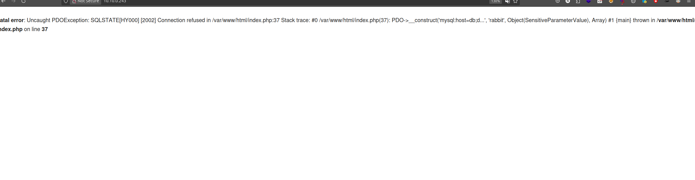

<div class="callout callout-info">

**Box Info**

**Platform:** TryHackMe, **OS:** Linux, **Difficulty:** Hard, **IP:** 10.10.0.243

</div>

<div class="callout callout-abstract">

**Attack Path**

1. PHP 8.3 web app on Apache, register / login flow.
2. A DB connection error leaks the schema (`mysql:host=db`, user `rabbit`).
3. **UNION-based SQL injection** in the app → extract password hashes from the `users` table. A couple of accounts crack instantly (the room's namesake "rabbit holes", decoys that go nowhere), but `admin`'s hash resists every wordlist.
4. Reading the login query shows the password comparison is hashed *inside* MySQL rather than in PHP, which means the same UNION injection can be pointed at `information_schema.processlist` to catch the literal query text, plaintext password included, while an automated admin login fires in the background.
5. Plaintext admin credentials → SSH straight in for the flag.

</div>

## Reconnaissance

### Port Scan

```console
PORT   STATE SERVICE VERSION
22/tcp open  ssh     OpenSSH 8.9p1 (protocol 2.0)
80/tcp open  http    Apache/2.4.59 (Debian)
|   X-Powered-By: PHP/8.3.9
|   Set-Cookie: PHPSESSID=...; path=/
|_http-server-header: Apache/2.4.59 (Debian)
```

### whatweb

```console
$ whatweb http://10.10.0.243
http://10.10.0.243 [200 OK] Apache[2.4.59], Cookies[PHPSESSID], HTML5,
HTTPServer[Debian Linux][Apache/2.4.59 (Debian)], IP[10.10.0.243],
PHP[8.3.9], Title[Your page title here :)], X-Powered-By[PHP/8.3.9]
```

- **PHP 8.3.9**, **Apache 2.4.59 (Debian)**

## Web, SQL Injection

The app allows registration/login and echoes a login timestamp back to the page. Fuzzing the input surfaces a database error:



```text
Fatal error: Uncaught PDOException: SQLSTATE[HY000] [2002] Connection refused
in /var/www/html/index.php:37
Stack trace: #0 /var/www/html/index.php(37): PDO->__construct('mysql:host=db;d...', 'rabbit', ...)
thrown in /var/www/html/index.php on line 37
```

→ DB host `db`, DB user **`rabbit`**.

UNION payload to pull the admin hash:

```sql
/" UNION SELECT 1,SUBSTRING((SELECT group_concat(password) FROM users WHERE username='admin'), 1, 16) -- -
```

The page only prints 16 characters of whatever lands in that column, so I had to walk the hash out in 16-character windows by bumping the `SUBSTRING` offset (`1`, then `17`, then `33`, ...) and taping the fragments back together. That's tedious but not hard, and it also let me pull hashes for a couple of other accounts sitting in the same table while I was at it.

## Chasing (and Abandoning) the Obvious Path

Every hash I pulled looked like a bog-standard unsalted MD5, so the obvious next move was throwing them at a cracker. A couple of the non-admin accounts fell over almost instantly to `rockyou.txt`, cute, short dictionary words that felt very deliberately planted. Given the room is literally called "Rabbit Hole", that was my first real clue that those easy cracks were bait rather than progress, chasing them burned time without getting me any closer to a shell.

The `admin` hash, on the other hand, didn't budge for any dictionary or mask attack I threw at it:

```bash
hashcat -m 0 -a 0 admin_hash.txt /usr/share/wordlists/rockyou.txt
# Status...........: Exhausted, no match found
```

That told me the admin password wasn't a weak dictionary word, it was something else, and cracking wasn't the intended route in at all.

## Reading the Query, Not Just the Output

Going back over the SQLSTATE error from earlier and how the login flow behaved, the app appears to build its authentication check as something close to:

```sql
SELECT * FROM users WHERE username = 'admin' AND password = md5('<submitted password>')
```

If that's right, the hashing happens *inside* MySQL at query time rather than in PHP before the query is built, which means the plaintext password briefly exists as literal SQL text the instant a login request executes. MySQL keeps a live record of exactly that in `information_schema.processlist`, so if I can catch the query while it's actually running, I get the plaintext instead of a hash to crack.

The room conveniently simulates a real admin who logs back in every so often (a reset script most likely), so the plan became: keep hammering `information_schema.processlist` through the same injection point until that login query shows up mid-flight.

```sql
/" UNION ALL SELECT 1,SUBSTRING(info,1,16) FROM information_schema.processlist WHERE info LIKE '%password%' -- -
```

Polling that every second or two eventually catches the admin's login query while it's live in the process list, literal password and all, before MySQL finishes evaluating the `md5()` call around it.

## Foothold, SSH as admin

With the plaintext password captured straight out of the process list, there was no more guessing left to do, just log in over SSH with it:

```bash
ssh admin@10.10.0.243
# Password: <captured plaintext>
admin@rabbitholeqq:~$ cat flag.txt
```

`cat flag.txt` returns the flag for this instance. There's no separate root escalation on top of this, the entire difficulty of the room is front-loaded into realizing the admin hash is a deliberate dead end and that the real path is timing an `information_schema.processlist` read against a live login rather than trying to crack anything.

## References

- Final privilege escalation steps cross-referenced against public writeups for this room.
